## 01. 시험 지도를 먼저 그리기

### 먼저 떠올릴 장면

처음 운전을 배운 사람이 목적지까지 가려면 자동차 부품 이름뿐 아니라 출발점, 길, 도착 조건을 알아야 한다. 머신러닝 공부도 같다. 수식만 외우면 입력 표를 만드는 곳에서 멈추고, 코드만 따라 치면 왜 검증 점수가 바뀌는지 설명하지 못한다. 이 강의의 목적은 앞으로 배울 내용을 하나의 작업 흐름에 놓는 것이다. 오늘의 성공 기준은 “시험을 잘 볼 것 같다”가 아니라 “작은 데이터를 받아 예측을 검사하기까지 필요한 단계를 내 말로 설명한다”다.

이 교재에서 필기는 개념을 구분하고 계산하는 연습, Process는 정해진 작은 기능을 구현하는 연습, Problem은 데이터부터 최종 예측까지 연결하는 연습으로 이해한다. 실제 시험의 시간, 문항 수, 허용 검색·도구·자료, 제출 방법은 응시 회차의 공식 안내가 우선한다. 아래의 50분·20문항 및 170분 일정은 시간 배분을 계산하기 위한 연습 조건이며, 현재 회차 규정을 새로 확인했다는 뜻이 아니다. 학습 분량을 마쳤다는 사실도 합격이나 특정 점수를 보장하지 않는다.

### 낯선 말부터 풀기

샘플은 관찰 대상 하나다. 자동차 한 대를 한 행으로 정했다면 자동차가 샘플이다. 특성 또는 feature는 무게처럼 예측에 쓰는 정보이며 보통 X로 쓴다. 정답 또는 target은 알고 싶은 연비처럼 학습 중 맞혀 볼 값이며 y로 쓴다. 모델은 X를 넣으면 예측값을 돌려주는 계산 규칙이다. 학습은 정답을 보면서 그 규칙의 조절 가능한 수치인 매개변수를 바꾸는 과정이다. 검증은 조절에 직접 쓰지 않은 데이터로 새 사례를 얼마나 잘 처리하는지 점검하는 과정이다.

지도학습은 입력과 정답의 짝에서 배운다. 연비처럼 연속적인 수를 맞히면 회귀, 고장·정상처럼 종류를 맞히면 분류다. 한 샘플에 여러 독립적인 표지가 동시에 붙으면 다중라벨 분류이고, 하나의 종류만 고르는 다중분류와 다르다. 비지도학습은 별도 정답 없이 비슷한 샘플끼리 묶거나 데이터를 적은 숫자로 표현한다. 자기지도학습은 가린 부분이나 다음 값을 원래 데이터에서 정답으로 만들어 배운다. 강화학습은 행동에 따라 받는 보상을 장기적으로 크게 만드는 규칙을 배운다. 어떤 학습이 우선 출제되는지는 용어의 중요성만으로 추정하지 않는다.

베이스라인은 비교를 시작할 수 있는 단순한 기준 모델이다. 정답 평균만 예측하는 회귀 모델도 유용한 베이스라인이다. 파이프라인은 읽기, 나누기, 전처리, 학습, 평가, 저장처럼 앞 단계 결과를 다음 단계로 넘기는 절차다. 딥러닝은 여러 신경망 층을 통해 예측에 필요한 표현까지 학습하는 방법이다. 복잡한 방법이 모든 작은 표 데이터에서 단순 모델보다 좋다는 서열은 없다. 데이터와 검증 결과가 선택의 근거다.

### 그림을 읽는 순서

먼저 축·색·연결 방향을 읽고, 각 그림 아래의 설명으로 확인하세요. 손계산은 다른 작은 숫자를 쓰는 독립 연습일 수 있습니다.

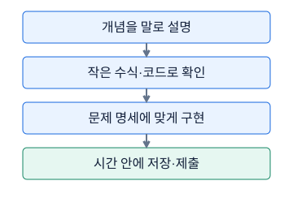

**그림 1-1. 필기와 실기는 서로 다른 행동을 확인한다**

각 상자는 다음 상자의 준비다. 설명을 읽었다는 사실과 코드를 혼자 작성했다는 사실을 구분한다. 일정·시간·허용 도구는 실제 회차 안내를 우선한다.

그림의 값·구조: 개념을 말로 설명 → 작은 수식·코드로 확인 → 문제 명세에 맞게 구현 → 시간 안에 저장·제출

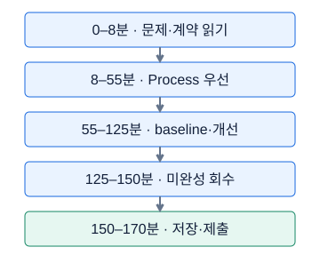

**그림 1-2. 170분 운영의 한 가지 예**

시간 배분은 예시이지 공식 권장안이나 합격 보장이 아니다. 첫 유효한 예측 파일을 빨리 만든 뒤 개선 시간을 조절한다.

그림의 값·구조: 0–8 훑기,8–55 Process,55–125 baseline과 개선,125–150 미완성,150–170 제출 확인. 독립적인 학습용 운영 예다.

### 숫자로 끝까지 따라가기

연습 조건으로 필기 20문항에 50분이 있다고 하자. 50÷20=2.5분이고, 0.5분×60초=30초이므로 평균 2분 30초다. 이것은 모든 문제를 정확히 같은 시간에 풀라는 뜻이 아니다. 마지막 검토에 10분을 남기면 첫 풀이에는 50−10=40분, 문제당 평균 40÷20=2분을 배정할 수 있다. 긴 계산 한 문제에 6분을 쓰면 평균보다 4분을 더 소비한다. 다른 문제를 빨리 끝내거나 재방문해야 한다는 판단 근거가 생긴다.

실기 연습 예산 170분을 전체 읽기 8분, 작은 구현 47분, 첫 베이스라인 10분, 개선 60분, 남은 구현 25분, 최종 학습·예측 13분, 제출 검사 7분으로 나누자. 합은 8+47+10+60+25+13+7=170이다. 누적 종료 시각은 8, 55, 65, 125, 150, 163, 170분이다. 첫 파일은 65분 시점에 확보하는 계획이며, 이는 보편적인 최적 일정이 아니라 자신의 속도를 측정할 출발점이다. 한 번 학습에 4분 걸리는 모델을 개선 구간에서 다섯 번 돌리면 4×5=20분, 나머지 분석·수정 예산은 60−20=40분이다. 학습 중 기다리는 시간도 지나가는 시간에 포함한다.

```python
import numpy as np

names = ["전체 읽기", "작은 구현", "첫 기준 모델", "개선", "남은 구현", "최종 예측", "검사"]
minutes = np.array([8, 47, 10, 60, 25, 13, 7])
ends = np.cumsum(minutes)
starts = np.r_[0, ends[:-1]]
for name, start, end in zip(names, starts, ends):
    print(f"{name}: {start}~{end}분")
assert minutes.sum() == 170
assert ends.tolist() == [8, 55, 65, 125, 150, 163, 170]
```

`cumsum`은 앞에서부터 더한 누적합이다. `ends[:-1]`은 마지막 종료 시각을 제외하며, 앞에 0을 붙여 다음 구간의 시작 시각을 만든다. `assert`는 뒤에 적은 조건이 참인지 검사하며 거짓이면 실행을 멈춰 가정이 틀렸음을 알려 준다. 데이터를 자동으로 고치는 명령은 아니다. 코드를 실행한 뒤 각 구간을 자신의 실측값으로 바꿔 보자. 총합이 170을 넘어서 검사 시간이 사라지면 공부 부족을 탓하기보다 계획을 먼저 수정한다.

### 시험 문제로 연결하기

필기에서는 “정답 없이 축을 찾는 방법인가?”, “예측은 확률인가 연속값인가?”처럼 정의의 경계를 묻는 문제를 연습한다. Process에서는 함수명, 입력 자료형, 출력 모양, 원본 변경 여부, 빈 입력 처리의 다섯 항목을 코드 작성 전에 적는다. Problem에서는 평가 지표, 분할 단위, 예측해야 하는 행 수와 순서를 먼저 기록한다. 이 세 종류는 서로 대체되지 않는다. 모델 이름을 잘 알아도 저장한 예측이 다른 차량 순서이면 작업이 끝난 것이 아니다.

학습 자료는 수학, 데이터 처리, 특성, 고전 모델, 검증·평가, 규제·최적화, 신경망 기초, 이미지, 시계열, 생성·응용, 실전 연습의 연결로 읽는다. 처음부터 모든 장을 같은 깊이로 암기하지 말고 선행 개념을 먼저 확보한다. 예를 들어 행렬곱의 축을 읽은 뒤 선형층을 공부하고, 조건부확률을 이해한 뒤 분류 지표를 공부하면 용어가 서로 설명해 준다. 회차별 규정에서 허용 여부를 확인하지 않은 개인 메모나 외부 서비스를 시험 중 사용 가능한 자료라고 가정해서는 안 된다.

### 자주 헷갈리는 지점

오픈북은 외부 수단을 무제한 허용한다는 말이 아니다. 공식 검색도 허용 범위가 있을 수 있으므로 검색 대상과 통신·코드 실행 제한을 실제 안내에서 구분한다. 연습에서 도움을 받아 완성한 코드는 출발점이지 혼자 재현할 능력의 증명은 아니다. 노트북 셀을 순서 없이 실행한 뒤 성공한 결과도 깨끗한 상태에서 다시 실행하면 실패할 수 있다. 마지막 연습에는 처음부터 다시 실행하는 검사를 넣는다.

시간이 모자랄 때 항상 가장 어려운 문제를 붙잡는 것이 최선은 아니다. 완료된 작은 결과를 먼저 확보하는 전략과 깊게 이해하는 공부 시간은 목적이 다르다. 시험 연습에서는 진행 상황을 관리하고, 평소 공부에서는 막힌 개념을 충분히 파고든다. 어느 전략도 합격을 약속하지 않지만 무엇이 아직 불가능한지 측정 가능하게 만든다.

### 스스로 확인하기

1. 차량 무게에서 연비를 예측하는 문제와 정답 없이 비슷한 차량을 묶는 문제는 무엇이 다른가?
2. 50분 중 검토 10분을 남기면 첫 풀이의 문항당 평균 예산은 얼마인가? 특정 문항을 그 시간에 반드시 끝내야 하는가?
3. 함수가 실행되었는데 입력 표를 수정했고, 요구는 새 표 반환이었다. 완료로 볼 수 있는가?
4. 검증 점수가 높은 모델이 있지만 예측 파일의 행 수가 다르다. 무엇을 먼저 확인해야 하는가?

### 정답과 이유

1. 첫 문제는 입력과 연비 정답의 짝으로 배우는 지도 회귀다. 둘째는 정답 없이 구조를 찾는 비지도 군집화다. 출력이 숫자로 표현된다는 사실만으로 회귀인 것은 아니다.
2. (50−10)÷20=2분이다. 평균 예산이므로 쉬운 문제의 절약 시간을 어려운 문제에 옮길 수 있지만 전체 검토 시간을 지키는지 확인해야 한다.
3. 아니다. 반환 값이 맞아도 원본 보존이라는 계약을 어겼다. 입력 복사본으로 작업하고 호출 전후 원본이 같은지 검사한다.
4. 예측 대상 행 수, 병합으로 늘어난 행, 정렬·결측 삭제, 배치 마지막 처리부터 확인한다. 모델 점수 개선은 제출 계약이 복구된 다음이다.

### 더 읽을 공식 자료

학습 순서와 독립적인 실습의 출발점은 [PyTorch Learn the Basics](https://docs.pytorch.org/tutorials/beginner/basics/intro.html)를 참고한다. 데이터 분할과 변환의 역할은 [scikit-learn Getting Started](https://scikit-learn.org/stable/getting_started.html)에서 확인한다. 이 링크들은 학습 도구의 공식 문서이며 HDAT 시험 운영 규정의 근거가 아니다. 실제 운영 조건은 응시 안내에서 별도로 확인한다.

## 02. Python·Jupyter·shape 언어

### 먼저 떠올릴 장면

책상에 학생 세 명의 점수표를 놓자. 각 학생이 수학과 영어 점수 두 개를 가지고 있다면 “3명 × 2과목” 표다. 표를 옆으로 눕히면 숫자 여섯 개는 그대로지만 행 하나의 뜻이 달라진다. 컴퓨터는 행이 학생인지 과목인지 스스로 알지 못한다. 그래서 값뿐 아니라 축의 뜻과 길이를 함께 약속해야 한다. 머신러닝 코드에서 shape 오류는 단순 문법 실수가 아니라 이런 약속이 서로 달라졌다는 신호다.

Jupyter의 셀은 실행할 수 있는 코드 덩어리이고, 커널은 그 코드를 실행하며 변수 값을 기억하는 실행 과정이다. 화면에서 위쪽에 적힌 셀이 반드시 먼저 실행된 것은 아니다. 변수를 나중에 바꾼 뒤 앞 셀을 실행하면 읽는 순서와 실제 상태가 달라진다. 짧은 예제는 새 커널에서 위에서 아래로 실행해 재현 가능한지 확인한다.

### 낯선 말부터 풀기

Python의 list는 여러 값을 순서대로 담는 통이고, NumPy의 ndarray는 규칙적인 축을 가진 수치 배열이다. pandas의 DataFrame은 이름 붙은 열과 행 인덱스를 가진 표다. PyTorch의 Tensor는 수치 배열에 자동미분과 연산 장치 기능을 더한 객체다. dtype은 정수·실수처럼 숫자를 저장하는 형식이고, device는 CPU나 GPU처럼 계산할 위치다. shape는 각 축의 길이를 차례로 적은 묶음이다. 배열의 차원 수와 원소 수는 다르다. shape가 (3,2)이면 축은 2개, 원소는 3×2=6개다.

이 교재에서 N은 전체 샘플 수, B는 한 번 계산하는 배치 안 샘플 수, F는 특성 수, T는 시점 수, C는 채널 수, H와 W는 이미지의 높이와 너비, K는 클래스 수다. 배치는 동시에 계산하려고 묶은 샘플 묶음이다. 표형 입력 (B,F), 시계열 입력 (B,T,F), 이미지 입력 (B,C,H,W)를 읽을 때 각 글자를 실제 대상으로 바꿔 말한다. 같은 T라도 문맥에서 다른 뜻으로 정의했다면 그 정의를 따른다.

인덱싱은 위치나 이름으로 값을 고르는 작업이고, 슬라이싱은 연속 구간을 고르는 작업이다. Python의 `a[1:3]`은 1번과 2번 위치만 포함하며 3번은 제외한다. 인덱스는 0부터 시작한다. `a[:, 1]`은 모든 행의 두 번째 열을 꺼내 축 하나를 없애고, `a[:, 1:2]`는 두 번째 열의 길이 1짜리 축을 남긴다. pandas에서는 `loc`가 이름, `iloc`가 정수 위치를 기준으로 고른다. 숫자 0이라는 인덱스 이름과 첫 행은 같지 않을 수 있다.

### 그림을 읽는 순서

먼저 축·색·연결 방향을 읽고, 각 그림 아래의 설명으로 확인하세요. 손계산은 다른 작은 숫자를 쓰는 독립 연습일 수 있습니다.

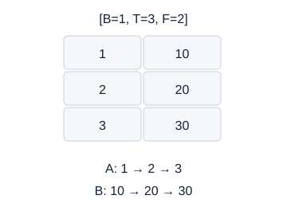

**그림 2-1. 행·열에서 배치·시간·특성으로**

이 표는 배치 속 샘플 하나를 펼친 모습이다. Conv1d에 넣을 때 축을 바꾸어도 A와 B의 시간 기록은 서로 섞이면 안 된다.

그림의 값·구조: B=1, T=3, F=2. 행은 시간, 열은 특성. permute 후 같은 특성이 같은 행에 모인다.

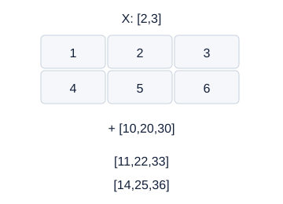

**그림 2-2. broadcasting은 값을 반복 적용한다**

보정값 [3]을 [1,3]처럼 오른쪽부터 맞춘다. permute와 달리 축을 교환하지 않고 각 위치에 덧셈을 한다.

그림의 값·구조: 2행3열 배열에 길이3 보정값을 더한다. 각 행의 같은 열에 같은 보정값이 적용된다.

### 숫자로 끝까지 따라가기

점수표 X=[[1,2,3],[4,5,6]]과 보정값 c=[10,20,30]을 더하면 첫 행은 [11,22,33], 둘째 행은 [14,25,36]이다. 오른쪽 축 3과 3이 같고, c의 없는 왼쪽 축을 1로 보아 2행에 적용한다. 이를 broadcasting, 즉 크기가 다른 배열을 호환되는 축에 맞춰 계산하는 규칙이라고 한다. 뒤쪽부터 크기가 같거나 한쪽이 1이어야 한다.

더 위험한 예를 보자. 예측 p=[[2],[4]], 정답 y=[1,3]의 올바른 평균제곱오차는 ((2−1)²+(4−3)²)÷2=(1+1)÷2=1이다. 그런데 p−y를 그대로 계산하면 [[2−1,2−3],[4−1,4−3]]=[[1,−1],[3,1]]이다. 제곱 평균은 (1+1+9+1)÷4=3이다. 오류 메시지는 없지만 다른 문제를 계산했다. 평균제곱오차는 MSE라고 줄여 부르며 대응하는 예측·정답 차이를 제곱한 뒤 평균한 값이다.

```python
import numpy as np

X = np.array([[1, 2, 3], [4, 5, 6]])
print(X + np.array([10, 20, 30]))
p = np.array([[2.], [4.]])
y = np.array([1., 3.])
wrong = np.mean((p - y) ** 2)
right = np.mean((p[:, 0] - y) ** 2)
print("잘못된 비교:", (p - y).shape, wrong)
print("올바른 비교:", (p[:, 0] - y).shape, right)
assert wrong == 3 and right == 1
a = np.arange(12).reshape(2, 3, 2)
print("축 교환:", a.transpose(0, 2, 1)[0])
print("크기 재묶기:", a.reshape(2, 2, 3)[0])
```

첫 샘플의 축 교환 결과는 [[0,2,4],[1,3,5]]이고, 단순 reshape 결과는 [[0,1,2],[3,4,5]]다. 원소 수는 같고 shape도 같지만 숫자 대응이 다르다. PyTorch에서 같은 축 교환은 `permute(0,2,1)`로 쓴다. reshape는 원소의 나열을 새 크기로 묶는 작업이므로 축의 의미를 옮기는 명령으로 대체하면 안 된다.

### 시험 문제로 연결하기

Conv1d는 기본적으로 (B,C,T)를 받으므로 시계열 (B,T,F)의 F를 채널로 쓸 때 (B,F,T)로 축을 교환한다. `batch_first=True`인 RNN은 (B,T,F)를 받지만 기본 설정에서는 (T,B,F)를 사용하므로 함수 설명과 설정을 함께 읽는다. Linear는 마지막 축의 특성들을 조합한다. 다중분류 점수 (B,K)에서 샘플마다 가장 큰 점수의 위치를 고르면 (B,)가 된다. 이런 점수인 logit은 확률이 아니므로 각 행의 합이 1일 필요가 없다.

함수 구현 전에는 입력의 type, shape, dtype, 출력 shape, 원본 수정 여부를 적는다. 디버깅은 데이터 전체를 출력하기보다 각 단계의 shape와 작은 샘플을 확인하고 처음 약속이 깨진 곳을 찾는다. 불리언 마스크는 True인 위치만 선택하는 배열이므로 행 필터의 길이가 대상 행 수와 맞아야 한다. 빈 배치, B=1, 상수 배열은 숨겨진 가정을 드러내는 좋은 연습 입력이다.

리스트와 배열의 연산 차이도 직접 말로 읽어 보자. Python에서 `[1,2]*2`는 목록을 두 번 이어 [1,2,1,2]를 만들지만, NumPy 배열에 2를 곱하면 각 숫자가 두 배가 되어 [2,4]가 된다. 객체 종류가 연산의 뜻을 결정하기 때문이다. 값이 화면에서 비슷하게 보여도 같은 자료 구조라고 가정하지 않는다. 정수 배열에 소수 계산 결과를 다시 대입하면 소수 부분이 보존되지 않을 수 있으므로 평균·스케일링처럼 실수가 필요한 계산은 저장 자료형까지 확인한다.

축을 줄이는 평균도 한 문장으로 읽을 수 있어야 한다. 세 학생과 두 과목의 표에서 학생 방향으로 평균하면 과목별 평균 두 개가 남는다. 과목 방향으로 평균하면 학생별 평균 세 개가 남는다. 축 번호를 외우기 전에 “어떤 대상을 모아 평균하고 무엇을 남기는가”를 먼저 적는다. 여러 축을 가진 텐서에서도 같은 원리가 반복된다. 모델이 요구하는 장치와 입력 장치가 다르면 모양이 맞아도 연산할 수 없으며, 정답의 정수 클래스 번호를 실수 회귀값처럼 다루어도 다른 계약이 된다.

실습 노트북을 다시 실행할 때는 앞 셀에서 우연히 남은 변수에 기대지 않는지 확인한다. 함수 안에서 필요하지만 인자로 받지 않은 변수를 바깥 셀에서 몰래 가져오면, 공개된 예제에서는 돌아가도 새로운 실행 환경에서 실패할 수 있다. 필요한 입력은 명확한 인자로 받거나 고정 설정으로 문서화하고, 반환할 결과도 함수 안에서 분명하게 만든다. 화면에 결과를 출력하는 것과 함수를 호출한 쪽에 값을 반환하는 것은 서로 다르다.

### 자주 헷갈리는 지점

NumPy의 기본 슬라이스는 원본 메모리를 공유하는 view가 될 수 있다. `a=np.arange(4); b=a[1:3]` 뒤 `b[0]=99`를 하면 a의 1번 값도 바뀐다. 독립적인 값을 원하면 `.copy()`가 필요하다. 단, 모든 인덱싱이 view라는 뜻은 아니며 고급 인덱싱은 복사본을 만들 수 있다. 메모리 공유를 외우기보다 원본 보존 계약을 먼저 정한다.

`squeeze()`로 크기 1인 모든 축을 없애면 배치 크기가 1일 때 배치 축까지 사라질 수 있다. 특정 출력 축만 없앨 때는 `squeeze(1)`처럼 축을 지정한다. (B,T,F)에 (T,)를 더하는 것도 시점별 보정이 아니다. 오른쪽에서 F와 비교되기 때문이다. 시점별 보정은 (1,T,1)처럼 시간 축을 명시한다. T=F일 때 실행이 된다는 사실이 오히려 의미 오류를 숨길 수 있다.

### 스스로 확인하기

1. shape (4,5,3)의 시계열에는 원소가 몇 개이며, Conv1d 직전 shape는 무엇인가?
2. (3,1)과 (3,)를 빼면 왜 세 개가 아니라 아홉 개의 차이가 생기는가?
3. 두 번째 열을 고를 때 `X[:,1]`과 `X[:,1:2]`는 무엇이 다른가?
4. view 값을 바꾼 뒤 원본이 바뀌었다. Python이 값을 잘못 복사한 것인가?

### 정답과 이유

1. 4×5×3=60개다. 배치 4, 특성 채널 3, 시간 5의 (4,3,5)로 축을 교환한다. 원소 수 60은 유지된다.
2. 정답 (3,)를 (1,3)처럼 맞춰 읽으므로 (3,1)과 양쪽의 길이 1이 확장되어 (3,3)이 된다. 올바른 짝 비교를 원하면 먼저 같은 shape로 맞춘다.
3. 전자는 (행 수,)이고 후자는 (행 수,1)이다. 후자는 열 축을 유지하므로 이후 행렬 연산과 broadcasting 의미가 달라진다.
4. 아니다. view는 원본을 보는 창이라는 계약이다. 독립 배열이 필요한 함수에서 명시적으로 copy를 만들지 않은 것이 원인이다.

### 더 읽을 공식 자료

[NumPy broadcasting 규칙](https://numpy.org/doc/stable/user/basics.broadcasting.html)과 [NumPy copies and views](https://numpy.org/doc/stable/user/basics.copies.html)는 축 호환과 메모리 공유를 설명한다. 축 교환은 [PyTorch permute](https://docs.pytorch.org/docs/stable/generated/torch.permute.html)를 확인한다. 문서의 최신 버전과 자신의 실행 환경 버전은 다를 수 있으므로 예제는 기본 연산 중심으로 연습한다.

## 03. NumPy·pandas로 데이터 계약 지키기

### 먼저 떠올릴 장면

주행 기록에 차량 A가 두 번 등장하는 것은 같은 행의 중복일까? 오전과 오후의 다른 운행이라면 정상이다. 반면 차량 정보표에 A의 현재 무게가 두 줄 있고 기준 시각도 없다면 어느 값을 붙일지 모호하다. 데이터 정리는 보기 싫은 행을 없애는 작업이 아니라 한 행의 의미와 표 사이 관계를 보존하는 작업이다. 모델을 학습하기 전에 이 약속부터 확인해야 예측을 올바른 차량에게 돌려줄 수 있다.

train에는 정답이 있고 test에는 예측할 입력만 있다는 연습 계약을 사용하자. 실제 문제에 정답 자리표시자 열이 있다면 그 명세에 맞춰 판단해야 한다. 입력 열 X와 정답 y를 나눌 때는 이름과 순서를 명시한다. train이 무게·속도 순서인데 test가 속도·무게 순서여도, 양쪽 모두 `FEATURES=["weight","speed"]`로 선택하면 모델 입력 순서를 맞출 수 있다. 필요한 열 자체가 없는 경우는 순서 문제와 다르므로 먼저 오류를 확인한다.

### 낯선 말부터 풀기

schema는 열 이름, 순서, 자료형처럼 표가 갖춰야 할 구조다. ID는 샘플이나 개체의 식별자다. index는 pandas가 각 행을 정렬·정합하는 데 사용하는 행 이름이며, 항상 0부터 시작하는 연속 번호는 아니다. key는 서로 다른 표에서 같은 대상을 연결하기 위한 열이다. merge는 key가 같은 행들을 짝지어 다른 표의 정보를 붙인다. groupby는 같은 key의 행을 묶고, agg는 묶음별 요약을, transform은 원래 각 행에 대응하는 계산 결과를 반환한다.

NaN은 값이 없거나 정의되지 않은 수치 상태이고, Inf와 −Inf는 양·음의 무한대다. `isna()`는 결측을, `isfinite()`는 무한대도 결측도 아닌 유한한 숫자를 확인한다. 숫자처럼 보이는 문자열 "30"과 실수 30.0의 dtype은 다르다. 범주형 열의 숫자 1과 문자열 "1"이 같은 종류인지 판단한 뒤 정규화한다. 단순히 `astype(str)`를 쓰면 빈칸이 "nan"이라는 글자로 바뀌어 결측 검사에서 빠질 수 있다.

중복은 전체 행 중복인지, key 중복인지 구분한다. 같은 차량의 여러 시각 기록은 key 중복이지만 전체 행 중복은 아닐 수 있다. 그룹의 평균도 기술 요약인지 미래 예측용 특성인지 구분한다. 미래 기록을 포함한 차량 평균은 표 연산으로는 맞아도 과거 시점 예측에는 사용할 수 없다. 데이터 계약은 숫자의 형식뿐 아니라 언제 알 수 있었는지도 포함한다.

### 그림을 읽는 순서

먼저 축·색·연결 방향을 읽고, 각 그림 아래의 설명으로 확인하세요. 손계산은 다른 작은 숫자를 쓰는 독립 연습일 수 있습니다.

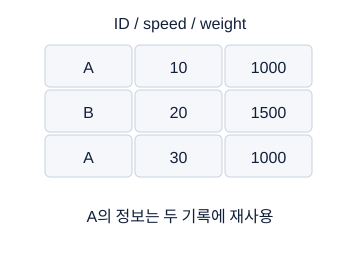

**그림 3-1. merge: 이름표를 맞춰 정보를 붙이기**

왼쪽 A가 두 번인 것은 정상일 수 있다. 오른쪽 정보표에 A가 두 번이면 한 왼쪽 행이 여러 행과 연결된다. validate로 의도한 관계를 검사한다.

그림의 값·구조: 왼쪽 A,B,A에 오른쪽 A1000,B1500을 many-to-one 결합하면 세 행을 유지한다.

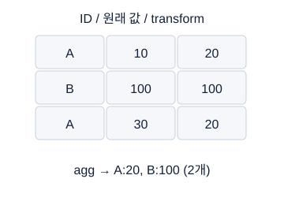

**그림 3-2. agg와 transform의 행 수가 다르다**

transform은 각 원래 행에 그 그룹의 평균을 대응시킨다. 평균이 두 그룹에서 다르므로 어떤 그룹의 값을 붙였는지 추적할 수 있다.

그림의 값·구조: A의 두 값10,30은 평균20, B의 값100은 평균100. agg는2개, transform은원래3개.

### 숫자로 끝까지 따라가기

A의 속도 10과 30의 평균은 (10+30)÷2=20이다. B는 관측 하나이므로 평균 100이다. 그룹 요약 값은 [20,100]이지만 원래 행에 붙일 값은 [20,100,20]이다. 만약 정보표 A가 두 행이면 A 주행 두 건×A 정보 두 건=4개 짝, B 한 건×B 정보 한 건=1개 짝으로 결과는 4+1=5행이다. 어느 A 정보를 버릴지 임의로 정하지 말고 정보표가 시간 이력인지 입력 오류인지 먼저 확인한다.

결측 처리 예로 입력 [10,NaN,Inf,30]의 Inf를 센서 오류로 간주하여 NaN으로 바꾼다고 하자. 관측된 값은 [10,30], 중앙값은 (10+30)÷2=20, 대치 결과는 [10,20,20,30]이다. 같은 규칙으로 새 입력 [NaN,100]은 [20,100]이 된다. 새 입력의 중앙값 100으로 별도 대치하면 학습과 다른 기준이 된다. 이 계산은 입력 특성의 대치 예이며 정답 결측을 임의로 만들어 채우는 예가 아니다.

```python
import numpy as np
import pandas as pd

trips = pd.DataFrame({"id": ["A", "B", "A"], "speed": [10., 100., 30.]})
meta = pd.DataFrame({"id": ["A", "B"], "weight": [1000., 1500.]})
work = trips.assign(row_order=np.arange(len(trips)))
out = work.merge(meta, on="id", how="left", validate="many_to_one")
out = out.sort_values("row_order", kind="stable")
out["group_mean"] = out.groupby("id")["speed"].transform("mean")
print(out.to_string(index=False))
assert out["group_mean"].tolist() == [20., 100., 20.]
assert len(out) == len(trips)
order = np.array([2, 0, 1])
pred_sorted = np.array([[9., 90.], [7., 70.], [8., 80.]])
pred_original = pred_sorted[np.argsort(order, kind="stable")]
print(pred_original)
assert pred_original.tolist() == [[7., 70.], [8., 80.], [9., 90.]]
```

`validate="many_to_one"`은 왼쪽 key 반복은 허용하되 오른쪽 key는 유일해야 한다는 검사다. `argsort(order)`는 위치표를 0,1,2로 정렬하는 위치 [1,2,0]을 돌려준다. 이를 예측 배열의 첫 축에 적용하므로 같은 행의 두 출력도 함께 이동한다. 값을 크기순으로 정렬하는 것이 아니라 샘플의 원래 위치로 복구하는 것이다.

### 시험 문제로 연결하기

표를 받으면 크기, 열 이름·순서, dtype, 결측·무한대, 중복, 정답 의미 순으로 검사한다. 날짜는 명시한 형식으로 해석하고, 같은 개체 안에서 시간순으로 정렬한다. `reset_index`는 새 행 번호를 붙이는 것이지 원래 순서를 기억하거나 복원하는 도구가 아니다. 정렬 전에 별도의 원래 위치 열을 보관한다. 검사에 쓰는 열 이름이 기존 열과 충돌하지 않도록 확인한다.

메모리도 계약의 일부다. float64의 한 숫자는 8 byte이므로 500,000행×100열 배열은 50,000,000개×8=400,000,000 byte다. 1 MiB=1,048,576 byte이므로 약 381.47 MiB다. float32는 한 숫자 4 byte로 절반이지만 표현 정밀도도 달라진다. 문자열, 인덱스, 복사본을 포함한 DataFrame 전체 메모리는 이 단순 계산보다 커질 수 있다. 거대한 시계열 창을 모두 복사하기 전에 원소 수를 곱해 보고, 필요한 창만 그때 읽는 방법을 고려한다.

### 자주 헷갈리는 지점

`reindex(columns=...)`는 없는 열을 결측으로 생성할 수 있어 열 이름 오타를 숨길 수 있다. 필요한 열의 집합 차이를 먼저 확인하고 실제 존재하는 열을 고른다. groupby 요약 결과를 원래 열에 그냥 넣으면 A·B 인덱스와 0·1·2 인덱스가 달라 결측이 생길 수 있다. 원래 행마다 값을 붙이려면 transform인지 명시적 merge인지 결정한다. pandas의 결측 key 병합은 일반적인 SQL의 결측 비교와 다를 수 있으므로 key의 결측도 먼저 조사한다.

열 전체가 결측이면 중앙값도 결측이다. 이 경우 오류를 없애려고 무조건 0을 넣지 말고 열 제외, 지정 상수, 별도 상태 표현 중 계약에 맞는 정책을 정한다. 정답에 결측이 있다면 입력과 동일한 대치로 학습용 정답을 발명하지 않는다. 입력 열만 잘 맞춘 검사 통과가 모든 시간 누수나 단위 오류까지 보장하는 것은 아니다.

병합 결과의 행 수가 우연히 맞아도 key가 올바르다는 증거는 아니다. 차량 번호 대신 운행 번호로 연결해야 하는 상황에서 잘못된 열을 쓰면 다른 운행의 정보를 붙일 수 있다. 오른쪽 표에 연결되지 않은 key가 있으면 새로 붙인 정보가 빈칸으로 남는다. 이때 빈칸을 곧바로 평균으로 채우기 전에 “이 차량의 정보가 원래 없는가, 표를 잘못 읽었는가, key의 공백이나 자료형이 다른가”를 확인한다. 문자열 양끝 공백 제거도 코드 자체는 단순하지만 서로 다른 식별자를 합치지 않는지 의미 검사가 필요하다.

정렬 기준이 같은 행이 여러 개일 때 처리 순서도 정의해야 한다. 같은 차량과 같은 시각의 두 기록이 서로 다른 센서 수집인지 완전한 중복인지 판단하지 않고 하나를 지우면 정보가 사라질 수 있다. 마지막 우선순위로 원래 위치 번호를 쓰면 실행 때마다 일관된 순서는 만들 수 있지만, 실제 시간상 선후관계를 새로 알아낸 것은 아니다. 시간 정보의 해상도가 부족하다면 창 구성이나 집계 정책에서 그 한계를 기록한다.

계약 검사기는 예상한 오류를 일찍 알리는 장치다. 검사에 실패했다고 데이터를 자동으로 고쳐야 하는 것은 아니며, 검사에 통과했다고 학습 준비가 완전히 끝난 것도 아니다. 입력 특성 목록을 반환하는 함수라면 빈 목록, 중복 열 이름, 제외할 열 이름의 오타까지 작은 표로 시험한다. 원본 보존이 요구되면 호출 전 복사해 둔 원본과 호출 뒤 입력을 비교하여 값뿐 아니라 열 순서와 인덱스도 유지되는지 확인한다.

### 스스로 확인하기

1. 왼쪽 key가 [A,A,B], 오른쪽 key가 [A,A,B,B]이면 검사 없는 inner merge는 몇 행인가?
2. A 두 행과 B 한 행의 그룹 평균을 원래 행마다 붙일 때 agg와 transform 중 어느 쪽인가?
3. 정렬 후 원래 위치가 [1,2,0], 예측이 [4,5,3]이면 원래 순서 예측은?
4. `fillna(0)`만 실행하면 Inf도 없어지는가? 정답 결측도 똑같이 채워도 되는가?

### 정답과 이유

1. A에서 2×2=4행, B에서 1×2=2행으로 총 6행이다. 공통 key의 모든 짝을 만드는 것이므로 중복 개수를 곱한다.
2. transform이다. agg는 그룹당 한 행으로 줄이고 transform은 원래 각 행과 대응하는 결과를 유지한다.
3. [3,4,5]다. 예측 3은 원래 0번, 4는 1번, 5는 2번 샘플에 붙는다. 위치표로 예측의 첫 축을 다시 배열한다.
4. Inf는 일반 결측과 다르므로 남는다. 그리고 입력 대치는 측정값의 빈칸 처리이지 관측하지 않은 정답을 만들어도 된다는 허가가 아니다.

### 더 읽을 공식 자료

[pandas merge API](https://pandas.pydata.org/docs/reference/api/pandas.DataFrame.merge.html)는 연결 방식과 `validate`를, [SeriesGroupBy.transform](https://pandas.pydata.org/docs/reference/api/pandas.api.typing.SeriesGroupBy.transform.html)은 원래 인덱스에 대응하는 반환을 설명한다. 전체 연결 방식은 [pandas merging guide](https://pandas.pydata.org/docs/user_guide/merging.html)에서 비교할 수 있다.

## 04. 선형대수: 모델의 shape를 계산하는 언어

### 먼저 떠올릴 장면

학생의 수학·영어 점수 [3,4]를 두 숫자로 적으면 벡터가 된다. 수학에 2배, 영어에 1배의 비중을 두어 총점을 만들면 3×2+4×1=10이다. 여러 특성을 여러 출력으로 조합하는 신경망의 선형층도 같은 계산을 반복한다. 선형대수는 낯선 기호를 늘리는 과목이 아니라 이 반복을 짧고 정확하게 표현하는 언어다. 지금은 좌표 두 개의 화살표와 작은 표에서 시작하면 충분하다.

표를 그림으로 바꾸면 한 학생은 좌표평면의 한 점이 된다. 원점에서 그 점까지 그은 화살표는 벡터의 방향과 길이를 보여 준다. 두 과목 점수가 항상 같다면 모든 점이 대각선 위에 놓인다. 열은 두 개지만 독립적으로 달라지는 방향은 하나뿐이다. 이 장의 마지막 PCA는 이런 중복 방향을 찾아 적은 좌표로 표현하는 방법과 연결된다.

### 낯선 말부터 풀기

스칼라는 숫자 하나, 벡터는 순서가 있는 숫자 묶음, 행렬은 행과 열로 정리한 숫자 표다. 실수 집합은 ℝ로 쓰며 x∈ℝ^F는 실수 F개를 가진 벡터라는 뜻이다. X∈ℝ^(B×F)는 B개 샘플의 F개 특성을 행으로 쌓은 행렬이다. 전치는 행과 열을 교환하며 Xᵀ로 쓴다. 아래첨자 i는 몇 번째 성분인지 표시하고 Σ는 지정한 성분을 모두 더하라는 합 기호다.

내적 x·w=Σ_i x_i w_i는 같은 위치의 두 값을 곱한 뒤 모두 더한 숫자다. 행렬곱은 왼쪽 행과 오른쪽 열의 내적을 결과의 각 칸에 넣는다. (B,F)와 (F,O)를 곱하면 중간 F가 맞아야 하며 결과는 (B,O)다. O는 출력 특성 수다. PyTorch Linear는 가중치 W를 (O,F)로 저장하므로 Z=XWᵀ+b로 쓴다. b는 출력마다 더하는 편향 값이며 shape (O,)가 모든 샘플에 적용된다.

노름은 벡터의 크기를 재는 규칙이다. L1 노름은 절댓값의 합, L2 노름은 제곱합의 제곱근이다. 코사인 유사도는 x·w를 두 L2 길이의 곱으로 나누어 방향을 비교한다. 두 벡터 모두 길이가 0이 아니어야 정의된다. 직교는 두 방향이 직각이라는 뜻이다. rank는 서로 독립적인 열 또는 행 방향의 개수다. 한 열이 다른 열의 정확한 배수이면 새로운 독립 방향을 늘리지 않는다. 거의 배수인 열이 많으면 회귀의 개별 계수가 불안정해질 수 있는데 이를 다중공선성과 연결해 이해한다.

### 그림을 읽는 순서

먼저 축·색·연결 방향을 읽고, 각 그림 아래의 설명으로 확인하세요. 손계산은 다른 작은 숫자를 쓰는 독립 연습일 수 있습니다.

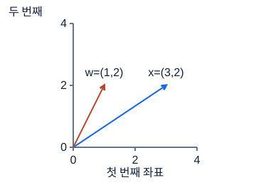

**그림 4-1. 내적은 대응하는 숫자를 곱해 더한다**

파란 화살표가 x, 주황 화살표가 w다. 화살표 길이를 단순히 더하는 연산이 아니다. 같은 좌표끼리 곱해 하나의 숫자 7을 얻는다.

그림의 값·구조: x=(3,2), w=(1,2), 내적은3×1+2×2=7. 벡터는 원점에서 출발한다.

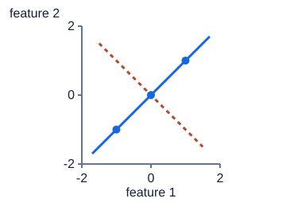

**그림 4-2. PCA: 가장 길게 퍼진 방향으로 투영**

파란 대각선이 분산을 보존하는 방향이고 주황 점선 방향의 변동은 0이다. 첫 축 좌표는 −√2, 0, √2. PCA가 원래 열 하나를 고르는 것은 아니다.

그림의 값·구조: 세 점(-1,-1),(0,0),(1,1)은 y=x 위에 있다. 첫 주성분 방향(1,1)/sqrt2로 점들을 표현할 수 있다.

### 숫자로 끝까지 따라가기

X=[[1,2],[0,−1]], W=[[3,−1],[1,2]], b=[0.5,−1]로 두 출력 선형층을 계산하자. 첫 샘플의 첫 출력은 1×3+2×(−1)+0.5=1.5, 둘째 출력은 1×1+2×2−1=4다. 둘째 샘플의 첫 출력은 0×3+(−1)×(−1)+0.5=1.5, 둘째 출력은 0×1+(−1)×2−1=−3이다. 따라서 Z=[[1.5,4],[1.5,−3]]이고 shape는 (2,2)다. 행렬의 원소별 곱 `X*W`와 다른 계산이다.

PCA 예제의 데이터 P=[[-1,-1],[0,0],[1,1]]은 각 열의 평균이 0이다. 중심화는 각 열에서 그 평균을 빼는 작업이다. 모집단 방식 공분산 S=PᵀP/3을 쓰면 S=[[2/3,2/3],[2/3,2/3]]이다. 대각선 원소는 각 열의 분산이고, 비대각선 원소는 두 열이 함께 움직이는 정도다. S에 v₁을 곱하면 (4/3)v₁, v₂를 곱하면 0v₂가 된다. 행 수와 열 수가 같은 행렬을 정방행렬이라고 한다. 정방행렬에 곱한 결과가 원래 벡터의 배수인 0이 아닌 벡터를 고유벡터, 그 배율을 고유값이라 하므로 고유값은 4/3과 0이다.

투영은 t=Pv₁=[−√2,0,√2]다. 각 t에 v₁을 곱해 원래 공간으로 되돌리면 정확히 P가 복원된다. 첫 방향의 설명분산비는 (4/3)÷(4/3+0)=1, 즉 100%다. 표본 공분산처럼 3이 아니라 n−1=2로 나누면 고유값은 2와 0이 되지만 방향과 비율은 같다. 이런 특수한 직선 데이터와 달리 일반 데이터는 차원을 줄이면 일부 정보가 사라진다.

```python
import numpy as np

X = np.array([[1., 2.], [0., -1.]])
W = np.array([[3., -1.], [1., 2.]])
b = np.array([0.5, -1.])
Z = X @ W.T + b
assert np.allclose(Z, [[1.5, 4.], [1.5, -3.]])
P = np.array([[-1., -1.], [0., 0.], [1., 1.]])
S = P.T @ P / len(P)
v = np.array([1., 1.]) / np.sqrt(2.)
t = P @ v
print("공분산:", S, "투영:", t)
assert np.allclose(S @ v, (4 / 3) * v)
assert np.allclose(np.outer(t, v), P)
```

### 시험 문제로 연결하기

선형층 shape 문제는 입력의 마지막 길이 F와 가중치의 입력 길이가 맞는지 먼저 검사한다. W가 (7,20), X가 (64,20)이면 XWᵀ는 (64,7), 편향은 (7,)이다. convolution도 작은 입력 구역에 같은 가중치 내적을 반복 적용한다는 관점으로 시작할 수 있다. 아직 합성곱의 세부 출력 크기를 외울 필요는 없지만 같은 계산 규칙을 공간 여러 위치에서 공유한다는 연결을 기억한다.

PCA는 보통 학습 자료에서 중심과 축을 구한 뒤 검증·시험 자료에는 같은 중심과 축을 적용한다. 단위가 크게 다른 특성은 스케일 조절을 고려하지만 모든 문제에서 반드시 표준화가 정답인 것은 아니다. 원래 단위의 분산 자체가 의미 있다면 판단이 달라진다. PCA는 정답 y를 보지 않는 특성 추출이고, 클래스 구분을 이용하는 LDA와 목적이 다르다.

### 자주 헷갈리는 지점

코사인 유사도 1은 두 벡터가 같은 방향이라는 뜻이지 값이 동일하다는 뜻이 아니다. [1,2]와 [2,4]는 길이가 달라도 유사도가 1이다. 내적 0도 영벡터가 끼어 있으면 각도를 논할 수 없으므로 벡터가 0인지 확인한다. 벡터 정규화는 한 벡터의 길이를 맞추는 것이고, 열별 표준화는 여러 샘플의 각 특성 평균·산포를 맞추는 것이므로 대상 축이 다르다.

L1과 L2 노름은 규제에서 다시 등장한다. L1 벌점은 일부 계수를 0으로 만들기 쉬워 변수 선택 효과가 있고 L2 벌점은 큰 계수를 부드럽게 줄인다. 그러나 노름의 정의만으로 모든 최적화 알고리즘에서 정확히 0이 나온다고 보장할 수는 없다. PCA 고유벡터의 부호도 유일하지 않다. v와 −v는 같은 축이며 투영 부호가 함께 바뀌어도 복원과 설명분산은 같다.

투영의 의미는 “원점에서 얼마나 멀리 있는가”와도 구분한다. 어떤 점이 원점에서 멀리 떨어져 있어도 선택한 축에 수직인 방향이라면 그 축의 투영 좌표는 영이 될 수 있다. 그림자를 하나만 남기면 원래 점이 수직 방향으로 어디에 있었는지 알 수 없어진다. 반면 서로 직각인 모든 축의 좌표를 남기면 좌표 이름만 바뀌었으므로 원래 점으로 돌아갈 수 있다. 차원축소에서 손실은 축을 회전했다는 사실이 아니라 필요한 좌표 일부를 버렸다는 사실에서 생긴다.

가중치 행 하나는 출력 하나가 입력을 어떤 방향으로 보는지를 정한다. 가중치가 수학 점수만 읽는 방향이면 영어 점수가 바뀌어도 그 출력은 그대로이고, 두 과목에 같은 비중을 주면 합이 같은 학생들을 같은 출력으로 보게 된다. 하나의 출력으로 두 입력을 압축하는 순간 서로 다른 학생이 같은 숫자로 표현될 수 있다. 이것은 계산 오류가 아니라 모델 표현의 제약이다. 여러 출력과 비선형 층이 왜 필요한지도 이 작은 예에서 출발한다.

고유벡터는 영벡터를 제외한다는 조건이 중요하다. 영벡터는 어떤 행렬에 곱해도 영이어서 방향을 설명하지 못하기 때문이다. 공분산 행렬에서는 음수가 아닌 고유값을 기대하지만 일반 행렬의 고유값이 모두 양수라는 뜻은 아니다. 또한 단위가 다른 두 특성에 임의로 큰 배율을 곱하면 공분산의 퍼짐과 주성분 방향이 달라질 수 있다. 수식에 들어가는 자료의 단위를 먼저 확인하는 습관이 계산만 정확한 오해를 막는다.

### 스스로 확인하기

1. x=[3,4]의 L1, L2 노름은 각각 얼마인가?
2. X의 shape가 (5,3), W가 (2,3)일 때 XWᵀ의 shape는? 왜 XW는 바로 곱할 수 없는가?
3. 두 열이 정확히 같은 비상수 값이면 독립 방향은 두 개인가?
4. PCA가 100% 분산을 보존하면 모든 데이터에서 예측을 완벽히 할 수 있는가?

### 정답과 이유

1. L1=|3|+|4|=7, L2=√(9+16)=5다. 서로 다른 크기 측정 규칙이므로 값이 달라도 모순이 아니다.
2. (5,2)다. XW는 중간 길이 3과 2가 달라 이 행렬곱 규칙을 만족하지 않는다. 전치가 입력 특성들을 같은 위치에 대응시킨다.
3. 아니다. 중심화한 두 열도 같아서 rank는 1이다. 한 열만 알아도 다른 열이 결정된다. 모두 상수라면 중심화 뒤 rank는 0일 수 있다.
4. 아니다. 입력 분산 보존은 입력 표현에 대한 말이다. 입력만으로 정답이 결정되는지, 모델이 그 관계를 배웠는지, 관측 잡음이 있는지는 별개의 질문이다.

### 더 읽을 공식 자료

[NumPy matmul](https://numpy.org/doc/stable/reference/generated/numpy.matmul.html)과 [PyTorch Linear](https://docs.pytorch.org/docs/stable/generated/torch.nn.Linear.html)에서 행렬곱과 가중치 배치를 확인한다. 중심화·주성분·분산의 연결은 [scikit-learn PCA 설명](https://scikit-learn.org/stable/modules/decomposition.html#pca)을 참고한다.

## 05. 미분·역전파·최적화의 원리

### 먼저 떠올릴 장면

샤워기 온도를 맞출 때 손잡이를 조금 돌려 보고 물이 얼마나 뜨거워지는지 관찰한다. 방향을 잘못 돌리면 더 뜨거워지고, 한 번에 너무 많이 돌리면 원하는 온도를 지나친다. 모델의 매개변수를 바꾸는 일도 비슷하다. 다만 수백만 개의 손잡이를 하나씩 시험할 수 없으므로 손실이 각 손잡이에 얼마나 민감한지 미분으로 계산한다. 여기서 손실은 예측이 정답과 얼마나 다른지 한 숫자로 나타낸 값이다.

“역전파가 학습한다”는 표현을 처음 들으면 모든 일이 하나의 명령에 숨어 있는 것처럼 느껴진다. 실제로는 순전파가 예측과 손실을 계산하고, 역전파가 각 매개변수의 기울기를 계산하고, 최적화기가 그 기울기로 매개변수를 바꾼다. 이 세 역할을 분리하면 손실이 그대로인 오류도 어느 단계에서 생겼는지 좁힐 수 있다.

### 낯선 말부터 풀기

미분 dy/dx는 입력 x를 아주 조금 바꿀 때 출력 y가 변하는 비율이다. x²의 미분이 2x라는 말은 x=3 근처에서 x를 0.01 올리면 제곱값이 대략 6×0.01=0.06 올라간다는 뜻이다. 정확한 변화는 3.01²−3²=0.0601이고, 변화 폭을 더 줄이면 근사가 더 가까워진다. 편미분은 여러 입력 중 하나만 움직이고 나머지는 고정한 민감도다. 기울기 벡터 ∇L은 손실 L의 매개변수별 편미분을 모은 것이다.

경사하강법은 w_new=w_old−η∇L로 매개변수 w를 고친다. η는 양수인 학습률이며 한 번 움직일 보폭을 정한다. 기울기는 현재 점에서 가장 빠른 증가 방향이므로 충분히 작은 걸음에서는 반대 방향이 감소 방향이다. 멀리 이동한 뒤에도 같은 기울기가 맞는다고 보장하지 않으므로 지나치게 큰 학습률은 손실을 높일 수 있다.

합성함수는 앞 계산의 출력을 뒤 계산에 넣는 함수다. 연쇄법칙은 연결된 민감도를 곱하는 규칙이다. ReLU는 입력 a가 양수이면 a, 음수이면 0을 출력하는 함수다. 양수 구간의 미분은 1, 음수 구간은 0이고 0에서는 수학적으로 미분 불가능하지만 구현은 특정 값을 사용한다. sigmoid는 σ(a)=1/(1+exp(−a))로 출력을 0과 1 사이로 압축한다. exp는 자연상수 e의 거듭제곱 함수다. tanh는 쌍곡탄젠트로, 출력을 −1과 1 사이로 압축하는 원점 대칭 함수다. sigmoid의 미분 σ(a)(1−σ(a))와 tanh의 미분 1−tanh²(a)는 큰 절댓값 입력에서 작아져 깊은 경로의 기울기가 줄어들 수 있다. log가 자연로그일 때 미분은 1/x이며 x>0에서 쓴다.

### 그림을 읽는 순서

먼저 축·색·연결 방향을 읽고, 각 그림 아래의 설명으로 확인하세요. 손계산은 다른 작은 숫자를 쓰는 독립 연습일 수 있습니다.

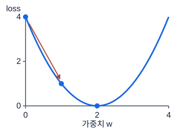

**그림 5-1. 기울기의 반대 방향으로 조금 이동**

내리막 화살표는 w=0에서 w=1로 한 번 갱신하는 예다. gradient가 음수이므로 그 값을 빼면 w는 증가한다. 학습률은 이동 크기를 조절한다.

그림의 값·구조: L(w)=(w-2)^2. w=0에서 gradient=-4. 학습률0.25이면 새 w=1, loss는4에서1.

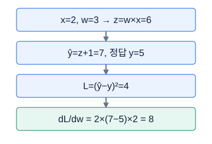

**그림 5-2. 역전파는 작은 미분을 거꾸로 곱한다**

앞으로 갈 때 값을 계산하고, 뒤로 갈 때 각 연결의 민감도를 곱한다. 이 예제에는 ReLU 등 다른 연산이 없으므로 추가 미분 항도 없다.

그림의 값·구조: x=2, w=3 → z=w×x=6 → ŷ=z+1=7, 정답 y=5 → L=(ŷ−y)²=4 → dL/dw = 2×(7−5)×2 = 8

### 숫자로 끝까지 따라가기

입력 x=2, 정답 y=1, w₁=1,b₁=0,w₂=3,b₂=0으로 시작한다. a=w₁x+b₁=1×2+0=2, h=ReLU(a)=2, 예측 ŷ=w₂h+b₂=3×2+0=6이다. 손실을 L=0.5(ŷ−y)²로 정의하면 0.5×(6−1)²=12.5다. 앞의 0.5는 미분할 때 제곱에서 나오는 2를 상쇄하기 위해 붙인 계수다.

출력에서 시작하면 ∂L/∂ŷ=ŷ−y=5다. w₂를 조금 바꾸면 예측이 h=2배 변하므로 ∂L/∂w₂=5×2=10, 편향 b₂는 예측에 그대로 더해져 ∂L/∂b₂=5다. h의 변화는 w₂=3배 증폭되므로 ∂L/∂h=5×3=15다. a는 양수여서 ReLU 미분 1을 곱해 ∂L/∂a=15다. 따라서 ∂L/∂w₁=15×x=30, ∂L/∂b₁=15다.

학습률 0.01로 모든 매개변수를 옛 기울기 기준으로 동시에 갱신하면 w₁=1−0.01×30=0.7, b₁=−0.15, w₂=3−0.1=2.9, b₂=−0.05다. 새 a=0.7×2−0.15=1.25, 새 h=1.25, 새 예측=2.9×1.25−0.05=3.575다. 새 손실=0.5×(3.575−1)²=0.5×6.630625=3.3153125로 감소한다. 역전파 중 w₂를 먼저 바꾸고 그 새 값으로 앞층 기울기를 계산하면 같은 한 단계 갱신이 아니므로 주의한다.

```python
import torch

w1 = torch.tensor(1., requires_grad=True)
b1 = torch.tensor(0., requires_grad=True)
w2 = torch.tensor(3., requires_grad=True)
b2 = torch.tensor(0., requires_grad=True)
params = [w1, b1, w2, b2]
optimizer = torch.optim.SGD(params, lr=0.01)
optimizer.zero_grad()
pred = w2 * torch.relu(w1 * 2. + b1) + b2
loss = 0.5 * (pred - 1.) ** 2
loss.backward()
print("기울기:", [p.grad.item() for p in params])
assert [p.grad.item() for p in params] == [30., 15., 10., 5.]
optimizer.step()
with torch.no_grad():
    after = 0.5 * (w2 * torch.relu(w1 * 2. + b1) + b2 - 1.) ** 2
print(loss.item(), after.item())
assert abs(after.item() - 3.3153125) < 1e-5
```

### 시험 문제로 연결하기

전체 데이터를 한 번의 기울기에 쓰는 방식은 batch 경사하강, 한 샘플씩 쓰는 방식은 엄밀한 의미의 확률적 경사하강, 작은 묶음을 쓰는 방식은 mini-batch다. 실제 코드에서 SGD라는 이름의 최적화기도 mini-batch 입력과 함께 사용하므로 이름만 보고 배치 크기 1이라고 결론 내리지 않는다. epoch는 전체 학습 자료를 한 번 훑는 단위, step은 매개변수 갱신 한 번이다. 데이터 100개와 배치 20개라면 마지막 배치 누락이 없는 경우 epoch당 5 step이다.

Momentum은 이전 기울기 방향을 누적해 현재 이동에 반영한다. RMSprop은 최근 기울기의 제곱 크기로 매개변수별 이동 크기를 조절한다. Adam은 방향의 이동평균과 제곱 크기의 이동평균을 함께 사용하고 초기 추정의 편향을 보정한다. AdamW는 weight decay, 즉 가중치를 작게 줄이는 처리를 적응형 기울기 갱신과 분리한다. 어떤 방법도 모든 데이터에서 최고 성능을 보장하지 않으며 학습률과 검증 결과를 함께 봐야 한다.

### 자주 헷갈리는 지점

PyTorch는 기본적으로 `.grad`에 기울기를 누적한다. 이전 값 제거 없이 새 배치를 역전파하면 두 배치 기울기가 더해진다. 여러 배치를 모아 한 번 갱신하려는 의도적인 누적 학습은 가능하지만, 그때는 손실 스케일과 갱신 시점을 계획해야 한다. `backward()`만 호출하면 매개변수가 바뀌는 것이 아니고 `step()`이 실제 갱신이다. 반대로 그래프 연결을 끊는 `detach()`를 잘못 쓰면 기울기가 필요한 매개변수까지 전달되지 않는다.

손실이 출렁이면 큰 학습률이나 작은 배치를 의심할 수 있지만 그것만이 원인은 아니다. NaN이면 입력 무한대, 0으로 나눗셈, 로그의 정의역, 기울기 폭증을 확인한다. train과 valid 손실이 모두 높으면 표현력·특성·학습량을, train만 낮으면 과적합과 분할 적절성을 살핀다. 곡선 하나로 원인을 확정하지 말고 기울기 존재, 입력 유한성, 작은 배치 재현으로 가설을 확인한다.

역전파 그래프가 갈라졌다가 합쳐지면 경로의 기여는 더한다. 어떤 중간 값이 두 계산에서 동시에 쓰였다면 손실이 그 값에 의존하는 길이 두 개이기 때문이다. 각 길을 따라서는 연쇄법칙으로 곱하고, 같은 변수로 돌아오는 길끼리는 합친다. 하나의 경로만 그린 단순 예제를 외운 채 가지가 많은 신경망에 적용하면 기울기를 빠뜨릴 수 있다. 실제 자동미분은 이런 반복 사용 관계를 기록해 더 복잡한 계산에서도 기여를 모은다.

미분값을 이해하려면 아주 작은 변화로 검산하는 생각도 도움이 된다. 매개변수를 조금 올렸을 때의 손실과 조금 내렸을 때의 손실 차이를 이동 폭으로 나누면 근처 기울기를 근사할 수 있다. 이 방법은 매개변수마다 여러 번 계산해야 하므로 대규모 학습에는 느리지만, 작은 함수에서 손으로 구한 미분 부호가 맞는지 확인하는 데 유용하다. 다만 꺾인 지점, 너무 작은 이동으로 생기는 수치 오차, 무작위 증강을 섞은 비교에는 주의한다.

배치 평균 손실과 배치 합 손실도 구분한다. 같은 샘플의 손실을 더한 값은 배치 크기에 따라 커지지만 평균은 개수로 나눈다. 합 손실의 기울기를 평균 손실용 학습률로 그대로 사용하면 배치 크기를 바꿀 때 실제 이동 크기가 달라질 수 있다. 그래서 손실의 축과 집계 방식은 출력 shape만큼 중요한 계약이다. 마지막 배치가 작을 때 전체 학습 손실을 보고하려면 배치 평균들을 무조건 같은 비중으로 평균하기보다 샘플 수에 맞춰 가중해야 한다.

### 스스로 확인하기

1. L(w)=(w−3)²에서 w=0의 기울기와 학습률 0.1인 다음 w는?
2. 위 계산에서 a가 음수였다면 앞층 w₁의 기울기는 어떻게 되는가?
3. `backward()` 후 `step()`을 실행하지 않으면 학습 가중치는 바뀌는가?
4. 학습률을 열 배 키우면 손실이 언제나 더 빨리 감소하는가?

### 정답과 이유

1. 기울기 2(w−3)=−6, 다음 w=0−0.1×(−6)=0.6이다. 음의 기울기를 빼므로 w는 증가한다.
2. 이 ReLU 경로에서는 미분이 0이므로 w₁로 전달되는 기울기도 0이다. 다른 경로가 있는 더 큰 그래프라면 그 경로의 기여는 별도로 더해야 한다.
3. 일반적인 최적화 루프에서는 바뀌지 않는다. 기울기 계산과 가중치 갱신은 다른 작업이다.
4. 아니다. 현재 기울기는 국소적인 정보라 큰 이동 뒤에는 부정확할 수 있다. 골짜기를 넘어 진동하거나 발산할 수 있다.

### 더 읽을 공식 자료

[PyTorch automatic differentiation tutorial](https://docs.pytorch.org/tutorials/beginner/basics/autogradqs_tutorial.html)에서 그래프와 기울기 누적을 확인한다. [PyTorch optimization tutorial](https://docs.pytorch.org/tutorials/beginner/basics/optimization_tutorial.html)은 학습 루프의 역할을 나누어 설명한다. 개별 최적화기 정의는 [torch.optim](https://docs.pytorch.org/docs/stable/optim.html)을 참고한다.

## 06. 확률·통계·정보이론

### 먼저 떠올릴 장면

고장 경보가 울린 자동차를 발견했다고 하자. 탐지기가 실제 고장의 90%를 잡는다는 설명만 듣고 “이 차가 고장일 확률도 90%”라고 말할 수 있을까? 아니다. 고장이 얼마나 흔한지, 정상 차량에도 얼마나 자주 경보가 울리는지 함께 알아야 한다. 확률에서 중요한 것은 숫자 하나보다 무엇을 분모로 세고 있는가다. 이번 장에서는 공식을 외우기 전에 실제 차량을 여러 칸으로 나누어 센다.

통계는 흩어진 관측을 위치와 퍼짐으로 요약하고, 확률은 관측이나 사건의 불확실성을 표현한다. 정보이론은 어떤 결과가 얼마나 놀랍고 예측 분포가 얼마나 잘 맞는지를 수치로 다룬다. 모델의 분류 손실과 트리의 분할 기준이 여기서 연결된다. 어느 용어도 데이터가 충분하지 않은 상황에서 확실한 결론을 만들어 주는 마법은 아니다.

### 낯선 말부터 풀기

평균 μ는 숫자를 모두 더해 개수 n으로 나눈 중심이고, 분산은 평균에서 벗어난 차이를 제곱해 평균한 퍼짐이다. 표준편차 σ는 분산의 제곱근으로 원래 값과 같은 단위를 쓴다. [1,2,3]의 평균은 2, 모집단 분산은 ((1−2)²+0²+(3−2)²)/3=2/3이다. 표본으로 모집단 분산을 추정할 때 n−1을 나누는 표본분산과 구별한다. 중앙값은 정렬했을 때 가운데 값이고, 사분위범위 IQR은 75% 위치 값 Q3에서 25% 위치 값 Q1을 뺀 것이다.

공분산은 두 변수가 각자 평균보다 위·아래로 함께 움직이는 정도다. 상관계수는 공분산을 두 표준편차의 곱으로 나눈 값이며, 두 표준편차가 양수일 때 −1부터 1 사이에 놓인다. 상관 0은 직선적인 동행이 없다는 뜻이지 관계나 의존성이 전혀 없다는 뜻은 아니다. x와 x²처럼 비선형 관계가 남을 수 있다.

P(A)는 사건 A의 확률, A∩B는 A와 B가 함께 일어난 사건, P(A|B)는 B가 일어난 사례만 모았을 때 A의 비율이다. 베이즈 규칙은 P(A|B)=P(B|A)P(A)/P(B)다. 사전확률 P(A)는 B를 보기 전 확률, 사후확률 P(A|B)는 B를 본 뒤 갱신한 확률이다. 민감도 또는 recall은 실제 양성 중 탐지한 비율이고, precision은 양성이라고 예측한 것 중 실제 양성의 비율이다. 두 비율의 분모는 다르다.

### 그림을 읽는 순서

먼저 축·색·연결 방향을 읽고, 각 그림 아래의 설명으로 확인하세요. 손계산은 다른 작은 숫자를 쓰는 독립 연습일 수 있습니다.

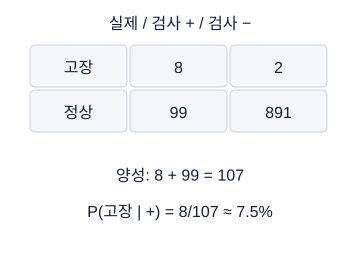

**그림 6-1. Bayes: 양성 안에서 실제 고장을 센다**

민감도80%는 양성일 때 고장일 확률이 아니다. 드문 고장은 정상 집단의 작은 오탐률에도 영향을 크게 받는다. 조건의 방향을 확인한다.

그림의 값·구조: 1000개 중고장10, 민감도80%면진양성8. 정상990의오탐률10%면거짓양성99. 양성107중실제고장8.

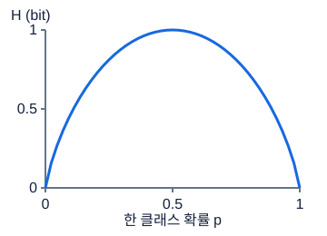

**그림 6-2. 이진 엔트로피는 반반일 때 최대**

다음 결과가 확실하면 불확실성은 작다. 50:50에서는 어느 쪽인지 가장 모른다. cross-entropy는 예측 분포까지 관여하므로 이 곡선 자체와 같지는 않다.

그림의 값·구조: H(p)=-p log2 p -(1-p)log2(1-p). p=0,1에서는0bit, p=.5에서는1bit.

### 숫자로 끝까지 따라가기

실제 고장률 1%면 10000×0.01=100대가 고장이다. 민감도 90%이면 고장 중 경보는 100×0.9=90대, 놓침은 10대다. 정상은 10000−100=9900대다. 정상 중 잘못 경보를 울리는 비율이 10%라면 오경보는 9900×0.1=990대, 정상 판정은 8910대다. 따라서 경보 차량 중 실제 고장 비율은 90/(90+990)=90/1080=1/12≈8.33%다. 탐지기가 고장을 잘 잡더라도 정상 차량의 수가 훨씬 많아 오경보가 경보 목록을 채울 수 있다. 이것은 설명을 위한 가상 수치이며 실제 검사 성능이 아니다.

엔트로피 H(p)=−Σ p_i log₂(p_i)는 결과 i의 확률 p_i에 그 결과의 놀라움 −log₂(p_i)를 곱해 평균한 값이다. bit는 밑 2 로그를 쓸 때의 정보 단위다. p=[1/2,1/2]이면 −0.5×(−1)−0.5×(−1)=1 bit다. 모델이 q=[3/4,1/4]로 예측하면 교차엔트로피 H(p,q)=−Σp_i log₂(q_i)=−0.5log₂(0.75)−0.5log₂(0.25)≈0.20751875+1=1.20751875다.

KL 발산은 D_KL(p||q)=Σp_i log₂(p_i/q_i)다. 여기서는 0.5log₂(2/3)+0.5log₂(2)=−0.29248125+0.5=0.20751875다. 따라서 교차엔트로피=엔트로피+KL이라는 관계가 1.20751875=1+0.20751875로 확인된다. 자연로그를 쓰면 단위가 nat로 바뀌고 값도 달라지지만 관계는 유지된다. 0log0 항은 극한에 따라 0으로 다루며, 실제 확률이 양수인데 모델 확률이 0인 결과는 무한한 비용을 만든다.

```python
import numpy as np

fault = 10_000 * 0.01
true_alarm = fault * 0.9
false_alarm = (10_000 - fault) * 0.1
precision = true_alarm / (true_alarm + false_alarm)
p = np.array([0.5, 0.5])
q = np.array([0.75, 0.25])
entropy = -np.sum(p * np.log2(p))
cross_entropy = -np.sum(p * np.log2(q))
kl = np.sum(p * np.log2(p / q))
print(precision, entropy, cross_entropy, kl)
assert np.isclose(precision, 1 / 12)
assert np.isclose(cross_entropy, entropy + kl)
```

### 시험 문제로 연결하기

우도는 관측한 입력·정답을 고정하고, 매개변수 θ의 후보마다 그 관측을 얼마나 그럴듯하게 설명하는지 비교하는 함수다. 같은 p(y|x,θ)를 쓰더라도 정답 y를 움직이며 보는 확률과 θ를 움직이며 보는 우도는 관점이 다르다. 연속값에서는 확률밀도를 사용하므로 특정 실수 한 점의 확률과 혼동하지 않는다. 독립 표본들의 우도를 곱한 뒤 로그를 취하면 로그의 합이 되고, 음수를 붙인 음의 로그우도는 작을수록 좋다.

정답이 평균 예측 주변의 일정한 분산을 가진 가우시안 잡음으로 발생한다고 가정하면 음의 로그우도의 핵심 항이 제곱오차가 된다. 0·1 정답을 베르누이 분포로 모델링하면 이진 교차엔트로피가 된다. 여러 종류 중 하나를 고르는 범주분포는 다중분류 교차엔트로피와 연결된다. 손실 선택은 단순 취향이 아니라 어떤 결과와 오차 구조를 가정하는지와 관계가 있다.

### 자주 헷갈리는 지점

KL은 일반적으로 방향을 바꾸면 값이 달라지고 보통 거리의 삼각부등식을 보장하지 않아 일반적인 거리 척도가 아니다. 음수가 되지 않는다는 특징만으로 유클리드 거리와 같다고 생각하면 안 된다. 상관은 인과를 증명하지 않는다. 표본이 작으면 평균과 검증 점수도 크게 흔들린다. random seed를 고정하는 것은 같은 실험을 비교하기 위한 장치이지 편향 없는 참값을 만드는 장치가 아니다.

통계적 bias는 반복해서 다른 학습 표본을 뽑았을 때 예측 평균이 참 관계에서 벗어나는 정도이고, variance는 표본에 따라 예측이 흔들리는 정도다. 앞 장 선형층의 bias b라는 상수항과 다른 의미다. 단순한 모델은 놓치는 관계가 많을 수 있고, 매우 복잡한 모델은 표본의 우연한 잡음까지 따라갈 수 있다. 교차검증 평균과 산포가 도움이 되지만 동일 개체·시간의 의존성을 무시한 분할은 반복 횟수만 늘려도 정직한 평가가 되지 않는다.

우도에 로그를 붙이는 이유를 작은 관측 두 개로 생각하자. 첫 관측의 실제 결과를 모델이 확률 0.8로, 둘째 실제 결과를 확률 0.7로 설명하고 두 관측이 조건부로 독립이라고 가정하면 함께 관측될 우도는 0.8×0.7=0.56이다. 로그를 취하면 log0.8+log0.7=log0.56이고 음의 로그우도는 약 0.579818이다. 관측이 많아도 곱을 합으로 바꾸어 계산할 수 있다. 다만 같은 차량의 연속 측정처럼 서로 관련된 관측에 독립 가정이 맞는지는 별도로 검토한다.

평균과 중앙값은 서로 경쟁하는 정답이 아니라 다른 질문에 답하는 요약이다. 모든 관측의 총량을 균등하게 나누는 관점에는 평균이 자연스럽고, 절반이 위에 있고 절반이 아래에 있는 위치를 보려면 중앙값이 자연스럽다. 큰 값 하나가 실제 중요한 비용이라면 평균의 민감성을 단점으로만 볼 수 없다. 반대로 센서 오류 하나가 중심 추정을 흔들면 중앙값이나 사분위범위가 더 안정적인 출발점이 될 수 있다. 사용할 지표의 의미와 데이터 발생 배경이 선택의 기준이다.

표준편차가 영인 상수 열은 다른 변수와의 상관을 이 공식으로 계산할 수 없다. 분모가 영이 되기 때문이다. 이 결과가 결측으로 나온다고 상관이 영이라는 뜻으로 바꾸면 서로 다른 상태를 합친다. 통계량을 해석할 때는 숫자의 범위뿐 아니라 정의되는 조건, 표본 수, 원래 단위까지 같이 기록한다. 작은 검증 집합에서 정확도 한두 점 차이를 과장하지 않는 태도도 같은 원리다.

### 스스로 확인하기

1. P(고장|경보)와 P(경보|고장)의 분모는 각각 무엇인가?
2. p=[1,0]과 p=[0.5,0.5] 중 엔트로피가 큰 것은? 그 이유는?
3. 모델 예측 q만 바꾸면 실제 분포 p의 엔트로피 H(p)도 바뀌는가?
4. 검증 점수 하나가 좋아졌다면 모델이 확실히 좋아졌다고 말할 수 있는가?

### 정답과 이유

1. 첫째는 경보 차량 전체, 둘째는 실제 고장 차량 전체다. 같은 90대가 분자여도 각각 1080과 100으로 나누므로 결과가 다르다.
2. [0.5,0.5]다. 결과를 미리 알 수 없는 정도가 가장 크다. [1,0]은 항상 첫 결과이므로 엔트로피가 0이다.
3. 아니다. p가 고정이면 H(p)는 일정하고, q의 차이는 KL과 교차엔트로피를 바꾼다.
4. 아니다. 표본 구성, 학습 무작위성, 반복 선택에 의한 검증 과적합을 고려해야 한다. 공정한 분할과 동일 조건 비교, 여러 적절한 분할의 안정성을 함께 확인한다.

### 더 읽을 공식 자료

[SciPy entropy 문서](https://docs.scipy.org/doc/scipy/reference/generated/scipy.stats.entropy.html)는 로그 밑과 엔트로피·KL·교차엔트로피 관계를 확인하는 자료다. 표본 평가의 불확실성과 분할은 [scikit-learn cross-validation guide](https://scikit-learn.org/stable/modules/cross_validation.html)를 참고한다. 예제의 모든 빈도와 계산은 학습을 위해 새로 구성했다.

## 07. EDA: 모델보다 먼저 데이터 생성 과정을 읽기

### 먼저 떠올릴 장면

카페 두 곳의 하루 주문량과 전기 사용량을 조사했다고 하자. 전체 표에서는 주문이 많을수록 전기 사용량이 작아 보이는데, 각 카페 안에서는 주문이 늘수록 전기도 더 쓴다. 어느 계산이 틀린 것일까? 둘 다 계산은 맞을 수 있다. 작은 절전형 카페와 큰 노후 카페의 기본 사용량 차이가 섞이면 전체 관계와 그룹 안 관계가 달라진다. EDA는 그래프를 많이 만드는 행사가 아니라 이런 데이터 생성 배경을 질문하는 단계다.

이번 강의를 마치면 그래프 옆에 “그래서 어떤 확인이나 모델링 결정을 할 것인가”를 적어 보자. 히스토그램에서 멀리 떨어진 점을 보았다는 관찰과 그 행을 삭제해야 한다는 결정 사이에는 단위·측정·실제 사건을 확인하는 단계가 필요하다. 예쁜 그림만 남고 판단 근거가 없다면 탐색이 작업 흐름으로 연결되지 않은 것이다.

### 낯선 말부터 풀기

EDA는 Exploratory Data Analysis, 탐색적 데이터 분석의 약자다. 단변량 분석은 열 하나의 분포를 보고, 이변량 분석은 두 열의 관계를 본다. 그룹 분석은 사람·차량·공장 같은 묶음별 차이를, 시간 분석은 순서와 변화 구간을 본다. 데이터 사전은 열마다 의미, 단위, 자료형, 결측률, 생성 시점과 사용 가능 여부를 적은 기록이다. 온도 열의 숫자 100만으로는 섭씨인지 화씨인지, 고장 직전인지 수리 후인지 알 수 없다.

히스토그램은 숫자 범위를 구간, 즉 bin으로 나누고 각 구간에 속한 관측 개수를 막대로 그린다. 막대의 가로 폭은 값의 범위이지 샘플 순서가 아니다. 산점도는 샘플 하나를 두 변수의 좌표에 점으로 찍는다. 이상치는 다른 값들에서 멀리 떨어진 관측이지만 오류와 동의어는 아니다. 교란변수는 비교하는 두 변수와 관련되어 단순 관계 해석을 흔들 수 있는 제3의 변수다. 아래 예의 카페 종류는 그룹별 기본 사용량과 주문량이 달라 전체 관계를 바꾸는 요인이다.

결측률은 빈칸 수를 전체 행 수로 나눈 비율이고, 고유값 수는 서로 다른 값의 개수다. 고유값 수가 행 수에 가까운 열은 식별자일 가능성이 있지만 고유한 측정값도 많으므로 자동 삭제 규칙으로 삼지 않는다. target은 먼저 연속값·종류·다중라벨·여러 연속 출력 중 무엇인지 확인한다. 종류별 비율이 크게 다른 상태가 클래스 불균형이다. 시간에 따라 분포가 바뀌는 현상은 분포 변화로, 과거 평균이 미래를 대표하지 못하는 이유가 될 수 있다.

### 그림을 읽는 순서

먼저 축·색·연결 방향을 읽고, 각 그림 아래의 설명으로 확인하세요. 손계산은 다른 작은 숫자를 쓰는 독립 연습일 수 있습니다.

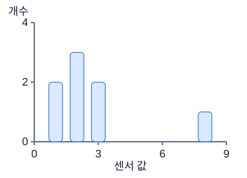

**그림 7-1. 평균 하나가 놓치는 분포**

학습용 작은 빈도 그림이다. 8을 보았다고 자동으로 지우지 않는다. 센서 고장인지 드물지만 실제인 상태인지 데이터 생성 과정을 확인한다.

그림의 값·구조: 값은1,1,2,2,2,3,3,8. 대부분1~3이지만8이평균을늘린다.

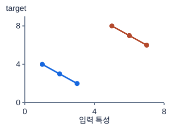

**그림 7-2. 전체 상관과 그룹 내부 관계는 다를 수 있다**

색은 서로 다른 차량 그룹이다. 전체 산점도만 보고 하나의 원인 관계라고 단정하면 안 된다. 실제 시험 데이터가 아니라 그룹별 EDA를 설명하는 합성 예다.

그림의 값·구조: 파란그룹(1,4),(2,3),(3,2), 주황그룹(5,8),(6,7),(7,6). 각그룹안에서는감소하지만전체평균위치는증가.

### 숫자로 끝까지 따라가기

값 [1,2,2,3,4,18]의 합은 30, 평균은 30÷6=5다. 가운데 두 값은 2와 3이므로 중앙값은 (2+3)÷2=2.5다. 다섯 값은 5보다 작은 첫 구간, 18은 마지막 구간에 들어가 빈도 합은 5+0+0+1=6이다. 평균이 가장 빈번한 값이나 중앙값일 필요는 없다. 구간 경계의 포함 규칙도 명시해야 5 같은 값이 두 번 세어지지 않는다.

산점도 예에서 전체 x 평균은 (1+2+3+7+8+9)/6=5이고 y 평균은 (8+9+10+2+3+4)/6=6이다. 평균에서 뺀 x는 [−4,−3,−2,2,3,4], y는 [2,3,4,−4,−3,−2]다. 위치별 곱은 [−8,−9,−8,−8,−9,−8], 합 −50, 모집단 공분산 −50/6=−25/3이다. x와 y의 제곱 편차 합은 각각 58이므로 각 분산은 58/6=29/3이다. 상관은 (−25/3)/(29/3)=−25/29≈−0.8621이다.

A 안에서는 x 평균 2, y 평균 9다. 두 편차가 모두 [−1,0,1]이어서 공분산과 각 분산이 2/3, 상관은 1이다. B도 같은 편차라 상관 1이다. 전체 상관이 음수라는 계산과 각 그룹 상관이 양수라는 계산이 동시에 맞는다. 따라서 “주문을 늘리면 전기를 절약한다”는 결론은 이 관찰 자료만으로 정당화되지 않는다.

```python
import numpy as np

values = np.array([1., 2., 2., 3., 4., 18.])
counts, edges = np.histogram(values, bins=[0, 5, 10, 15, 20])
x = np.array([1., 2., 3., 7., 8., 9.])
y = np.array([8., 9., 10., 2., 3., 4.])
overall = np.corrcoef(x, y)[0, 1]
within_a = np.corrcoef(x[:3], y[:3])[0, 1]
print("평균/중앙값:", values.mean(), np.median(values))
print("히스토그램:", counts.tolist(), edges.tolist())
print("전체/카페 A 상관:", overall, within_a)
assert counts.tolist() == [5, 0, 0, 1]
assert np.isclose(overall, -25 / 29) and np.isclose(within_a, 1.)
```

### 시험 문제로 연결하기

표를 처음 보면 한 행이 누구의 어느 시점인지, 같은 개체가 반복되는지, 정답은 언제 생성되는지부터 묻는다. 고장 이전의 센서로 미래 고장을 예측한다면 수리 결과는 값이 잘 정리되어 있어도 사용할 수 없는 사후 정보다. 무작위 행 분할은 같은 차량의 비슷한 기록을 학습·검증 양쪽에 넣을 수 있다. 실제 평가가 새 차량이라면 개체를 통째로 나누는 검증이 더 적절한지 확인한다.

회귀 target은 음수가 가능한지, 단위가 무엇인지, 극단 꼬리가 실제 분포인지 확인한다. 분류 target은 모든 클래스가 학습 부분에 있는지와 그룹·시간별 비율을 본다. 범주형 입력은 새 범주 비율, 희귀 범주의 관측 수를 조사한다. 평균이 높은 희귀 범주라도 관측 두 건뿐이면 안정적인 특징이라고 단정하지 않는다. 시계열에서는 시각 차이가 0.01초에서 5초로 커지는 구간이 통신 중단인지 다른 운행 시작인지 확인하고 창이 단절을 넘지 않게 한다.

### 자주 헷갈리는 지점

상관이 거의 1인 특성을 찾았다고 바로 축하하지 않는다. 정답에서 계산한 열이거나 예측 이후 정보일 수 있다. 반대로 선형 상관이 0이어도 제곱, 임계값, 여러 특성의 상호작용에 예측 정보가 있을 수 있다. 히스토그램 막대 모양도 구간 폭에 민감하므로 구간을 바꿔 보고 원자료의 개수를 함께 확인한다. 밀도로 그린 히스토그램은 막대 높이가 확률 자체가 아니라 면적이 확률에 대응하므로 빈도 그림과 축을 구분한다.

전체 자료의 schema와 생성 구조를 이해하는 확인과 정답을 이용해 특성을 고르는 학습은 다르다. 평균 대치, 스케일러, PCA, target 기반 선택은 학습 부분에서만 맞춘다. 검증 결과를 사람이 수십 번 보며 특성을 선택해도 검증 자료에 과적합할 수 있다. 탐색 기록에 관찰, 가설, 확인 방법, 실제 변경을 나누어 적으면 한 번의 좋은 그림을 사실로 과장하지 않게 된다.

그룹을 비교할 때는 평균만 적지 말고 관측 수도 함께 적는다. 한 공장은 두 관측 중 하나가 결측이고 다른 공장은 백 관측 중 열 개가 결측이면, 결측 개수는 둘째가 많지만 결측률은 첫째가 절반으로 더 높다. 무엇을 비교하려는지에 따라 개수와 비율이 다른 정보를 준다. 같은 이유로 표본 한두 개의 범주 평균이 전체 평균과 크게 달라도 안정적인 차이인지 확인해야 한다. 그림의 색깔이나 막대 높이보다 그 숫자를 지탱하는 관측의 수가 먼저다.

### 스스로 확인하기

1. 18이 다른 값보다 크다는 이유만으로 삭제할 수 있는가? 먼저 확인할 두 가지는?
2. 전체 상관 −0.862와 그룹 내부 상관 1이 동시에 가능했던 이유는?
3. 새 차량 예측이 목표인데 행 무작위 분할 점수만 높다. 어떤 분할을 추가로 확인할 것인가?
4. target과 상관 0인 특성을 모두 없애도 안전한가?

### 정답과 이유

1. 아니다. 측정 단위·입력 오류 여부와 실제 드문 사건의 기록인지 확인한다. 고장 탐지에서 극단값이 핵심 신호일 수도 있다.
2. 두 카페의 기본 수준 차이가 그룹 내부 증가 관계와 반대로 배치되어 있었기 때문이다. 그룹을 섞은 비교는 같은 카페 안 변화와 다른 질문이다.
3. 차량 ID를 기준으로 학습과 검증의 차량이 겹치지 않는 그룹 분할을 검토한다. 실제 사용 환경과 비슷한 새로운 개체 일반화를 평가해야 한다.
4. 안전하지 않다. 상관계수는 선형 관계의 일부만 측정한다. 비선형 관계와 상호작용을 점검하고 특성 선택도 학습 부분 안에서 검증한다.

### 더 읽을 공식 자료

[NIST 히스토그램 안내](https://www.itl.nist.gov/div898/handbook/eda/section3/histogra.htm)는 막대의 빈도·밀도와 분포 읽기를 설명한다. 상관 계산은 [NumPy corrcoef](https://numpy.org/doc/stable/reference/generated/numpy.corrcoef.html)를 참고한다. 탐색이 평가 정보를 사용하지 않도록 하는 원리는 [scikit-learn data leakage](https://scikit-learn.org/stable/common_pitfalls.html#data-leakage)에서 확인한다.

## 08. 전처리: 결측·이상치·스케일·인코딩·증강

### 먼저 떠올릴 장면

키는 미터로, 연봉은 원으로 적은 사람 자료를 이웃 찾기 모델에 넣는다고 하자. 키 차이 0.1과 연봉 차이 1,000,000을 제곱해서 더하면 연봉이 사실상 모든 거리를 결정한다. 두 특성 중 무엇이 중요한지 모델이 배운 것이 아니라 기록 단위가 비교를 지배한 것이다. 전처리는 이런 단위와 결측 표현을 모델이 사용할 수 있는 일관된 표현으로 바꾸는 과정이다.

그러나 모든 값을 작게 만들거나 빈칸을 없애는 것이 목적은 아니다. 실제 고장 신호인 극단값을 잘라 버릴 수 있고, 검증 평균으로 학습 값을 바꾸면 평가할 자료의 정보가 미리 들어간다. 전처리도 데이터에서 기준을 배우는 작업임을 기억하자. 모델에만 학습·검증 구분이 필요한 것이 아니다.

### 낯선 말부터 풀기

결측 대치는 빈 입력 값을 일정한 규칙으로 채우는 일이다. MCAR는 결측 발생이 값들과 무관한 경우, MAR는 관측된 다른 변수를 알고 나면 결측인 값 자체에 대한 의존이 없다고 보는 경우, MNAR는 관측한 정보만으로 설명되지 않고 결측값 자체 등에 의존하는 경우다. 예를 들어 고온에서 센서가 멈춘다면 빈칸이 고온 상태의 단서일 수 있다. 실제 관측만으로 유형을 확정하기 어렵기 때문에 결측 위치와 생성 원인을 함께 조사한다.

fit은 평균·중앙값·범주 목록 같은 처리 기준을 학습 자료에서 정하는 일, transform은 이미 정한 기준을 적용하는 일이다. 표준화 z=(x−μ)/σ의 μ는 학습 평균, σ는 학습 표준편차다. Min-Max는 (x−a)/(b−a)이며 a,b는 학습 최솟값과 최댓값이다. Robust scaling은 중앙값을 빼고 IQR로 나누어 극단값의 영향을 덜 받게 한다. “덜 민감하다”는 말이지 이상치를 찾아 삭제한다는 말은 아니다.

범주 인코딩은 종류를 숫자 표현으로 바꾸는 일이다. one-hot은 가능한 종류마다 표시 열을 하나씩 만들고 해당 종류 열만 1로 둔다. ordinal은 종류에 번호를 붙여 한 열로 표현하지만 실제로 없는 크기·순서를 모델에 암시할 수 있다. frequency 인코딩은 학습 자료에서 그 종류가 나온 비율을 사용한다. target encoding은 종류별 정답 통계를 쓰므로 현재 행의 정답이나 검증 정답이 섞이지 않도록 별도 분할이 필요하다. embedding은 종류별 숫자 벡터를 학습하는 방식이며 처음 보는 종류의 자리도 설계해야 한다.

### 그림을 읽는 순서

먼저 축·색·연결 방향을 읽고, 각 그림 아래의 설명으로 확인하세요. 손계산은 다른 작은 숫자를 쓰는 독립 연습일 수 있습니다.

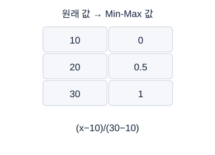

**그림 8-1. 스케일을 바꿔도 샘플의 대응은 그대로**

각 행은 같은 관측값의 전후 모습이다. 단위를 맞추는 것이지 정답을 바꾸거나 표를 정렬하는 과정이 아니다. 상수 열은 분모0 정책이 필요하다.

그림의 값·구조: 원래값10,20,30이 MinMax후0,.5,1로 대응된다.

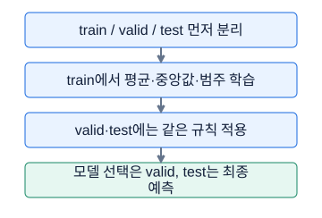

**그림 8-2. 전처리도 학습 데이터에서 배운다**

fit은 규칙을 얻는 단계, transform은 얻은 규칙을 적용하는 단계다. validation에서 얻은 평균까지 학습에 섞으면 새로운 데이터에 대한 평가가 흐려진다.

그림의 값·구조: train / valid / test 먼저 분리 → train에서 평균·중앙값·범주 학습 → valid·test에는 같은 규칙 적용 → 모델 선택은 valid, test는 최종 예측

### 숫자로 끝까지 따라가기

학습 입력 [0,NaN,10]을 관측된 중앙값으로 채운다고 하자. 관측값 0과 10의 중앙값은 5여서 [0,5,10]이 된다. 평균 μ=(0+5+10)/3=5, 모집단 분산은 ((−5)²+0²+5²)/3=50/3, 표준편차 σ=√(50/3)≈4.082483이다. 표준화 결과는 [−5/σ,0,5/σ]≈[−1.224745,0,1.224745]다. 검증 [NaN,15]는 학습 중앙값으로 [5,15]가 되고 표준화하면 [0,10/σ]≈[0,2.449490]다.

같은 자료의 Min-Max 기준은 a=0,b=10이다. 학습 결과 [0,0.5,1], 검증 결과 [0.5,1.5]다. 검증을 별도로 fit하면 [5,15]의 평균 10이나 범위 10을 쓰게 되어 같은 원래 값 5가 다른 좌표로 바뀐다. 모델이 학습한 좌표계가 사라지므로 별도 fit을 하지 않는다.

이상치 경계 예에서는 Q1=10,Q3=14가 주어졌다고 하자. IQR=14−10=4, 하한=10−1.5×4=4, 상한=14+1.5×4=20이다. 21은 경계 밖이고 20은 “상한보다 큰 값” 규칙에서는 경계 안이다. 이 표시는 검사 후보를 찾은 결과이며, 21을 삭제할지 제한할지 그대로 쓸지는 측정 맥락과 검증으로 정한다.

```python
import numpy as np

train = np.array([[0.], [np.nan], [10.]])
valid = np.array([[np.nan], [15.]])
median = np.nanmedian(train, axis=0)
train_filled = np.where(np.isnan(train), median, train)
valid_filled = np.where(np.isnan(valid), median, valid)
mean = train_filled.mean(axis=0)
std = train_filled.std(axis=0)
safe_std = np.where(std == 0, 1., std)
train_z = (train_filled - mean) / safe_std
valid_z = (valid_filled - mean) / safe_std
lo, hi = train_filled.min(axis=0), train_filled.max(axis=0)
valid_mm = (valid_filled - lo) / np.where(hi == lo, 1., hi - lo)
print(train_z.ravel(), valid_z.ravel(), valid_mm.ravel())
assert np.allclose(valid_z.ravel(), [0., np.sqrt(6.)])
assert np.allclose(valid_mm.ravel(), [0.5, 1.5])
```

코드의 `axis=0`은 샘플 방향으로 집계하여 열마다 기준 하나를 만든다는 뜻이다. `np.where`는 조건에 따라 대체값 또는 원래 값을 선택한다. 예제는 무한대가 없고 각 열에 적어도 한 관측값이 있다고 가정한다. 열 전체가 결측이면 중앙값도 결측이므로 별도의 계약이 필요하다. 상수 열의 표준편차 0은 분모 1로 대체해 학습 상수값을 0으로 만든다.

### 시험 문제로 연결하기

일반적인 수치 입력은 결측 처리 후 스케일 기준을 학습하고, 범주 입력은 결측 표시와 새 범주 정책을 정한다. One-hot에서 학습 범주가 A,B인데 새 C가 오면 별도 unknown 열을 만들지, 해당 범주 부분을 모두 0으로 할지 사용하는 도구와 계약을 확인한다. 고유 범주가 매우 많으면 열 수가 커져 메모리가 늘어난다. 대부분 0인 희소 표현을 PyTorch용으로 무조건 조밀 배열로 바꾸기 전에 행×열×byte 수를 계산한다.

학습 자료 자체에 target encoding을 만들 때는 각 행의 정답을 제외한 다른 학습 분할에서 통계를 구해 붙이는 out-of-fold 방식이 필요하다. 검증·시험 자료에는 전체 해당 학습 부분의 통계를 적용한다. 정답 클래스의 A,B,C를 0,1,2로 바꾸는 작업은 입력 범주의 순서를 가정하는 것과 다르다. 이 숫자는 클래스 위치이고 예측 후 원래 이름으로 돌리는 대응표를 저장해야 한다.

### 자주 헷갈리는 지점

forward fill은 이전 관측값을 빈칸에 전달하는 방법이다. 정확한 시간순서와 같은 개체 안에서, 실제 예측 시점에 이미 사용 가능한 과거만 전달하면 인과적일 수 있다. split 전에 했다는 사실만으로 모든 경우가 누수인 것은 아니지만 미래·다른 개체·평가 시점에 알 수 없는 과거를 섞으면 위험하다. backward fill과 양쪽 보간은 미래 관측을 이용할 수 있으므로 예측 시점의 가용성을 별도로 확인한다.

증강은 입력을 바꾸되 정답 의미를 보존하는 연습 자료 확대다. 이미지의 작은 이동·회전·색 변화가 도움이 될 수 있지만 좌우 방향이 정답이면 뒤집기는 정답을 바꾼다. 시계열에 잡음을 넣거나 창을 자르면 사건 시점과 예측할 미래 구간을 보존해야 한다. 무작위 증강은 학습에만 적용하고 검증·시험은 일정한 변환으로 비교한다. 트리는 주로 값의 순서로 분할하여 단조 스케일 변화에 비교적 둔감하지만 KNN·SVM·PCA와 신경망은 단위의 영향이 크다.

상수 열의 새 값 처리도 따로 생각해야 한다. 학습에서 모두 일곱이었으니 학습값을 영으로 만든다는 정책과, 앞으로 어떤 새 값이 와도 그 열을 무조건 영으로 만든다는 정책은 다르다. 예제처럼 분모를 하나로 두면 새 값 아홉은 평균 일곱에서 두만큼 떨어진 값으로 남는다. 반면 작은 함수 문제에서 지정 열의 유효값을 모두 영으로 바꾸라는 명세가 있다면 그 요구를 구현해야 한다. 자주 쓰는 관례를 외우는 것보다 이번 함수가 무엇을 약속하는지 읽는 것이 우선이다.

### 스스로 확인하기

1. 학습 Min-Max 범위가 0~10인데 새 값 15가 1.5로 나왔다. 반드시 1로 잘라야 하는가?
2. 학습·검증을 각각 평균 0으로 만들면 더 공정한가?
3. 모든 값이 7인 열을 표준화할 때 생기는 문제는 무엇인가?
4. 이미지 좌우 반전과 시계열 시간 이동은 언제 잘못된 증강이 되는가?

### 정답과 이유

1. 아니다. 학습 범위 밖이라는 정상적인 결과다. clipping이 문제의 계약이거나 검증한 정책일 때만 제한한다.
2. 아니다. 검증이 새 기준을 배우며 학습한 좌표계와 달라진다. 학습에서 정한 평균·표준편차를 양쪽에 적용한다.
3. 표준편차가 0이라 0으로 나누게 된다. 분모 대체, 열 제외 등 명세에 맞는 정책을 정하고 검증에도 동일하게 적용한다.
4. 변환이 정답의 의미를 바꿀 때다. 좌우 구분을 맞히거나 특정 미래 사건 시점을 예측한다면 입력만 바꾸고 정답을 그대로 둘 수 없는 경우가 있다.

### 더 읽을 공식 자료

[scikit-learn preprocessing](https://scikit-learn.org/stable/modules/preprocessing.html)은 스케일링과 범주 표현을, [imputation](https://scikit-learn.org/stable/modules/impute.html)은 결측 처리 도구를 설명한다. 학습 기준 공유와 누수 방지는 [common pitfalls](https://scikit-learn.org/stable/common_pitfalls.html#data-leakage)에서 확인한다. 실제 전처리 정책은 데이터 의미와 사용 시점에 맞게 정한다.

## 09. Feature Engineering·Selection·Extraction

### 먼저 떠올릴 장면

자동차의 주행거리와 사용한 연료량을 각각 아는 것과 “연료 1리터당 주행거리”를 아는 것은 어떻게 다를까? 원래 값이 충분하면 비율을 계산할 수 있지만 어떤 모델은 그 관계를 쉽게 배우지 못한다. 사람이 비율을 새 열로 만들어 주면 예측에 유용한 관계를 미리 표현해 줄 수 있다. 반대로 거의 같은 센서 열 열 개가 있으면 중복 일부를 줄여 학습을 가볍게 할 수도 있다. 이때 새 열 만들기, 기존 열 고르기, 여러 열을 섞어 새 좌표 만들기는 서로 다른 작업이다.

특성이 많으면 무조건 좋다는 생각도 경계한다. 불필요한 열은 메모리와 계산량을 늘리고 작은 데이터에서 우연한 관계를 학습하게 할 수 있다. 그러나 분산이 작거나 단독 상관이 낮다고 무조건 쓸모없는 것도 아니다. 이번 장의 PCA 예제에서는 전체 퍼짐의 80%를 남겼는데 정작 클래스 구분이 사라지는 상황을 직접 계산한다.

### 낯선 말부터 풀기

Feature engineering은 문제의 구조를 활용해 특성을 만드는 일이다. 두 센서의 차이, 거리/연료 비율, 날짜의 시간대, 과거 평균 등이 해당한다. Selection은 원래 특성 중 일부를 선택하므로 남은 열 이름의 의미를 유지한다. Extraction은 여러 특성을 새 표현으로 변환하는 일이어서 PCA처럼 입력 열의 선형 조합으로 새 좌표를 만들 수 있다. 차원축소는 표현에 쓰는 숫자 수를 줄인다는 결과를 말하며 선택과 추출 모두 그 수단이 될 수 있다.

선택 방법은 세 계열로 나눌 수 있다. Filter는 분산·상관·통계적 연관처럼 모델을 반복 학습하지 않는 기준으로 고른다. 카이제곱 기반 일부 구현은 입력이 음수가 아니어야 하는 등 각 기준의 가정을 확인한다. Wrapper는 특정 모델로 열 조합을 바꿔 평가한다. RFE는 모델을 학습하고 낮은 중요도 열을 제거하는 일을 반복하는 재귀적 특성 제거다. Embedded는 L1 계수나 트리 중요도처럼 모델을 학습하는 과정에 선택 신호가 들어 있는 방식이다. 빠름, 계산 비용, 상호작용 포착, 특정 모델에 대한 의존이라는 차이가 있다.

PCA의 주성분은 중심화한 입력이 많이 퍼지는 서로 직각인 방향이다. 고유값 λ는 그 방향의 분산이며 설명분산비는 λ를 모든 고유값 합으로 나눈 비율이다. 여기서 분산은 정답과 관계없이 입력 X의 퍼짐이다. LDA는 클래스 평균 사이를 멀리, 같은 클래스 내부를 상대적으로 가깝게 만드는 지도 차원축소 방법이다. 특성 수 F, 클래스 수 C이면 보통 출력 차원 상한은 min(F,C−1)이며 실제 데이터 rank가 더 낮으면 유효 방향은 더 적을 수 있다.

### 그림을 읽는 순서

먼저 축·색·연결 방향을 읽고, 각 그림 아래의 설명으로 확인하세요. 손계산은 다른 작은 숫자를 쓰는 독립 연습일 수 있습니다.

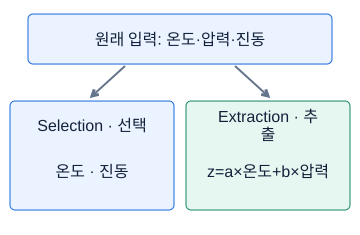

**그림 9-1. 열 선택과 새 축 만들기는 다르다**

두 화살표는 대안이지 순차 단계가 아니다. selection은 원래 열 일부를 고르고, extraction은 새 축을 만든다. PCA의 주성분은 보통 여러 열의 선형결합이다.

그림의 값·구조: 선택은온도압력진동에서원래열일부를고른다. 추출은여러열을조합해새좌표를만든다.

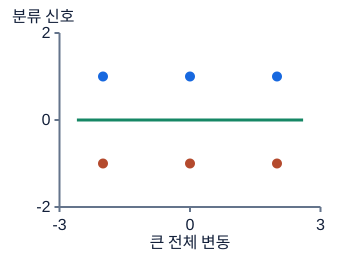

**그림 9-2. 분산이 큰 방향과 분류에 좋은 방향**

PCA는 label 없이 전체 분산을 보고, LDA는 label을 이용해 그룹 사이와 내부 분산을 비교한다. 녹색 가로선은 이 예제의 큰 분산 방향이다.

그림의 값·구조: 두그룹은x방향으로넓게퍼지지만y가다르다. 큰전체분산방향이항상클래스구분방향은아니다.

### 숫자로 끝까지 따라가기

네 점의 두 열 합은 모두 0이므로 평균은 [0,0]이다. 첫 열 제곱합은 9+1+1+9=20, 둘째도 1+9+9+1=20이다. 두 열의 위치별 곱 합은 3+3+3+3=12다. 모집단 공분산 S=XᵀX/4는 [[5,3],[3,5]]다. S에 v₁=(1,1)/√2를 곱하면 (8,8)/√2=8v₁, v₂=(1,−1)/√2를 곱하면 (2,−2)/√2=2v₂다. 따라서 분산은 8과 2, 설명분산비는 8/(8+2)=0.8과 0.2다.

첫 좌표 t₁=(x₁+x₂)/√2는 [−4/√2,−4/√2,4/√2,4/√2]=[−2√2,−2√2,2√2,2√2]다. 둘째 좌표 t₂=(x₁−x₂)/√2는 [−√2,√2,−√2,√2]다. 정답을 x₁>x₂이면 1, 아니면 0으로 정의하면 y=[0,1,0,1]이다. t₁만 남기면 같은 입력 좌표에 서로 다른 정답이 섞인다. 두 점을 구분할 다른 정보가 없어졌으므로 어떤 결정적 모델도 이 네 점을 모두 맞힐 수 없다. t₂의 부호만 있으면 이 정답은 구분된다.

```python
import numpy as np

X = np.array([[-3., -1.], [-1., -3.], [1., 3.], [3., 1.]])
mean = X.mean(axis=0)
centered = X - mean
S = centered.T @ centered / len(X)
V = np.array([[1., 1.], [1., -1.]]) / np.sqrt(2.)
projected = centered @ V
y = (X[:, 0] > X[:, 1]).astype(int)
variance = projected.var(axis=0)
print(S, projected, y, variance / variance.sum(), sep="\n")
assert np.allclose(variance, [8., 2.])
assert projected[0, 0] == projected[1, 0] and y[0] != y[1]
assert np.array_equal((projected[:, 1] > 0).astype(int), y)
```

비율 특성에도 계산 계약이 필요하다. 주행거리 120 km와 연료 6 L이면 120/6=20 km/L지만 연료가 0이면 정의되지 않는다. 분모에 작은 ε를 더하는 방식의 ε는 0으로 나눔을 막는 작은 양수다. 그러나 실제 불가능한 기록을 ε로 덮으면 엄청난 값이 생기므로 분모 0의 의미를 먼저 확인한다. log1p(x)는 log(1+x)이며 실수 범위에서 x>−1이 필요하므로 음수 정답·특성에 무작정 적용하지 않는다.

### 시험 문제로 연결하기

PCA 차원 수는 누적 설명분산비뿐 아니라 검증 성능, 시간, 메모리를 함께 본다. 위 데이터에서 두 클래스와 두 입력인 LDA의 출력 상한은 min(2,1)=1이다. 한 축만 남긴다는 점은 PCA와 같아도 LDA는 정답을 사용하므로 선택할 방향이 달라질 수 있다. 특성 6개, 클래스 4개라면 상한은 min(6,3)=3이다. 클래스 평균 네 점의 독립적인 차이 방향이 최대 세 개라는 기하학적 생각으로 이해한다.

시계열 engineering은 현재 시점에 무엇을 알 수 있는지가 먼저다. 값 [10,14,13,20]의 네 번째 값을 예측할 때 바로 전 두 값 평균은 (14+13)/2=13.5다. 현재 정답 20까지 포함한 (13+20)/2=16.5는 다른 문제다. lag는 과거 값을 일정 시점만큼 밀어 붙인 열, difference는 현재와 과거의 차이, rolling은 이동 구간에서 계산하는 요약이다. 미래 예측 특성이 과거만 쓰게 하려면 정렬·개체 경계·shift 시점을 함께 설계한다.

### 자주 헷갈리는 지점

`center=True`인 이동 창은 현재 앞뒤를 포함할 수 있어 미래 값이 들어간다. 전체 차량 평균도 미래 운행까지 포함하면 당시 알 수 없는 값이다. 통계에 target을 쓰지 않았더라도 이런 시간 정보 누수는 가능하다. 선택·추출 도구는 모두 학습 fold 안에서 기준을 맞추고 검증에는 같은 변환을 적용한다. 교차검증 fold는 평가를 위해 나눈 부분집합이며 각 반복마다 선택기도 다시 학습해야 한다.

상관된 특성끼리는 중요도가 나뉘거나 하나가 다른 하나를 대신할 수 있어 개별 중요도 숫자를 인과 효과처럼 읽으면 안 된다. Filter가 두 열 각각의 관계만 보면 두 열의 조합에서 나타나는 신호를 놓칠 수 있다. Wrapper는 여러 모델을 반복 학습해 비용이 크고 검증을 반복 이용하는 만큼 과적합 위험도 생긴다. L1 선택은 유용하지만 스케일이 다르면 계수 크기의 비교도 달라지므로 전처리와 함께 설계한다.

주기적인 시각은 23시와 0시가 가깝다는 정보를 sin·cos 표현으로 줄 수 있고, 시계열의 FFT는 시간의 파동을 주파수별 성분으로 바꾸는 도구다. 그러나 어떤 주파수 구간 에너지를 쓸지 정하려면 샘플링 간격과 관측 창 길이를 알아야 한다. 이미지에서는 수동 특징을 잔뜩 추가하기 전에 크기·채널·정규화·정답 보존 증강을 맞추는 것이 먼저다. 특성 아이디어의 수가 아니라 생성 과정과 검증 근거로 선택한다.

새 특성을 만들었다면 원래 열만 사용한 결과와 한 번에 하나씩 비교한다. 비율, 과거 평균, 차원축소를 모두 동시에 추가해 점수가 올랐다면 무엇이 도움을 주었는지 알기 어렵다. 같은 분할에서 한 가지 변화를 더하거나 빼며 확인하는 비교를 제거 실험이라고 부른다. 성능뿐 아니라 추가 계산 시간과 결측 증가 여부도 기록하면 제한된 시간 안에서 유지할 특성을 합리적으로 고를 수 있다.

### 스스로 확인하기

1. 기존 온도 열만 남기는 것과 온도·압력을 섞어 주성분을 만드는 것은 각각 무엇인가?
2. 위 예제에서 80% 분산을 남긴 첫 주성분으로 정답 구분을 모두 유지했는가?
3. 클래스 네 개, 입력 여섯 개인 LDA의 일반적인 최대 출력 차원은?
4. 미래 예측을 위한 차량 평균은 정답을 사용하지 않았으면 언제나 안전한가?

### 정답과 이유

1. 전자는 selection, 후자는 extraction이다. 첫 방법은 열의 원래 의미를 유지하고 둘째는 새로운 혼합 좌표를 만든다.
2. 아니다. 같은 t₁에 정답 0과 1이 겹쳤다. 입력 분산 비율은 정답 예측 정보의 비율이 아니다.
3. min(6,4−1)=3이다. 실제 rank 제약에 따라 유효 차원은 더 작을 수 있다.
4. 아니다. 미래 센서 관측을 포함한 평균도 과거 시점에는 알 수 없는 정보다. 정답 사용 여부뿐 아니라 시간과 개체 경계를 확인해야 한다.

### 더 읽을 공식 자료

[scikit-learn feature selection](https://scikit-learn.org/stable/modules/feature_selection.html), [PCA](https://scikit-learn.org/stable/modules/decomposition.html#pca), [LDA dimensionality reduction](https://scikit-learn.org/stable/modules/lda_qda.html#dimensionality-reduction-using-linear-discriminant-analysis)에서 선택 기준과 추출 목적을 비교한다. 손계산의 네 점과 정답은 분산·예측의 차이를 보여 주기 위해 새로 구성한 예다.

## 10. 선형회귀·로지스틱회귀·KNN

### 먼저 떠올릴 장면

공부 시간에서 시험 점수를 예측하고 싶다면 시간에 비례해 점수가 증가하는 직선을 먼저 그릴 수 있다. 같은 시간으로 합격 여부를 예측한다면 출력은 제한 없는 점수가 아니라 0과 1 사이 확률이어야 한다. 한편 직선 모양을 가정하지 않고 비슷한 시간을 공부한 이웃들의 결과를 참고할 수도 있다. 세 접근은 단순하지만 예측의 종류, 함수 모양, 학습과 추론 비용이 서로 다르다.

베이스라인을 먼저 만드는 이유는 문제가 쉽다고 가정해서가 아니다. 입력과 정답의 대응, 검증 분할, 성능 지표, 저장 형식을 끝까지 연결할 수 있는지 확인하고 복잡한 모델의 개선 폭을 잴 기준을 확보하기 위해서다. 같은 분할에서 단순 모델보다 못한 신경망을 얻었다면 더 오래 학습하기 전에 데이터 계약과 손실부터 점검할 수 있다.

### 낯선 말부터 풀기

선형회귀는 ŷ=wᵀx+b로 연속값을 예측한다. x는 특성 벡터, w는 특성별 가중치, b는 절편, ŷ는 예측, y는 관측 정답이다. 입력 하나이면 ŷ=wx+b의 직선이고 w는 기울기다. 잔차를 y−ŷ로 정의하면 관측에서 예측을 뺀 차이다. 평균제곱오차 MSE는 잔차 제곱의 평균이다. 잔차 부호를 반대로 정의해도 제곱오차는 같지만 미분할 때 자신이 정의한 부호를 일관되게 사용한다.

로지스틱회귀는 이름에 회귀가 들어가지만 여기서는 이진분류 모델이다. 선형 점수 z=wᵀx+b를 logit이라 하고 p=1/(1+exp(−z))라는 sigmoid로 클래스 1 확률을 만든다. logit은 확률의 로그 오즈 log(p/(1−p))와 연결된다. 확률 0.5를 기준으로 분류하면 z=0이 결정경계다. 임계값을 달리 선택하면 분류 결과도 바뀌므로 확률 예측과 최종 라벨 결정을 구분한다.

KNN은 K-Nearest Neighbors, 가까운 k개 이웃을 쓰는 방법이다. k는 참고할 학습 샘플 수다. 분류는 이웃의 투표, 회귀는 이웃 정답의 평균을 사용할 수 있다. 유클리드 거리는 두 좌표 차이 제곱합의 제곱근, 맨해튼 거리는 절댓값 합이다. 민코프스키 거리는 (Σ|x_i−u_i|^r)^(1/r)로 둘을 일반화하며 r=1이면 맨해튼, r=2이면 유클리드다. 여기서 u는 비교 상대이고 r은 거리의 지수이며 확률 p와 혼동하지 않으려고 다른 글자를 썼다.

### 그림을 읽는 순서

먼저 축·색·연결 방향을 읽고, 각 그림 아래의 설명으로 확인하세요. 손계산은 다른 작은 숫자를 쓰는 독립 연습일 수 있습니다.

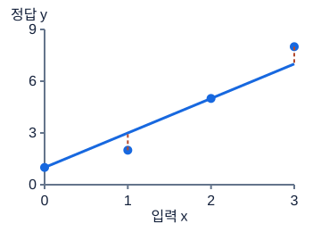

**그림 10-1. 회귀: 관측값과 선 사이의 차이를 줄인다**

주황 점선은 예측−정답의 크기를 보여 준다. MSE는 이 세로 차이를 제곱해 평균한다. x좌표까지 움직이는 최소 거리 문제가 아니다.

그림의 값·구조: 예측선y=2x+1, 관측점(0,1),(1,2),(2,5),(3,8). 세로거리가잔차.

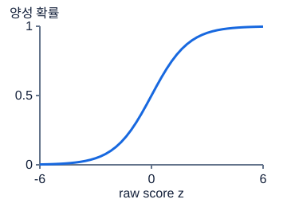

**그림 10-2. 로지스틱회귀: 점수를 확률로 바꾸기**

이진분류에서 threshold0.5는 z=0에 대응한다. threshold는 오류 비용과 검증 결과에 따라 달라질 수 있다. BCEWithLogitsLoss에는 sigmoid 전 점수를 넣는다.

그림의 값·구조: sigmoid(z)=1/(1+exp(-z)); z=0이면.5이며극단에서도0과1사이.

### 숫자로 끝까지 따라가기

회귀 입력 x=[0,1,2], 정답 y=[1,2,5]의 평균은 x̄=1, ȳ=8/3이다. 절편을 포함한 최소제곱 직선의 기울기는 Σ(x_i−x̄)(y_i−ȳ)/Σ(x_i−x̄)²다. 분자는 (−1)(−5/3)+0(−2/3)+1(7/3)=12/3=4, 분모는 1+0+1=2여서 w=2다. 절편 b=ȳ−wx̄=8/3−2=2/3이다. 예측은 [2/3,8/3,14/3]이고 잔차 y−ŷ는 [1/3,−2/3,1/3]이다. 제곱합은 1/9+4/9+1/9=6/9, MSE는 (6/9)/3=2/9≈0.222222다.

이진분류에서 z=log3이면 exp(−z)=1/3이므로 p=1/(1+1/3)=3/4다. 정답 y=1의 BCE는 −[y log p+(1−y)log(1−p)]=−log(0.75)≈0.287682다. 같은 예측인데 정답 y=0이면 −log(0.25)≈1.386294로 벌점이 커진다. BCE는 Binary Cross-Entropy, 이진 교차엔트로피의 약자이며 여기서는 자연로그를 사용한다. z=0이면 p=0.5라 어느 정답이든 손실은 log2≈0.693147이다.

KNN 질의 (0,0)에서 세 점까지 거리는 √(1²+0²)=1, √(0²+2²)=2, √(3²+0²)=3이다. k=1이면 클래스 0 한 표로 0, k=3이면 0 한 표와 1 두 표로 1이다. 회귀 정답이 차례로 [10,20,40]이었다면 k=3 평균은 (10+20+40)/3=70/3≈23.333이다. 같은 이웃 선택이라도 정답의 종류에 따라 결합 방식이 달라진다.

```python
import numpy as np

x = np.array([0., 1., 2.])
y = np.array([1., 2., 5.])
w = np.sum((x - x.mean()) * (y - y.mean())) / np.sum((x - x.mean()) ** 2)
b = y.mean() - w * x.mean()
mse = np.mean((w * x + b - y) ** 2)
z = np.log(3.)
prob = 1 / (1 + np.exp(-z))
points = np.array([[1., 0.], [0., 2.], [3., 0.]])
labels = np.array([0, 1, 1])
distances = np.linalg.norm(points, axis=1)
neighbors = np.argsort(distances, kind="stable")[:3]
prediction = np.bincount(labels[neighbors], minlength=2).argmax()
print(w, b, mse, prob, -np.log(prob), prediction)
assert np.isclose(mse, 2 / 9) and np.isclose(prob, 0.75)
assert prediction == 1
```

코드의 `argsort`는 거리를 작은 순서로 만드는 위치 목록이고, `bincount`는 정수 클래스 번호가 각각 몇 번 나왔는지 센다. `argmax`는 그 표에서 가장 큰 개수가 있는 위치를 골라 예측 클래스 번호로 쓴다. `isclose`는 실수 반올림 오차를 허용하며 두 수가 충분히 가까운지 검사한다. 배열 전체를 비교하는 `allclose`도 같은 취지다. 계산의 의미는 손계산으로 확인하고, 이런 검사는 예상 결과가 코드에서도 유지되는지 점검하는 도구로 사용한다.

### 시험 문제로 연결하기

PyTorch 선형회귀는 마지막 Linear의 실수 출력을 그대로 MSE에 넣는다. 이진 로지스틱 모델은 logit을 그대로 `BCEWithLogitsLoss`에 넣고 보고할 확률이 필요할 때만 sigmoid를 적용한다. 이 손실은 내부에서 안정적으로 sigmoid와 로그 계산을 결합하므로 모델 앞단에 sigmoid를 한 번 더 넣지 않는다. 다중분류는 (B,K) 클래스별 logit과 보통 (B,) 정수 정답을 `CrossEntropyLoss`에 넣는다. 정수 정답이 0부터 K−1 범위인지, 출력·정답의 배치 수가 맞는지 확인한다.

Ridge는 계수 제곱합인 L2 벌점, Lasso는 절댓값 합인 L1 벌점, Elastic Net은 두 벌점의 혼합을 사용한다. 규제를 강하게 하면 계수 변동을 줄일 수 있지만 관계를 덜 표현하는 과소적합이 생길 수 있다. 선형모델의 선형은 계수에 대한 선형이다. 특성으로 x와 x²를 넣으면 w₁x+w₂x²+b의 곡선을 표현할 수 있다. 다만 그 곡률 관계를 특성으로 제공해야 하고 아무 비선형 관계나 자동으로 배우는 것은 아니다.

### 자주 헷갈리는 지점

KNN은 학습 단계에서 복잡한 가중치를 맞추지 않는 경우가 많지만 예측 단계에서 저장한 자료와 거리를 계산하는 비용이 크다. 샘플 수와 특성 수가 커지면 예측 시간·메모리를 측정해야 한다. k가 너무 작으면 잡음 한 점에 경계가 바뀌고, 너무 크면 다른 지역이나 다수 클래스가 가까운 소수 클래스 신호를 덮을 수 있다. 값의 스케일과 k는 학습 부분의 기준과 검증으로 선택한다.

마할라노비스 거리는 두 값 차이에 공분산 역행렬을 적용해 스케일과 상관을 반영한다. 공분산이 역행렬을 갖지 않는 경우에는 별도의 안정화가 필요하다. 코사인 거리는 보통 1−코사인 유사도로 방향 중심 비교를 하며 영벡터 처리 정책을 확인한다. 고차원에서는 많은 불필요한 축의 차이가 누적되고 가까운 거리와 먼 거리의 상대 차이가 약해질 수 있는데 이를 차원의 저주와 연결한다. 모든 고차원 데이터에서 KNN이 반드시 실패한다는 뜻은 아니며 유효 구조와 거리 선택이 중요하다.

KNN에서 이웃 수만 정하면 모든 구현 세부가 결정되는 것은 아니다. 거리 동률인 점이 마지막 이웃 경계에 놓였을 때 어떤 순서로 선택할지, 투표가 동률이면 어느 클래스를 고를지, 거리가 영인 중복 점을 어떻게 처리할지도 결과에 영향을 줄 수 있다. 거리의 역수로 가까운 점에 더 큰 비중을 주는 방식도 있지만 분모가 영인 경우를 따로 정의해야 한다. 예제 코드는 거리와 투표가 동률이 아니어서 핵심 계산에 집중할 수 있도록 구성했다.

회귀 직선의 절편은 입력이 영일 때의 예측이지만, 실제 관측 범위에서 멀리 떨어진 영이라면 그 값을 물리적으로 해석하는 데 주의한다. 모델이 본 입력 범위 밖으로 예측하는 일을 외삽이라고 한다. 직선은 범위 밖에서도 계속 증가하거나 감소하므로 음수가 불가능한 양을 음수로 내놓을 수도 있다. 이때 출력을 임의로 자르는 것으로 끝내지 말고 정답 범위, 변환, 손실과 평가 요구를 함께 확인한다.

확률을 제출하는 문제와 클래스 이름을 제출하는 문제도 다르다. 확률 0.49와 0.01은 같은 임계값에서 모두 영으로 분류되지만 불확실성의 정도는 크게 다르다. 확률 순위를 평가하는 지표에 미리 잘라 만든 라벨을 넣으면 정보가 사라진다. 반대로 라벨 제출이 요구되면 확률 배열을 그대로 저장해서는 안 된다. 예측 직후 출력 범위, 축, 원래 클래스 대응표를 확인하는 습관을 단순 모델에서부터 연습한다.

### 스스로 확인하기

1. logit 0은 확률 0인가? 확률 0.5를 기준으로 할 때 어떤 위치인가?
2. BCEWithLogitsLoss에 sigmoid 출력을 넣어도 같은 계산인가?
3. k=1인 KNN이 학습 자료를 잘 맞히면 새 자료에도 가장 좋은가?
4. x²를 입력으로 추가한 회귀는 더 이상 선형모델이 아닌가?

### 정답과 이유

1. 확률은 1/(1+1)=0.5다. 일반적인 0.5 임계값에서 결정경계에 해당하며 동률 라벨 정책은 별도로 정한다.
2. 아니다. 이 손실은 입력을 확률이 아닌 logit으로 해석한다. 이미 압축한 확률을 다시 logit처럼 넣으면 다른 목적을 계산한다.
3. 아니다. 자기 자신이 가장 가까운 이웃이라 학습 성능이 높을 수 있고 잡음에 민감하다. 새 샘플 검증으로 k와 거리·스케일을 비교해야 한다.
4. 계수에 대해서는 여전히 선형모델이다. 입력 공간에서 곡선을 표현하지만 학습하는 가중치들은 합으로 결합된다.

### 더 읽을 공식 자료

[scikit-learn linear models](https://scikit-learn.org/stable/modules/linear_model.html)와 [nearest neighbors](https://scikit-learn.org/stable/modules/neighbors.html)를 참고한다. 손실의 입력 계약은 [PyTorch BCEWithLogitsLoss](https://docs.pytorch.org/docs/stable/generated/torch.nn.BCEWithLogitsLoss.html)와 [CrossEntropyLoss](https://docs.pytorch.org/docs/stable/generated/torch.nn.CrossEntropyLoss.html)에서 확인한다.

## 11. 결정트리·앙상블·SVM

### 먼저 떠올릴 장면

정비사가 “온도가 80도보다 높은가?”, “진동이 일정 수준보다 큰가?”를 순서대로 묻고 고장 유형을 좁히는 장면을 떠올리자. 결정트리는 이런 질문을 데이터에서 찾아 만든다. 여러 정비사의 판단을 합치면 한 사람이 우연히 놓친 것을 보완할 수도 있다. SVM은 질문 나무와 다르게, 정상과 고장 점 사이에 가능한 한 여유 있는 경계를 놓는 접근이다.

세 방법을 모델 이름으로 암기하기 전에 결정이 어디서 나오는지 보자. 트리는 구간을 나누는 질문, 앙상블은 여러 예측의 결합, SVM은 경계와 주변 여백의 균형이 핵심이다. 표 데이터의 첫 후보를 고를 때도 “가장 강한 알고리즘”이라는 표어보다 표본 수, 희소성, 비선형 관계, 허용 시간과 출력 계약을 근거로 삼는다.

### 낯선 말부터 풀기

결정트리의 node는 질문이나 예측이 놓인 지점, root는 첫 질문, leaf는 더 질문하지 않고 결과를 내는 끝 지점이다. 분할은 한 특성 x_j가 임계값 t 이하인지에 따라 행을 둘로 나누는 작업이다. j는 선택한 특성 번호다. 분류 불순도는 한 노드에 서로 다른 클래스가 얼마나 섞였는지 재는 값이다. Gini=1−Σp_k²에서 p_k는 그 노드의 클래스 k 비율이다. 엔트로피는 −Σp_k log₂p_k다. 한 클래스만 있으면 두 불순도 모두 0이다.

좋은 분할은 부모 불순도에서 자식들의 크기 가중 불순도를 뺀 감소량이 크다. 부모 표본 수 n, 왼쪽 n_L, 오른쪽 n_R이면 감소량은 I_parent−(n_L/n)I_L−(n_R/n)I_R이다. I는 선택한 불순도다. 엔트로피를 사용할 때 이 감소를 정보이득이라고 부른다. 회귀 트리는 수치 정답의 분산이나 제곱오차가 줄어드는 분할을 찾고, 일반적인 제곱오차 기준 잎의 예측은 그 잎 정답의 평균이다.

앙상블은 여러 모델을 결합하는 방법이다. bootstrap은 원래 자료에서 복원추출, 즉 뽑은 행을 다시 뽑을 수 있게 하여 표본을 만드는 것이다. bagging은 이런 서로 다른 표본으로 모델들을 독립 학습해 평균·투표로 결합한다. Random Forest는 보통 행 bootstrap과 함께 각 분할의 후보 특성을 일부만 보게 하여 나무 사이 유사성을 낮춘다. Extra Trees는 분할 임계값도 더 무작위로 선택한다. 행 bootstrap 사용 여부와 후보 특성 수는 구현 설정을 확인해야 한다.

### 그림을 읽는 순서

먼저 축·색·연결 방향을 읽고, 각 그림 아래의 설명으로 확인하세요. 손계산은 다른 작은 숫자를 쓰는 독립 연습일 수 있습니다.

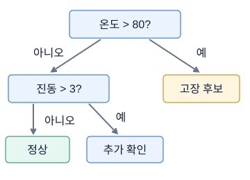

**그림 11-1. 결정트리는 질문으로 영역을 나눈다**

왼쪽·오른쪽 가지의 질문 결과가 샘플의 경로를 결정한다. 트리 학습은 이런 질문의 기준을 데이터에서 선택한다.

그림의 값·구조: 온도>80?이면고장쪽, 아니면진동>3?을확인. 학습용단순규칙이며실제모델성능주장없음.

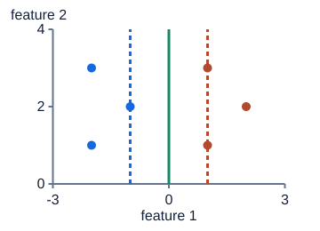

**그림 11-2. SVM: 경계와 가장 가까운 점 사이의 여유**

녹색 선이 결정경계, 점선에 닿는 점들이 이 단순한 hard-margin 예의 support vector다. soft-margin에서는 위반을 일부 허용하고 C로 비용을 조절한다.

그림의 값·구조: 경계x=0, 마진선x=−1와1, 각클래스점이반대쪽에있다.

### 숫자로 끝까지 따라가기

부모 4:4는 p₀=p₁=1/2이므로 Gini=1−1/4−1/4=1/2이다. 왼쪽 3:1은 비율 3/4,1/4라 Gini=1−9/16−1/16=6/16=3/8=0.375다. 오른쪽 1:3도 0.375다. 두 자식이 각각 네 행이므로 가중 평균은 (4/8)×0.375+(4/8)×0.375=0.375, 감소는 0.5−0.375=0.125다. 자식 하나에 한 행만 있을 때도 단순 평균을 쓰면 안 되며 반드시 n_child/n으로 가중한다.

같은 부모 엔트로피는 1 bit다. 각 자식은 −0.75log₂0.75−0.25log₂0.25≈0.811278 bit, 정보이득은 1−0.811278≈0.188722 bit다. Gini 감소와 엔트로피 감소는 서로 다른 척도여서 숫자가 같을 필요가 없다. 순수하게 4:0과 0:4로 나눌 수 있다면 자식 불순도는 0이어서 두 기준 모두 더 큰 감소를 얻는다. 하지만 훈련 자료를 끝까지 순수하게 만드는 깊은 나무가 새 자료에서 최선이라는 뜻은 아니다.

선형 SVM의 점수 s=wᵀx+b에서 w=[1,0],b=0을 생각하자. x=[1,2]의 점수는 1, x=[−1,3]의 점수는 −1이다. 경계 s=0은 x₁=0이고, 표준적인 마진선 s=±1은 x₁=±1이다. 경계까지의 거리는 |s|/||w||₂여서 두 점 모두 1, 전체 마진 폭은 2/||w||₂=2다. 양성 라벨 y=+1인데 점수 s=0.2인 점의 hinge loss는 max(0,1−ys)=max(0,0.8)=0.8이다. 클래스 부호는 맞지만 충분한 여백이 없어서 벌점이 생긴다. SVM 수식의 y는 보통 −1,+1이라는 표기를 사용하며 BCE의 0,1과 구별한다.

```python
import numpy as np

def gini(counts):
    counts = np.asarray(counts, dtype=float)
    p = counts / counts.sum()
    return 1 - np.sum(p ** 2)

parent = gini([4, 4])
children = 0.5 * gini([3, 1]) + 0.5 * gini([1, 3])
w = np.array([1., 0.])
points = np.array([[1., 2.], [-1., 3.]])
scores = points @ w
distances = np.abs(scores) / np.linalg.norm(w)
hinge = max(0., 1. - 1. * 0.2)
print(parent, children, parent - children, distances, hinge)
assert np.isclose(parent - children, 0.125)
assert np.allclose(distances, [1., 1.]) and np.isclose(hinge, 0.8)
tree_predictions = np.array([8., 10., 12.])
assert tree_predictions.mean() == 10.
```

### 시험 문제로 연결하기

Bagging이 도움이 되는 이유는 모델들의 오류가 완전히 같지 않기 때문이다. 세 회귀 나무가 8,10,12를 예측하면 평균은 10이다. 참값이 10인 이 사례에서는 ±2의 변동이 상쇄된다. 모두 같은 방향으로 12를 예측하면 평균도 12이므로 여러 개라는 사실만으로 오류가 사라지지는 않는다. 나무 사이 상관을 낮추는 무작위 특성 선택은 이런 상쇄를 돕기 위한 장치다.

Boosting은 앞 모델의 부족한 부분을 다음 모델이 순차적으로 보완한다. 제곱오차 gradient boosting은 현재 예측의 잔차와 연결된 음의 기울기를 다음 나무가 학습한다. 일반 손실에서는 단순한 y−ŷ와 정확히 같지 않을 수 있어 “모든 boosting은 잔차 회귀”라고 외우지 않는다. 학습률은 새 나무 기여의 크기를 줄이고 나무 수와 함께 복잡도를 조절한다. XGBoost·LightGBM 같은 계열은 효율화와 규제를 더한 구현이지만 실행 환경에 설치되어 있고 사용이 허용되는지는 별도 확인한다.

SVM의 C는 마진 위반 벌점의 강도다. C가 크면 위반을 더 비싸게 보아 훈련 자료를 더 엄격하게 맞추려 하고, 작으면 더 많은 위반을 허용하며 규제 효과가 강해지는 경향이 있다. 커널은 입력을 직접 크게 펼치지 않고 변환 공간에서의 유사도 계산을 가능하게 한다. RBF 커널 exp(−γ||x−u||²)의 γ는 거리 감소 속도다. γ가 크면 조금만 떨어져도 유사도가 빨리 줄어 매우 국소적인 경계가 가능하고, 작으면 넓게 영향을 준다. C·γ 효과는 데이터와 함께 봐야 하며 항상 특정 폭으로 단조 변화한다는 보장은 아니다.

### 자주 헷갈리는 지점

트리는 주로 순서 비교를 사용하므로 양의 선형 스케일링처럼 순서를 보존하는 변환에 보통 둔감하다. 반면 SVM은 거리와 마진이 특성 단위에 직접 영향을 받으므로 스케일 조절이 중요하다. 커널 SVM은 표본 수가 클 때 계산이 무거울 수 있고, 많은 값이 0인 희소 고차원 자료에는 선형 SVM이 더 알맞은 출발점일 수 있다. 혼합 표형에는 트리 앙상블을 비교해 볼 수 있지만 범주를 원문 문자열로 받을 수 있는지와 결측 지원은 구현마다 확인한다.

트리의 불순도 기반 중요도는 가능한 분할점이 많은 열에 유리할 수 있다. 순열 중요도는 한 열을 섞어 검증 성능이 얼마나 나빠지는지 보지만 상관된 대체 열이 있으면 그 열의 중요도가 작게 보일 수 있다. 어떤 중요도도 인과 효과를 직접 증명하지 않는다. 깊이 제한, 잎 최소 표본 수, 나무 수를 정할 때도 훈련 점수만 보지 말고 새로운 개체·시간에 맞는 검증을 사용한다.

나무가 깊어질수록 잎에 남은 관측 수를 확인한다. 한두 관측만 있는 잎은 그 작은 표본에 딱 맞는 예측을 만들지만 다음 데이터가 조금만 바뀌어도 결과가 달라질 수 있다. 가지치기는 불필요하게 세분한 질문을 줄여 복잡도를 낮추는 생각이다. 여러 나무를 평균하는 방식과 한 나무의 복잡도를 제한하는 방식은 서로 배타적이지 않아서 함께 사용할 수 있다. 설명하기 쉬운 모델이 필요하다면 성능 차이와 함께 규칙 길이, 잎 표본 수, 경계의 안정성도 확인한다.

### 스스로 확인하기

1. 클래스 비율 3/4,1/4 노드의 Gini는? 1:0 노드보다 큰 이유는?
2. bagging의 구성 모델과 boosting의 구성 모델은 학습 순서에서 무엇이 다른가?
3. 양성 점의 SVM 점수가 0.2면 분류가 맞아도 hinge loss가 생길 수 있는가?
4. RBF의 C와 γ를 동시에 크게 하면 어떤 위험을 점검해야 하는가?

### 정답과 이유

1. 1−(3/4)²−(1/4)²=3/8=0.375다. 두 종류가 섞여 있고 1:0은 순수하여 Gini가 0이다.
2. bagging은 서로 독립적인 학습이 가능해 병렬화할 수 있다. boosting은 앞 단계의 현재 예측이나 오류 정보에 의존하므로 단계 간 순서가 있다.
3. 생긴다. ys=0.2는 필요한 기능적 마진 1보다 작아서 1−0.2=0.8이다. 정답 부호와 충분한 여백은 다른 조건이다.
4. 훈련 위반을 강하게 벌하면서 영향 범위를 매우 좁히면 잡음에 맞춘 복잡한 경계가 생길 수 있다. 스케일과 검증 성능, 일반화 간격을 함께 점검한다.

### 더 읽을 공식 자료

[scikit-learn decision trees](https://scikit-learn.org/stable/modules/tree.html), [ensemble methods](https://scikit-learn.org/stable/modules/ensemble.html), [support vector machines](https://scikit-learn.org/stable/modules/svm.html)는 분할 기준·모델 결합·마진의 공식 참고 자료다. 해석의 한계는 [permutation importance](https://scikit-learn.org/stable/modules/permutation_importance.html)에서 확인한다.

## 12. 군집화·DBSCAN·PCA와 비지도학습

### 먼저 떠올릴 장면

정답 스티커가 없는 공장 부품 상자 100개를 받았다고 생각하자. 무게와 길이는 측정했지만 어떤 제품군인지 모른다. 비슷한 부품끼리 먼저 모으면 검사할 때 도움이 될 수 있다. 이것이 군집화의 출발점이다. 이미 알려진 ‘정상/불량’을 맞히는 분류와 달리, 군집화는 정답 없이 입력의 가까움과 연결 구조를 찾는다. 같은 데이터를 넣어도 무엇을 비슷하다고 정의하느냐에 따라 묶음이 달라진다. 무게를 중심으로 나눌 수도, 형태를 중심으로 나눌 수도 있기 때문이다.

K-means는 각 묶음의 대표 위치를 정하고 가까운 물건을 모으는 방법이다. DBSCAN은 주변이 충분히 붐비는 지점에서 이웃을 따라 묶음을 키운다. 계층 군집은 작은 묶음을 차례로 합친 기록을 남긴다. PCA는 이 세 방법과 역할이 다르다. 점을 묶는 대신 여러 측정축을 적은 수의 새 축으로 요약한다. ‘두 개의 주성분을 만든다’는 말은 ‘두 군집을 만든다’는 말이 아니다.

### 낯선 말부터 풀기

표본 하나를 특성 벡터 `x_i`라고 쓰자. 아래첨자 i는 몇 번째 표본인지를 나타낸다. `c_i`는 그 표본에 배정한 군집 번호, `μ_j`는 j번 군집에 속한 점들의 평균 위치다. 평균 위치인 centroid는 실제로 존재하는 표본일 필요가 없다. K-means의 K는 우리가 미리 정하는 묶음 개수다. 목적함수 `J=Σ_i ||x_i−μ_(c_i)||²`는 모든 표본에서 자기 대표점까지 거리의 제곱을 더한 값이다. J가 작은 쪽은 그 기준에서 더 조밀한 묶음이다.

DBSCAN의 `eps`는 이웃을 세는 반경이고 `min_samples`는 조밀하다고 인정할 최소 표본 수다. scikit-learn에서는 자기 자신도 이 수에 포함한다. core는 그 기준을 만족한 점, border는 스스로 core는 아니지만 core의 이웃인 점, noise는 군집에 배정되지 않은 점이다. 반경 안에 있는 모든 점이 반드시 core일 필요는 없다. border를 거쳐 연결되었다는 이유만으로 끝없이 군집을 확장하지 않는 것이 중요하다. 이 정의와 K-means의 초기화 특성은 [scikit-learn 군집화 안내](https://scikit-learn.org/stable/modules/clustering.html)에서 확인할 수 있다.

### 그림을 읽는 순서

먼저 축·색·연결 방향을 읽고, 각 그림 아래의 설명으로 확인하세요. 손계산은 다른 작은 숫자를 쓰는 독립 연습일 수 있습니다.

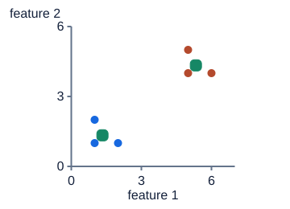

**그림 12-1. K-means: 가까운 중심에 배정하고 평균으로 이동**

점은 샘플, 녹색 네모는 각 그룹 평균이다. K는 여기서 클러스터 수2다. 중심을 갱신한 뒤 가까운 중심 배정을 다시 계산한다.

그림의 값·구조: 왼쪽점(1,1),(1,2),(2,1)은중심(4/3,4/3); 오른쪽(5,4),(5,5),(6,4)는(16/3,13/3).

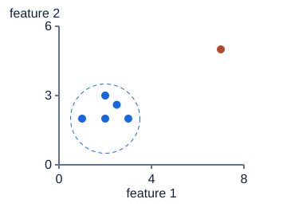

**그림 12-2. DBSCAN: 이웃이 충분한가?**

가운데 점 (2,2)을 중심으로 반경 1.5 안에 자기 자신 포함 5개가 있다. min_samples=4이므로 core다. 오른쪽 점은 이 설정에서 noise지만, 실제 이상·불량이라는 정답을 뜻하지는 않는다. 두 축의 단위 길이를 같게 그렸다.

그림의 값·구조: 중심 샘플 (2,2), eps=1.5, min_samples=4. 원 안에 자기 자신을 포함한 5개 샘플이 있으므로 중심은 core다.

### 숫자로 끝까지 따라가기

아래 수치는 그림의 특정 점 좌표를 옮긴 것이 아니라 같은 원리를 따로 검산하는 독립 연습 예다.

1차원 표본 `[1, 2, 8, 9]`, K=2, 초기 중심 `[1, 8]`을 쓰자. 표본 2에서 두 중심까지 제곱거리는 `(2−1)²=1`, `(2−8)²=36`이므로 첫 군집이다. 표본 9에서는 `64`와 `1`이므로 둘째 군집이다. 첫 배정은 `{1,2}`, `{8,9}`, 처음 J는 `0+1+0+1=2`다. 평균을 내면 새 중심은 `1.5`, `8.5`다. 다시 계산한 J는 `0.25+0.25+0.25+0.25=1`이다. 다음 배정이 같으므로 이 작은 예는 더 움직이지 않는다.

거리 단위도 확인하자. 두 부품의 무게 차이가 100g, 길이 차이가 2cm이면 제곱거리 합은 `10000+4`다. 두 특성이 똑같이 중요하다고 생각해도 숫자 단위 때문에 무게가 지배한다. 표준화 여부를 결정하지 않은 채 군집 모양을 해석하면 알고리즘보다 단위를 해석하게 될 수 있다.

DBSCAN에는 `[0, 0.1, 0.2, 0.35, 2.0]`, eps=0.16, min_samples=3을 생각하자. 0.1 주변은 `{0,0.1,0.2}`라 core다. 0 주변은 `{0,0.1}`뿐이라 core는 아니지만 0.1에 붙은 border다. 0.2는 `{0.1,0.2,0.35}` 덕분에 core이고, 0.35는 border, 2.0은 noise다. ‘외곽점=항상 잡음’이라는 오해를 이 예가 바로잡는다.

```python
import numpy as np

x = np.array([1., 2., 8., 9.])
centers = np.array([1., 8.])
for step in range(3):
    sq_dist = (x[:, None] - centers[None, :]) ** 2
    labels = sq_dist.argmin(axis=1)
    centers = np.array([x[labels == j].mean() for j in range(2)])
    inertia = ((x - centers[labels]) ** 2).sum()
    print(step, labels.tolist(), centers.tolist(), inertia)
assert np.allclose(centers, [1.5, 8.5])
```

이 코드는 이 예처럼 빈 군집이 생기지 않는 입력에서 반복 원리를 확인하는 교육용 코드다. 일반 K-means 구현에는 빈 군집, 초기화, 종료 허용오차 등의 처리가 추가된다.

### 시험 문제로 연결하기

필기에서 목적함수의 거리 제곱을 보고 K-means를 알아보고, 밀도와 잡음 표기가 있으면 DBSCAN을 떠올리자. silhouette에서 a는 자기 군집의 다른 점들과 평균거리, b는 다른 군집별 평균거리 중 최소다. `a=2, b=5`이면 `(5−2)/5=0.6`이다. 음수면 자기 군집보다 다른 군집에 평균적으로 더 가깝다는 뜻이지, 정확도가 음수라는 뜻이 아니다. 군집이 하나뿐인 경우 등에는 silhouette가 정의되지 않으므로 먼저 군집 수를 검사한다.

계층 군집의 single linkage는 두 군집 사이 가장 가까운 점 한 쌍을 보므로 다리처럼 이어지는 점들 때문에 긴 군집이 생길 수 있다. complete는 가장 먼 쌍, average는 쌍들의 평균을 본다. Ward는 합쳤을 때 군집 내부 제곱편차가 얼마나 늘어나는지 본다. 덴드로그램을 일정 높이에서 자르는 일은 ‘얼마나 다른 집단까지 합칠 것인가’를 고르는 일이다. PCA로 군집을 2차원에 그렸다면 표시한 두 축에 남은 정보량도 함께 확인한다. 그림에서 겹친다는 이유만으로 원래 고차원에서도 분리 불가능하다고 결론내리지 않는다.

### 자주 헷갈리는 지점

K를 늘리면 K-means의 최적 J는 줄거나 같아질 수 있으므로 J만 최소화하면 군집을 무한히 늘리고 싶어진다. elbow와 silhouette는 보조 근거이며 유일한 정답 K를 보증하지 않는다. DBSCAN도 자동으로 모든 모양과 밀도를 해결하지는 않는다. 한 eps로 조밀한 지역과 성긴 지역을 동시에 만족시키기 어려울 수 있다. 군집 번호를 서로 바꿔도 묶음은 동일하다. 번호 0을 ‘정상’이라고 제출하려면 별도의 정답 대응 근거가 필요하다.

### 스스로 확인하기

1. 군집 A가 `{2,4,6}`이면 중심은 얼마이며, 중심까지 제곱거리 합은 얼마인가?
2. eps 안에 자기 자신 포함 2개가 있고 min_samples=3이다. 이 점은 반드시 noise인가?
3. PCA 출력이 `[100,2]`이면 반드시 두 군집이 있다는 뜻인가?

### 정답과 이유

1. 중심은 `(2+4+6)/3=4`, 합은 `(2−4)²+0²+(6−4)²=8`이다. 평균은 제곱거리 합을 최소화하는 대표점이다.
2. 아니다. 자기 혼자 core가 될 수는 없지만, 주변 core의 이웃이면 border로 군집에 포함된다. 이웃 수와 군집 배정 여부를 구분해야 한다.
3. 아니다. 표본 100개를 새 좌표 두 개로 나타냈다는 뜻이다. 차원 수와 군집 수는 서로 다른 설정이다.

### 더 읽을 공식 자료

K와 초기화, 밀도 군집, 계층 군집을 비교할 때는 [scikit-learn Clustering](https://scikit-learn.org/stable/modules/clustering.html)의 해당 절을 읽는다. PCA가 만드는 출력의 의미는 [scikit-learn PCA 문서](https://scikit-learn.org/stable/modules/generated/sklearn.decomposition.PCA.html)에서 `components_`와 `explained_variance_ratio_`를 함께 확인하면 좋다.

## 13. Validation Strategy와 데이터 누수

### 먼저 떠올릴 장면

문제집을 풀고 바로 같은 문제로 시험을 보면 점수가 높을 수 있다. 하지만 알고 싶은 것은 ‘그 페이지를 기억하는가’가 아니라 ‘아직 보지 못한 문제도 풀 수 있는가’다. 머신러닝에서 train은 풀이를 연습하는 자료, validation은 공부 방법을 선택하는 모의시험, test는 선택을 마친 뒤 확인하는 최종 시험에 해당한다. 비유의 핵심은 파일 이름이 아니라 각 자료가 모델 결정에 참여하는 방식이다.

차량 세 대에서 센서값을 천 번씩 측정했다면 행은 3,000개지만 독립 차량은 세 대뿐이다. 행을 무작위로 나누면 세 차량이 양쪽에 들어간다. 모델이 차량 고유의 센서 기준값을 기억해도 validation이 좋아질 수 있다. 실제 목표가 처음 보는 차량이라면 잘못된 모의시험이다. 반대로 동일 차량의 내일을 예측하려는 목표에는 과거와 미래를 나누는 설계가 더 직접적이다.

### 낯선 말부터 풀기

split은 자료의 역할을 나누는 규칙이다. random split은 독립적인 행을 무작위로 배정한다. stratified split은 클래스 비율이 크게 달라지지 않도록 나눈다. group split은 사람·차량·주행 같은 묶음 전체를 한쪽에만 둔다. time split은 먼저 관측한 시간으로 학습하고 나중 시간으로 평가한다. 가장 좋은 이름 하나를 외우기보다 ‘실제 예측 때 무엇이 새로 오는가’를 먼저 문장으로 써야 한다.

데이터 누수는 예측 시점에 알 수 없거나 평가용으로 남겨야 하는 정보가 학습·선택에 들어가는 것이다. 정답 열을 입력에 넣는 노골적인 경우뿐 아니라 validation까지 포함한 평균으로 결측치를 채우는 일도 포함된다. 전처리기의 `fit`은 데이터를 보고 규칙을 배운다는 뜻이며 `transform`은 이미 배운 규칙을 적용한다는 뜻이다. 모델만 train에서 학습했어도 전처리 fit에 validation을 썼다면 분리가 완전하지 않다. fold별 전처리가 필요한 이유는 [scikit-learn 공통 실수 안내](https://scikit-learn.org/stable/common_pitfalls.html#data-leakage)에 설명되어 있다.

### 그림을 읽는 순서

먼저 축·색·연결 방향을 읽고, 각 그림 아래의 설명으로 확인하세요. 손계산은 다른 작은 숫자를 쓰는 독립 연습일 수 있습니다.

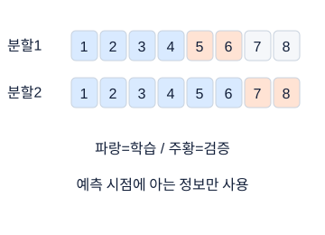

**그림 13-1. 시간 검증은 과거로 미래를 예측한다**

색칠한 칸은 시간 구간이다. 전체 표를 무작위로 섞으면 미래에서 과거를 예측하는 평가가 될 수 있다. gap이나 정답 확정 시점도 문제에 맞게 확인한다.

그림의 값·구조: 첫검증은1~4학습5~6검증, 다음은1~6학습7~8검증. 파랑학습주황검증.

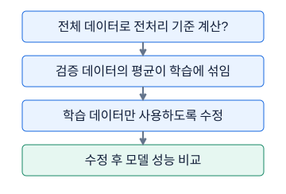

**그림 13-2. 누수는 모델 밖에서도 생긴다**

전처리, feature 선택, target encoding도 학습 과정이다. 모델 생성 코드만 train에 적용했다고 해서 검증 전체가 안전해지는 것은 아니다.

그림의 값·구조: 전체 데이터로 scaler를 fit? → valid의 평균이 학습에 섞임 → train만 fit하도록 변경 → 그 뒤 모델·metric을 비교

### 숫자로 끝까지 따라가기

아래 수치는 분할 그림을 숫자로 복제한 것이 아니라 누수와 정보 가용 시점을 확인하는 독립 연습 예다.

훈련 값이 `[0,2]`, 검증 값이 `[10]`이라고 하자. train 평균은 1이고 모집단 방식 표준편차는 `sqrt(((0−1)²+(2−1)²)/2)=1`이다. 따라서 변환값은 train `[-1,1]`, valid `[9]`다. 전체를 먼저 표준화하면 평균이 4, 분산은 `(16+4+36)/3=56/3`, 표준편차는 약 4.320이 된다. train 첫 값조차 `−4/4.320≈−0.926`으로 바뀐다. validation의 10이 훈련 표현을 바꾼 것이다. 결과가 언제나 얼마나 낙관적으로 변할지는 데이터마다 다르지만 독립 평가 원칙을 어겼다는 점은 같다.

시간은 0부터 9까지 있고 입력 끝 e에서 2시점 뒤 `y[e+2]`를 예측한다고 하자. 시점 6 직전에 모델을 확정한다면 학습에는 시점 6 미만에서 이미 확정된 정답만 들어갈 수 있다. 학습 target이 5인 창의 입력 끝은 3이다. 첫 검증 예측 원점을 e=6으로 두면 검증 target은 8이다. target만 6 이상으로 분리하여 target=6인 창을 즉시 평가하면 그 창의 원점은 4이므로, 시점 5의 정답까지 학습한 모델이 시점 4로 돌아가 예측하는 문제가 생긴다. 실시간 평가와 고정 자료의 사후 배치평가를 구분해야 한다.

```python
import numpy as np

values = np.array([0., 2., 10.])
train_idx = np.array([0, 1])
valid_idx = np.array([2])
mu = values[train_idx].mean()
std = values[train_idx].std()
z_train = (values[train_idx] - mu) / std
z_valid = (values[valid_idx] - mu) / std
assert np.allclose(z_train, [-1., 1.])
assert np.allclose(z_valid, [9.])

groups = np.array(["A", "A", "B", "B", "C", "C"])
tr = np.flatnonzero(groups != "C")
va = np.flatnonzero(groups == "C")
assert set(groups[tr]).isdisjoint(set(groups[va]))
print(z_train, z_valid, tr, va)
```

### 시험 문제로 연결하기

문제 설명에서 ‘새 설비’는 group 검증의 단서, ‘다음 달’은 시간 검증의 단서다. ‘같은 클래스 비율’이라는 요구만 보고 시간이나 그룹을 무시하면 안 된다. 그룹 우선 분리에서는 validation의 행 비율이 딱 20%가 아닐 수 있고 클래스 비율도 흔들릴 수 있다. 우선 실제 평가 구조를 지킨 뒤 그룹별 클래스 수와 평가 가능성을 점검한다.

K-fold는 K번 번갈아 validation을 맡겨 분할 운의 영향을 살핀다. 예를 들어 세 fold 점수가 `[0.7,0.8,0.9]`이면 평균은 0.8이다. 다른 모델이 `[0.79,0.8,0.81]`이어도 평균은 같지만 분할에 대한 변동은 작다. 변동이 큰 이유가 특정 그룹의 어려움인지 표본 수 차이인지 살핀다. 같은 validation으로 후보를 수백 번 선택하면 그 validation에도 맞춰질 수 있으므로, test는 마지막까지 선택 과정에 쓰지 않는 것이 원칙이다. 검증은 실제 평가를 완벽히 보장하는 점수가 아니라 근거 있는 추정이다.

### 자주 헷갈리는 지점

증강 이미지의 원본과 사본, 같은 환자의 반복 촬영, 중복 행은 서로 다른 행 번호를 가져도 독립이 아닐 수 있다. oversampling은 분리 후 train 안에서 하고, target encoding은 각 훈련 행 자신의 정답이나 평가 fold 정답이 유입되지 않게 out-of-fold 방식 등을 검토한다. rolling 평균은 현재 예측에 미래 값이 섞이지 않도록 끝점을 확인한다. 시계열의 gap은 무조건 길수록 좋은 것이 아니라 lookback·horizon·정답 확정 지연과 평가 목적에 맞춰 정한다.

### 스스로 확인하기

1. 처음 보는 환자에게 쓸 모델이다. 같은 환자의 사진을 무작위로 나누어도 되는가?
2. scaler는 전체 자료로 fit하고 모델만 train으로 학습했다. 평가가 독립적인가?
3. 과거 3일을 보고 내일을 예측한다. validation의 입력에 train 기간의 마지막 이틀이 들어가면 항상 누수인가?

### 정답과 이유

1. 일반적으로 환자 단위로 나눠야 한다. 같은 환자의 외형·촬영 조건을 기억하는 능력이 새 환자 일반화 점수에 섞이지 않아야 하기 때문이다.
2. 아니다. scaler 평균과 분산 자체가 데이터에서 학습한 값이므로 validation 분포가 train 표현에 영향을 주었다. train fit, valid/test transform 순서를 지킨다.
3. 항상 그렇지는 않다. 그 이틀이 예측 원점에서 이미 관측된 과거라면 사용할 수 있다. 다만 모델 학습에 사용한 모든 정답도 그 원점까지 확정되었어야 한다.

### 더 읽을 공식 자료

분할 선택과 fold의 의미는 [scikit-learn Cross-validation](https://scikit-learn.org/stable/modules/cross_validation.html)을 참고한다. 시점 사이를 비우는 `gap`과 expanding-window 동작은 [TimeSeriesSplit 공식 문서](https://scikit-learn.org/stable/modules/generated/sklearn.model_selection.TimeSeriesSplit.html)에서 인덱스 예제로 확인한다.

## 14. 평가지표와 불균형

### 먼저 떠올릴 장면

제품 100개 중 불량이 5개다. 모델 A는 전부 정상이라고 말한다. 맞힌 비율은 95%이지만 불량 하나도 찾지 못했다. 이때 ‘정확도가 높다’는 한 문장만으로 모델이 유용하다고 말할 수 있을까? 반대로 전부 불량이라고 말하면 불량을 하나도 놓치지 않지만 정상 제품도 모두 버리게 된다. 평가지표는 이 두 종류의 실패 중 무엇을 세는지 명확하게 만드는 언어다.

정답 하나와 예측 하나를 비교하기 전에 문제의 결정을 생각하자. 고장을 놓치는 비용이 큰지, 잘못 울리는 경보의 비용이 큰지에 따라 필요한 지표가 달라진다. 실기에서는 먼저 문제에 지정된 공식 지표를 정확히 구현하고, 보조 지표로 어떤 실수가 늘었는지 해석한다. 자기에게 유리한 지표로 바꿔서 성능이 개선되었다고 부르면 안 된다.

### 낯선 말부터 풀기

양성은 이번 문제에서 찾아내려는 클래스다. TP는 실제 양성을 양성으로 찾은 수, FP는 실제 음성인데 양성이라고 잘못 말한 수, FN은 실제 양성을 놓친 수, TN은 실제 음성을 음성이라고 맞힌 수다. True/False는 예측의 정오, Positive/Negative는 예측한 클래스다. precision은 양성이라고 말한 것 중 얼마나 맞았는지, recall은 실제 양성 중 얼마나 찾았는지다. 둘의 분모가 다르다는 점이 가장 중요하다.

score는 모델의 순위 판단에 쓰는 연속값이다. probability는 0부터 1 사이의 확률 표현이고, label은 임계값으로 최종 결정한 클래스다. logits는 확률이 되기 전의 제한 없는 점수다. 이진분류에서 sigmoid는 logit을 확률로 바꾸며 순위를 보존한다. ROC-AUC에는 적절한 연속 점수를 사용할 수 있지만 log loss에는 확률 계약이 필요하다. loss는 학습 때 낮추는 양, metric은 성능을 보고 선택하는 기준으로 둘이 항상 같지는 않다.

### 그림을 읽는 순서

먼저 축·색·연결 방향을 읽고, 각 그림 아래의 설명으로 확인하세요. 손계산은 다른 작은 숫자를 쓰는 독립 연습일 수 있습니다.

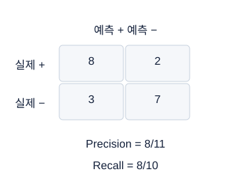

**그림 14-1. 혼동행렬에서 분모를 직접 고른다**

첫 행은 실제 양성, 첫 열은 예측 양성이다. recall은 실제 양성10개, precision은 예측 양성11개를 분모로 삼는다. 축 배치를 먼저 읽는다.

그림의 값·구조: 실제양성행TP8 FN2, 실제음성행FP3 TN7. precision8/11 recall8/10.

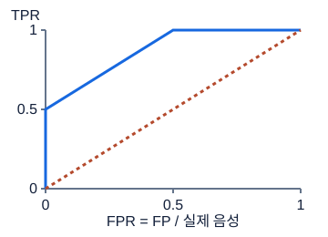

**그림 14-2. ROC는 threshold를 움직인 흔적**

이 곡선은 설명용 합성 예다. ROC-AUC는 여러 threshold의 순위 구분 능력을 요약한다. 특정 threshold의 F1이나 확률 보정 정도를 그대로 뜻하지 않는다.

그림의 값·구조: 합성ROC 좌표(0,0),(0,.5),(.25,.75),(.5,1),(1,1). 점선은대각선기준.

### 숫자로 끝까지 따라가기

그림의 혼동행렬·곡선과 별도로, 아래의 작은 가상 집계와 점수로 계산 원리를 검산한다.

TP=4, FP=6, FN=1, TN=89라고 하자. 전체는 100개다. accuracy는 `(4+89)/100=0.93`, precision은 `4/(4+6)=0.4`, recall은 `4/(4+1)=0.8`이다. F1은 조화평균 `2PR/(P+R)`이므로 `2×0.4×0.8/1.2≈0.5333`이다. 혼동행렬 수에서 바로 `2TP/(2TP+FP+FN)=8/15`로 계산해도 같다. 단순 평균 `(0.4+0.8)/2=0.6`과 다르다. 이 모델은 불량 대부분을 찾지만 경보 열 번 중 여섯 번이 오경보다.

이제 네 표본의 정답 `[1,0,1,0]`과 점수 `[0.9,0.8,0.7,0.1]`을 보자. 양성 점수는 0.9와 0.7, 음성 점수는 0.8과 0.1이다. 가능한 양성-음성 쌍은 네 개이고, 양성이 더 높은 쌍은 `(0.9,0.8)`, `(0.9,0.1)`, `(0.7,0.1)` 세 개다. 동점이 없으므로 AUC는 `3/4=0.75`다. 0.5로 이진화하면 서로 다른 0.9, 0.8, 0.7이 모두 1이 되어 순위 정보가 사라진다.

회귀도 손으로 확인하자. 정답 `[2,4]`, 예측 `[1,6]`이면 오차는 `[-1,2]`다. MAE는 `(1+2)/2=1.5`, MSE는 `(1+4)/2=2.5`, RMSE는 `sqrt(2.5)≈1.581`이다. 정답 평균 3을 항상 예측하는 기준의 SSE는 2인데 모델 SSE는 5이므로 R²는 `1−5/2=−1.5`다. 음수는 계산 오류가 아니라 그 기준보다 못했다는 뜻이다.

```python
import numpy as np

y = np.array([1, 0, 1, 0])
score = np.array([.9, .8, .7, .1])
pred = score >= .75
tp = int(((y == 1) & pred).sum())
fp = int(((y == 0) & pred).sum())
fn = int(((y == 1) & ~pred).sum())
precision = tp / (tp + fp)
recall = tp / (tp + fn)
pos, neg = score[y == 1], score[y == 0]
auc = ((pos[:, None] > neg).mean()
       + .5 * (pos[:, None] == neg).mean())
print(tp, fp, fn, precision, recall, auc)
assert np.isclose(auc, .75)
```

이 작은 예는 분모가 0이 되지 않게 구성했다. 실제 함수에서는 양성 예측이 하나도 없는 경우의 `zero_division` 정책과 AUC 계산에 두 클래스가 존재하는지를 검사한다.

### 시험 문제로 연결하기

macro는 각 클래스에 같은 비중, weighted는 클래스 표본 수에 비례한 비중, micro는 각 클래스의 TP·FP·FN을 모두 합쳐 계산한다. 두 클래스의 F1이 0.9와 0.3이면 macro-F1은 0.6이다. 표본 수 비가 9:1이면 weighted-F1은 `0.9×0.9+0.1×0.3=0.84`다. 같은 모델인데 작은 클래스의 실패를 얼마나 크게 보는지가 다르다. 모든 클래스를 포함하는 single-label 다중분류에서 micro-F1은 accuracy와 같지만 multilabel 등에 그대로 확대하면 안 된다.

희귀 양성에서는 ROC뿐 아니라 precision-recall 관계도 본다. PR-AUC라는 이름이 사다리꼴 면적인지 Average Precision인지 반드시 확인한다. 둘은 같은 숫자를 보장하지 않는다. 불균형 대응은 train 안에서 class weight나 resampling을 적용하고, 임계값은 validation에서 정한다. `pos_weight`는 BCE의 양성 항을 강화하는 설정이지 validation recall을 보장하는 버튼이 아니다. RMSLE는 `log1p` 공간 오차이므로 음수 정답의 처리와 예측 clipping을 문제 정의대로 확인한다.

### 자주 헷갈리는 지점

specificity는 실제 음성 중 제대로 음성으로 남긴 비율 `TN/(TN+FP)`이다. 동일한 음성 집합을 분모로 삼으므로 FPR과 더하면 1이다. recall과 specificity는 각각 양성과 음성에서 놓치지 않은 비율이고, precision은 모델이 양성이라고 결정한 집합에서 시작한다. 표의 축을 보고 분모 집합을 먼저 찾으면 새로운 지표도 외운 위치에 의존하지 않고 계산할 수 있다.

임계값을 낮추면 같은 점수 집합에서 recall은 줄지 않지만 precision이 반드시 단조롭게 내려가는 것은 아니다. 확률이 0.8이라는 숫자와 같은 점수 표본 중 실제 80%가 양성이라는 보정 성질도 다르다. ROC-AUC가 높아도 0.5라는 특정 임계값의 F1은 나쁠 수 있다. 전체 재학습으로 점수 분포가 바뀌면 validation에서 골랐던 임계값의 동작도 변할 수 있다. test 정답이나 test 성능을 보며 다시 고르면 최종 평가를 선택에 사용한 것이다.

### 스스로 확인하기

1. 실제 양성이 10개이고 6개를 찾았으며 양성 예측은 총 15개다. precision과 recall은?
2. ROC-AUC를 계산할 때 0/1 예측만 저장하면 무엇을 잃는가?
3. 정답의 단위가 섭씨도일 때 MSE와 RMSE의 단위는 각각 무엇인가?

### 정답과 이유

1. precision은 `6/15=0.4`, recall은 `6/10=0.6`이다. 양성 예측 집합과 실제 양성 집합 중 어느 것을 분모로 삼는지 구별한다.
2. 같은 예측 label 안의 점수 순위를 잃는다. AUC는 임계값 하나의 정답률이 아니라 양성과 음성의 상대 순위를 평가한다.
3. MSE는 제곱섭씨도, RMSE는 섭씨도다. 제곱한 오차를 평균한 뒤 제곱근을 취해야 원래 단위로 돌아온다.

### 더 읽을 공식 자료

입력으로 label·확률·decision score 중 무엇을 받는지는 [scikit-learn Metrics and scoring](https://scikit-learn.org/stable/modules/model_evaluation.html)의 각 지표 정의를 확인한다. Average Precision의 정의는 [average_precision_score 문서](https://scikit-learn.org/stable/modules/generated/sklearn.metrics.average_precision_score.html)에 별도로 명시되어 있다.

## 15. Regularization·Hyperparameter Tuning·실험 설계

### 먼저 떠올릴 장면

눈금 몇 개가 흔들리는 측정 자료에 곡선을 맞춘다고 하자. 아주 복잡한 곡선은 모든 점을 지나가지만 새 측정값 사이에서는 요동칠 수 있다. 반대로 직선 하나는 너무 단순해서 실제 곡률도 놓칠 수 있다. 모델을 크게 만드는 것과 새로운 자료에서 잘 작동하게 만드는 것은 같은 목표가 아니다. 규제는 학습 자료의 우연한 흔들림까지 지나치게 따라가지 않도록 학습에 제약을 주는 방법이다.

시험 준비에서도 같은 모의고사 한 세트만 수백 번 풀면 그 세트 점수는 높아진다. 모델 종류·학습률·규제 강도를 validation 하나에서 계속 선택하는 일도 비슷하다. 실험 설계는 더 많은 후보를 돌리는 기술만이 아니라, 어느 변경이 실제로 도움이 되었는지 비교 가능한 증거를 남기는 기술이다. 작은 예산에서는 좋은 baseline과 통제된 몇 번의 비교가 특히 중요하다.

### 낯선 말부터 풀기

parameter는 데이터에서 학습하는 가중치 w와 편향 b다. hyperparameter는 학습률, 깊이, 은닉 유닛 수, L1/L2 강도, dropout 비율처럼 학습 절차 바깥에서 선택하는 값이다. 규제 목적함수를 `J(w)=L_data(w)+λR(w)`로 쓰자. `L_data`는 예측 오차, `R`은 복잡성에 대한 벌점, λ는 그 벌점의 중요도다. λ가 클수록 자료에 맞추는 일보다 제약을 더 강하게 고려한다.

L1 벌점은 `Σ|w_j|`, L2 벌점은 `Σw_j²`다. L1은 일부 계수를 정확히 0으로 만드는 희소해를 유도할 수 있고 L2는 큰 계수에 더 큰 비용을 매긴다. 다만 ‘L1을 쓰면 무조건 정확히 몇 개 특성이 제거된다’고 말할 수는 없다. 학습법과 데이터, λ에 따라 결과가 달라진다. optimizer의 weight decay는 갱신 단계에서 값을 축소하는 방식이며, 특히 Adam 계열에서는 L2 벌점을 loss에 넣는 것과 분리된 weight decay가 일반적으로 같지 않다.

### 그림을 읽는 순서

먼저 축·색·연결 방향을 읽고, 각 그림 아래의 설명으로 확인하세요. 손계산은 다른 작은 숫자를 쓰는 독립 연습일 수 있습니다.

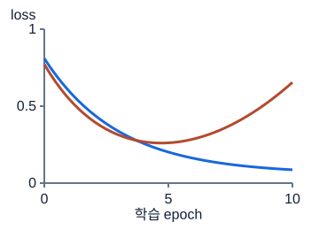

**그림 15-1. 훈련 오차 감소와 검증 개선은 다르다**

파랑은 train, 주황은 valid의 설명용 곡선이다. train loss만 보고 마지막 epoch를 고르면 새로운 데이터에서 나빠진 모델을 선택할 수 있다.

그림의 값·구조: 합성예에서train loss는계속감소,valid loss는중간이후증가. 실제실험기록이아니다.

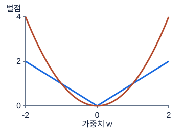

**그림 15-2. L1과 L2가 가중치에 부과하는 비용**

파랑 |w|, 주황 w²다. 실제 목적함수에는 데이터 손실과 λ배의 벌점을 더한다. 벌점 곡선만으로 최적 가중치나 성능을 결정할 수는 없다.

그림의 값·구조: L1=|w|는원점에서뾰족하고L2=w²는매끄럽다.

### 숫자로 끝까지 따라가기

아래 가중치와 학습곡선 값은 그림의 실측값이 아니라 수식과 체크포인트 선택을 확인하기 위한 독립 예다.

가중치가 `[2,−1]`, 평균 데이터 오차가 0.4, λ=0.1이라고 하자. L1의 합은 `|2|+|−1|=3`이므로 목적함수는 `0.4+0.1×3=0.7`이다. L2의 합은 `2²+(−1)²=5`이므로 `0.4+0.1×5=0.9`다. L2를 `λ/2`로 정의하는 교재도 있으므로 계수는 문제에 나온 정의를 따른다.

가중치 한 개 w=2, 데이터 오차 기울기 g=0.5, 학습률 η=0.1, λ=0.1을 보자. 규제 없으면 `w_new=2−0.1×0.5=1.95`다. `λw²`를 더하면 규제 기울기는 `2λw=0.4`, 전체 기울기는 0.9, 새 가중치는 1.91이다. `λ|w|`의 w>0 영역에서는 규제 기울기가 λ=0.1이므로 새 값은 1.94다. L2가 큰 값에 비례하는 힘을 주는 이유가 숫자로 드러난다.

validation loss가 epoch별 `[0.8,0.6,0.55,0.58,0.62]`라면 가장 좋은 것은 epoch 3이다. patience=2, 엄격한 개선을 기준으로 하면 두 번 연속 개선이 없는 epoch 5에서 멈출 수 있지만 돌아가 사용할 가중치는 epoch 3의 것이다. ‘멈춘 시점’과 ‘최선의 저장 시점’을 분리해야 한다.

```python
import numpy as np

w = np.array([2., -1.])
data_loss, lam = .4, .1
print("L1 objective:", data_loss + lam * np.abs(w).sum())
print("L2 objective:", data_loss + lam * (w ** 2).sum())
valid = np.array([.8, .6, .55, .58, .62])
best_epoch = int(valid.argmin()) + 1
assert best_epoch == 3

# 실제 성능이 아니라 탐색 후보의 규모를 비교하는 예다.
rng = np.random.default_rng(42)
lr_candidates = 10 ** rng.uniform(-4, -2, size=4)
print("best epoch:", best_epoch)
print("random log-scale LR:", lr_candidates)
```

### 시험 문제로 연결하기

grid search에서 학습률 4개, 깊이 3개, dropout 3개를 모두 조합하면 36회다. 여기에 5-fold를 쓰면 180번 학습한다. 한 학습이 30초만 걸려도 모델 학습만 90분이다. 전처리, 평가, 저장, 실패 복구 시간은 아직 포함하지 않았다. random search는 미리 정한 횟수만 뽑을 수 있고, Bayesian search는 이전 평가를 이용해 다음 후보를 고른다. 어느 방식도 제한된 validation에서 선택한다는 근본 문제를 없애지는 않는다. [scikit-learn 하이퍼파라미터 탐색 안내](https://scikit-learn.org/stable/modules/grid_search.html)는 탐색 방법과 평가의 연결을 정리한다.

공정한 비교에는 같은 데이터 분할, 전처리, 지표, seed 정책, 예산을 사용한다. baseline에서 dropout만 추가한 run과 학습률까지 함께 바꾼 run을 비교하면 무엇이 원인인지 분리하기 어렵다. 한 번에 한 변경을 하고 run 이름·설정·점수·실행 시간·실패 원인을 남기자. epoch가 같아도 모델마다 비용이 다르므로 시간 제한이 중요한 상황에서는 같은 wall-clock 예산 비교도 유용하다. 최종 후보를 정한 후 전체 train으로 재학습하는 단계는 validation으로 후보를 고르는 단계와 별도다.

### 자주 헷갈리는 지점

규제를 늘리면 언제나 validation이 좋아지는 것은 아니다. 이미 train도 잘 못 맞추는 모델에 dropout을 크게 늘리면 underfit이 더 심해질 수 있다. underfit처럼 보여도 입력 정규화, 잘못된 label, 너무 작거나 큰 학습률이 원인일 수 있으므로 용량부터 늘리지 않는다. 초기 몇 epoch가 우연히 좋았다고 너무 짧은 patience로 멈추는 것도 문제다. early stopping은 test를 보고 실행하지 않고 validation 지표의 방향을 확인한다. loss는 작을수록, F1이나 AUC는 클수록 좋은 경우가 일반적이다.

### 스스로 확인하기

1. `w=[3,−4]`, λ=0.01이면 L1과 L2의 ‘추가 벌점’은 각각 얼마인가?
2. train loss와 valid loss 모두 높다. dropout을 0.1에서 0.8로 키우면 반드시 해결되는가?
3. 3개 학습률, 4개 깊이, 2개 규제 후보를 3-fold로 grid search하면 총 몇 번 fit하는가?

### 정답과 이유

1. L1은 `0.01×7=0.07`, L2는 `0.01×25=0.25`다. 데이터 loss는 주어지지 않았으므로 전체 목적함수가 아니라 추가분만 계산했다.
2. 아니다. 둘 다 높으면 학습 자체의 문제나 underfit일 수 있다. 정보가 더 많이 제거되면서 학습이 어려워질 수 있으므로 shape·데이터·학습률·용량부터 진단한다.
3. 후보는 `3×4×2=24`개, 각 후보가 세 번 학습되므로 72회다. 최종 선택 모델의 별도 refit이 있으면 그 비용은 추가된다.

### 더 읽을 공식 자료

정규화 강도와 계수 변화의 예는 [scikit-learn Linear models](https://scikit-learn.org/stable/modules/linear_model.html)에서 Ridge와 Lasso를 나란히 읽으면 도움이 된다. AdamW의 분리된 weight decay는 [원 논문 Decoupled Weight Decay Regularization](https://arxiv.org/abs/1711.05101)에서 L2와의 차이를 다룬다.

## 16. PyTorch 기초: Tensor·autograd·Dataset·DataLoader

### 먼저 떠올릴 장면

사진과 정답이 1만 쌍 들어 있는 서랍을 생각하자. 모델은 그 서랍 전체를 한 번에 읽기보다 32개씩 꺼내 예측하고 틀린 정도를 계산하며 조금씩 가중치를 바꿀 수 있다. Dataset은 ‘몇 번째 자료를 요청하면 무엇을 줄 것인가’를 정하는 서랍 규칙이고, DataLoader는 자료를 골라 묶어 전달하는 담당자다. Tensor는 그 묶음을 수치 연산하기 좋게 담는 다차원 배열이다.

PyTorch를 처음 배울 때는 긴 학습 코드보다 한 묶음이 도착해서 loss 하나가 만들어지는 과정을 이해하는 것이 먼저다. 입력이 모델을 통과하는 길을 forward, loss에서 가중치까지 미분을 거꾸로 계산하는 길을 backward라고 부른다. backward가 값을 바꾸는 것은 아니다. 바꿀 방향인 gradient를 계산한 뒤 optimizer가 실제 업데이트를 수행한다. 이 역할을 분리하면 `loss.backward()`를 호출했는데 예측이 그대로인 이유도 설명할 수 있다.

### 낯선 말부터 풀기

Tensor의 shape는 축별 길이, dtype은 원소를 표현하는 자료형, device는 계산이 놓인 장치다. `[B,F]`이면 B개 표본 각각에 F개 특성이 있다는 계약이다. 예를 들어 `[4,3]`은 표본 네 개와 특성 세 개다. 같은 shape라도 이미지·시계열·표 데이터인지에 따라 축 의미는 달라지므로 shape만 읽고 의미를 추정하지 않는다. 회귀 정답은 보통 float, 기본 다중분류의 클래스 번호는 long이다.

autograd는 연산 그래프를 기록해 연쇄법칙으로 미분하는 기능이다. `requires_grad=True`인 학습 파라미터에서 수행한 연산을 추적하고, scalar loss의 `backward()`가 연결된 파라미터의 `.grad`에 기울기를 누적한다. `detach()`는 값을 그래프에서 떼어낸다. `no_grad()`는 블록 안의 기록을 끄는 방식이며 `inference_mode()`는 추론을 위한 더 강한 최적화 모드다. 이들은 `eval()`과 다른 기능이다. `eval()`은 Dropout과 BatchNorm 등의 동작 모드를 바꾼다. 구분은 [PyTorch autograd 기초](https://docs.pytorch.org/tutorials/beginner/basics/autogradqs_tutorial.html)에서 확인할 수 있다.

### 그림을 읽는 순서

먼저 축·색·연결 방향을 읽고, 각 그림 아래의 설명으로 확인하세요. 손계산은 다른 작은 숫자를 쓰는 독립 연습일 수 있습니다.

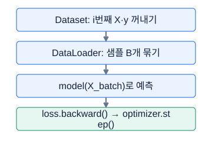

**그림 16-1. Dataset과 DataLoader는 다른 일을 한다**

Dataset은 한 샘플을 정의하고, DataLoader는 샘플들을 배치로 묶는다. gradient 초기화와 train/eval 설정은 별도로 해야 한다.

그림의 값·구조: Dataset: i번째 X·y 꺼내기 → DataLoader: 샘플 B개 묶기 → model(X_batch)로 예측 → loss.backward() → optimizer.step()

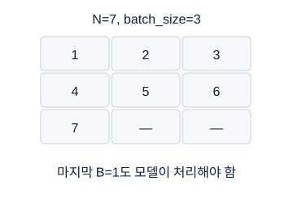

**그림 16-2. 배치 크기는 전체 데이터 개수가 아니다**

빈칸을 실제로 padding한다는 뜻은 아니다. 마지막 배치는 샘플 하나이며, drop_last=True이면 이 배치를 버린다. 검증·test를 일부 버리지 않는다.

그림의 값·구조: 샘플7개를batch_size3으로묶으면3,3,1개배치. drop_last=False의예.

### 숫자로 끝까지 따라가기

그림의 데이터 크기와 별도로, 표본 하나인 가장 작은 계산부터 독립적으로 확인한다.

표본 하나가 x=2, 정답 y=3이고 모델이 `ŷ=wx+b`라고 하자. 처음 w=1, b=0이면 예측은 2, loss를 `(ŷ−y)²`로 정의하면 1이다. 예측에 대한 기울기는 `2(ŷ−y)=−2`다. 예측을 w로 미분하면 x=2이므로 `dL/dw=−2×2=−4`, b로 미분하면 1이므로 `dL/db=−2`다. 학습률 0.1의 SGD라면 새 w는 `1−0.1×(−4)=1.4`, 새 b는 `0−0.1×(−2)=0.2`다. 새 예측은 3이고 이 한 표본의 loss는 0이다. 전체 자료에도 완벽하다는 뜻은 아니다.

표본이 10개, batch_size=4, drop_last=False이면 배치 크기는 4,4,2이고 업데이트는 한 epoch에 세 번이다. 배치별 평균 loss가 1,2,4였다면 표본 전체 평균은 `(4×1+4×2+2×4)/10=2`다. 세 배치 평균을 똑같이 평균하면 `7/3≈2.333`으로 마지막 작은 배치가 과대 반영된다. 평가지표도 정의된 표본·원소 단위와 가중치를 맞춰 집계해야 한다.

```python
import torch
from torch.utils.data import TensorDataset, DataLoader

x = torch.tensor([[2.]], dtype=torch.float32)
y = torch.tensor([[3.]], dtype=torch.float32)
loader = DataLoader(TensorDataset(x, y), batch_size=1, shuffle=False)
model = torch.nn.Linear(1, 1)
with torch.no_grad():
    model.weight.fill_(1.)
    model.bias.zero_()
optimizer = torch.optim.SGD(model.parameters(), lr=.1)

xb, yb = next(iter(loader))
optimizer.zero_grad(set_to_none=True)
out = model(xb)
assert out.shape == yb.shape == (1, 1)
loss = torch.nn.functional.mse_loss(out, yb)
loss.backward()
print("gradient:", model.weight.grad.item(), model.bias.grad.item())
optimizer.step()
model.eval()
with torch.inference_mode():
    pred = model(x).cpu().numpy()
print("after step:", pred)
assert abs(float(pred[0, 0]) - 3.) < 1e-6
```

### 시험 문제로 연결하기

Process에서 Dataset을 구현하라면 `__len__`이 표본 수를 반환하는지, `__getitem__(i)`가 입력과 정답을 같은 i로 가져오는지부터 확인한다. test에는 정답이 없을 수 있으므로 명세가 입력만 반환하라는지 tuple을 요구하는지도 읽는다. 훈련 전 한 배치로 forward, loss, backward를 한 번 실행하는 검사는 오래 학습한 뒤 shape 오류를 발견하는 낭비를 막는다.

CPU와 GPU를 섞으면 올바른 수식이어도 실행되지 않는다. 모델, 입력, 정답을 같은 device에 놓고, 외부 평가 함수에는 `tensor.detach().cpu().numpy()`처럼 안전하게 변환한다. `torch.from_numpy`는 지원되는 NumPy 배열과 메모리를 공유하므로 원본 수정이 Tensor 값에도 영향을 줄 수 있고, `torch.tensor`는 복사본을 만든다. 재현성을 위한 seed는 비교를 돕지만 하드웨어·버전·일부 연산 차이를 모두 없애는 보증은 아니다.

### 자주 헷갈리는 지점

`[B,1]` 예측과 `[B]` 정답으로 MSE를 계산하면 broadcasting으로 `[B,B]` 비교가 일어날 수 있다. 반드시 같게 맞춘다. `squeeze()`는 길이 1인 모든 축을 없애므로 batch_size=1에서 배치 축까지 사라진다. 한 출력 축만 없애려면 `squeeze(-1)`을 쓴다. train batch 순서를 섞는 것과 시계열 window 내부 시점 순서를 섞는 것도 다르다. 독립 window를 섞어 학습할 수는 있지만 각 window의 시간 순서는 유지해야 한다. test에서 `drop_last=True`는 마지막 행들의 예측을 잃게 하므로 일반적으로 사용하지 않는다.

### 스스로 확인하기

1. loss의 `backward()`를 두 번 새 forward로 계산하면서 `.grad`를 지우지 않으면 어떤 일이 일어나는가?
2. 원래 자료가 9개이고 batch_size=4, drop_last=False이면 배치는 몇 개이며 마지막 shape의 첫 축은 얼마인가?
3. validation에서 `no_grad()`만 사용하면 Dropout이 자동으로 꺼지는가?

### 정답과 이유

1. 각 backward에서 계산한 기울기가 기존 `.grad`에 더해진다. 의도적 gradient accumulation이 아니라면 업데이트 전에 `zero_grad`를 호출해야 한다.
2. 배치는 세 개이며 마지막 B는 1이다. 총 4+4+1개를 모두 보존한다. 이때 무인자 squeeze의 위험이 드러난다.
3. 아니다. gradient 기록과 모듈 학습 모드는 별개다. `model.eval()`을 함께 호출해야 한다.

### 더 읽을 공식 자료

표본을 가져오는 인터페이스와 배치 생성은 [PyTorch Datasets & DataLoaders](https://docs.pytorch.org/tutorials/beginner/basics/data_tutorial.html)의 두 역할을 구분해 읽는다. gradient는 계산 후 누적된다는 점을 [autograd 기초](https://docs.pytorch.org/tutorials/beginner/basics/autogradqs_tutorial.html)의 예제로 직접 확인한다.

## 17. 퍼셉트론·MLP·활성함수·손실함수

### 먼저 떠올릴 장면

센서 두 개의 값을 받아 ‘고장 가능성이 높은가’를 판단한다고 하자. 단일 퍼셉트론은 각 센서에 중요도를 곱해 더하고 기준선을 넘는지 본다. 두 특성의 평면에서는 직선 하나로 영역을 나누는 셈이다. 하지만 ‘둘 중 하나만 켜졌을 때 이상’이라는 XOR 규칙은 직선 하나로 나눌 수 없다. 중간층에서 여러 조건을 만든 뒤 다시 조합하는 MLP가 필요한 장면이다.

중요한 것은 층 이름의 개수가 아니라 그 사이의 비선형 변환이다. 계산기에서 ‘곱하고 더하기’를 여러 번 해도 결국 또 하나의 ‘곱하고 더하기’로 정리된다. 중간에 ReLU 같은 구부러진 변환을 넣으면 입력 영역에 따라 서로 다른 계산 경로가 살아나므로 하나의 직선보다 복잡한 경계를 만들 수 있다. 마지막 출력은 바로 정답이 아니라 회귀값이나 클래스별 점수일 수 있으며, loss와의 계약이 그 의미를 결정한다.

### 낯선 말부터 풀기

퍼셉트론의 `z=wᵀx+b`에서 x는 입력 특성, w는 각 특성의 가중치, b는 기준점을 옮기는 편향이다. MLP의 은닉층은 입력도 최종 정답도 아닌 중간 표현을 만든다. `h=φ(W₁x+b₁)`, `o=W₂h+b₂`로 쓸 때 φ가 활성함수다. ReLU는 `max(0,z)`, sigmoid는 `1/(1+exp(−z))`, tanh는 −1과 1 사이로 값을 압축한다. softmax는 여러 점수를 양수로 바꾸고 합이 1이 되도록 나누는 변환이다.

logit은 확률 변환 전 점수다. 음수여도 되고 여러 클래스 점수를 더해 1이 될 필요도 없다. 한 샘플이 한 클래스에만 속하는 multiclass와 여러 라벨에 동시에 속하는 multilabel을 구분해야 한다. 전자는 K개 점수끼리 경쟁시키는 softmax 확률, 후자는 라벨별 sigmoid 확률이 자연스럽다. loss는 정답과 모델 출력을 비교해 미분 가능한 훈련 신호를 만든다. accuracy나 F1을 보고 선택할 수 있어도 그 값을 그대로 gradient descent에 쓰는 것은 별개의 문제다.

### 그림을 읽는 순서

먼저 축·색·연결 방향을 읽고, 각 그림 아래의 설명으로 확인하세요. 손계산은 다른 작은 숫자를 쓰는 독립 연습일 수 있습니다.

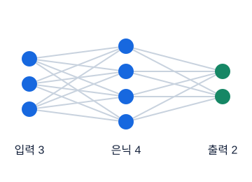

**그림 17-1. MLP: 각 층에서 섞고 비선형 변환한다**

선은 가중치, 원은 계산 결과다. Linear 뒤에 비선형 활성함수를 넣어야 여러 선형층을 쌓는 것 이상의 표현이 가능하다. 배치 축은 그림에 생략했다.

그림의 값·구조: 입력3개,은닉4개,출력2개가모두연결된순전파구조. output2는예시이며이진분류출력계약은loss에따라다름.

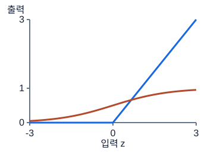

**그림 17-2. ReLU와 sigmoid는 출력 범위가 다르다**

파랑 ReLU는 양수 영역에서 제한 없이 커지고, 주황 sigmoid는0과1사이다. 은닉층 활성함수와 마지막 출력·loss의 선택을 구분한다.

그림의 값·구조: ReLU=max(0,z),sigmoid=1/(1+e^-z). ReLU는확률변환이아니다.

### 숫자로 끝까지 따라가기

아래 가중치는 그림에 보인 임의 네트워크의 훈련 결과가 아니라 forward와 loss를 손으로 계산하기 위해 고른 독립 예다.

두 특성 x=`[2,−1]`에 첫 층의 두 뉴런을 만들자. 첫 뉴런의 가중치 `[1,1]`, bias 0이면 `z₁=2−1=1`이다. 둘째 뉴런의 가중치 `[−1,2]`, bias 1이면 `z₂=−2−2+1=−3`이다. ReLU를 지나 은닉값은 `[1,0]`이다. 출력층 가중치 `[2,−1]`, bias 0.5면 최종 점수는 `2×1−1×0+0.5=2.5`다. 이것이 이진 logit이라면 확률은 `sigmoid(2.5)≈0.9241`이지만 회귀 모델이라면 그저 예측값 2.5다. shape가 같다고 task가 같지는 않다.

다중분류 logits가 `[0, ln 2, 0]`이면 지수값은 `[1,2,1]`, 합은 4, softmax 확률은 `[0.25,0.5,0.25]`다. 정답 클래스 번호가 1이면 CE는 `−ln(0.5)=ln 2≈0.6931`이다. 정답 확률이 0.25인 경우 손실은 약 1.3863으로 더 크다. 이진분류에서는 정답 y=1, logit z=0이면 sigmoid 확률이 0.5이고 BCE 역시 `−ln(0.5)`다. y=0이면 `−ln(1−p)` 항이 살아난다.

네트워크 2→2→1의 파라미터도 세어 보자. 첫 층은 `2×2+2=6`, 마지막 층은 `2×1+1=3`, 총 9개다. ReLU에는 학습할 값이 없으므로 더하지 않는다. 배치에 샘플을 열 개 넣어도 같은 가중치를 공유하므로 파라미터 수는 열 배가 되지 않는다.

```python
import torch
import torch.nn.functional as F

x = torch.tensor([[2., -1.]])
w1 = torch.tensor([[1., 1.], [-1., 2.]])
b1 = torch.tensor([0., 1.])
h = F.relu(F.linear(x, w1, b1))
z = F.linear(h, torch.tensor([[2., -1.]]), torch.tensor([.5]))
print("hidden/logit/prob:", h, z, z.sigmoid())

logits = torch.tensor([[0., 2., 0.]]).clone()
logits[0, 1] = torch.log(torch.tensor(2.))
target = torch.tensor([1], dtype=torch.long)
ce = F.cross_entropy(logits, target)
bce = F.binary_cross_entropy_with_logits(
    torch.tensor([[0.]]), torch.tensor([[1.]]))
print(logits.softmax(dim=1), ce.item(), bce.item())
assert torch.allclose(ce, torch.log(torch.tensor(2.)))
```

### 시험 문제로 연결하기

회귀 loss의 선택도 미분 신호를 바꾼다. 오차 e에 대해 MSE의 제곱 항은 큰 오차에 더 큰 기울기를 주고, MAE의 절댓값 항은 0 밖에서 일정한 크기의 기울기를 준다. Huber는 경계 δ 안에서 `0.5e²`, 바깥에서 `δ(|e|−0.5δ)`로 이어 큰 오차의 영향을 선형으로 완화한다. 예를 들어 δ=1에서 e=0.5이면 0.125, e=3이면 2.5다. 비슷한 이름의 SmoothL1은 파라미터와 배율 계약이 다를 수 있으므로 명세에 나온 함수를 확인한다.

회귀는 예측과 정답을 같은 float shape로 맞추고 MSE·MAE·Huber 등을 사용한다. 이진분류는 `[B,1]` logits와 같은 shape의 float 0/1 정답에 BCEWithLogitsLoss를 연결한다. 다중분류 기본 경로는 `[B,K]` logits, `[B]` long 클래스 번호, CrossEntropyLoss다. multilabel은 `[B,K]` logits와 같은 shape의 float 0/1 정답에 라벨별 BCE를 쓴다. BCEWithLogitsLoss가 sigmoid와 BCE를 안정적으로 결합한다는 계약은 [공식 BCEWithLogitsLoss 문서](https://docs.pytorch.org/docs/2.7/generated/torch.nn.BCEWithLogitsLoss.html)에 명시되어 있다.

CE가 one-hot을 절대로 받을 수 없다고 외우면 부정확하다. PyTorch는 입력과 같은 shape의 float 확률 target도 지원한다. 다만 기본 class-index 과제에서는 long `[B]`를 쓰는 것이 명료하며 두 경로를 임의로 섞지 않는다. 자세한 허용 shape는 [CrossEntropyLoss 문서](https://docs.pytorch.org/docs/2.7/generated/torch.nn.CrossEntropyLoss.html)에서 확인한다. label이 필요한 제출은 argmax나 threshold를 적용하고, probability가 필요한 제출은 확률로 바꾼다. metric 요구를 먼저 읽는 이유다.

### 자주 헷갈리는 지점

Linear 두 개 사이에 활성함수가 없으면 `W₂(W₁x+b₁)+b₂=(W₂W₁)x+(W₂b₁+b₂)`이므로 한 affine 층으로 정리된다. ‘층 수를 늘렸으니 무조건 비선형’이 아니다. ReLU의 음수 영역에서 기울기가 0인 특성은 계산을 단순하게 하지만 뉴런이 계속 음수에만 머물면 학습이 어려울 수 있다. LeakyReLU는 음수 구간에도 작은 기울기를 남긴다. sigmoid의 출력 범위만 보고 은닉층에도 무조건 붙이면 포화 영역의 작은 기울기로 학습이 느려질 수 있다. GELU는 부드러운 비선형의 한 선택이지 모든 데이터에서 ReLU보다 좋다는 보증은 아니다.

### 스스로 확인하기

1. `Linear(5,3)`에는 학습 파라미터가 몇 개 있는가? 기본 bias=True라고 하자.
2. 하나의 사진에 ‘고양이’와 ‘실내’가 동시에 참일 수 있다. softmax 하나로 합을 1로 만들어야 하는가?
3. logits `[0,ln 3]`, 정답 클래스 1일 때 softmax와 CE는 얼마인가?

### 정답과 이유

1. `5×3+3=18`개다. 다섯 입력에서 각 세 출력으로 가는 15개 weight와 출력별 bias 세 개를 센다.
2. 일반적으로 multilabel이므로 라벨별 sigmoid와 BCE 계약을 쓴다. 두 라벨이 동시에 참일 수 있어 서로 경쟁시키는 합 1 제약이 맞지 않는다.
3. 지수값 `[1,3]`을 합 4로 나눠 `[0.25,0.75]`, CE는 `−ln(0.75)≈0.2877`이다. 정답 클래스의 확률이 클수록 이 손실은 작다.

### 더 읽을 공식 자료

Huber의 제곱·선형 구간과 SmoothL1과의 배율 차이는 [PyTorch HuberLoss](https://docs.pytorch.org/docs/2.7/generated/torch.nn.HuberLoss.html)에 명시되어 있다.

활성함수와 affine 층의 역할은 [PyTorch 신경망 구성 기초](https://docs.pytorch.org/tutorials/beginner/basics/buildmodel_tutorial.html)를 참고한다. 실기에서는 [CrossEntropyLoss의 Shape 절](https://docs.pytorch.org/docs/2.7/generated/torch.nn.CrossEntropyLoss.html)을 보고 logits·정답의 차원과 dtype을 먼저 맞춘다.

## 18. PyTorch 학습 엔지니어링: optimizer·초기화·BN·Dropout

### 먼저 떠올릴 장면

산비탈에서 낮은 곳으로 내려가는데 현재 위치의 경사만 알 수 있다고 생각하자. gradient는 현재 비탈의 방향, learning rate는 한 번에 걷는 보폭이다. 보폭이 너무 작으면 천천히 움직이고, 너무 크면 반대쪽으로 넘어가 반복해서 튕길 수 있다. optimizer는 현재 경사와 과거 경사 기록을 보고 어떻게 걸을지를 정한다. 모델 구조가 맞더라도 이 걷는 규칙과 학습·평가 모드가 틀리면 성능을 판단할 수 없다.

BatchNorm과 Dropout도 실행 위치와 모드가 중요하다. BatchNorm은 층 안의 값 규모를 조정하는 장치이고 Dropout은 학습 중 일부 중간값을 무작위로 꺼 특정 연결에만 의존하지 않도록 하는 장치다. 평가에서도 계속 무작위로 값을 끄거나 평가 자료로 통계를 갱신하면 같은 입력의 예측이 달라질 수 있다. ‘학습 코드가 실행된다’와 ‘올바르게 학습·평가된다’는 다른 확인 단계다.

### 낯선 말부터 풀기

SGD는 `w←w−ηg`다. w는 파라미터, g는 현재 gradient, η는 learning rate다. Momentum은 이전 이동 방향을 velocity에 누적한다. RMSprop은 gradient 제곱의 이동평균으로 각 좌표의 갱신 크기를 조절한다. Adam은 gradient 평균과 제곱 평균을 함께 추적하고 시작할 때 0으로 둔 평균의 치우침을 보정한다. AdamW는 weight decay를 적응적 gradient 계산과 분리한다. 각 optimizer의 정확한 기본값과 구현식은 [PyTorch optimizer 문서](https://docs.pytorch.org/docs/2.7/optim.html)를 따른다.

초기화는 학습 시작 가중치의 분포를 고르는 일이다. 모두 0으로 두면 같은 층의 뉴런이 같은 계산과 같은 기울기를 받아 서로 다른 역할을 배우기 어렵다. Xavier는 입출력 크기를, He/Kaiming은 ReLU 계열에서의 분산 변화를 고려하는 대표 방법이다. scheduler는 학습이 진행됨에 따라 learning rate를 바꾸며, gradient clipping은 너무 큰 기울기의 크기를 제한한다. clipping은 잘못된 NaN 입력을 고치거나 소실된 gradient를 크게 만드는 방법은 아니다.

### 그림을 읽는 순서

먼저 축·색·연결 방향을 읽고, 각 그림 아래의 설명으로 확인하세요. 손계산은 다른 작은 숫자를 쓰는 독립 연습일 수 있습니다.

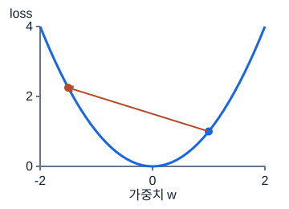

**그림 18-1. 학습률이 너무 크면 반대편으로 튄다**

이 그림에서 w=1, gradient=2, 학습률1.25라면 다음 w=-1.5로 이동해 손실이 증가한다. optimizer를 바꾸기 전에 학습률과 gradient를 확인한다.

그림의 값·구조: L=w²의곡선에서큰이동은최솟값을넘길수있다. 화살표는설명용한갱신.

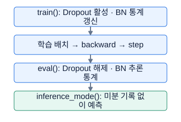

**그림 18-2. 학습과 추론은 같은 모드가 아니다**

eval()과 inference_mode()의 역할은 다르다. eval만으로 자동 미분이 꺼지지 않으며, inference_mode만으로 Dropout이 해제되지 않는다. 기본 BN 설정을 설명한 흐름이다.

그림의 값·구조: train(): Dropout 활성 · BN 통계 갱신 → 학습 배치 → backward → step → eval(): Dropout 해제 · BN 추론 통계 → inference_mode(): 미분 기록 없이 예측

### 숫자로 끝까지 따라가기

아래 수치는 optimizer 그림의 실제 경로를 복원하는 값이 아니라 갱신 규칙을 비교하기 위한 독립 조건이다.

w₀=1, g=2, η=0.1을 생각하자. SGD의 첫 값은 0.8이다. Momentum을 `v_t=0.9v_(t−1)+g_t`, 초기 v=0으로 정의하면 첫 velocity는 2, 첫 w도 0.8이다. 다음 gradient도 2라고 가정하면 velocity는 `0.9×2+2=3.8`, 다음 w는 `0.8−0.1×3.8=0.42`다. 같은 방향을 계속 보았기 때문에 이동량이 커졌다. 이는 일정 gradient를 가정한 손계산이지 실제 학습에서 gradient가 고정된다는 뜻이 아니다.

Adam의 β₁=0.9, β₂=0.999, 초기 두 평균이 0이면 첫 m은 0.2, 첫 v는 0.004다. bias correction 뒤 `m_hat=0.2/0.1=2`, `v_hat=0.004/0.001=4`다. ε와 weight decay를 생략하면 `w₁=1−0.1×2/sqrt(4)=0.9`다. 같은 gradient와 learning rate인데 SGD의 0.8과 다르다. learning rate 숫자만 같다고 optimizer 간 이동량이 같지는 않다.

BatchNorm에 한 특성의 batch 값 `[1,3]`이 들어가면 평균은 2, forward에서 사용하는 모집단 방식 분산은 1이다. ε를 잠시 무시한 표준화값은 `[−1,1]`이다. 학습하는 scale γ=2, shift β=0.5라면 출력은 `[−1.5,2.5]`다. PyTorch의 running variance 갱신에는 불편 추정 분산이 쓰이는 등 세부가 다르므로 여기의 forward 손계산과 저장 통계를 혼동하지 않는다. [BatchNorm1d 공식 문서](https://docs.pytorch.org/docs/2.7/generated/torch.nn.BatchNorm1d.html)가 이 구분을 명시한다.

Dropout p=0.5에서 activation 4는 확률 0.5로 0, 살아남으면 `4/(1−0.5)=8`이다. 기대값은 `0.5×0+0.5×8=4`다. 따라서 평가 때는 단순히 원래 값을 통과시킨다. 모든 실현값이 평균 4가 된다는 뜻은 아니다.

```python
import torch

torch.manual_seed(7)
model = torch.nn.Sequential(
    torch.nn.Linear(2, 4), torch.nn.BatchNorm1d(4),
    torch.nn.ReLU(), torch.nn.Dropout(.2), torch.nn.Linear(4, 1))
x = torch.tensor([[0., 0.], [1., 0.], [0., 1.], [1., 1.]])
y = torch.tensor([[0.], [1.], [1.], [2.]])
opt = torch.optim.AdamW(model.parameters(), lr=.01, weight_decay=.001)
for _ in range(3):
    model.train()
    opt.zero_grad(set_to_none=True)
    loss = torch.nn.functional.mse_loss(model(x), y)
    assert torch.isfinite(loss)
    loss.backward()
    torch.nn.utils.clip_grad_norm_(model.parameters(), max_norm=1.)
    opt.step()
model.eval()
with torch.inference_mode():
    a, b = model(x), model(x)
assert torch.allclose(a, b)
print("prediction shape:", tuple(a.shape))
```

이 코드는 한 배치의 실행 순서와 평가 모드를 점검하는 예이며, 세 번 업데이트로 좋은 예측을 얻었다고 주장하는 실험은 아니다.

### 시험 문제로 연결하기

한 epoch 평균 loss는 배치별 reduction 규칙과 표본 수를 맞춰 누적한다. 일반적인 표본 평균 loss라면 `loss.item()×batch_n`을 합해 전체 n으로 나눈다. 클래스 가중 CE나 가변 유효 원소 수처럼 분모가 다른 손실에서는 해당 분모로 누적해야 한다. validation metric을 비교할 때 loss 최소인지 F1 최대인지 먼저 적고 best checkpoint를 값 복사로 저장한다. `best_state=model.state_dict()`만 대입하면 이후 학습의 값 변화가 반영될 수 있으므로 deepcopy나 각 Tensor clone으로 독립 사본을 만든다.

scheduler 종류에 맞춰 step 위치를 둔다. 예를 들어 ReduceLROnPlateau는 검증 지표를 관측한 뒤 전달하고, 다른 scheduler는 epoch나 update 단위 계약을 확인한다. 기존 pretrained 모델에 초기화 함수를 통째로 적용하면 배운 가중치를 지울 수 있으므로 초기화는 새 층과 scratch 모델에 범위를 맞춘다. 훈련이 정체되면 optimizer 이름부터 바꾸기보다 작은 batch를 과적합할 수 있는지, target shape가 맞는지, loss가 유한한지 확인한다.

### 자주 헷갈리는 지점

BatchNorm의 running mean/variance는 optimizer가 학습하는 파라미터가 아니라 buffer다. 기본 `track_running_stats=True` 기준의 train/eval 설명이며 이를 False로 바꾸면 평가에서도 batch 통계를 사용한다. 작은 batch에서는 통계가 불안정할 수 있고 일반적인 `[1,F]` BatchNorm1d 훈련은 통계량 확보 문제로 실패할 수 있다. Dropout p를 크게 하는 것은 남기는 비율을 키우는 것이 아니라 지우는 비율을 키우는 것이다. gradient accumulation을 의도하지 않았는데 zero_grad를 생략하는 것도 학습률 문제처럼 보일 수 있다.

### 스스로 확인하기

1. w=3, g=−2, η=0.05일 때 SGD 한 번 뒤 w는 얼마인가?
2. Dropout p=0.25에서 값 6이 살아남았다면 훈련 출력은 얼마인가?
3. best validation F1이 0.7인데 새 F1이 0.6이다. 최소 loss와 같은 비교 방향으로 저장해도 되는가?

### 정답과 이유

1. `3−0.05×(−2)=3.1`이다. gradient가 음수이므로 loss를 낮추기 위해 w를 늘리는 방향으로 이동한다.
2. `6/(1−0.25)=8`이다. 훈련 시 기대값을 보존하기 위해 살아남은 activation을 키운다. 평가는 원래 값 6이다.
3. 안 된다. F1은 보통 클수록 좋으므로 0.7 체크포인트를 유지한다. 지표 이름과 개선 방향을 함께 기록한다.

### 더 읽을 공식 자료

훈련과 평가 시 scaling 차이는 [PyTorch Dropout 문서](https://docs.pytorch.org/docs/2.7/generated/torch.nn.Dropout.html)를 참고한다. 초기화의 정확한 인수는 [torch.nn.init](https://docs.pytorch.org/docs/2.7/nn.init.html), optimizer별 상태와 갱신 규칙은 [torch.optim](https://docs.pytorch.org/docs/2.7/optim.html)에서 확인한다.

## 19. CNN: convolution·padding·pooling·이미지 코드

### 먼저 떠올릴 장면

사진에서 작은 세로 경계를 찾으려고 투명한 작은 검사창을 왼쪽에서 오른쪽으로 움직인다고 상상하자. 검사창 안의 픽셀을 정해진 가중치로 곱해 더하면 그 위치의 경계 반응 하나가 나온다. 같은 검사 규칙을 모든 위치에 재사용하는 것이 convolution 층의 핵심이다. MLP처럼 모든 픽셀에 완전히 다른 가중치를 두지 않으므로 위치가 달라도 비슷한 무늬를 찾고 파라미터를 아낄 수 있다.

한 필터가 찾는 것은 사람이 처음부터 정한 ‘고양이 귀’라고 보장되지 않는다. 필터 값은 loss를 줄이는 방향으로 학습되며 첫 층의 단순한 무늬와 뒤 층의 더 복잡한 조합으로 표현이 만들어진다. pooling은 주변의 여러 반응을 한 값으로 줄인다. 사진 크기를 줄이는 것처럼 보이지만 입력 픽셀을 그대로 축소하는 것과는 다르게 학습된 특징 지도 위에서 수행될 수 있다.

### 낯선 말부터 풀기

channel은 같은 공간 위치에 놓인 값의 종류다. RGB 입력이면 C=3이고, 출력 channel은 서로 다른 필터의 수다. kernel은 작은 검사창의 크기와 가중치, stride는 창을 움직이는 간격, padding은 가장자리 바깥에 더하는 값의 폭, dilation은 kernel 원소 사이 간격이다. receptive field는 한 출력값이 원래 입력의 어느 범위에 의존하는지를 말한다. kernel 크기와 네트워크 전체 receptive field는 여러 층을 쌓으면 달라진다.

PyTorch Conv2d의 배치 입력 계약은 `[B,C,H,W]`다. B는 배치 표본 수, C는 channel 수, H와 W는 높이와 너비다. 이미지 로더가 준 `[H,W,C]` 배열은 축을 재배열해야 한다. stride나 padding을 바꾸면 공간 크기는 변하지만 학습할 kernel 개수는 그대로일 수 있다. 일반적인 딥러닝 라이브러리의 convolution 연산은 kernel을 수학적 convolution처럼 뒤집지 않는 cross-correlation으로 구현된다. 용어와 parameter sharing의 직관은 [Stanford CS231n 합성곱 강의](https://cs231n.github.io/convolutional-networks/)가 설명한다.

### 그림을 읽는 순서

먼저 축·색·연결 방향을 읽고, 각 그림 아래의 설명으로 확인하세요. 손계산은 다른 작은 숫자를 쓰는 독립 연습일 수 있습니다.

![입력1~9의3×3,첫2×2창1,2,4,5에필터[[1,0],[0,1]]적용시6. PyTorch의cross-correlation처럼뒤집지않음.](../figures/course/19-1.svg)

**그림 19-1. 2×2 필터가 처음 보는 창**

커널 [[1,0],[0,1]], stride1, padding0, bias0의 예다. 첫 창 다음으로 오른쪽 한 칸, 다음 줄로 이동해 같은 가중치를 재사용한다.

그림의 값·구조: 입력1~9의3×3,첫2×2창1,2,4,5에필터[[1,0],[0,1]]적용시6. PyTorch의cross-correlation처럼뒤집지않음.

![위입력과필터의Conv결과[[6,8],[12,14]],2×2 MaxPoolstride1결과[[5,6],[8,9]].](../figures/course/19-2.svg)

**그림 19-2. convolution 결과와 pooling 결과 비교**

두 표는 원본 3×3 입력에 각각 독립적으로 적용한 결과다. Conv 다음에 Pool을 이어 적용한 결과가 아니다. Conv는 곱해서 더하고 MaxPool은 최댓값을 고른다. pooling에는 학습 가능한 커널 가중치가 없다.

그림의 값·구조: 위입력과필터의Conv결과[[6,8],[12,14]],2×2 MaxPoolstride1결과[[5,6],[8,9]].

### 숫자로 끝까지 따라가기

아래 작은 입력과 kernel은 그림과 같은 연산을 다른 숫자로 검산하기 위한 독립 예다.

입력이 `[[1,2,3],[4,5,6],[7,8,9]]`, kernel이 `[[1,0],[0,−1]]`, bias=0, stride=1, padding=0이라고 하자. 왼쪽 위 출력은 `1×1+2×0+4×0+5×(−1)=−4`다. 오른쪽 위는 `2−6=−4`, 왼쪽 아래는 `4−8=−4`, 오른쪽 아래는 `5−9=−4`다. 따라서 2×2 출력이 모두 −4다. 이 뒤 ReLU를 붙이면 모두 0이 된다. convolution과 activation을 한 연산으로 뭉뚱그리지 말고 중간 결과를 확인한다.

한 공간축 출력 크기를 `floor((I+2P−D(K−1)−1)/S+1)`로 계산한다. I는 입력 길이, P는 padding, D는 dilation, K는 kernel 길이, S는 stride다. I=7, K=3, P=1, S=2, D=1이면 `floor((7+2−2−1)/2+1)=4`다. 높이와 너비 각각 계산한다. 출력이 항상 I/S라는 요약은 일반식이 아니다.

3채널 입력에서 3×3 필터 4개를 사용하고 bias가 있으면 필터 하나당 `3×3×3+1=28`개, 총 112개 파라미터다. 입력 사진이 32×32인지 64×64인지에 따라 이 수가 달라지지 않는다. 반면 출력 activation 수는 공간 크기에 따라 달라져 메모리와 연산량은 증가한다. pooling 입력이 `[[1,4],[2,3]]`이면 2×2 MaxPool은 4, AveragePool은 2.5다. 어느 연산인지에 따라 보존하는 정보가 다르다.

```python
import torch
import torch.nn.functional as F

x = torch.arange(1., 10.).reshape(1, 1, 3, 3)
kernel = torch.tensor([[[[1., 0.], [0., -1.]]]])
out = F.conv2d(x, kernel, stride=1, padding=0)
print("conv output:", out)
assert out.shape == (1, 1, 2, 2)
assert torch.allclose(out, torch.full_like(out, -4.))
patch = torch.tensor([[[[1., 4.], [2., 3.]]]])
print("max/mean:", F.max_pool2d(patch, 2).item(),
      F.avg_pool2d(patch, 2).item())
conv = torch.nn.Conv2d(3, 4, kernel_size=3, bias=True)
assert sum(p.numel() for p in conv.parameters()) == 112
```

### 시험 문제로 연결하기

이미지 crop의 좌표는 CNN의 shape 문제와 연결된다. PIL의 box는 `(left, upper, right, lower)`이고 오른쪽·아래쪽 끝을 포함하지 않는다. 예를 들어 `(10,20,50,70)`이면 너비는 `50−10=40`, 높이는 `70−20=50`이다. RGB 배열은 이 경우 `[50,40,3]`, PyTorch 단일 이미지 Tensor는 `[3,50,40]`다. 너비와 높이 순서를 거꾸로 적지 않는다. adaptive pooling이 서로 다른 H/W를 받는다고 DataLoader가 크기가 다른 이미지를 자동으로 같은 배치에 쌓아 주는 것도 아니다. 기본 collate에는 같은 크기로 resize하거나 padding하는 처리가 필요하다.

CNN shape 문제는 각 층의 `[B,C,H,W]`를 한 줄씩 써서 푼다. Conv는 출력 channel을 `out_channels`로 바꾸고, pooling은 보통 channel을 유지하며 H/W를 줄인다. `[B,16,8,8]`을 flatten하면 `[B,1024]`이고 Linear 입력 차원은 1024다. `AdaptiveAvgPool2d((1,1))`를 넣으면 `[B,16,1,1]`, flatten 뒤 `[B,16]`이 되어 공간 크기에 덜 의존하는 head를 만들 수 있다.

이미지를 float로 바꿔 255로 나누는 스케일링과 채널별 mean/std 정규화는 다른 단계다. 이미 0부터 1 값인 입력을 다시 255로 나누면 규모가 지나치게 작아진다. NumPy HWC를 CHW로 바꿀 때 reshape가 아니라 transpose/permute를 사용한다. 증강은 label을 보존하는 변형인지 먼저 판단하고 train에서만 무작위로 적용한다. 좌우 반전이 문자나 좌우 구분 label을 바꾸는 과제라면 안전한 증강이 아닐 수 있다.

### 자주 헷갈리는 지점

필터 하나는 일반적으로 입력 channel 전체를 함께 읽는다. 일반 groups=1 Conv2d 파라미터는 `C_out×C_in×K_h×K_w+C_out`이며 groups가 있으면 입력 channel 연결 수가 달라진다. pooling에는 보통 학습 weight가 없지만 정보 손실은 있다. CNN은 위치 이동에 대한 equivariance 성질을 갖지만 padding·stride·pooling·경계 효과까지 고려하면 모든 이동에 완벽히 같은 분류 결과를 보장하지 않는다. kernel 3 층을 두 개 쌓고 stride=1이면 이론적 receptive field는 5가 되므로 ‘각 층이 3만 보니 전체도 3만 본다’는 해석도 틀리다.

### 스스로 확인하기

1. 입력 10, kernel 3, stride 2, padding 0, dilation 1인 한 축의 출력 길이는 얼마인가?
2. `Conv2d(2,5,3,bias=True)`의 파라미터 수는? groups=1이다.
3. `[B,8,4,4]`에 AdaptiveAvgPool2d(1)을 적용하고 batch 축을 보존해 flatten하면 shape는?

### 정답과 이유

1. `floor((10−3)/2+1)=4`다. 마지막 창이 입력을 벗어나면 포함하지 않기 때문에 소수 부분을 버린다.
2. `5×(2×3×3)+5=95`개다. 출력 channel 다섯 개 각각이 입력 두 채널의 3×3 가중치와 bias 하나를 갖는다.
3. `[B,8]`이다. 각 channel의 공간을 값 하나로 요약하고 1×1 공간축만 펼친다. B까지 합치지 않는다.

### 더 읽을 공식 자료

crop 좌표의 인수 순서는 [Pillow Image.crop](https://pillow.readthedocs.io/en/stable/reference/Image.html#PIL.Image.Image.crop)에서 확인한다.

kernel이 움직이는 과정과 출력 크기 계산은 [Stanford CS231n Convolutional Networks](https://cs231n.github.io/convolutional-networks/)를 참고한다. API 수준의 stride·padding·groups 정의는 [PyTorch Conv2d](https://docs.pytorch.org/docs/2.7/generated/torch.nn.Conv2d.html)의 입력·출력 계약과 비교한다.

## 20. ResNet과 전이학습

### 먼저 떠올릴 장면

이미 꽤 잘 된 보고서를 고칠 때 처음부터 전부 다시 쓰기보다 ‘기존 내용에 필요한 수정만 더하자’고 할 수 있다. residual block도 입력 x를 그대로 가는 길과 수정분 F(x)를 계산하는 길로 나누어 `y=x+F(x)`를 만든다. F(x)는 사람이 써 놓은 오류값이 아니라 학습하는 함수다. 아무 수정이 필요 없으면 F(x)를 0에 가깝게 만들고 입력을 전달할 수 있다는 구조가 핵심이다.

전이학습은 다른 자료에서 배운 표현을 새 문제의 출발점으로 이용하는 일이다. 자연 이미지로 훈련한 네트워크가 기본적인 선·질감·형태를 다루는 표현을 이미 갖고 있을 수 있으므로, 새 문제의 출력층부터 학습해 볼 수 있다. 하지만 이전 문제의 정답을 새 문제에 그대로 붙이는 것이 아니다. 이전 표현이 새 입력에 적합한지, 입력 크기와 정규화가 맞는지, 새 클래스에 맞는 출력 차원인지 검증해야 한다.

### 낯선 말부터 풀기

residual은 여기서 ‘더할 수정분’이며, shortcut 또는 skip connection은 입력을 우회시켜 더하는 길이다. identity shortcut은 x를 바꾸지 않는 길이고 projection shortcut은 차원이나 공간 크기를 맞추는 학습 가능한 변환이다. 일반적인 ResNet 블록에서 main branch와 shortcut은 원소별 덧셈을 할 수 있도록 같은 shape여야 한다. residual 구조는 깊은 신경망의 최적화를 돕지만 어떤 깊이에서도 자동으로 잘 학습된다는 보증은 아니다. 구조의 출발점은 [ResNet 원 논문](https://arxiv.org/abs/1512.03385)이다.

backbone은 입력에서 중간 표현을 만드는 큰 몸체, head는 그 표현을 이번 task의 출력으로 바꾸는 마지막 부분이다. freeze는 파라미터 gradient 계산을 막아 학습 대상에서 제외하는 것이고 fine-tuning은 미리 배운 일부 또는 전체 파라미터를 새 자료로 조정하는 것이다. `requires_grad=False`는 freeze에 관련되고 `eval()`은 BatchNorm·Dropout 모드에 관련된다. 두 명령의 효과를 한 가지로 생각하면 전이학습에서 조용히 상태가 바뀔 수 있다.

### 그림을 읽는 순서

먼저 축·색·연결 방향을 읽고, 각 그림 아래의 설명으로 확인하세요. 손계산은 다른 작은 숫자를 쓰는 독립 연습일 수 있습니다.

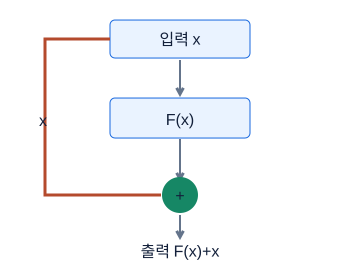

**그림 20-1. Residual: F(x)에 입력 x를 더한다**

우회 경로도 미분 경로가 된다. 입력·출력 채널이나 공간 크기가 다르면 projection 등으로 모양을 맞춰야 한다. 모든 블록이 자동으로 identity인 것은 아니다.

그림의 값·구조: 입력x가블록F를통과하는경로와우회하는경로로나뉜뒤덧셈한다. shape가같아야직접더할수있다.

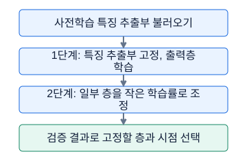

**그림 20-2. 전이학습의 두 가지 업데이트 범위**

동결은 requires_grad와 optimizer 대상 등을 확인하는 일이다. BN의 학습 모드는 별도 고려가 필요하다. 새 데이터에서 항상 더 좋은 결과를 보장하지 않는다.

그림의 값·구조: 사전학습 feature extractor 불러오기 → 1단계: backbone 동결, head 학습 → 2단계: 일부 backbone을 작은 LR로 조정 → valid 결과로 동결 범위·시점 선택

### 숫자로 끝까지 따라가기

아래 벡터와 채널 수는 그림의 훈련 결과를 인용한 것이 아니라 residual addition과 projection을 검산하는 독립 예다.

입력 x=`[2,−1]`, 학습된 수정분 F(x)=`[0.5,0.2]`라고 하자. 합은 `[2.5,−0.8]`이다. 합 뒤 ReLU가 있는 블록이라면 최종 출력은 `[2.5,0]`이 된다. 블록 변형에 따라 활성함수 위치가 다르므로 `x+F(x)`라는 핵심과 전체 블록의 마지막 출력을 구분한다. 미분 관점에서는 이 단순 합의 `dy/dx=I+dF/dx`다. 항등 경로가 있어 gradient가 F를 통과하는 경로만 존재하는 구조와 다르다. 다만 이후의 비선형이나 다른 경로까지 고려하면 gradient가 언제나 그대로 보존된다고 단정할 수 없다.

위의 `[B,32,16,16]→[B,64,8,8]` shortcut에 1×1 Conv, stride=2, bias=False를 쓰면 weight 수는 `64×32×1×1=2048`이다. 공간 크기는 `floor((16−1)/2+1)=8`이다. 1×1이라는 작은 창이라도 channel 조합은 학습할 수 있으며 stride로 공간을 줄일 수도 있다.

backbone의 출력 특성이 512개이고 새 분류 클래스가 3개면 새 Linear head는 `512×3+3=1539`개 파라미터를 가진다. 1,000클래스용 기존 head를 그대로 두면 출력 `[B,1000]`이 되어 이번 `[B,3]` 계약과 다르다. head의 크기를 실제 문제의 클래스 수로 바꾸고 label mapping도 0부터 K−1까지 고정한다.

```python
import torch

torch.manual_seed(5)
# 외부 weight 다운로드 없이 freeze와 출력 계약만 확인한다.
backbone = torch.nn.Sequential(
    torch.nn.Linear(4, 6), torch.nn.BatchNorm1d(6), torch.nn.ReLU())
for p in backbone.parameters():
    p.requires_grad_(False)
backbone.eval()  # 이 예에서는 저장 통계도 고정하는 정책
head = torch.nn.Linear(6, 3)
opt = torch.optim.SGD(head.parameters(), lr=.1)
x = torch.randn(2, 4)
y = torch.tensor([0, 2], dtype=torch.long)
before = {k: v.clone() for k, v in backbone.state_dict().items()}
head.train()
opt.zero_grad(set_to_none=True)
logits = head(backbone(x))
torch.nn.functional.cross_entropy(logits, y).backward()
opt.step()
assert logits.shape == (2, 3)
assert all(p.grad is None for p in backbone.parameters())
assert all(torch.equal(before[k], v) for k, v in backbone.state_dict().items())
print("head parameters:", sum(p.numel() for p in head.parameters()))
```

이 코드는 사전학습의 성능을 재현하는 예제가 아니라, 작은 임의 초기화 backbone으로 동결 정책을 확인하는 독립 실습이다. 출력은 logits이므로 CrossEntropyLoss 앞에 softmax를 넣지 않는다.

### 시험 문제로 연결하기

깊이가 늘었는데 훈련 오차 자체가 나빠지는 현상은 train만 좋아지고 valid가 나빠지는 overfitting과 구분한다. 깊은 plain network의 최적화가 어려워진 경우 용량을 더 주었어도 그 용량을 활용하는 가중치를 찾지 못할 수 있다. residual 구조는 입력 전달을 유지하면서 수정분을 배울 길을 제공한다. 따라서 ResNet을 설명할 때 단순히 ‘깊어서 과적합하니 층을 건너뛴다’고 요약하면 핵심 동기를 놓친다.

pretrained 모델을 쓰려면 weight가 요구하는 변환을 함께 확인한다. torchvision의 weight 객체에 연결된 transforms는 resize·crop·정규화 정보를 제공한다. 이미지를 단순히 0부터 1로 만들었다고 그 모델이 기대하는 분포와 일치하는 것은 아니다. 흑백을 3채널로 반복하면 기존 첫 층 입력 계약을 유지할 수 있다. 첫 Conv를 1채널로 바꾸는 방법도 있지만 가중치 변환이나 재초기화와 이후 fine-tuning을 어떻게 할지 정해야 한다.

처음에는 head-only로 빠른 기준을 만들고, 근거가 있으면 마지막 block부터 풀어 작은 학습률로 조정한다. unfreeze했는데 optimizer에 새 파라미터를 추가하지 않았다면 그 부분은 업데이트되지 않는다. 반대로 이미 학습하던 모델을 중간에 동결할 때는 남아 있는 gradient와 optimizer 구성을 정리해 실제로 갱신이 멈췄는지도 확인한다. 전이학습의 두 경로는 [PyTorch 전이학습 튜토리얼](https://docs.pytorch.org/tutorials/beginner/transfer_learning_tutorial.html)에 예시가 있다.

### 자주 헷갈리는 지점

`model.train()`은 하위 모듈의 모드도 바꾼다. backbone의 BN을 고정하려는 정책이라면 epoch 시작 뒤 다시 backbone.eval()을 적용하는 등 호출 순서를 명시해야 한다. requires_grad=False만으로 running mean/variance 갱신은 막히지 않는다. 새로운 domain이 자연 이미지와 크게 다르거나 weight가 로컬에 없으면 pretrained가 항상 최선의 출발점은 아니다. 외부 다운로드 성공을 가정한 코드만 준비하면 오프라인 환경에서 실패할 수 있다. Process가 정확한 구조를 지정하면 임의 ResNet 교체가 더 좋은 성능이어도 명세를 벗어난다.

### 스스로 확인하기

1. x와 F(x)가 모두 `[B,16,8,8]`일 때 더한 출력 channel은 16인가 32인가?
2. 동결된 BatchNorm에서 requires_grad=False만 설정하고 train 모드로 돌렸다. running statistics도 고정되는가?
3. 입력 특성 128개, 출력 클래스 5개의 bias 있는 Linear head 파라미터 수는?

### 정답과 이유

1. 16이다. 원소별 덧셈은 같은 위치의 두 값을 더한다. channel을 이어 붙이는 concat이라면 32이지만 여기서는 그 연산이 아니다.
2. 기본 설정에서는 고정되지 않는다. running statistics는 gradient로 배우는 파라미터가 아닌 buffer이며 train forward에서 갱신될 수 있다.
3. `128×5+5=645`개다. backbone 크기와 상관없이 새 head의 입력·출력 차원에서 계산한다.

### 더 읽을 공식 자료

identity shortcut과 깊은 네트워크 최적화의 동기는 [Deep Residual Learning for Image Recognition](https://arxiv.org/abs/1512.03385)을 참고한다. 사전학습 weight에 연결된 전처리는 [torchvision ResNet18 문서](https://docs.pytorch.org/vision/0.22/models/generated/torchvision.models.resnet18.html)의 weights와 transforms 부분에서 확인한다.

## 21. 시계열 데이터 계약과 window

### 먼저 떠올릴 장면

현재 시각까지 기록한 온도로 두 시간 뒤 온도를 예측하려고 한다. 컴퓨터에 원본 표를 주면 어느 행부터 어느 행까지가 ‘과거’이고 어느 행이 ‘두 시간 뒤’인지를 자동으로 알아내지는 못한다. 과거 구간을 입력 한 개로 잘라내고 미래 정답을 붙이는 window 규칙이 필요하다. 이 규칙을 한 행만 잘못 옮겨도 모델이 푸는 문제가 달라진다.

먼저 ‘언제 예측을 내는가’를 정한다. 마지막 관측 직후 내는 예측인지, 하루가 모두 끝난 뒤 일괄 평가하는지에 따라 이용 가능한 정답이 달라진다. 시계열 모델보다 window 계약과 검증 시점이 먼저인 이유다. 같은 차량의 센서라 해도 서로 다른 주행이나 긴 시간 공백을 가로질러 이어 붙이면 실제로 없던 연속 패턴을 만들 수 있다.

### 낯선 말부터 풀기

sampling rate f는 1초에 관측한 표본 수이며 단위 Hz다. lookback L은 입력으로 보는 과거 표본 수, horizon H는 마지막 입력에서 정답까지의 행 간격이다. 이 강의는 다음 행을 H=1로 정의한다. 마지막 입력 인덱스를 e라고 하면 입력은 `X[e−L+1:e+1]`, 정답은 `y[e+H]`다. Python slice의 끝 e+1은 포함되지 않으므로 실제 마지막 입력은 e다. H=0은 현재 시점 목표이며 미래 예측과 다르다.

stride S는 다음 window의 입력 끝을 몇 행 이동시키는지다. 원본 shape `[T,F]`에서 T는 전체 시점 수, F는 시점당 특성 수다. window를 N개 모으면 `[N,L,F]`이고 DataLoader가 B개를 꺼내면 `[B,L,F]`다. 문맥에 따라 T를 window 길이로 쓰는 코드도 있으므로 기호를 혼합하지 않는다. target index는 각 창이 맞히려는 정답의 원본 위치로, 분할과 제출 순서를 검증하는 데 유용하다.

### 그림을 읽는 순서

먼저 축·색·연결 방향을 읽고, 각 그림 아래의 설명으로 확인하세요. 손계산은 다른 작은 숫자를 쓰는 독립 연습일 수 있습니다.

![lookback3,horizon1. [1,2,3]으로4예측,[2,3,4]으로5예측.](../figures/course/21-1.svg)

**그림 21-1. window: 과거를 묶고 미래 정답을 연결**

horizon의 정의는 문제마다 확인한다. 과거 마지막 시점과 target 시점을 실제 인덱스로 적으면 off-by-one 실수를 찾기 쉽다.

그림의 값·구조: lookback3,horizon1. [1,2,3]으로4예측,[2,3,4]으로5예측.

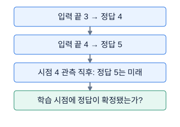

**그림 21-2. 샘플의 정답 시점으로 분할을 검사**

이 예는 시점 4의 정답이 즉시 확정된 직후다. 시점 4 직전이거나 정답 확정이 지연되면 허용 학습 데이터가 달라진다. window가 겹치는지보다 학습·예측 당시에 무엇을 알 수 있었는지 확인한다.

그림의 값·구조: 시점 4의 관측과 정답이 확정된 직후를 기준으로 한다. target 4는 알려졌지만 target 5는 아직 미래다. 정답 확정 지연은 없다고 가정한다.

### 숫자로 끝까지 따라가기

T=10이고 원본 값이 0부터 9까지 있다고 하자. L=3, H=2, S=1이다. 첫 입력 끝은 e=2이므로 입력 `[0,1,2]`, 정답은 4다. 다음은 `[1,2,3]→5`다. 마지막은 e=7에서 `[5,6,7]→9`다. e=8을 쓰면 정답 인덱스 10이 되어 범위를 벗어난다. 따라서 e=2,3,4,5,6,7의 여섯 창이고 `T−L−H+1=10−3−2+1=6`과 일치한다.

S=2이면 e=2,4,6 세 개다. 일반적으로 `T−L−H≥0`일 때 창 수는 `floor((T−L−H)/S)+1`, 아니면 0이다. sampling rate 50Hz에서 0.4초 입력은 L=20, 마지막 관측으로부터 2초 뒤는 H=100이다. 다만 timestamp 간격이 불규칙하면 100행 뒤가 정확히 2초 뒤라는 보장은 없으므로 실제 시간 기반 정렬·재표본화·목표 매칭이 필요하다.

실시간 검증에서 cutoff=6 직전에 모델을 확정하고 첫 검증 원점을 e=6으로 두자. 학습 target은 6 미만, 검증 원점은 6 이상이어야 한다. H=2이면 target=6,7인 창은 원점이 4,5이므로 이 설계에서 검증에 넣지 않는다. 단순히 `target>=6`만 쓰면 시점 5 정답까지 학습한 모델이 원점 4로 되돌아가 예측할 수 있다. 정답 공개 지연이 d행이면 학습 조건은 `target+d<cutoff`처럼 더 엄격해질 수 있다. 고정 데이터의 사후 배치평가와 실시간 rolling-origin 평가를 구분하고 명세를 따른다.

```python
import numpy as np

def windows(x, lookback, horizon, stride=1):
    x = np.asarray(x)
    if x.ndim != 2 or lookback < 1 or horizon < 0 or stride < 1:
        raise ValueError("x:[T,F], L>=1, H>=0, S>=1 필요")
    ends = np.arange(lookback - 1, len(x) - horizon, stride)
    if len(ends) == 0:
        return np.empty((0, lookback, x.shape[1]), dtype=x.dtype), ends
    return np.stack([x[e-lookback+1:e+1] for e in ends]), ends + horizon

x = np.arange(10, dtype=np.float32)[:, None]
xw, target_idx = windows(x, 3, 2)
yw = x[target_idx, 0]
assert xw.shape == (6, 3, 1)
assert xw[0, :, 0].tolist() == [0., 1., 2.]
assert yw.tolist() == [4., 5., 6., 7., 8., 9.]
cutoff, horizon = 6, 2
tr = target_idx < cutoff
va = target_idx - horizon >= cutoff
assert target_idx[tr].max() < (target_idx[va] - horizon).min()
print(xw[:, :, 0], yw, tr, va)
```

이 함수는 이미 시간순으로 정렬된 연속된 단일 sequence를 가정한다. 여러 그룹이면 그룹별로 호출해야 하며 정답 열과 입력 특성 열은 실제 과제의 계약대로 별도로 전달한다.

### 시험 문제로 연결하기

시간과 ID를 보존한 정렬부터 시작한다. 동일 timestamp가 있을 때 원래 행 번호 같은 안정적인 tie-breaker가 필요한지도 확인한다. 차량 ID가 같아도 trip과 공백 기준 segment를 나누어야 할 수 있다. 각 창의 target 원본 행 번호와 그룹을 함께 저장하면 예측을 원래 순서로 복원하기 쉽다. 길이가 L+H보다 짧은 그룹은 빈 결과를 내야 하고, 빈 리스트를 무조건 np.stack하면 실패한다.

메모리도 손으로 계산한다. float32 창 `[100000,20,10]`은 `100000×20×10×4=80000000`바이트, 약 80MB다. 복사본·정규화 결과·GPU activation은 별도다. lazy Dataset은 모든 창 원소를 미리 복사하지 않고 원본 배열과 끝 인덱스만 저장한 뒤 `__getitem__`에서 slice를 만든다. NumPy sliding_window_view도 겹치는 view를 만들 수 있지만 이후 연산 비용과 메모리 공유, 축 순서를 이해해야 한다. [NumPy 공식 sliding_window_view 문서](https://numpy.org/doc/stable/reference/generated/numpy.lib.stride_tricks.sliding_window_view.html)가 주의점을 다룬다.

### 자주 헷갈리는 지점

창을 만든 후 scaler fit을 할 때 `[N,L,F]`를 `[N×L,F]`로 펴면 특성별 정규화는 가능하다. 다만 겹친 원본 시점이 여러 번 반영되므로 원본 train 시점별 fit과 가중치가 같지 않을 수 있다. 어느 방법을 쓰든 validation과 미래 시점은 fit에서 제외한다. target도 표준화했다면 역변환 후 원래 단위의 metric과 제출값을 만든다. 입력에 과거 정답을 넣는 자기회귀 특성은 그 과거 정답이 예측 원점에 실제로 관측 가능한 경우에만 허용된다. 열 이름이 y라는 이유만으로 무조건 누수도, 과거라고 썼다는 이유만으로 무조건 안전도 아니다.

### 스스로 확인하기

1. T=12, L=4, H=3, S=1이면 창 수와 첫 target index는 얼마인가?
2. 20Hz에서 1.5초 lookback은 몇 행인가? 간격이 일정하다고 가정한다.
3. 입력은 두 차량을 이어 붙인 배열이다. 위 windows 함수를 한 번 호출하면 안전한가?

### 정답과 이유

1. 창 수는 `12−4−3+1=6`, 첫 입력 끝 e=3이므로 첫 target은 6이다. 마지막 정답은 원본 끝 11을 넘지 않아야 한다.
2. `20×1.5=30`행이다. 초와 초당 표본 수를 곱하면 표본 수가 된다.
3. 안전하지 않다. 첫 차량의 마지막 구간과 둘째 차량의 시작을 같은 입력으로 묶을 수 있다. 차량·주행·연속 segment별로 창을 만들어야 한다.

### 더 읽을 공식 자료

배열의 겹친 창 표현은 [NumPy sliding_window_view](https://numpy.org/doc/stable/reference/generated/numpy.lib.stride_tricks.sliding_window_view.html), 순서 있는 교차검증의 인덱스 변화는 [scikit-learn TimeSeriesSplit](https://scikit-learn.org/stable/modules/generated/sklearn.model_selection.TimeSeriesSplit.html)에서 확인한다. 실제 예측 원점과 label 확정 지연은 라이브러리가 대신 추론하지 않으므로 문제 정의로 별도 설계해야 한다.

## 22. RNN·LSTM·GRU와 1D CNN

### 먼저 떠올릴 장면

센서값을 한 시점씩 읽으며 작은 메모장에 ‘지금까지의 상황’을 갱신한다고 생각하자. RNN은 현재 입력과 이전 메모를 합쳐 새 메모인 hidden state를 만든다. 메모는 원본 과거를 그대로 저장한 표가 아니라 다음 예측에 유용하도록 학습된 숫자 벡터다. 같은 갱신 규칙을 모든 시점에 쓰므로 입력 길이가 바뀌어도 시점마다 새 가중치를 만드는 것은 아니다.

긴 기록에서는 오래전 정보가 계속 덮이거나 작은 변화로 희미해질 수 있다. LSTM은 별도 cell state와 여러 gate로 ‘무엇을 남길지, 무엇을 쓸지, 무엇을 보여줄지’를 조절한다. GRU는 별도 cell state 없이 더 간결한 gate 구조를 쓴다. 1D CNN은 같은 자료를 작은 시간 구간씩 훑으며 지역 패턴을 찾는다. 네 방법은 모두 시계열에 쓸 수 있지만 정보를 모으는 방식과 계산 비용이 다르다.

### 낯선 말부터 풀기

GRU에서 reset gate는 새 candidate를 만들 때 이전 상태의 영향을 얼마나 사용할지 조절하고, update gate는 이전 hidden과 새 candidate를 어떻게 섞을지 조절한다. PyTorch 표기에서는 `h_new=(1−z)⊙n+z⊙h_old`이므로 z가 클수록 기존 상태를 더 남긴다. 어떤 설명은 반대로 계수를 정의하므로 gate 이름만 외우지 말고 갱신식에서 어느 항에 곱하는지 읽는다. LSTM과 달리 별도의 c 상태를 반환하지 않는 점도 코드에서 드러난다.

기본 RNN은 `h_t=φ(W_x x_t+W_h h_(t−1)+b)`다. x_t는 t시점 입력, h_t는 새 은닉 상태, W_x는 입력을 읽는 가중치, W_h는 이전 상태를 읽는 가중치다. φ는 tanh 등의 비선형이다. many-to-one은 창 전체에서 출력 하나, many-to-many는 시점마다 출력, sequence-to-sequence는 입력과 출력 길이가 다를 수도 있는 구조를 뜻한다.

BPTT는 시간을 따라 펼친 연산 그래프에서 역전파하는 방법이다. 별도의 전혀 다른 미분이 아니라 같은 가중치를 반복 사용한 그래프의 연쇄법칙이다. 반복되는 Jacobian의 영향으로 gradient가 작아지는 vanishing이나 커지는 exploding이 생길 수 있다. LSTM에서는 `c_t=f_t⊙c_(t−1)+i_t⊙g_t`, `h_t=o_t⊙tanh(c_t)`를 쓴다. f는 이전 cell 유지 비율, i는 새 candidate g의 기록 비율, o는 밖으로 보여 주는 비율이다. ⊙는 같은 위치끼리 곱하기다. g는 보통 tanh candidate이며 sigmoid gate 셋과 구별한다.

### 그림을 읽는 순서

먼저 축·색·연결 방향을 읽고, 각 그림 아래의 설명으로 확인하세요. 손계산은 다른 작은 숫자를 쓰는 독립 연습일 수 있습니다.

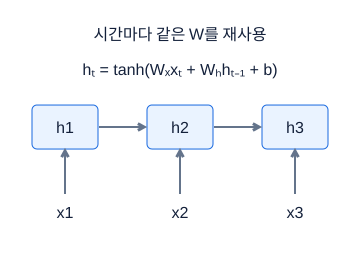

**그림 22-1. RNN을 시간축으로 펼쳐 보기**

상자 세 개가 서로 다른 모델이라는 뜻이 아니다. 같은 recurrent cell을 시간에 따라 펼친 그림이다. BPTT는 이 시간 연결을 따라 gradient를 거슬러 계산한다.

그림의 값·구조: x1→h1,x2와h1→h2,x3와h2→h3. 같은가중치를모든시점에재사용.

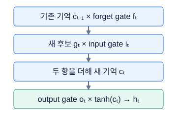

**그림 22-2. LSTM은 기존 기억과 새 후보를 섞는다**

f·i·o는 세 gate이고 g는 새 기억 후보다. 네 묶음의 선형 계산을 쓴다는 것과 gate가 네 개라는 설명은 구분한다. h와 c의 역할도 다르다.

그림의 값·구조: 기존 기억 cₜ₋₁ × forget gate fₜ → 새 후보 gₜ × input gate iₜ → 두 항을 더해 새 기억 cₜ → output gate oₜ × tanh(cₜ) → hₜ

### 숫자로 끝까지 따라가기

scalar RNN에서 W_x=1, W_h=0.5, b=0, h₀=0, 입력 x₁=1,x₂=2, 활성 tanh라고 하자. `h₁=tanh(1)≈0.7616`이다. 두 번째 pre-activation은 `2+0.5×0.7616=2.3808`, `h₂=tanh(2.3808)≈0.9830`이다. 두 번째 입력이 들어갈 때 처음 입력의 영향은 h₁을 통해 전달된다. h₂는 두 입력의 단순 평균도, 마지막 입력 2 자체도 아니다.

LSTM 한 좌표의 이전 c=2, f=0.8, i=0.25, candidate g=−0.4, o=0.5라고 하자. 남긴 기억은 `0.8×2=1.6`, 새 기록은 `0.25×(−0.4)=−0.1`, 새 c는 1.5다. hidden은 `0.5×tanh(1.5)≈0.4526`이다. cell=1.5와 hidden≈0.4526을 서로 같은 값이라고 저장하면 다음 계산이 달라진다. gate들이 정하는 여러 경로 중 cell의 덧셈 경로가 장기 정보 전달을 돕지만 gradient 소실을 완전히 제거한다고 말하지 않는다.

PyTorch에서 배치 B=2, 길이 T=4, 입력 F=3, hidden H=5, 한 층 단방향 LSTM을 `batch_first=True`로 만들면 입력 `[2,4,3]`, sequence output `[2,4,5]`, h_n과 c_n은 각각 `[1,2,5]`다. batch_first는 입력·출력 배치 축에만 적용되며 state는 `[층수×방향수,B,H]`다. 기본값 False이면 배치 입력·출력은 `[T,B,F]`, `[T,B,H]`다. 이 예처럼 projection 없는 한 층 LSTM의 파라미터 수는 `4HF+4H²+8H=60+100+40=200`이다. 두 bias 묶음까지 세었다.

```python
import torch

torch.manual_seed(3)
x = torch.randn(2, 4, 3)  # [B,T,F]
rnn = torch.nn.LSTM(3, 5, batch_first=True)
seq, (h, c) = rnn(x)
assert seq.shape == (2, 4, 5)
assert h.shape == c.shape == (1, 2, 5)
assert torch.allclose(seq[:, -1, :], h[-1])
assert sum(p.numel() for p in rnn.parameters()) == 200
head = torch.nn.Linear(5, 1)
pred = head(h[-1])
target = torch.zeros(2, 1)
loss = torch.nn.functional.mse_loss(pred, target)
loss.backward()
torch.nn.utils.clip_grad_norm_(rnn.parameters(), 1.)
conv = torch.nn.Conv1d(3, 6, kernel_size=3, padding=1)
cnn_out = conv(x.permute(0, 2, 1))
assert cnn_out.shape == (2, 6, 4)
print(seq.shape, h.shape, pred.shape, cnn_out.shape)
```

이 예의 마지막 sequence와 h_n 일치는 단방향·같은 유효 길이·padding 없음이라는 조건에서 사용했다. 일반 양방향·가변 길이 코드로 그대로 확대하지 않는다.

### 시험 문제로 연결하기

양방향 RNN은 창을 앞뒤로 읽은 표현을 합친다. 마지막 layer의 두 최종 상태는 h_n에서 방향별로 꺼내 합쳐야 한다. `seq[:,-1,:]`의 backward 절반은 전체 창의 최종 요약과 같지 않다. RNN·GRU는 state로 h_n을, LSTM은 `(h_n,c_n)` tuple을 반환한다. [PyTorch LSTM 문서](https://docs.pytorch.org/docs/2.7/generated/torch.nn.LSTM.html)는 방향·층·projection에 따른 shape와 내장 dropout 위치를 명시한다.

가변 길이를 0으로 padding했다면 마지막 행이 실제 마지막 관측이 아닐 수 있다. RNN의 packed sequence와 lengths를 사용하거나 과제에 맞게 유효 끝을 선택한다. 0은 실제 측정값일 수도 있으므로 단순히 0이라고 자동 무시되지 않는다. 1D CNN 입력은 `[B,F,T]`이므로 `permute(0,2,1)`로 바꾸고, pooling 뒤 출력 계약은 RNN head와 동일하게 만들 수 있다. 시간 전체를 요약해 하나를 예측하는 창 모델과 매 시점 실시간 예측 모델은 causal 요구가 다르다.

### 자주 헷갈리는 지점

batch_first=True라고 h_n까지 `[B,층수,H]`로 읽지 않는다. PyTorch 다층 RNN의 dropout 인수는 마지막 층을 제외한 층 사이 출력에 적용되므로 한 층 모델에서 같은 효과를 기대하면 안 된다. GRU가 파라미터가 적다는 이유로 항상 낮은 성능도, LSTM이 더 복잡하다는 이유로 항상 높은 성능도 아니다. 양방향 구조는 이미 모두 관측된 과거 window 내부를 뒤로 읽는 상황에는 사용할 수 있지만, 현재 시점 출력이 아직 도착하지 않은 미래를 읽게 되면 누수다. 1D CNN도 대칭 padding으로 시점별 미래 이웃을 볼 수 있으므로 online 출력에는 causal kernel 배치를 검토한다.

### 스스로 확인하기

1. batch_first=True, B=8,T=10,F=4,H=6인 한 층 단방향 GRU의 sequence output과 h_n shape는?
2. LSTM에서 c_old=1,f=0.5,i=0.2,g=0.5이면 c_new는 얼마인가?
3. 전체가 이미 관측된 과거 20시점으로 다음 날 하나를 예측한다. 양방향 RNN이 이름만으로 무조건 미래 누수인가?

### 정답과 이유

1. output은 `[8,10,6]`, h_n은 `[1,8,6]`이다. batch_first가 state 축 순서까지 바꾸지 않는다는 점을 확인한다.
2. `0.5×1+0.2×0.5=0.6`이다. 이전 기억의 일부와 새 candidate 일부를 더한다. hidden을 구하려면 output gate가 추가로 필요하다.
3. 무조건은 아니다. 예측 원점 이전의 창 내부를 양방향으로 읽는 것은 관측 가능 정보만 사용할 수 있다. 매 시점 즉시 내는 출력에서는 해당 원점 이후를 읽지 않는지 별도 검사한다.

### 더 읽을 공식 자료

gate 수식과 state shape는 [PyTorch LSTM](https://docs.pytorch.org/docs/2.7/generated/torch.nn.LSTM.html), GRU의 갱신식은 [PyTorch GRU](https://docs.pytorch.org/docs/2.7/generated/torch.nn.GRU.html)를 비교한다. 입력 차원 인수보다 실제 반환값의 shape를 종이에 써 보는 것이 구현 검증에 효과적이다.

## 23. Attention과 Transformer

### 먼저 떠올릴 장면

현재 센서 상태를 해석하려고 과거 기록에서 관련 있는 시점을 찾아 읽는다고 하자. 어떤 기록은 많이 참고하고 어떤 기록은 적게 참고한다. attention은 현재 질문에 해당하는 query와 각 기록의 key를 비교해 참고 비중을 만들고, 그 비중으로 value 내용을 합친다. RNN처럼 이전 메모 하나만 거쳐 정보를 가져오는 대신 여러 위치를 직접 비교할 수 있다.

비유에서 ‘찾는다’는 말은 보통 딱 하나만 선택한다는 뜻이 아니다. softmax attention은 여러 위치의 value를 가중합한다. query·key·value는 사람이 쓴 질문·제목·문장이 아니라 입력에서 학습한 선형 변환으로 만드는 숫자 벡터다. attention 가중치가 크다고 그것만으로 인과적 설명이나 모델 판단의 완전한 이유가 되는 것도 아니다. 먼저 어떤 행렬 계산을 하는지 이해한 다음 모델의 해석을 논해야 한다.

### 낯선 말부터 풀기

Q는 query 묶음, K는 key 묶음, V는 value 묶음이다. 단일 head에서 query 수 T_q, key 수 T_k, query/key 차원 d_k, value 차원 d_v라면 Q는 `[T_q,d_k]`, K는 `[T_k,d_k]`, V는 `[T_k,d_v]`다. `S=QKᵀ/sqrt(d_k)`는 모든 query-key 쌍의 점수 표 `[T_q,T_k]`다. 각 행에 softmax를 적용해 참고 비중 A를 만들고 `O=AV`로 출력 `[T_q,d_v]`를 얻는다.

self-attention은 Q/K/V가 같은 입력 sequence에서 만들어지고, cross-attention은 Q의 원천과 K/V의 원천이 다른 경우다. multi-head는 다른 projection으로 이 계산을 여러 번 한 뒤 결과를 합친다. 일반적인 구현에서 d_model=64, head=4이면 head당 d_k=16이다. head가 늘어난다고 전체 표현 차원이 무조건 배로 커지는 것은 아니다. Transformer는 attention 외에도 feed-forward 층, residual 연결, normalization 등을 포함하는 전체 블록 구조다. 출발점은 [Attention Is All You Need 원 논문](https://arxiv.org/abs/1706.03762)이다.

### 그림을 읽는 순서

먼저 축·색·연결 방향을 읽고, 각 그림 아래의 설명으로 확인하세요. 손계산은 다른 작은 숫자를 쓰는 독립 연습일 수 있습니다.

![한query의QK점수[2,0]을softmax하면약[.881,.119]. 두value[10,20]가중합은11.19.](../figures/course/23-1.svg)

**그림 23-1. attention의 한 행은 무엇을 볼지 정한다**

간단히 d_k=1인 예다. 실제로는 QKᵀ/√d_k의 각 query 행에 softmax를 적용한다. attention weight와 원래 value를 혼동하지 않는다.

그림의 값·구조: 한query의QK점수[2,0]을softmax하면약[.881,.119]. 두value[10,20]가중합은11.19.

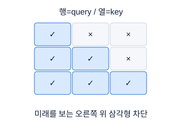

**그림 23-2. causal mask는 미래 열을 가린다**

✓는 이 개념도에서 허용, ×는 차단이다. 실제 PyTorch mask의 True 의미는 API별로 다르므로 이 그림의 기호를 그대로 boolean으로 옮기지 않는다.

그림의 값·구조: 행=query시점,열=key시점. query1은key1만, query2는key1,2만, query3은모두허용.

### 숫자로 끝까지 따라가기

계산하기 쉬운 독립 예로 d_k=1, Q=`[[1],[0]]`, K=`[[0],[ln 2]]`, V=`[[3,0],[0,6]]`를 두자. Q는 `[2,1]`, Kᵀ는 `[1,2]`이므로 점수는 `[[0,ln 2],[0,0]]`다. `sqrt(1)=1`이어서 scaling으로 값이 바뀌지 않는다. 첫 행 지수는 `[1,2]`, 합은 3, attention 비중은 `[1/3,2/3]`다. 둘째 행은 지수 `[1,1]`이므로 `[1/2,1/2]`다.

첫 output은 `(1/3)×[3,0]+(2/3)×[0,6]=[1,4]`다. 둘째는 `[1.5,3]`이다. 각 output 행은 value 차원 d_v=2를 갖는다. Q와 V의 마지막 차원이 달라도 계산이 가능하며, 맞아야 하는 것은 Q·K의 비교 차원과 K·V의 기록 개수다. 첫 query에 두 번째 key를 causal mask로 가리면 첫 행은 `[1,0]`이 되어 output `[3,0]`이다. 둘째 query는 앞과 자기 위치 모두 볼 수 있어 그대로다.

d_k가 커질 때 독립적이고 비슷한 분산의 성분을 더하는 내적의 분산은 차원에 따라 커질 수 있다. sqrt(d_k)로 나누는 것은 점수 규모가 지나치게 커져 softmax가 매우 뾰족해지는 것을 완화하려는 장치다. 모든 입력의 분산이 정확히 특정 값으로 고정된다는 보증은 아니다. 수치 안정 softmax는 행 최대값을 먼저 빼도 결과가 같다. 분자·분모에 같은 지수 배율이 곱해졌다가 약분되기 때문이다.

```python
import numpy as np

q = np.array([[1.], [0.]])
k = np.array([[0.], [np.log(2.)]])
v = np.array([[3., 0.], [0., 6.]])
scores = q @ k.T / np.sqrt(q.shape[-1])

def row_softmax(s):
    shifted = s - s.max(axis=-1, keepdims=True)
    e = np.exp(shifted)
    return e / e.sum(axis=-1, keepdims=True)

a = row_softmax(scores)
out = a @ v
assert np.allclose(a.sum(axis=-1), 1.)
assert np.allclose(out, [[1., 4.], [1.5, 3.]])
blocked = np.triu(np.ones((2, 2), dtype=bool), k=1)
causal_scores = np.where(blocked, -np.inf, scores)
causal_out = row_softmax(causal_scores) @ v
assert np.allclose(causal_out, [[3., 0.], [1.5, 3.]])
print(a, out, causal_out, sep="\n")
```

모든 key를 가린 행은 위 softmax에서 정의되지 않으므로 만들지 않는다. 실제 padding·mask를 구성할 때 각 유효 query가 적어도 필요한 key를 볼 수 있는지 검사한다.

### 시험 문제로 연결하기

배치와 head까지 있으면 Q `[B,H,T_q,d_k]`, K `[B,H,T_k,d_k]`, 점수 `[B,H,T_q,T_k]`, V `[B,H,T_k,d_v]`, 출력 `[B,H,T_q,d_v]`다. H는 여기서 이미지 높이가 아니라 head 수이므로 문맥을 읽는다. T_q=T_k=T인 full self-attention 점수 원소 수는 `B×H×T²`다. T를 두 배로 하면 점수 원소는 네 배이므로 긴 센서 창에서 메모리 비용이 급격히 커진다. 효율적 구현의 실제 메모리 절약과 이 개념상의 쌍 비교 수는 구분한다.

PyTorch TransformerEncoderLayer를 표형 시계열 `[B,T,F]`에 연결하려면 먼저 Linear로 F→d_model을 만들고, `batch_first=True`를 지정하고, 위치 표현을 더한다. d_model은 기본 multi-head 설정에서 head 수로 나누어져야 한다. padding된 시간축을 평균낼 때도 mask로 실제 시점만 더하고 유효 길이로 나누어야 한다. encoder에 padding mask만 넘겼다고 이후 평균 pooling에서 padding 출력까지 저절로 제외되는 것은 아니다.

### 자주 헷갈리는 지점

‘PyTorch boolean mask의 True는 무조건 차단’이라고 외우면 위험하다. `nn.Transformer`의 bool mask에서는 True가 참여를 막는 위치인 반면 `torch.nn.functional.scaled_dot_product_attention`의 bool attn_mask에서는 True가 참여 허용이다. 호출하는 API의 문서를 기준으로 해석해야 한다. 이 차이는 [Transformer 문서](https://docs.pytorch.org/docs/2.7/generated/torch.nn.Transformer.html)와 [functional SDPA 문서](https://docs.pytorch.org/docs/2.7/generated/torch.nn.functional.scaled_dot_product_attention.html)에 명시되어 있다.

이미 모두 관측된 과거 window로 미래 하나를 예측하는 encoder라면 창 내부 causal mask가 항상 필요한 것은 아니다. 반면 매 시점 다음 값을 예측하는 autoregressive 학습에서는 미래 key를 차단해야 한다. softmax dim을 query 축으로 잡으면 ‘한 질문의 참고 비중’이 아니라 다른 정규화가 된다. positional encoding 없는 attention을 곧바로 ‘순서를 섞어도 출력 배열까지 완전히 동일하다’고 표현하는 것도 부정확하다. 기본 성질은 입력 재배열에 맞춰 출력도 재배열되는 equivariance이고, 이후 순서 없는 pooling을 하면 구별을 더 잃는다.

### 스스로 확인하기

1. Q `[B,4,3,8]`, K `[B,4,5,8]`, V `[B,4,5,6]`이면 score와 output shape는?
2. score `[0,0,0]`의 softmax는 무엇이며 그 이유는?
3. d_model=30, nhead=8을 일반적인 동일 크기 head 분할에 사용할 수 있는가?

### 정답과 이유

1. score는 `[B,4,3,5]`, output은 `[B,4,3,6]`이다. query 세 개가 key 다섯 개를 비교하고 value의 마지막 차원 여섯 개를 모은다.
2. `[1/3,1/3,1/3]`이다. 세 지수값이 모두 1이고 합 3으로 나누기 때문이다. 같은 점수는 같은 참고 비중이다.
3. 맞지 않는다. 30이 8로 나누어떨어지지 않아 head당 동일한 정수 차원으로 분할할 수 없다. 32처럼 나누어지는 차원이나 적절한 head 수를 선택한다.

### 더 읽을 공식 자료

scaled dot-product와 multi-head의 원형은 [Attention Is All You Need](https://arxiv.org/abs/1706.03762)를 참고한다. 구현에서는 [PyTorch Transformer](https://docs.pytorch.org/docs/2.7/generated/torch.nn.Transformer.html)의 shape·mask 계약을 확인하고 functional SDPA로 교체할 때 bool 의미와 dropout 인수를 다시 점검한다.

## 24. Autoencoder와 이상탐지

### 먼저 떠올릴 장면

정상 작동하는 기계에서 온도와 진동을 두 숫자로 기록한다고 하자. 정상 기록은 대체로 `[2,2]`, `[3,3]`, `[4,4]`처럼 두 값이 함께 움직인다. 이 기록을 한 숫자로 요약했다가 다시 두 숫자로 복원하면 어떨까? `[3,3]`은 “평균 3”만 기억해도 되지만 `[2,6]`은 평균 4만으로 원래의 불균형을 되살릴 수 없다. 복원 과정에서 잃어버린 차이가 이상 징후의 단서가 된다. 이것이 오토인코더를 이해하는 출발점이다. 실제 온도와 진동은 단위가 다르므로 앞선 강의의 스케일링이 필요하다. 이 예제에서는 이미 비교 가능한 단위로 바꿨다고 가정한다.

오토인코더는 “고장”이라는 정답 없이 입력을 다시 만들도록 훈련할 수 있다. 그렇다고 모든 비정상 상황을 알아보는 판정기는 아니다. 복원 오차가 정상과 이상을 구별하는 데 유용한지는 별도의 검증 자료로 확인해야 한다. 처음에는 복원 모델과 이상 판정 규칙을 두 개의 다른 장치로 생각하는 편이 쉽다.

### 낯선 말부터 풀기

입력 `x`는 한 샘플의 관측값, 잠재벡터 `z`는 압축된 표현, 복원값 `x_hat`은 다시 펼친 결과다. 인코더 `f`가 `z=f(x)`를 만들고 디코더 `g`가 `x_hat=g(z)`를 만든다. 병목은 정보가 지나가는 좁은 중간층이다. 입력 특성 수를 `F`, 잠재 차원을 `d`라고 하면 undercomplete AE는 `d<F`다. 작은 병목은 필요한 구조를 요약하도록 유도하지만, 작기만 하면 좋은 표현이라는 보장은 없다.

복원 오차는 원본과 복원의 차이다. 한 샘플의 평균제곱오차는 `s(x)=Σ_j(x_j-x_hat_j)²/F`이며 `j`는 특성 번호다. 여기서는 `s`가 클수록 이상하다고 정의한다. 임계값 `τ`는 점수를 정상/이상으로 바꾸는 경계이고, 예측 규칙은 `s>τ`일 때 이상 1이다. Denoising AE는 손상시킨 입력에서 깨끗한 원본을 복원하며, sparse AE는 중간 표현의 일부만 활발하도록 규제한다. 입력보다 큰 중간층도 다른 규제가 있다면 사용할 수 있다.

### 그림을 읽는 순서

먼저 축·색·연결 방향을 읽고, 각 그림 아래의 설명으로 확인하세요. 손계산은 다른 작은 숫자를 쓰는 독립 연습일 수 있습니다.

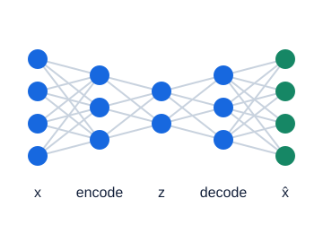

**그림 24-1. Autoencoder: 좁혀서 표현하고 다시 복원**

가운데 bottleneck이 정보의 압축 통로다. 복원이 잘 된다는 것만으로 사람이 원하는 의미를 학습했다는 보장은 없다. 출력 shape는 복원 대상과 맞춘다.

그림의 값·구조: 입력4→은닉3→잠재2→은닉3→복원4. target은입력자체인기본구조.

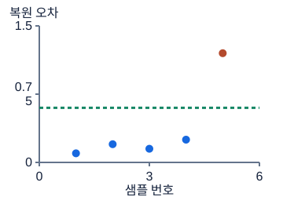

**그림 24-2. 재구성 오차를 이상 점수로 보기**

높은 오차를 이상 후보로 해석하는 예다. 녹색선0.6은 개념 설명용이며 보편적인 threshold가 아니다. 정상 학습 분포와 검증 기준으로 정한다.

그림의 값·구조: 정상예오차.1,.2,.15,.25,이상후보1.2. 문턱은설명용. test정답으로고르면안됨.

### 숫자로 끝까지 따라가기

설명을 위해 학습된 두 함수를 `f([a,b])=(a+b)/2`, `g(z)=[z,z]`로 고정한다. 정상 후보 `[2,2]`는 `z=2`, 복원 `[2,2]`, 오차 `(0²+0²)/2=0`이다. 새 입력 `[2,6]`은 `z=4`, 복원 `[4,4]`, 오차 `((-2)²+2²)/2=4`다. 병목이 두 특성의 공통 크기는 보존하지만 차이는 버렸기 때문이다.

정상 검증 오차가 `[0,0.1,0.2,0.3,0.4]`라고 하자. 이번 독자 연습은 선형 보간 75% 분위수를 임계값으로 정한다. 정렬 위치는 `(5-1)×0.75=3`이므로 인덱스 3의 값 `τ=0.3`이다. 75%는 계산을 쉽게 만든 연습 설정이지 권장 운영 수치가 아니다. 새로운 점수 `[0.1,0.3,4]`는 엄격한 `>` 규칙에서 `[0,0,1]`이 된다. 경계와 같은 0.3은 정상이다.

```python
import numpy as np

x = np.array([[2., 2.], [2., 6.], [3., 3.]])
z = x.mean(axis=1, keepdims=True)       # (3,1)
recon = np.repeat(z, 2, axis=1)         # (3,2)
scores = ((x - recon) ** 2).mean(axis=1)
normal_valid = np.array([0., .1, .2, .3, .4])
threshold = np.quantile(normal_valid, .75, method="linear")
labels = (scores > threshold).astype(np.int64)
assert np.allclose(scores, [0., 4., 0.])
assert labels.tolist() == [0, 1, 0]
assert x.shape == recon.shape
print(scores, threshold, labels)
```

이 코드는 오차 계산을 끝까지 확인하는 고정 선형 압축기이지 학습된 신경망 전체가 아니다. PyTorch AE를 훈련할 때는 정상 배치 `xb`에 대해 `recon=model(xb)`와 복원 손실을 계산하고 역전파한다. 평가 점수는 `(recon-xb).square().flatten(1).mean(1)`로 샘플 축을 남긴다. 이미지도 마지막 방식이면 채널·높이·너비만 평균한다.

### 시험 문제로 연결하기

필기는 “중간층이 입력보다 크면 AE가 아니다”처럼 필요조건을 과장한 선택지를 경계한다. 중요한 것은 복원 목적과 유용한 표현을 유도하는 제약이다. Process에서 샘플별 점수를 요구하면 반환 shape `[B]`가 답안 계약이다. 학습용 전체 평균 손실 하나를 반환하면 계산 자체는 그럴듯해도 요구한 결과와 다르다.

Problem에서는 정상 훈련자료로 전처리와 AE를 학습하고, 정상 검증자료에서 오탐을 살핀다. 이상 정답이 있는 검증자료라면 여러 임계값의 재현율과 정밀도를 계산할 수 있다. AUC는 점수의 순위 분리력을 요약하지 특정 임계값 하나를 직접 골라주지 않는다. 낮은 복원 손실, 높은 순위 성능, 적절한 경보율은 서로 다른 평가 질문이다.

### 자주 헷갈리는 지점

정상 오차가 작아도 이상 오차까지 작으면 탐지에는 불리하다. 반대로 센서 단위를 바꾸기만 해서 특정 특성의 오차가 커졌다면 고장 신호가 아니라 척도의 문제일 수 있다. 전처리의 평균·표준편차도 정상 훈련 부분에만 맞춘다. 모든 특성의 단위가 같아도 어떤 오차를 더 중요하게 볼지는 문제의 비용과 평가 정의에 달렸다.

검증자료에서 정상 다섯 개 중 하나가 경보가 됐다고 미래 오탐률이 정확히 20%라는 보장도 없다. 표본이 작고 분포가 달라질 수 있기 때문이다. 따라서 임계값 옆에는 선택 자료, 부등호, 정상/이상 라벨 방향을 함께 기록한다. 훈련에 이상이 섞이면 그 패턴까지 복원하도록 배울 수 있다는 점도 기억한다.

### 스스로 확인하기

1. 입력 `[1,5]`에 위의 평균 압축기를 적용하면 잠재값·복원값·점수는 무엇인가?
2. 점수 `[0.2,0.3,0.5]`, 임계값 0.3, 규칙 `>`라면 예측은 무엇인가? `>=`로 바꾸면 무엇이 달라지는가?
3. 배치 이미지 `[4,3,8,8]`의 제곱오차에 `.mean()`을 적용한 결과를 제출했다. 샘플별 점수 계약을 어떻게 복원하는가?

### 정답과 이유

1. 잠재값은 3, 복원은 `[3,3]`, 점수는 `(4+4)/2=4`다. 입력 숫자의 평균이 아니라 복원과 입력의 차이를 제곱한 평균이 점수다. 잠재값 3을 이상 점수로 쓰는 것은 서로 다른 양을 혼동한 것이다.
2. `>`이면 `[0,0,1]`, `>=`이면 `[0,1,1]`이다. 가운데 샘플만 바뀐다. 분위수 계산법과 경계 포함 여부가 다르면 같은 모델에서도 판정이 달라지므로 명세에 맞춰야 한다.
3. 제곱오차 tensor에 `flatten(1).mean(1)`을 적용한다. `[4,192]`에서 샘플당 192개 값을 평균해 `[4]`를 얻는다. 이미 전체를 하나로 평균한 scalar에서는 네 점수를 되살릴 수 없으므로 원본과 복원부터 다시 계산해야 한다.

### 더 읽을 공식 자료

평균을 낼 축과 손실의 reduction은 [PyTorch MSELoss](https://docs.pytorch.org/docs/stable/generated/torch.nn.MSELoss.html), 작은 검증 집합의 분위수 보간 방식은 [NumPy quantile](https://numpy.org/doc/stable/reference/generated/numpy.quantile.html)에서 확인한다. 두 문서는 계산 도구의 정의이며 AE가 고장을 항상 검출한다는 보증은 아니다.

## 25. VAE와 GAN

### 먼저 떠올릴 장면

자동차 계기판 모양을 그리는 두 수업을 상상하자. 한 수업에서는 그림을 짧은 설계 메모로 바꾸고 다시 그린다. 이때 메모를 딱 한 값으로 정하지 않고 “이 부근의 값들”이라는 분포로 표현하면 조금 다른 새 그림도 만들 수 있다. 이것이 VAE를 떠올리는 방법이다. 다른 수업에서는 그림을 만드는 학생과 진짜 자료인지 판별하는 학생이 서로 번갈아 연습한다. 이것이 GAN의 두 역할이다.

둘 다 새로운 자료를 생성할 수 있지만 같은 방식으로 학습하지 않는다. VAE는 주어진 입력을 설명하면서 잠재 분포를 정돈한다. 일반적인 GAN의 생성기는 임의의 입력 이미지 하나를 복원하는 것이 아니라 잡음에서 자료를 만든다. “생성 모델”이라는 공통 이름보다 입력·출력·손실이 어디를 향하는지 먼저 구별한다.

### 낯선 말부터 풀기

VAE의 인코더는 평균 `μ`와 로그분산 `v=log(σ²)`를 출력한다. `σ`는 표준편차이며 `exp(v/2)`다. `ε`는 평균 0·분산 1인 표준정규 잡음이고, 잠재 표본은 `z=μ+σ×ε`로 만든다. 여러 차원에서는 곱셈을 성분별로 한다. 잡음은 따로 뽑고 `μ,σ`에 대한 계산을 미분 가능하게 만드는 이 표현을 재매개화라고 한다.

사전분포 `p(z)`는 생성 전에 가정한 잠재 분포, `q(z|x)`는 입력을 보고 인코더가 추정한 분포다. 대각 가우시안과 표준정규 사전분포의 KL은 `0.5×Σ(μ²+exp(v)-1-v)`다. 손실의 복원항은 자료 설명, KL항은 두 분포의 차이를 벌점으로 다룬다. 정확한 확률모형에서는 복원항을 음의 로그가능도로 정하며, MSE를 쓰는 경우에는 가우시안 관측모형과 합·평균 스케일의 가정이 숨어 있다.

GAN에서 `G`는 생성기, `D`는 판별기다. 확률로 읽는 `D(x)`는 자료가 진짜라는 판별기의 추정값이다. 구현에서 마지막 값을 logit으로 출력하고 `BCEWithLogitsLoss`를 쓰면 수치적으로 안정된 이진 손실 계산을 맡길 수 있다. 이때 모델 끝에 sigmoid를 중복해서 넣지 않는다.

### 그림을 읽는 순서

먼저 축·색·연결 방향을 읽고, 각 그림 아래의 설명으로 확인하세요. 손계산은 다른 작은 숫자를 쓰는 독립 연습일 수 있습니다.

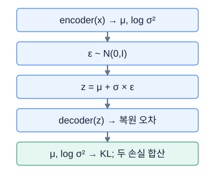

**그림 25-1. VAE는 점이 아니라 분포를 만든다**

μ와 σ는 입력에 따른 분포의 매개변수다. 잡음을 별도로 샘플링해 gradient가 매개변수로 흐르도록 하는 것이 재매개변수화의 핵심이다.

그림의 값·구조: encoder(x) → μ, log σ² → ε ~ N(0,I) → z = μ + σ × ε → decoder(z) → 복원 오차 → μ, log σ² → KL; 두 손실 합산

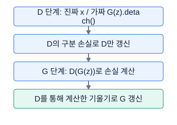

**그림 25-2. GAN: 두 학습 단계의 대상을 구분**

D는 discriminator, G는 generator다. G단계의 G(z)까지 detach하면 generator로 gradient가 흐르지 않는다. 번갈아 학습하는 두 목적을 분리한다.

그림의 값·구조: D단계는진짜와가짜를구분하도록D갱신, G단계는D를통한gradient로G갱신. 가짜샘플detach는D단계용.

### 숫자로 끝까지 따라가기

잠재 한 차원에서 `μ=1`, `v=log(4)`라면 분산은 4, 표준편차는 2다. 잡음 `ε=-0.5`를 한 번 뽑으면 `z=1+2×(-0.5)=0`이다. 디코더를 설명용으로 `g(z)=2z+1`이라고 정하면 복원은 1이다. 원본이 2이므로 제곱 복원 오차는 1이다. KL은 `0.5×(1+4-1-log4)=약1.307`이다. `β=0.1`로 둔 연습 손실은 `1+0.1×1.307=약1.131`이다.

GAN의 한 쌍 예도 계산해 보자. D가 진짜에 0.8, 가짜에 0.2를 내면 D의 두 항을 더한 손실은 `-log0.8-log(1-0.2)=약0.446`이다. 평균을 내는 정의라면 0.223이다. 같은 가짜에 대한 비포화 G 손실은 `-log0.2=약1.609`다. G가 개선되어 D의 가짜 평가가 0.7이 되면 G 손실은 `-log0.7=약0.357`로 낮아진다. 실제로는 D도 계속 바뀌므로 이 감소만으로 생성 품질을 확정할 수 없다.

```python
import torch
from torch import nn

torch.manual_seed(7)
mu = torch.tensor([1.], requires_grad=True)
logvar = torch.log(torch.tensor([4.])).requires_grad_()
eps = torch.tensor([-.5])
z = mu + torch.exp(.5 * logvar) * eps
recon = 2 * z + 1
kl = .5 * (mu.square() + logvar.exp() - 1 - logvar).sum()
loss = (recon - 2).square().sum() + .1 * kl
loss.backward()
assert mu.grad is not None and logvar.grad is not None
print(round(z.item(), 3), round(kl.item(), 3))

G, D = nn.Linear(2, 2), nn.Linear(2, 1)
opt_g = torch.optim.SGD(G.parameters(), lr=.01)
opt_d = torch.optim.SGD(D.parameters(), lr=.01)
criterion = nn.BCEWithLogitsLoss()
real, noise = torch.ones(3, 2), torch.randn(3, 2)
opt_d.zero_grad()
ld = criterion(D(real), torch.ones(3, 1))
ld = ld + criterion(D(G(noise).detach()), torch.zeros(3, 1))
ld.backward()
opt_d.step()
for p in D.parameters():
    p.requires_grad_(False)
opt_g.zero_grad()
lg = criterion(D(G(noise)), torch.ones(3, 1))
lg.backward()
opt_g.step()
for p in D.parameters():
    p.requires_grad_(True)
assert torch.isfinite(lg)
```

이 코드는 학습 경로를 점검하는 독립적인 한 번의 갱신 예이며, 고품질 생성기를 훈련한 예는 아니다. D의 이전 출력을 재사용하지 않고, D 갱신 후 G 단계의 출력을 다시 계산한다는 점에도 주목하자.

### 시험 문제로 연결하기

필기에서는 AE의 단일 표현, VAE의 분포와 재매개화, GAN의 두 모델을 연결해 비교한다. Process에서는 `logvar`를 표준편차로 잘못 사용하거나 `exp(logvar)`를 그대로 표준편차로 쓰는 실수를 잡는다. 분산이 4면 표준편차는 2라는 작은 확인이 긴 수식보다 확실하다. 딥러닝 구현은 PyTorch로 연습한다.

### 자주 헷갈리는 지점

KL을 무조건 크게 줄이면 좋은 것은 아니다. KL의 상대 비중이 지나치면 디코더가 잠재 정보를 충분히 쓰지 않을 수 있다. 복원항을 모든 픽셀의 합으로 계산하다가 평균으로 바꾸면 KL의 상대 영향도 달라진다. GAN에서 여러 잡음이 비슷한 결과만 만드는 mode collapse도 주의한다. D가 속았다는 한 숫자만으로 생성 결과의 다양성을 평가할 수 없다.

### 스스로 확인하기

1. `μ=0`, `logvar=0`이면 표준편차와 KL은 얼마인가? 표본 `z`도 항상 0인가?
2. G 단계에서 `D(G(z)).detach()`를 손실에 넣으면 무엇이 끊기는가?
3. 위 숫자에서 복원 오차 1은 그대로 두고 `β`를 0.1에서 1로 바꾸면 손실은 얼마인가?

### 정답과 이유

1. 표준편차는 `exp(0)=1`, KL은 `0.5×(0+1-1-0)=0`이다. 표본은 `z=ε`이므로 일반적으로 0이 아니다. 분포의 평균과 한 번 뽑은 표본을 구분해야 한다.
2. 손실에서 생성기까지의 미분 경로가 끊겨 G가 이 손실로 학습할 수 없다. D의 parameter를 고정하면서 입력 방향 미분은 유지해야 한다. D 단계의 가짜 입력 detach와 G 단계의 판별 출력 detach는 효과가 다르다.
3. 약 `1+1.307=2.307`이다. 같은 복원과 잠재 분포인데 목적함수의 가중치만 바뀐 것이다. 서로 다른 β 실험의 총손실 숫자를 그대로 비교해서 어떤 모델의 복원이 좋은지 결론내릴 수 없다.

### 더 읽을 공식 자료

재매개화와 변분 목적은 원 논문 [Auto-Encoding Variational Bayes](https://arxiv.org/abs/1312.6114), 생성기와 판별기의 게임은 원 논문 [Generative Adversarial Networks](https://arxiv.org/abs/1406.2661)에서 더 읽는다. 위 수치와 코드는 원 논문의 실험을 복제한 것이 아니라 학습 원리를 설명하는 독자 예제다.

## 26. Process형 완전 공략: 명세를 edge case까지 구현하기

### 먼저 떠올릴 장면

“두 수를 받아 큰 수를 돌려주세요”라는 부탁은 짧아도 질문이 남는다. 같은 수이면 무엇을 돌려줄까? 입력이 빈 배열이면 어떻게 할까? 원본을 바꿔도 될까? Process형 구현은 알고리즘 이름을 아는 것과 이런 약속을 정확히 지키는 능력을 함께 요구한다. 공개 예시 한 개가 맞는 것은 출발점일 뿐이다. 예시에 드러나지 않은 경계에서 문제의 문장을 일관되게 구현해야 한다.

이번 독자 연습은 행별 최솟값과 최댓값으로 정규화하는 함수, 그리고 정확히 지정된 CNN을 만든다. 실제 문항과의 일치나 출제 예측을 주장하지 않는다. 여기서 정한 빈 입력·상수 행 정책은 연습의 명세다. 실제 문제에 다른 정책이 있으면 그것을 따른다. 좋은 일반 라이브러리를 만드는 과제와 주어진 계약의 함수를 만드는 과제는 같지 않다.

### 낯선 말부터 풀기

계약은 입력과 출력에 대해 지켜야 할 약속이다. `B`는 행 또는 배치의 샘플 수, `F`는 특성 수다. shape `[B,F]`는 행별로 F개 값을 담는다. dtype은 float32처럼 숫자의 저장 종류이고, mutation은 함수가 받은 원본을 제자리에서 변경하는 것이다. edge case는 흔한 중간값이 아닌 최소 크기·같은 값·특이한 축처럼 구현의 경계를 시험하는 입력이다.

테스트에는 구체적인 정답 비교와 불변조건 점검이 있다. 정답 비교는 `[2,4,6]→[0,0.5,1]`처럼 수를 확인한다. 불변조건은 “출력 shape가 입력과 같다”, “원본이 유지된다”처럼 모든 허용 입력에서 지킬 성질이다. 에러를 많이 발생시키는 코드가 더 정확한 것은 아니다. 문제에서 허용한 입력을 독단적으로 거절하면 그것도 계약 위반이다.

### 그림을 읽는 순서

먼저 축·색·연결 방향을 읽고, 각 그림 아래의 설명으로 확인하세요. 손계산은 다른 작은 숫자를 쓰는 독립 연습일 수 있습니다.

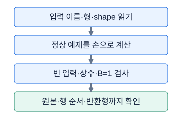

**그림 26-1. Process: 입력에서 반환까지 약속을 추적**

정답은 가장 복잡한 구현이 아니라 명세를 만족하는 구현이다. 원본을 보존하라고 했는데 입력 자체를 바꾸면 수치 결과가 같아도 계약을 어긴다.

그림의 값·구조: 입력 이름·형·shape 읽기 → 정상 예제를 손으로 계산 → 빈 입력·상수·B=1 검사 → 원본·행 순서·반환형까지 확인

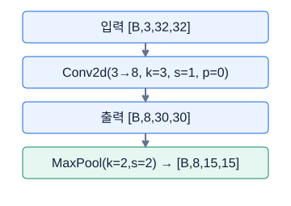

**그림 26-2. CNN 명세의 공간 크기를 계산하기**

한 축의 공식 floor((입력+2P−D(K−1)−1)/S+1)을 가로·세로에 각각 적용한다. 이 예는 dilation1이다. 채널 수8은 공간 길이 계산과 독립적이다.

그림의 값·구조: 입력32, kernel3,stride1,padding0이면30. kernel2stride2pool이면15. batch와channels는별도.

### 숫자로 끝까지 따라가기

행 정규화 계약을 정하자. 입력은 유한 실수의 2차원 배열, 특성 수는 1 이상, 반환은 float64의 같은 shape, 상수 행은 0, 원본은 보존한다. 샘플이 없는 `[0,F]`도 허용한다. 수식은 `u_ij=(x_ij-min_i)/(max_i-min_i)`이며 `i`는 행, `j`는 열이다. `[2,4,6]`은 최소 2·최대 6·범위 4이므로 `[0,2/4,4/4]=[0,0.5,1]`이다. `[5,5,5]`는 0으로 나누지 않고 계약에 따라 `[0,0,0]`을 반환한다.

CNN은 Conv에서 공간 크기 8×10을 유지하고, Pool에서 4×5가 된다. 채널은 Conv가 만든 4개이므로 flatten 크기는 `4×4×5=80`이다. Conv parameter는 `4×3×3×3+4=112`, Linear는 `80×2+2=162`, 전체 학습 parameter는 274다. ReLU와 Pool에는 학습 parameter가 없다. 출력 크기가 2라고 모든 층의 parameter가 2개인 것은 아니다.

```python
import numpy as np
import torch
from torch import nn

def row_minmax(x):
    a = np.asarray(x, dtype=np.float64)
    if a.ndim != 2 or a.shape[1] == 0:
        raise ValueError("2D 입력과 최소 한 특성이 필요합니다")
    if not np.isfinite(a).all():
        raise ValueError("유한한 입력만 허용합니다")
    if a.shape[0] == 0:
        return a.copy()
    lo = a.min(axis=1, keepdims=True)
    width = a.max(axis=1, keepdims=True) - lo
    return np.divide(a - lo, width,
                     out=np.zeros_like(a), where=width != 0)

x = np.array([[2, 4, 6], [5, 5, 5]])
before = x.copy()
assert np.allclose(row_minmax(x), [[0, .5, 1], [0, 0, 0]])
assert np.array_equal(x, before)
assert row_minmax(np.empty((0, 3))).shape == (0, 3)
assert np.array_equal(row_minmax([[8]]), [[0]])

net = nn.Sequential(nn.Conv2d(3, 4, 3, padding=1),
                    nn.ReLU(), nn.MaxPool2d(2),
                    nn.Flatten(1), nn.Linear(80, 2))
assert net(torch.zeros(1, 3, 8, 10)).shape == (1, 2)
assert net(torch.zeros(3, 3, 8, 10)).shape == (3, 2)
assert sum(p.numel() for p in net.parameters()) == 274
print("함수 계약과 모델 구조 확인 완료")
```

단순히 분모에 아주 작은 수를 더하는 구현도 흔하다. 그러나 이 연습에서는 비상수 행의 정확한 범위를 불필요하게 바꾸지 않도록 0인 분모만 따로 처리했다. 모든 상수 행이 0이라는 정책이 정확히 들어갔는지 손계산과 assertion으로 확인한다.

### 시험 문제로 연결하기

문제를 읽고 먼저 함수 이름, 입력 shape, 반환 shape, 원본 보존, 예외 정책을 적는다. 수치 문제라면 계산 축과 평균의 분모까지 표시한다. DataFrame 문제라면 index와 열 순서가 출력 계약에 포함되는지 확인한다. 이미지 문제라면 RGB 변환을 요구하는지, 기존 채널을 보존하는지 확인한다. 구현 길이가 짧더라도 이런 구분이 빠지면 결과가 달라진다.

정확한 네트워크가 요구되면 레이어 이름·순서·bias·stride·padding을 구조표와 대조한다. 성능을 개선하려는 추가 층은 다른 과제에서 할 일이다. 모의 연습에서는 한 함수가 통과할 때마다 일반 입력 하나와 경계 입력 둘을 남겨, 다음 변경이 기존 동작을 깨뜨리는지 확인한다.

### 자주 헷갈리는 지점

`axis=0`과 `axis=1`은 다른 함수다. 여기서 열별 최소·최대를 쓰면 각 행을 정규화하라는 요구가 바뀐다. `keepdims=True`는 행별 통계를 `[B,1]`로 남겨 올바른 broadcasting을 돕는다. 함수 밖에서 만든 배열을 바꿔 버리면 뒤의 셀에서 원본이라고 믿고 쓰는 데이터도 달라진다.

배치 1 테스트가 특히 유용하다. 무인자 `squeeze()`는 크기 1인 모든 축을 없애서 `[1,2]`를 `[2]`로 바꿀 수 있다. 반대로 모델에 입력 높이·너비가 고정이라고 적혀 있다면 임의 크기를 지원하도록 바꾸는 작업이 필수는 아니다. 경계 테스트는 요구된 범위의 끝을 확인하는 것이지 범위를 무한히 넓히는 일이 아니다.

### 스스로 확인하기

1. 행 `[-3,1,5]`와 `[7]`의 반환값은 각각 무엇인가?
2. 위 CNN의 입력 너비만 12가 되면 Pool 뒤 shape와 flatten 크기는 무엇이며 기존 Linear에 연결할 수 있는가?
3. 공개 예시가 맞는데 원본 보존 테스트가 실패했다. 결과 배열의 수가 맞으면 제출해도 되는가?

### 정답과 이유

1. 첫 행의 범위는 8이므로 `[0,4/8,8/8]=[0,0.5,1]`이다. `[7]`은 한 원소 상수 행이므로 `[0]`이다. 단일 특성을 특별히 오류로 처리하면 이번 계약의 허용 입력을 거절하게 된다.
2. Pool 뒤 `[B,4,4,6]`, flatten 크기 96이다. `Linear(80,2)`와 곱셈 안쪽 차원이 달라 연결할 수 없다. 다만 원 명세가 8×10만 허용한다면 8×12 지원 실패 자체가 오답은 아니다.
3. 안 된다. 원본 보존도 출력 숫자만큼 명시적인 약속이다. 입력 복사 후 계산하거나 비제자리 연산을 사용하고, 호출 전후 원본 비교를 다시 통과시켜야 한다.

### 더 읽을 공식 자료

축별 작은 배열이 어디로 반복 적용되는지는 [NumPy broadcasting](https://numpy.org/doc/stable/user/basics.broadcasting.html), 합성곱의 shape와 parameter 설정은 [PyTorch Conv2d](https://docs.pytorch.org/docs/stable/generated/torch.nn.Conv2d.html)에서 확인한다. 함수의 허용 입력·예외 정책은 라이브러리 취향보다 해당 문항 명세가 우선한다.

## 27. Problem형 공통 파이프라인과 표형 문제

### 먼저 떠올릴 장면

표를 받아서 모델을 학습했는데 예측 파일에 어느 차량의 결과인지 알 수 없다면 문제를 다 푼 것일까? Problem형 과제의 결과는 손실곡선 하나가 아니라 처음 입력한 행과 마지막 예측값이 정확히 이어지는 전체 과정이다. 입력 열 선택, 훈련과 검증 분리, 모델 선택, 단위 복원, 파일 저장 중 하나라도 끊기면 좋은 모델도 제대로 평가할 수 없다.

이번에는 차량 속도로 연료 소비량을 예측하는 독자 축소 문제를 풀자. 표의 한 행은 서로 독립적으로 모은 차량 관측 한 개라고 가정한다. 같은 차량의 반복 기록이나 시간 순서가 중요한 자료라면 이 가정부터 바꿔 group/time split으로 돌아가야 한다. 입력 `X`와 정답 `y`를 구분하는 일은 파일에서 열 몇 개를 지우는 작업이 아니라, 실제 예측 시점에 알고 있는 것과 알고 싶은 것을 나누는 일이다.

### 낯선 말부터 풀기

파이프라인은 원자료가 최종 예측으로 이어지는 처리 순서다. baseline은 이후 모델과 비교할 가장 단순한 기준이며 무조건 정답 평균만을 뜻하지는 않는다. validation은 모델 선택을 위해 따로 남긴 자료다. checkpoint는 특정 시점의 모델 상태를 보관한 것이다. `N`은 전체 샘플 수, `F`는 입력 특성 수, `D`는 예측해야 할 연속 출력 수다. 이 강의는 `F=1,D=1`인 회귀 예제를 사용한다.

전처리의 `fit`은 평균이나 범주 사전처럼 자료에서 규칙을 배우는 일이고 `transform`은 이미 배운 규칙을 적용하는 일이다. 검증에도 같은 전처리를 적용하지만 검증으로 규칙을 다시 배우지 않는다. 모델이 예측하는 원점수가 logit인지, 확률인지, 연속 물리량인지도 구별한다. 회귀는 대개 끝의 선형층 값을 바로 사용하고, 이진분류는 logit을 sigmoid로 확률에 바꾸며, 다중분류는 클래스 순서가 고정된 여러 logit을 다룬다.

### 그림을 읽는 순서

먼저 축·색·연결 방향을 읽고, 각 그림 아래의 설명으로 확인하세요. 손계산은 다른 작은 숫자를 쓰는 독립 연습일 수 있습니다.

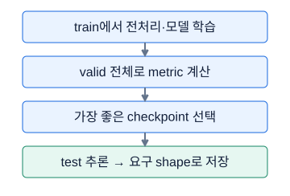

**그림 27-1. 학습·모델 선택·제출은 세 단계**

loss는 미분에 사용하고 metric은 문제의 성능 기준이다. validation의 batch metric을 단순 평균하면 전체 metric과 달라질 수 있다.

그림의 값·구조: train에서 전처리·모델 학습 → valid 전체로 metric 계산 → 가장 좋은 checkpoint 선택 → test 추론 → 요구 shape로 저장

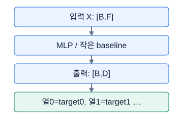

**그림 27-2. 출력 열은 정답의 의미와 대응해야 한다**

D는 이 그림에서 연속값 정답의 개수다. 다중분류의 클래스 수와 별개다. 값이 맞아도 출력 열 순서를 바꾸면 다른 정답에 제출한 셈이다.

그림의 값·구조: 표형입력B×F를모델에넣어단일회귀B×1또는다중회귀B×D를반환한다.

### 숫자로 끝까지 따라가기

훈련 속도가 `[10,20,30,40]`, 연료 정답이 `[3,5,7,9]`라고 하자. 검증 속도는 `[50,60]`, 정답은 `[11,13]`이다. 훈련 정답 평균 6을 항상 출력하는 baseline의 검증 MSE는 `((11-6)²+(13-6)²)/2=(25+49)/2=37`, RMSE는 `√37≈6.083`이다. 훈련 평균은 검증의 정답 11·13을 보지 않고 구했다.

직선 관계를 학습한 후보가 `y_hat=0.2×speed+1`을 얻었다면 검증 예측은 `[11,13]`, MSE는 0이다. 잡음 없는 작은 예제를 일부러 만든 결과이지 실제 자료의 기대 성능은 아니다. 다음 테스트 행의 ID가 `["car-B","car-A"]`, 속도가 `[25,15]`라면 출력은 이 순서대로 `[[6],[4]]`다. ID를 알파벳순으로 바꿔 `[[4],[6]]`을 저장하면 수 자체는 타당해도 행 계약이 깨진다.

아래 코드는 NumPy만으로 같은 파이프라인을 처음부터 실행한다. 결측 대체와 전처리까지 필요한 실제 표형 문제로 가기 전에 데이터 경계를 먼저 익히는 축소판이다.

```python
import io
import numpy as np

x_tr = np.array([[10.], [20.], [30.], [40.]])
y_tr = np.array([[3.], [5.], [7.], [9.]])
x_va = np.array([[50.], [60.]])
y_va = np.array([[11.], [13.]])
x_te = np.array([[25.], [15.]])  # ID 순서: car-B, car-A
mu, sd = x_tr.mean(0), x_tr.std(0)

def design(x):
    scaled = (x - mu) / sd
    return np.column_stack([scaled, np.ones(len(x))])

w, *_ = np.linalg.lstsq(design(x_tr), y_tr, rcond=None)
baseline_mse = np.mean((y_va - y_tr.mean(0)) ** 2)
valid_pred = design(x_va) @ w
valid_mse = np.mean((valid_pred - y_va) ** 2)
best = w.copy() if valid_mse < baseline_mse else None
pred = design(x_te) @ best if best is not None else np.repeat(
    y_tr.mean(0, keepdims=True), len(x_te), axis=0)
assert pred.shape == (2, 1) and np.isfinite(pred).all()
assert np.allclose(pred, [[6.], [4.]])
buffer = io.BytesIO()  # 디스크를 바꾸지 않는 저장 연습
np.save(buffer, pred, allow_pickle=False)
buffer.seek(0)
loaded = np.load(buffer, allow_pickle=False)
assert np.array_equal(loaded, pred)
print(round(baseline_mse, 3), valid_mse, loaded.tolist())
```

### 시험 문제로 연결하기

처음에는 “무슨 모델을 쓸까”보다 task·metric·split·출력 계약을 한 문장씩 적는다. 회귀 다중출력은 예측과 정답 모두 `[B,D]` float, 일반 클래스 인덱스 방식의 다중분류는 예측 `[B,K]` logit과 정답 `[B]` long이다. 여기서 `K`는 클래스 수다. 이진분류와 multilabel은 같은 BCE 계열을 써도 한 샘플에 참인 클래스 개수가 다르다.

PyTorch에서는 `model.train()`으로 훈련하고 `zero_grad→forward→loss→backward→step` 순서로 갱신한다. 검증에는 `model.eval()`과 `torch.inference_mode()`를 함께 사용한다. 최저 검증 손실을 기록할 때 `copy.deepcopy(model.state_dict())`처럼 실제 복사본을 보관한다. 설정을 바꾸어도 비교용 split은 고정한다. 전체 재학습은 검증에서 선택한 epoch·구조·전처리 정책을 확정한 뒤 진행하며 테스트 정답을 이용한 선택은 하지 않는다.

### 자주 헷갈리는 지점

“train과 test에 같은 코드를 썼다”가 같은 전처리라는 뜻은 아니다. 각각 평균을 새로 계산하면 기준 좌표가 달라진다. 훈련에서 정한 열 순서도 고정해야 한다. `speed,weight`로 학습한 배열에 `weight,speed`를 넣어도 shape 검사는 통과할 수 있다.

검증점수만 조금 좋아지고 학습 시간이 크게 늘었다면 제한 시간에 유효 파일까지 도달할 수 있는지도 판단한다. 먼저 저장한 baseline을 지우지 않고 후보를 비교하면 코드 오류가 생겨도 돌아갈 기준이 남는다. 단, 메모리 속 가중치 보관과 예측 파일 생성, 노트북 저장, 실제 시험의 제출 완료는 별개다. 여기의 BytesIO 연습은 형식을 확인할 뿐 시험 제출 동작을 대신하지 않는다.

### 스스로 확인하기

1. 훈련 정답이 `[2,4,6]`, 검증 정답이 `[5,9]`일 때 훈련 평균 baseline의 MSE는?
2. 두 테스트 ID의 순서를 바꾸어 예측한 뒤 원래대로 복원하지 않으면 shape 검사가 잡아주는가?
3. epoch별 검증 MSE가 `[8,5,6]`인데 마지막 모델로 예측했다. 어떤 상태를 사용해야 하며 왜인가?

### 정답과 이유

1. 훈련 평균은 4, 검증 오차제곱은 1과 25이므로 MSE는 13이다. 검증까지 합친 평균 5.2를 baseline에 사용하면 평가용 정답을 학습 규칙에 넣은 셈이다.
2. 잡지 못한다. `[2,1]`이라는 모양은 동일하다. 원본 ID 순서를 함께 추적하거나 명세의 순서대로 예측하는 로더를 사용해야 한다. shape와 의미적 대응을 따로 검사한다.
3. 가장 낮은 5를 얻은 두 번째 epoch의 복사된 상태를 불러온다. 세 번째의 train 손실이 더 낮더라도 검증 선택 기준은 다르다. 여러 epoch를 반복 비교한 validation 역시 완전히 독립된 최종 성능 보증은 아니라는 점을 기억한다.

### 더 읽을 공식 자료

전처리 학습 경계는 [scikit-learn의 데이터 누수 설명](https://scikit-learn.org/stable/common_pitfalls.html#data-leakage), 모델 상태의 복사·복원은 [PyTorch Saving and Loading Models](https://docs.pytorch.org/tutorials/beginner/saving_loading_models.html)에서 확인한다.

## 28. 시계열 Problem 완주

### 먼저 떠올릴 장면

차량 센서를 한 줄씩 읽는 동안 0초·1초·2초의 기록을 가지고 4초 값을 예측한다고 하자. 이때 모델의 입력은 숫자 표 하나가 아니라 “과거 세 장면을 묶은 한 샘플”이다. 마지막 관측 2초와 예측 대상 4초 사이의 거리를 먼저 정해야 한다. 코드가 잘 실행되어도 정답을 3초에서 가져왔다면 다른 문제를 풀고 있는 것이다.

시계열 Problem은 모델 종류보다 시간표를 맞추는 일이 먼저다. 관측 빈도, 과거 길이, 미래 간격, 차량이나 주행 경계, 제공된 테스트가 이미 window인지 원시 시계열인지 차례로 확인한다. 이번 강의는 작게 줄인 한 개 연속 시계열로 손계산하고, 대규모 자료에서는 같은 인덱스 규칙을 lazy Dataset으로 옮기는 방법을 연결한다.

### 낯선 말부터 풀기

원시 길이 `T`는 센서가 기록된 시점 수다. lookback `L`은 한 입력에 들어가는 과거 관측 수, horizon `H`는 마지막 관측에서 정답 시점까지의 샘플 간격이다. 끝 인덱스를 `e`라 하면 입력은 `X[e-L+1:e+1]`, 정답은 `y[e+H]`다. Python slice의 오른쪽 끝은 포함하지 않으므로 `e+1`로 써야 `e`가 포함된다. 이 강의에서 H는 이미지 높이가 아니라 예측 간격이다.

특성 수 `F`, 출력 수 `D`, window 수 `N`이면 입력 묶음은 `[N,L,F]`, 정답은 `[N,D]`다. 100Hz는 1초에 100개 관측이므로 0.2초는 20개다. “2초 뒤”는 행 두 개 뒤가 아니라 샘플링 주기에 따라 바뀐다. 불규칙 시계열은 고정 Hz 계산을 그대로 쓰지 말고 실제 timestamp를 확인해야 한다.

### 그림을 읽는 순서

먼저 축·색·연결 방향을 읽고, 각 그림 아래의 설명으로 확인하세요. 손계산은 다른 작은 숫자를 쓰는 독립 연습일 수 있습니다.


**그림 28-1. 시계열 Problem: 입력과 정답을 함께 만든다**

여기서는 D가 한 변수의 미래 두 시점이다. 다른 문제에서는 같은 시점의 서로 다른 정답 변수 둘일 수 있다. shape만 보고 정답 의미를 추정하지 않는다.

그림의 값·구조: lookback3,target폭2의예. 시간1,2,3을보고4,5예측. 다음은2,3,4를보고5,6예측.


**그림 28-2. 시계열의 비교 기준은 먼저 단순하게**

현재 값 유지가 언제나 좋은 모델이라는 뜻은 아니다. 복잡한 모델의 개선이 실제로 의미 있는지 같은 조건에서 비교할 출발점이다.

그림의 값·구조: 현재 값 유지 baseline 계산 → 동일 split·동일 target·동일 metric → CNN1d 또는 GRU 결과 비교 → 시간 여유와 valid 근거로 개선

### 숫자로 끝까지 따라가기

`T=10,L=3,H=2,F=1`로 두고 원시 값은 `[0,1,2,3,4,5,6,7,8,9]`다. 가능한 끝 인덱스는 `e=2,3,4,5,6,7`이다. 첫 입력 `[0,1,2]`의 target은 `y[4]`, 마지막 입력 `[5,6,7]`의 target은 `y[9]`다. window 수는 `T-L-H+1=10-3-2+1=6`이다. 값을 두 출력으로 `y[t]=[t,2t]`라고 정의하면 첫 target은 `[4,8]`이다.

훈련 target을 6 미만으로 정하면 target 4·5를 사용한다. 첫 검증 예측 원점을 6으로 두면 target 8·9가 검증이다. 중간 target 6·7은 이번 보수적 고정모델 검증에서는 빼 둔다. 그러면 모든 훈련 정답이 첫 검증 원점 6보다 앞선다. 이 제외 폭은 모든 시계열의 보편 규칙이 아니라 현재의 “모델을 원점 6 전에 완성”한다는 검증 계약에서 나온다.

첫 출력은 입력과 같은 물리량이므로 마지막 값 baseline은 target `[8,16]`에 `[6,12]`를 예측한다. 출력별 오차제곱은 `[4,16]`, 두 출력 평균은 10이다. 다음 샘플도 오차가 같아서 전체 MSE는 10이다. 출력별 RMSE를 평균하면 `(2+4)/2=3`이고, 전체 원소 RMSE는 `√10≈3.162`다. 둘은 다르므로 metric의 정의를 읽어야 한다.

```python
import numpy as np

t = np.arange(10)
x = t[:, None].astype(np.float32)
y = np.column_stack([t, 2*t]).astype(np.float32)
L, H = 3, 2
ends = np.arange(L - 1, len(x) - H)
target_idx = ends + H
windows = np.stack([x[e-L+1:e+1] for e in ends])
targets = y[target_idx]
train = target_idx < 6
valid = ends >= 6
assert windows.shape == (6, 3, 1)
assert targets.shape == (6, 2)
assert target_idx[train].max() < ends[valid].min()
last = windows[valid, -1, 0]
pred = np.column_stack([last, 2*last])
mse = ((pred - targets[valid]) ** 2).mean()
assert np.isclose(mse, 10.)
assert windows[0, :, 0].tolist() == [0., 1., 2.]
print(ends.tolist(), target_idx.tolist(), pred.tolist(), mse)
```

### 시험 문제로 연결하기

처음에는 작은 `arange`를 넣어 입력 시작·끝과 target을 출력한다. 그 뒤 train-only scaling, 단순 baseline, CNN1D 순으로 확장한다. `[B,L,F]`를 `Conv1d`에 넣으려면 `permute(0,2,1)`로 `[B,F,L]`을 만든다. GRU의 `batch_first=True`는 `[B,L,F]`를 받으므로 이 변환을 복사해 넣지 않는다.

대규모 window를 전부 복사하면 메모리가 커진다. 예를 들어 `N=100000,L=30,F=12`인 float32 입력만 `100000×30×12×4=144000000`바이트, 십진 144MB다. 원본·target·모델·역전파 메모리는 별도다. lazy Dataset은 원본과 끝 인덱스를 보관하고 요청된 샘플의 slice만 가져온다. 테스트가 이미 window라면 임의로 다시 window를 만들지 않는다.

### 자주 헷갈리는 지점

전체 window를 무작위로 섞어서 나누면 바로 옆 window가 대부분 같은 관측을 공유할 수 있다. 검증 성능이 실제 미래 예측보다 쉽게 나온다. split은 제출 상황의 새것이 미래인지 새 차량인지에 맞춘다. 스케일러에 validation target을 포함하면 미래 정답의 분포를 이용한 것이다.

last-value baseline은 target과 input 채널의 의미가 같을 때만 타당하다. 센서 0번이 온도인데 target이 진동이면 단순히 첫 채널을 꺼내 쓸 근거가 없다. 그리고 최종 prediction 행의 순서는 테스트 묶음의 원래 순서다. 학습 DataLoader의 shuffle 설정을 테스트에 그대로 옮기면 저장 형식이 맞아도 대상 대응이 깨질 수 있다.

### 스스로 확인하기

1. 50Hz에서 lookback 0.4초, horizon 1초는 L·H 각각 얼마인가?
2. `T=12,L=4,H=3`일 때 window 수와 첫·마지막 target 인덱스는?
3. `[100,20,12]` 입력을 flatten MLP와 CNN1D에 각각 어떤 shape로 연결하는가?

### 정답과 이유

1. L은 20, H는 50이다. 초에 초당 관측 수를 곱한다. 마지막 입력에서 50개 샘플 간격 뒤가 target이라는 정의를 함께 적어야 한다.
2. `12-4-3+1=6`개다. 첫 끝 인덱스는 3이므로 target 6, 마지막 끝 인덱스는 8이므로 target 11이다. target 12는 배열 범위 밖이다.
3. MLP는 `[100,240]`, CNN1D는 `[100,12,20]`이다. flatten은 샘플 안의 원소를 펼치고 permute는 시간·특성 축을 교환한다. CNN shape를 `reshape`로 흉내 내면 값의 이웃 관계가 달라진다.

### 더 읽을 공식 자료

시간을 길이 축으로 받는 규칙은 [PyTorch Conv1d](https://docs.pytorch.org/docs/2.7/generated/torch.nn.Conv1d.html), 시간순 검증의 기본 동작은 [scikit-learn TimeSeriesSplit](https://scikit-learn.org/stable/modules/generated/sklearn.model_selection.TimeSeriesSplit.html)에서 확인한다. 이미 만든 window의 horizon·정답 공개 시점에 필요한 분리 조건은 문제 계약에서 별도로 계산한다.

## 29. 이미지·이상탐지 Problem 분기

### 먼저 떠올릴 장면

작은 검사 이미지 세 장을 받았다고 하자. 세로선·가로선·대각선이라는 정답이 있으면 세 모양을 분류할 수 있다. 세로선 정상 이미지만 주어졌다면 같은 문제를 세 클래스 분류로 풀 수는 없다. 정상의 복원을 배우고 낯선 이미지의 오차를 살피는 AE가 후보가 된다. 첫 판단은 파일 확장자가 아니라 “무슨 정답이 있고 무엇을 제출하라고 하는가”에서 시작한다.

이미지는 숫자 배열이면서 동시에 위치 관계를 가진 자료다. 색상 채널 순서와 가로·세로 축이 틀려도 어떤 배열은 연산을 통과한다. 그래서 모델을 돌리기 전에 한 이미지의 값과 shape를 읽고, 경로·라벨·출력 행의 대응을 확인한다. 이번 강의의 작은 패턴은 외부 다운로드 없이 학습 계약을 이해하기 위한 독자 자료다.

### 낯선 말부터 풀기

`H`는 높이, `W`는 너비, `C`는 색상 채널 수다. RGB는 빨강·초록·파랑 세 채널이므로 C=3이다. 흔한 NumPy 이미지 배열은 `[H,W,C]`, PyTorch CNN의 배치 입력은 `[B,C,H,W]`다. layout은 이 축 순서를 말한다. pixel 값이 uint8의 0–255라면 float32로 바꾸고 255로 나누어 0–1로 만들 수 있다. 이미 0–1 float인 자료를 또 255로 나누면 의미가 달라진다.

분류 head는 `K`개 클래스 logit을 내고, 회귀 head는 `D`개 연속값을 낸다. AE는 입력과 같은 shape를 복원하고 그 차이에서 샘플별 점수를 만든다. augmentation은 정답의 의미를 보존하는 입력 변형이다. 세로·가로 방향 자체가 정답인 이 연습에서 90도 회전은 라벨을 그대로 유지하는 증강이 아니다. “이미지에는 회전이 좋다”는 규칙을 무조건 적용하지 않는다.

### 그림을 읽는 순서

먼저 축·색·연결 방향을 읽고, 각 그림 아래의 설명으로 확인하세요. 손계산은 다른 작은 숫자를 쓰는 독립 연습일 수 있습니다.


**그림 29-1. 같은 이미지, 다른 축 순서**

PIL의 size는 W,H다. 축 변환만으로 색 순서나 값 범위가 바뀌지는 않는다. 이미0–1인 값을 다시255로 나누지 않는다.

그림의 값·구조: PIL RGB이미지배열HWC=64,64,3, TensorCHW=3,64,64, batchBCHW=8,3,64,64.


**그림 29-2. 분류와 이상탐지는 목적부터 다르다**

화살표는 두 가지 대안을 보여 준다. 이상 점수와 이진 label은 같은 산출물이 아니다. threshold나 점수 방향은 문제 계약에 맞추며 test 정답으로 고르지 않는다.

그림의 값·구조: 왼쪽은 label로 분류, 오른쪽은 정상 위주로 AE를 학습하는 대안이다. 두 방법을 반드시 연달아 실행한다는 뜻이 아니다.

### 숫자로 끝까지 따라가기

높이 2·너비 2인 RGB 이미지의 왼쪽 위 픽셀이 `[255,0,0]`이고 나머지는 0이라고 하자. 255로 나누면 왼쪽 위가 `[1,0,0]`이 된다. HWC→CHW 뒤 빨강 평면은 `[[1,0],[0,0]]`, 초록과 파랑 평면은 모두 0이다. 배치 한 장의 shape는 `[1,3,2,2]`이며 첫 번째 1을 없애면 안 된다.

세 클래스 logit이 `[0,log2,0]`이면 지수는 `[1,2,1]`, softmax는 `[0.25,0.5,0.25]`다. 정답 인덱스가 1이면 cross-entropy는 `-log0.5≈0.693`이고 argmax도 1이다. CE 학습에는 확률이 아닌 원 logit과 정수 정답을 넣는다. 확률 계산은 손으로 loss를 이해하거나 제출이 확률을 요구할 때 사용한다.

AE의 한 채널 2×2 원본이 `[[0,1],[0,1]]`, 복원이 `[[0,0.8],[0,0.8]]`이면 제곱오차 합은 `0+0.04+0+0.04=0.08`, 샘플 점수는 `0.08/4=0.02`다. 정상 검증에서 고정한 임계값이 0.05라면 정상이다. 배치 전체의 평균만 내면 어떤 이미지가 큰 오차였는지 알 수 없다.

```python
import numpy as np
import torch
from torch import nn

image = np.zeros((2, 2, 3), dtype=np.uint8)
image[0, 0] = [255, 0, 0]
x = torch.from_numpy(image.astype(np.float32) / 255.)
x = x.permute(2, 0, 1).unsqueeze(0)
assert x.shape == (1, 3, 2, 2)
assert x[0, 0, 0, 0].item() == 1.
logits = torch.tensor([[0., np.log(2.), 0.]], dtype=torch.float32)
target = torch.tensor([1], dtype=torch.long)
loss = nn.CrossEntropyLoss()(logits, target)
assert torch.allclose(logits.softmax(1), torch.tensor([[.25, .5, .25]]))
normal = torch.tensor([[[[0., 1.], [0., 1.]]]])
recon = torch.tensor([[[[0., .8], [0., .8]]]])
score = (normal - recon).square().flatten(1).mean(1)
assert score.shape == (1,) and torch.allclose(score, torch.tensor([.02]))
print(x.shape, round(loss.item(), 3), score.tolist())
```

### 시험 문제로 연결하기

Dataset의 한 행에서 이미지 경로와 그 행의 라벨을 함께 가져오면 대응을 보존하기 쉽다. 파일 경로만 따로 정렬하고 라벨을 원래 순서로 두지 않는다. 분류 라벨이 문자열이라면 train에서 만든 이름→인덱스 사전을 validation에도 그대로 사용한다. 테스트에 라벨이 없다는 이유로 임의 정답을 새로 만드는 것이 아니라 입력만 반환하는 추론 경로를 만든다.

이미지 크기를 맞춘 뒤 작은 CNN으로 출력 계약부터 통과시킨다. 전이학습은 사용 가능한 사전학습 가중치와 그 가중치가 기대하는 변환을 확인한 경우 선택한다. 매번 외부 파일 다운로드가 가능하다고 가정하지 않는다. AE는 정상 훈련자료로 학습하고 검증 점수에서 임계값을 정한 후 test에는 고정한다. 분류와 AE의 학습 코드를 길게 작성하기 전에 위의 한 배치 micro-test를 통과시킨다.

### 자주 헷갈리는 지점

RGBA는 채널이 4개다. 모델이 3채널을 요구한다면 명세에 맞게 RGB로 바꾸되, alpha 정보가 의미 있는 문제에서 무조건 버리지는 않는다. 흑백은 2차원 배열로 읽힐 수 있으므로 필요한 채널 축을 명시한다. 학습·검증에 입력 범위가 달라지는지도 검사한다.

검증에 무작위 crop을 매번 적용하면 모델이 같아도 평가 대상이 달라진다. 비교용 validation/test 변환은 보통 결정적으로 고정한다. 좌표 회귀에서는 이미지를 뒤집거나 crop하면 좌표 정답도 함께 변환해야 한다. 예측 좌표를 0–1 단위로 학습했다면 제출이 픽셀 단위인지 확인하고 높이·너비별로 역변환한다. anomaly score가 큰 쪽이 이상이라는 방향과 문제 라벨의 방향도 별도로 확인한다.

### 스스로 확인하기

1. RGB 한 장 `[12,20,3]`을 CNN에 넣기 위한 배치 shape는?
2. 두 클래스 확률 `[0.2,0.8]`에서 정답이 두 번째 클래스일 때 CE의 값은? 이것이 제출 라벨을 뜻하는가?
3. 위 2×2 AE 오차에서 이미지 너비가 같은 패턴 두 개로 늘면 평균 점수와 제곱오차 합은 각각 어떻게 바뀌는가?

### 정답과 이유

1. `[1,3,12,20]`이다. 12와 20을 바꾸면 높이와 너비가 뒤집힌다. HWC 배열에는 `permute(2,0,1)`을 적용하고 배치 축을 추가한다. 이미 BCHW이면 같은 변환을 다시 하지 않는다.
2. `-log0.8≈0.223`이다. 손실은 정답에 준 확률을 평가하는 숫자이지 라벨이 아니다. 라벨 제출이면 두 번째 클래스의 원 라벨을 반환하고, 확률 제출이면 요구된 클래스 순서의 확률을 반환한다.
3. 원소와 같은 오차가 두 배가 되므로 합은 0.16, 원소 수는 8, 평균은 여전히 0.02다. 점수 정의가 합인지 평균인지에 따라 이미지 크기의 영향이 달라진다. 서로 다른 크기의 점수를 비교할 때 이 차이를 확인해야 한다.

### 더 읽을 공식 자료

uint8 HWC 이미지의 변환 규칙은 [torchvision ToTensor](https://docs.pytorch.org/vision/stable/generated/torchvision.transforms.ToTensor.html), logit과 클래스 인덱스의 계약은 [PyTorch CrossEntropyLoss](https://docs.pytorch.org/docs/2.7/generated/torch.nn.CrossEntropyLoss.html)에서 확인한다. 코드의 직접 변환은 RGB uint8이라는 여기의 입력 계약에 맞춘 것이다.

## 30. 제출·디버깅·170분 운영

### 먼저 떠올릴 장면

학습이 끝나고 예측값도 화면에 보인다. 그런데 저장한 파일을 열어 보니 테스트 두 행의 예측이 한 긴 벡터로 펼쳐져 있다. 이 상태는 모델 문제일까, 제출 문제일까? 디버깅의 첫 질문은 “어디가 틀렸나”보다 “어느 단계의 계약이 처음 깨졌나”다. 입력, 모델 출력, metric, 저장 배열을 차례로 나누면 오류를 작게 만들 수 있다.

이 강의의 170분은 교재의 통합 모의 운영을 위한 틀이다. 세부 시간 배분은 학습용 제안이며 공식 배점이나 합격 기준이 아니다. 실제 회차의 시간·허용 도구·파일명·저장 셀·제출 절차는 최신 공식 안내와 현장 지시를 따른다. 아래 코드는 시험 시스템을 조작하지 않는 독립 연습이다. “파일을 만들었다”, “노트북을 저장했다”, “답안을 제출했다”는 세 가지 상태를 섞지 않는 것이 핵심이다.

### 낯선 말부터 풀기

shape 오류는 축의 개수나 크기 불일치다. dtype 오류는 정수·실수 종류 등의 불일치, device 오류는 CPU와 GPU처럼 계산 위치 불일치다. `NaN`은 정상적인 수로 표현되지 않는 결과, `Inf`는 무한대다. finite 검사는 둘 다 없는지를 확인한다. OOM은 필요한 메모리가 사용 가능량을 넘었다는 뜻이지 무조건 GPU 성능이 낮다는 뜻은 아니다.

진단 트리는 관측한 증상에 따라 다음 검사 하나를 정하는 절차다. 회귀의 예측과 정답은 같은 `[B,D]`로 맞춰야 한다. broadcasting은 연산을 허용해 주지만 올바른 샘플 짝을 보장하지 않는다. reload는 방금 저장한 파일을 다시 읽는 작업이다. 메모리의 배열이 아니라 파일 속 배열이 계약을 지켰는지 확인한다.

### 그림을 읽는 순서

먼저 축·색·연결 방향을 읽고, 각 그림 아래의 설명으로 확인하세요. 손계산은 다른 작은 숫자를 쓰는 독립 연습일 수 있습니다.


**그림 30-1. 오류를 값보다 먼저 구조로 좁힌다**

NaN loss라고 무조건 학습률부터 낮추지 않는다. 입력에 Inf가 있거나 손실의 정답 모양이 다르면 그 원인부터 해결해야 한다.

그림의 값·구조: 입력·출력·target shape 출력 → dtype: loss 계약 / device: 계산 위치 → NaN / Inf / 빈 batch 확인 → loss·metric·저장 계약 확인

![예측[4,1]과정답[4]는[4,4]모든조합으로비교된다. 대각선만이원래원한짝.](../figures/course/30-2.svg)

**그림 30-2. 회귀 broadcasting: 네 개가 열여섯 개로**

모든 칸이 계산되지만 원한 대응은 대각선 네 개다. MSE에 넣기 전에 둘 다[B,1] 또는 둘 다[B]로 맞춘다. class-index CE는 별도의 계약이다.

그림의 값·구조: 예측[4,1]과정답[4]는[4,4]모든조합으로비교된다. 대각선만이원래원한짝.

### 숫자로 끝까지 따라가기

예측 `p=[[1],[3]]`은 shape `[2,1]`, 정답 `y=[1,3]`은 `[2]`라고 하자. 의도한 오차는 두 샘플 각각 0이다. 그러나 `p-y`는 broadcasting으로 `[[0,-2],[2,0]]`, shape `[2,2]`가 된다. 제곱의 전체 평균은 `(0+4+4+0)/4=2`다. 예외가 안 나고 그럴듯한 손실이 출력되지만 다른 샘플끼리까지 비교한 것이다. 정답을 `y.reshape(-1,1)`로 바꾸면 오차는 `[[0],[0]]`, MSE는 0이다.

배치가 1이면 `[[2.]]`의 무인자 squeeze는 scalar가 된다. 출력 한 개짜리 회귀에서 샘플 축은 남겨야 하므로 계약에 맞게 `[1,1]`을 유지하거나 마지막 출력 축만 제거해 `[1]`로 만든다. 전체 reshape를 임의로 반복해서 예외만 없애지 않는다.

```python
import io
import numpy as np

p = np.array([[1.], [3.]])
y = np.array([1., 3.])
assert (p - y).shape == (2, 2)
assert np.mean((p - y) ** 2) == 2.
y = y.reshape(-1, 1)
assert p.shape == y.shape and np.mean((p - y) ** 2) == 0.

def check_prediction(pred, shape):
    a = np.asarray(pred)
    if a.shape != tuple(shape):
        raise ValueError(f"shape 오류: {a.shape}, 요구: {shape}")
    if not np.issubdtype(a.dtype, np.number):
        raise TypeError("숫자 배열이어야 합니다")
    if not np.isfinite(a).all():
        raise ValueError("NaN 또는 Inf가 있습니다")
    return a

pred = check_prediction(p, (2, 1)).astype(np.float32)
check_prediction(pred, (2, 1))  # 형 변환 뒤에도 검사
buffer = io.BytesIO()
np.save(buffer, pred, allow_pickle=False)
buffer.seek(0)
loaded = np.load(buffer, allow_pickle=False)
check_prediction(loaded, (2, 1))
assert loaded.dtype == pred.dtype and np.array_equal(loaded, pred)
print("reload 확인:", loaded.shape, loaded.dtype)
```

이 연습은 메모리 버퍼를 파일처럼 사용하므로 기존 파일을 덮어쓰지 않는다. 디스크 연습에서는 버퍼 대신 자신이 정한 연습 파일 경로를 쓴다. 실제 시험에서는 제공 저장 셀과 변수명을 먼저 확인하고 그 계약을 보존한다. dtype 변환 전 유한한 큰 수가 변환 후 Inf가 될 수 있으므로 변환 뒤 검사를 빼지 않는다.

### 시험 문제로 연결하기

디버깅은 가장 작은 샘플로 재현하는 습관부터 만든다. shape 오류에는 입력 한 배치의 shape, 각 층 뒤 shape, 출력과 정답 shape만 먼저 출력한다. NaN에는 최초의 비유한 값 위치와 스케일, 0으로 나누기·로그 입력 범위를 확인한다. CE 정답 인덱스는 `[B]` long, BCE의 logit과 float 정답은 같은 shape인지 확인한다. 메모리 부족은 큰 window를 미리 복사했는지, 불필요하게 모든 배치 출력의 graph를 보관했는지 살핀다.

모의 시간표는 예를 들어 0–10분 계약 확인, 10–60분 쉬운 Process와 첫 baseline, 60–130분 비교·개선, 130–155분 남은 구현·최종 예측, 155–170분 검증·제출 점검으로 잡을 수 있다. 이는 정답 시간표가 아니다. 자신의 측정 기록으로 조정하되 마지막 검증 시간이 새 모델 학습에 모두 쓰이지 않도록 종료 조건을 미리 정한다.

### 자주 헷갈리는 지점

오류를 없앴다고 원인을 고친 것은 아니다. 다중출력 `[200,2]`를 `[400]`으로 펼쳐서 단일 출력 400행 파일에 넣으면 원소 수는 맞아도 샘플의 의미는 망가진다. 클래스 확률을 요구하는데 argmax 라벨을 저장하면 역시 shape만으로 충분히 진단하기 어렵다. 파일의 숫자 범위와 열 의미도 함께 본다.

점수가 낮을 때 바로 모델을 키우기 전에 동일 split과 역변환을 확인한다. 저장 실패나 연결 문제는 코드 추측으로 시스템을 임의 변경하지 말고 공식 도움 절차를 따른다. 이미 검증된 예측과 모델을 보존하고 탐색을 중지하는 것도 제한 시간 풀이의 중요한 결정이다. 마지막 5분에 더 좋은 모델을 시작할 것인지보다 끝까지 읽어 확인할 파일이 있는지를 먼저 묻는다.

### 스스로 확인하기

1. `[3,1]` 예측과 `[3]` 정답을 빼면 어떤 shape가 될 수 있으며 왜 위험한가?
2. 저장 배열 shape와 dtype이 맞으면 행 순서 검사도 끝난 것인가?
3. 170분 연습의 155분에 처음 시도하는 20분 모델을 시작하려 한다. 더 타당한 다음 행동은 무엇인가?

### 정답과 이유

1. `[3,3]`이 된다. 뒤쪽 축 1이 3으로, 정답 앞의 생략된 1축이 3으로 확장되어 모든 짝을 비교한다. 먼저 예측·정답 shape가 같다는 assertion을 두고 `[3,1]` 또는 `[3]`로 둘을 일치시킨다.
2. 아니다. 행을 뒤집어도 shape와 dtype은 그대로다. 예측을 생성한 테스트 ID 순서가 제출 대상과 일치하는지 따로 추적해야 한다. 원소 수·형식·의미는 서로 다른 검사다.
3. 현재 best 상태로 예측하고 저장·reload·제출 상태를 점검한다. 남은 15분보다 학습만 20분인 시도는 계획상 완료할 수 없다. 이는 특정 점수 보장보다 유효 결과를 끝까지 전달하는 훈련이다.

### 더 읽을 공식 자료

저장과 읽기는 [NumPy save](https://numpy.org/doc/stable/reference/generated/numpy.save.html)와 [NumPy load](https://numpy.org/doc/stable/reference/generated/numpy.load.html), 배열 축의 자동 확장은 [NumPy broadcasting](https://numpy.org/doc/stable/user/basics.broadcasting.html)에서 확인한다. 실제 응시 조건은 교재가 연결한 [HDAT-DS 공식 매뉴얼](https://hdat.gitbook.io/2026-hdat-ds)의 해당 회차 안내를 직접 확인한다.

## 31. 필기 모의고사 1회 — 20문항 50분

### 먼저 떠올릴 장면

정답지를 보면 이해되는데 혼자 풀면 두 선택지가 비슷해 보일 때가 있다. 이런 상태에서는 같은 설명을 한 번 더 읽는 것보다 두 선택지를 가르는 조건을 적는 연습이 필요하다. 필기 모의고사의 목적은 기억한 문장 수를 세는 것이 아니라 제한 시간에 조건을 읽고 근거를 선택하는 능력을 확인하는 데 있다.

이 교재의 20문항은 독자 제작 연습이다. 여기의 풀이법과 아래 추가 예제는 공식 문항의 복원이나 출제 예측이 아니다. 50분은 해당 모의의 타이머 설정이며 실제 시험은 최신 회차 안내를 확인한다. 첫 회독이라면 먼저 무제한으로 풀이 근거를 써도 좋다. 이후 같은 답을 외워 재응시한 점수를 새로운 문제에 대한 실력으로 해석하지 않도록 숫자·축·조건을 바꾼 변형으로 점검한다.

### 낯선 말부터 풀기

조건어는 “항상”, “훈련 시”, “검증에서”, “서로 배타적”처럼 명제의 범위를 정하는 말이다. 반례는 그 명제를 깨뜨리는 한 가지 예다. “더 깊은 모델은 항상 검증 성능이 좋다”는 과적합 사례 하나만 있어도 일반 명제로는 틀리다. 그러나 “항상이라는 말이 있으면 모두 오답”으로 암기해서는 안 된다. shape처럼 명세상 반드시 성립하는 문장도 있기 때문이다.

소거는 정답 같아 보이는 문장을 고르는 데서 멈추지 않고, 다른 선택지의 어느 조건이 틀렸는지 확인하는 과정이다. 오답 원인은 개념 부족, 수식 계산, 조건 누락, 시간 배분으로 나누어 기록한다. 확신도는 자신이 얼마나 확실하다고 느꼈는지를 표시한 값이다. 확신은 높았는데 틀린 문항은 잘못된 규칙을 굳게 믿고 있다는 중요한 복습 단서다.

### 그림을 읽는 순서

먼저 축·색·연결 방향을 읽고, 각 그림 아래의 설명으로 확인하세요. 손계산은 다른 작은 숫자를 쓰는 독립 연습일 수 있습니다.


**그림 31-1. 필기 선택지를 조건·식·반례로 확인**

정답 번호 암기 대신 같은 개념의 변형 질문을 풀 수 있는지 확인한다. 실제 필기 시간과 문항 수는 회차 공식 안내를 따른다.

그림의 값·구조: 무엇을 묻나? 정의 / 계산 / 비교 → 문제의 조건·분모·축 표시 → 작은 숫자 또는 반례 대입 → 맞는 이유와 다른 선택지 오류 설명


**그림 31-2. 정확도만 보면 놓치는 소수 클래스**

실제 불량이 첫 행이다. precision의 분모인 예측 불량 수가0이므로0분모 정책도 확인한다. 좋은 정확도와 실제 검출 능력을 구분하는 독립 연습 예다.

그림의 값·구조: 100개중정상95,불량5. 모두정상예측이면accuracy95%, 불량recall0.

### 숫자로 끝까지 따라가기

독자 예제 A: “정답이 하나인 3클래스 분류, 배치 2개, 클래스 인덱스 정답”에 알맞은 조합을 고른다. ① 출력 `[2,1]`, MSE ② 출력 `[2,3]` logit, 정답 `[2]` long, CE ③ 출력 `[2,3]` sigmoid, 정답 `[2,3]`의 서로 독립적인 이진 라벨 ④ 출력 `[3,2]`, 정답 `[2]`. 정답은 ②다. ①은 회귀 구조이며 ③은 multilabel 의미로 바뀌고 ④는 배치와 클래스 축이 뒤집혔다.

이를 숫자로 검산한다. 첫 샘플 logit `[0,log2,0]`, 정답 1이면 정답 확률은 `2/(1+2+1)=0.5`라 손실 `log2≈0.693`이다. 둘째 logit `[0,0,0]`, 정답 2이면 확률 1/3, 손실 `log3≈1.099`다. 가중치 없는 배치 평균 CE는 `(log2+log3)/2≈0.896`이다. 클래스 수 3으로 마지막에 또 나누지 않는다.

독자 예제 B: 실제 이상 5개 중 4개를 찾고, 정상 95개 중 3개를 이상으로 경보했다. `TP=4,FN=1,FP=3,TN=92`다. 정밀도는 `4/(4+3)=4/7≈0.571`, 재현율은 `4/(4+1)=0.8`, F1은 `2TP/(2TP+FP+FN)=8/12≈0.667`이다. 정확도는 `(4+92)/100=0.96`이다. 높은 정확도와 완벽하지 않은 이상 탐지가 동시에 성립한다.

독자 예제 C: 입력 크기 9, kernel 3, padding 1, stride 2, dilation 1인 convolution의 길이는 `floor((9+2-2-1)/2+1)=5`다. “stride 2니까 무조건 절반인 4.5”라는 답은 정수 출력 격자의 의미를 놓친다. 공식 안에서 유효 커널 크기와 padding을 먼저 계산한다.

```python
import numpy as np

logits = np.array([[0., np.log(2.), 0.], [0., 0., 0.]])
target = np.array([1, 2])
shift = logits - logits.max(axis=1, keepdims=True)
log_probs = shift - np.log(np.exp(shift).sum(axis=1, keepdims=True))
ce = -log_probs[np.arange(2), target].mean()
tp, fp, fn, tn = 4, 3, 1, 92
f1 = 2*tp / (2*tp + fp + fn)
out_len = (9 + 2*1 - 1*(3-1) - 1) // 2 + 1
assert np.isclose(ce, (np.log(2.) + np.log(3.)) / 2)
assert np.isclose(f1, 2/3) and out_len == 5
print(round(ce, 3), round(f1, 3), out_len)
```

코드는 풀이 후 검산 도구다. 이 모의의 폐쇄형 연습 중에는 코드 실행이나 검색을 쓰지 않는 설정으로 연습하고, 채점 뒤 어느 계산이 틀렸는지 확인한다. 실제 시험에서 어떤 도구가 허용되는지에 대한 일반 허가로 읽지 않는다.

### 시험 문제로 연결하기

모의 50분을 첫 순회 35분, 보류 10분, 답안 점검 5분으로 나누어 보자. 첫 35분에 20문항을 모두 보려면 평균 1분45초다. 전체 평균 `50/20=2.5분`과 같지 않다. “문제당 2.5분씩 무조건 소비”하면 돌아볼 시간이 남지 않는다. 쉬운 문제의 절약 시간이 긴 계산 문제로 이동하도록 운영한다.

교재의 다른 필기 주제에도 같은 소거법을 쓴다. leakage는 무엇을 언제 fit했는지, dropout·BN은 train/eval 조건이 무엇인지, Attention은 score 축이 무엇인지, AE/VAE/GAN은 무엇을 생성하고 어떤 손실을 최소화하는지 질문을 좁힌다. 정답 번호보다 틀린 선택지의 수정 문장을 쓰면 변형 문제에도 대응할 수 있다.

### 자주 헷갈리는 지점

정확도 96%를 보고 좋은 모델이라고 단정하거나 낮은 loss를 보고 항상 높은 F1이라고 연결하지 않는다. 지표가 답하는 질문이 다르다. 수식에서 `Σ`의 축을 생략하고 외우면 배치 평균·클래스 합을 두 번 나누기 쉽다. 자연로그를 쓰는 CE와 밑이 2인 엔트로피 문제는 단위가 달라질 수 있으므로 지시를 확인한다.

오답 해설을 읽고 “이제 안다”고 느낀 순간은 완료가 아니다. 답을 가리고 같은 조건을 말로 설명한 뒤 숫자를 바꾸어 다시 풀어 본다. 맞힌 문제도 이유 없이 찍었다면 보완 대상이다. 특정 모의 점수와 실제 합격 가능성을 동일시하지 않고 약점의 종류와 반복 실패가 줄어드는지를 함께 본다.

### 스스로 확인하기

1. 세 클래스의 logit이 모두 같으면 정답 클래스의 확률과 CE는 무엇인가?
2. `TP=3,FP=1,FN=3`의 정밀도·재현율·F1은 각각 얼마인가?
3. 35분 첫 순회에서 5문항에 각각 4분을 썼다. 남은 15문항을 15분에 풀려면 평균 시간이 얼마이며 운영상 무엇을 배우는가?

### 정답과 이유

1. 확률 1/3, CE `-log(1/3)=log3≈1.099`다. 모두 같은 logit이면 공통 크기가 무엇이든 softmax에서 상쇄된다. logit이 0이므로 loss도 0이라는 해석은 틀리다.
2. 정밀도 `3/4=0.75`, 재현율 `3/6=0.5`, F1 `6/(6+1+3)=0.6`이다. 정밀도와 재현율의 단순 산술평균 0.625가 F1이 아니다.
3. 평균 1분이다. 일부 긴 문항이 첫 순회 예산을 과하게 쓰면 쉬운 나머지까지 급해진다. 풀 수 없는 문제를 표시하고 돌아오는 연습을 하되, 보류 기준은 자기 기록으로 조절한다.

### 더 읽을 공식 자료

손실 계약은 [PyTorch CrossEntropyLoss](https://docs.pytorch.org/docs/2.7/generated/torch.nn.CrossEntropyLoss.html), 지표 정의는 [scikit-learn model evaluation](https://scikit-learn.org/stable/modules/model_evaluation.html)에서 풀이 후 확인한다. 이 모의의 점수·시간 운영은 독립 학습 장치이며 공식 합격선이 아니다.

## 32. Process형 모의고사 — 독자 문제 8문항

### 먼저 떠올릴 장면

작은 함수 여덟 개를 작성할 때 모두 처음부터 끝까지 순서대로 풀어야 할까? 첫 문제가 익숙해도 NaN과 원본 보존에서 오래 막힐 수 있고, 뒤쪽의 모델 shape 문제는 금방 검산할 수도 있다. 모의고사는 구현 능력과 함께 “현재 어디까지 확실히 끝났는가”를 관리하는 연습이다. 작성, 일반 테스트 통과, 경계 테스트 통과를 서로 다른 상태로 표시한다.

이 교재의 여덟 문제는 공식 비공개 문제나 채점 코드를 재현한 것이 아닌 독자 연습이다. 안내하는 70분은 Problem 풀이 시간을 남기기 위한 자체 훈련 목표이며 공식 문항별 시간 제한이 아니다. 처음 공부할 때는 해설을 보며 충분히 이해하고, 두 번째부터 빈 함수에서 시간을 재어 구현한다. 정답 코드 암기보다 입력을 바꿔도 계약을 유지하는지 확인한다.

### 낯선 말부터 풀기

robust scaling은 중앙값을 빼고 사분위범위 `IQR=Q3-Q1`로 나눈다. Q1·Q3는 각각 25%·75% 분위수다. 과거 rolling은 현재보다 앞선 관측 몇 개를 모아 통계를 계산하는 일이다. causal은 예측 시점에서 아직 알 수 없는 값을 사용하지 않는다는 뜻이다. 안정 정렬은 같은 시간값을 가진 행들의 기존 상대 순서를 유지한다.

softmax CE는 여러 logit에서 정답 클래스 확률의 음의 로그를 구한다. split validator는 분할을 생성하는 함수가 아니라 주어진 인덱스의 교집합·범위·시간·group 조건을 검사하는 함수다. crop은 이미지 일부를 자르고 convolution 계산기는 공간 출력 크기를 계산한다. 정확한 MLP·LSTM 문제는 원하는 입출력과 레이어 순서를 코드로 옮긴다. 서로 다른 여덟 주제에도 계약→손계산→구현→테스트라는 같은 풀이 뼈대를 적용할 수 있다.

### 그림을 읽는 순서

먼저 축·색·연결 방향을 읽고, 각 그림 아래의 설명으로 확인하세요. 손계산은 다른 작은 숫자를 쓰는 독립 연습일 수 있습니다.


**그림 32-1. 상수 열은 Min-Max 분모가 0이다**

이 표의0/0은 실행 가능한 정답이 아니라 놓치기 쉬운 경계 상황이다. 상수 열을0으로 만들라는 계약과 그대로 유지하라는 계약은 서로 다르다.

그림의 값·구조: 값5,5,5에서최솟값최댓값둘다5. 일반식0/0. 명세상0반환등정책필요.


**그림 32-2. 모의 함수는 작은 경계 검사로 확인**

보이는 예제 하나를 통과하는 것과 함수의 계약을 충족하는 것은 다르다. 입력 크기와 반환형을 hard-code하지 않는다.

그림의 값·구조: 일반 값 → 손계산과 비교 → 상수·빈 열 목록·NaN → 계약 확인 → index·열 순서·원본 보존 검사 → B=1·다른 크기 입력으로 재실행

### 숫자로 끝까지 따라가기

선택 열 robust scaling을 완전히 따라가자. 유효값 `[1,2,3,10]`의 중앙값은 2.5다. 기본 선형 보간에서 Q1은 1.75, Q3는 4.75이므로 IQR은 3이다. 변환은 `[-1.5/3,-0.5/3,0.5/3,7.5/3]=[-0.5,-1/6,1/6,2.5]`다. 극단값 10을 제거하거나 1로 clip하지 않는다. 요구가 scaling이기 때문이다. `[5,NaN,5]`는 유효값이 상수라 `[0,NaN,0]`이며 NaN을 0으로 채우지 않는다.

과거 평균도 네 행으로 검산한다. 원래 순서가 `(A,2,20),(A,1,10),(B,1,100),(A,3,40)`이고 window가 2라고 하자. A를 시간순으로 놓으면 값 10·20·40이다. 이전 값만 쓰므로 과거 평균은 NaN·10·15다. B의 첫 행도 과거가 없어 NaN이다. 원래 순서로 되돌린 결과는 `[10,NaN,NaN,15]`다. 마지막 15에 현재 값 40을 포함하면 인과적 계약이 깨진다.

아래 코드는 scaling의 완전 구현과 원본·index·NaN 검사를 한 셀로 실행한다. 계약은 교재의 독자 문제를 따른다. pandas의 분위수 계산을 NumPy 분위수로 몰래 바꾸지 않고 사용하도록 명시했다.

```python
import numpy as np
import pandas as pd

def robust_scale_columns(df, columns):
    out = df.copy()
    for name in columns:
        if name not in out.columns:
            raise KeyError(name)
        s = out[name]
        q1, q3 = s.quantile([.25, .75])
        width = q3 - q1
        if pd.isna(width):
            continue
        out[name] = s.where(s.isna(), 0.) if width == 0 else (
            s - s.median()) / width
    return out

frame = pd.DataFrame({"v": [1., 2., 3., 10.],
                      "constant": [5., np.nan, 5., 5.],
                      "id": ["d", "a", "c", "b"]},
                     index=[40, 10, 30, 20])
original = frame.copy(deep=True)
out = robust_scale_columns(frame, ["v", "constant"])
assert np.allclose(out.v, [-.5, -1/6, 1/6, 2.5])
assert out.constant.isna().equals(frame.constant.isna())
assert (out.constant.dropna() == 0).all()
assert out.index.equals(frame.index)
assert out.id.equals(frame.id) and frame.equals(original)
assert robust_scale_columns(frame, []).equals(frame)
try:
    robust_scale_columns(frame, ["missing"])
except KeyError:
    pass
else:
    raise AssertionError("없는 열은 KeyError여야 합니다")
print(out)
```

### 시험 문제로 연결하기

여덟 주제를 각각 한 가지 경계 입력에 연결하자. scaling은 상수·NaN 열, rolling은 시간 순서가 섞인 두 group, CE는 `[1000,1000]`처럼 큰 동일 logit, split은 train/valid 중복 인덱스, crop은 가로·세로가 다른 이미지와 홀수 차이, convolution은 stride 나눗셈이 딱 나누어지지 않는 크기, MLP는 batch 1, LSTM은 시퀀스 길이 1을 넣어 본다.

CE의 큰 두 logit은 공통 최댓값을 빼 `[0,0]`으로 계산하면 확률 `[0.5,0.5]`, 손실 `log2`가 된다. convolution 길이 8·kernel3·padding0·stride2면 `floor((8-3)/2)+1=3`이다. crop은 요구된 좌표 반올림 규칙을 따라야 한다. 이런 짧은 손계산이 “아마 맞을 것”을 검증 가능한 기대값으로 바꾼다.

### 자주 헷갈리는 지점

rolling 전에 정렬했으면 출력 시 원래 위치를 복원해야 한다. DataFrame index가 중복되거나 비연속적일 수 있으므로 위치와 index label을 혼동하지 않는다. split validator가 group 겹침을 발견했을 때 임의로 행을 빼는 코드를 넣으면 검증 함수의 역할을 넘어선다. 허용 입력·예외 처리 규칙은 원 문제와 대조한다.

모의 채점에서 스스로 만든 “숨겨 둔 테스트”를 공식 hidden test라고 오해하지 않는다. 자기 테스트는 결함을 찾는 도구이며 통과해도 모든 가능한 구현 오류를 없앴다는 보장은 없다. 한 번 틀린 조건은 최소 반례로 남긴다. 예를 들어 `[5,NaN,5]`는 길고 복잡한 임의 데이터보다 NaN 보존 버그를 분명히 드러낸다.

### 스스로 확인하기

1. `[2,4,6,8]`의 중앙값·Q1·Q3·IQR과 robust scaling 결과는?
2. 한 group의 시간순 값이 `[10,20,40]`일 때 window2 과거 평균에서 마지막 값이 30이면 어떤 오류인가?
3. Many-to-one LSTM의 배치 1 출력이 `[K]`였다. 클래스 logit K개가 있으므로 맞는가?

### 정답과 이유

1. 중앙값 5, Q1=3.5, Q3=6.5, IQR=3이다. 결과는 `[-1,-1/3,1/3,1]`이다. 분모가 최댓값-최솟값인 6이면 min-max 계열과 혼동한 것이다. 분위수 보간은 문제에서 지정한 기본 방식을 사용한다.
2. 현재 값 40과 바로 앞 20의 평균을 내었다. 현재를 제외하면 10과 20의 평균 15여야 한다. 보통 현재 값을 한 칸 뒤로 미는 shift와 rolling의 적용 순서, group 경계를 확인한다.
3. 아니다. 계약이 `[B,K]`이면 `[1,K]`가 필요하다. 모든 크기 1축을 없애는 squeeze가 후보이다. 단방향 한 층 hidden이라면 `h_n[-1]`로 `[B,H]`를 얻은 뒤 head에 연결하면 배치 축을 보존한다.

### 더 읽을 공식 자료

보간 계산은 [pandas Series.quantile](https://pandas.pydata.org/docs/reference/api/pandas.Series.quantile.html), 시간 이동은 [pandas GroupBy.shift](https://pandas.pydata.org/docs/reference/api/pandas.api.typing.SeriesGroupBy.shift.html), 시퀀스 반환 shape는 [PyTorch LSTM](https://docs.pytorch.org/docs/stable/generated/torch.nn.LSTM.html)에서 확인한다. 위 세 수치문제와 자가 테스트는 독립 연습 자료다.

## 33. Problem형 완전 모의 — 차량 센서 다중출력 예측

### 먼저 떠올릴 장면

센서 12개가 달린 차량에서 최근 20개 관측을 읽고 40개 샘플 뒤의 세 연속값을 예측한다. 익숙한 모델 이름은 많지만 시작 화면에는 `X_raw`, `y_raw`라는 배열만 있다. 완전 모의는 배열에서 시간 계약을 꺼내고, 검증 가능한 모델을 만들며, 마지막 예측 파일까지 혼자 이어 보는 연습이다.

여기의 차량과 센서 관계는 이해를 위해 만든 합성 데이터다. 실제 차량 물리 모델이나 공식 문제 생성식을 뜻하지 않는다. 원 교재의 100Hz·12특성·lookback 0.2초·horizon 0.4초·3출력 조건을 유지하고, 아래 설명에서는 원시 길이를 1,000으로 줄여 모든 개수를 셀 수 있게 했다. 공식 시험의 정답·채점 방식·금지 자료를 추정하는 과제가 아니다.

### 낯선 말부터 풀기

100Hz에서 과거 0.2초는 `L=20`, 마지막 관측에서 0.4초 뒤는 `H=40`이다. 입력 window 끝을 `e`라 하면 `X[e-19:e+1]`가 입력, `y[e+40]`이 정답이다. `D=3`이므로 모든 예측은 세 물리량을 같은 순서로 담는다. 전체 MSE는 샘플과 출력의 모든 원소에서 제곱오차를 평균하는 것으로 이번 모의가 정의한다.

이번 생성기는 시점 e의 센서에서 계산한 목표를 `y[e+40]`에 기록한다. 따라서 첫 40개 target은 비어 있지만 이후 학습 가능한 target은 존재한다. 무조건 NaN을 0으로 채우지 말고 유효 target이 되는 끝 인덱스부터 고른다. 예측 원점은 우리가 마지막 입력까지 관측한 시점이고, target 시점과 40만큼 다르다.

### 그림을 읽는 순서

먼저 축·색·연결 방향을 읽고, 각 그림 아래의 설명으로 확인하세요. 손계산은 다른 작은 숫자를 쓰는 독립 연습일 수 있습니다.


**그림 33-1. 다중출력은 행도 열도 대응해야 한다**

여기 숫자는 출력 계약을 보여 주는 예시다. 실제 모의 데이터나 답안을 뜻하지 않는다. 열 평균·전체 평균 등 metric의 집계 방식도 명세로 확인한다.

그림의 값·구조: B=3,D=2 예측값과정답두열대응. 각행이샘플, 각열이별도target.


**그림 33-2. 저장한 파일을 다시 읽어 검증**

메모리 속 예측이 맞아도 다른 파일을 제출할 수 있다. 저장·재읽기 검사는 모델 성능과 별개로 수행한다. 실제 시험은 제공 저장·제출 절차를 우선한다.

그림의 값·구조: test 순서로 predict → shape·dtype·유한성·출력 종류 확인 → 지정 이름·변수·저장 셀 사용 → reload하여 값·행 수·열 순서 확인

### 숫자로 끝까지 따라가기

원시 길이 1,000의 유효 끝 인덱스는 19–959, target 인덱스는 59–999라 총 `1000-20-40+1=941`개다. 훈련 target을 700 미만으로 두면 59–699의 641개다. 검증은 예측 원점이 700 이상이고 target은 850 미만인 샘플로 두어 target 740–849의 110개다. 테스트는 원점 850 이상으로 두어 target 890–999의 110개다. 제외되는 target 700–739와 850–889는 각각 40개이며 `641+110+110+80=941`로 검산된다.

한 샘플의 마지막 센서 앞 7개가 `[2,4,1,3,2,5,1]`이고 나머지가 0이라고 하자. 잡음 없는 생성식의 세 target은 `0.8×2+0.2×3=2.2`, `-0.5×4+0.3×2²=-0.8`, `0.6×1-0.2×5+0.1×1=-0.3`이다. 예측이 `[2,-1,0]`이면 오차제곱 `[0.04,0.04,0.09]`, MSE는 `0.17/3≈0.0567`이다. 세 출력에 softmax를 쓰면 이 연속값과 음수를 표현할 수 없으므로 회귀 head를 쓴다.

아래는 첫 유효 결과를 만드는 독립 baseline이다. 생성식의 비선형 항을 포함하는 것은 합성 원리 검산용이며 실제 제공 문제에서는 알 수 없는 생성식을 가정하지 않는다. 실전 비교에서는 관측 가능한 특성 후보만 train/validation으로 검증한다.

```python
import io
import numpy as np

rng = np.random.default_rng(11)
L, H = 20, 40
x = rng.normal(size=(1000, 12)).astype(np.float32)
y = np.full((1000, 3), np.nan, dtype=np.float32)
src = x[:-H]
y[H:] = np.column_stack([
    .8*src[:, 0] + .2*src[:, 3],
    -.5*src[:, 1] + .3*src[:, 4]**2,
    .6*src[:, 2] - .2*src[:, 5] + .1*src[:, 6]])
ends = np.arange(L-1, len(x)-H)
ti = ends + H
train = ti < 700
valid = (ends >= 700) & (ti < 850)
test = ends >= 850
assert [train.sum(), valid.sum(), test.sum()] == [641, 110, 110]
assert ti[train].max() < ends[valid].min()
assert ti[valid].max() < ends[test].min()
last = x[ends]
features = np.column_stack([last, last[:, 4]**2])
mu, sd = features[train].mean(0), features[train].std(0)
design = np.column_stack([(features-mu)/sd, np.ones(len(ends))])
w, *_ = np.linalg.lstsq(design[train], y[ti[train]], rcond=None)
mean_y = y[ti[train]].mean(0)
base_mse = np.mean((y[ti[valid]] - mean_y)**2)
linear_mse = np.mean((design[valid] @ w - y[ti[valid]])**2)
pred = design[test] @ w if linear_mse < base_mse else np.repeat(
    mean_y[None], test.sum(), axis=0)
pred = pred.astype(np.float32)
assert pred.shape == (110, 3) and np.isfinite(pred).all()
buffer = io.BytesIO()
np.save(buffer, pred, allow_pickle=False)
buffer.seek(0)
loaded = np.load(buffer, allow_pickle=False)
assert np.array_equal(loaded, pred)
print("valid MSE:", base_mse, linear_mse, "output:", loaded.shape)
```

### 시험 문제로 연결하기

첫 baseline으로 shape·metric·분할·순서를 검증한 뒤 같은 split에 CNN1D를 연결한다. 입력은 `[B,20,12]`에서 `[B,12,20]`으로 바꾸고, pooling 뒤 회귀 head가 `[B,3]`을 낸다. PyTorch 학습에서는 이 모의의 MSE와 같은 원 단위로 validation을 계산하고 가장 좋은 상태를 복원한다. 코드를 늘리는 전에 합성 한 샘플의 target 위치부터 assertion으로 확인한다.

이 축소 baseline은 마지막 관측만 사용하므로 lookback 전체를 사용하는 모델과 다르다. 합성식이 마지막 관측으로 목표를 만들었기 때문에 타당한 검산 기준이 된 것이다. 실제 자료의 장기 의존이나 잡음에서는 다른 결과가 나올 수 있다. full mock은 첫 파일까지의 시간, 후보별 검증값·학습시간, 최종 reload 상태를 함께 기록한다. 170분 통합 연습에서는 Process 시간까지 포함해 자기 예산을 나눈다.

### 자주 헷갈리는 지점

70%·85% 경계를 썼다고 window 개수가 정확히 70/15/15가 되는 것은 아니다. 시작 lookback과 끝 horizon, 구간 사이 제외가 있기 때문이다. 경계를 바꾸면 원시 개수뿐 아니라 샘플 개수를 다시 세어야 한다. 본문의 110은 축소 연습의 테스트 행 수이며 원 교재 생성기나 실제 시험에 그대로 적을 상수가 아니다.

전처리 기준과 가중치를 최종 전체 재학습할 경우에도 선택된 설정을 먼저 고정해야 한다. 아래 축소 코드는 검증에서 선택한 train 모델을 그대로 사용해 간단한 검증 구조를 유지한다. train과 validation을 합친다면 새로운 학습 구간과 test 예측 원점 조건을 다시 확인한다. 실제 디스크 제출에서는 당일 정해진 변수와 저장 셀을 쓰며, BytesIO 검산 자체가 제출은 아니다.

### 스스로 확인하기

1. 끝 인덱스 e=19의 입력 범위와 target 인덱스는 무엇인가?
2. 테스트를 원점 850 대신 target 850부터 시작하면 첫 target의 예측 원점은 몇이며 이번 고정모델 계약과 맞는가?
3. 실제와 예측의 차이가 두 샘플 모두 `[1,2,3]`이면 전체 MSE는 얼마인가? RMSE를 세 출력별로 구해 평균하면 같은가?

### 정답과 이유

1. 입력은 0–19의 20개, Python slice는 `[0:20]`, target은 59다. target을 `y[40]`으로 고정하면 e가 바뀌어도 정답을 잘못 연결하게 된다.
2. 원점은 810이다. validation target을 849까지 보고 선택한 모델을 원점 810에서 사용하면 아직 알려지지 않은 정답을 선택에 쓴 셈이다. 이번 모의는 test 원점 850부터 시작한다.
3. 제곱오차 합은 샘플당 14, 총 28, 원소 수 6이므로 MSE는 `14/3≈4.667`이다. 전체 RMSE는 약 2.160, 출력별 RMSE 평균은 `(1+2+3)/3=2`로 다르다. 평가 정의를 일치시켜야 한다.

### 더 읽을 공식 자료

최소제곱 baseline의 반환값은 [NumPy linalg.lstsq](https://numpy.org/doc/stable/reference/generated/numpy.linalg.lstsq.html), CNN 입력축은 [PyTorch Conv1d](https://docs.pytorch.org/docs/2.7/generated/torch.nn.Conv1d.html)에서 확인한다. 이 강의의 데이터 생성식과 시간 배분은 독자 모의 설정이며 실제 출제 내용이나 성능을 보장하지 않는다.

## 34. 21일 완주 계획·최종 암기표·합격 체크

### 먼저 떠올릴 장면

21일 동안 강의 제목에 모두 체크했는데 빈 화면에서 CNN의 출력 크기를 계산하거나 예측 파일을 만들지 못할 수 있다. 반대로 강의 수는 덜 끝났어도 자신이 자주 틀리는 shape·검증·저장 문제를 스스로 고치는 능력은 크게 늘 수 있다. 마지막 강의는 달력의 진도와 재현 가능한 능력을 분리해 자신의 다음 공부를 정하는 시간이다.

제목의 합격 체크는 공식 합격선을 뜻하지 않는다. 실제 채점 기준이나 커트라인을 이 자료가 보장하지 않으며, 아래 목표는 자체 복습용이다. 21일과 하루 3–5시간은 한 가지 학습 설계다. 대학에서 처음 머신러닝·딥러닝을 배우는 사람이라면 수학·Python 선행 정도에 따라 더 오래 걸려도 자연스럽다. 날짜를 맞추려 핵심 계약을 건너뛰기보다 완료 기준을 작게 나누어 확인한다.

### 낯선 말부터 풀기

회상은 책을 덮고 내용을 꺼내는 행동이다. 재현은 예제 없이 계산이나 코드를 다시 만드는 행동이다. 전이는 숫자나 데이터 형태가 바뀌어도 같은 원리를 적용하는 능력이다. 체크리스트의 “읽었다”·“따라 했다”·“혼자 했다”는 서로 다른 수준이다. 독립 재현을 완료 표시의 기준으로 삼으면 강의 진도가 실제 수행 능력과 연결된다.

오답 장부에는 문제, 틀린 이유, 가장 작은 반례, 수정 규칙, 재시험 날짜를 남긴다. 예를 들어 “shape 조심”은 행동으로 옮기기 어렵다. “회귀 loss 전 pred.shape==target.shape를 검사하고 B=1·2를 둘 다 시험한다”는 다시 실행할 수 있는 규칙이다. 암기표는 설명을 대체하는 목록이 아니라 이러한 규칙을 빠르게 떠올리게 하는 표지판이다.

### 그림을 읽는 순서

먼저 축·색·연결 방향을 읽고, 각 그림 아래의 설명으로 확인하세요. 손계산은 다른 작은 숫자를 쓰는 독립 연습일 수 있습니다.


**그림 34-1. 한 강의의 완료는 네 가지 증거로**

끝까지 스크롤한 것만으로 이해 여부를 판단하지 않는다. 설명·계산·구현·시간 제한 중 막히는 단계가 다음 복습 대상이다.

그림의 값·구조: 그림 없이 개념을 설명한다 → 작은 숫자로 식을 계산한다 → 빈 셀에서 코드를 작성한다 → 변형 문제를 시간 안에 푼다


**그림 34-2. 복습은 오류 원인을 따라 돌아간다**

21일 계획은 일정의 예시다. 이해하지 못한 내용을 날짜에 맞춰 넘기지 않는다. 이 과정을 마쳐도 모든 미공개 문제나 합격을 보장할 수는 없다.

그림의 값·구조: 문제를틀리면정의/수식/shape/코드/제출중원인을분류하고관련강의로돌아온다.

### 숫자로 끝까지 따라가기

오늘 공부 가능 시간이 180분이라고 하자. 어제 오답 재현 20분, 새 강의와 요약 40분, 손계산 20분, 독립 코딩 60분, 시간제한 문제 25분, 기록 15분이면 합이 180분이다. 코딩에서 20분을 더 썼다면 전체가 200분이 된다. “계획을 다 지켰다”고 기록하지 말고 무엇을 줄이거나 다음날로 넘겼는지 남긴다. 시간 기록은 자신을 평가하는 점수가 아니라 다음 계획의 자료다.

이제 출력·loss 암기표를 실제 숫자로 시험해 보자. 배치 `B=2`, 연속 출력 `D=3`의 회귀 예측은 `[2,3]`이고 정답도 float `[2,3]`이다. 세 출력의 정답이 한 샘플에서 `[1,-2,4]`라면 softmax 합 1의 제약은 맞지 않는다. 정답 하나인 클래스 `K=3` 문제는 출력 `[2,3]` logit에 정답 `[2]` long을 연결한다. 모양이 같은 출력이어도 의미와 loss가 달라지는 것이다.

암기표의 convolution 공식도 한 번 계산한다. 입력 8×10, `Ci=3,Co=4,kernel3,padding1,stride1`이면 출력 `[B,4,8,10]`, parameter는 `4×3×3×3+4=112`다. Pool2 뒤 `[B,4,4,5]`, flatten은 80이다. 며칠 전에 계산한 수를 기억하는 대신 입력 너비를 12로 바꿔 96이 되는지 다시 계산한다. 이런 변형을 통과해야 전이가 시작된 것이다.

복습 우선순위도 수로 정해 보자. shape는 6문제 중 3개 오류, split은 4문제 중 1개 오류, metric은 5문제 중 2개 오류라면 오류율은 각각 50%·25%·40%다. 우선 shape를 다시 보는 것은 합리적이지만 표본이 작다는 점과 시험 전체 영향도 함께 고려한다. 한 주제의 1/1 실패를 100%라는 숫자만 보고 무조건 최우선으로 결정하지 않는다.

```python
import numpy as np

names = np.array(["shape", "split", "metric"])
attempted = np.array([6, 4, 5])
wrong = np.array([3, 1, 2])
rates = wrong / attempted
order = np.argsort(-rates, kind="stable")
assert names[order].tolist() == ["shape", "metric", "split"]
minutes = np.array([20, 40, 20, 60, 25, 15])
assert minutes.sum() == 180
for i in order:
    print(names[i], f"{wrong[i]}/{attempted[i]}", f"{rates[i]:.0%}")
```

이 코드는 합격 확률이 아니라 연습 오류율을 계산한다. 맞혔지만 이유를 설명하지 못한 문제도 다음 복습에 포함한다.

### 시험 문제로 연결하기

21일 계획의 첫 주는 Python·수학·전처리·고전 모델·검증을 한 묶음으로 연결한다. 남길 산출물은 shape 주석이 달린 배열 연산, train-only 전처리, 작은 metric 손계산이다. 둘째 주는 PyTorch 훈련 루프·CNN·시계열·Attention을 배우며 같은 output 계약을 여러 모델로 바꿔 본다. 셋째 주는 AE/VAE/GAN 개념을 정리하고 Process·표형·시계열·이미지 Problem에서 유효 파일을 완성한다.

일정이 부족하면 반복 횟수를 조절하되 검증·metric·window·함수 계약·제출의 연결을 없애지 않는다. Attention과 생성 모델도 교재의 범위에 있는 개념은 비교할 수 있도록 남긴다. 필기 모의는 답을 외운 재응시와 숫자를 바꾼 새 변형을 구분해 기록한다. Process는 자신의 경계 테스트를 만들고, Problem은 첫 유효 결과까지 걸린 시간을 따로 측정한다. 마지막에는 허용 도구와 환경을 공식 안내로 확인한다.

### 자주 헷갈리는 지점

매일 긴 암기표를 다시 읽는 행동이 빈 화면 재현을 대신하지 않는다. sigmoid 범위를 외웠어도 BCE에 이미 sigmoid한 값과 logit을 혼동할 수 있다. split 이름을 외웠어도 처음 보는 차량을 예측하는 평가에 행 단위 무작위 분할을 사용할 수 있다. 각 요약 옆에 “언제 적용하는가”와 “틀린 적용 한 가지”를 붙여 둔다.

쉬운 예제의 점수가 반복해서 올라도 데이터가 바뀌면 결과가 달라질 수 있다. 자체 목표인 모의 16/20, Process 6/8 같은 수치를 채택할 수는 있지만 공식 합격선으로 표현하지 않는다. 틀린 문제를 줄이는 것과 오류가 생겼을 때 복구 가능한 결과를 남기는 능력을 함께 본다. 준비가 완벽해질 때까지 모든 것을 확장하는 대신 확인된 약점 하나씩 수정한다.

### 스스로 확인하기

1. “MLP 코드를 따라 입력했다”를 독립 재현 완료로 바꾸려면 무엇을 더 해야 하는가?
2. 오류가 shape 2/4, metric 2/10이었다. 틀린 개수가 같으므로 복습 우선순위도 같아야 하는가?
3. 21일째 시계열 모의에서 metric은 계산했지만 prediction을 저장·reload하지 못했다. 어떤 완료 상태로 기록하고 다음 연습을 정할까?

### 정답과 이유

1. 코드를 가리고 입력·출력·loss 계약부터 다시 작성하고 B=1·2에서 shape를 확인한다. 입력 특성 수나 클래스 수를 바꾸어도 올바르게 연결하고 작은 학습·평가를 실행해야 한다. 단순 타이핑은 유용한 첫 단계지만 독립 재현과는 다르다.
2. 아니다. 오류율은 50%와 20%다. 우선 shape의 틀린 원인을 살필 근거가 있지만 문항 난이도·표본 수·영향도도 고려한다. 두 오류 모두 같은 broadcasting 실수라면 최소 반례 하나를 고쳐 여러 문제에 적용할 수 있다.
3. 모델 평가까지 완료, 제출 검증은 미완료로 기록한다. 다음 연습은 새 모델을 먼저 추가하기보다 기존 예측을 정확한 shape·순서로 저장하고 다시 읽는 구간부터 재현한다. 모의의 전체 완료와 일부 단계 성공을 분리해야 계획이 현실적으로 바뀐다.

### 더 읽을 공식 자료

훈련·검증 동작을 다시 확인할 때는 [PyTorch 기본 학습 루프](https://docs.pytorch.org/tutorials/beginner/basics/optimization_tutorial.html)를 읽는다. 응시 전에는 교재가 안내한 [HDAT-DS 공식 매뉴얼](https://hdat.gitbook.io/2026-hdat-ds)에서 해당 회차 범위·환경·허용 자료를 직접 확인한다. 이 학습 지도와 자체 목표는 공식 자격 판정이나 합격 보증이 아니다.
