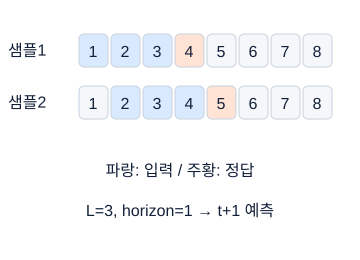

## 01. 시험 구성과 준비 순서

### 먼저 떠올릴 장면

#### 무엇을 입력으로 주고 무엇을 맞히려는가?

정비소에서 차량의 다음 달 수리비를 미리 알고 싶다고 하자. 사람이 “오래되고 많이 달린 차는 수리비가 클 것 같다”고 추측하는 대신, 과거 차량의 기록에서 계산 규칙을 찾는 것이 이번 학습의 출발점이다. 과거 표에는 사용 연수·주행거리·실제 수리비가 있고, 앞으로 예측할 차량에는 사용 연수·주행거리만 있다. 아직 발생하지 않은 수리비를 입력으로 줄 수 없으므로, 이미 아는 정보와 앞으로 맞힐 정보를 먼저 나누어야 한다.

이 일을 끝내려면 숫자를 읽는 것, 규칙을 배우는 것, 새 차량에도 통하는지 확인하는 것, 차량 순서에 맞게 결과를 저장하는 것이 모두 필요하다. 수식은 규칙을 정확하게 표현하고, 코드는 같은 계산을 많은 차량에 반복한다. 따라서 이 강의의 목표는 알고리즘 이름을 많이 외우는 것이 아니라 “어떤 입력으로 무엇을 맞히며, 맞았는지 어떻게 확인하는가”를 작은 사례로 설명하는 것이다.

이 교재에서 필기는 개념을 구분하고 계산하는 연습, Process는 정해진 작은 기능을 구현하는 연습, Problem은 데이터부터 최종 예측까지 연결하는 연습으로 이해한다. 실제 시험의 시간, 문항 수, 허용 검색·도구·자료, 제출 방법은 응시 회차의 공식 안내가 우선한다. 아래의 50분·20문항 및 170분 일정은 시간 배분을 계산하기 위한 연습 조건이며, 현재 회차 규정을 새로 확인했다는 뜻이 아니다. 학습 분량을 마쳤다는 사실도 합격이나 특정 점수를 보장하지 않는다.

### 낯선 말부터 풀기

샘플은 관찰 대상 하나다. 자동차 한 대를 한 행으로 정했다면 자동차가 샘플이다. 특성(feature)은 무게처럼 예측에 쓰는 정보이며 보통 X로 쓴다. 정답(target)은 연비처럼 학습 중에 맞혀 볼 값이며 y로 쓴다. 모델은 X를 넣으면 예측값을 돌려주는 계산 규칙이다. 학습은 정답을 보면서 그 규칙 안의 조절 가능한 수치인 매개변수를 바꾸는 과정이다. 검증은 매개변수 조절에 직접 쓰지 않은 데이터로 새로운 사례를 얼마나 잘 처리하는지 점검하는 과정이다.

#### 한 행에서 문제의 종류까지 연결하기

차량 A의 사용 연수가 2년, 주행거리가 3만 km, 실제 수리비가 20만 원이면 입력 한 묶음은 x=[2,3], 정답은 y=20이다. 대문자 X는 보통 여러 차량의 입력을 쌓은 표, 소문자 x는 그중 한 차량의 입력이다. 예측을 ŷ로 쓰면 y 위의 모자는 “실제로 관측한 정답이 아니라 모델이 추정한 값”이라는 표시다. 모델이 ŷ=18을 냈다면 18만 원을 예상했고 실제보다 2만 원 낮았다는 뜻이다. 출력이 어떤 단위인지까지 읽어야 계산 결과를 사용할 수 있다.

지도학습은 입력과 정답의 쌍으로 학습한다. 연비처럼 연속적인 수를 맞히면 회귀, 고장·정상처럼 종류를 맞히면 분류다. 한 샘플이 여러 범주에 동시에 속할 수 있으면 다중 레이블 분류이며, 한 종류만 고르는 다중분류와 다르다. 비지도학습은 별도 정답 없이 비슷한 샘플끼리 묶거나 데이터를 더 적은 숫자로 나타낸다. 자기지도학습은 가린 부분이나 다음 값을 원래 데이터에서 정답으로 만들어 학습한다. 강화학습은 행동에 따라 받는 장기적인 누적 보상을 크게 만드는 규칙을 학습한다. 어떤 학습 방식의 출제 우선순위가 높은지는 용어의 중요성만으로 추정하지 않는다.

정답에 숫자가 들어 있다고 모두 회귀인 것은 아니다. 정상=0, 경고=1, 고장=2라면 숫자는 이름표다. 번호를 고장=0, 정상=1, 경고=2로 바꾸어도 세 종류를 구분하는 일은 같다. 수리비 10만 원과 20만 원은 차이 10만 원 자체가 의미 있지만, 고장 번호 2가 정상 번호 0의 두 배라는 말에는 의미가 없다. 반면 한 차량에 누유와 소음이 동시에 있으면 여러 항목을 각각 예/아니오로 맞히므로 다중 레이블이다.

기준 모델(베이스라인)은 다른 모델과 성능을 비교할 때 기준으로 삼는 단순한 모델이다. 정답 평균만 예측하는 회귀 모델도 유용한 기준 모델이다. 파이프라인은 읽기, 나누기, 전처리, 학습, 평가, 저장처럼 앞 단계의 결과를 다음 단계로 넘기는 절차다. 딥러닝은 여러 신경망 층을 통해 예측에 필요한 특징까지 학습하는 방법이다. 복잡한 방법이 작은 표 형태의 데이터에서 언제나 단순한 모델보다 좋은 것은 아니다. 데이터의 특성과 검증 결과를 근거로 선택한다.

### 그림을 읽는 순서

먼저 축·색·연결 방향을 읽고, 각 그림 아래의 설명으로 확인하세요. 손계산은 다른 작은 숫자를 쓰는 독립 연습일 수 있습니다.


**그림 1-1. 필기와 실기는 서로 다른 행동을 확인한다**

위 단계에서 익힌 내용을 다음 단계에서 사용한다. 설명을 읽었다는 사실과 코드를 혼자 작성했다는 사실을 구분한다. 일정·시간·허용 도구는 실제 회차 안내를 우선한다.

그림의 값·구조: 개념 설명, 작은 수식과 코드로 확인, 문제 요구사항 구현, 시간 안에 저장과 제출의 순서로 공부한다.


**그림 1-2. 170분 운영의 한 가지 예**

시간 배분은 예시이지 공식 권장안이나 합격 보장이 아니다. 첫 유효한 예측 파일을 빨리 만든 뒤 개선 시간을 조절한다.

그림의 값·구조: 170분을 문제 확인 0–8분, Process 풀이 8–55분, 기준 모델과 개선 55–125분, 미완성 문제 125–150분, 제출 확인 150–170분으로 나눈 학습용 예시다.

### 숫자로 끝까지 따라가기

#### 학습·검증·최종 예측을 같은 말로 읽지 않기

학습용 차량 3대의 수리비가 [10,20,30]이라면 “앞으로도 일단 20만 원이라고 예측하자”는 규칙을 만들 수 있다. 이 평균을 만드는 데 쓴 세 차량은 규칙을 만드는 자료다. 별도로 남긴 차량의 실제 수리비가 26만 원이라면, 20이라는 예측과 비교해 오차 6만 원을 확인한다. 이것이 검증이다. 그 차량의 26까지 평균에 넣고 같은 차량을 평가하면 이미 참고한 문제로 실력을 확인하는 셈이 된다. 정답이 없는 최종 예측 차량에는 만들어 둔 규칙으로 20을 출력하지만, 실제 수리비를 모르므로 지금은 오차를 계산할 수 없다.

#### 소요 시간과 종료 시각은 어떻게 다른가?

시간표도 모델의 계산처럼 입력과 출력이 있다. 입력은 전체 시간과 할 일별 소요 시간이며, 출력은 각 일을 시작하고 끝낼 목표 시각이다. “개선에 60분을 쓴다”는 길이이고 “시작 후 125분에 개선을 끝낸다”는 시각이다. 둘을 섞으면 60분 시점에 개선을 중단하거나 검사 시간을 두 번 배정하는 착오가 생긴다. 먼저 전체 시간을 나누고, 앞에서부터 누적해서 시각으로 바꾸자.

연습 조건으로 필기 20문항에 50분이 있다고 하자. 50÷20=2.5분이고, 0.5분×60초=30초이므로 평균 2분 30초다. 이것은 모든 문제를 정확히 같은 시간에 풀라는 뜻이 아니다. 마지막 검토에 10분을 남기면 첫 풀이에는 50−10=40분, 문제당 평균 40÷20=2분을 배정할 수 있다. 긴 계산 한 문제에 6분을 쓰면 평균보다 4분을 더 소비한다. 다른 문제를 빨리 끝내거나 재방문해야 한다는 판단 근거가 생긴다.

실기 연습 시간 170분을 전체 읽기 8분, 작은 기능 구현 47분, 첫 기준 모델 10분, 개선 60분, 남은 기능 구현 25분, 최종 학습·예측 13분, 제출 검사 7분으로 나누자. 합은 8+47+10+60+25+13+7=170이다. 시작부터 계산한 각 구간의 종료 시각은 8, 55, 65, 125, 150, 163, 170분이다. 첫 파일은 65분 시점까지 만드는 계획이다. 누구에게나 가장 좋은 일정이라는 뜻은 아니며, 자신의 풀이 속도를 측정할 때 기준으로 삼으면 된다. 한 번 학습에 4분 걸리는 모델을 개선 구간에서 다섯 번 실행하면 4×5=20분이 걸리고, 분석·수정에 쓸 시간은 60−20=40분 남는다. 학습이 끝나기를 기다리는 시간도 전체 시간에 포함한다.

```python
import numpy as np

names = ["전체 읽기", "작은 구현", "첫 기준 모델", "개선", "남은 구현", "최종 예측", "검사"]
minutes = np.array([8, 47, 10, 60, 25, 13, 7])
ends = np.cumsum(minutes)
starts = np.r_[0, ends[:-1]]
for name, start, end in zip(names, starts, ends):
    print(f"{name}: {start}~{end}분")
assert minutes.sum() == 170
assert ends.tolist() == [8, 55, 65, 125, 150, 163, 170]
```

코드의 `names`와 `minutes`는 같은 위치끼리 대응한다. 두 번째 이름 “작은 구현”에 두 번째 숫자 47분이 붙는다. `np.array`는 시간 숫자를 계산용 배열로 만들고, `np.cumsum(minutes)`는 [8,8+47,8+47+10,…]을 계산한다. 첫 출력 “전체 읽기: 0–8분”은 0분부터 8분까지, 둘째 “작은 구현: 8–55분”은 그 다음 47분이라는 뜻이다. `zip`은 이름·시작·끝을 한 묶음씩 꺼내며 `for`가 일곱 묶음을 반복한다.

`cumsum`은 앞에서부터 더한 누적합이다. `ends[:-1]`은 마지막 종료 시각을 제외하며, 앞에 0을 붙여 다음 구간의 시작 시각을 만든다. `assert`는 뒤에 적은 조건이 참인지 검사하며 거짓이면 실행을 멈춰 가정이 틀렸음을 알려 준다. 데이터를 자동으로 고치는 명령은 아니다. 코드를 실행한 뒤 각 구간을 자신의 실측값으로 바꿔 보자. 총합이 170을 넘어서 검사 시간이 사라지면 공부 부족을 탓하기보다 계획을 먼저 수정한다.

입력의 관측 가능한 속성과 맞힐 종류를 먼저 구분하는 설명 순서는 [Berkeley Data8 분류 입문](https://inferentialthinking.com/chapters/17/classification/index.html)을 참고했다. 위 차량·수리비 사례는 이 강의의 별도 연습 예다.

### 시험 문제로 연결하기

필기에서는 “정답 없이 축을 찾는 방법인가?”, “예측값은 확률인가 연속값인가?”처럼 개념을 구분하는 문제를 연습한다. Process에서는 함수명, 입력 자료형, 출력 크기, 원본 변경 여부, 빈 입력 처리의 다섯 항목을 코드 작성 전에 적는다. Problem에서는 평가 지표, 데이터 분할 단위, 예측해야 하는 행 수와 순서를 먼저 기록한다. 세 영역은 각각 준비해야 한다. 모델 이름을 잘 알아도 예측값이 다른 차량의 순서로 저장되었다면 작업이 끝난 것이 아니다.

#### 값이 맞아도 명세를 어기면 왜 오답인가?

Process의 “새 표를 반환하라”를 수리비 사례에 대입해 보자. 입력의 주행거리만 단위를 바꾸고 다른 열·행 순서는 그대로인 새 표를 달라는 요청이라면, 값이 맞아도 입력 원본을 덮어썼거나 화면에 출력만 하고 아무것도 돌려주지 않았다면 요청을 수행하지 못했다. Problem의 “차량 A,B,C 순서로 예측하라”에는 예측 숫자 세 개뿐 아니라 대응 순서도 포함된다. [20,30,10]을 숫자 크기순 [10,20,30]으로 정렬하면 더 보기 좋지만 다른 차량에 수리비를 붙인 오답이다. 이처럼 명세 준수와 성능은 별도로 검사한다.

학습 자료는 수학, 데이터 처리, 특성, 고전 모델, 검증·평가, 복잡도를 제한하는 규제·손실을 줄이는 최적화, 신경망 기초, 이미지, 시계열, 생성·응용, 실전 연습이 서로 어떻게 이어지는지 생각하며 읽는다. 처음부터 모든 장을 같은 깊이로 외우지 말고, 다음 내용을 이해하는 데 필요한 개념부터 익힌다. 예를 들어 행렬곱의 축을 읽은 뒤 선형층을 공부하고, 조건부확률을 이해한 뒤 분류 지표를 공부하면 각 개념의 관계를 이해하기 쉽다. 회차별 규정에서 허용 여부를 확인하지 않은 개인 메모나 외부 서비스를 시험 중에 사용할 수 있다고 가정해서는 안 된다.

### 자주 헷갈리는 지점

오픈북은 외부 수단을 무제한 허용한다는 말이 아니다. 공식 검색도 허용 범위가 있을 수 있으므로 검색 대상과 통신·코드 실행 제한을 실제 안내에서 구분한다. 연습에서 도움을 받아 완성한 코드는 출발점이지 혼자 재현할 능력의 증명은 아니다. 노트북 셀을 순서 없이 실행한 뒤 성공한 결과도 깨끗한 상태에서 다시 실행하면 실패할 수 있다. 마지막 연습에는 처음부터 다시 실행하는 검사를 넣는다.

#### 낮은 기준 점수와 올바른 제출 파일이 왜 필요한가?

첫 기준 모델의 성능이 낮다는 사실은 실패와 다르다. 모든 차량에 20만 원을 예측하는 모델보다 복잡한 모델의 검증 오차가 작아졌다면 개선의 근거가 생긴다. 반대로 더 오래 학습했는데 검증 오차가 커졌다면 그 추가 학습의 개선 효과는 확인되지 않은 것이다. 학습 자료에만 맞춘 것인지, 갱신이 불안정한지 등 원인은 따로 점검한다. 기준 파일은 또 다른 점검 장치다. 저장한 파일을 다시 읽어 차량 수·출력 개수·순서가 맞는지 확인하면, 모델을 바꾸기 전에 데이터에서 제출까지 연결이 되는지 알 수 있다. 다만 유효한 파일을 만들었다고 예측 성능까지 충분하다는 뜻은 아니다.

시간이 모자랄 때 항상 가장 어려운 문제에 매달리는 것이 최선은 아니다. 먼저 완성할 수 있는 결과를 확보하는 시험 전략과, 개념을 깊이 이해하는 공부는 목적이 다르다. 시험 연습에서는 진행 상황을 관리하고, 평소 공부에서는 막힌 개념을 충분히 파고든다. 어느 방법도 합격을 보장하지 않지만, 아직 스스로 할 수 없는 일이 무엇인지는 확인할 수 있다.

### 스스로 확인하기

1. 차량 무게에서 연비를 예측하는 문제와 정답 없이 비슷한 차량을 묶는 문제는 무엇이 다른가?
2. 50분 중 검토 10분을 남기면 첫 풀이에서 문항당 평균 몇 분을 쓸 수 있는가? 각 문항을 그 시간 안에 반드시 끝내야 하는가?
3. 새 표를 반환하라는 요구가 있었는데, 함수가 실행되면서 입력 표를 수정했다. 완료로 볼 수 있는가?
4. 검증 점수가 높은 모델이 있지만 예측 파일의 행 수가 다르다. 무엇을 먼저 확인해야 하는가?

### 정답과 이유

1. **먼저 볼 조건:** 정답이 주어졌는지와 출력 숫자의 의미를 본다.

   - **단계 풀이:** 무게와 연비가 짝이면 연비를 맞히는 규칙을 배운다. 정답 없이 비슷한 차량을 묶으면 각 묶음의 정답을 미리 주지 않는다.
   - **정답:** 첫 문제는 입력과 연비 정답의 짝으로 배우는 지도 회귀다. 둘째는 정답 없이 구조를 찾는 비지도 군집화다. 출력이 숫자로 표현된다는 사실만으로 회귀인 것은 아니다.
   - **왜:** 학습에 사용하는 정보와 목표가 서로 다르기 때문이다.
   - **흔한 오해:** 군집 번호가 0·1·2여도 그 번호를 연속값으로 예측하는 회귀는 아니다.
   - **한 줄 기억:** 입력·정답의 관계와 목표를 먼저 적는다.

2. **먼저 볼 조건:** 50분은 전체, 10분은 검토, 20은 문항 수다.

   - **단계 풀이:** 첫 풀이 시간은 50−10=40분이고 40÷20=2분이다. 쉬운 문제에서 1분을 절약하면 다른 문제에 더 쓸 수 있다.
   - **정답:** (50−10)÷20=2분이다. 평균 시간이므로 쉬운 문제에서 절약한 시간을 어려운 문제에 쓸 수 있다. 다만 전체 검토 시간을 남겨 두었는지 확인해야 한다.
   - **왜:** 평균은 전체 시간을 문항 수로 나눈 계획값이지 개별 제한 시간이 아니다.
   - **흔한 오해:** 검토 10분을 빼지 않은 2.5분은 전체 평균이지 첫 풀이 평균이 아니다.
   - **한 줄 기억:** 전체 시간에서 남길 시간을 뺀 뒤 나눈다.

3. **먼저 볼 조건:** 요구에 '새 표'와 '원본 보존'이 있는지 확인한다.

   - **단계 풀이:** 호출 전 입력을 보관하고 함수 호출 후 같은지 비교한다. 반환된 값이 맞아도 입력의 값·열·인덱스가 바뀌면 조건 위반이다.
   - **정답:** 아니다. 반환값이 맞아도 원본을 보존하라는 조건을 어겼다. 입력 복사본으로 작업하고 호출 전후에 원본이 같은지 검사한다.
   - **왜:** 함수를 호출한 다른 코드가 원본을 계속 사용할 수 있기 때문이다.
   - **흔한 오해:** 화면에 맞는 값이 나오거나 print만 했다는 사실은 반환·원본 보존 검사를 대신하지 못한다.
   - **한 줄 기억:** 값·객체·원본 보존은 따로 검사한다.

4. **먼저 볼 조건:** 평가 지표보다 먼저 제출해야 할 대상 행 수와 순서를 본다.

   - **단계 풀이:** 병합 전후 행 수, 제거한 행, 정렬 위치표, 마지막 배치 포함 여부를 순서대로 대조한다. 각 출력에 원래 샘플을 붙일 수 있어야 한다.
   - **정답:** 예측 대상 행 수, 병합으로 늘어난 행, 정렬이나 결측 행 삭제 여부, 마지막 배치 처리부터 확인한다. 예측 파일을 제출 조건에 맞게 고친 뒤에 모델 점수를 개선한다.
   - **왜:** 모델 성능이 높아도 잘못된 차량에 예측을 대응시키면 요구한 결과가 아니다.
   - **흔한 오해:** 예측 숫자를 크기순으로 정렬하거나 부족한 행을 임의로 채우지 않는다.
   - **한 줄 기억:** 제출의 행 대응을 맞춘 뒤 성능을 비교한다.

### 더 읽을 공식 자료

학습 순서와 독립적인 실습의 출발점은 [PyTorch Learn the Basics](https://docs.pytorch.org/tutorials/beginner/basics/intro.html)를 참고한다. 데이터 분할과 변환의 역할은 [scikit-learn Getting Started](https://scikit-learn.org/stable/getting_started.html)에서 확인한다. 이 링크들은 학습 도구의 공식 문서이며 HDAT 시험 운영 규정의 근거가 아니다. 실제 운영 조건은 응시 안내에서 별도로 확인한다.

## 02. Python·Jupyter와 배열 크기 읽기

### 먼저 떠올릴 장면

학생 세 명에게 수학·영어 점수가 있다. 첫 학생 [70,80], 둘째 [90,60], 셋째 [50,100]을 한 줄씩 놓으면 [[70,80],[90,60],[50,100]]이다. 사람이 “둘째 학생의 영어는 60점”이라고 읽는 위치를 컴퓨터에는 행 1, 열 1로 알려 준다. Python은 첫 위치를 0이라고 부르므로 둘째가 1이다. 여기서 숫자 60뿐 아니라 “누구의 어느 과목인가”라는 대응이 중요하다.

이 “3명 × 2과목” 표에서 행과 열은 숫자를 해석하는 약속이다. 행과 열을 바꾸어도 숫자 여섯 개는 그대로지만, 행 하나가 뜻하는 대상은 달라진다. 컴퓨터는 행이 학생인지 과목인지 스스로 알지 못한다. 따라서 값뿐 아니라 각 축의 의미와 길이도 정해야 한다. 머신러닝 코드에서 배열 크기 오류는 단순한 문법 실수가 아니라, 데이터의 축이 서로 맞지 않는다는 신호일 수 있다.

Jupyter의 셀은 실행할 수 있는 코드 묶음이고, 커널은 코드를 실행하며 변수 값을 저장하는 실행 프로그램이다. 화면에서 위에 있는 셀이 반드시 먼저 실행된 것은 아니다. 변수를 나중에 바꾼 뒤 앞 셀을 실행하면 화면의 코드 순서와 실제 변수 상태가 달라진다. 짧은 예제는 새 커널에서 위에서 아래로 실행해 같은 결과를 재현할 수 있는지 확인한다.

### 낯선 말부터 풀기

Python의 리스트(list)는 여러 값을 순서대로 담는 자료 구조이고, NumPy의 ndarray는 일정한 축 구조를 가진 수치 배열이다. pandas의 DataFrame은 열 이름과 행 인덱스가 있는 표다. PyTorch의 텐서(Tensor)는 수치 배열에 자동 미분과 연산 장치 선택 기능을 더한 객체다. dtype은 정수·실수처럼 값을 저장하는 자료형이고, device는 CPU나 GPU처럼 계산할 장치다. 배열 크기인 shape는 각 축의 길이를 차례로 적은 값이다. 여기서 배열의 차원 수는 축의 개수이며 원소 수와 다르다. shape가 (3,2)이면 축은 2개, 원소는 3×2=6개다.

#### 숫자를 담는 그릇과 그릇의 모양 구분하기

같은 [1,2]도 Python 리스트라면 “첫 값, 둘째 값”을 담은 목록이고, NumPy 배열이라면 수치 계산의 대상이다. 그래서 리스트에 2를 곱하면 목록이 두 번 이어지고 배열에 곱하면 원소가 각각 두 배가 된다. DataFrame에서는 수학이라는 열 이름으로 고를 수 있지만, 일반 배열로 바꾸면 보통 위치만 남는다. 모델에 넣기 전에 열 순서를 고정해야 하는 이유다. 텐서는 “아주 복잡한 별개 숫자”가 아니라 이와 같은 배열이며, 신경망 학습에 필요한 미분과 GPU 계산 기능을 함께 제공한다.

이 교재에서 N은 전체 샘플 수, B는 한 번 계산하는 배치 안 샘플 수, F는 특성 수, T는 시점 수, C는 채널 수, H와 W는 이미지의 높이와 너비, K는 클래스 수다. 배치는 동시에 계산하려고 묶은 샘플 묶음이다. 표 데이터 입력 (B,F), 시계열 입력 (B,T,F), 이미지 입력 (B,C,H,W)를 읽을 때 각 글자를 실제 대상으로 바꿔 말한다. 같은 T라도 문맥에서 다른 뜻으로 정의했다면 그 정의를 따른다.

#### 배치·시간·특성은 각각 누구의 어느 값을 뜻하는가?

배치와 시점도 분리해서 생각하자. 차량 두 대 각각의 최근 세 시점에서 속도·온도를 기록하면 (B,T,F)=(2,3,2)다. X[1,2,0]은 둘째 차량, 셋째 시점, 첫 특성인 속도 하나다. 축 번호 0은 차량, 1은 시점, 2는 특성을 뜻하며, 축의 길이 2·3·2와 축 번호 0·1·2는 다르다. 이미지 (B,C,H,W)는 샘플마다 색상 채널별로 높이×너비 칸을 가진다는 뜻이다. 그림이 몇 개 있는지와 그림 한 장의 픽셀 수를 구분하면 네 축도 읽을 수 있다.

인덱싱은 위치나 이름으로 값을 고르는 작업이고, 슬라이싱은 연속 구간을 고르는 작업이다. Python의 `a[1:3]`은 1번과 2번 위치만 포함하며 3번은 제외한다. 인덱스는 0부터 시작한다. `a[:, 1]`은 모든 행의 두 번째 열을 꺼내 축 하나를 없애고, `a[:, 1:2]`는 두 번째 열의 길이 1짜리 축을 남긴다. pandas에서는 `loc`가 이름, `iloc`가 정수 위치를 기준으로 고른다. 숫자 0이라는 인덱스 이름과 첫 행은 같지 않을 수 있다.

### 그림을 읽는 순서

먼저 축·색·연결 방향을 읽고, 각 그림 아래의 설명으로 확인하세요. 손계산은 다른 작은 숫자를 쓰는 독립 연습일 수 있습니다.


**그림 2-1. 행·열에서 배치·시간·특성으로**

이 표는 배치 속 샘플 하나를 펼친 모습이다. Conv1d에 넣을 때 축을 바꾸어도 A와 B의 시간 기록은 서로 섞이면 안 된다.

그림의 값·구조: 배치 크기는 1, 시점 수는 3, 특성 수는 2다. 행은 시간, 열은 특성을 나타낸다. 축 순서를 바꾸면 같은 특성의 시간별 값이 한 행에 모인다.


**그림 2-2. 브로드캐스팅은 같은 값을 여러 위치에 적용한다**

보정값 [3]을 [1,3]처럼 오른쪽부터 맞춘다. permute와 달리 축을 교환하지 않고 각 위치에 덧셈을 한다.

그림의 값·구조: 2행 3열 배열에 길이가 3인 보정값을 더한다. 각 행의 같은 열에는 같은 보정값이 적용된다. 축의 순서를 바꾸는 연산과는 다르다.

### 숫자로 끝까지 따라가기

#### reshape와 축 교환은 같은 모양이어도 왜 다른가?

축을 바꾼 뒤 지켜야 할 약속은 “새 표의 첫 특성·둘째 시점 값 = 옛 표의 둘째 시점·첫 특성 값”이다. 위 숫자에서는 2가 그 자리로 이동해야 한다. (B,T,F)에서 (B,F,T)로 바꾸는 `permute(0,2,1)`은 기존 0번 축은 그대로 두고 기존 2번을 두 번째, 기존 1번을 세 번째로 놓으라는 명령이다. 0·2·1개로 크기를 만들라는 뜻이 아니다. 모델마다 같은 정보를 기대하는 배치 방식이 달라서 축을 옮기는 것이며, 관측값이나 시간을 새로 만드는 작업이 아니다.

점수표 X=[[1,2,3],[4,5,6]]과 보정값 c=[10,20,30]을 더하면 첫 행은 [11,22,33], 둘째 행은 [14,25,36]이다. 오른쪽 축 3과 3이 같고, c에 없는 왼쪽 축은 크기가 1인 것으로 보아 두 행에 적용한다. 이를 브로드캐스팅(broadcasting)이라고 한다. 크기가 다른 배열을 함께 계산하는 규칙으로, 뒤쪽 축부터 비교했을 때 크기가 같거나 한쪽이 1이어야 한다.

이 규칙을 적용할 때 종이에 두 shape의 오른쪽 끝을 맞춰 적어 보자. (2,3)과 (3,)은 (2,3)과 (1,3)처럼 비교한다. 마지막 축은 3 대 3이라 그대로, 앞 축은 2 대 1이라 한 묶음을 두 행에 반복한다. 반면 (2,3)과 (2,)는 마지막 축 3 대 2가 모두 1이 아니고 서로 달라 계산할 수 없다. “행이 두 개이니 길이 2의 값은 행별로 더해지겠지”라고 추측하면 안 된다. 각 행에 하나씩 더하려면 (2,1)로 만들어 어느 축에 적용할지 표시한다.

#### 예측과 정답을 한 쌍씩 비교했는지 어떻게 아는가?

더 위험한 예를 보자. 예측 p=[[2],[4]], 정답 y=[1,3]의 올바른 평균제곱오차는 ((2−1)²+(4−3)²)÷2=(1+1)÷2=1이다. 그런데 p−y를 그대로 계산하면 [[2−1,2−3],[4−1,4−3]]=[[1,−1],[3,1]]이다. 제곱 평균은 (1+1+9+1)÷4=3이다. 오류 메시지는 없지만 다른 문제를 계산했다. 평균제곱오차는 MSE라고 줄여 부르며 대응하는 예측·정답 차이를 제곱한 뒤 평균한 값이다.

```python
import numpy as np

X = np.array([[1, 2, 3], [4, 5, 6]])
print(X + np.array([10, 20, 30]))
p = np.array([[2.], [4.]])
y = np.array([1., 3.])
wrong = np.mean((p - y) ** 2)
right = np.mean((p[:, 0] - y) ** 2)
print("잘못된 비교:", (p - y).shape, wrong)
print("올바른 비교:", (p[:, 0] - y).shape, right)
assert wrong == 3 and right == 1
a = np.arange(12).reshape(2, 3, 2)
print("축 교환:", a.transpose(0, 2, 1)[0])
print("크기 재묶기:", a.reshape(2, 2, 3)[0])
```

코드의 `wrong` 줄에서 `** 2`는 각 차이의 제곱이고 `np.mean`은 만들어진 차이 전부의 평균이다. 함수 자체는 계산을 정확히 했지만, 우리가 잘못 짝지은 네 개의 차이를 건넸다. `right` 줄의 `p[:,0]`은 예측의 유일한 출력 열을 골라 (2,)로 만든다. 그래서 첫 예측 2와 첫 정답 1, 둘째 예측 4와 둘째 정답 3만 비교한다. 정답을 `y[:,None]`으로 만들어 양쪽을 (2,1)로 맞추는 방법도 같은 뜻이다. shape를 같게 만든 뒤에도 차량 순서가 다르면 틀리므로 값의 대응을 함께 확인한다.

`np.arange(12)`는 0부터 11까지 열두 숫자를 만들고, 첫 `reshape`는 이를 샘플 2개·시점 3개·특성 2개로 묶는다. 마지막 두 출력은 이 동일한 원자료에서 “축 교환”과 “다시 묶기”를 각각 수행해 비교한다.

첫 샘플의 축 교환 결과는 [[0,2,4],[1,3,5]]이고, 단순 reshape 결과는 [[0,1,2],[3,4,5]]다. 원소 수와 배열 크기는 같지만 숫자가 대응하는 위치가 다르다. PyTorch에서 같은 축 교환은 `permute(0,2,1)`로 쓴다. reshape는 원소의 나열을 새로운 크기에 맞춰 묶는 작업이므로 축 교환을 대신할 수 없다.

목록을 작은 숫자로 만든 뒤 원소별 연산을 확인하는 학습 순서는 [Berkeley Data8 배열 입문](https://inferentialthinking.com/chapters/05/1/arrays/)에서도 볼 수 있다. 지금은 명령을 늘리기보다 연산 전후 값과 모양을 함께 예측해 보자.

### 시험 문제로 연결하기

Conv1d는 기본적으로 (B,C,T)를 받으므로 시계열 (B,T,F)의 F를 채널로 쓸 때는 축을 교환해 (B,F,T)로 만든다. `batch_first=True`인 RNN은 (B,T,F)를 받지만 기본 설정에서는 (T,B,F)를 사용하므로 함수 설명과 설정을 함께 읽는다. Linear는 마지막 축의 특성을 조합한다. 다중분류 점수 (B,K)에서 샘플마다 가장 큰 점수의 위치를 고르면 (B,)가 된다. 이 변환 전 점수(logit)는 확률이 아니므로 각 행의 합이 1일 필요가 없다.

열을 고르는 작은 동작도 다음 계산에 영향을 준다. 점수표에서 `X[:,1]`은 영어 세 점수를 [80,60,100]처럼 꺼내므로 (3,)이다. `X[:,1:2]`는 [[80],[60],[100]]처럼 영어 열 하나짜리 표를 유지하므로 (3,1)이다. 둘 다 같은 세 점수지만 전자는 길이 3인 한 축, 후자는 학생 축과 열 축을 가진다. “2차원은 숫자가 더 많다”가 아니라 “좌표를 두 개 써서 위치를 지정한다”는 뜻이다. 영어 한 열을 표로 반환하라는 문제는 두 번째 방식과 연결된다.

함수를 구현하기 전에 입력 객체의 종류, 배열 크기, 자료형, 출력 크기, 원본 수정 여부를 적는다. 오류를 찾을 때는 데이터 전체보다 각 단계의 배열 크기와 작은 샘플을 출력해 처음 조건이 어긋난 곳을 찾는다. 불리언 마스크는 True인 위치만 선택하는 배열이므로 행을 고르는 마스크의 길이는 대상 행 수와 같아야 한다. 빈 배치, B=1, 상수 배열은 코드에서 미처 고려하지 않은 조건을 찾기 좋은 연습 입력이다.

객체 종류가 연산의 뜻을 결정한다는 원리를 저장 단계에도 적용하자. 정수 배열에 소수 계산 결과를 다시 대입하면 소수 부분이 보존되지 않을 수 있다. 평균·스케일링처럼 실수가 필요한 계산은 화면의 출력값만 아니라 저장 자료형까지 확인한다.

축 하나를 줄이는 평균 연산도 문장으로 설명할 수 있어야 한다. 학생 세 명과 과목 두 개의 표에서 학생들을 모아 평균하면 과목별 평균 두 개가 남는다. 과목들을 모아 평균하면 학생별 평균 세 개가 남는다. 축 번호를 외우기 전에 “어떤 대상을 모아 평균하고 무엇을 남기는가”를 적는다. 축이 여러 개인 텐서에서도 원리는 같다. 모델과 입력의 연산 장치가 다르면 배열 크기가 맞아도 계산할 수 없다. 정수 클래스 번호인 정답을 실수 회귀값처럼 다루는 것도 원래 문제와 다른 계산이 된다.

실습 노트북을 다시 실행할 때는 앞 셀에 우연히 남은 변수에 의존하지 않는지 확인한다. 함수가 인자로 받지 않은 외부 셀의 변수를 사용하면, 공개 예제에서는 실행되어도 새로운 실행 환경에서는 실패할 수 있다. 필요한 입력은 인자로 분명하게 받거나 고정 설정으로 문서화하고, 반환할 결과도 함수 안에서 명확히 만든다. 화면에 결과를 출력하는 것과 함수를 호출한 곳에 값을 반환하는 것은 서로 다르다.

### 자주 헷갈리는 지점

#### axis는 남기는 축일까, 모아 계산하는 축일까?

앞의 점수표에서 학생별 평균을 만들면 첫 학생 (70+80)÷2=75, 둘째 75, 셋째 75로 세 값이 남는다. 과목 축인 1번 축을 모아 없애는 `mean(axis=1)`이다. 과목별 평균은 수학 (70+90+50)÷3=70, 영어 (80+60+100)÷3=80으로 두 값이 남으며 학생 축인 0번을 모으는 `mean(axis=0)`이다. axis는 남길 축이 아니라 계산하며 모을 축이라는 점이 자주 뒤바뀐다. 평균을 원래 표에서 빼려면 어떤 축을 남겼는지까지 확인해 보정값의 shape를 맞춘다.

#### 일부만 고쳤는데 원본까지 바뀌는 이유는 무엇인가?

NumPy의 기본 슬라이스는 원본과 메모리를 공유하는 뷰(view)가 될 수 있다. `a=np.arange(4); b=a[1:3]` 뒤 `b[0]=99`를 하면 a의 1번 값도 바뀐다. 원본과 독립적인 배열이 필요하면 `.copy()`를 사용한다. 다만 모든 인덱싱 결과가 뷰인 것은 아니며, 고급 인덱싱은 복사본을 만들 수 있다. 메모리 공유 여부를 외우기에 앞서 원본을 보존해야 하는지부터 확인한다.

예를 들어 `b=a[1:3]`은 원본 창고의 일부를 바라보는 창과 같고, `b=a[1:3].copy()`는 그 값을 별도 창고에 옮긴 것이다. 첫 방식에서 b를 고치면 a가 바뀌는 것은 복사 오류가 아니라 저장 공간을 공유한 결과다. 빈 열 목록을 받은 함수도 “새 표”를 요구했다면 값이 같은 복사본을 반환해야 한다. 당장 값이 같아도 이후 결과를 수정했을 때 원본이 변하는지가 다르기 때문이다. 화면의 출력값뿐 아니라 함수 호출 전후 원본을 비교해야 이 차이가 드러난다.

`squeeze()`로 크기 1인 모든 축을 없애면 배치 크기가 1일 때 배치 축까지 사라질 수 있다. 특정 출력 축만 없앨 때는 `squeeze(1)`처럼 축을 지정한다. (B,T,F)에 (T,)를 더하는 것도 시점별 보정이 아니다. 오른쪽에서 F와 비교되기 때문이다. 시점별 보정은 (1,T,1)처럼 시간 축을 명시한다. T=F일 때 실행이 된다는 사실이 오히려 의미 오류를 숨길 수 있다.

### 스스로 확인하기

1. 배열 크기가 (4,5,3)인 시계열에는 원소가 몇 개이며, Conv1d에 넣기 직전의 배열 크기는 무엇인가?
2. (3,1)과 (3,)를 빼면 왜 세 개가 아니라 아홉 개의 차이가 생기는가?
3. 두 번째 열을 고를 때 `X[:,1]`과 `X[:,1:2]`는 무엇이 다른가?
4. 뷰의 값을 바꾼 뒤 원본이 바뀌었다. Python이 값을 잘못 복사한 것인가?

### 정답과 이유

1. **먼저 볼 조건:** (4,5,3)의 축 의미가 배치·시간·특성이라는 조건이다.

   - **단계 풀이:** 원소 수는 4×5×3=60이다. Conv1d는 특성을 채널로 시간 앞에 두므로 기존 축 0,2,1 순으로 바꾼다.
   - **정답:** 4×5×3=60개다. 배치 4, 특성 채널 3, 시간 5의 (4,3,5)로 축을 교환한다. 원소 수 60은 유지된다.
   - **왜:** 값을 유지하면서 모델이 기대하는 축 의미를 맞춰야 하기 때문이다.
   - **흔한 오해:** reshape(4,3,5)는 같은 크기라도 시점과 특성의 값 대응이 달라질 수 있다.
   - **한 줄 기억:** 축 의미를 교환할 때는 permute/transpose.

2. **먼저 볼 조건:** 두 배열의 오른쪽 축을 맞춰 (3,1)과 (1,3)으로 적는다.

   - **단계 풀이:** 마지막 축의 1이 3으로, 첫 축의 1이 3으로 확장된다. 각 예측 하나가 모든 정답 세 개와 비교되어 결과는 (3,3)이다.
   - **정답:** 정답 (3,)를 (1,3)처럼 맞춰 계산하므로 양쪽의 길이 1인 축이 확장되어 (3,3)이 된다. 각 예측과 정답을 올바르게 짝지어 비교하려면 먼저 배열 크기를 같게 맞춘다.
   - **왜:** 브로드캐스팅은 값의 의미를 모르고 축 길이 규칙만 적용한다.
   - **흔한 오해:** 코드가 실행되었다고 예측과 정답이 한 쌍씩 비교된 것은 아니다.
   - **한 줄 기억:** MSE 전에 shape와 샘플 순서를 모두 맞춘다.

3. **먼저 볼 조건:** 정수 인덱스 1과 슬라이스 1:2를 구별한다.

   - **단계 풀이:** 행이 N개면 X[:,1]은 N개 숫자 목록, X[:,1:2]는 N행·1열 표다. 슬라이스는 한 열이어도 축을 남긴다.
   - **정답:** 전자는 (행 수,)이고 후자는 (행 수,1)이다. 후자는 열 축을 유지하므로 이후 행렬 연산과 브로드캐스팅에서 다르게 처리된다.
   - **왜:** 정수는 한 위치를 골라 축을 없애고 구간 선택은 해당 축을 유지한다.
   - **흔한 오해:** 숫자 수가 같다고 같은 shape는 아니다.
   - **한 줄 기억:** 한 열을 표로 남기려면 길이 1의 축을 유지한다.

4. **먼저 볼 조건:** 선택 결과가 독립 복사인지 같은 저장 공간을 보는 뷰인지 본다.

   - **단계 풀이:** a의 1:3을 b로 본 뒤 b[0]을 바꾸면 a[1]도 바뀐다. 선택 뒤 copy를 했다면 독립 배열을 수정한다.
   - **정답:** 아니다. 뷰는 원본과 메모리를 공유한다. 독립적인 배열이 필요한 함수에서 복사본을 명시적으로 만들지 않은 것이 원인이다.
   - **왜:** 뷰는 같은 원본 숫자의 다른 접근 창이기 때문이다.
   - **흔한 오해:** 모든 인덱싱이 뷰이거나 reshape가 항상 복사라는 식으로 일반화하지 않는다.
   - **한 줄 기억:** 원본 보존이 필요하면 복사 여부까지 검증한다.

### 더 읽을 공식 자료

[NumPy broadcasting 규칙](https://numpy.org/doc/stable/user/basics.broadcasting.html)과 [NumPy copies and views](https://numpy.org/doc/stable/user/basics.copies.html)는 축 호환과 메모리 공유를 설명한다. 축 교환은 [PyTorch permute](https://docs.pytorch.org/docs/stable/generated/torch.permute.html)를 확인한다. 문서의 최신 버전과 자신의 실행 환경 버전은 다를 수 있으므로 예제는 기본 연산 중심으로 연습한다.

## 03. NumPy·pandas로 데이터 구조와 값 점검하기

### 먼저 떠올릴 장면

모델에 “무게 1000kg, 속도 30km/h”를 주어야 하는데 [30,1000]을 넣으면 컴퓨터는 무게 30, 속도 1000으로 계산할 수 있다. 숫자 두 개라는 모양은 맞지만 뜻이 뒤바뀐 것이다. 행도 마찬가지다. A 차량의 예측을 B 차량에 붙이면 좋은 모델의 계산도 쓸 수 없다. 이번 장은 값을 고치기 전에 행·열·값의 의미가 작업 내내 유지되는지 점검하는 연습이다.

주행 기록에 차량 A가 두 번 등장하면 중복 행일까? 오전과 오후의 다른 운행이라면 정상이다. 반면 차량 정보표에 A의 현재 무게가 두 줄 있고 기준 시각도 없다면 어느 값을 붙일지 모호하다. 데이터 정리는 보기 싫은 행을 없애는 일이 아니라, 한 행의 의미와 표 사이의 관계를 유지하는 일이다. 모델을 학습하기 전에 이 관계부터 확인해야 각 예측값을 올바른 차량에 대응시킬 수 있다.

#### 입력 열과 정답 열은 어떤 순서로 나누는가?

작은 표를 먼저 고정하자. train에 id, weight, speed, fuel_efficiency가 있고 test에 speed, id, weight가 있다고 하자. 연비를 맞히려면 입력 X는 weight와 speed, 정답 y는 train의 fuel_efficiency다. id는 어떤 차량의 행인지 추적하려고 보관하되 이번 예제의 모델 입력에서는 제외한다. test의 열 수가 하나 적은 것은 정답이 없어서 정상이다. train과 test의 전체 열 수를 무조건 같게 만들려 하면 아직 모르는 정답 열을 만들거나 필요한 입력을 지울 수 있다.

이 연습에서는 학습 데이터인 train에는 정답이 있고, 평가 데이터인 test에는 예측할 입력만 있다고 가정하자. 실제 문제에서 값을 비워 둔 정답 열을 제공한다면 그 명세에 맞게 판단해야 한다. 입력 X와 정답 y를 나눌 때는 열 이름과 순서를 명시한다. 학습 데이터는 무게·속도 순서이고 평가 데이터는 속도·무게 순서여도, 양쪽 모두 `FEATURES=["weight","speed"]`로 선택하면 모델 입력의 순서를 맞출 수 있다. 필요한 열 자체가 없는 것은 순서 문제와 다르므로 먼저 누락 여부를 확인한다.

### 낯선 말부터 풀기

데이터 구조(schema)는 열 이름, 순서, 자료형처럼 표가 갖춰야 할 형식이다. ID는 샘플이나 개체를 식별하는 값이다. 인덱스(index)는 pandas가 행을 정렬하고 서로 대응시키는 데 사용하는 행 이름이며, 항상 0부터 시작하는 연속 번호는 아니다. 키(key)는 서로 다른 표에서 같은 대상을 연결하는 열이다. merge는 키가 같은 행들을 짝지어 다른 표의 정보를 붙인다. groupby는 같은 키의 행을 묶고, agg는 그룹별 요약을, transform은 원래 각 행에 대응하는 계산 결과를 반환한다.

#### 숫자처럼 보인다는 것과 계산할 숫자라는 것은 다르다

차종 코드 1·2·3은 종류 이름이고, 속도 1·2·3은 크기를 가진 측정값이다. 차종 3에서 차종 1을 빼 “차이가 2”라고 해도 차량 사이의 실제 거리를 뜻하지 않는다. 범주형 입력을 모델용 숫자로 바꾸는 것은 다음 전처리에서 다루지만, 여기서는 먼저 같은 종류가 같은 이름으로 기록되었는지 확인한다. 공장 번호 숫자 1과 문자열 "1"이 같은 공장이면 통일할 수 있고, 코드 "01"과 "1"이 다른 지점이면 숫자로 바꾸어 합치면 안 된다. 인코딩 전에 이 결정을 해야 정보가 사라지지 않는다.

NaN은 값이 없거나 수치 계산 결과가 정의되지 않은 상태이고, Inf와 −Inf는 양·음의 무한대다. `isna()`는 결측값을, `isfinite()`는 무한대도 결측값도 아닌 유한한 숫자를 확인한다. 숫자처럼 보이는 문자열 "30"과 실수 30.0의 자료형은 다르다. 범주형 열에서는 숫자 1과 문자열 "1"이 같은 종류인지 판단한 뒤 형태를 통일한다. 단순히 `astype(str)`를 쓰면 빈칸이 "nan"이라는 글자로 바뀌어 결측 검사에서 빠질 수 있다.

중복을 확인할 때는 전체 행이 같은지, 키만 같은지 구분한다. 같은 차량의 여러 시각 기록은 키가 중복되어도 전체 행은 다를 수 있다. 그룹 평균도 데이터 요약용인지 미래 예측의 입력 특성인지 구분한다. 미래 기록을 포함한 차량 평균은 표 연산으로는 맞아도 과거 시점의 예측에는 사용할 수 없다. 숫자의 형식뿐 아니라 그 값을 언제 알 수 있었는지도 확인해야 한다.

### 그림을 읽는 순서

먼저 축·색·연결 방향을 읽고, 각 그림 아래의 설명으로 확인하세요. 손계산은 다른 작은 숫자를 쓰는 독립 연습일 수 있습니다.


**그림 3-1. merge: 이름표를 맞춰 정보를 붙이기**

왼쪽 A가 두 번인 것은 정상일 수 있다. 오른쪽 정보표에 A가 두 번이면 한 왼쪽 행이 여러 행과 연결된다. validate로 의도한 관계를 검사한다.

그림의 값·구조: 왼쪽 표의 ID가 A, B, A이고 오른쪽 표의 정보가 A에 1000, B에 1500일 때, 다대일 병합 결과는 원래와 같은 세 행이다.


**그림 3-2. agg와 transform의 행 수가 다르다**

transform은 각 원래 행에 그 그룹의 평균을 대응시킨다. 평균이 두 그룹에서 다르므로 어떤 그룹의 값을 붙였는지 추적할 수 있다.

그림의 값·구조: 그룹 A의 값 10과 30의 평균은 20이고, 그룹 B의 값 100의 평균은 100이다. agg는 그룹별 결과 2개를, transform은 원래 세 행에 대응하는 결과를 반환한다.

### 숫자로 끝까지 따라가기

#### 키가 같은 행이 여러 개라면 몇 행이 될까?

병합을 눈으로 따라갈 때는 왼쪽 한 행을 고르고, 같은 키를 가진 오른쪽 행을 전부 찾아보자. 왼쪽 A의 속도 10에 오른쪽 무게 1000 하나가 있으면 결과 한 행이다. 오른쪽에 A=1100도 있으면 [A,10,1000]과 [A,10,1100] 두 행이 생긴다. 어느 무게가 맞는지 merge가 추리해서 선택하지 않는다. `left`는 왼쪽 행을 기준으로 남긴다는 뜻이며, 행 수가 절대로 늘지 않는다는 뜻이 아니다. 오른쪽 키 하나에 정보 한 행이라는 가정이 필요해서 `many_to_one`을 검사한다.

#### 요약 한 행과 원래 세 행은 어떻게 다른가?

A의 속도 10과 30의 평균은 (10+30)÷2=20이다. B는 관측 하나이므로 평균 100이다. 그룹 요약 값은 [20,100]이지만 원래 행에 붙일 값은 [20,100,20]이다. 만약 정보표 A가 두 행이면 A 주행 두 건×A 정보 두 건=4개 짝, B 한 건×B 정보 한 건=1개 짝으로 결과는 4+1=5행이다. 어느 A 정보를 버릴지 임의로 정하지 말고 정보표가 시간 이력인지 입력 오류인지 먼저 확인한다.

원래 행 순서 [A,B,A] 옆에 그룹 평균을 넣고 싶으면 “A가 있는 첫째와 셋째 행에 20, B가 있는 둘째 행에 100”이라고 대응을 적는다. 이것이 [20,100,20]이다. 그룹 요약 [20,100]을 길이가 다른 원래 표에 그냥 넣으려는 것은 “차량 두 종류”의 좌표와 “주행 세 건”의 좌표를 섞는 일이다. pandas는 Series를 대입할 때 단순히 위에서부터 붙이는 대신 인덱스 이름을 맞출 수 있으므로, A·B와 0·1·2가 다르면 NaN이 생긴다.

결측 처리 예로 입력 [10,NaN,Inf,30]의 Inf를 센서 오류로 간주하여 NaN으로 바꾼다고 하자. 관측된 값은 [10,30], 중앙값은 (10+30)÷2=20, 대치 결과는 [10,20,20,30]이다. 같은 규칙으로 새 입력 [NaN,100]은 [20,100]이 된다. 새 입력의 중앙값 100으로 별도 대치하면 학습과 다른 기준이 된다. 이 계산은 입력 특성의 대치 예이며 정답 결측을 임의로 만들어 채우는 예가 아니다.

```python
import numpy as np
import pandas as pd

trips = pd.DataFrame({"id": ["A", "B", "A"], "speed": [10., 100., 30.]})
meta = pd.DataFrame({"id": ["A", "B"], "weight": [1000., 1500.]})
work = trips.assign(row_order=np.arange(len(trips)))
out = work.merge(meta, on="id", how="left", validate="many_to_one")
out = out.sort_values("row_order", kind="stable")
out["group_mean"] = out.groupby("id")["speed"].transform("mean")
print(out.to_string(index=False))
assert out["group_mean"].tolist() == [20., 100., 20.]
assert len(out) == len(trips)
order = np.array([2, 0, 1])
pred_sorted = np.array([[9., 90.], [7., 70.], [8., 80.]])
pred_original = pred_sorted[np.argsort(order, kind="stable")]
print(pred_original)
assert pred_original.tolist() == [[7., 70.], [8., 80.], [9., 90.]]
```

코드를 순서대로 읽어 보자. `trips`는 주행 세 건, `meta`는 차량 두 대의 정보다. `assign(row_order=...)`은 원래 위치 [0,1,2]를 새 열로 보관한 표를 만든다. `merge`가 무게를 붙이고, `sort_values`가 보관한 위치를 기준으로 순서를 맞춘다. `groupby("id")["speed"]`는 차량별 속도만 모으고 `transform("mean")`이 그룹 평균을 각 주행 행으로 돌려준다. 출력의 열 순서는 `id, speed, row_order, weight, group_mean`이다. 세 행은 A·10·0·1000·20, B·100·1·1500·100, A·30·2·1000·20에 해당한다. 마지막 20은 새로 관측한 속도가 아니라 A 두 기록을 요약해 붙인 값이다.

#### 시간순 예측을 원래 차량 순서로 어떻게 되돌릴까?

뒤의 순서 복원은 별도 예제다. `order=[2,0,1]`은 “현재 첫 행이 원래 2번, 둘째가 원래 0번, 셋째가 원래 1번”이라는 안내표다. 따라서 원래 0번을 먼저 꺼내려면 현재 위치 1, 다음은 위치 2, 마지막은 위치 0을 고른다. 두 출력 [7,70]을 함께 옮겨야 같은 차량의 결과가 갈라지지 않는다.

`validate="many_to_one"`은 왼쪽 키의 반복은 허용하되 오른쪽 키는 유일해야 한다는 검사다. `argsort(order)`는 원래 행 번호를 0,1,2로 정렬할 때 사용할 위치 [1,2,0]을 돌려준다. 이를 예측 배열의 첫 축에 적용하므로 같은 행의 두 출력도 함께 이동한다. 예측값을 크기순으로 정렬하는 것이 아니라 샘플의 원래 순서로 되돌리는 것이다.

그룹을 나누고 각 그룹에 계산한 뒤 결과를 합치는 흐름은 [Berkeley Data100 pandas 강의 노트](https://ds100.org/course-notes-su23/pandas_3/pandas_3.html)를 참고했다. 같은 함수 이름을 알아도 결과가 원래 행과 대응하는지는 따로 검사해야 한다.

### 시험 문제로 연결하기

표를 받으면 크기, 열 이름·순서, 자료형, 결측값·무한대, 중복, 정답의 의미 순으로 검사한다. 날짜는 명시한 형식으로 해석하고, 같은 개체 안에서 시간순으로 정렬한다. `reset_index`는 새 행 번호를 붙일 뿐, 원래 순서를 저장하거나 복원하지 않는다. 정렬 전에 원래 위치를 별도 열에 보관한다. 검사에 쓸 열 이름이 기존 열과 충돌하지 않는지도 확인한다.

검사 결과를 행동으로 바꾸는 순서도 중요하다. speed 열이 없는지 확인하고, 있다면 자료형이 숫자인지, 숫자라면 NaN·Inf가 있는지, 정상 범위와 단위가 맞는지 차례로 묻는다. 이름이 speeed라는 오타라서 없는 열을 `reindex`로 새로 만든 뒤 평균으로 채우면 겉보기 shape는 맞아도 실제 속도를 모두 잃는다. 반대로 실제 열이 있고 일부만 비었다면 결측 대치 후보를 검토할 수 있다. “값이 없음”이라는 같은 화면도 원인이 달라 처리도 다르다.

사용할 수 있는 메모리도 확인해야 한다. float64의 숫자 하나는 8바이트이므로 500,000행×100열 배열에는 50,000,000개×8=400,000,000바이트가 필요하다. 1MiB=1,048,576바이트이므로 약 381.47MiB다. float32는 숫자 하나에 4바이트로 절반을 쓰지만 표현 정밀도도 달라진다. 문자열, 인덱스, 복사본까지 포함하면 DataFrame 전체의 메모리는 이 계산보다 커질 수 있다. 큰 시계열 구간 배열을 모두 복사하기 전에 원소 수로 필요한 메모리를 계산하고, 필요한 구간만 그때 읽는 방법을 고려한다.

### 자주 헷갈리는 지점

`reindex(columns=...)`는 없는 열을 만들고 결측값으로 채울 수 있어 열 이름의 오타를 숨길 수 있다. 필요한 열과 실제 열의 집합 차이를 먼저 확인한 뒤 존재하는 열을 고른다. groupby의 요약 결과를 원래 열에 바로 넣으면 A·B 인덱스와 0·1·2 인덱스가 달라 결측값이 생길 수 있다. 원래 행마다 값을 붙이려면 transform을 쓸지, merge로 명시적으로 병합할지 결정한다. pandas에서 결측 키를 병합하는 방식은 일반적인 SQL의 결측 비교와 다를 수 있으므로 키의 결측 여부도 먼저 확인한다.

#### 0·NaN·Inf를 같은 값처럼 다루면 무엇이 사라질까?

빈칸과 0을 구분해 보자. 속도 0은 실제로 정지했다는 측정일 수 있고, NaN은 측정하지 못해 모른다는 뜻이다. NaN을 모두 0으로 바꾸면 “관측되지 않은 주행은 정지했다”는 가정을 넣는다. Inf는 너무 큰 보통 숫자가 아니라 무한대 표시이므로 `fillna`의 대상과 다르다. 예제에서 Inf를 NaN으로 바꾸는 것은 센서 오류로 보기로 정했기 때문이지 모든 문제에 자동 적용할 법칙이 아니다. 대치는 빈칸을 계산 가능하게 만들 뿐 실제 측정값을 알아낸 것은 아니다.

열 전체가 결측이면 중앙값도 결측이다. 이때 오류를 없애려고 무조건 0을 넣지 말고, 열 제외·지정 상수로 대치·별도 상태 표시 중 문제 조건에 맞는 방법을 정한다. 정답의 결측값은 입력 특성과 같은 방법으로 대치해 임의의 정답을 만들어서는 안 된다. 입력 열 검사를 통과했다고 시간 누수나 단위 오류까지 없다는 뜻은 아니다.

병합 결과의 행 수가 우연히 맞아도 키를 올바르게 골랐다는 증거는 아니다. 운행 번호로 연결해야 하는데 차량 번호를 쓰면 다른 운행의 정보가 붙을 수 있다. 왼쪽 키와 일치하는 값이 오른쪽 표에 없으면 새로 붙인 정보는 빈칸으로 남는다. 곧바로 평균으로 채우기 전에 “이 차량의 정보가 원래 없는가, 표를 잘못 읽었는가, 키의 공백이나 자료형이 다른가”를 확인한다. 문자열 양끝의 공백을 지우는 코드도 서로 다른 식별자를 합치는 것은 아닌지 값의 의미를 확인한 뒤 적용한다.

정렬 기준이 같은 행이 여러 개라면 처리 순서도 정해야 한다. 같은 차량·같은 시각의 두 기록이 서로 다른 센서 기록인지 완전한 중복인지 확인하지 않고 하나를 지우면 정보가 사라질 수 있다. 원래 위치 번호를 마지막 정렬 기준으로 쓰면 실행할 때마다 같은 순서를 만들 수 있지만, 실제로 어느 기록이 먼저였는지 새로 알아낸 것은 아니다. 기록 시각이 충분히 정밀하지 않다면 시계열 구간을 묶거나 집계할 때 그 한계를 기록한다.

데이터 조건 검사 함수는 미리 예상한 오류를 일찍 발견하는 도구다. 검사에 실패했다고 데이터를 자동으로 고쳐야 하는 것은 아니며, 통과했다고 학습 준비가 완전히 끝난 것도 아니다. 입력 특성 목록을 반환하는 함수라면 빈 목록, 중복 열 이름, 제외할 열 이름의 오타도 작은 표로 시험한다. 원본 보존이 요구되면 호출 전 복사해 둔 원본과 호출 후 입력을 비교해 값뿐 아니라 열 순서와 인덱스도 유지되는지 확인한다.

### 스스로 확인하기

1. 왼쪽 키가 [A,A,B], 오른쪽 키가 [A,A,B,B]이면 중복 검사 없이 내부 병합(inner merge)한 결과는 몇 행인가?
2. A 두 행과 B 한 행의 그룹 평균을 원래 행마다 붙일 때 agg와 transform 중 어느 쪽인가?
3. 정렬 후 원래 위치가 [1,2,0], 예측이 [4,5,3]이면 원래 순서 예측은?
4. `fillna(0)`만 실행하면 Inf도 없어지는가? 정답 결측도 똑같이 채워도 되는가?

### 정답과 이유

1. **먼저 볼 조건:** 키별 중복 개수를 양쪽에서 각각 센다.

   - **단계 풀이:** A는 왼쪽 2개×오른쪽 2개=4짝이다. B는 왼쪽 1개×오른쪽 2개=2짝이다. 더하면 6행이다.
   - **정답:** A에서 2×2=4행, B에서 1×2=2행으로 총 6행이다. 공통 키가 같은 행끼리 모든 짝을 만들므로 중복 개수를 곱한다.
   - **왜:** 병합은 같은 키의 가능한 짝을 만들기 때문이다.
   - **흔한 오해:** 왼쪽이 세 행이라고 결과도 세 행이거나 양쪽 행 수를 단순 합하는 것은 아니다.
   - **한 줄 기억:** 병합 행 수는 같은 키의 개수를 곱해 더한다.

2. **먼저 볼 조건:** 그룹당 한 값이 필요한지 원래 행마다 한 값이 필요한지 본다.

   - **단계 풀이:** A의 두 속도 평균과 B의 평균을 구한 뒤 원래 A·B·A 위치에 A평균·B평균·A평균을 붙인다.
   - **정답:** transform이다. agg는 그룹당 한 행으로 줄이고 transform은 원래 각 행과 대응하는 결과를 유지한다.
   - **왜:** transform은 원래 행에 대응하는 결과를 만들고 agg는 그룹 요약으로 줄인다.
   - **흔한 오해:** A·B 인덱스 요약을 0·1·2 행에 무조건 대입하면 위치가 맞지 않을 수 있다.
   - **한 줄 기억:** 그룹 요약은 agg, 원래 행에 대응은 transform.

3. **먼저 볼 조건:** [1,2,0]은 예측값이 아니라 현재 각 행의 원래 위치다.

   - **단계 풀이:** 현재 첫 예측 4는 원래 1번, 둘째 5는 2번, 셋째 3은 0번이다. 원래 0·1·2 순으로 꺼내 [3,4,5]를 얻는다.
   - **정답:** [3,4,5]다. 예측 3은 원래 0번, 4는 1번, 5는 2번 샘플에 붙는다. 위치표로 예측의 첫 축을 다시 배열한다.
   - **왜:** 예측의 첫 축을 샘플 안내표로 재배열해야 하기 때문이다.
   - **흔한 오해:** 이번 숫자를 크기순 정렬해 우연히 맞았다고 일반 복원 방법으로 쓰면 안 된다.
   - **한 줄 기억:** 값이 아니라 원래 위치로 정렬한다.

4. **먼저 볼 조건:** NaN과 Inf가 같은 상태인지, 채우려는 열이 입력인지 정답인지 본다.

   - **단계 풀이:** fillna는 결측 위치만 채우므로 Inf는 남는다. 입력 Inf를 오류로 보기로 했다면 먼저 결측으로 바꾸고 학습 기준으로 대치한다. y의 빈칸은 별도 원인 확인이 필요하다.
   - **정답:** Inf는 일반 결측값과 다르므로 남는다. 입력 대치는 측정값의 빈칸을 처리하는 방법일 뿐, 관측하지 않은 정답을 임의로 만들어도 된다는 뜻은 아니다.
   - **왜:** 특성 대치는 미측정 입력을 처리하는 규칙이지 실제 관측 정답을 만드는 규칙이 아니다.
   - **흔한 오해:** 0으로 채워 오류가 사라졌다고 관측값을 복원한 것은 아니다.
   - **한 줄 기억:** 결측·무한대·정답 결측은 서로 다르게 다룬다.

### 더 읽을 공식 자료

[pandas merge API](https://pandas.pydata.org/docs/reference/api/pandas.DataFrame.merge.html)는 연결 방식과 `validate`를, [SeriesGroupBy.transform](https://pandas.pydata.org/docs/reference/api/pandas.api.typing.SeriesGroupBy.transform.html)은 원래 인덱스에 대응하는 반환을 설명한다. 전체 연결 방식은 [pandas merging guide](https://pandas.pydata.org/docs/user_guide/merging.html)에서 비교할 수 있다.

## 04. 선형대수: 모델의 배열 크기 계산하기

### 먼저 떠올릴 장면

신경망이 숫자를 “본다”는 말을 실제 계산으로 바꾸어 보자. 입력 두 개를 각각 정해진 비중으로 곱하고 더하면 출력 하나를 만들 수 있다. 다른 비중 한 묶음을 쓰면 또 다른 출력이 나온다. 이 비중을 가중치라고 하고, 입력이 모두 0이어도 기본으로 더하는 값을 편향이라고 한다. 지금은 가중치가 주어졌다고 가정하고 계산을 익힌다. 학습은 이후 정답과 비교하면서 바로 이 가중치와 편향을 조절하는 과정이다.

학생의 수학·영어 점수 [3,4]를 순서대로 적으면 벡터가 된다. 수학에 2배, 영어에 1배의 비중을 두어 총점을 만들면 3×2+4×1=10이다. 여러 특성으로 여러 출력을 만드는 신경망의 선형층도 같은 계산을 반복한다. 선형대수는 이 반복 계산을 짧고 정확하게 적는 데 필요한 수학이다. 지금은 좌표 두 개로 그린 화살표와 작은 표부터 살펴보면 충분하다.

점수표를 그림으로 바꾸면 한 학생은 좌표평면의 한 점이 된다. 원점에서 그 점까지 그은 화살표는 벡터의 방향과 길이를 보여 준다. 두 과목 점수가 항상 같다면 모든 점이 대각선 위에 놓인다. 열은 두 개지만 독립적으로 달라지는 방향은 하나뿐이다. 이 장의 마지막에 배울 주성분분석(PCA)은 이처럼 중복된 정보를 줄여 더 적은 좌표로 데이터를 나타내는 방법이다.

### 낯선 말부터 풀기

스칼라는 숫자 하나, 벡터는 순서가 있는 숫자 묶음, 행렬은 행과 열로 정리한 숫자 표다. 실수 집합은 ℝ로 쓰며 x∈ℝ^F는 실수 F개를 가진 벡터라는 뜻이다. X∈ℝ^(B×F)는 B개 샘플의 F개 특성을 행으로 쌓은 행렬이다. 전치는 행과 열을 교환하며 Xᵀ로 쓴다. 아래첨자 i는 몇 번째 성분인지 표시하고 Σ는 지정한 성분을 모두 더하라는 합 기호다.

#### 짧은 기호를 실제 칸으로 풀기

x=[3,4]라면 x₁=3, x₂=4다. 아래첨자 1·2는 거듭제곱이 아니라 첫째·둘째 위치다. w=[2,1]이면 x₁w₁=3×2, x₂w₂=4×1이며, Σ_i는 이 위치별 결과를 전부 더하라는 뜻이다. 따라서 x·w는 [6,4]라는 두 값이 아니라 6+4=10이라는 숫자 하나다. 한 과목에 큰 가중치를 주면 그 과목의 변화가 출력에 더 크게 반영된다. 입력 순서를 바꾸면서 가중치 순서는 그대로 두면 전혀 다른 비중을 적용하므로 열 순서가 중요하다.

내적 x·w=Σ_i x_i w_i는 같은 위치의 두 값을 곱한 뒤 모두 더한 숫자다. 행렬곱은 왼쪽 행과 오른쪽 열의 내적을 결과의 각 칸에 넣는다. (B,F)와 (F,O)를 곱하려면 가운데의 F가 같아야 하며, 결과는 (B,O)다. O는 출력 특성 수다. PyTorch Linear는 가중치 W를 (O,F)로 저장하므로 Z=XWᵀ+b로 쓴다. b는 출력마다 더하는 편향이고, 크기 (O,)인 값이 모든 샘플에 적용된다.

#### 가중치는 왜 출력 수만큼의 행을 가질까?

가중치 행렬 W의 한 행이 출력 하나의 계산표다. 입력 F개를 받아 출력 O개를 만들려면 이런 계산표가 O장 필요해서 W는 (O,F)다. 여러 샘플은 같은 계산표를 공유하므로 B개를 넣어도 가중치 수는 O×F개, 편향 수는 O개다. 식 Z=XWᵀ+b의 T는 “가중치를 바꿔 학습하라”가 아니라 행과 열을 바꾸라는 전치 표시다. 행렬곱이 왼쪽 행과 오른쪽 열을 짝짓기 때문에 W의 출력별 행을 열로 세워 주는 것이다.

노름은 벡터의 크기를 재는 규칙이다. L1 노름은 절댓값의 합이고, L2 노름은 제곱합의 제곱근이다. 코사인 유사도는 x·w를 두 벡터의 L2 노름의 곱으로 나눠 방향을 비교한다. 두 벡터의 길이가 모두 0이 아니어야 정의된다. 직교는 두 방향이 직각이라는 뜻이다. 행렬의 계수(rank)는 서로 독립적인 열 또는 행 방향의 수다. 한 열이 다른 열의 정확한 배수이면 새로운 독립 방향이 추가되지 않는다. 거의 배수인 열이 많으면 회귀의 개별 계수가 불안정해질 수 있으며, 이는 다중공선성과 관련된다.

### 그림을 읽는 순서

먼저 축·색·연결 방향을 읽고, 각 그림 아래의 설명으로 확인하세요. 손계산은 다른 작은 숫자를 쓰는 독립 연습일 수 있습니다.


**그림 4-1. 내적은 대응하는 숫자를 곱해 더한다**

파란 화살표가 x, 주황 화살표가 w다. 화살표 길이를 단순히 더하는 연산이 아니다. 같은 좌표끼리 곱해 하나의 숫자 7을 얻는다.

그림의 값·구조: 두 벡터 x=(3,2), w=(1,2)는 원점에서 출발하는 화살표로 표시했다. 내적은 같은 위치의 값을 곱해 더한 3×1+2×2=7이다.


**그림 4-2. PCA: 가장 길게 퍼진 방향으로 투영**

파란 대각선이 분산을 보존하는 방향이고 주황 점선 방향의 변동은 0이다. 첫 축 좌표는 −√2, 0, √2. PCA가 원래 열 하나를 고르는 것은 아니다.

그림의 값·구조: 세 점 (-1,-1), (0,0), (1,1)은 y=x 위에 놓인다. 첫 주성분 방향인 (1,1)/√2를 이용하면 세 점을 한 축의 좌표로 나타낼 수 있다.

### 숫자로 끝까지 따라가기

#### 멀리 떨어져도 방향은 같을 수 있을까?

길이와 내적은 같은 숫자가 아니다. x=[3,4]의 L2 길이는 원점에서 점까지의 직선거리로 √(3²+4²)=√25=5다. L1은 좌표축을 따라 가는 길이를 더해 |3|+|4|=7이다. 두 점 [3,4]와 [6,8]의 거리는 먼저 차이 [−3,−4]를 만든 뒤 L2를 취해 5다. 반면 코사인은 내적 3×6+4×8=50을 길이 5×10=50으로 나누어 1이다. 즉 “5만큼 떨어져 있지만 방향은 같다”가 동시에 맞는다. 길이를 중요하게 볼지, 특성의 구성 비율 같은 방향을 중요하게 볼지에 따라 비교 기준이 달라진다.

X=[[1,2],[0,−1]], W=[[3,−1],[1,2]], b=[0.5,−1]로 출력이 두 개인 선형층을 계산하자. 첫 샘플의 첫 출력은 1×3+2×(−1)+0.5=1.5, 둘째 출력은 1×1+2×2−1=4다. 둘째 샘플의 첫 출력은 0×3+(−1)×(−1)+0.5=1.5, 둘째 출력은 0×1+(−1)×2−1=−3이다. 따라서 Z=[[1.5,4],[1.5,−3]]이고 배열 크기는 (2,2)다. 행렬의 원소별 곱 `X*W`와는 다른 계산이다.

#### 공분산에서 새 좌표까지 한 단계씩 계산하기

두 열이 함께 움직이는 정도를 세려면 먼저 각 열의 평균을 빼서 “평균에서 얼마나 벗어났는가”로 바꾼다. 그렇지 않으면 모든 점에 100을 더했을 뿐인데 퍼짐이 커진 것으로 계산할 수 있다. 첫 열의 평균으로부터 차이를 a, 둘째 열의 차이를 b라고 할 때 같은 행에서 a×b를 계산해 평균하면 공분산이다. 둘 다 평균 위이거나 둘 다 아래이면 곱이 양수, 한쪽만 위이면 음수다. 자기 자신과 곱해 평균하면 분산이라서 공분산 행렬의 대각선에 각 열의 분산이 놓인다.

PCA 예제의 데이터 P=[[-1,-1],[0,0],[1,1]]은 각 열의 평균이 0이다. 중심화는 각 열에서 그 평균을 빼는 작업이다. 모집단 방식 공분산 S=PᵀP/3을 쓰면 S=[[2/3,2/3],[2/3,2/3]]이다. 대각선 원소는 각 열의 분산이고, 비대각선 원소는 두 열이 함께 움직이는 정도다. S에 v₁을 곱하면 (4/3)v₁, v₂를 곱하면 0v₂가 된다. 행 수와 열 수가 같은 행렬을 정방행렬이라고 한다. 정방행렬에 곱한 결과가 원래 벡터의 배수인 0이 아닌 벡터를 고유벡터, 그 배율을 고유값이라 하므로 고유값은 4/3과 0이다.

여기서 S의 첫 칸은 ((−1)²+0²+1²)÷3=2/3이고, 오른쪽 위 칸은 ((−1)×(−1)+0×0+1×1)÷3=2/3이다. 두 열이 같으니 나머지 칸도 같다. v₁의 두 성분은 각각 1/√2이며 길이를 재면 √(1/2+1/2)=1이다. S와 곱한 첫 성분은 (2/3)(1/√2)+(2/3)(1/√2)=(4/3)(1/√2), 둘째도 같다. 방향은 유지되고 전체가 4/3배가 되었으므로 이 방향의 고유값이 4/3이다. “고유”라는 이름보다 행렬곱 후 같은 방향에 남는지를 먼저 확인하자.

투영은 점을 선택한 축 위에 내려놓아 새 좌표를 구하는 계산이다. 여기서는 t=Pv₁=[−√2,0,√2]다. 각 t에 v₁을 곱해 원래 공간으로 되돌리면 정확히 P가 복원된다. 첫 방향의 설명분산비는 (4/3)÷(4/3+0)=1, 즉 100%다. 표본 수를 n=3이라고 할 때 표본 공분산처럼 3이 아니라 n−1=2로 나누면 고유값은 2와 0이 되지만 방향과 비율은 같다. 이런 특수한 직선 데이터와 달리 일반 데이터는 차원, 즉 한 샘플을 표현하는 좌표의 개수를 줄이면 일부 정보가 사라진다.

```python
import numpy as np

X = np.array([[1., 2.], [0., -1.]])
W = np.array([[3., -1.], [1., 2.]])
b = np.array([0.5, -1.])
Z = X @ W.T + b
assert np.allclose(Z, [[1.5, 4.], [1.5, -3.]])
P = np.array([[-1., -1.], [0., 0.], [1., 1.]])
S = P.T @ P / len(P)
v = np.array([1., 1.]) / np.sqrt(2.)
t = P @ v
print("공분산:", S, "투영:", t)
assert np.allclose(S @ v, (4 / 3) * v)
assert np.allclose(np.outer(t, v), P)
```

코드의 `@`는 행렬곱이고 `W.T`는 전치다. `np.allclose`는 소수 계산의 작은 반올림 차이를 허용해 두 결과가 가까운지 검사한다. `len(P)`는 샘플 수 3이고 `P.T @ P`는 방금 계산한 열별 곱의 합을 네 칸에 모은다. `t=P @ v`에서 첫 좌표는 −1/√2−1/√2=−√2다. 음수는 분산이 음수라는 뜻이 아니라 선택한 축의 음의 방향에 있다는 뜻이다. 마지막 `np.outer(t,v)`는 각 좌표에 단위 방향을 곱해 [−1,−1], [0,0], [1,1]로 되돌린다. 한 좌표만으로 복원되는 것은 이 세 점이 정확히 한 직선에 있기 때문이다.

점 구름을 먼저 보고 보존할 퍼짐을 고른 뒤 공분산·투영을 계산하는 순서는 [MIT 학부 통계 18.650 PCA 강의](https://ocw.mit.edu/courses/18-650-statistics-for-applications-fall-2016/resources/lecture-9-principal-component-analysis-pca/)를 참고했다. 위 세 점의 손계산은 이 강의의 별도 예다.

### 시험 문제로 연결하기

선형층의 배열 크기 문제에서는 입력의 마지막 축 길이 F가 가중치의 입력 축 길이와 같은지 먼저 확인한다. W가 (7,20), X가 (64,20)이면 XWᵀ는 (64,7), 편향은 (7,)이다. 합성곱도 작은 입력 구역마다 같은 가중치로 내적을 반복하는 계산이라고 이해할 수 있다. 아직 세부 출력 크기를 외울 필요는 없지만, 공간의 여러 위치에 같은 계산 규칙을 적용한다는 점을 기억한다.

#### 같은 열 두 개에서 가중치를 따로 정할 수 있을까?

열을 없애는 것과 정보를 줄이는 것을 구분해 보자. 두 입력 열이 완전히 같다면 x₁=x₂이므로 w₁x₁+w₂x₂=(w₁+w₂)x₁이다. 가중치 (1,4)와 (2,3)은 같은 예측을 만든다. 이 데이터만으로 두 가중치를 따로 정할 수 없는 것이 중복 방향의 문제다. PCA는 그대로 한 열만 고르는 특성 선택과 달리, 기존 열들을 섞은 새 축의 좌표를 만든다. 두 열이 완전히 같지 않다면 한 축만 남길 때 다른 방향의 차이를 잃을 수 있다.

PCA는 보통 학습 데이터에서 중심과 축을 구한 뒤 검증·평가 데이터에 그대로 적용한다. 단위가 크게 다른 특성은 스케일링을 고려하지만, 모든 문제에서 반드시 표준화해야 하는 것은 아니다. 원래 단위의 분산 자체가 중요하다면 판단이 달라진다. PCA는 정답 y를 보지 않는 특성 추출 방법이며, 클래스 구분을 이용하는 LDA와 목적이 다르다.

### 자주 헷갈리는 지점

코사인 유사도가 1이라는 것은 두 벡터의 방향이 같다는 뜻이지 값까지 같다는 뜻은 아니다. [1,2]와 [2,4]는 길이가 달라도 유사도가 1이다. 내적이 0이어도 한쪽이 영벡터라면 각도를 정의할 수 없으므로 먼저 영벡터인지 확인한다. 벡터 정규화는 벡터 하나의 길이를 맞추는 작업이고, 열별 표준화는 여러 샘플을 모아 특성별 평균과 퍼진 정도를 맞추는 작업이므로 계산 대상 축이 다르다.

#### 단위만 바꿨는데 PCA가 보는 방향은 왜 달라질까?

입력 열별 척도를 바꾸는 스케일링은 이 기하학에도 영향을 준다. 무게를 kg에서 g으로 쓰면 숫자가 1000배, 분산은 제곱인 1,000,000배가 된다. 데이터의 실제 차량이 바뀐 것은 아닌데 “분산이 큰 방향을 찾는” PCA는 그 열을 훨씬 크게 본다. 단위 차이를 줄이려 표준화할 수 있지만, 큰 변동 자체가 의미 있는 동일 단위 센서들을 모두 똑같이 만드는 것이 항상 유리한 것은 아니다. 스케일링의 목적과 보존할 정보를 먼저 정해야 한다.

규제는 학습 데이터에만 지나치게 맞추지 않도록 모델의 복잡도에 제약이나 비용을 주는 방법이다. L1과 L2 노름은 가중치 크기에 비용을 붙이는 규제에서 다시 등장한다. L1 규제는 일부 계수를 0으로 만들기 쉬워 특성 선택 효과가 있고, L2 규제는 큰 계수를 연속적으로 줄인다. 다만 노름의 정의만으로 모든 최적화 알고리즘에서 계수가 정확히 0이 된다고 보장할 수는 없다. PCA 고유벡터의 부호도 하나로 정해지지 않는다. v와 −v는 같은 축이며, 투영 좌표의 부호가 함께 바뀌어도 복원 결과와 설명분산은 같다.

투영 좌표와 원점까지의 거리는 구분해야 한다. 어떤 점이 원점에서 멀리 떨어져 있어도 선택한 축에 수직인 방향에 있으면 그 축의 투영 좌표는 0일 수 있다. 축 하나의 좌표만 남기면 원래 점의 수직 방향 위치는 알 수 없다. 반면 서로 직교하는 모든 축의 좌표를 남기면 좌표계만 바뀐 것이므로 원래 점을 복원할 수 있다. 차원축소에서 정보가 사라지는 이유는 축을 회전했기 때문이 아니라 좌표의 일부를 버렸기 때문이다.

가중치 행 하나는 출력 하나를 계산할 때 각 입력에 줄 비중을 정한다. 수학 점수에만 가중치를 주면 영어 점수가 바뀌어도 그 출력은 그대로다. 두 과목에 같은 비중을 주면 두 점수의 합이 같은 학생들은 출력도 같아진다. 두 입력을 출력 하나로 줄이면 서로 다른 학생이 같은 숫자로 나타날 수 있다. 이것은 계산 오류가 아니라 그 모델이 구분할 수 있는 정보의 한계다. 이 작은 예를 통해 여러 출력과 비선형 층이 왜 필요한지도 생각할 수 있다.

고유벡터에서 영벡터를 제외한다는 조건은 중요하다. 영벡터는 어떤 행렬을 곱해도 영벡터이므로 방향을 나타내지 못하기 때문이다. 공분산 행렬의 고유값은 음수가 아니지만, 일반 행렬의 고유값까지 모두 양수라는 뜻은 아니다. 또한 단위가 다른 두 특성에 임의로 큰 배율을 곱하면 공분산과 주성분 방향이 달라질 수 있다. 계산이 맞아도 해석은 틀릴 수 있으므로 수식에 넣을 데이터의 단위를 먼저 확인한다.

### 스스로 확인하기

1. x=[3,4]의 L1, L2 노름은 각각 얼마인가?
2. X의 크기가 (5,3), W의 크기가 (2,3)일 때 XWᵀ의 크기는? 왜 XW는 바로 곱할 수 없는가?
3. 두 열이 정확히 같은 비상수 값이면 독립 방향은 두 개인가?
4. PCA가 100% 분산을 보존하면 모든 데이터에서 예측을 완벽히 할 수 있는가?

### 정답과 이유

1. **먼저 볼 조건:** 노름의 종류와 벡터 [3,4]를 확인한다.

   - **단계 풀이:** L1은 절댓값 3+4=7이다. L2는 먼저 제곱 9+16=25를 구한 뒤 제곱근 √25=5를 취한다.
   - **정답:** L1=|3|+|4|=7, L2=√(9+16)=5다. 서로 다른 크기 측정 규칙이므로 값이 달라도 모순이 아니다.
   - **왜:** 길이를 재는 규칙이 다르므로 다른 값이 나온다.
   - **흔한 오해:** L2와 L2의 제곱 25를 혼동하지 않는다. 음수 좌표도 절댓값·제곱 뒤 계산한다.
   - **한 줄 기억:** L1은 절댓값 합, L2는 제곱합의 제곱근.

2. **먼저 볼 조건:** X=(5,3), W=(2,3)이며 행렬곱은 가운데 축이 맞아야 한다.

   - **단계 풀이:** W를 전치해 (3,2)로 만들면 (5,3)@(3,2)에서 세 입력이 합쳐져 (5,2)가 남는다. 전치하지 않으면 3과 2가 맞지 않는다.
   - **정답:** (5,2)다. XW는 중간 길이 3과 2가 달라 이 행렬곱 규칙을 만족하지 않는다. 전치가 입력 특성들을 같은 위치에 대응시킨다.
   - **왜:** 출력별 가중치 묶음을 X의 각 행과 내적해야 하기 때문이다.
   - **흔한 오해:** 원소 수가 비슷하거나 두 배열이 모두 2차원이라는 것만으로 곱할 수 없다.
   - **한 줄 기억:** 행렬곱은 안쪽 축을 맞추고 바깥 축을 남긴다.

3. **먼저 볼 조건:** 두 열만 있으며 정확히 같고 비상수라는 조건을 확인한다.

   - **단계 풀이:** 둘째 열은 첫째의 1배라 새로운 방향이 아니다. 평균을 빼도 두 열이 같고 변화가 남으므로 독립 방향은 하나다.
   - **정답:** 아니다. 중심화한 두 열도 같으므로 행렬의 계수는 1이다. 한 열을 알면 다른 열이 결정된다. 두 열이 모두 상수라면 중심화 후 행렬의 계수는 0일 수 있다.
   - **왜:** 한 열의 값에서 다른 열을 완전히 알 수 있어 정보 방향이 중복된다.
   - **흔한 오해:** 모두 상수면 중심화 후 0이 되어 계수 0이다. 다른 독립 열이 더 있는 전체 행렬까지 계수 1이라고 단정하지 않는다.
   - **한 줄 기억:** 열 수와 독립 방향 수는 다르다.

4. **먼저 볼 조건:** 100%가 입력 분산에 관한 말임을 확인한다.

   - **단계 풀이:** 선택한 축과 좌표로 입력을 복원할 수 있어도, 입력과 정답의 관계를 학습했는지와 정답 잡음은 별도다.
   - **정답:** 아니다. 입력 분산을 보존했다는 것은 입력 정보를 어떻게 나타냈는지에 관한 말이다. 입력만으로 정답이 결정되는지, 모델이 그 관계를 배웠는지, 관측 잡음이 있는지는 별도로 확인해야 한다.
   - **왜:** PCA는 정답을 사용하지 않고 입력의 표현을 바꾸기 때문이다.
   - **흔한 오해:** 분산 100%를 분류 정확도 100%로 바꾸어 읽지 않는다.
   - **한 줄 기억:** 입력을 보존해도 정답을 안다는 뜻은 아니다.

### 더 읽을 공식 자료

[NumPy matmul](https://numpy.org/doc/stable/reference/generated/numpy.matmul.html)과 [PyTorch Linear](https://docs.pytorch.org/docs/stable/generated/torch.nn.Linear.html)에서 행렬곱과 가중치 배치를 확인한다. 중심화·주성분·분산의 연결은 [scikit-learn PCA 설명](https://scikit-learn.org/stable/modules/decomposition.html#pca)을 참고한다.

## 05. 미분·역전파·최적화의 원리

### 먼저 떠올릴 장면

이전 장의 선형층은 입력에 가중치를 곱해 예측을 만드는 계산이었다. 이제 “가중치 3을 왜 2.9로 바꾸는가?”에 답할 차례다. 입력 x와 실제 정답 y는 관측한 자료이므로 그대로 두고, 모델 안의 조절값 w·b를 바꾸어 예측이 정답에 가까워지게 한다. 손실이 작아지는 조절값을 찾는 과정을 최적화라고 한다. 학습 데이터의 손실을 낮추는 것과 새 데이터에서 잘 맞히는 것은 별개지만, 먼저 의도한 조절이 실제로 이루어져야 성능도 평가할 수 있다.

샤워기 온도를 맞출 때 손잡이를 조금 돌려 보고 물이 얼마나 뜨거워지는지 관찰한다. 방향을 잘못 돌리면 더 뜨거워지고, 한 번에 너무 많이 돌리면 원하는 온도를 지나친다. 모델의 매개변수를 바꾸는 일도 비슷하다. 다만 수백만 개의 손잡이를 하나씩 시험할 수 없으므로 손실이 각 손잡이에 얼마나 민감한지 미분으로 계산한다. 여기서 손실은 예측이 정답과 얼마나 다른지 한 숫자로 나타낸 값이다.

“역전파로 학습한다”는 말을 처음 들으면 명령 하나가 모든 일을 하는 것처럼 느낄 수 있다. 실제로는 순전파에서 예측과 손실을 계산하고, 역전파에서 각 매개변수를 조금 바꿀 때 손실이 얼마나 변하는지 나타내는 기울기를 구한 뒤, 최적화 알고리즘으로 매개변수를 바꾼다. 이 세 역할을 구분하면 손실이 줄지 않을 때 어느 단계에 문제가 있는지 찾기 쉽다.

### 낯선 말부터 풀기

미분 dy/dx는 입력 x를 아주 조금 바꿀 때 출력 y가 변하는 비율이다. x²의 미분이 2x라는 말은 x=3 근처에서 x를 0.01 올리면 제곱값이 대략 6×0.01=0.06 올라간다는 뜻이다. 정확한 변화는 3.01²−3²=0.0601이고, 변화 폭을 더 줄이면 근사가 더 가까워진다. 편미분은 여러 입력 중 하나만 움직이고 나머지는 고정한 민감도다. 기울기 벡터 ∇L은 손실 L의 매개변수별 편미분을 모은 것이다.

#### 손실의 크기만 보고 가중치를 어느 쪽으로 바꿀 수 있을까?

기호 dL/dw는 “w를 조금 바꿀 때 L이 변하는 비율”이지 L을 w로 나눈 값이 아니다. 여러 가중치가 있으면 다른 가중치는 그대로 두고 하나만 바꾸므로 ∂라는 편미분 기호를 쓴다. ∇는 이런 민감도들을 한 묶음으로 모았다는 표시다. L이 4라는 사실만으로 w를 어느 쪽으로 바꿀지 알 수 없다. 같은 높이의 그릇 왼쪽과 오른쪽에서는 내려가는 방향이 반대다. 그래서 손실의 크기뿐 아니라 현재 위치의 기울기가 필요하다.

경사하강법은 w_new=w_old−η∇L로 매개변수 w를 갱신한다. η는 양수인 학습률로, 한 번의 갱신 폭을 정한다. 기울기는 현재 위치에서 함수값이 가장 빠르게 증가하는 방향을 나타내므로, 충분히 작게 움직이면 그 반대 방향에서 값이 줄어든다. 멀리 이동한 뒤에도 같은 기울기가 맞는 것은 아니므로 학습률이 지나치게 크면 손실이 높아질 수 있다.

예를 들어 L(w)=(w−2)²에서 w=0이면 기울기는 −4다. “w를 아주 조금 올리면 손실이 줄어든다”는 뜻이다. 학습률 η=0.25를 쓰면 이동량은 −η×기울기=−0.25×(−4)=+1이다. 가중치를 늘렸는데도 손실은 감소한다. 학습률은 정답을 직접 정하는 숫자가 아니라 기울기의 단위 이동을 얼마나 크게 반영할지 정하는 배율이다. 이처럼 기울기 부호→이동 방향→새 손실의 순서로 읽는 설명은 [Berkeley Data100 경사하강 강의 노트](https://ds100.org/course-notes-su23/gradient_descent/gradient_descent.html)의 입문 전개와도 연결된다.

합성함수는 앞 계산의 출력을 뒤 계산에 넣는 함수다. 연쇄법칙은 이어진 계산의 미분값을 곱하는 규칙이다. ReLU는 입력 a가 양수이면 a, 음수이면 0을 출력한다. 양수 구간의 미분은 1, 음수 구간은 0이다. 0에서는 수학적으로 미분할 수 없지만 구현에서는 특정 값을 사용한다. 시그모이드는 σ(a)=1/(1+exp(−a))로 출력을 0과 1 사이로 바꾼다. exp는 자연상수 e의 거듭제곱 함수다. tanh는 쌍곡탄젠트로, 출력을 −1과 1 사이로 바꾸는 원점 대칭 함수다. 시그모이드의 미분 σ(a)(1−σ(a))와 tanh의 미분 1−tanh²(a)는 입력의 절댓값이 클 때 작아져, 여러 층을 거치며 기울기가 줄어들 수 있다. log가 자연로그일 때 미분은 1/x이며 x>0에서 사용한다.

### 그림을 읽는 순서

먼저 축·색·연결 방향을 읽고, 각 그림 아래의 설명으로 확인하세요. 손계산은 다른 작은 숫자를 쓰는 독립 연습일 수 있습니다.


**그림 5-1. 기울기의 반대 방향으로 조금 이동**

내리막 화살표는 w=0에서 w=1로 한 번 갱신하는 예다. 기울기가 음수이므로 그 값을 빼면 w는 증가한다. 학습률은 이동 크기를 조절한다.

그림의 값·구조: 손실함수는 L(w)=(w-2)²이다. w=0에서 기울기는 -4이고, 학습률이 0.25이면 다음 가중치는 w=1이 된다. 손실은 4에서 1로 줄어든다.


**그림 5-2. 역전파는 작은 미분을 거꾸로 곱한다**

앞으로 갈 때 값을 계산하고, 뒤로 갈 때 각 연결의 민감도를 곱한다. 이 예제에는 ReLU 등 다른 연산이 없으므로 추가 미분 항도 없다.

그림의 값·구조: 입력 x=2와 가중치 w=3으로 z=6, 예측값 7, 손실 4를 순서대로 계산한다. 역전파에서는 각 단계의 미분을 곱해 dL/dw=8을 구한다.

### 숫자로 끝까지 따라가기

#### 내려가는 방향을 택했는데 왜 손실이 커질까?

현재 위치의 경사는 전체 지도를 알려 주지 않는다. 같은 w=0에서 η=1이면 w=4로 건너가 손실은 다시 4이고, η=1.5이면 w=6으로 지나쳐 손실 16이 된다. 반대로 η=0.01이면 w=0.04, 손실은 3.8416이라 조금만 줄어든다. 이 예는 특정 이차함수의 계산이지 모든 모델에 적용할 안전한 학습률 표가 아니다. “경사하강은 손실을 줄이는 알고리즘인데 왜 커지나요?”에는, 현재 기울기가 유효한 작은 주변을 지나치도록 너무 크게 움직일 수 있기 때문이라고 답할 수 있다.

#### 역전파를 네 개 손잡이의 영향으로 읽기

아래 a는 첫 가중합, h는 ReLU를 통과한 중간값, ŷ는 최종 예측이다. w₁·b₁은 첫 계산의 가중치·편향, w₂·b₂는 두 번째 계산의 가중치·편향이다. 아래첨자 1·2는 층을 구별할 뿐 제곱이 아니다. 한 가중치가 손실에 영향을 주려면 자신이 바꾼 중간값이 다음 계산으로 전달되어야 한다. 따라서 “손실이 예측에 얼마나 민감한가 × 예측이 중간값에 얼마나 민감한가 × 중간값이 해당 가중치에 얼마나 민감한가”를 곱한다. 이것이 연쇄법칙을 쓰는 이유다.

입력 x=2, 정답 y=1, w₁=1,b₁=0,w₂=3,b₂=0으로 시작한다. a=w₁x+b₁=1×2+0=2, h=ReLU(a)=2, 예측 ŷ=w₂h+b₂=3×2+0=6이다. 손실을 L=0.5(ŷ−y)²로 정의하면 0.5×(6−1)²=12.5다. 앞의 0.5는 미분할 때 제곱에서 나오는 2를 상쇄하기 위해 붙인 계수다.

출력에서 시작하면 ∂L/∂ŷ=ŷ−y=5다. w₂를 조금 바꾸면 예측이 h=2배 변하므로 ∂L/∂w₂=5×2=10, 편향 b₂는 예측에 그대로 더해져 ∂L/∂b₂=5다. h의 변화는 w₂=3배 증폭되므로 ∂L/∂h=5×3=15다. a는 양수여서 ReLU 미분 1을 곱해 ∂L/∂a=15다. 따라서 ∂L/∂w₁=15×x=30, ∂L/∂b₁=15다.

학습률 0.01로 모든 매개변수를 옛 기울기 기준으로 동시에 갱신하면 w₁=1−0.01×30=0.7, b₁=−0.15, w₂=3−0.1=2.9, b₂=−0.05다. 새 a=0.7×2−0.15=1.25, 새 h=1.25, 새 예측=2.9×1.25−0.05=3.575다. 새 손실=0.5×(3.575−1)²=0.5×6.630625=3.3153125로 감소한다. 역전파 중 w₂를 먼저 바꾸고 그 새 값으로 앞층 기울기를 계산하면 같은 한 단계 갱신이 아니므로 주의한다.

```python
import torch

w1 = torch.tensor(1., requires_grad=True)
b1 = torch.tensor(0., requires_grad=True)
w2 = torch.tensor(3., requires_grad=True)
b2 = torch.tensor(0., requires_grad=True)
params = [w1, b1, w2, b2]
optimizer = torch.optim.SGD(params, lr=0.01)
optimizer.zero_grad()
pred = w2 * torch.relu(w1 * 2. + b1) + b2
loss = 0.5 * (pred - 1.) ** 2
loss.backward()
print("기울기:", [p.grad.item() for p in params])
assert [p.grad.item() for p in params] == [30., 15., 10., 5.]
optimizer.step()
with torch.no_grad():
    after = 0.5 * (w2 * torch.relu(w1 * 2. + b1) + b2 - 1.) ** 2
print(loss.item(), after.item())
assert abs(after.item() - 3.3153125) < 1e-5
```

코드에서 `requires_grad=True`는 이 숫자에 대한 기울기를 기록해 달라는 설정이다. `params`의 순서는 [w₁,b₁,w₂,b₂]라서 출력 [30,15,10,5]도 같은 순서로 읽는다. `optimizer.zero_grad()`는 이전에 저장된 기울기를 비우며 가중치 자체를 0으로 만들지 않는다. `pred`와 `loss`는 순전파, `loss.backward()`는 역전파다. 그 시점의 w₁은 여전히 1이며, `optimizer.step()` 이후에야 0.7로 바뀐다. `torch.no_grad()` 안에서는 새 손실을 확인만 하므로 다음 학습용 미분 기록을 만들지 않는다. `item()`은 숫자 하나를 꺼내 화면에 표시한다.

### 시험 문제로 연결하기

기울기를 한 번 구할 때 전체 데이터를 쓰는 방식은 배치 경사하강법, 한 샘플씩 쓰는 방식은 엄밀한 의미의 확률적 경사하강법, 작은 묶음을 쓰는 방식은 미니배치다. 실제 코드에서는 SGD라는 최적화 알고리즘도 미니배치 입력과 함께 사용하므로, 이름만 보고 배치 크기가 1이라고 결론 내리지 않는다. 에포크(epoch)는 전체 학습 데이터를 한 번 훑는 단위이고, 스텝(step)은 매개변수를 한 번 갱신하는 단위다. 데이터가 100개이고 배치 크기가 20이면, 마지막 배치를 빠뜨리지 않는 경우 에포크당 5스텝이다.

#### 에포크와 실제 가중치 갱신 횟수는 어떻게 다른가?

N=23개 자료를 배치 크기 5로 나누면 [5,5,5,5,3]의 다섯 묶음이다. 각 묶음마다 기울기를 구해 갱신하면 한 에포크에 다섯 스텝이고, 같은 자료를 세 번 훑으면 세 에포크·열다섯 스텝이다. 다만 마지막 3개를 버리도록 설정하면 네 스텝이 된다. “학습 3회”라는 말만으로 실제 갱신 횟수는 알 수 없으므로 에포크·스텝·배치 중 무엇을 뜻하는지 적어야 한다. 전체 배치 크기와 갱신 공식인 SGD 선택은 별개의 결정이다.

모멘텀은 이전 기울기의 방향을 누적해 현재 갱신에 반영한다. RMSprop은 최근 기울기의 제곱 크기로 매개변수별 갱신 폭을 조절한다. Adam은 기울기와 기울기 제곱의 이동평균을 함께 사용하고 초기 추정의 편향을 보정한다. AdamW는 가중치를 작게 줄이는 가중치 감쇠를 적응형 기울기 갱신과 분리한다. 어떤 방법도 모든 데이터에서 최고의 성능을 보장하지 않으므로 학습률과 검증 결과를 함께 확인해야 한다.

### 자주 헷갈리는 지점

PyTorch는 기본적으로 `.grad`에 기울기를 누적한다. 이전 값 제거 없이 새 배치를 역전파하면 두 배치 기울기가 더해진다. 여러 배치를 모아 한 번 갱신하려는 의도적인 누적 학습은 가능하지만, 그때는 손실 스케일과 갱신 시점을 계획해야 한다. `backward()`만 호출하면 매개변수가 바뀌는 것이 아니고 `step()`이 실제 갱신이다. 반대로 그래프 연결을 끊는 `detach()`를 잘못 쓰면 기울기가 필요한 매개변수까지 전달되지 않는다.

#### 작은 미분값은 여러 층을 지나면 어떻게 될까?

기울기가 사라진다는 말도 숫자로 읽자. 시그모이드 출력 p가 0.5이면 미분 p(1−p)=0.25지만, p=0.99이면 0.0099다. 출력이 이미 1 근처에 붙어 입력을 바꿔도 거의 변하지 않는 상태를 포화라고 한다. 가중치가 1인 단순한 다섯 연결에서 미분 0.25만 반복 곱해도 0.25⁵≈0.00098이다. 앞층에 전달되는 조절 신호가 작아질 수 있다. 실제 전체 기울기에는 가중치와 여러 경로도 곱해지고 더해지므로 이 숫자가 모든 신경망의 기울기라는 뜻은 아니다.

손실이 출렁이면 큰 학습률이나 작은 배치를 의심할 수 있지만 그것만이 원인은 아니다. NaN이 나오면 입력의 무한대, 0으로 나누는 연산, 로그의 정의역, 기울기 폭발을 확인한다. 학습·검증 손실이 모두 높으면 모델의 표현력·특성·학습량을 살피고, 학습 손실만 낮으면 과적합 여부와 분할 방법을 점검한다. 곡선 하나로 원인을 확정하지 말고, 기울기가 있는지와 입력이 유한한지 검사하고 작은 배치로 문제를 재현해 가설을 확인한다.

#### L2 비용과 AdamW의 가중치 감쇠는 어디에 들어갈까?

규제는 모델이 학습 자료에 지나치게 맞추지 않도록 복잡도에 제약이나 비용을 주는 방법이다. L2 규제는 가중치 제곱합에 비례한 비용을 손실에 더한다. AdamW와 L2 규제의 차이는 “무엇을 줄이는가”보다 “어디서 줄이는가”에 있다. Σw²는 모든 가중치의 제곱을 더한 값이다. L2 비용을 (λ/2)Σw²로 정의하면 원래 기울기 g에 λw가 더해지고, Adam에서는 이 항까지 적응형 크기 조절에 들어간다. λ는 줄이는 강도다. AdamW는 그 조절과 별도로 w를 일정 비율 감쇠한다. 모멘텀 없는 기본 SGD에서는 w−η(g+λw)=(1−ηλ)w−ηg라서 두 방식이 같아질 수 있지만, 적응형 분모를 사용하는 Adam으로 그대로 일반화할 수 없다. 알고리즘 이름을 외우기보다 갱신 단계에서 항이 들어가는 위치를 구분한다.

계산 그래프가 갈라졌다가 합쳐지면 각 가지에서 구한 기울기를 더한다. 어떤 중간값이 두 계산에 쓰이면 그 값이 손실에 영향을 미치는 계산도 두 갈래이기 때문이다. 각 갈래에서는 연쇄법칙으로 미분값을 곱하고, 같은 변수에 대한 결과끼리는 더한다. 한 갈래만 있는 단순한 예제를 외운 채 가지가 많은 신경망에 적용하면 일부 기울기를 빠뜨릴 수 있다. 자동 미분은 같은 값이 어디에 반복 사용되는지 기록해, 복잡한 계산에서도 각 기울기를 합산한다.

미분값을 이해하려면 아주 작은 변화로 검산하는 생각도 도움이 된다. 매개변수를 조금 올렸을 때의 손실과 조금 내렸을 때의 손실 차이를 이동 폭으로 나누면 근처 기울기를 근사할 수 있다. 이 방법은 매개변수마다 여러 번 계산해야 하므로 대규모 학습에는 느리지만, 작은 함수에서 손으로 구한 미분 부호가 맞는지 확인하는 데 유용하다. 다만 꺾인 지점, 너무 작은 이동으로 생기는 수치 오차, 무작위 증강을 섞은 비교에는 주의한다.

배치의 평균 손실과 합 손실도 구분한다. 샘플별 손실의 합은 배치 크기에 따라 커지지만, 평균은 그 합을 샘플 수로 나눈다. 평균 손실에 맞춘 학습률을 합 손실의 기울기에 그대로 사용하면 배치 크기를 바꿀 때 실제 갱신 폭이 달라질 수 있다. 따라서 어느 축으로 손실을 모으고 합과 평균 중 무엇을 쓸지는 출력 배열의 크기만큼 중요한 조건이다. 마지막 배치가 작을 때 전체 학습 손실을 보고하려면 배치 평균들을 같은 비중으로 평균하지 말고 샘플 수에 맞게 가중해야 한다.

### 스스로 확인하기

1. L(w)=(w−3)²에서 w=0의 기울기와 학습률 0.1인 다음 w는?
2. 본문의 두 층 계산 그래프 a=w₁x+b₁, h=ReLU(a), ŷ=w₂h+b₂에서 a<0이라면 이 ReLU 경로가 앞층 w₁에 전달하는 기울기는 어떻게 되는가?
3. `backward()` 후 `step()`을 실행하지 않으면 학습 가중치는 바뀌는가?
4. 학습률을 열 배 키우면 손실이 언제나 더 빨리 감소하는가?

### 정답과 이유

1. **먼저 볼 조건:** L=(w−3)², 현재 w=0, 양수 학습률 0.1을 확인한다.

   - **단계 풀이:** 제곱의 미분 2(w−3)에 w=0을 대입해 −6을 얻는다. 갱신은 0−0.1×(−6)=0.6이다.
   - **정답:** 기울기 2(w−3)=−6, 다음 w=0−0.1×(−6)=0.6이다. 음의 기울기를 빼므로 w는 증가한다.
   - **왜:** 음의 기울기는 w가 증가할 때 근처 손실이 감소한다는 뜻이다.
   - **흔한 오해:** 손실을 줄인다고 가중치도 항상 줄이는 것은 아니다.
   - **한 줄 기억:** 기울기를 빼므로 음의 기울기에서는 가중치가 증가한다.

2. **먼저 볼 조건:** ReLU 입력 a가 0이 아니라 음수이고 이 경로만 묻는다.

   - **단계 풀이:** a<0에서 ReLU 출력은 0으로 일정하여 미분이 0이다. 연쇄법칙으로 이 미분이 앞층 기울기에 곱해진다.
   - **정답:** 이 ReLU 경로에서는 미분이 0이므로 w₁로 전달되는 기울기도 0이다. 다른 경로가 있는 더 큰 그래프라면 그 경로의 기여는 별도로 더해야 한다.
   - **왜:** 중간값이 그 주변의 작은 입력 변화에 반응하지 않기 때문이다.
   - **흔한 오해:** 다른 우회 경로까지 모두 기울기 0이라고 일반화하지 않는다. a=0의 미분 조건도 별도다.
   - **한 줄 기억:** ReLU 음수 경로는 미분 0을 곱한다.

3. **먼저 볼 조건:** backward와 step이 각각 계산인지 실제 변경인지 구별한다.

   - **단계 풀이:** backward는 .grad에 기울기를 계산해 더한다. optimizer.step이 없다면 일반적인 루프에서 w·b에 갱신식을 적용하지 않는다.
   - **정답:** 일반적인 최적화 루프에서는 바뀌지 않는다. 기울기 계산과 가중치 갱신은 다른 작업이다.
   - **왜:** 변화 방향을 구하는 일과 그 방향으로 움직이는 일은 별개다.
   - **흔한 오해:** zero_grad도 가중치를 0으로 만드는 명령이 아니라 이전 기울기를 지운다.
   - **한 줄 기억:** backward는 기울기 계산, step은 가중치 갱신.

4. **먼저 볼 조건:** 기울기가 현재 위치 주변의 정보라는 조건을 본다.

   - **단계 풀이:** L=(w−2)², w=0에서 작은 이동은 손실을 줄이지만 η=1.5이면 w=6으로 건너가 손실 16이 된다.
   - **정답:** 아니다. 현재 기울기는 국소적인 정보라 큰 이동 뒤에는 부정확할 수 있다. 골짜기를 넘어 진동하거나 발산할 수 있다.
   - **왜:** 멀리 이동하면 같은 기울기로 예측한 감소 방향이 계속 유효하지 않을 수 있다.
   - **흔한 오해:** 손실이 출렁이는 원인을 학습률 하나로 확정하지 않는다. 입력·배치·수치 오류도 확인한다.
   - **한 줄 기억:** 큰 학습률은 큰 이동이지 빠른 수렴 보장이 아니다.

### 더 읽을 공식 자료

[PyTorch automatic differentiation tutorial](https://docs.pytorch.org/tutorials/beginner/basics/autogradqs_tutorial.html)에서 그래프와 기울기 누적을 확인한다. [PyTorch optimization tutorial](https://docs.pytorch.org/tutorials/beginner/basics/optimization_tutorial.html)은 학습 루프의 역할을 나누어 설명한다. 개별 최적화 알고리즘의 정의는 [torch.optim](https://docs.pytorch.org/docs/stable/optim.html)을 참고한다.

## 06. 확률·통계·정보이론

### 먼저 떠올릴 장면

센서 속도 [1,2,3]을 “평균 2”라고 줄여 말하면 세 값의 중심을 알 수 있지만, [2,2,2]와 구별하지 못한다. 여기에 퍼짐을 나타내는 분산을 더하면 두 자료가 다르다는 것을 알 수 있다. 통계는 원자료의 어떤 특징을 남겨 요약할지 선택하는 일이다. 그다음에는 “경보가 울렸다는 새 정보를 받으면 고장 가능성을 어떻게 바꿀까?”처럼 불확실한 판단을 다룬다. 마지막에는 예측 확률을 손실 숫자로 바꾸는 정보량까지 연결한다.

고장 경보가 울린 자동차를 발견했다고 하자. 탐지기가 실제 고장의 90%를 잡는다는 설명만 듣고 “이 차가 고장일 확률도 90%”라고 말할 수 있을까? 아니다. 고장이 얼마나 흔한지, 정상 차량에도 얼마나 자주 경보가 울리는지 함께 알아야 한다. 확률에서 중요한 것은 숫자 하나보다 무엇을 분모로 세고 있는가다. 이번 장에서는 공식을 외우기 전에 실제 차량을 여러 칸으로 나누어 센다.

통계는 흩어진 관측값을 중심과 퍼진 정도로 요약하고, 확률은 관측이나 사건의 불확실성을 나타낸다. 정보이론은 어떤 결과가 얼마나 드문지, 예측 분포가 실제 결과와 얼마나 잘 맞는지를 수치로 다룬다. 모델의 분류 손실과 트리의 분할 기준도 이 개념을 이용한다. 다만 데이터가 충분하지 않다면 이런 개념을 사용해도 확실한 결론을 내릴 수는 없다.

### 낯선 말부터 풀기

평균 μ는 숫자를 모두 더해 개수 n으로 나눈 중심이고, 분산은 평균에서 벗어난 차이를 제곱해 평균한 퍼짐이다. 표준편차 σ는 분산의 제곱근으로 원래 값과 같은 단위를 쓴다. [1,2,3]의 평균은 2, 모집단 분산은 ((1−2)²+0²+(3−2)²)/3=2/3이다. 표본으로 모집단 분산을 추정할 때 n−1을 나누는 표본분산과 구별한다. 중앙값은 정렬했을 때 가운데 값이고, 사분위범위 IQR은 75% 위치 값 Q3에서 25% 위치 값 Q1을 뺀 것이다.

#### 퍼짐을 재는데 왜 제곱하고 다시 제곱근을 취할까?

왜 편차를 제곱할까? [1,2,3]에서 평균 2를 빼면 [−1,0,1]이다. 이 차이를 그냥 평균하면 0이 되어 퍼져 있다는 사실이 사라진다. 제곱 [1,0,1]을 평균하면 2/3, 다시 제곱근을 취하면 약 0.816이다. 원래 속도가 m/s 단위이면 분산은 (m/s)², 표준편차는 m/s다. μ는 평균, σ는 표준편차, σ²는 분산을 나타내는 관례다. 표본분산에서 n−1을 쓰는 것은 표본에서 평균을 먼저 추정한 영향을 보정하는 정의이며, 같은 숫자로도 분모를 다르게 쓰면 값이 달라진다.

#### 상관이 0이면 두 값은 아무 관계도 없을까?

공분산은 두 변수가 각각의 평균보다 크거나 작아지는 양상이 얼마나 함께 나타나는지 보여 준다. 상관계수는 공분산을 두 표준편차의 곱으로 나눈 값이며, 두 표준편차가 양수일 때 −1부터 1 사이에 놓인다. 상관계수가 0이라는 것은 선형 관계가 없다는 뜻이지, 관계나 의존성이 전혀 없다는 뜻은 아니다. x와 x²처럼 비선형 관계가 남을 수 있다.

P(A)는 사건 A의 확률, A∩B는 A와 B가 함께 일어난 사건, P(A|B)는 B가 일어난 사례만 모았을 때 A가 차지하는 비율이다. 베이즈 정리는 P(A|B)=P(B|A)P(A)/P(B)다. 사전확률 P(A)는 B를 관측하기 전의 확률이고, 사후확률 P(A|B)는 B를 관측한 뒤 갱신한 확률이다. 민감도 또는 재현율(recall)은 실제 양성 중 탐지한 비율이고, 정밀도(precision)는 양성이라고 예측한 것 중 실제 양성의 비율이다. 두 비율은 분모가 다르다.

### 그림을 읽는 순서

먼저 축·색·연결 방향을 읽고, 각 그림 아래의 설명으로 확인하세요. 손계산은 다른 작은 숫자를 쓰는 독립 연습일 수 있습니다.


**그림 6-1. Bayes: 양성 안에서 실제 고장을 센다**

민감도 80%는 양성일 때 고장일 확률이 아니다. 드문 고장은 정상 집단의 작은 오탐률에도 영향을 크게 받는다. 조건의 방향을 확인한다.

그림의 값·구조: 1000개 중 실제 고장은 10개다. 민감도가 80%이면 진양성은 8개이고, 정상 990개의 오탐률이 10%이면 거짓양성은 99개다. 양성 107개 중 실제 고장은 8개다.


**그림 6-2. 이진 엔트로피는 반반일 때 최대**

다음 결과가 확실하면 불확실성은 작다. 50:50에서는 어느 쪽인지 가장 모른다. 교차엔트로피는 예측 분포도 함께 고려하므로 이 엔트로피 곡선과는 다르다.

그림의 값·구조: 이진 엔트로피 H(p)=-p log₂p-(1-p)log₂(1-p)의 그래프다. p가 0이나 1이면 0비트이고, p=0.5일 때 1비트로 가장 크다.

### 숫자로 끝까지 따라가기

#### 조건을 정하면 분모가 바뀐다

P(A|B)의 세로줄은 나누기 기호가 아니라 “B라는 조건에서”라는 뜻이다. A를 고장, B를 경보라고 두면 P(A∩B)는 고장이면서 경보인 차량을 전체 중에서 센다. P(A|B)는 경보인 차량만 남긴 뒤 그 안에서 고장을 센다. 분모 P(B)는 0보다 커야 한다. P(A∩B)=P(B|A)P(A)를 대입하면 베이즈 식이 되지만, 계산 전에는 아래처럼 차량 수를 두 갈래로 나누는 것이 더 직관적이다. [Stanford CS109 베이즈 강의 노트](https://chrispiech.github.io/probabilityForComputerScientists/en/part1/bayes_theorem/)도 자연 빈도로 조건부확률의 방향을 구분한다.

실제 고장률 1%면 10000×0.01=100대가 고장이다. 민감도 90%이면 고장 중 경보는 100×0.9=90대, 놓침은 10대다. 정상은 10000−100=9900대다. 정상 중 잘못 경보를 울리는 비율이 10%라면 오경보는 9900×0.1=990대, 정상 판정은 8910대다. 따라서 경보 차량 중 실제 고장 비율은 90/(90+990)=90/1080=1/12≈8.33%다. 탐지기가 고장을 잘 잡더라도 정상 차량의 수가 훨씬 많아 오경보가 경보 목록을 채울 수 있다. 이것은 설명을 위한 가상 수치이며 실제 검사 성능이 아니다.

| 실제 상태 | 경보 | 경보 없음 | 전체 |
|---|---:|---:|---:|
| 고장 | 90 | 10 | 100 |
| 정상 | 990 | 8910 | 9900 |
| 전체 | 1080 | 8920 | 10000 |

재현율은 고장 행만 사용해 90/100이고, 정밀도는 경보 열만 사용해 90/1080이다. 정상 중 오경보율은 990/9900이다. 특히 “경보 중 틀린 비율” 990/1080과 “정상 중 경보 비율” 990/9900은 분자가 같아도 다른 값이다. 경보가 왔을 때 점검 대상을 얼마나 좁힐 수 있는지 보려면 정밀도를, 실제 고장을 얼마나 놓치는지 보려면 재현율을 살핀다.

#### 드문 결과의 비용을 실제 빈도로 평균하기

확률 p가 1/2인 결과의 정보량 −log₂p는 1, 1/4이면 2, 1/8이면 3이다. log₂는 “2를 몇 제곱하면 그 값인가”를 묻는 함수라 log₂(1/4)=−2다. 앞의 마이너스 때문에 정보량은 +2가 된다. 드문 결과가 나오면 더 뜻밖이라는 정도를 숫자로 나타낸 것이다. 여러 결과가 있다면 각각의 뜻밖인 정도를 실제 발생 비율로 평균한다. Σ는 모든 결과에 대해 더하라는 기호이고 i는 결과의 번호다.

엔트로피 H(p)=−Σ p_i log₂(p_i)는 결과 i가 드물수록 커지는 정보량 −log₂(p_i)에 그 결과의 확률 p_i를 곱해 평균한 값이다. 비트(bit)는 밑이 2인 로그를 쓸 때의 정보 단위다. p=[1/2,1/2]이면 −0.5×(−1)−0.5×(−1)=1 bit다. 모델이 q=[3/4,1/4]로 예측하면 교차엔트로피 H(p,q)=−Σp_i log₂(q_i)=−0.5log₂(0.75)−0.5log₂(0.25)≈0.20751875+1=1.20751875다.

KL 발산은 D_KL(p||q)=Σp_i log₂(p_i/q_i)다. 여기서는 0.5log₂(2/3)+0.5log₂(2)=−0.29248125+0.5=0.20751875다. 따라서 교차엔트로피=엔트로피+KL이라는 관계가 1.20751875=1+0.20751875로 확인된다. 자연로그를 쓰면 단위가 nat로 바뀌고 값도 달라지지만 관계는 유지된다. 0log0 항은 극한에 따라 0으로 다루며, 실제 확률이 양수인데 모델 확률이 0인 결과는 무한한 비용을 만든다.

```python
import numpy as np

fault = 10_000 * 0.01
true_alarm = fault * 0.9
false_alarm = (10_000 - fault) * 0.1
precision = true_alarm / (true_alarm + false_alarm)
p = np.array([0.5, 0.5])
q = np.array([0.75, 0.25])
entropy = -np.sum(p * np.log2(p))
cross_entropy = -np.sum(p * np.log2(q))
kl = np.sum(p * np.log2(p / q))
print(precision, entropy, cross_entropy, kl)
assert np.isclose(precision, 1 / 12)
assert np.isclose(cross_entropy, entropy + kl)
```

코드의 `p`는 실제 분포 [0.5,0.5], `q`는 모델의 예측 [0.75,0.25]다. `p*np.log2(q)`는 같은 결과 위치끼리 곱하며 `np.sum`이 두 항을 더한다. 실제로 반반 나오는 결과를 모델이 3대1로 치우치게 예상해서 추가 비용 KL≈0.2075 bit를 낸다. 만약 q를 p와 똑같이 바꾸면 KL=0, 교차엔트로피=1이 된다. 그때도 실제 결과가 반반이라 엔트로피 1은 남는다. 완벽히 맞는 분포를 안다는 것과 다음 개별 결과를 확실히 안다는 것은 다르다.

### 시험 문제로 연결하기

#### 확률과 우도는 무엇을 고정하고 무엇을 바꾸는가?

우도는 관측한 입력·정답을 고정하고, 매개변수 θ의 후보마다 그 관측을 얼마나 그럴듯하게 설명하는지 비교하는 함수다. 같은 p(y|x,θ)를 쓰더라도 정답 y를 움직이며 보는 확률과 θ를 움직이며 보는 우도는 관점이 다르다. 연속값에서는 확률밀도를 사용하므로 특정 실수 한 점의 확률과 혼동하지 않는다. 독립 표본들의 우도를 곱한 뒤 로그를 취하면 로그의 합이 되고, 음수를 붙인 음의 로그우도는 작을수록 좋다.

정답 [1,0]에서 모델의 클래스 1 확률이 [0.8,0.3]이면 첫 실제 결과의 확률은 0.8, 둘째 실제 결과의 확률은 1−0.3=0.7이다. 두 관측의 조건부 독립을 가정하면 우도 0.8×0.7=0.56이다. 둘째가 정답 0인데 0.3을 곱하면 다른 사건의 확률을 계산한다. 자연로그 ln을 써서 −ln0.56≈0.5798을 얻고, 관측 두 개의 평균 손실은 약 0.2899다. 확률을 크게 만들수록 음의 로그는 작아져 “확률 최대화”를 “손실 최소화”로 바꿀 수 있다. 여기서는 자연로그라 앞의 bit 수치와 직접 비교하지 않는다.

정답이 모델이 예측한 평균에 일정한 분산의 가우시안 잡음을 더해 생성된다고 가정하면 음의 로그우도의 주요 항이 제곱오차가 된다. 0·1 정답을 베르누이 분포로 모델링하면 이진 교차엔트로피가 된다. 여러 종류 중 하나를 고르는 범주형 분포는 다중분류 교차엔트로피와 연결된다. 손실함수는 취향으로 고르는 것이 아니라, 예측할 결과와 오차가 어떤 형태라고 가정하는지에 따라 선택한다.

### 자주 헷갈리는 지점

#### 어떤 가정에서 MSE가 음의 로그우도와 연결될까?

고정된 같은 분산의 가우시안 잡음 가정에서는 음의 로그우도의 모델에 따라 바뀌는 부분이 제곱오차 합에 양수 상수를 곱한 형태다. 잔차 [1,−3]의 제곱합은 10, [2,−2]는 8이라 두 기준 모두 둘째 모델을 더 좋게 본다. 잡음 분산을 샘플마다 다르게 두면 오차마다 다른 가중치가 붙을 수 있고, 분산 자체를 학습하면 추가 항도 필요하다. MSE는 이런 가정이 없더라도 계산할 수 있지만 “확률적 해석이 왜 가능한가”를 설명할 때는 조건을 빠뜨리지 않는다.

KL 발산은 일반적으로 순서를 바꾸면 값이 달라지고 삼각부등식도 보장하지 않으므로 수학적 의미의 거리가 아니다. 음수가 아니라는 이유만으로 유클리드 거리와 같다고 생각하면 안 된다. 상관관계도 인과관계를 증명하지 않는다. 표본이 작으면 평균과 검증 점수가 크게 흔들릴 수 있다. 난수 시드를 고정하는 것은 같은 조건에서 실험을 비교하기 위한 방법이지, 편향 없는 참값을 얻는 방법은 아니다.

상관 0의 반례를 직접 계산하자. x=[−1,0,1], y=x²=[1,0,1]이면 x의 평균은 0, y의 평균은 2/3이다. 평균을 뺀 값끼리 곱하면 [−1/3,0,1/3]이고 합이 0이라 공분산과 상관은 0이다. 하지만 x가 0이면 y도 0, x가 ±1이면 y는 1로 정확히 결정된다. 직선 관계를 재는 숫자로 모든 종류의 관계를 판정할 수 없다는 뜻이다. 마찬가지로 냉각팬 회전과 엔진 온도가 함께 높다는 관측만으로 팬이 온도를 올렸다고 단정할 수 없다.

통계적 편향(bias)은 학습 표본을 반복해서 다르게 뽑았을 때 예측의 평균이 실제 관계에서 벗어나는 정도이고, 분산(variance)은 표본에 따라 예측이 흔들리는 정도다. 앞 장 선형층의 상수항인 편향 b와는 뜻이 다르다. 단순한 모델은 많은 관계를 놓칠 수 있고, 매우 복잡한 모델은 표본의 우연한 잡음까지 맞출 수 있다. 교차검증 점수의 평균과 퍼진 정도를 확인하면 도움이 되지만, 같은 개체나 시간에 따른 의존성을 무시한 채 분할했다면 검증 횟수만 늘려도 적절한 평가가 되지 않는다.

평균과 중앙값은 어느 하나가 더 옳은 값이 아니라, 서로 다른 점을 요약하는 통계량이다. 모든 관측값의 합을 개수만큼 균등하게 나눈 값을 보려면 평균이 적절하고, 절반의 값이 위아래에 놓이는 위치를 보려면 중앙값이 적절하다. 큰 값 하나가 실제로 중요한 비용을 나타낸다면 평균이 그 값에 민감한 것을 단점으로만 볼 수 없다. 반대로 센서 오류 하나 때문에 중심 추정이 크게 달라진다면 중앙값이나 사분위범위부터 검토하는 편이 더 안정적일 수 있다. 사용할 지표의 의미와 데이터가 생긴 배경을 기준으로 선택한다.

표준편차가 0인 상수 열은 이 공식으로 다른 변수와의 상관계수를 계산할 수 없다. 분모가 0이 되기 때문이다. 결과가 결측값이라고 해서 상관계수가 0인 것으로 바꾸면, 정의되지 않은 상태와 선형 관계가 없는 상태를 구분하지 못한다. 통계량을 해석할 때는 숫자의 범위뿐 아니라 정의되는 조건, 표본 수, 원래 단위도 기록한다. 같은 이유로 작은 검증 데이터에서 정확도가 한두 점 달라졌다는 결과를 과장해서는 안 된다.

### 스스로 확인하기

1. P(고장|경보)와 P(경보|고장)의 분모는 각각 무엇인가?
2. p=[1,0]과 p=[0.5,0.5] 중 엔트로피가 큰 것은? 그 이유는?
3. 모델 예측 q만 바꾸면 실제 분포 p의 엔트로피 H(p)도 바뀌는가?
4. 검증 점수 하나가 좋아졌다면 모델이 확실히 좋아졌다고 말할 수 있는가?

### 정답과 이유

1. **먼저 볼 조건:** 세로줄 뒤의 조건이 고장인지 경보인지 확인한다.

   - **단계 풀이:** 고장|경보는 경보 열 전체 1080 중 실제 고장 90을 센다. 경보|고장은 고장 행 전체 100 중 경보 90을 센다.
   - **정답:** 첫째는 경보 차량 전체, 둘째는 실제 고장 차량 전체다. 같은 90대가 분자여도 각각 1080과 100으로 나누므로 결과가 다르다.
   - **왜:** 조건부확률은 조건을 만족하는 부분집합을 새 전체로 삼기 때문이다.
   - **흔한 오해:** 분자 90이 같다는 이유로 두 확률이 같다고 하지 않는다.
   - **한 줄 기억:** 조건부확률의 분모는 세로줄 뒤의 사건.

2. **먼저 볼 조건:** 분포 자체의 불확실성을 묻고 별도 예측 q는 없다.

   - **단계 풀이:** [1,0]은 언제나 첫 결과라 0 bit다. [0.5,0.5]는 −0.5log₂0.5를 두 번 더해 1 bit다.
   - **정답:** [0.5,0.5]다. 결과를 미리 알 수 없는 정도가 가장 크다. [1,0]은 항상 첫 결과이므로 엔트로피가 0이다.
   - **왜:** 반반이면 다음 결과를 미리 정하기 어렵고 확정 분포에는 불확실성이 없다.
   - **흔한 오해:** 엔트로피가 크다고 모델이 더 나쁘거나 데이터가 오류라는 뜻은 아니다.
   - **한 줄 기억:** 두 종류의 엔트로피는 반반일 때 최대.

3. **먼저 볼 조건:** 실제 분포 p는 고정이고 모델 q만 변경한다.

   - **단계 풀이:** H(p)에는 q가 없으므로 그대로다. H(p,q)의 log q와 KL(p||q)의 q 항이 바뀐다.
   - **정답:** 아니다. p가 고정이면 H(p)는 일정하고, q의 차이는 KL과 교차엔트로피를 바꾼다.
   - **왜:** 실제 결과의 불확실성과 그 결과를 모델이 얼마나 맞게 예상하는지는 다른 수치다.
   - **흔한 오해:** q=p여서 KL=0이어도 p가 반반이면 엔트로피는 1 bit가 남는다.
   - **한 줄 기억:** 모델 q를 바꾸면 교차엔트로피와 KL이 변한다.

4. **먼저 볼 조건:** 점수가 어떤 분할·표본·실험 조건에서 나왔는지 본다.

   - **단계 풀이:** 같은 분할·지표로 비교했는지 확인하고 적절한 여러 분할의 변동과 선택 횟수를 본다. 한두 샘플이 바뀌어 점수가 움직였는지도 살핀다.
   - **정답:** 아니다. 표본 구성, 학습 무작위성, 반복 선택에 의한 검증 과적합을 고려해야 한다. 공정한 분할과 동일 조건 비교, 여러 적절한 분할의 안정성을 함께 확인한다.
   - **왜:** 관측한 검증 점수에는 표본과 학습의 무작위 변동이 포함된다.
   - **흔한 오해:** 시드를 고정하거나 최고 점수만 골랐다고 참 일반화 성능이 확정되지 않는다.
   - **한 줄 기억:** 점수의 크기뿐 아니라 조건과 안정성을 비교한다.

### 더 읽을 공식 자료

[SciPy entropy 문서](https://docs.scipy.org/doc/scipy/reference/generated/scipy.stats.entropy.html)는 로그 밑과 엔트로피·KL·교차엔트로피 관계를 확인하는 자료다. 표본 평가의 불확실성과 분할은 [scikit-learn cross-validation guide](https://scikit-learn.org/stable/modules/cross_validation.html)를 참고한다. 예제의 모든 빈도와 계산은 학습을 위해 새로 구성했다.

## 07. EDA: 모델을 만들기 전에 데이터 생성 과정 살펴보기

### 먼저 떠올릴 장면

카페 두 곳의 하루 주문량과 전기 사용량을 조사했다고 하자. 주문이 적은 A는 기본 전기 사용량이 높고, 주문이 많은 B는 기본 사용량이 낮다. 각 카페 안에서는 주문이 늘수록 전기를 더 쓰는데 두 카페를 합치면 반대 관계가 보일 수 있다. B의 설비가 더 효율적인지는 가능한 설명일 뿐, 이 숫자만으로 확인한 사실은 아니다. “전체 표의 관계”와 “같은 카페 내부 변화”가 다른 질문이라는 점부터 알아야 한다.

데이터 탐색은 이런 질문을 만드는 과정이다. 앞 장에서 표의 행·열이 올바르게 연결되는지 확인했다면, 이제는 그 표가 현실의 누구를 어떤 시점에 기록했는지 묻는다. 차량 10대에서 100번씩 측정한 1000행은 서로 다른 차량 1000대를 한 번씩 측정한 표와 다르다. 행 수가 같아도 새 차량을 예측할 근거의 폭과 검증 방법이 달라진다.

이번 강의를 마치면 그래프 옆에 “그래서 무엇을 확인하거나 모델에서 바꿀 것인가”를 적어 보자. 히스토그램에서 멀리 떨어진 값을 발견했다고 곧바로 그 행을 삭제해서는 안 된다. 먼저 단위, 측정 과정, 실제 사건인지 여부를 확인해야 한다. 그림만 남고 판단 근거가 없다면 탐색 결과를 실제 작업에 활용하지 못한 것이다.

### 낯선 말부터 풀기

EDA는 Exploratory Data Analysis, 탐색적 데이터 분석의 약자다. 단변량 분석은 열 하나의 분포를 보고, 이변량 분석은 두 열의 관계를 본다. 그룹 분석은 사람·차량·공장 같은 묶음별 차이를, 시간 분석은 순서와 변화 구간을 본다. 데이터 사전은 열마다 의미, 단위, 자료형, 결측률, 생성 시점과 사용 가능 여부를 적은 기록이다. 온도 열의 숫자 100만으로는 섭씨인지 화씨인지, 고장 직전인지 수리 후인지 알 수 없다.

#### 열 이름 뒤에 숨은 측정 조건부터 적기

예를 들어 temp 열의 첫 세 값이 [20,21,99]라고 하자. 먼저 “예측 5분 전 측정한 섭씨 엔진 온도”처럼 뜻을 적는다. 99가 실제 고온일 수도 있고, 장비가 측정 실패에 사용하는 코드일 수도 있다. 같은 99를 다른 열의 숫자와 비교해서는 이 차이를 알 수 없다. `repair_result`가 수리 후 작성되는 열이라면 정리된 정상 문자열이어도 고장 전 예측에는 쓸 수 없다. 수치가 정상인지와 필요한 시점에 존재하는지는 서로 다른 검사다. 행의 단위·자료의 범위·시간을 먼저 살피는 순서는 [Berkeley Data100 EDA 강의 노트](https://ds100.org/course-notes-su23/eda/eda.html)를 참고했다.

히스토그램은 숫자 범위를 구간, 즉 bin으로 나누고 각 구간에 속한 관측 개수를 막대로 그린다. 막대의 가로 폭은 값의 범위이지 샘플 순서가 아니다. 산점도는 샘플 하나를 두 변수의 좌표에 점으로 찍는다. 이상치는 다른 값들에서 멀리 떨어진 관측이지만 오류와 동의어는 아니다. 교란변수는 비교하는 두 변수와 관련되어 단순 관계 해석을 흔들 수 있는 제3의 변수다. 아래 예의 카페 종류는 그룹별 기본 사용량과 주문량이 달라 전체 관계를 바꾸는 요인이다.

#### 그래프에서 본 사실을 어떤 다음 행동으로 바꿀까?

EDA 결과는 관찰→가능한 설명→추가 확인→처리 후보로 이어져야 한다. “99 한 건이 떨어져 있다”는 관찰, “오류 코드일 수 있다”는 가설, “장비 명세와 같은 시간대의 다른 센서를 확인한다”는 검사다. 오류임이 확인되면 결측 처리 후보가 되고 실제 고온이면 보존해야 할 고장 신호가 될 수 있다. “이상치”는 주변과 다르다는 말이며 “틀린 데이터”라는 판정이 아니다. 극단값을 제거해서 그래프가 매끈해진 것을 성능 개선과 혼동하지 않는다.

결측률은 빈칸 수를 전체 행 수로 나눈 비율이고, 고유값 수는 서로 다른 값의 개수다. 고유값 수가 행 수에 가까운 열은 식별자일 가능성이 있지만 고유한 측정값도 많으므로 자동으로 삭제하지 않는다. 정답은 먼저 연속값, 클래스, 다중 레이블, 여러 연속 출력 중 무엇인지 확인한다. 클래스별 비율이 크게 다른 상태를 클래스 불균형이라고 한다. 시간에 따라 분포가 달라지면 과거의 평균이 미래를 대표하지 못할 수 있다.

### 그림을 읽는 순서

먼저 축·색·연결 방향을 읽고, 각 그림 아래의 설명으로 확인하세요. 손계산은 다른 작은 숫자를 쓰는 독립 연습일 수 있습니다.


**그림 7-1. 평균 하나가 놓치는 분포**

학습용 작은 빈도 그림이다. 8을 보았다고 자동으로 지우지 않는다. 센서 고장인지 드물지만 실제인 상태인지 데이터 생성 과정을 확인한다.

그림의 값·구조: 센서 값은 1, 1, 2, 2, 2, 3, 3, 8이다. 값 대부분은 1부터 3 사이에 있지만, 큰 값 8이 평균을 높인다.


**그림 7-2. 전체 상관과 그룹 내부 관계는 다를 수 있다**

색은 서로 다른 차량 그룹이다. 전체 산점도만 보고 하나의 원인 관계라고 단정하면 안 된다. 실제 시험 데이터가 아니라 그룹별 EDA를 설명하는 합성 예다.

그림의 값·구조: 파란 그룹의 점은 (1,4), (2,3), (3,2)이고 주황 그룹은 (5,8), (6,7), (7,6)이다. 각 그룹에서는 x가 커질수록 y가 작아지지만, 전체에서는 반대 관계로 보일 수 있다.

### 숫자로 끝까지 따라가기

#### 히스토그램의 막대 높이와 면적은 무엇을 셀까?

먼저 원자료 여섯 개를 구간표에 손으로 배치하자. 구간 [0,5)는 0 이상 5 미만, [5,10)는 5 이상 10 미만이다. 대괄호는 포함, 소괄호는 제외라는 표시다. 여기서 마지막 [15,20] 구간만 오른쪽 끝 20을 포함하는 것은 아래 NumPy 히스토그램의 경계 규칙이다.

| 구간 | 들어가는 관측 | 개수 |
|---|---|---:|
| [0,5) | 1,2,2,3,4 | 5 |
| [5,10) | 없음 | 0 |
| [10,15) | 없음 | 0 |
| [15,20] | 18 | 1 |

값 [1,2,2,3,4,18]의 합은 30, 평균은 30÷6=5다. 가운데 두 값은 2와 3이므로 중앙값은 (2+3)÷2=2.5다. 다섯 값은 5보다 작은 첫 구간, 18은 마지막 구간에 들어가 빈도 합은 5+0+0+1=6이다. 평균이 가장 빈번한 값이나 중앙값일 필요는 없다. 구간 경계의 포함 규칙도 명시해야 5 같은 값이 두 번 세어지지 않는다.

폭이 모두 5이므로 빈도 막대 높이는 [5,0,0,1]이다. 밀도로 그리면 높이는 개수÷(전체 6×폭 5)여서 [1/6,0,0,1/30]이 된다. 높이 합은 1이 아니지만 높이×폭인 면적을 더하면 5/6+1/6=1이다. 서로 다른 폭의 구간을 쓸 때 특히 막대 높이만으로 확률을 읽어서는 안 된다. 첫 구간에 5/6가 있다는 정보는 같으며 표현 단위만 달라진 것이다.

#### 전체 상관과 카페 안 상관은 왜 반대일까?

산점도 예에서 전체 x 평균은 (1+2+3+7+8+9)/6=5이고 y 평균은 (8+9+10+2+3+4)/6=6이다. 평균에서 뺀 x는 [−4,−3,−2,2,3,4], y는 [2,3,4,−4,−3,−2]다. 위치별 곱은 [−8,−9,−8,−8,−9,−8], 합 −50, 모집단 공분산 −50/6=−25/3이다. x와 y의 제곱 편차 합은 각각 58이므로 각 분산은 58/6=29/3이다. 상관은 (−25/3)/(29/3)=−25/29≈−0.8621이다.

A 안에서는 x 평균 2, y 평균 9다. 두 편차가 모두 [−1,0,1]이어서 공분산과 각 분산이 2/3, 상관은 1이다. B도 같은 편차라 상관 1이다. 전체 상관이 음수라는 계산과 각 그룹 상관이 양수라는 계산이 동시에 맞는다. 따라서 “주문을 늘리면 전기를 절약한다”는 결론은 이 관찰 자료만으로 정당화되지 않는다.

```python
import numpy as np

values = np.array([1., 2., 2., 3., 4., 18.])
counts, edges = np.histogram(values, bins=[0, 5, 10, 15, 20])
x = np.array([1., 2., 3., 7., 8., 9.])
y = np.array([8., 9., 10., 2., 3., 4.])
overall = np.corrcoef(x, y)[0, 1]
within_a = np.corrcoef(x[:3], y[:3])[0, 1]
print("평균/중앙값:", values.mean(), np.median(values))
print("히스토그램:", counts.tolist(), edges.tolist())
print("전체/카페 A 상관:", overall, within_a)
assert counts.tolist() == [5, 0, 0, 1]
assert np.isclose(overall, -25 / 29) and np.isclose(within_a, 1.)
```

코드의 `counts,edges`는 각각 구간의 개수와 경계 [0,5,10,15,20]다. 경계는 구간보다 하나 많으므로 길이 5와 4가 다른 것은 정상이다. `np.corrcoef(x,y)`는 두 변수의 상관들을 2×2 표로 만들고 `[0,1]`이 x와 y의 상관을 꺼낸다. `x[:3],y[:3]`는 첫 세 관측인 카페 A만 선택한다. 출력 −0.862와 1은 같은 계산을 서로 다른 관측 묶음에 적용한 결과다. 전체 관계를 인과관계라고 단정하기 전에 그룹 이름을 색으로 표시해 비교하는 이유가 여기에 있다.

### 시험 문제로 연결하기

표를 처음 보면 한 행이 누구의 어느 시점인지, 같은 개체가 반복되는지, 정답은 언제 생성되는지부터 묻는다. 고장 이전의 센서로 미래 고장을 예측한다면 수리 결과는 값이 잘 정리되어 있어도 사용할 수 없는 사후 정보다. 무작위 행 분할은 같은 차량의 비슷한 기록을 학습·검증 양쪽에 넣을 수 있다. 실제 평가가 새 차량이라면 개체를 통째로 나누는 검증이 더 적절한지 확인한다.

#### 새 차량을 맞힐 때 검증 차량도 새로워야 할까?

무작위 행 분할에서 점수가 높고 차량별 분할에서 낮다면 “어떤 상황을 평가했는가”부터 적는다. 같은 차량의 거의 비슷한 두 기록이 양쪽에 있으면 차량 특성을 기억하는 모델도 잘 맞힐 수 있다. 차량별 분할은 처음 보는 차량으로 평가하므로 더 어려울 수 있다. 점수 차이만으로 누수를 확정할 수는 없다. 새 차량들의 환경이 다르거나 표본 수가 적을 수도 있어 차량 중복·정답 비율·입력 분포를 함께 살핀다. 실제 사용 목표가 기존 차량의 미래라면 시간순 평가가 필요한지 별도로 정한다.

회귀 정답은 음수가 가능한지, 단위가 무엇인지, 극단적으로 큰 값이 실제 분포의 일부인지 확인한다. 분류 정답은 모든 클래스가 학습 데이터에 있는지와 그룹·시간별 클래스 비율을 살펴본다. 범주형 입력은 새 범주의 비율과 희귀 범주의 관측 수를 조사한다. 희귀 범주의 평균이 높아도 관측이 두 건뿐이면 안정적인 특징이라고 단정하지 않는다. 시계열에서는 측정 시각 간격이 0.01초에서 5초로 커지는 구간이 통신 중단인지 새 운행의 시작인지 확인하고, 연속 입력 구간이 그 공백을 가로지르지 않게 한다.

새 데이터의 차종 중 30%가 학습에 없던 C라면 두 질문을 나누자. 첫째, C가 A의 다른 표기인지 실제 신차종인지 확인한다. 둘째, 인코더가 처음 보는 값을 어떻게 숫자로 바꾸는지 확인한다. 오류 없이 모두 0으로 만들었다고 C의 특성을 학습한 것은 아니다. 같은 원리로 행 간격이 보통 0.01초인데 갑자기 5초라면 500칸에 해당하는 공백이다. 컴퓨터 배열에서 바로 옆 행이라는 이유로 실제 시간도 바로 이웃한다고 가정하지 않는다.

### 자주 헷갈리는 지점

정답과 상관계수가 거의 1인 특성을 찾았어도 바로 유용하다고 판단하지 않는다. 정답으로 계산한 열이거나 예측 이후에 알 수 있는 정보일 수 있다. 반대로 선형 상관이 0이어도 제곱 관계, 기준값에 따른 변화, 여러 특성의 상호작용에 예측 정보가 있을 수 있다. 히스토그램은 구간 폭에 따라 모양이 달라지므로 구간을 바꿔 보고 원자료 개수도 확인한다. 밀도 히스토그램에서는 막대의 높이 자체가 아니라 면적이 확률에 대응하므로 빈도 그림과 축의 의미를 구분한다.

#### 빈칸 수가 많은 센서와 빈칸 비율이 높은 센서는 같을까?

센서 A의 10행 중 5행이 비고 센서 B의 1000행 중 20행이 비면, 개수는 B가 많지만 비율은 A=50%, B=2%다. 전체 빈칸을 줄일지, 특정 장비가 불안정한지 조사할지에 따라 필요한 수치가 다르다. 결측이 특정 장비나 시간에 집중되는지도 보지만, 패턴만으로 “왜 비었는가”를 확정할 수는 없다. 장비 로그·수집 절차 같은 추가 근거가 필요하다. 빈칸을 채우는 방법 선택은 이 관찰 다음의 결정이다.

전체 데이터의 구조와 생성 과정을 확인하는 일은 정답을 이용해 특성을 고르는 학습과 다르다. 평균 대치, 스케일러, PCA, 정답 기반 특성 선택은 학습 데이터에서만 기준을 구한다. 사람이 검증 결과를 수십 번 보며 특성을 골라도 검증 데이터에 과적합할 수 있다. 탐색 기록에 관찰, 가설, 확인 방법, 실제 변경을 나누어 적으면 한 번의 그래프에서 발견한 내용을 확정된 사실처럼 과장하는 일을 줄일 수 있다.

그룹을 비교할 때는 평균뿐 아니라 관측 수도 적는다. 한 공장은 관측 두 개 중 하나가 결측이고, 다른 공장은 관측 백 개 중 열 개가 결측이면 결측 개수는 둘째 공장이 많지만 결측률은 첫째 공장이 50%로 더 높다. 개수와 비율은 비교 목적에 따라 서로 다른 정보를 준다. 같은 이유로 표본 한두 개의 범주 평균이 전체 평균과 크게 달라도 안정적인 차이인지 확인해야 한다. 그림의 색이나 막대 높이를 해석하기 전에 그 수치를 몇 개의 관측으로 계산했는지 확인한다.

### 스스로 확인하기

1. 18이 다른 값보다 크다는 이유만으로 삭제할 수 있는가? 먼저 확인할 두 가지는?
2. 전체 상관 −0.862와 그룹 내부 상관 1이 동시에 가능했던 이유는?
3. 새 차량 예측이 목표인데 행 무작위 분할 점수만 높다. 어떤 분할을 추가로 확인할 것인가?
4. 정답과 상관계수가 0인 특성을 모두 없애도 안전한가?

### 정답과 이유

1. **먼저 볼 조건:** 18이 나온 열의 단위와 관측대상을 먼저 확인한다. 같은 숫자라도 온도 18도와 고장 횟수 18회는 의미가 다르다.

   - **단계 풀이:** 첫째, 원시 기록과 계측 범위에서 단위·소수점·중복 입력 오류를 확인한다. 둘째, 오류가 아니라면 특별 운행이나 고장 같은 실제 사건인지 확인한다. 그 후 목적에 따라 보존·수정·제외하고 근거를 기록한다.
   - **정답:** 아니다. 측정 단위·입력 오류 여부와 실제 드문 사건의 기록인지 확인한다. 고장 탐지에서 극단값이 핵심 신호일 수도 있다.
   - **왜:** 드물다는 것은 관측 빈도가 낮다는 뜻이지 틀렸다는 뜻이 아니다. 드문 고장을 찾는 문제에서 그 행을 지우면 찾아야 할 대상 자체가 사라질 수 있다.
   - **흔한 오해:** 상자그림의 수염 밖 점은 자동 삭제 명령이 아니다. 통계적으로 눈에 띄는 관측을 조사하라는 신호다.
   - **한 줄 기억:** 이상하게 보이는 값은 지우기 전에 출처와 의미를 확인한다.

2. **먼저 볼 조건:** 전체를 합친 상관과 같은 카페 안에서 구한 상관이 같은 질문인지 확인한다.

   - **단계 풀이:** 전체 −0.862는 카페 간 기본 수준 차이까지 섞어 비교한다. 카페별 1은 카페를 고정했을 때 주문량과 전기량이 함께 늘어나는 모양을 비교한다. 두 요약이 보는 비교대상이 다르므로 부호가 달라도 계산 오류라고 단정할 수 없다.
   - **정답:** 두 카페의 기본 수준 차이가 그룹 내부 증가 관계와 반대로 배치되어 있었기 때문이다. 그룹을 섞은 비교는 같은 카페 안 변화와 다른 질문이다.
   - **왜:** 이 예에서는 주문이 상대적으로 적은 카페가 기본 전기 사용량은 더 높은 식으로 그룹 위치가 놓여 있다. 그 위치 차이가 그룹 내부의 증가 관계를 가린다.
   - **흔한 오해:** 이 결과만으로 주문이 전기량의 원인이라거나 한 카페의 장비가 비효율적이라고 확정할 수 없다. 장비·영업시간 등 별도 자료가 필요하다.
   - **한 줄 기억:** 그룹을 섞은 관계와 그룹 안 관계는 다른 질문이다.

3. **먼저 볼 조건:** 실제 예측 대상이 이미 본 차량의 새 기록인지, 처음 보는 차량인지부터 정한다. 문제는 처음 보는 차량이다.

   - **단계 풀이:** 행을 임의로 나누면 같은 차량의 비슷한 기록이 양쪽에 들어갈 수 있다. 차량 ID별로 묶어 한 차량의 모든 행을 한쪽에 배치하고, 검증 차량 ID가 학습에 없는지 확인한다. 시간상 미래도 목표라면 시간 조건까지 추가 점검한다.
   - **정답:** 차량 ID를 기준으로 학습과 검증의 차량이 겹치지 않게 나누는 그룹 분할을 검토한다. 실제 사용 환경과 비슷하게 새로운 차량에서도 예측이 잘 되는지 평가해야 한다.
   - **왜:** 차량 고유 패턴을 이미 접한 평가와 낯선 차량에 대한 평가는 난이도가 다르다. 사용 목적과 같은 조건의 검증이 필요하다.
   - **흔한 오해:** 무작위 분할이 언제나 틀린 것은 아니다. 같은 차량의 독립적인 새 관측이 목표인지 등 데이터 생성 조건에 따라 적절성이 달라진다.
   - **한 줄 기억:** 새 차량을 예측한다면 검증에서도 차량이 새로워야 한다.

4. **먼저 볼 조건:** 계산한 상관이 선형 상관인지, 표본 수와 관측 범위가 충분한지 확인한다.

   - **단계 풀이:** x가 −1, 0, 1이고 y가 1, 0, 1인 예를 그려 본다. 왼쪽에서는 내려가고 오른쪽에서는 올라가 직선 방향의 효과가 상쇄되지만, y=x²이라는 규칙은 남는다. 산점도와 다른 변수와의 조합을 확인하고 삭제 후보는 학습 부분 안의 검증으로 평가한다.
   - **정답:** 안전하지 않다. 상관계수는 선형 관계의 일부만 측정한다. 비선형 관계와 상호작용을 점검하고 특성 선택도 학습 부분 안에서 검증한다.
   - **왜:** 선형 상관 0은 직선 방향의 요약값이 0이라는 뜻이다. 모든 형태의 정보가 없다는 결론은 훨씬 강하며 이 수치만으로 따라오지 않는다.
   - **흔한 오해:** 상관이 0이라는 이유로 독립이라고 말하거나, 검증·시험 정답을 보고 유리한 열만 남기면 안 된다.
   - **한 줄 기억:** 직선 관계가 약해도 예측 정보가 없다고 단정하지 않는다.

### 더 읽을 공식 자료

[NIST 히스토그램 안내](https://www.itl.nist.gov/div898/handbook/eda/section3/histogra.htm)는 막대의 빈도·밀도와 분포 읽기를 설명한다. 상관 계산은 [NumPy corrcoef](https://numpy.org/doc/stable/reference/generated/numpy.corrcoef.html)를 참고한다. 탐색이 평가 정보를 사용하지 않도록 하는 원리는 [scikit-learn data leakage](https://scikit-learn.org/stable/common_pitfalls.html#data-leakage)에서 확인한다.

## 08. 전처리: 결측·이상치·스케일·인코딩·증강

### 먼저 떠올릴 장면

#### 모델에 표를 넣기 전에 무엇을 바꿔야 할까?

자동차의 고장 여부를 예측한다고 하자. 표의 한 행은 자동차 한 대이고, 열에는 주행거리·온도·차종이 있다. 고장 여부는 맞혀야 할 정답이고, 나머지는 예측에 사용할 입력이다. 사람은 빈 온도 칸을 보고 “측정하지 못했구나”, 차종의 ‘세단’을 보고 “종류 이름이구나”라고 이해한다. 하지만 보통의 신경망은 숫자를 곱하고 더하므로 빈칸이나 글자를 그대로 넣을 수 없다. 주행거리가 km인지 m인지도 숫자만 보고 알아내지 못한다.

전처리는 이 표를 모델이 계산할 수 있는 형태로 바꾸는 과정이다. 빈칸을 다루는 일은 **결측 처리**, 수상하게 큰 값을 살피는 일은 **이상치 점검**, 숫자의 기준과 간격을 바꾸는 일은 **스케일링**, 종류 이름을 숫자로 표현하는 일은 **범주형 인코딩**이다. 네 작업은 목적이 다르다. 큰 값을 0~1로 바꿨다고 오류가 고쳐지는 것도 아니고, 차종에 번호를 붙였다고 차종 사이의 의미를 배운 것도 아니다.

이 장의 중심 질문은 “무슨 함수를 쓰나?”보다 “왜 바꾸며, 바꾼 숫자가 무엇을 뜻하나?”다. 먼저 숫자와 종류 이름을 구별하고, 전처리 기준을 어느 자료에서 정하는지 배운다. 그다음 작은 표 하나로 결측 대치와 스케일링을 계산한 뒤, KNN과 신경망의 계산이 어떻게 달라지는지 확인한다. 공식을 아직 외우지 않아도 괜찮다. 각 숫자가 어디서 왔는지 따라가는 것이 먼저다.

### 낯선 말부터 풀기

#### 숫자로 적혀 있어도 수치형 데이터는 아닐 수 있다

온도 30과 20의 차이 10에는 의미가 있다. 반면 차종 코드 3과 1의 차이 2가 “차종이 두 배 더 다르다”는 뜻은 아니다. **수치형**은 양이나 크기를 나타내고, **범주형**은 종류를 나타낸다. 숫자로 저장했는지 문자열로 저장했는지는 저장 방식이고, 수치형인지 범주형인지는 그 값의 의미다. 차량 ID가 숫자여도 보통 식별용 이름표이지 크기를 비교할 특성이 아니다.

#### 학습 데이터 기준: 먼저 자를 만들고 같은 자로 잰다

학습 데이터(train)는 규칙을 배우는 자료, 검증 데이터(valid)는 모델과 설정을 비교하는 자료, 최종 평가 데이터(test)는 선택을 마친 모델을 평가하는 자료다. 문제에 따라 ‘평가’가 검증을 뜻하기도 하므로 역할을 확인한다. 어느 쪽이든 평가할 입력으로 전처리 기준을 새로 정하지 않는 것이 여기서의 원칙이다. 실전 예측 때는 아직 정답을 모르는 새 사례가 들어온다는 상황을 재현하려는 것이다.

스케일러의 `fit`은 학습 입력에서 평균이나 최솟값 같은 **기준 숫자를 구해 저장**하는 작업이다. `transform`은 **저장한 숫자로 입력을 변환**한다. `fit_transform`은 이 둘을 이어서 한다. 따라서 학습 입력에는 `fit_transform`, 검증·평가 입력에는 같은 객체의 `transform`을 사용한다. `transform`이라는 단어 자체가 스케일링을 뜻하지는 않는다. 인코더라면 범주를, PCA라면 좌표를 변환한다. 모델의 `fit`은 예측 규칙을 배우는 작업이므로, 스케일러가 기준 숫자를 구하는 `fit`과 역할을 구분해야 한다.

예를 들어 학습에서 정한 기준이 “10을 한 단위로 센다”라면 5는 0.5이고 15는 1.5다. 평가 값이 커 보인다는 이유로 평가 때만 “20을 한 단위로 센다”로 바꾸면, 같은 숫자를 모델이 다른 뜻으로 받는다. 같은 처리는 **각 자료를 제각각 평균 0으로 만드는 것**이 아니라 **하나의 기준을 재사용하는 것**이다.

#### 스케일링·표준화·정규화는 어떤 관계일까?

학습값이 [0,5,10]이면 먼저 0을 기준점으로 잡고, 0에서 10까지의 간격을 한 단위로 삼아 보자. 그러면 0은 0, 반쯤 간 5는 0.5, 끝의 10은 1이 된다. 새 값 15는 같은 간격으로 세었을 때 1.5다. 이런 식으로 **기준점과 숫자의 간격을 바꾸는 작업**을 스케일링이라고 한다. 이 예의 방법 이름은 최소–최대 정규화다.

다르게 평균을 기준점으로 삼고 표준편차를 한 단위로 셀 수도 있다. 이것이 표준화다. 둘 다 스케일링이지만 기준 숫자가 다르다. 이제 앞의 계산을 어떤 새 값에도 쓸 수 있도록 문자로 적어 보자. 아래 x는 변환할 원래 값이며, a·b·μ·σ·m은 모두 **학습 데이터에서 구해 둔 기준**이다. 식은 열 하나에 적용하며, 각 열의 기준은 따로 구한다.

| 방법 | 학습 데이터에서 저장할 값 | 새 값 x를 바꾸는 법 | 바뀐 값의 뜻 |
|---|---|---|---|
| 최소–최대 정규화 | 최솟값 a, 최댓값 b | (x−a)/(b−a) | 학습 최솟값에서 학습 범위의 몇 배만큼 떨어졌는가 |
| 표준화 | 평균 μ, 표준편차 σ | (x−μ)/σ | 학습 평균에서 표준편차의 몇 배만큼 떨어졌는가 |
| 로버스트 스케일링 | 중앙값 m, 사분위범위 IQR | (x−m)/IQR | 중앙값에서 IQR의 몇 배만큼 떨어졌는가 |

평균은 합을 개수로 나눈 값, 중앙값은 정렬했을 때 가운데 값이다. 표준편차는 값들이 평균 주위로 얼마나 퍼졌는지 나타내며, IQR은 중간 50%가 차지하는 범위다. 분모가 0인 예외는 뒤에서 따로 다룬다. 표준화한다고 데이터가 정규분포가 되는 것은 아니다. 또 ‘정규화(normalization)’는 벡터 길이를 1로 만드는 작업을 뜻하기도 하므로 **이름만 보지 말고 식과 계산 축을 확인**한다.

#### 결측값은 0도 아니고 이상치도 아니다

온도 `[20, 빈칸, 30]`의 빈칸은 “값을 모른다”는 표시다. 0℃가 측정된 것이 아니다. NumPy에서는 이런 상태를 `NaN`으로 나타내기도 한다. 이를 중앙값 25로 채우는 **결측 대치**는 계산을 진행하기 위한 추정이지, 실제 온도가 25℃였음을 알아냈다는 뜻이 아니다. 입력의 빈칸을 채우는 방법을 정답의 빈칸에 그대로 적용해서도 안 된다.

결측의 세 유형은 채우는 함수 이름이 아니라 **왜 비었는가에 대한 가정**이다. 다음은 차이를 설명하기 위한 가상 상황이다.

| 유형 | 상황 | 가정의 핵심 |
|---|---|---|
| MCAR, 완전 무작위 결측 | 데이터 값과 무관한 무작위 전송 실패로 온도가 누락됨 | 누락 여부가 관측값·미관측값과 무관함 |
| MAR, 조건부 무작위 결측 | 기록된 센서 기종마다 누락률은 다르지만 같은 기종 안에서는 실제 온도에 따라 누락률이 달라지지 않음 | **관측한 기종을 고려한 뒤에는** 빠진 온도 자체에 추가로 의존하지 않음 |
| MNAR, 비무작위 결측 | 실제 온도가 높을수록 센서가 멈추며 관측된 다른 정보로도 그 의존이 설명되지 않음 | 빠진 값 자체 등에 대한 의존이 관측 정보로 설명되지 않음 |

MAR를 “다른 열과 관계가 있다”로만 외우면 중요한 조건을 놓친다. 그 열을 고려한 **뒤에도 빠진 값 자체와 관련이 남는지**가 구별점이다. 같은 빈칸 모양으로 여러 원인이 가능하므로 표만 보고 유형을 확정할 수는 없다. 측정 과정과 누락 기록을 조사해야 한다. `온도_결측=1` 같은 표시 열을 더하면 ‘원래 비어 있었다’는 사실을 모델에 남길 수 있다. 다만 왜 비었는지는 이 표시만으로 밝혀지지 않는다.

#### 이상치는 존재하는 값 중에서 유난히 떨어진 값이다

측정값 `[10, 12, 14, 100]`에서 100은 다른 값에 비해 멀리 떨어져 있다. 앞 세 값의 평균은 12인데 네 값의 평균은 34다. 이런 값 하나가 평균이나 제곱오차에 큰 영향을 줄 수 있다. 그렇다고 100을 지우는 것이 정답은 아니다. 단위가 잘못된 기록일 수도 있고, 정말 과열된 순간일 수도 있다. **이상치 후보를 찾는 것과 오류로 판정하는 것은 다른 단계**다.

상자그림에서 Q1은 아래쪽 25% 위치, Q3는 75% 위치의 값이다. `IQR=Q3−Q1`로 중간 50%의 폭을 구하고, 그 폭의 1.5배를 양옆으로 더한 경계 밖을 검사 후보로 표시한다. 계산은 다음 절에서 해 본다. 작은 표의 사분위수는 보간 방식에 따라 달라질 수 있어, 문제에 Q1·Q3가 주어지면 그 값을 쓰고 직접 계산할 때는 사용한 방식을 확인한다. RobustScaler는 이상치를 지우지 않고 **기준 통계가 극단값에 덜 흔들리게** 하는 도구다.

### 그림을 읽는 순서

먼저 축·색·연결 방향을 읽고, 각 그림 아래의 설명으로 확인하세요. 손계산은 다른 작은 숫자를 쓰는 독립 연습일 수 있습니다.


**그림 8-1. 스케일을 바꿔도 샘플의 대응은 그대로**

각 행은 같은 관측값의 전후 모습이다. 단위를 맞추는 것이지 정답을 바꾸거나 표를 정렬하는 과정이 아니다. 상수 열에서는 분모가 0이 되므로 처리 방법을 따로 정해야 한다.

그림의 값·구조: 원래 값 10, 20, 30에 최솟값 10과 최댓값 30을 사용한 Min-Max 변환을 적용하면 각각 0, 0.5, 1이 된다.


**그림 8-2. 전처리도 학습 데이터에서 배운다**

fit은 규칙을 얻는 단계, transform은 얻은 규칙을 적용하는 단계다. validation에서 얻은 평균까지 학습에 섞으면 새 데이터에 대한 성능을 제대로 평가하기 어렵다.

그림의 값·구조: 먼저 학습·검증·평가 데이터를 나눈다. 학습 데이터에서 평균·중앙값·범주 정보를 구한 뒤 같은 규칙을 검증·평가 데이터에 적용한다.

### 숫자로 끝까지 따라가기

#### “학습 [0,5,10], 평가 [15]”라는 문제를 문장부터 풀기

대괄호 안의 숫자는 정답이나 클래스 번호가 아니라 **입력 열 하나에 들어 있는 측정값**이라고 하자. 학습용 사례 세 개의 값이 0, 5, 10이고, 새 사례 하나의 값이 15라는 뜻이다. 이 문제는 고장 여부를 예측하라는 문제가 아니다. 모델에 넣기 전, 새 입력 15를 어떤 숫자로 바꿀지 묻는다.

1. **기준을 구할 자료를 고른다.** 학습 데이터 `[0,5,10]`만 본다. 평가 값 15는 기준 계산에 넣지 않는다.
2. **기준 숫자를 적는다.** 최솟값 a=0, 최댓값 b=10, 범위 b−a=10이다. 여기까지가 스케일러의 `fit`에 해당한다.
3. **학습값을 변환해 뜻을 확인한다.** 0은 (0−0)/10=0, 5는 (5−0)/10=0.5, 10은 (10−0)/10=1이다.
4. **같은 식에 새 값을 넣는다.** x만 15로 바꾸므로 (15−0)/(10−0)=15/10=**1.5**다. a와 b는 바꾸지 않는다.
5. **답을 문장으로 읽는다.** 15는 학습 최솟값에서 학습 범위 10의 1.5배만큼 떨어져 있다. 학습 최댓값 10보다 크므로 변환값도 1보다 큰 것이다.

0~1은 여기서 **학습 최솟값과 최댓값이 옮겨지는 범위**이지, 앞으로 올 모든 값의 제한이 아니다. 새 값 −5라면 −0.5가 된다. 1.5를 임의로 1로 자르면 원래 10과 15의 차이가 사라진다. 값을 제한하는 clipping은 별도의 정책이며, 명세나 검증 근거가 있을 때 선택한다. 이 동작은 [MinMaxScaler 공식 설명](https://scikit-learn.org/stable/modules/generated/sklearn.preprocessing.MinMaxScaler.html)의 범위 밖 입력 예제로도 확인할 수 있다.

#### 빈칸이 있어도 기준을 구하는 순서는 같다

이제 학습 입력이 `[0,NaN,10]`, 검증 입력이 `[NaN,15]`라고 하자. 첫 단계는 스케일링이 아니라 결측 대치다. 학습에서 관측한 0과 10의 중앙값은 (0+10)/2=5다. 양쪽 빈칸을 이 5로 채워 학습은 `[0,5,10]`, 검증은 `[5,15]`가 된다. 검증의 유일한 관측값 15로 검증 빈칸을 채우는 것이 아니다.

표준화하려면 채운 **학습값**으로 평균과 표준편차를 구한다. 평균 μ=(0+5+10)/3=5다. 평균과의 차이는 [−5,0,5], 제곱하면 [25,0,25], 평균하면 분산 50/3이다. 그 제곱근 σ=√(50/3)≈4.082483이 표준편차다. 여기서는 NumPy 기본값처럼 개수 3으로 나누는 모집단 표준편차를 사용한다.

| 자료 | 결측 대치 후 | 평균 5를 빼기 | 표준편차 약 4.082483으로 나누기 |
|---|---|---|---|
| 학습 | [0,5,10] | [−5,0,5] | 약 [−1.224745,0,1.224745] |
| 검증 | [5,15] | [0,10] | 약 [0,2.449490] |

검증의 2.449490은 “학습 평균보다 약 2.45 표준편차 높다”는 뜻이다. 검증 평균이 0이 아니어도 잘못된 것이 아니다. 같은 자료에 최소–최대 정규화를 적용하면 학습은 [0,0.5,1], 검증은 [0.5,1.5]다. 검증 `[5,15]`에 별도로 fit하면 검증 5는 0이 되는데, 학습 때의 5는 0.5였다. 같은 원래 값이 서로 다른 좌표가 되는 문제가 보이는가?

#### 이상치 경계도 한 줄씩 계산한다

Q1=10, Q3=14가 주어졌다면 먼저 IQR=14−10=4를 구한다. 다음으로 그 1.5배인 6을 구하고, 하한은 10−6=4, 상한은 14+6=20으로 정한다. `x<4 또는 x>20`인 값을 표시하는 규칙에서는 21은 후보, 20은 후보가 아니다. 부등호가 `>`인지 `>=`인지에 따라 경계값의 답이 달라지므로 문장의 ‘초과’와 ‘이상’을 확인한다. 표시 후에는 단위·측정 오류·실제 고장 여부를 조사한다.

아래 코드는 앞의 결측 대치와 두 스케일링을 그대로 재현한다. 먼저 예상값을 적고 실행 결과와 비교해 보자.

```python
import numpy as np

train = np.array([[0.], [np.nan], [10.]])
valid = np.array([[np.nan], [15.]])
median = np.nanmedian(train, axis=0)
train_filled = np.where(np.isnan(train), median, train)
valid_filled = np.where(np.isnan(valid), median, valid)
mean = train_filled.mean(axis=0)
std = train_filled.std(axis=0)
safe_std = np.where(std == 0, 1., std)
train_z = (train_filled - mean) / safe_std
valid_z = (valid_filled - mean) / safe_std
lo, hi = train_filled.min(axis=0), train_filled.max(axis=0)
valid_mm = (valid_filled - lo) / np.where(hi == lo, 1., hi - lo)
print(train_z.ravel(), valid_z.ravel(), valid_mm.ravel())
assert np.allclose(valid_z.ravel(), [0., np.sqrt(6.)])
assert np.allclose(valid_mm.ravel(), [0.5, 1.5])
```

`train`의 모양은 [3,1], 즉 세 사례·한 특성이다. `axis=0`은 사례들을 모아 **열마다 기준 하나**를 구하라는 뜻이다. `np.isnan`은 빈칸 위치에 True를 만들고, `np.where(조건, 채울값, 원래값)`은 그 위치만 바꾼다. `mean`과 `std`를 구할 때 `valid_filled`를 넣은 줄이 없는지 확인하자. 마지막 `assert`는 실제 결과가 앞서 손으로 구한 값과 가까운지 검사한다.

이 코드는 무한대가 없고 각 열에 관측값이 하나 이상 있다는 전제를 둔다. 열 전체가 결측이면 중앙값도 결측이므로 열 제거·별도 상수 대치 등 추가 정책이 필요하다. `safe_std`는 표준편차가 0인 경우 분모를 1로 대신한다. 이 예외가 어떤 의미인지는 뒤의 상수 열 설명에서 다시 확인한다.

### 시험 문제로 연결하기

#### KNN과 무슨 관계인가: ‘가깝다’를 숫자로 정하기

KNN은 새 사례와 가까운 학습 사례 k개를 찾아 그 정답을 참고한다. k=1인 분류라면 가장 가까운 사례 하나의 종류를 예측한다. 여기서 필요한 것은 새 입력과 각 학습 입력의 **거리**다. 먼저 특성이 하나이고 학습값이 [0,5,10], 새 값이 15라면 거리는 [15,10,5]다. 모두 같은 최소–최대 변환을 하면 거리는 [1.5,1,0.5]가 된다. 가장 가까운 값은 여전히 10이다. **하나의 특성을 같은 양수로 나누는 것만으로 이웃 순서가 바뀌지는 않는다.**

스케일링의 영향이 더 잘 보이는 경우는 서로 단위가 다른 **여러 특성**을 함께 쓸 때다. 다음은 스케일 선택이 이웃을 바꾸는 모습을 보여 주기 위해 만든 예다. 온도와 주행거리의 학습 범위가 각각 100℃와 10,000km라고 가정한다. 범위는 전체 학습 자료에서 구했고, 아래 A·B는 비교할 두 후보다.

| 사례 | 온도(℃) | 주행거리(km) | 정답 |
|---|---|---|---|
| 새 사례 Q | 20 | 1000 | 아직 모름 |
| 후보 A | 21 | 1900 | 정상 |
| 후보 B | 30 | 1010 | 고장 |

원래 숫자의 유클리드 거리 제곱을 구하면 Q–A는 1²+900²=810,001, Q–B는 10²+10²=200이다. 제곱근을 취해도 대소관계가 같으므로 **B가 가깝다**. 주행거리 숫자의 영향이 매우 크다. 이제 온도 차이는 100으로, 주행거리 차이는 10,000으로 나누어 같은 학습 기준의 좌표로 비교한다. 두 점의 차이를 구할 때는 같은 최솟값을 뺀 부분이 서로 없어지므로, 여기서는 범위로 나누는 계산만 남는다.

스케일링 후 Q–A의 거리 제곱은 (1/100)²+(900/10000)²=0.0001+0.0081=**0.0082**다. Q–B는 (10/100)²+(10/10000)²=0.01+0.000001=**0.010001**이다. 이제 **A가 가깝다**. 두 특성의 상대적인 간격을 바꾸면 참고할 이웃과 예측도 달라질 수 있음을 확인했다. 이는 더 좋은 답을 보장한다는 뜻은 아니다. 같은 분할에서 검증해야 한다. [scikit-learn의 특성 스케일링 실험](https://scikit-learn.org/stable/auto_examples/preprocessing/plot_scaling_importance.html)도 KNN과 PCA에 미치는 영향을 비교한다.

> **핵심 기억** · KNN은 거리를 계산한다. 스케일링은 여러 특성이 그 거리에 기여하는 비율을 바꾸므로 이웃 선택에 영향을 줄 수 있다. 숫자를 작게 만드는 것 자체가 목적은 아니다.

#### 신경망은 가중치를 배우는데도 왜 도움이 될까?

간단한 모델 ŷ=w₁x₁+w₂x₂와 손실 L=½(ŷ−y)²를 보자. ŷ는 예측, y는 정답, w는 학습할 가중치다. 가중치 하나를 조금 바꾸면 예측이 x만큼 민감하게 변하므로 기울기는 `∂L/∂w_j=(ŷ−y)×x_j`가 된다. 예측 오차가 2이고 x₁=1, x₂=1000이면 기울기는 각각 2와 2000이다. 같은 학습률 0.01로 갱신하면 변화량의 크기는 0.02와 20이다. 한쪽 방향에 맞춰 정한 이동 폭이 다른 쪽에는 지나칠 수 있는 것이다.

이는 가중치가 영원히 단위를 보정할 수 없다는 뜻이 아니다. 적절한 가중치를 **찾아가는 과정**이 단위 차이로 어려워질 수 있다는 뜻이다. 스케일링은 그 과정을 더 안정적으로 만드는 데 도움이 될 수 있다. 하지만 상관된 특성, 학습률, 초기값, 모델 구조도 영향을 주므로 항상 빨라지거나 정확도가 오르는 것은 아니다. L2 규제도 같은 예측을 만드는 데 필요한 가중치 크기가 입력 단위에 따라 달라지므로 스케일과 함께 생각해야 한다. 예를 들어 x를 100배 키우고 w를 1/100로 바꾸면 wx는 같지만 w²는 1/10000이 된다.

#### 범주형 입력은 번호가 아니라 뜻을 보존해야 한다

차종 ‘세단·SUV·트럭’을 0·1·2로 바꾼 뒤 그대로 거리 계산에 넣으면 세단–트럭 거리를 세단–SUV의 두 배로 취급한다. 실제로 그런 순서나 간격을 정한 적이 없다면 부적절한 가정을 넣은 것이다. 원-핫 인코딩은 세 개의 표시 열을 만들어 세단=[1,0,0], SUV=[0,1,0], 트럭=[0,0,1]로 표현한다. ‘이 종류인가?’라는 질문에 0 또는 1로 답하는 방식이다. 각 쌍의 거리는 √2로 같으며, 어떤 종류가 실제로 더 비슷한지는 이 표현만으로 알 수 없다.

수치형 온도를 스케일링한 값이 0.3이고 차종이 SUV라면 MLP 입력 한 행을 `[0.3,0,1,0]`으로 만들 수 있다. **수치 열은 결측 처리 후 스케일링, 범주 열은 결측 처리 후 인코딩, 마지막에 열끼리 합치기**가 보통의 출발점이다. 원-핫을 반드시 다시 스케일링해야 하는 것은 아니며, 그렇다고 모든 상황에서 스케일링이 금지되는 것도 아니다. 순서가 실제로 있는 ‘낮음·중간·높음’도 0·1·2의 간격까지 동일하다는 가정을 할지 검토해야 한다.

학습 때 없던 차종은 어떻게 할까? 학습 시 범주 목록과 열 순서를 저장하고, 미지 범주용 열을 두거나 해당 원-핫 부분을 모두 0으로 두는 등의 정책을 정한다. 검증에서 범주 목록을 새로 만들면 열 수나 의미가 달라질 수 있다. 고유 범주가 많을 때는 빈도 인코딩(학습에서 등장한 비율)이나 임베딩(종류별로 학습하는 숫자 벡터)을 검토한다. 임베딩은 인덱스로 벡터를 찾아 읽으므로 -1 같은 미지 번호를 그대로 쓰지 않고, 0은 미지 범주·기존 범주는 1부터처럼 유효 범위에 배정한다.

정답 y의 ‘정상·고장A·고장B’를 0·1·2로 바꾸는 것은 다르다. 다중분류에서 이 번호는 **맞혀야 할 클래스의 위치**다. 입력 거리의 크기로 쓰는 번호가 아니다. 예측 후 원래 이름으로 돌려놓을 대응표를 저장한다.

타깃 인코딩은 범주별 정답 평균 같은 통계를 입력으로 쓰는 방법이다. 학습에 한 번만 등장한 차종의 고장 정답이 1인데 그 차종 평균 1을 같은 행에 붙이면 정답을 사실상 알려 준다. 그래서 학습 행은 **그 행이 속하지 않은 다른 학습 묶음**에서 구한 통계로 표현하는 교차 적합(out-of-fold)을 사용한다. 검증·평가에는 학습 자료로 만든 통계를 적용한다. 희소 배열을 PyTorch용 일반 배열로 바꿀 때는 행 수×열 수×값 하나의 바이트 수로 메모리도 확인한다.

범주를 수치 연산에 넣기 전에 표현을 정하는 설명 순서는 [CMU 10-301/10-601의 특성 공학 슬라이드](https://www.cs.cmu.edu/~mgormley/courses/10601//slides/lecture10-feat-eng-reg.pdf)의 원-핫 도입부를 참고했다. 이 강좌는 학부와 대학원 공통 수업이며, 위 자동차 예제와 계산은 이 교재를 위해 새로 구성했다.

### 자주 헷갈리는 지점

#### 상수 열도 스케일링하는가? 분모가 0이면 어떻게 하나?

최소–최대 정규화는 스케일링의 한 종류이고, **상수 열**은 학습값이 [7,7,7]처럼 모두 같은 열이다. 최솟값과 최댓값이 모두 7이므로 원래 식은 (7−7)/(7−7)=0/0이 되어 정의되지 않는다. 표준화에서도 표준편차가 0이라 같은 문제가 생긴다. ‘상수 열 정규화’는 새로운 종류의 스케일링이 아니라 이 예외를 처리하는 문제다.

분모를 1로 대체하는 정책이라면 학습 7은 (7−7)/1=0, 새 값 9는 (9−7)/1=2다. 반면 해당 열의 유효값을 **언제나 0으로 만든다**는 함수 명세라면 새 9도 0이 된다. 열 자체를 제거하는 정책이라면 입력 열 수가 줄어든다. 세 방식은 다르다. 뒤의 짧은 DataFrame 함수 문제는 주어진 표 안에서 값을 바꾸는 명세이고, 모델의 학습 기준을 저장해 새 표에 적용하는 문제와 구분해야 한다. 열 전체가 결측인 경우는 알려진 상수 7이 있는 경우와도 다르다.

#### 과거 값으로 채우면 언제 안전한가?

전방 채우기(forward fill)는 이전 관측을 다음 빈칸에 전달한다. 같은 차량의 온도가 시간순으로 [20,빈칸,23]이면 중간을 20으로 채우는 식이다. 이때 20을 예측 시점에 이미 알 수 있어야 한다. 차량 A의 마지막 값으로 차량 B의 첫 빈칸을 채우거나 시간 정렬이 거꾸로 되어 미래 값을 가져오면 안 된다. 뒤의 값으로 채우기나 양쪽 값을 이용한 보간은 미래 정보가 들어갈 수 있다. 분할 전에 실행했다는 이유만으로 늘 누수인 것은 아니며, **어느 개체의 어느 시점 값을 당시 알 수 있었는가**로 판단한다.

#### 증강은 정답이 유지되는 변화만 쓴다

고양이 사진을 조금 옆으로 옮겨도 고양이라는 정답은 보통 유지된다. 하지만 왼쪽 방향 표지판을 뒤집으면 오른쪽 방향이 되므로 정답을 그대로 둘 수 없다. 증강은 단순히 파일을 늘리는 일이 아니라 **이번 예측에서 무시해도 되는 변화를 연습시키는 일**이다. 시계열도 입력 구간을 옮겼다면 어떤 미래 구간이 정답인지 함께 확인해야 한다. 무작위 증강은 보통 학습에만 쓰고, 검증·평가에는 일정한 변환을 적용한다.

마지막으로 “스케일링이 중요하다”를 모든 모델의 성능 향상 보장으로 읽지 않는다. 트리는 값의 순서와 기준값으로 나누므로 단조 변환의 영향을 비교적 덜 받는다. KNN은 거리, PCA는 입력의 분산, 신경망은 최적화 과정이 달라질 수 있다. 먼저 **그 모델이 무엇을 계산하는가**를 말한 뒤, 전처리가 그 계산을 어떻게 바꾸는지 설명하면 필기 문제도 암기 없이 풀 수 있다.

### 스스로 확인하기

1. 학습 데이터의 최소–최대 정규화 범위가 0~10인데 새 값 15가 1.5로 나왔다. 반드시 1로 제한해야 하는가?
2. 학습·검증을 각각 평균 0으로 만들면 더 공정한가?
3. 모든 값이 7인 열을 표준화할 때 생기는 문제는 무엇인가?
4. 이미지 좌우 반전과 시계열 시간 이동은 언제 잘못된 증강이 되는가?

### 정답과 이유

1. **먼저 볼 조건:** 기준은 학습 최솟값 0, 최댓값 10이다. 새 값까지 포함한 범위가 아니다.

   **풀이:** 범위 10−0=10을 구한다. 새 15에서 학습 최솟값 0을 빼고 10으로 나누면 1.5다.

   **정답:** 반드시 1로 제한할 필요는 없다.

   **왜:** 학습 범위를 한 단위로 삼았으므로 그 범위를 넘은 새 값은 1보다 클 수 있다.

   **흔한 오해:** 모든 새 값도 자동으로 0~1 안에 있어야 한다는 생각이다. 제한은 별도의 정책이며 문제 지시나 검증 근거로 선택한다.

   **한 줄 기억:** Min-Max는 학습 범위로 만든 같은 자를 새 데이터에도 적용한다.

2. **먼저 볼 조건:** ‘각각 평균 0’이 아니라 ‘학습 때의 기준을 유지’하는지가 핵심이다.

   **풀이:** 학습 [0,5,10]의 평균은 5지만 검증 [5,15]의 평균은 10이다. 따로 평균을 빼면 같은 원래 값 5가 학습에서는 0, 검증에서는 −5가 된다.

   **정답:** 각각의 기준으로 변환하는 것이 더 공정한 것은 아니다. 학습 평균·표준편차를 양쪽에 적용한다.

   **왜:** 모델은 학습 때의 좌표에 맞춰 규칙을 배웠고, 평가는 그 규칙을 새로운 사례에 적용하는 과정이기 때문이다.

   **흔한 오해:** 검증 평균이 0이 아니면 전처리가 실패했다는 생각이다. 검증 분포가 학습과 다를 수 있다.

   **한 줄 기억:** 같은 처리는 각각 fit하는 것이 아니라 같은 기준으로 transform하는 것이다.

3. **먼저 볼 조건:** [7,7,7]의 평균은 7이고 평균과의 차이는 모두 0이다.

   **풀이:** 차이 제곱의 평균도 0이므로 표준편차가 0이다. 원래 표준화 식은 (7−7)/0=0/0이 되어 정의되지 않는다.

   **정답:** 0으로 나누는 문제가 생기므로 분모 대체·열 제외 등 명세에 맞는 정책이 필요하다.

   **왜:** 관측된 퍼짐이 없어서 그 퍼짐을 단위로 나눌 수 없기 때문이다.

   **흔한 오해:** 분모를 1로 바꾸는 것과 앞으로 어떤 값도 무조건 0으로 만드는 것은 다르다. 전자는 새 9를 2로, 후자는 0으로 만든다.

   **한 줄 기억:** 상수 열은 공식의 예외이며 학습·새 입력을 함께 고려해 정책을 정한다.

4. **먼저 볼 조건:** 바뀐 입력에 원래 정답을 붙여도 같은 예측 문제인가를 본다.

   **풀이:** 왼쪽 방향 표지판을 뒤집으면 오른쪽이 되므로 원래 ‘왼쪽’ 정답을 유지할 수 없다. 시계열 구간을 옮겼는데 예측할 미래 구간을 그대로 두면 시간 대응도 어긋날 수 있다.

   **정답:** 변환이 정답의 의미나 입력·정답의 시점 대응을 바꾸는 경우 잘못된 증강이 된다.

   **왜:** 증강은 이번 문제에서 정답에 영향을 주지 않는 변화를 학습시키는 작업이기 때문이다.

   **흔한 오해:** 이미지 뒤집기나 잡음 추가가 모든 데이터에서 안전하다는 생각이다. 예측 대상의 의미부터 확인한다.

   **한 줄 기억:** 증강 전에 바뀐 입력의 정답도 여전히 같은지 확인한다.

### 더 읽을 공식 자료

[scikit-learn preprocessing](https://scikit-learn.org/stable/modules/preprocessing.html)은 스케일링과 범주 표현을, [imputation](https://scikit-learn.org/stable/modules/impute.html)은 결측 처리 도구를 설명한다. 학습 기준 공유와 누수 방지는 [common pitfalls](https://scikit-learn.org/stable/common_pitfalls.html#data-leakage)에서 확인한다. 실제 전처리 정책은 데이터 의미와 사용 시점에 맞게 정한다.

## 09. 특성 만들기·선택·추출

### 먼저 떠올릴 장면

#### 같은 자료를 주었는데 왜 모델이 관계를 못 찾을까?

자동차의 주행거리와 연료 사용량으로 운행 상태를 비교한다고 해 보자. 100km를 달리는 데 5L를 쓴 차와 200km를 달리는 데 10L를 쓴 차는 기록된 숫자는 다르지만 연비는 둘 다 20km/L다. 사람이 비율을 계산하면 금방 보이는 관계다. 그런데 모델에게 거리와 연료를 따로 주기만 해도 언제나 이 관계를 쉽게 알아낼까? 모델이 계산할 수 있는 식에 따라 그렇지 않을 수 있다. 그래서 **무엇을 입력으로 보여 줄지**도 설계해야 한다.

모델에게 넣는 입력 표를 X, 맞히려는 관측 정답을 y라고 부른다. 한 차량의 온도·압력·진동은 X의 한 행이고, 그 차량의 고장 여부는 y의 값 하나다. 전처리가 모델이 읽을 수 있는 숫자 표현을 준비하는 일이었다면, 특성 만들기는 모델이 찾길 원하는 관계를 표현에 드러내는 일이다. 이미 가진 정보에서 계산하므로 새로운 관측 사실을 얻는 것은 아니다. 대신 제한된 모델이 더 단순한 규칙으로 정답을 표현할 수 있게 도울 수 있다. 예를 들어 직선 하나만 학습하는 모델은 입력 x가 [−2,0,2], 정답이 [4,0,4]인 U자 관계를 완벽히 나타내지 못한다. x² 열 [4,0,4]를 추가하면 그 열에 가중치 1을 주는 단순한 계산으로 표현된다. 성능이 실제로 나아지는지는 별도 검증이 필요하다.

자동차의 주행거리와 사용한 연료량을 각각 아는 것과 “연료 1리터당 주행거리”를 아는 것은 어떻게 다를까? 원래 값이 있으면 비율을 계산할 수 있지만 어떤 모델은 그 관계를 쉽게 배우지 못한다. 사람이 비율을 새 열로 만들어 주면 예측에 유용한 관계를 입력에 미리 반영할 수 있다. 반대로 거의 같은 값을 가진 센서 열이 열 개 있다면 중복을 일부 줄여 학습 부담을 낮출 수 있다. 이때 새 열 만들기, 기존 열 고르기, 여러 열을 조합해 새 좌표 만들기는 서로 다른 작업이다.

특성이 많으면 무조건 좋다는 생각도 경계한다. 불필요한 열은 메모리와 계산량을 늘리고 작은 데이터에서 우연한 관계를 학습하게 할 수 있다. 그러나 분산이 작거나 단독 상관이 낮다고 무조건 쓸모없는 것도 아니다. 이번 장의 PCA 예제에서는 전체 퍼짐의 80%를 남겼는데 정작 클래스 구분이 사라지는 상황을 직접 계산한다.

여기서 <strong>특성(feature)</strong>은 입력 정보 하나하나, <strong>분산(variance)</strong>은 값들의 퍼진 정도, <strong>상관(correlation)</strong>은 두 값이 함께 증가·감소하는 선형 관계의 정도다. 지금은 이름을 모두 외우지 않아도 된다. 아래 흐름에서 왜 다음 작업이 필요한지를 따라가며 뜻을 구체화하자.

<ol class="concept-flow" aria-label="특성 설계가 이어지는 순서">
<li><strong>입력 X를 준비한다</strong><span>모델이 볼 정보가 무엇인지 정한다.</span></li>
<li><strong>필요한 관계를 드러낸다</strong><span>비율·차이 같은 새 특성을 만든다.</span></li>
<li><strong>너무 많으면 고른다</strong><span>기존 열 중 일부를 선택한다.</span></li>
<li><strong>겹치는 정보는 압축한다</strong><span>PCA·LDA로 새 좌표를 만든다.</span></li>
<li><strong>과거 기록도 활용한다</strong><span>지연값·변화량·이동 평균을 만든다.</span></li>
<li><strong>사용 시점을 확인한다</strong><span>예측 순간에 모를 정보는 제외한다.</span></li>
</ol>

### 낯선 말부터 풀기

#### 같은 입력으로 만들기·선택·추출 비교하기

온도·압력·진동의 세 열을 모두 모델에 넣는 것이 출발점이다. 온도와 압력의 차이가 의미 있는 문제라면 차이라는 새 열을 만들 수 있다. 열이 많아졌다면 쓸모를 비교해 일부만 남길 수 있다. 기존 열 몇 개를 고르는 것으로 중복을 줄이기 어렵다면, 여러 열을 섞어 새로운 축으로 나타낼 수 있다. 이것은 서로 배타적인 세 모델 이름이 아니라 입력을 준비할 때 조합할 수 있는 작업들이다.

| 같은 원래 입력 | 작업 | 결과의 예 |
|---|---|---|
| [온도,압력,진동] | 만들기 | [온도,압력,진동,새 계산값] |
| [온도,압력,진동] | 선택 | [온도,진동] |
| [온도,압력,진동] | 추출 | [새 좌표 z₁,새 좌표 z₂] |

실제 단위가 다른 온도와 압력을 단순히 빼도 좋은 특성이 된다는 뜻은 아니다. 이 표의 새 계산값은 물리적 의미와 검증 근거가 있는 조합으로 정한다. z₁·z₂는 원래 열 이름이 아니라 여러 입력을 섞어 얻은 새로운 숫자의 이름이다.

특성 공학(feature engineering)은 문제의 구조를 활용해 특성을 만드는 일이다. 두 센서의 차이, 거리/연료 비율, 날짜의 시간대, 과거 평균 등이 해당한다. 특성 선택(selection)은 원래 특성 중 일부를 고르므로 남은 열의 의미가 유지된다. 특성 추출(extraction)은 여러 특성을 새로운 값으로 변환하는 일이다. PCA처럼 입력 열의 선형 결합으로 새 좌표를 만들 수 있다. 차원축소는 데이터를 나타내는 숫자 수를 줄이는 것이며, 특성 선택과 추출 모두 그 방법이 될 수 있다.

거리 120km·연료 6L에서 연비 20km/L를 만들면 두 측정값의 비율을 드러낸다. 원래 정보가 같아도 선형모델의 w₁×거리+w₂×연료는 일반적인 거리/연료 관계와 다르다. “모델이 학습하니까 특성은 필요 없다”는 말이 항상 맞지 않는 이유다. 반대로 정답 자체가 같은 구간의 연비이고 그 연비를 계산하는 거리·연료가 예측 시점에 아직 없으면 이 특성은 사용할 수 없다. 수식이 유용해 보이는지보다 관측 가능 시점을 먼저 확인한다. 비선형 입력 표현을 선형모델에 넣는 구분은 [Berkeley Data100 특성 공학 강의 노트](https://ds100.org/course-notes-su23/feature_engineering/feature_engineering.html)에서도 다룬다.

#### 특성이 많아지면 무엇을 남길까?

온도 센서 열이 100개인데 일부는 거의 같은 값을 반복한다면, 모두 넣는 것이 꼭 유리하지는 않다. 계산량이 늘고 우연한 관계를 외울 여지도 생긴다. **특성 선택**은 기존 열 중 무엇을 남길지 정하는 일이다. 이때 기준을 얻는 방법에 따라 다음 세 계열로 나눈다.

특성 선택은 세 계열로 나눌 수 있다. 필터 방식은 분산·상관관계·통계적 연관처럼 모델을 반복 학습하지 않아도 계산할 수 있는 기준으로 고른다. 카이제곱 기반의 일부 구현은 음수가 아닌 입력을 요구하는 등 각 기준의 가정을 확인해야 한다. 래퍼 방식은 열 조합을 바꾸며 특정 모델의 성능을 평가한다. RFE는 모델을 학습하고 중요도가 낮은 열을 제거하기를 반복하는 재귀적 특성 제거다. 내장형 방식은 L1 계수나 트리 중요도처럼 모델 학습 과정에서 얻은 값으로 특성을 고른다. 세 계열은 속도, 계산 비용, 상호작용을 찾는 능력, 특정 모델에 의존하는 정도가 다르다.

여기서 계수는 입력에 곱하는 숫자다. `2×온도 + 0×압력`이라는 예측식이면 압력은 얼마가 들어와도 기여가 0이다. <strong>규제(regularization)</strong>는 학습 자료를 잘 맞추는 것뿐 아니라 복잡한 모델에 비용도 주는 방법이다. L1은 계수 절댓값의 합에, L2는 계수 제곱의 합에 비례하는 비용을 더한다. L1은 일부 계수가 정확히 0이 되게 할 수 있어 해당 열을 제외하는 효과가 생긴다. 이 장 뒤의 이론에서는 왜 그럴 수 있는지 한 계수로 계산한다. 이름만 외우기 전에 “계수 0이면 그 입력을 곱한 항이 사라진다”를 먼저 확인하자.

세 방법을 온도·압력·진동 열로 구별해 보자. “항상 7인 진동 열을 제거한다”는 분산 필터다. “온도만, 압력만, 둘을 같이 넣은 모델의 검증 성능을 비교해 고른다”는 래퍼다. “L1 규제로 학습한 모델에서 압력 계수가 0이 되었으니 제외한다”는 내장형 선택이다. 모두 열을 고르지만 기준을 얻는 과정이 다르다. 필터라는 이름이 정답을 안 쓴다는 뜻은 아니다. 정답과의 상관으로 고르는 필터는 정답을 사용하고, 상수 여부로 고르는 필터는 사용하지 않는다.

#### 기존 열을 고르지 않고 새 축으로 압축하기

같은 단위로 측정한 센서 두 개가 항상 [1,1], [2,2], [3,3]처럼 함께 움직인다고 하자. 좌표를 가로·세로에 찍으면 대각선 하나에 놓인다. 이때 두 숫자를 모두 저장하는 대신 **대각선 위의 어느 위치인가**를 숫자 하나로 나타낼 수 있다. 입력을 나타내는 숫자의 개수인 차원(dimensionality)을 2에서 1로 줄인 것이다. ‘가로 값만 고르는 것’과 달리, 두 입력을 함께 반영하는 새로운 축을 만든다.

비슷하게 움직이는 센서가 많다면 그중 하나만 택하는 대신 “함께 높아지는 정도”를 한 숫자로 나타낼 수 있다. 이때 원래 열의 일부가 아니라 조합한 새 좌표를 쓰는 것이 추출이다. PCA는 입력의 퍼짐을 많이 남기려는 기준, LDA는 정답 종류를 구별하려는 기준을 쓴다. class(클래스)는 정상·고장처럼 분류할 정답 종류이며, 같은 클래스 내부의 퍼짐과 클래스 평균 사이의 차이를 구분한다.

이 아이디어를 일반적인 표에 적용하는 방법이 **PCA, 주성분 분석**이다. 먼저 열별 평균을 빼서 데이터의 중심을 원점으로 옮긴다. 이를 중심화라고 한다. 이후 데이터가 많이 퍼져 있는 방향을 차례로 찾아 서로 직각인 새 축을 만든다. 이 축을 주성분 방향(component direction), 각 행이 그 축에서 갖는 위치를 주성분 좌표라고 구분해 읽자. 축을 찾는 일과 각 점의 좌표를 계산하는 일은 다르다.

‘많이 퍼졌다’는 말을 수치로 바꾼 것이 분산이다. [1,2,3]의 평균 2를 빼면 [−1,0,1], 제곱해서 평균하면 (1+0+1)/3=2/3이다. 두 열이 함께 움직이는 정도는 공분산(covariance)으로 요약한다. 각 열에서 평균을 뺀 뒤 같은 행끼리 곱해 평균한다. 둘 다 평균보다 높거나 낮으면 곱이 양수이고, 한쪽만 높으면 음수다. 다음 절의 공분산 행렬 S는 이런 계산을 열의 모든 조합에 대해 모아 놓은 표다.

PCA에서 방향마다 얻는 분산을 λ라는 글자로 나타내며, 공분산 행렬의 고유값에 해당한다. 아직 고유값을 직접 구하는 일반 방법을 외울 필요는 없다. 다음 예에서는 후보 방향을 주고, 행렬을 곱했을 때 같은 방향의 몇 배가 되는지 확인한다. 설명분산비는 그 방향의 분산을 모든 방향의 분산 합으로 나눈 값이다. **정답 y를 사용한 계산이 아니다.**

LDA, 선형 판별 분석은 정답 종류를 알고 있을 때 “같은 종류는 덜 흩어지고 다른 종류의 평균은 잘 떨어져 보이는 축”을 찾는다. 따라서 정답을 사용하는 지도 차원축소 방법이다. 이 장의 LDA는 토픽 모델링에서 같은 약자를 쓰는 다른 기법이 아니다.

| 비교할 질문 | PCA | LDA 차원축소 |
|---|---|---|
| 무엇을 남기려 하는가? | 입력의 큰 분산 | 클래스 간 구분에 유용한 방향 |
| 축을 찾을 때 무엇을 쓰는가? | 학습 입력 X | 학습 입력 X와 정답 y |
| 무엇을 보장하지 않는가? | 큰 분산 보존이 높은 예측 정확도를 보장하지 않음 | 학습 때의 클래스 구분이 새 데이터의 성능을 보장하지 않음 |
| 새 자료는 어떻게 바꾸는가? | 학습에서 정한 중심·축을 적용 | 학습에서 정한 변환을 적용 |

> **핵심 기억** · 선택은 기존 열을 남기는 일, 추출은 새 좌표를 만드는 일이다. PCA는 X의 퍼짐을 보고, LDA는 y의 종류도 본다. 둘 다 결과는 별도의 검증 자료에서 확인한다.

### 그림을 읽는 순서

먼저 축·색·연결 방향을 읽고, 각 그림 아래의 설명으로 확인하세요. 손계산은 다른 작은 숫자를 쓰는 독립 연습일 수 있습니다.


**그림 9-1. 열 선택과 새 축 만들기는 다르다**

두 화살표는 대안이지 순차 단계가 아니다. 특성 선택은 원래 열 일부를 고르고, 특성 추출은 새 축을 만든다. PCA의 주성분은 보통 여러 열의 선형결합이다.

그림의 값·구조: 특성 선택은 온도·압력·진동 중 일부 열을 고르는 방법이다. 특성 추출은 여러 열을 조합해 새로운 좌표를 만드는 방법이다.


**그림 9-2. 분산이 큰 방향과 분류에 좋은 방향**

PCA는 정답 없이 전체 분산을 보고, LDA는 정답을 이용해 그룹 사이의 분산과 그룹 내부의 분산을 비교한다. 녹색 가로선은 이 예제의 큰 분산 방향이다.

그림의 값·구조: 두 클래스는 가로 방향으로 넓게 퍼져 있지만 세로 위치로 구분된다. 전체 분산이 가장 큰 방향이 클래스를 구분하는 데도 가장 좋은 방향인 것은 아니다.

### 숫자로 끝까지 따라가기

#### 입력의 퍼짐과 정답 구분을 따로 계산하기

먼저 앞의 쉬운 대각선 예를 끝내 보자. [1,1], [2,2], [3,3]에서 평균 [2,2]를 빼면 [−1,−1], [0,0], [1,1]이다. 길이가 1인 대각선 방향은 v=(1,1)/√2다. 각 점의 두 값을 더하고 √2로 나누면 새 좌표는 [−√2,0,√2]다. 예를 들어 마지막 점의 새 좌표 √2에 방향 v를 곱하면 [1,1]이고, 평균 [2,2]를 더하면 원래 [3,3]으로 돌아온다. 점이 모두 이 직선 위에 있으므로 이 경우에는 한 축만 남겨도 복원 손실이 없다.

이제 직선 밖으로도 퍼진 네 점으로 확장하자. 이 예에서는 한 축을 버리면 무엇을 잃는지가 보인다. 아래 x₁·x₂는 한 점의 두 입력값, X는 모든 점을 모은 표, S는 공분산 행렬, v₁·v₂는 새 축의 방향, t₁·t₂는 그 축에서 계산한 좌표다. `ᵀ`는 행과 열을 맞바꾸는 전치, `@`는 행렬곱이다.

아래 네 점은 순서대로 [−3,−1], [−1,−3], [1,3], [3,1]이다. x₁과 x₂는 한 샘플의 첫째·둘째 입력 좌표이며 샘플 번호가 아니다. 두 값을 더한 방향으로 넓게 퍼져 있지만, 정답은 두 값 중 어느 쪽이 더 큰지로 정한다. 같은 합을 가져도 대소관계는 다를 수 있다. PCA는 색이나 정답을 보지 않고 넓게 퍼진 방향을 찾으므로, 왜 구분 정보가 사라질 수 있는지 이 네 점으로 확인할 수 있다.

네 점의 두 열 합은 모두 0이므로 평균은 [0,0]이다. 첫 열 제곱합은 9+1+1+9=20, 둘째도 1+9+9+1=20이다. 두 열의 위치별 곱 합은 3+3+3+3=12다. 모집단 공분산 S=XᵀX/4는 [[5,3],[3,5]]다. S에 v₁=(1,1)/√2를 곱하면 (8,8)/√2=8v₁, v₂=(1,−1)/√2를 곱하면 (2,−2)/√2=2v₂다. 따라서 분산은 8과 2, 설명분산비는 8/(8+2)=0.8과 0.2다.

v₁·v₂의 길이를 1로 맞추는 √2는 축의 단위를 정한다. [1,1]의 길이가 √2이므로 나누면 길이가 1이 된다. 두 방향의 내적은 (1×1+1×(−1))/2=0이라 직각이다. S는 입력의 퍼짐을 요약한 행렬이고 λ=8과 2는 각각 그 축을 따라 계산한 분산이다. 분산의 합 10 중 첫 방향이 8을 차지하므로 설명분산비가 80%다. “정답 80%를 맞힌다”는 계산은 어디에도 들어 있지 않다.

첫 좌표 t₁=(x₁+x₂)/√2는 [−4/√2,−4/√2,4/√2,4/√2]=[−2√2,−2√2,2√2,2√2]다. 둘째 좌표 t₂=(x₁−x₂)/√2는 [−√2,√2,−√2,√2]다. 정답을 x₁>x₂이면 1, 아니면 0으로 정의하면 y=[0,1,0,1]이다. t₁만 남기면 같은 입력 좌표에 서로 다른 정답이 섞인다. 두 점을 구분할 다른 정보가 없어졌으므로 어떤 결정적 모델도 이 네 점을 모두 맞힐 수 없다. t₂의 부호만 있으면 이 정답은 구분된다.

```python
import numpy as np

X = np.array([[-3., -1.], [-1., -3.], [1., 3.], [3., 1.]])
mean = X.mean(axis=0)
centered = X - mean
S = centered.T @ centered / len(X)
V = np.array([[1., 1.], [1., -1.]]) / np.sqrt(2.)
projected = centered @ V
y = (X[:, 0] > X[:, 1]).astype(int)
variance = projected.var(axis=0)
print(S, projected, y, variance / variance.sum(), sep="\n")
assert np.allclose(variance, [8., 2.])
assert projected[0, 0] == projected[1, 0] and y[0] != y[1]
assert np.array_equal((projected[:, 1] > 0).astype(int), y)
```

코드는 `X.mean(axis=0)`으로 샘플들을 모아 열별 평균 두 개를 구한 뒤 모든 샘플에서 뺀다. `V`의 각 열은 선택한 단위 방향이고, `centered @ V`는 각 샘플의 새 좌표 두 개를 만든다. `X[:,0]>X[:,1]`의 True·False를 `astype(int)`로 1·0 정답으로 바꾼다. `projected.var(axis=0)`는 좌표별 분산 [8,2]이고 이를 합 10으로 나눈다. 마지막 두 검사는 첫 좌표만 남기면 두 다른 정답이 겹치지만 둘째 좌표의 부호는 정답과 일치함을 보인다.

| 원래 입력 | 첫 좌표 | 둘째 좌표 | 정답 |
|---|---:|---:|---:|
| [−3,−1] | −2√2 | −√2 | 0 |
| [−1,−3] | −2√2 | √2 | 1 |
| [1,3] | 2√2 | −√2 | 0 |
| [3,1] | 2√2 | √2 | 1 |

비율 특성은 계산 가능한 조건도 확인해야 한다. 주행거리 120 km와 연료 6 L이면 120/6=20 km/L지만, 연료가 0이면 정의되지 않는다. 분모에 더하는 작은 ε는 0으로 나누는 것을 막기 위한 양수다. 다만 실제로 불가능한 기록을 ε로 덮으면 매우 큰 값이 생기므로, 분모 0이 무엇을 뜻하는지 먼저 확인한다. log1p(x)는 log(1+x)이며 실수 범위에서 x>−1이어야 하므로 음수 정답이나 특성에 무작정 적용하지 않는다.

### 시험 문제로 연결하기

PCA 차원 수는 누적 설명분산비뿐 아니라 검증 성능, 시간, 메모리를 함께 본다. 위 데이터에서 두 클래스와 두 입력인 LDA의 출력 상한은 min(2,1)=1이다. 한 축만 남긴다는 점은 PCA와 같아도 LDA는 정답을 사용하므로 선택할 방향이 달라질 수 있다. 특성 6개, 클래스 4개라면 상한은 min(6,3)=3이다. 클래스 평균 네 점의 독립적인 차이 방향이 최대 세 개라는 기하학적 생각으로 이해한다.

LDA의 C−1도 숫자 암기보다 클래스 평균 점으로 생각하자. 클래스가 두 개면 두 평균을 잇는 차이 방향은 하나다. 네 클래스면 한 평균을 기준으로 다른 세 평균을 향하는 차이 벡터 세 개를 만들 수 있다. 그래서 독립 방향이 최대 세 개다. 원래 입력이 둘뿐이면 공간 자체가 2차원이므로 최대 min(2,3)=2다. min은 두 수 중 작은 값을 고르는 함수다. 모든 클래스 평균이 우연히 같은 직선에 놓이면 실제 유효 방향은 이 상한보다 적다. 정답으로 클래스 평균을 계산하므로 학습·검증을 나눈 뒤 학습 부분에서만 LDA를 맞춘다.

#### 시간 기록에서도 입력 X를 새로 만들 수 있다

시계열 특성을 만들 때는 현재 시점에 무엇을 알 수 있는지부터 확인한다. 값 [10,14,13,20]의 네 번째 값을 예측할 때 바로 전 두 값의 평균은 (14+13)/2=13.5다. 현재 정답 20까지 포함한 (13+20)/2=16.5를 쓰면 다른 문제를 풀게 된다. 지연값(lag)은 일정 시점 전의 값을 붙인 열, 차분(difference)은 현재와 과거의 차이, 이동 통계(rolling)는 이동 구간마다 계산한 요약값이다. 미래 예측의 특성에 과거 값만 쓰려면 시간 정렬, 개체 구분, 값을 뒤로 미루는 시점을 함께 정해야 한다.

예측하는 순간을 “t3의 측정 13까지 확인한 뒤 t4의 값을 맞히기 직전”으로 고정하자. 관측된 값은 t1=10, t2=14, t3=13이고 t4=20은 아직 가린 정답이다.

| 만들 입력 | 실제 사용할 값 | 계산 결과 | 뜻 |
|---|---|---:|---|
| 직전 값 lag | t3 | 13 | 바로 전 수준 |
| 한 칸 더 과거 값 lag | t2 | 14 | 이전 수준 |
| 최근 변화 difference | t3−t2 | 13−14=−1 | 최근에 1 감소 |
| 과거 2개 평균 rolling | t2,t3 | (14+13)/2=13.5 | 최근 수준의 요약 |
| 현재 정답을 섞은 평균 | t3,t4 | (13+20)/2=16.5 | t4 전에는 만들 수 없어 사용 불가 |

lag는 “몇 칸 전 값을 현재 예측 행 옆으로 가져오는가”, difference는 “이미 관측한 두 시점의 차이가 얼마인가”, rolling은 “현재까지 허용된 구간을 요약하는가”라는 질문이다. 날짜를 정렬하고 차량별로 따로 계산해야 B 차량의 직전 값으로 A 차량의 마지막 값을 붙이지 않는다. t4를 관측한 뒤 t5를 예측하는 조건으로 바뀌면 20을 쓸 수 있다. 같은 값의 사용 가능성도 예측 순간에 따라 달라진다.

PCA에도 기준을 배우는 단계와 적용하는 단계가 있다. `fit`은 학습 표에서 평균·주성분 방향을 정하고, `transform`은 정해 둔 평균을 빼고 방향에 투영한다. 새 행 [4,2]가 오면 이전 네 점에서 정한 평균 [0,0]과 V를 그대로 써 [3√2,√2]를 얻는다. 새 행까지 넣어 평균과 V를 다시 만들면 기존 학습 좌표도 바뀐다. 정답을 보지 않았어도 평가 입력이 학습 표현을 바꾸므로 일반적인 독립 검증 원칙에 맞지 않는다.

### 자주 헷갈리는 지점

`center=True`인 이동 구간에는 현재의 앞뒤 값이 포함될 수 있어 미래 값이 들어간다. 전체 차량 평균도 미래 운행을 포함하면 당시에는 알 수 없는 값이다. 통계에 정답을 사용하지 않아도 이런 시간 정보 누수는 생길 수 있다. 특성 선택·추출 도구는 분할 후 학습 데이터에서만 기준을 구하고, 검증 데이터에는 같은 변환을 적용한다. 교차검증의 폴드(fold)는 평가를 위해 나눈 데이터 묶음이며, 반복할 때마다 특성 선택 도구도 다시 학습해야 한다.

L1이 일부 계수를 0으로 만들 수 있다는 뜻을 작은 계수 문제로 확인하자. 원래 적절한 계수가 a=0.3이고 목적함수가 J(w)=0.5(w−a)²+0.5|w|라고 하자. 첫 항은 0.3에서 멀어지는 손해, 둘째는 계수가 커지는 벌점이다. w>0에서 미분은 w−0.3+0.5=w+0.2라 항상 양수이고, w<0에서는 w−0.3−0.5=w−0.8이라 항상 음수다. 양쪽 모두 0을 향할 때 작아져 최적은 0이다. L2와 비교할 때는 식의 계수를 먼저 맞춰 적는다. 이론 절처럼 λ=0.5, L2 항=(λ/2)w²=0.25w²로 정의하면 해는 0.3/(1+0.5)=0.2로 줄지만 0은 아니다. L2 항을 0.5w²로 쓰면 다른 목적함수가 되어 해도 0.15로 달라진다. 실제 여러 입력에서는 열 사이 관계와 최적화 방법도 영향을 주므로 이 예로 선택될 열 수를 보장할 수는 없다.

상관된 특성끼리는 중요도가 나뉘거나 하나가 다른 하나를 대신할 수 있으므로 개별 중요도를 인과 효과처럼 해석하면 안 된다. 필터 방식으로 각 열의 관계만 살피면 두 열의 조합에 담긴 정보를 놓칠 수 있다. 래퍼 방식은 모델을 반복 학습하므로 비용이 크고, 검증 데이터를 반복 이용하는 만큼 과적합 위험도 있다. L1 선택은 유용하지만 특성의 척도가 다르면 계수 크기의 비교도 달라지므로 전처리와 함께 설계한다.

주기적인 시각은 23시와 0시가 가깝다는 정보를 sin·cos 표현으로 줄 수 있고, 시계열의 FFT는 시간의 파동을 주파수별 성분으로 바꾸는 도구다. 그러나 어떤 주파수 구간 에너지를 쓸지 정하려면 샘플링 간격과 관측 창 길이를 알아야 한다. 이미지에서는 수동 특징을 잔뜩 추가하기 전에 크기·채널·정규화·정답 보존 증강을 맞추는 것이 먼저다. 특성 아이디어의 수가 아니라 생성 과정과 검증 근거로 선택한다.

새 특성을 만들었다면 원래 열만 사용한 결과와 한 번에 하나씩 비교한다. 비율, 과거 평균, 차원축소를 모두 동시에 추가해 점수가 올랐다면 무엇이 도움을 주었는지 알기 어렵다. 같은 분할에서 한 가지 변화를 더하거나 빼며 확인하는 비교를 제거 실험이라고 부른다. 성능뿐 아니라 추가 계산 시간과 결측 증가 여부도 기록하면 제한된 시간 안에서 유지할 특성을 합리적으로 고를 수 있다.

### 스스로 확인하기

1. 기존 온도 열만 남기는 것과 온도·압력을 섞어 주성분을 만드는 것은 각각 무엇인가?
2. 위 예제에서 80% 분산을 남긴 첫 주성분으로 정답 구분을 모두 유지했는가?
3. 클래스 네 개, 입력 여섯 개인 LDA의 일반적인 최대 출력 차원은?
4. 미래 예측을 위한 차량 평균은 정답을 사용하지 않았으면 언제나 안전한가?

### 정답과 이유

1. 먼저 볼 조건: 원래 열의 의미를 그대로 남기는지, 여러 열을 계산해 새 값을 만드는지 본다.

   풀이: 온도 하나를 남기는 경우 원래 온도 값은 바뀌지 않고 압력·진동 열만 빠진다. 주성분은 온도와 압력에 계수를 곱해 더한 새 좌표다.

   정답: 전자는 특성 선택, 후자는 특성 추출이다.

   왜: 선택은 기존 입력 목록을 줄이고, 추출은 입력을 나타내는 좌표 자체를 바꾼다. 결과 열 수가 같아도 계산 과정이 다르다.

   흔한 오해: 열이 하나만 남으면 모두 선택이라는 생각이다. 여러 열을 섞어 하나로 만든 것도 추출이다.

   한 줄 기억: 기존 열을 남기면 선택, 섞어 새 좌표를 만들면 추출.

2. 먼저 볼 조건: 80%가 입력 X의 분산 비율인지 정답 y의 정확도인지 구별한다.

   풀이: 첫 두 점의 t₁은 둘 다 −2√2지만 정답은 0과 1이다. t₁만 입력으로 받는 결정적 모델은 같은 입력에 서로 다른 정답을 동시에 줄 수 없다. 반면 t₂는 −√2와 √2로 구분된다.

   정답: 클래스 구분을 모두 유지하지 못했다.

   왜: PCA는 정답을 보지 않고 많이 퍼진 방향을 선택했다. 이 예의 정답은 작은 분산 방향의 부호에 들어 있다.

   흔한 오해: 80%의 분산을 보존하면 정답 예측 정보도 80%라는 생각이다. 무엇의 비율인지 분모를 확인한다.

   한 줄 기억: PCA 분산 보존과 예측 성능은 별도로 확인한다.

3. 먼저 볼 조건: 클래스 수 C=4, 입력 특성 수 F=6이며 “최대”를 묻는다.

   풀이: 한 클래스 평균을 기준으로 다른 세 평균을 향하는 차이 방향을 만들 수 있다. 그래서 클래스 기준 상한은 C−1=3이고, 입력 공간도 넘을 수 없어 min(6,3)을 취한다.

   정답: 일반적인 최대 출력 차원은 3이다.

   왜: 클래스 평균들의 독립적인 차이는 최대 C−1방향이고 원래 공간 F방향을 넘을 수 없다.

   흔한 오해: 실제로 유용한 방향이 항상 3개라는 생각이다. 클래스 평균이 한 직선에 모이는 등 서로 독립인 차이 방향이 적으면 실제 유효 차원도 더 적을 수 있다.

   한 줄 기억: LDA의 차원 상한은 min(입력 특성 수, 클래스 수−1).

4. 먼저 볼 조건: 정답을 썼는지만 보지 말고 평균에 포함한 센서 값을 예측 순간에 알았는지 본다.

   풀이: t3까지 보고 t4를 맞히는데 전체 차량 평균에 t4 이후 센서 기록이 포함되면 그 평균은 당시 계산할 수 없다. t2·t3처럼 이미 관측한 구간만 평균하면 이 문제는 피할 수 있다. 차량 경계도 지켜야 한다.

   정답: 정답을 사용하지 않아도 미래 관측이 들어간 평균은 안전하지 않다.

   왜: 데이터 누수는 정답 열 복사뿐 아니라 예측 때 얻을 수 없는 정보가 학습·평가 과정에 들어오는 경우도 포함한다.

   흔한 오해: 전체 그룹 평균이나 비지도 변환은 정답을 안 쓰니 무조건 안전하다는 생각이다.

   한 줄 기억: 이 정보를 예측하는 그 순간 실제로 알고 있었는가?

### 더 읽을 공식 자료

[scikit-learn feature selection](https://scikit-learn.org/stable/modules/feature_selection.html), [PCA](https://scikit-learn.org/stable/modules/decomposition.html#pca), [LDA dimensionality reduction](https://scikit-learn.org/stable/modules/lda_qda.html#dimensionality-reduction-using-linear-discriminant-analysis)에서 선택 기준과 추출 목적을 비교한다. 손계산의 네 점과 정답은 분산·예측의 차이를 보여 주기 위해 새로 구성한 예다.

## 10. 선형회귀·로지스틱회귀·KNN

### 먼저 떠올릴 장면

같은 표에서도 무엇을 정답으로 삼는지에 따라 계산 결과의 뜻이 달라진다. 공부 시간 x=3에 예측 70을 내면 점수 회귀일 수 있다. 예측 0.7을 내면 합격 가능성 70%일 수 있고, 마지막에 기준 0.5와 비교해 합격=1로 결정할 수 있다. 70점, 0.7이라는 확률, 1이라는 클래스 번호는 서로 교환해 쓸 수 없다. 먼저 출력의 의미를 정한 뒤 모델을 고르자.

공부 시간에서 시험 점수를 예측하고 싶다면 시간에 비례해 점수가 증가하는 직선을 먼저 그릴 수 있다. 같은 시간으로 합격 여부를 예측한다면 출력은 제한 없는 점수가 아니라 0과 1 사이 확률이어야 한다. 한편 직선 모양을 가정하지 않고 비슷한 시간을 공부한 이웃들의 결과를 참고할 수도 있다. 세 접근은 단순하지만 예측의 종류, 함수 모양, 학습과 추론 비용이 서로 다르다.

기준 모델을 먼저 만드는 이유는 문제가 쉽다고 가정해서가 아니다. 입력과 정답의 대응, 검증용 데이터 분할, 성능 지표, 저장 형식을 모두 확인하고, 복잡한 모델이 얼마나 개선되는지 비교할 기준을 마련하기 위해서다. 같은 분할에서 신경망이 단순한 모델보다 성능이 낮다면 더 오래 학습하기 전에 데이터 조건과 손실함수부터 점검할 수 있다.

### 낯선 말부터 풀기

선형회귀는 ŷ=wᵀx+b로 연속값을 예측한다. x는 특성 벡터, w는 특성별 가중치, b는 절편, ŷ는 예측, y는 관측 정답이다. 입력 하나이면 ŷ=wx+b의 직선이고 w는 입력이 1 증가할 때 예측이 얼마나 증가하는지 나타내는 기울기다. 잔차를 y−ŷ로 정의하면 관측에서 예측을 뺀 차이다. 평균제곱오차 MSE는 잔차 제곱의 평균이다. 잔차 부호를 반대로 정의해도 제곱오차는 같지만 미분할 때 자신이 정의한 부호를 일관되게 사용한다.

선형회귀의 w=2는 입력이 1 증가할 때 예측이 2 증가한다는 뜻이고 b=1은 입력 0에서 예측 1이라는 뜻이다. x=3이면 2×3+1=7이다. 학습은 여러 관측점의 세로 오차 제곱 평균이 작아지도록 w와 b를 고른다. 모델이 모든 점을 통과해야 하는 것은 아니다. 관측에 잡음이 있으면 한 점만 정확하게 맞추느라 다른 점들의 오차가 커질 수 있어서 전체 손실을 비교한다. 제곱오차는 큰 오차에 더 큰 벌점을 주며, 오차를 부호 그대로 평균해 서로 지우는 것과 다르다.

#### 변환 전 점수 0은 왜 확률 0.5가 될까?

로지스틱회귀는 이름에 회귀가 들어가지만 여기서는 이진분류 모델이다. 선형 점수 z=wᵀx+b를 변환 전 점수(logit)라고 하고, p=1/(1+exp(−z))라는 시그모이드로 클래스 1의 확률을 구한다. 변환 전 점수는 확률의 로그 오즈 log(p/(1−p))와 연결된다. 확률 0.5를 기준으로 분류하면 z=0이 결정 경계다. 기준 확률을 바꾸면 분류 결과도 달라지므로 확률 예측과 최종 클래스 결정을 구분한다.

오즈 p/(1−p)는 성공 확률을 실패 확률로 나눈 비다. p=0.75이면 0.75/0.25=3이고 “성공 쪽에 3대1”이다. 그 자연로그 z=ln3를 취하면 제한 없는 선형 점수로 나타낼 수 있다. 시그모이드는 이 과정을 되돌려 z에서 p를 만든다. 그래서 z=0은 오즈 e⁰=1, 즉 1대1이므로 p=0.5다. logit 0을 확률 0으로 읽으면 균형인 상태를 확실한 실패로 오해한다. 확률 p는 가능성의 추정이지 이 한 사람이 반드시 75%만큼 합격한다는 뜻은 아니다.

#### 가까운 관측의 정답을 모으면 어떻게 예측이 될까?

KNN은 K-Nearest Neighbors, 가까운 k개 이웃을 쓰는 방법이다. k는 참고할 학습 샘플 수다. 분류는 이웃의 투표, 회귀는 이웃 정답의 평균을 사용할 수 있다. 유클리드 거리는 두 좌표 차이 제곱합의 제곱근, 맨해튼 거리는 절댓값 합이다. 민코프스키 거리는 (Σ|x_i−u_i|^r)^(1/r)로 둘을 일반화하며 r=1이면 맨해튼, r=2이면 유클리드다. 여기서 u는 비교 상대이고 r은 거리의 지수이며 확률 p와 혼동하지 않으려고 다른 글자를 썼다.

### 그림을 읽는 순서

먼저 축·색·연결 방향을 읽고, 각 그림 아래의 설명으로 확인하세요. 손계산은 다른 작은 숫자를 쓰는 독립 연습일 수 있습니다.


**그림 10-1. 회귀: 관측값과 선 사이의 차이를 줄인다**

주황 점선은 예측−정답의 크기를 보여 준다. MSE는 이 세로 차이를 제곱해 평균한다. x좌표까지 움직이는 최소 거리 문제가 아니다.

그림의 값·구조: 예측선은 y=2x+1이고 관측점은 (0,1), (1,2), (2,5), (3,8)이다. 각 관측점과 예측선 사이의 세로 차이가 잔차를 나타낸다.


**그림 10-2. 로지스틱회귀: 점수를 확률로 바꾸기**

이진분류에서 임곗값 0.5는 z=0에 대응한다. 임곗값은 오분류 비용과 검증 결과에 따라 달라질 수 있다. BCEWithLogitsLoss에는 sigmoid 전 점수를 넣는다.

그림의 값·구조: 시그모이드 함수는 점수 z를 0과 1 사이의 확률로 바꾼다. z=0일 때 확률은 0.5이고, z가 커질수록 1에 가까워진다.

### 숫자로 끝까지 따라가기

#### 직선을 구하는 공식의 분자·분모 읽기

아래 x̄와 ȳ의 막대는 각각 입력·정답의 평균이다. 기울기 공식의 분자는 입력이 평균보다 커질 때 정답도 함께 커지는지를 모은 값, 분모는 입력 자체가 얼마나 퍼졌는지를 모은 값이다. 모든 x가 같으면 분모 0이라 이 식으로 기울기를 구할 수 없다. 절편 b=ȳ−wx̄는 구한 직선이 평균점 (x̄,ȳ)을 지나게 맞추는 값이다. 지금은 한 입력과 절편을 가진 최소제곱 직선의 공식이며, 여러 입력 전체에 그대로 숫자 하나로 적용하는 공식은 아니다.

회귀 입력 x=[0,1,2], 정답 y=[1,2,5]의 평균은 x̄=1, ȳ=8/3이다. 절편을 포함한 최소제곱 직선의 기울기는 Σ(x_i−x̄)(y_i−ȳ)/Σ(x_i−x̄)²다. 분자는 (−1)(−5/3)+0(−2/3)+1(7/3)=12/3=4, 분모는 1+0+1=2여서 w=2다. 절편 b=ȳ−wx̄=8/3−2=2/3이다. 예측은 [2/3,8/3,14/3]이고 잔차 y−ŷ는 [1/3,−2/3,1/3]이다. 제곱합은 1/9+4/9+1/9=6/9, MSE는 (6/9)/3=2/9≈0.222222다.

이진분류에서 z=log3이면 exp(−z)=1/3이므로 p=1/(1+1/3)=3/4다. 정답 y=1의 BCE는 −[y log p+(1−y)log(1−p)]=−log(0.75)≈0.287682다. 같은 예측인데 정답 y=0이면 −log(0.25)≈1.386294로 벌점이 커진다. BCE는 Binary Cross-Entropy, 이진 교차엔트로피의 약자이며 여기서는 자연로그를 사용한다. z=0이면 p=0.5라 어느 정답이든 손실은 log2≈0.693147이다.

KNN 질의 (0,0)에서 세 점까지 거리는 √(1²+0²)=1, √(0²+2²)=2, √(3²+0²)=3이다. k=1이면 클래스 0 한 표로 0, k=3이면 0 한 표와 1 두 표로 1이다. 회귀 정답이 차례로 [10,20,40]이었다면 k=3 평균은 (10+20+40)/3=70/3≈23.333이다. 같은 이웃 선택이라도 정답의 종류에 따라 결합 방식이 달라진다.

```python
import numpy as np

x = np.array([0., 1., 2.])
y = np.array([1., 2., 5.])
w = np.sum((x - x.mean()) * (y - y.mean())) / np.sum((x - x.mean()) ** 2)
b = y.mean() - w * x.mean()
mse = np.mean((w * x + b - y) ** 2)
z = np.log(3.)
prob = 1 / (1 + np.exp(-z))
points = np.array([[1., 0.], [0., 2.], [3., 0.]])
labels = np.array([0, 1, 1])
distances = np.linalg.norm(points, axis=1)
neighbors = np.argsort(distances, kind="stable")[:3]
prediction = np.bincount(labels[neighbors], minlength=2).argmax()
print(w, b, mse, prob, -np.log(prob), prediction)
assert np.isclose(mse, 2 / 9) and np.isclose(prob, 0.75)
assert prediction == 1
```

KNN 부분에서 `points`의 각 행은 이웃 한 명의 입력 좌표다. 예측할 질의가 (0,0)이므로 `np.linalg.norm(points,axis=1)`만으로 각 점까지의 거리를 구할 수 있다. 질의가 원점이 아니면 먼저 각 행에서 그 질의를 빼야 한다. 가까운 순서의 위치를 골라도 바로 정답이 되는 것은 아니다. 그 위치의 `labels`를 꺼내 [0,1,1]을 세어 [1표,2표]로 만든 뒤 많이 나온 클래스 1을 반환한다. 클래스 번호 평균 2/3을 새로운 클래스라고 내놓는 것은 회귀와 분류를 섞는 잘못이다.

코드의 `argsort`는 거리를 작은 순서로 만드는 위치 목록이고, `bincount`는 정수 클래스 번호가 각각 몇 번 나왔는지 센다. `argmax`는 그 표에서 가장 큰 개수가 있는 위치를 골라 예측 클래스 번호로 쓴다. `isclose`는 실수 반올림 오차를 허용하며 두 수가 충분히 가까운지 검사한다. 배열 전체를 비교하는 `allclose`도 같은 취지다. 계산의 의미는 손계산으로 확인하고, 이런 검사는 예상 결과가 코드에서도 유지되는지 점검하는 도구로 사용한다.

거리로 이웃을 찾고 그 이웃의 알려진 정답을 모아 예측한다는 설명 순서는 [Berkeley Data8 최근접 이웃](https://inferentialthinking.com/chapters/17/1/nearest-neighbors/)을 참고했다. 실제 검증에서는 아래처럼 거리 척도를 정하는 기준도 학습 자료에만 맞춰야 한다.

### 시험 문제로 연결하기

PyTorch 선형회귀는 마지막 Linear의 실수 출력을 그대로 MSE에 넣는다. 이진 로지스틱 모델은 변환 전 점수를 그대로 `BCEWithLogitsLoss`에 넣고, 확률을 표시하거나 제출해야 할 때만 시그모이드를 적용한다. 이 손실함수는 내부에서 시그모이드와 로그 계산을 안정적으로 결합하므로, 손실함수에 넣기 전에 시그모이드를 한 번 더 적용하지 않는다. 다중분류는 (B,K) 크기의 클래스별 변환 전 점수와 보통 (B,) 크기의 정수 정답을 `CrossEntropyLoss`에 넣는다. 정수 정답이 0부터 K−1 범위인지, 출력과 정답의 샘플 수가 같은지 확인한다.

#### 손실함수 앞에 시그모이드를 한 번 더 붙이면 무엇이 달라질까?

`BCEWithLogitsLoss`에 이미 시그모이드를 거친 확률 0.75를 넣으면 함수는 0.75를 새 logit으로 해석한다. 그러면 확률은 다시 sigmoid(0.75)≈0.679로 바뀐다. 정답이 1일 때 원래 손실 −ln0.75≈0.288이 아니라 −ln0.679≈0.387이 된다. 단순히 똑같은 일을 두 번 한 게 아니라 다른 확률로 다른 손실을 계산한 것이다. 따라서 학습 입력은 logit, 사람이 읽을 확률은 학습 출력 뒤 별도 변환이라는 경계를 지킨다.

규제는 학습 오차만 줄이는 대신 모델의 복잡도에도 비용을 매겨 지나친 맞춤을 억제하는 방법이다. Ridge는 계수 제곱합인 L2 벌점, Lasso는 절댓값 합인 L1 벌점, Elastic Net은 두 벌점의 혼합을 사용한다. 규제를 강하게 하면 계수 변동을 줄일 수 있지만 관계를 덜 표현하는 과소적합이 생길 수 있다. 선형모델의 선형은 계수에 대한 선형이다. 특성으로 x와 x²를 넣으면 w₁x+w₂x²+b의 곡선을 표현할 수 있다. 다만 그 곡률 관계를 특성으로 제공해야 하고 아무 비선형 관계나 자동으로 배우는 것은 아니다.

#### MinMax가 KNN의 이웃을 바꾸는 이유와 바꾸지 않는 경우

MinMax는 학습 최솟값을 빼고 학습 범위로 나누는 스케일링이다. 특성 하나의 train=[0,5,10]이라면 최소 0, 최대 10을 저장해 train을 [0,0.5,1]로 바꾼다. test=[15]에는 새 기준을 구하지 않고 같은 식 (15−0)/(10−0)=1.5를 쓴다. 이는 학습 최대보다 범위의 절반만큼 더 크다는 뜻이지 변환 실패가 아니다. test까지 넣어 최대 15로 다시 맞추면 학습 좌표도 [0,1/3,2/3]으로 달라져 검증용 입력이 기준 선택에 관여한다. test만 따로 맞추는 것도 서로 다른 자를 쓰는 일이므로 학습 이웃과 비교할 수 없다.

특성이 하나뿐이고 모두 같은 양수 배율로 바뀌면 거리도 같은 배율로 변하므로 이웃 순서는 그대로다. 이 예에서 15까지 원래 거리는 [15,10,5], 변환 후는 [1.5,1,0.5]라 여전히 10이 가장 가깝다. “MinMax를 하면 KNN 이웃이 반드시 바뀐다”는 설명은 틀리다. 핵심 효과는 서로 다른 척도를 가진 여러 특성을 함께 비교할 때 나타난다.

질의 q=(0,0), 이웃 A=(1,100), B=(2,0)을 생각하자. 학습에서 구한 첫 특성 범위가 10, 둘째가 1000이라고 하자. 원래 거리는 A≈100.005, B=2라 B가 가깝다. 각 차이를 해당 학습 범위로 나누면 A의 차이는 (0.1,0.1), B는 (0.2,0)이고 거리는 약 0.141과 0.2라 A가 가깝다. 둘째 열의 큰 단위가 거리 대부분을 차지하던 상태가 바뀌었다. 어느 비중이 문제에 더 적합한지는 검증해야 하며, 스케일링이 중요한 특성을 스스로 알아내는 것은 아니다. 이웃 선택 뒤 분류 투표나 회귀 평균을 하는 단계는 그대로다.

### 자주 헷갈리는 지점

KNN은 학습 단계에서 복잡한 가중치를 구하지 않는 경우가 많지만, 예측 단계에서는 저장한 데이터와 거리를 계산하는 비용이 크다. 샘플 수와 특성 수가 커지면 예측 시간과 메모리를 측정해야 한다. k가 너무 작으면 잡음 한 점에도 결정 경계가 바뀌고, 너무 크면 다른 영역의 점이나 다수 클래스 때문에 가까운 소수 클래스의 정보가 무시될 수 있다. 스케일링 기준은 학습 데이터에서 구하고, 변환 방법과 k는 검증 결과로 선택한다.

#### 차종 번호 0·1·2를 거리로 써도 될까?

범주 입력도 거리에 들어갈 표현을 정해야 한다. 차종 A·B·C를 0·1·2로 주면 KNN은 A–C 차이를 A–B 차이의 두 배로 계산한다. 순서가 없는 이름표라면 이런 간격을 임의로 만들지 않도록 원-핫 등 표현을 고려한다. 원-핫은 차종마다 열을 만들고 해당 차종만 1로 표시하는 방식이다. 숫자 표현을 정하는 작업과 숫자 크기를 맞추는 스케일링은 역할이 다르며, 둘 다 거리의 의미에 영향을 준다.

마할라노비스 거리는 두 값의 차이에 공분산 역행렬을 적용해 척도와 상관관계를 반영한다. 공분산 행렬에 역행렬이 없으면 별도의 안정화가 필요하다. 코사인 거리는 보통 1−코사인 유사도로 방향을 중심으로 비교하며, 영벡터의 처리 방법을 확인해야 한다. 여기서 차원은 샘플 하나를 표현하는 좌표, 보통 입력 특성의 개수다. 고차원, 즉 특성이 많은 공간에서는 불필요한 여러 축의 차이가 누적되어 가까운 거리와 먼 거리의 상대적 차이가 작아질 수 있다. 이것이 차원의 저주와 관련된 현상이다. 모든 고차원 데이터에서 KNN이 반드시 실패한다는 뜻은 아니며, 데이터의 유효한 구조와 거리 선택이 중요하다.

KNN에서 이웃 수만 정하면 모든 구현 세부가 결정되는 것은 아니다. 거리 동률인 점이 마지막 이웃 경계에 놓였을 때 어떤 순서로 선택할지, 투표가 동률이면 어느 클래스를 고를지, 거리가 영인 중복 점을 어떻게 처리할지도 결과에 영향을 줄 수 있다. 거리의 역수로 가까운 점에 더 큰 비중을 주는 방식도 있지만 분모가 영인 경우를 따로 정의해야 한다. 예제 코드는 거리와 투표가 동률이 아니어서 핵심 계산에 집중할 수 있도록 구성했다.

회귀 직선의 절편은 입력이 영일 때의 예측이지만, 실제 관측 범위에서 멀리 떨어진 영이라면 그 값을 물리적으로 해석하는 데 주의한다. 모델이 본 입력 범위 밖으로 예측하는 일을 외삽이라고 한다. 직선은 범위 밖에서도 계속 증가하거나 감소하므로 음수가 불가능한 양을 음수로 내놓을 수도 있다. 이때 출력을 임의로 자르는 것으로 끝내지 말고 정답 범위, 변환, 손실과 평가 요구를 함께 확인한다.

확률을 제출하는 문제와 클래스 이름을 제출하는 문제는 다르다. 확률 0.49와 0.01은 같은 기준으로 모두 0으로 분류될 수 있지만, 예측의 불확실성은 크게 다르다. 확률의 순위를 평가하는 지표에 미리 클래스로 바꾼 값을 넣으면 정보가 사라진다. 반대로 클래스 제출이 요구되면 확률 배열을 그대로 저장해서는 안 된다. 단순한 모델부터 예측 직후 출력 범위, 축, 원래 클래스와의 대응표를 확인하는 연습을 한다.

### 스스로 확인하기

1. 변환 전 점수가 0이면 확률도 0인가? 확률 0.5를 기준으로 분류할 때 어떤 위치인가?
2. BCEWithLogitsLoss에 시그모이드 출력을 넣어도 같은 계산인가?
3. k=1인 KNN이 학습 자료를 잘 맞히면 새 자료에도 가장 좋은가?
4. x²를 입력으로 추가한 회귀는 더 이상 선형모델이 아닌가?

### 정답과 이유

1. **먼저 볼 조건:** 점수 z=0을 확률로 바꾸는 식과 분류 기준을 구분한다.

   - **단계 풀이:** 시그모이드는 1/(1+exp(−z))다. z에 0을 넣으면 exp(0)=1이므로 분모가 2, 확률이 0.5다. 그 다음에 0.5 이상을 1로 할지 초과일 때만 1로 할지 분류 규칙을 적용한다.
   - **정답:** 확률은 1/(1+1)=0.5다. 일반적인 0.5 기준에서는 결정 경계에 해당하며, 기준과 같은 값일 때 어느 클래스로 분류할지는 따로 정한다.
   - **왜:** 점수는 확률 변환 전의 값이다. 점수의 원점 0은 확률의 원점 0이 아니라 두 클래스의 확률이 같은 위치로 변환된다.
   - **흔한 오해:** 확률 0.5는 아무 정보도 없는 모델이라는 뜻이 아니다. 어떤 한 입력이 모델의 결정 경계에 놓일 수도 있다.
   - **한 줄 기억:** 로짓 0은 확률 0이 아니라 확률 0.5다.

2. **먼저 볼 조건:** 함수 이름보다 함수가 어떤 입력을 받도록 설계되었는지 먼저 확인한다. BCEWithLogitsLoss는 변환 전 점수를 받는다.

   - **단계 풀이:** 모델이 내놓은 점수 z를 그대로 손실에 넣는다. 함수는 점수를 시그모이드로 해석하는 계산과 이진 교차엔트로피 계산을 수치적으로 안정적인 방식으로 결합한다. 확률이 필요할 때는 평가·출력 단계에서 따로 시그모이드를 적용한다.
   - **정답:** 아니다. 이 손실함수는 입력을 확률이 아니라 변환 전 점수로 해석한다. 이미 확률로 바꾼 값을 넣으면 의도와 다른 손실을 계산한다.
   - **왜:** 확률 0.8을 로짓 자리에 넣으면 함수는 이를 확률 0.8이 아니라 점수 0.8로 취급한다. 이에 대응하는 확률은 약 0.690이어서 의도했던 비교와 달라진다.
   - **흔한 오해:** 시그모이드가 나쁜 연산이라는 뜻이 아니다. 손실함수의 입력 약속에 맞는 위치에 한 번 적용해야 한다는 뜻이다.
   - **한 줄 기억:** 손실에 로짓을 넣을지 확률을 넣을지는 API의 입력 약속을 따른다.

3. **먼저 볼 조건:** 학습 성능을 잰 행이 이웃 검색 대상에도 포함되는지, 새 데이터 검증을 했는지 확인한다.

   - **단계 풀이:** k=1로 학습 행을 다시 질의하면 대개 거리 0인 자기 자신이 선택되어 정답을 그대로 돌려준다. 별도로 나눈 검증 행을 질의하고 여러 k, 거리 정의, 학습 데이터로 맞춘 스케일링을 비교한다. 동일 위치에 다른 라벨이 있는 경우 등에는 자기 재평가도 완벽하지 않을 수 있다.
   - **정답:** 아니다. 자기 자신이 가장 가까운 이웃이라 학습 성능이 높을 수 있고 잡음에 민감하다. 새 샘플 검증으로 k와 거리·스케일을 비교해야 한다.
   - **왜:** 가까운 한 점은 세부 패턴을 살리지만 그 점의 측정 잡음이나 잘못된 라벨에도 크게 흔들린다. 학습 행 기억과 새로운 행 예측은 다르다.
   - **흔한 오해:** k를 늘리면 언제나 좋아지는 것도 아니다. 너무 크면 서로 다른 지역의 이웃을 섞어 중요한 국소 패턴을 놓칠 수 있다.
   - **한 줄 기억:** k는 학습 정답 재현도가 아니라 새 행의 검증 성능으로 고른다.

4. **먼저 볼 조건:** 선형이라는 말이 입력 x의 모양을 가리키는지, 학습할 계수의 결합 방식을 가리키는지 구분한다.

   - **단계 풀이:** 새 열 u=x²를 만든 뒤 예측식을 w₀+w₁x+w₂u로 쓴다. x가 2라면 u는 4이고, 계수가 w₀=1, w₁=2, w₂=3이면 예측은 1+2×2+3×4=17이다. 학습할 w들은 서로 곱해지거나 함수 속에 들어가지 않고 합으로 결합된다.
   - **정답:** 계수에 대해서는 여전히 선형모델이다. 입력 공간에서 곡선을 표현하지만 학습하는 가중치들은 합으로 결합된다.
   - **왜:** 입력과 예측의 그림은 곡선이어도, 고정된 특성 x와 x²에 대한 계수 추정 문제는 선형모델에 해당한다.
   - **흔한 오해:** 이름이 선형이라고 반드시 원래 x축에서 직선만 만들 수 있는 것은 아니다. 반대로 계수가 지수 내부에 들어가는 등 계수에 비선형인 식은 같은 분류가 아니다.
   - **한 줄 기억:** 특성을 비선형으로 만들어도 계수의 결합은 선형일 수 있다.

### 더 읽을 공식 자료

[scikit-learn linear models](https://scikit-learn.org/stable/modules/linear_model.html)와 [nearest neighbors](https://scikit-learn.org/stable/modules/neighbors.html)를 참고한다. 손실함수가 요구하는 입력 조건은 [PyTorch BCEWithLogitsLoss](https://docs.pytorch.org/docs/stable/generated/torch.nn.BCEWithLogitsLoss.html)와 [CrossEntropyLoss](https://docs.pytorch.org/docs/stable/generated/torch.nn.CrossEntropyLoss.html)에서 확인한다.

## 11. 결정트리·앙상블·SVM

### 먼저 떠올릴 장면

앞 장에서 KNN은 가까운 관측을 찾고 선형모델은 입력들을 가중합했다. 그런데 “온도가 높으면서 진동도 클 때만 고장 가능성이 커진다”처럼 조건이 이어지는 관계라면 질문을 차례로 나누는 모델도 생각할 수 있다. 이번 장에서는 먼저 조건 하나가 어느 행을 양쪽으로 보내는지 보고, 좋은 조건을 선택하는 숫자를 계산한다. 이후 한 트리가 불안정할 때 여러 트리를 결합하는 방법, 마지막으로 두 종류 사이의 여백을 넓히는 SVM을 비교한다.

정비사가 “온도가 80도보다 높은가?”, “진동이 일정 수준보다 큰가?”를 순서대로 확인하며 고장 유형을 좁히는 장면을 떠올리자. 결정트리는 이와 같은 분할 조건을 데이터에서 찾는다. 여러 정비사의 판단을 합쳐 한 사람의 실수를 보완하듯, 여러 모델의 예측을 결합할 수도 있다. SVM은 이런 단계별 질문 대신 정상과 고장 데이터 사이에 가능한 한 여유 폭이 큰 경계를 찾는 방법이다.

모델 이름을 외우기 전에 각 방법이 어떻게 예측을 정하는지 살펴보자. 트리는 입력 구간을 나누는 조건, 앙상블은 여러 예측의 결합, SVM은 경계 주변의 여유 폭과 위반 사이의 균형이 핵심이다. 표 형태의 데이터의 첫 모델을 고를 때도 “가장 강한 알고리즘”이라는 말보다 표본 수, 값의 대부분이 0인 정도인 희소성, 직선의 가중합만으로 표현하기 어려운 비선형 관계, 사용 가능한 시간, 출력 조건을 근거로 삼는다.

### 낯선 말부터 풀기

#### 질문 하나를 왜 고르는가?

온도 [60,70,90,100]에 정답이 [정상,정상,고장,고장]이라면 “80 이하인가?”로 두 종류를 나눌 수 있다. 반면 “65 이하인가?”는 왼쪽에 정상 하나, 오른쪽에 정상 하나와 고장 둘을 남긴다. 두 질문 모두 실행 가능하지만 종류를 더 잘 모아 주는 정도가 다르다. 정답이 얼마나 뒤섞였는지를 숫자로 재어 여러 질문을 비교하려고 불순도를 배운다. 정비사가 모든 기준을 직접 주는 것이 아니라 이 비교를 학습 표에서 반복한다.

결정트리의 노드(node)는 분할 조건이나 예측값이 있는 지점이고, 루트(root)는 첫 분할 지점, 리프(leaf)는 더 나누지 않고 결과를 내는 끝 지점이다. 분할은 한 특성 x_j가 기준값 t 이하인지에 따라 행을 둘로 나누는 작업이다. j는 선택한 특성 번호다. 분류 불순도는 한 노드에 서로 다른 클래스가 얼마나 섞였는지 나타내는 값이다. Gini=1−Σp_k²에서 p_k는 그 노드의 클래스 k 비율이다. 엔트로피는 다음에 뽑힐 종류가 얼마나 불확실한지 재는 또 다른 불순도이며 −Σp_k log₂p_k다. Σ는 모든 클래스에 대해 더하라는 뜻이고, log₂는 2를 몇 제곱해야 해당 값이 되는지 구하는 로그다. 확률이 0인 항은 극한에 따라 0으로 센다. 한 클래스만 있으면 두 불순도 모두 0이다.

좋은 분할은 부모의 불순도에서 자식의 불순도를 샘플 수에 비례해 가중 평균한 값을 뺐을 때 감소량이 크다. 부모 표본 수 n, 왼쪽 n_L, 오른쪽 n_R이면 감소량은 I_parent−(n_L/n)I_L−(n_R/n)I_R이다. I는 선택한 불순도다. 엔트로피를 쓸 때 이 감소량을 정보 이득이라고 부른다. 회귀 트리는 수치 정답의 분산이나 제곱오차가 줄어드는 분할을 찾는다. 일반적인 제곱오차 기준에서 리프의 예측값은 그 리프에 속한 정답의 평균이다.

노드에 정상 3개·고장 1개가 있으면 p₀=3/4, p₁=1/4다. p의 아래첨자는 종류 번호이고 표본 번호가 아니다. 지니 식의 제곱합 (3/4)²+(1/4)²은 그 비율로 두 번 뽑았을 때 종류가 같은 확률로 해석할 수 있다. 1에서 빼면 다른 종류가 섞이는 정도 3/8이다. “불순한 데이터”라는 도덕적 판정도 센서 오류 비율도 아니고, 그 노드의 정답 종류가 섞인 정도다. 한 종류만 있으면 두 번 뽑아도 같아 지니가 0이다.

앙상블은 여러 모델을 결합하는 방법이다. 부트스트랩(bootstrap)은 원래 데이터에서 뽑은 행을 다시 뽑을 수 있게 하는 복원추출로 표본을 만드는 것이다. 배깅(bagging)은 이런 서로 다른 표본으로 모델을 독립적으로 학습하고 평균이나 투표로 결합한다. Random Forest는 보통 행을 복원추출하고, 각 분할에서 후보 특성을 일부만 사용해 트리 간 유사성을 낮춘다. Extra Trees는 분할 기준값도 더 무작위로 선택한다. 행의 복원추출 여부와 후보 특성 수는 구현 설정을 확인해야 한다.

### 그림을 읽는 순서

먼저 축·색·연결 방향을 읽고, 각 그림 아래의 설명으로 확인하세요. 손계산은 다른 작은 숫자를 쓰는 독립 연습일 수 있습니다.


**그림 11-1. 결정트리는 질문으로 영역을 나눈다**

왼쪽·오른쪽 가지의 질문 결과가 샘플의 경로를 결정한다. 트리 학습은 이런 질문의 기준을 데이터에서 선택한다.

그림의 값·구조: 먼저 온도가 80보다 큰지 묻고, 아니면 진동이 3보다 큰지 확인한다. 결정트리의 분할을 설명하기 위한 단순한 규칙이며 실제 성능을 나타내지는 않는다.


**그림 11-2. SVM: 경계와 가장 가까운 점 사이의 여유**

녹색 선이 결정경계, 점선에 닿는 점들이 이 단순한 하드 마진 예제의 서포트 벡터다. 소프트 마진에서는 일부 위반을 허용하며, C로 위반에 대한 비용을 조절한다.

그림의 값·구조: 결정경계는 x=0이고 마진을 표시한 선은 x=-1과 x=1이다. 두 클래스의 점은 경계를 사이에 두고 서로 다른 쪽에 놓인다.

### 숫자로 끝까지 따라가기

#### 같은 표본을 분할 전후에 어떻게 세는가?

아래 부모에는 정상 4개·고장 4개, 총 8개가 있다. 후보 질문이 왼쪽에 정상 3개·고장 1개, 오른쪽에 정상 1개·고장 3개를 보낸다고 가정한다. 부모에서 임의의 한 관측을 고르면 절반은 왼쪽, 절반은 오른쪽으로 가므로 자식의 불순도도 각각 1/2씩 반영한다. 이 가중 평균은 “질문 이후 관측 한 개가 평균적으로 얼마나 섞인 곳에 들어가는가”를 비교하는 것이다.

부모 4:4는 p₀=p₁=1/2이므로 Gini=1−1/4−1/4=1/2이다. 왼쪽 3:1은 비율 3/4,1/4라 Gini=1−9/16−1/16=6/16=3/8=0.375다. 오른쪽 1:3도 0.375다. 두 자식이 각각 네 행이므로 가중 평균은 (4/8)×0.375+(4/8)×0.375=0.375, 감소는 0.5−0.375=0.125다. 자식 하나에 한 행만 있을 때도 단순 평균을 쓰면 안 되며 반드시 n_child/n으로 가중한다.

같은 부모 엔트로피는 1 bit다. 각 자식은 −0.75log₂0.75−0.25log₂0.25≈0.811278 bit, 정보이득은 1−0.811278≈0.188722 bit다. Gini 감소와 엔트로피 감소는 서로 다른 척도여서 숫자가 같을 필요가 없다. 순수하게 4:0과 0:4로 나눌 수 있다면 자식 불순도는 0이어서 두 기준 모두 더 큰 감소를 얻는다. 하지만 훈련 자료를 끝까지 순수하게 만드는 깊은 나무가 새 자료에서 최선이라는 뜻은 아니다.

두 자식의 크기가 다르면 이 차이가 중요하다. 정상 2개만 왼쪽으로 보내고 오른쪽에는 정상 2개·고장 4개를 남기는 다른 질문을 보자. 왼쪽 지니는 0, 오른쪽은 1−(2/6)²−(4/6)²=4/9다. 가중 평균은 (2/8)×0+(6/8)×(4/9)=1/3이다. 자식 둘이니 단순 평균해 2/9라고 하면 표본 2개와 6개를 같은 비중으로 보아 잘못 계산한다. 분할의 좋고 나쁨을 비교할 때 표본 수를 곱하는 이유다. [Berkeley Data100 결정트리 강의 노트](https://ds100.org/course-notes-su23/decision_tree/decision_tree.html)의 질문별 분할 전개를 참고해 이 가상 표본 비교를 구성했다.

#### 분류가 맞는 것과 여유 있게 맞는 것은 다르다

마진은 결정 경계와 이를 제한하는 가장 가까운 점들 사이의 여유 폭이다. 선형 SVM의 점수 s=wᵀx+b에서 x는 한 샘플의 입력, w는 특성별 비중, b는 기본으로 더하는 값이며 wᵀx는 같은 위치끼리 곱해 더하는 내적이다. 이때 w=[1,0],b=0을 생각하자. x=[1,2]의 점수는 1, x=[−1,3]의 점수는 −1이다. 경계 s=0은 x₁=0이고, 표준적인 마진선 s=±1은 x₁=±1이다. ||w||₂는 가중치 벡터의 직선 길이로 이 예에서는 √(1²+0²)=1이다. 경계까지의 거리는 |s|/||w||₂이므로 두 점 모두 1이고, 전체 마진 폭은 2/||w||₂=2다. 양성 정답 y=+1인데 점수 s=0.2인 샘플의 힌지 손실은 max(0,1−ys)=max(0,0.8)=0.8이다. 클래스 부호는 맞지만 마진이 충분하지 않아 손실이 생긴다. SVM 수식의 y는 보통 −1,+1로 나타내며 BCE의 0,1과 구별한다.

```python
import numpy as np

def gini(counts):
    counts = np.asarray(counts, dtype=float)
    p = counts / counts.sum()
    return 1 - np.sum(p ** 2)

parent = gini([4, 4])
children = 0.5 * gini([3, 1]) + 0.5 * gini([1, 3])
w = np.array([1., 0.])
points = np.array([[1., 2.], [-1., 3.]])
scores = points @ w
distances = np.abs(scores) / np.linalg.norm(w)
hinge = max(0., 1. - 1. * 0.2)
print(parent, children, parent - children, distances, hinge)
assert np.isclose(parent - children, 0.125)
assert np.allclose(distances, [1., 1.]) and np.isclose(hinge, 0.8)
tree_predictions = np.array([8., 10., 12.])
assert tree_predictions.mean() == 10.
```

코드의 `gini(counts)`는 클래스별 개수 배열을 전체 개수로 나눠 비율 p를 만든다. 이 예에서는 빈 노드를 호출하지 않으므로 합이 0이 아니다. `children`의 두 0.5는 두 자식 표본 수 4/8에서 나왔다. SVM 부분의 `points @ w`는 점수를 구하고 `np.abs(scores)/np.linalg.norm(w)`는 실제 경계까지 거리를 구한다. 이 코드에서는 b=0이므로 생략되어 있지만 일반적인 점수에는 b도 더한다. `hinge=0.8`은 분류 확률 80%가 아니라 충분한 여백에 못 미친 벌점이다. 마지막 평균 10은 별개의 회귀 트리 세 개를 결합한 예다.

### 시험 문제로 연결하기

#### 여러 트리를 나란히 배우는 것과 차례로 보완하는 것은 어떻게 다를까?

배깅이 도움이 되는 이유는 모델마다 오류가 완전히 같지는 않기 때문이다. 회귀 트리 세 개가 8,10,12를 예측하면 평균은 10이다. 참값이 10인 이 사례에서는 ±2의 변동이 상쇄된다. 모두 12를 예측하면 평균도 12이므로 모델 수만 늘린다고 오류가 사라지지는 않는다. 무작위로 후보 특성을 골라 트리 사이의 상관을 낮추면 이런 상쇄에 도움이 된다.

복원추출도 작은 표로 이해하자. 원래 행 [A,B,C,D]에서 4번 뽑되 뽑은 행을 다시 후보에 넣으면 [A,A,C,D]나 [B,C,C,D]가 나올 수 있다. 같은 행이 반복되고 어떤 행은 빠진다. 이렇게 다른 표로 학습해도 원자료를 공유하므로 트리의 오류가 완전히 독립이라는 보장은 없다. 배깅의 “독립 학습”은 앞 트리의 결과를 기다리지 않고 각자 학습 가능하다는 계산 순서의 뜻이다. Random Forest는 분할에 쓸 후보 열까지 일부로 제한해 모든 트리가 같은 유력한 열만 택하는 경향을 줄인다.

부스팅은 앞 모델의 부족한 부분을 다음 모델이 차례로 보완한다. 기울기는 현재 예측을 조금 움직일 때 손실이 얼마나 변하는지 나타낸 값이고, 음의 기울기는 그 손실을 줄이는 쪽의 조절 신호다. 제곱오차를 쓰는 그래디언트 부스팅에서는 다음 트리가 현재 예측과 정답의 차이인 잔차와 연결된 이 신호를 학습한다. 다른 손실함수에서는 이 값이 단순한 y−ŷ와 정확히 같지 않을 수 있으므로 “모든 부스팅은 잔차 회귀”라고 외우지 않는다. 학습률은 새 트리의 예측을 더할 비중을 줄이며, 트리 수와 함께 모델의 복잡도를 조절한다. 규제는 학습 자료에만 지나치게 맞추지 않도록 모델 복잡도에 제약이나 비용을 주는 것이다. XGBoost·LightGBM 등은 계산 효율과 규제를 개선한 구현이지만, 실행 환경에 설치되어 있는지와 사용이 허용되는지는 따로 확인한다.

제곱손실 부스팅을 숫자로 보자. 정답 [3,7], 현재 예측 [4,4]이면 아직 고칠 차이인 잔차는 [−1,3]이다. 새 작은 트리가 이 잔차를 정확히 예측했다고 가정하고 새 트리 비중을 0.2로 두면 [4,4]+0.2×[−1,3]=[3.8,4.6]이 된다. MSE는 (1²+3²)/2=5에서 (0.8²+2.4²)/2=3.2로 줄었다. 실제 작은 트리가 잔차를 정확히 맞추는 것은 보장하지 않는다. 현재 예측이 있어야 다음 잔차를 구할 수 있어 부스팅에는 순서가 필요하다.

#### C와 gamma는 각각 무엇을 조절할까?

SVM의 C는 마진 위반에 부과하는 비용의 크기다. C가 크면 위반 비용이 커져 학습 데이터를 더 엄격하게 맞추려 하고, 작으면 더 많은 위반을 허용하며 규제 효과가 강해지는 경향이 있다. 같은 데이터와 특징 표현을 고정한 표준 소프트 마진 SVM의 정확한 최적해에서는, C를 높이면 특징 공간의 마진이 좁아지거나 그대로일 수 있다. 매번 더 좁아진다는 뜻은 아니다.

차원은 샘플을 표현하는 좌표의 수다. 커널이라는 유사도 계산 함수를 사용하면 입력을 더 많은 좌표의 공간으로 직접 펼치지 않고도 변환된 공간의 유사도를 계산할 수 있다. RBF 커널 exp(−γ||x−u||²)에서 x와 u는 비교할 두 입력, ||x−u||²는 두 입력의 제곱거리이고 exp는 자연상수 e의 거듭제곱이다.

γ는 거리에 따라 유사도가 줄어드는 속도를 정한다. γ가 크면 조금만 떨어져도 유사도가 빠르게 줄어 각 점 주변에서 세밀한 경계를 만들 수 있고, 작으면 영향 범위가 넓어진다. γ나 스케일링을 바꾸는 것은 특징 표현이나 거리를 바꾸는 일이므로, C만 바꾼 비교와 구분한다. C·γ가 실제 검증 성능에 미치는 효과는 같은 분할에서 확인한다.

γ를 바꾸는 것도 거리 하나로 검산한다. 두 점의 거리가 2면 제곱거리는 4다. γ=0.25에서 RBF 유사도는 exp(−1)≈0.368, γ=1에서는 exp(−4)≈0.018이다. 같은 두 점을 훨씬 덜 비슷하게 본다. γ는 유사도가 얼마나 빨리 줄어들지, C는 마진을 위반하는 비용을 얼마나 크게 볼지 정하므로 서로 다른 손잡이다. 큰 C·γ로 훈련 오차가 낮아져도 주변의 잡음까지 따라간 결과인지 검증해야 한다.

### 자주 헷갈리는 지점

트리는 주로 순서를 비교하므로 양의 선형 스케일링처럼 순서를 보존하는 변환의 영향을 보통 덜 받는다. 반면 SVM은 거리와 마진이 특성의 단위에 직접 영향을 받으므로 스케일링이 중요하다. 커널 SVM은 표본 수가 많을 때 계산 부담이 클 수 있다. 값의 대부분이 0인 고차원 희소 데이터에서는 선형 SVM부터 시도하는 편이 더 적절할 수 있다. 여러 자료형이 섞인 표 형태의 데이터에서는 트리 앙상블을 비교해 볼 수 있지만, 문자열 범주를 그대로 받을 수 있는지와 결측값을 지원하는지는 구현마다 확인해야 한다.

#### 트리는 같은 행을 나누는데 거리 모델의 판단은 왜 바뀔까?

트리와 KNN의 스케일링 차이를 동일 온도 [10,20,30]으로 보자. 트리의 “15 이하”는 첫 행만 보낸다. 값을 0.1배한 [1,2,3]에서 기준도 1.5로 옮기면 같은 행이 나뉜다. 거리의 크기가 바뀌어도 순서는 유지된다. 반면 서로 다른 두 열의 거리를 합치는 KNN·SVM은 각 열을 몇 배 했는지에 따라 상대적 비중이 달라진다. 트리도 clipping으로 20과 30을 모두 20으로 합치거나 반올림으로 순위를 잃으면 같은 분할을 보장할 수 없다. 문자열 인코딩·결측 대치까지 필요 없다는 뜻도 아니다.

트리의 불순도 기반 중요도는 가능한 분할점이 많은 열에 유리할 수 있다. 순열 중요도는 한 열을 섞어 검증 성능이 얼마나 나빠지는지 보지만 상관된 대체 열이 있으면 그 열의 중요도가 작게 보일 수 있다. 어떤 중요도도 인과 효과를 직접 증명하지 않는다. 깊이 제한, 잎 최소 표본 수, 나무 수를 정할 때도 훈련 점수만 보지 말고 새로운 개체·시간에 맞는 검증을 사용한다.

트리가 깊어질수록 각 리프에 남은 관측 수를 확인한다. 관측이 한두 개뿐인 리프는 그 표본에 딱 맞는 예측을 내지만, 다음 데이터가 조금만 달라져도 결과가 바뀔 수 있다. 가지치기는 불필요하게 세분한 분할을 줄여 복잡도를 낮추는 방법이다. 여러 트리를 평균하는 방법과 트리 하나의 복잡도를 제한하는 방법은 함께 사용할 수 있다. 설명하기 쉬운 모델이 필요하다면 성능 차이뿐 아니라 분할 규칙의 길이, 리프의 표본 수, 경계의 안정성도 확인한다.

### 스스로 확인하기

1. 클래스 비율이 3/4,1/4인 노드의 지니 불순도는 얼마인가? 1:0인 노드보다 큰 이유는?
2. 배깅과 부스팅을 구성하는 모델은 학습 순서에서 무엇이 다른가?
3. 양성 샘플의 SVM 점수가 0.2이면 분류가 맞아도 힌지 손실이 생길 수 있는가?
4. RBF의 C와 γ를 동시에 크게 하면 어떤 위험을 점검해야 하는가?

### 정답과 이유

1. **먼저 볼 조건:** 노드 안 클래스 비율의 합이 1인지 확인한다. 여기서는 3/4+1/4=1이다.

   - **단계 풀이:** 지니 불순도는 1에서 클래스 비율 제곱의 합을 뺀다. (3/4)²=9/16, (1/4)²=1/16이므로 1−10/16=6/16=3/8=0.375다. 한 종류뿐이면 비율이 1과 0이어서 1−1²−0²=0이다.
   - **정답:** 1−(3/4)²−(1/4)²=3/8=0.375다. 두 종류가 섞여 있고 1:0은 순수하여 Gini가 0이다.
   - **왜:** 0.375는 라벨이 섞인 정도를 재는 값이지 예측 정확도 37.5%가 아니다. 나무는 후보 분할 뒤 자식 노드들의 표본 수로 가중한 불순도를 비교한다.
   - **흔한 오해:** 자식 둘의 불순도를 그냥 반씩 평균내면 표본 수가 다른 분할을 잘못 비교할 수 있다. 같은 크기일 때만 단순 평균과 가중 평균이 같다.
   - **한 줄 기억:** 지니 0은 순수한 노드이며, 좋은 분할은 가중 불순도를 낮춘다.

2. **먼저 볼 조건:** 여기서 독립적 학습은 계산 순서를 뜻하며, 모델 오류들이 통계적으로 독립이라는 보장은 아님을 확인한다.

   - **단계 풀이:** 배깅에서는 여러 재표본을 만들고 각 모델을 다른 모델의 예측 결과 없이 학습시킬 수 있다. 그래서 동시 학습이 가능하다. 부스팅에서는 앞 모델들을 합친 현재 예측을 먼저 계산한 뒤 다음 모델이 보완할 목표를 정하므로 앞 단계의 결과를 기다린다.
   - **정답:** 배깅은 모델을 서로 독립적으로 학습하므로 병렬화할 수 있다. 부스팅은 앞 단계의 현재 예측이나 오류 정보에 의존하므로 순서대로 학습해야 한다.
   - **왜:** 의존관계의 차이 때문에 학습 순서가 달라진다. 배깅은 여러 예측을 모아 변동을 줄이려 하고, 부스팅은 현재 모델이 놓친 패턴을 순차적으로 보완한다.
   - **흔한 오해:** 배깅 모델들이 서로 완전히 다른 실수만 한다는 뜻도, 부스팅이 항상 배깅보다 우수하다는 뜻도 아니다. 데이터와 설정에 따라 검증 성능이 달라진다.
   - **한 줄 기억:** 배깅은 나란히 배우고 모으며, 부스팅은 현재 예측을 보고 이어 배운다.

3. **먼저 볼 조건:** 힌지 손실의 라벨이 −1 또는 +1이고, s가 확률이 아니라 부호 있는 결정 점수인지 확인한다.

   - **단계 풀이:** 정답 라벨 y=+1에 점수 s=0.2를 곱하면 ys=0.2다. max(0, 1−ys)에 대입하면 max(0, 0.8)=0.8이다. 부호는 맞았지만 이 손실에서 요구하는 기능적 마진 1에 아직 못 미친다.
   - **정답:** 생긴다. ys=0.2는 필요한 기능적 마진 1보다 작아서 1−0.2=0.8이다. 정답 부호와 충분한 여백은 다른 조건이다.
   - **왜:** 정확도는 어느 쪽으로 분류했는지만 보지만 힌지 손실은 충분한 여유를 두었는지도 본다. 점수 0.2와 2는 모두 양성이어도 각각 손실 0.8과 0을 받는다.
   - **흔한 오해:** ys=1은 원래 입력공간에서 물리적 거리 1이라는 뜻이 아니다. 선형 SVM의 기하학적 거리는 가중치 벡터의 길이와도 관련된다.
   - **한 줄 기억:** 맞힌 점도 경계에 너무 가까우면 힌지 손실이 남는다.

4. **먼저 볼 조건:** 특성을 어떤 척도로 맞췄는지, C와 gamma 중 무엇을 바꾸었는지 확인한다.

   - **단계 풀이:** C를 크게 하면 마진 위반에 대한 비용 비중이 커진다. RBF 커널의 gamma를 크게 하면 거리가 조금만 늘어도 유사도가 빨리 감소해 각 점의 영향이 국소적이 된다. 둘을 함께 크게 했을 때 학습 점수만 좋아지고 검증 점수가 떨어지는지 비교한다.
   - **정답:** 마진 위반 비용을 높이면서 각 점의 영향 범위를 매우 좁히면 잡음에 맞춘 복잡한 경계가 생길 수 있다. 특성의 척도, 검증 성능, 학습과 검증 성능의 차이를 함께 점검한다.
   - **왜:** 위반을 강하게 피하면서 국소적인 모양까지 표현하면 잡음에 맞춘 경계가 생길 수 있다. 하지만 과적합은 이 설정만으로 확정하지 않고 검증 결과로 판단한다.
   - **흔한 오해:** C가 크다는 것을 규제를 더 강하게 건다는 뜻으로 읽으면 방향을 거꾸로 이해한다. 표준 SVC 목적식에서는 손실에 대한 상대적인 규제 강도가 약해지는 쪽이다.
   - **한 줄 기억:** C와 gamma는 학습 점수만 보지 말고 같은 분할·스케일의 검증으로 고른다.

### 더 읽을 공식 자료

[scikit-learn decision trees](https://scikit-learn.org/stable/modules/tree.html), [ensemble methods](https://scikit-learn.org/stable/modules/ensemble.html), [support vector machines](https://scikit-learn.org/stable/modules/svm.html)는 분할 기준·모델 결합·마진의 공식 참고 자료다. 해석의 한계는 [permutation importance](https://scikit-learn.org/stable/modules/permutation_importance.html)에서 확인한다.

## 12. 군집화·DBSCAN·PCA와 비지도학습

### 먼저 떠올릴 장면

부품 네 개의 길이가 1, 2, 8, 9cm라고 하자. 제품 종류를 알려 주는 정답표는 없다. 그래도 1과 2는 가깝고, 8과 9도 가깝다는 사실은 눈으로 알 수 있다. 군집화는 이런 가까운 대상을 묶어 자료를 정리하는 방법이다. 여기서 학습한다는 말은 정답을 맞힐 공식을 배우는 것이 아니라, 입력을 보고 묶음의 중심이나 연결 구조를 정한다는 뜻이다. 이후 각 묶음에서 대표 부품을 골라 검사하거나, 서로 다른 생산 조건이 섞였는지 조사할 수 있다. 묶었다는 사실만으로 정상·불량 판정까지 끝난 것은 아니다.

먼저 표의 역할을 다시 세우자. 행 하나는 부품 한 개이고, 열은 길이·무게처럼 비교할 항목이다. 네 부품을 길이 하나로 기록하면 입력 형태는 `[4,1]`이다. 두 묶음에 번호를 붙여 `[0,0,1,1]`을 얻으면 출력은 `[4]`다. 번호는 이름표일 뿐이므로 `[1,1,0,0]`으로 바꿔도 같은 묶음이다. 분류는 이미 주어진 ‘정상/불량’ 정답을 배우지만, 군집화에서는 사람이 결과를 살펴 어떤 뜻인지 해석해야 한다.

이번 장의 질문은 세 가지다. ‘대표점에 가까운가’로 묶는 K-means, ‘주변이 충분히 조밀하게 이어지는가’로 묶는 DBSCAN, ‘어떤 묶음부터 합칠까’를 기록하는 계층 군집을 비교한다. PCA는 여기서 잠시 따로 둔다. PCA는 점에 이름표를 붙이지 않고 좌표를 줄인다. 이 구별이 있어야 ‘두 좌표로 그렸다’는 말을 ‘두 종류를 발견했다’로 잘못 읽지 않는다.

### 낯선 말부터 풀기

#### 가까움은 숫자로 정한 비교 규칙이다

거리부터 직접 만들어 보자. 길이가 1과 2인 두 부품의 차이는 `1−2=−1`이다. 거리는 어느 쪽에서 재도 같아야 하므로 절댓값 1을 쓴다. 길이·무게 두 항목이면 각 차이를 제곱해 더하고 제곱근을 취하는 유클리드 거리를 자주 쓴다. 두 점 `[1,2]`, `[4,6]`은 차이 `[−3,−4]`, 제곱 `[9,16]`, 합 25, 거리 5다. `||x−z||²`는 그 제곱거리 25를 짧게 쓴 기호다.

이전에 배운 KNN도 거리를 쓰지만 다음 행동이 다르다. KNN은 새 점의 가까운 훈련 이웃이 가진 정답을 참고한다. K-means는 정답 없는 점들을 중심별로 배정한다. KNN의 K는 참고할 이웃 수, K-means의 K는 만들 묶음 수다. 둘 다 거리 계산이 바뀌면 결과가 바뀔 수 있으므로 척도 조정이 연결된다. 범주 ‘철/플라스틱’을 0/1로 적는 인코딩은 종류를 숫자로 표현하는 일이고, 길이 값을 표준편차로 나누는 스케일링은 수치 차이의 비교 단위를 바꾸는 일이다. 두 작업을 같은 변환으로 보지 않는다.

표본 하나를 특성 벡터 `x_i`라고 쓰자. 아래첨자 i는 몇 번째 표본인지를 나타낸다. `c_i`는 그 표본에 배정한 군집 번호, `μ_j`는 j번 군집에 속한 점들의 평균 위치다. 군집의 중심점(centroid)은 실제로 존재하는 표본일 필요가 없다. K-means의 K는 우리가 미리 정하는 묶음 개수다. 목적함수 `J=Σ_i ||x_i−μ_(c_i)||²`는 모든 표본에서 자기 대표점까지 거리의 제곱을 더한 값이다. J가 작을수록 표본들이 각자의 중심점 주위에 더 가깝게 모여 있다.

DBSCAN의 `eps`는 이웃을 세는 반경이고 `min_samples`는 조밀하다고 인정할 최소 표본 수다. scikit-learn에서는 자기 자신도 이 수에 포함한다. 핵심점(core)은 그 기준을 만족한 점, 경계점(border)은 스스로 핵심점은 아니지만 핵심점의 이웃인 점, 잡음점(noise)은 군집에 배정되지 않은 점이다. 반경 안에 있는 모든 점이 반드시 핵심점일 필요는 없다. 경계점의 이웃이라는 이유만으로 군집을 계속 확장해서는 안 된다. 이 정의와 K-means의 초기화 특성은 [scikit-learn 군집화 안내](https://scikit-learn.org/stable/modules/clustering.html)에서 확인할 수 있다.

중심의 배정과 이동을 번갈아 읽는 방법은 [Berkeley Data100 군집화 강의노트](https://ds100.org/course-notes/clustering/)의 단계별 도식과 함께 비교할 수 있다.

#### 중심으로 묶기와 이웃을 따라 묶기를 나누어 읽는다

그림이 있다면 축 이름과 단위를 먼저 확인하고, 색은 계산 뒤 붙인 묶음 번호로 읽는다. K-means의 별표는 대표 위치다. 먼저 별표를 고정하고 각 점에서 어느 별표가 가까운지 본 뒤, 색별 점의 평균으로 별표를 옮긴다. 점 자체가 이동한 것이 아니다. ‘점이 어디에 있는가’는 입력이고 ‘어느 색에 배정되는가’는 계산 결과다.

평균으로 옮기는 까닭은 작은 예로 확인할 수 있다. 1과 2의 대표점을 1로 잡으면 제곱거리 합은 `0²+1²=1`이다. 1.5면 `(−0.5)²+0.5²=0.5`, 2면 다시 1이다. 두 값의 중간인 평균이 양쪽 오차를 균형 있게 줄인다. 여러 점·여러 축에서도 각 축의 평균이 제곱거리 합을 가장 작게 하는 대표점이다. 다만 ‘평균으로 갱신하는 한 단계가 좋다’와 ‘모든 가능한 군집 중 최선을 찾았다’는 다른 주장이다.

> **핵심 기억** — KNN은 이웃의 정답을 참고하고, K-means는 중심별 묶음을 만든다. PCA는 묶음이 아니라 좌표를 바꾼다.

### 그림을 읽는 순서

먼저 축·색·연결 방향을 읽고, 각 그림 아래의 설명으로 확인하세요. 손계산은 다른 작은 숫자를 쓰는 독립 연습일 수 있습니다.


**그림 12-1. K-means: 가까운 중심에 배정하고 평균으로 이동**

점은 샘플, 녹색 네모는 각 그룹 평균이다. 여기서 군집 수 K는 2다. 중심을 갱신한 뒤 각 점을 어느 중심에 배정할지 다시 계산한다.

그림의 값·구조: 왼쪽 세 점 (1,1), (1,2), (2,1)의 평균은 (4/3,4/3)이다. 오른쪽 세 점 (5,4), (5,5), (6,4)의 평균은 (16/3,13/3)이다. 녹색 네모가 각 중심을 표시한다.


**그림 12-2. DBSCAN: 이웃이 충분한가?**

가운데 점 (2,2)을 중심으로 반경 1.5 안에 자기 자신 포함 5개가 있다. min_samples=4이므로 핵심점이다. 오른쪽 점은 이 설정에서 잡음점이지만, 실제 이상·불량이라는 정답을 뜻하지는 않는다. 두 축의 단위 길이를 같게 그렸다.

그림의 값·구조: 점 (2,2)을 중심으로 반경 1.5 안에 자기 자신을 포함한 샘플 5개가 있다. min_samples=4이므로 이 점은 핵심점이다.

### 숫자로 끝까지 따라가기

#### 한 번의 배정이 다음 중심을 바꾸는 과정을 검산한다

이제 거리→배정→평균→재배정의 순서로 계산한다. 아래 `argmin`은 ‘가장 작은 값의 위치’를 반환한다. 표본 하나의 제곱거리 목록이 `[1,36]`이면 작은 값은 1, 그 위치는 0이어서 0번 군집이다. `mean`은 같은 군집 값들을 더해 개수로 나누고, `sum`은 모든 표본의 제곱거리 비용을 합친다. 코드의 첫 번째 축은 부품, 두 번째 축은 후보 중심이다. 중심 두 개와 표본 네 개를 모두 비교하면 거리 표는 `[4,2]`가 된다. 이것을 이해하면 코드가 내놓는 군집 번호와 중심 숫자를 서로 바꾸어 해석하지 않는다.

아래 수치는 그림의 특정 점 좌표를 옮긴 것이 아니라 같은 원리를 따로 검산하는 독립 연습 예다.

1차원 표본 `[1, 2, 8, 9]`, K=2, 초기 중심 `[1, 8]`을 쓰자. 표본 2에서 두 중심까지 제곱거리는 `(2−1)²=1`, `(2−8)²=36`이므로 첫 군집이다. 표본 9에서는 `64`와 `1`이므로 둘째 군집이다. 첫 배정은 `{1,2}`, `{8,9}`, 처음 J는 `0+1+0+1=2`다. 평균을 내면 새 중심은 `1.5`, `8.5`다. 다시 계산한 J는 `0.25+0.25+0.25+0.25=1`이다. 다음 배정이 같으므로 이 작은 예는 더 움직이지 않는다.

거리 단위도 확인하자. 두 부품의 무게 차이가 100g, 길이 차이가 2cm이면 제곱거리 합은 `10000+4`다. 두 특성이 똑같이 중요하다고 생각해도 단위에 따른 숫자 크기의 차이 때문에 무게가 거리에 훨씬 큰 영향을 준다. 표준화 여부를 결정하지 않은 채 군집 모양을 해석하면 실제 구조가 아니라 단위 차이로 생긴 군집을 의미 있는 결과로 오해할 수 있다.

DBSCAN에는 `[0, 0.1, 0.2, 0.35, 2.0]`, eps=0.16, min_samples=3을 생각하자. 0.1 주변의 점은 `{0,0.1,0.2}`이므로 핵심점이다. 0 주변에는 `{0,0.1}`뿐이므로 핵심점은 아니지만 0.1의 이웃인 경계점이다. 0.2 주변에는 `{0.1,0.2,0.35}`가 있어 이웃 수 기준을 충족하므로 핵심점이고, 0.35는 경계점, 2.0은 잡음점이다. ‘외곽점=항상 잡음’이라는 오해를 이 예가 바로잡는다.

```python
import numpy as np

x = np.array([1., 2., 8., 9.])
centers = np.array([1., 8.])
for step in range(3):
    sq_dist = (x[:, None] - centers[None, :]) ** 2
    labels = sq_dist.argmin(axis=1)
    centers = np.array([x[labels == j].mean() for j in range(2)])
    inertia = ((x - centers[labels]) ** 2).sum()
    print(step, labels.tolist(), centers.tolist(), inertia)
assert np.allclose(centers, [1.5, 8.5])
```

이 코드는 이 예처럼 빈 군집이 생기지 않는 입력에서 반복 원리를 확인하는 교육용 코드다. 일반 K-means 구현에는 빈 군집, 초기화, 종료 허용오차 등의 처리가 추가된다.

> **팁: 코드를 읽는 기준** — 코드의 labels는 표본별 군집 번호이고 centers는 군집별 대표값이다. step이 바뀔 때 어느 배열이 갱신되는지 출력과 대조한다.

### 시험 문제로 연결하기

#### 좌표를 줄인 뒤에도 같은 부품을 보고 있다

PCA가 왜 군집화와 함께 등장하는지 작은 예로 이어 보자. 점 `[1,1]`, `[2,2]`, `[3,3]`은 두 열이 항상 같이 움직인다. 평균 `[2,2]`를 빼면 `[−1,−1]`, `[0,0]`, `[1,1]`이다. 두 축을 같은 비중으로 읽는 길이 1의 방향 `u=[1/√2,1/√2]`과 같은 위치끼리 곱해 더하는 내적을 계산하면 새 좌표는 `[−√2,0,√2]`다. 예를 들어 첫 점은 `−1/√2−1/√2=−√2`다. 표본 세 개를 한 숫자씩으로 요약했으므로 출력은 `[3,1]`이지 한 군집이라는 뜻이 아니다. 이 예는 점들이 정확히 한 직선 위여서 원래 위치를 복원할 수 있지만, 보통은 버린 축의 정보가 사라진다. PCA는 이런 선형 조합 중 자료의 퍼짐을 많이 남기는 방향을 찾는다. 이 예에서 직선에 수직인 방향 `[1/√2,−1/√2]`으로 계산하면 세 점이 모두 0이 되어 차이를 잃지만 u 방향은 차이를 모두 남긴다. 그림을 그리기 위한 축소와 묶음의 품질 평가는 별도로 한다. [Berkeley Data100 PCA 노트](https://ds100.org/course-notes/pca/)에서도 함께 움직이는 열을 적은 좌표로 나타내는 예에서 시작한다.

필기에서 목적함수의 거리 제곱을 보고 K-means를 알아보고, 밀도와 잡음 표기가 있으면 DBSCAN을 떠올리자. 실루엣(silhouette) 계수에서 a는 자기 군집의 다른 점들과 평균거리, b는 다른 군집별 평균거리 중 최소다. 표본별 식은 `s=(b−a)/max(a,b)`이고 max는 두 값 중 큰 값이다. `a=2, b=5`이면 분자는 `5−2=3`, 분모는 5여서 `3/5=0.6`이다. 음수면 자기 군집보다 다른 군집에 평균적으로 더 가깝다는 뜻이지, 정확도가 음수라는 뜻이 아니다. scikit-learn의 전체 점수는 표본별 계수의 평균이다. 군집 수는 2 이상이고 표본 수보다 작아야 하므로, 군집 하나만 얻었거나 모든 점을 각자 군집으로 만든 경우에는 먼저 계산 조건을 검사한다.

계층 군집의 단일 연결(single linkage)은 두 군집 사이 가장 가까운 점 한 쌍을 보므로 다리처럼 이어지는 점들 때문에 긴 군집이 생길 수 있다. 완전 연결(complete linkage)은 가장 먼 점 쌍의 거리, 평균 연결(average linkage)은 점 쌍들의 평균거리를 본다. Ward는 합쳤을 때 군집 내부 제곱편차가 얼마나 늘어나는지 본다. 덴드로그램을 일정 높이에서 자르는 일은 ‘얼마나 다른 집단까지 합칠 것인가’를 고르는 일이다. PCA로 군집을 2차원에 그렸다면 표시한 두 축에 남은 정보량도 함께 확인한다. 그림에서 겹친다는 이유만으로 원래 고차원에서도 분리 불가능하다고 결론내리지 않는다.

### 자주 헷갈리는 지점

#### 단위를 바꾸면 같은 자료의 이웃이 달라질 수 있다

무게 차이 100을 그대로 쓰는 대신 훈련 표준편차 100으로 나누면 무게의 차이는 1이 된다. 길이 차이 2를 표준편차 1로 나누면 길이의 차이는 2다. 원래 제곱거리의 기여 `10000:4`가 변환 후 `1:4`로 달라진다. 표준화가 숨은 정답을 만드는 것이 아니라, 비교에 사용할 자를 바꾸는 것이다. 큰 단위에 거리 계산이 치우치는 문제를 줄일 수 있지만 모든 특성의 중요도가 같아야 한다는 보장은 없다. 새 자료에 적용할 계획이면 이 자의 평균·표준편차와 PCA 축도 훈련 자료에서 정하고 저장한다.

K를 늘리면 K-means의 최적 J는 줄거나 같아질 수 있으므로 J만 기준으로 삼으면 군집을 표본 수까지 늘리는 결과에 이를 수 있다. 엘보(elbow) 방법과 실루엣 계수는 보조 근거이며 유일한 정답 K를 보장하지 않는다. DBSCAN도 자동으로 모든 모양과 밀도를 해결하지는 않는다. 하나의 eps 값으로 조밀한 영역과 성긴 영역의 군집을 모두 잘 찾기는 어려울 수 있다. 군집 번호를 서로 바꿔도 묶음은 동일하다. 번호 0을 ‘정상’이라고 제출하려면 별도의 정답 대응 근거가 필요하다.

> **흔한 오해** — ‘비지도’라고 전처리 기준을 언제나 전체 자료에서 정해도 되는 것은 아니다. 새 자료에 적용할 평가라면 훈련에서 정한 좌표계를 유지한다.

### 스스로 확인하기

1. 군집 A가 `{2,4,6}`이면 중심은 얼마이며, 중심까지 제곱거리 합은 얼마인가?
2. eps 안에 자기 자신 포함 2개가 있고 min_samples=3이다. 이 점은 반드시 잡음점인가?
3. PCA 출력이 `[100,2]`이면 반드시 두 군집이 있다는 뜻인가?

### 정답과 이유

1. 먼저 볼 조건: K-means의 중심과 ‘제곱거리 합’을 묻는다. 평균과 중앙값을 구별한다.

   - 단계 풀이: 세 값을 더해 12를 얻고 개수 3으로 나누어 중심 4를 정한다. 중심과의 차이는 −2,0,2이고 제곱은 4,0,4다. 세 제곱을 합한다.
   - 정답: 중심은 `(2+4+6)/3=4`, 합은 `(2−4)²+0²+(6−4)²=8`이다. 평균은 제곱거리 합을 최소화하는 대표점이다.
   - 왜: 제곱거리 비용을 대표점에 대해 가장 작게 만드는 위치가 평균이기 때문이다.
   - 헷갈리기 쉬운 부분: 차이 −2와 2를 그대로 더해 0으로 만드는 것은 거리 비용이 아니다.
   - 한 줄 기억: 평균을 구한 뒤 차이를 제곱해 더한다.

2. 먼저 볼 조건: 자기 자신을 포함한 이웃 수 2와 최소 조건 3을 비교한다.

   - 단계 풀이: 2<3이므로 핵심점은 아니다. 다음으로 eps 안에 핵심점이 있는지 살핀다. 있으면 그 핵심점의 군집에 경계점으로 들어갈 수 있다.
   - 정답: 아니다. 스스로 핵심점이 될 수는 없지만, 주변 핵심점의 이웃이면 경계점으로 군집에 포함된다. 이웃 수와 군집 배정 여부를 구분해야 한다.
   - 왜: 핵심점 조건은 군집을 확장할 자격이고, 군집에 소속될 유일한 조건은 아니다.
   - 헷갈리기 쉬운 부분: 핵심점이 아니면 모두 잡음이라는 이분법이 오답이다.
   - 한 줄 기억: 핵심점 실패 뒤에도 경계점 가능성을 확인한다.

3. 먼저 볼 조건: PCA 출력의 두 축이 표본 수와 새 좌표 수임을 먼저 읽는다.

   - 단계 풀이: 첫 축 100은 표본 100개다. 둘째 축 2는 표본마다 숫자 두 개로 표현했다는 뜻이다. 군집 배정을 했다는 정보는 없다.
   - 정답: 아니다. 표본 100개를 새 좌표 두 개로 나타냈다는 뜻이다. 차원 수와 군집 수는 서로 다른 설정이다.
   - 왜: 차원축소는 표현 좌표를 바꾸고 군집화는 표본에 묶음 번호를 붙이는 별도 작업이다.
   - 헷갈리기 쉬운 부분: 두 주성분을 두 정답 종류나 두 군집으로 읽지 않는다.
   - 한 줄 기억: 좌표 수와 묶음 수는 별개다.

### 더 읽을 공식 자료

K와 초기화, 밀도 군집, 계층 군집을 비교할 때는 [scikit-learn 군집화 안내](https://scikit-learn.org/stable/modules/clustering.html)의 해당 절을 읽는다. PCA가 만드는 출력의 의미는 [scikit-learn PCA 문서](https://scikit-learn.org/stable/modules/generated/sklearn.decomposition.PCA.html)에서 `components_`와 `explained_variance_ratio_`를 함께 확인하면 좋다.

## 13. 검증 전략과 데이터 누수

### 먼저 떠올릴 장면

고장 예측 모델 두 개를 만들었다. A는 가지고 있는 100행을 모두 맞히고 B는 90행만 맞힌다. A가 더 좋은지는 아직 모른다. A가 행 번호와 정답을 통째로 기억했다면 새 행에서는 쓸모가 없을 수 있기 때문이다. 우리가 알아야 하는 것은 ‘본 자료를 얼마나 기억했나’가 아니라 ‘앞으로 마주칠 자료를 얼마나 잘 예측하나’다. 검증은 앞으로의 사용 장면을 지금 가진 자료 일부로 재현하는 실험이다.

자료의 역할을 나누어 보자. 훈련 자료는 모델이 예측 규칙을 바꾸는 데 쓴다. 검증 자료는 학습률이나 모델 종류, 멈출 시점을 선택하는 데 쓴다. 테스트 자료는 그 선택을 마친 뒤 최종 확인에 쓴다. 예를 들어 훈련 60행으로 A와 B를 각각 학습하고 검증 20행에서 비교해 B를 골랐다면, 검증 정답은 B의 가중치 계산에 직접 들어가지 않았어도 ‘B를 고르는 결정’에는 쓰였다. 남겨 둔 테스트 20행이 필요한 이유다. 파일에 test라는 이름을 붙여도 점수를 보며 계속 선택하면 실제 역할은 검증이다.

분할 비율보다 먼저 정할 것은 실제로 처음 만날 대상이다. 차량 세 대에서 각각 천 번 잰 3,000행은 새 차량 3,000대가 아니다. 새 차량 성능을 알고 싶다면 차량 전체를 한쪽에만 넣는다. 같은 차량의 내일을 알고 싶다면 과거로 학습해 미래를 예측한다. 어느 쪽이 무조건 더 엄격하거나 좋은 것이 아니라, 서로 다른 질문에 답한다. 이번 장에서는 그 질문과 데이터 사용 시점을 함께 표시한다.

### 낯선 말부터 풀기

#### 모델 외에 데이터에서 정한 규칙도 학습 결과다

학습을 ‘신경망 가중치를 바꾸는 일’로만 좁히면 누수를 놓친다. 빈칸을 채울 평균, 값을 나눌 표준편차, 남길 특성, PCA 방향도 관측 자료를 보고 정한 규칙이다. `fit`은 이 규칙을 추정하여 저장하고, `transform`은 저장한 규칙으로 숫자를 바꾼다. 예를 들어 훈련 평균 5, 표준편차 2를 저장했다면 검증값 9는 `(9−5)/2=2`다. 이 2는 정답이나 확률이 아니라 ‘훈련 평균보다 표준편차 두 개만큼 높다’는 새 좌표다. 검증 데이터에서 평균을 새로 구하면 서로 다른 자로 잰 좌표를 한 모델에 넣게 된다.

평균을 쓰려면 빈칸과 큰 값도 구별해야 한다. 결측은 기록되지 않아 값 자체를 모르는 경우, 이상치는 관측은 되었으나 보통 범위와 크게 다른 값이다. 검증에 큰 값이 나왔다고 전부 섞어 평균을 다시 맞추거나 제거 기준을 다시 고르면, 아직 보지 않은 자료를 평가한다는 조건이 깨진다. 누수는 점수가 반드시 오르는 현상의 이름이 아니라, 평가용 정보가 허용되지 않은 결정에 들어간 상황의 이름이다.

데이터 분할(split)은 자료를 용도별로 나누는 규칙이다. 무작위 분할(random split)은 독립적인 행을 무작위로 배정한다. 층화 분할(stratified split)은 클래스 비율이 크게 달라지지 않도록 나눈다. 그룹 분할(group split)은 사람·차량·주행 같은 묶음 전체를 한쪽에만 둔다. 시간순 분할(time split)은 먼저 관측한 자료로 학습하고 나중 자료로 평가한다. 분할 방법의 이름 하나를 외우기보다 ‘실제 예측 때 어떤 대상을 처음 만나게 되는가’를 먼저 문장으로 써야 한다.

데이터 누수는 예측 시점에 알 수 없거나 평가용으로 남겨야 하는 정보가 학습·선택에 들어가는 것이다. 정답 열을 입력에 넣는 노골적인 경우뿐 아니라 검증 데이터까지 포함한 평균으로 결측치를 채우는 일도 포함된다. 전처리기의 `fit`은 데이터를 보고 규칙을 배운다는 뜻이며 `transform`은 이미 배운 규칙을 적용한다는 뜻이다. 모델을 훈련 데이터만으로 학습했어도 전처리 규칙을 정할 때 검증 데이터를 썼다면 정보가 분리되지 않은 것이다. 교차검증의 각 분할인 폴드(fold)마다 전처리 규칙을 따로 학습해야 하는 이유는 [scikit-learn 공통 실수 안내](https://scikit-learn.org/stable/common_pitfalls.html#data-leakage)에 설명되어 있다.

훈련·선택·최종 평가의 구분과 데이터 관계에 맞춘 분할은 [Berkeley Data100 검증 강의노트](https://ds100.org/course-notes/cv-reg/)에서도 함께 다룬다.

#### 화살표는 자료의 이동이 아니라 정보의 사용을 표시한다

그림에서 훈련과 검증 사이에 선 하나를 긋는 것만으로 분리가 끝나지 않는다. ‘누가 평균을 정하는가’, ‘누가 최적 모델을 고르는가’를 화살표에 적는다. 전처리 기준과 가중치를 만드는 화살표는 훈련에서 출발하고, 검증에는 고정된 전처리와 모델을 적용한다. 검증 정답은 예측과 비교해 점수를 만드는 단계에서만 읽는다. 그 점수를 보고 설정을 고르는 화살표는 있어도, 테스트 점수에서 모델 선택으로 돌아가는 화살표는 없어야 한다.

층화는 양성·음성의 비율을 비슷하게 나누는 작업이다. 예를 들어 100행 중 양성 20행을 80:20으로 나누면 훈련 양성 16행, 검증 양성 4행을 목표로 삼을 수 있다. 하지만 같은 환자의 사진이 양쪽에 있으면 비율을 맞췄어도 환자 정보는 공유된다. 따라서 새 환자를 평가할 때는 환자 경계를 먼저 지키고, 그 결과 두 클래스가 평가에 충분히 있는지 확인한다.

> **핵심 기억** — 독립 검증은 파일 세 개가 아니라 정보의 사용 규칙이다. fit은 훈련에서, 선택은 검증에서, 최종 확인은 테스트에서 한다.

### 그림을 읽는 순서

먼저 축·색·연결 방향을 읽고, 각 그림 아래의 설명으로 확인하세요. 손계산은 다른 작은 숫자를 쓰는 독립 연습일 수 있습니다.


**그림 13-1. 시간 검증은 과거로 미래를 예측한다**

색칠한 칸은 시간 구간이다. 전체 표를 무작위로 섞으면 미래에서 과거를 예측하는 평가가 될 수 있다. gap이나 정답 확정 시점도 문제에 맞게 확인한다.

그림의 값·구조: 첫 번째 분할은 시점 1–4로 학습하고 5–6으로 검증한다. 두 번째 분할은 1–6으로 학습하고 7–8로 검증한다. 파란색은 학습, 주황색은 검증 구간이다.


**그림 13-2. 누수는 모델 밖에서도 생긴다**

전처리, 특성 선택, 타깃 인코딩도 학습 과정이다. 모델만 학습 데이터로 학습했다고 해서 다른 과정에 데이터 누수가 없는 것은 아니다.

그림의 값·구조: 전체 데이터로 전처리 기준을 구하면 검증 데이터의 평균이 학습에 섞인다. 학습 데이터만으로 기준을 구하도록 수정한 뒤 모델과 평가 지표를 비교한다.

### 숫자로 끝까지 따라가기

#### 같은 검증값이 훈련 좌표를 바꾸는 순간을 찾는다

표준화는 `z=(x−μ)/σ`다. x는 원래 값, μ는 기준 평균, σ는 기준 표준편차, z는 변환한 좌표다. 먼저 μ와 σ를 어느 행에서 계산했는지 표시하고, 그다음 x에 훈련값과 검증값을 각각 대입한다. 아래 예에서는 검증값 10을 모델에 넣기 전에 9로 바꾼다. 9가 너무 크다고 검증끼리 다시 표준화하지 않는다. 훈련에서 본 범위보다 멀리 떨어진 값이라는 의미를 그대로 보존해야, 거리 기반 모델도 학습 때 사용한 좌표계에서 새 점을 비교할 수 있다. 코드의 `train_idx`는 기준을 배울 행 번호이고 `valid_idx`는 기준을 적용할 행 번호다.

아래 수치는 분할 그림을 숫자로 복제한 것이 아니라 누수 여부와 각 정보를 이용할 수 있는 시점을 확인하는 독립 연습 예다.

훈련 값이 `[0,2]`, 검증 값이 `[10]`이라고 하자. 훈련 데이터의 평균은 1이고 모집단 방식 표준편차는 `sqrt(((0−1)²+(2−1)²)/2)=1`이다. 따라서 변환값은 훈련 데이터 `[-1,1]`, 검증 데이터 `[9]`다. 전체를 먼저 표준화하면 평균이 4, 분산은 `(16+4+36)/3=56/3`, 표준편차는 약 4.320이 된다. 훈련 데이터의 첫 값조차 `−4/4.320≈−0.926`으로 바뀐다. 검증 값 10이 훈련 데이터의 변환 결과를 바꾼 것이다. 그 변화가 성능을 높이는지, 높인다면 얼마나 높이는지는 데이터마다 다르지만 독립 평가 원칙을 어겼다는 점은 같다.

시간은 0부터 9까지 있고 입력이 끝나는 시점 e에서 2시점 뒤의 `y[e+2]`를 예측한다고 하자. 시점 6 직전에 모델을 확정한다면 학습에는 시점 6 미만에서 이미 확정된 정답만 들어갈 수 있다. 학습에 쓰는 정답의 시점이 5인 입력 구간은 시점 3에서 끝난다. 첫 검증의 예측 기준 시점을 e=6으로 두면 정답 시점은 8이다. 정답 시점이 6 이상이라는 조건만으로 검증 데이터를 나누어 시점 6의 정답을 곧바로 평가하면, 그 예측의 기준 시점은 4가 된다. 시점 5의 정답까지 학습한 모델이 시점 4로 돌아가 예측하는 셈이다. 실시간 평가와 고정된 자료를 나중에 한꺼번에 평가하는 방식은 구분해야 한다.

```python
import numpy as np

values = np.array([0., 2., 10.])
train_idx = np.array([0, 1])
valid_idx = np.array([2])
mu = values[train_idx].mean()
std = values[train_idx].std()
z_train = (values[train_idx] - mu) / std
z_valid = (values[valid_idx] - mu) / std
assert np.allclose(z_train, [-1., 1.])
assert np.allclose(z_valid, [9.])

groups = np.array(["A", "A", "B", "B", "C", "C"])
tr = np.flatnonzero(groups != "C")
va = np.flatnonzero(groups == "C")
assert set(groups[tr]).isdisjoint(set(groups[va]))
print(z_train, z_valid, tr, va)
```

> **팁: 코드를 읽는 기준** — 코드의 평균·표준편차를 출력한 뒤, 검증 10이 왜 9가 되는지 직접 대입한다. groups의 교집합 검사는 같은 대상이 양쪽에 있는지 확인한다.

### 시험 문제로 연결하기

#### 교차검증은 역할을 바꾸되 매번 처음부터 시작한다

세 묶음 A·B·C가 각각 두 행이라면 첫 회는 B+C로 학습하고 A를 평가한다. 둘째는 A+C로 새로 학습해 B를, 셋째는 A+B로 새로 학습해 C를 평가한다. ‘새로’가 중요하다. 첫 회 모델은 B 정답을 이미 보았으므로 그 가중치를 이어 써서 둘째 회 B를 검증하면 미관측 평가가 아니다. 스케일러·특성 선택·PCA도 각 회의 훈련 부분에서 다시 fit한다. Pipeline은 이 전처리와 모델을 한 학습 절차로 묶어 폴드별 반복을 일관되게 실행하는 장치다.

세 회의 점수 0.7, 0.8, 0.9는 `(0.7+0.8+0.9)/3=0.8`로 요약할 수 있다. 그러나 세 모델이 같은 훈련행 일부를 공유하므로 점수도 완전히 독립인 세 번의 실험은 아니다. 평균과 변동을 비교하되 ‘미래 성능은 정확히 0.8’이라는 보증서로 읽지 않는다.

문제 설명에서 ‘새 설비’는 그룹 분할 검증의 단서, ‘다음 달’은 시간순 검증의 단서다. ‘같은 클래스 비율’이라는 요구만 보고 시간이나 그룹을 무시하면 안 된다. 그룹 우선 분리에서는 검증 데이터의 행 비율이 딱 20%가 아닐 수 있고 클래스 비율도 흔들릴 수 있다. 우선 실제 평가 구조를 지킨 뒤 그룹별 클래스 수와 평가 가능성을 점검한다.

K-겹 교차검증(K-fold)은 K개 부분이 번갈아 검증 역할을 맡게 하여 분할에 따른 우연의 영향을 살핀다. 예를 들어 세 폴드의 점수가 `[0.7,0.8,0.9]`이면 평균은 0.8이다. 다른 모델이 `[0.79,0.8,0.81]`이어도 평균은 같지만 분할에 대한 변동은 작다. 변동이 큰 이유가 특정 그룹의 어려움인지 표본 수 차이인지 살핀다. 같은 검증 데이터로 후보를 수백 번 고르면 그 데이터에만 잘 맞는 모델을 선택할 수 있다. 따라서 테스트 데이터는 마지막까지 모델 선택에 쓰지 않는 것이 원칙이다. 검증 점수는 실제 평가 성능을 보장하는 값이 아니라 이를 추정하는 근거다.

### 자주 헷갈리는 지점

#### 입력이 과거여도 정답이 아직 없었다면 학습할 수 없다

오전 10시에 예측을 내면서 오전 9시 측정의 검사 결과를 학습에 쓰려 한다고 하자. 그 검사 결과가 오후 1시에 발표된다면 입력 시각은 과거여도 정답은 당시 사용할 수 없었다. 안전 여부는 관측 시각만이 아니라 정보가 공개된 시각으로 판단한다. 반대로 오전 10시 예측에서 8·9·10시의 이미 도착한 센서값을 읽는 것은 자연스럽다. 구간이 겹친다는 외형만으로 누수를 확정하지 않는 까닭이다.

증강 이미지의 원본과 사본, 같은 환자의 반복 촬영, 중복 행은 서로 다른 행 번호를 가져도 독립이 아닐 수 있다. 소수 클래스 표본을 늘리는 오버샘플링(oversampling)은 데이터를 나눈 뒤 훈련 데이터 안에서만 한다. 정답 통계로 범주를 바꾸는 타깃 인코딩(target encoding)은 각 훈련 행 자신의 정답이나 평가 중인 폴드의 정답이 유입되지 않도록, 해당 폴드를 제외하고 통계를 구하는 방식(out-of-fold) 등을 검토한다. 이동평균은 현재 예측에 미래 값이 섞이지 않도록 계산 구간의 끝점을 확인한다. 시계열에서 학습 구간과 검증 구간 사이를 비우는 간격(gap)은 무조건 길수록 좋은 것이 아니다. 입력에 포함할 과거 길이(lookback), 예측할 미래까지의 간격(horizon), 정답이 확정되기까지의 지연, 평가 목적에 맞춰 정한다.

> **흔한 오해** — 입력 창 일부가 겹친다고 무조건 누수도, 정답 인덱스가 미래라고 무조건 안전도 아니다. 실제 예측 시점에 학습 정답까지 알려졌는지를 확인한다.

### 스스로 확인하기

1. 처음 보는 환자에게 쓸 모델이다. 같은 환자의 사진을 무작위로 나누어도 되는가?
2. 특성의 척도를 맞추는 변환기는 전체 자료로 학습하고 모델만 훈련 데이터로 학습했다. 평가가 독립적인가?
3. 과거 3일을 보고 내일을 예측한다. 검증 입력에 훈련 기간의 마지막 이틀이 들어가면 항상 누수인가?

### 정답과 이유

1. 먼저 볼 조건: 모델을 처음 보는 환자에게 쓴다는 평가 목표를 표시한다.

   - 단계 풀이: 같은 환자의 사진을 묶는다. 환자 묶음 전체를 훈련 또는 검증 한쪽에만 둔다. 분할 뒤 환자 ID 집합이 겹치지 않는지 확인한다.
   - 정답: 일반적으로 환자 단위로 나눠야 한다. 같은 환자의 외형·촬영 조건을 기억하는 능력이 새 환자에 대한 일반화 성능으로 평가되지 않아야 하기 때문이다.
   - 왜: 환자 외형이나 촬영 조건을 기억한 효과를 새 환자 성능으로 평가하지 않기 위해서다.
   - 헷갈리기 쉬운 부분: 파일 이름이나 사진 번호가 다르다고 독립 환자가 되는 것은 아니다.
   - 한 줄 기억: 처음 볼 대상이 환자면 환자 단위로 나눈다.

2. 먼저 볼 조건: 모델과 변환기가 각각 어떤 자료로 fit되었는지 따로 본다.

   - 단계 풀이: 평균·표준편차를 구할 때 검증값이 들어갔는지 확인한다. 전체 fit이면 검증값이 훈련 좌표를 바꾸었으므로 분할 독립성이 깨졌다.
   - 정답: 아니다. 변환에 쓰는 평균과 분산 자체가 데이터에서 학습한 값이므로 검증 데이터의 분포가 훈련 데이터의 변환 결과에 영향을 주었다. 변환 규칙은 훈련 데이터로만 학습하고, 검증·테스트 데이터에는 그 규칙을 적용한다.
   - 왜: 전처리 통계도 데이터에서 배운 규칙이며 정답을 안 썼어도 평가 정보를 사용할 수 있다.
   - 헷갈리기 쉬운 부분: 모델 가중치만 훈련에서 배웠다고 모든 학습이 분리된 것은 아니다.
   - 한 줄 기억: 전처리 fit까지 훈련 안에 둔다.

3. 먼저 볼 조건: 입력 공유 여부보다 예측 당시 이미 알려진 과거인지 본다.

   - 단계 풀이: 검증 예측을 내는 시점을 적고 마지막 이틀의 관측 공개 시각을 비교한다. 과거 입력이 모두 도착했고 모든 학습 정답도 확정되었다면 사용할 수 있다.
   - 정답: 항상 그렇지는 않다. 그 이틀이 예측 기준 시점에 이미 관측된 과거라면 사용할 수 있다. 다만 모델 학습에 사용한 모든 정답도 그 기준 시점까지 확정되었어야 한다.
   - 왜: 실제 서비스에서도 이미 관측한 과거를 계속 읽어 미래를 예측하기 때문이다.
   - 헷갈리기 쉬운 부분: 정답이 검증 기간에 속한다는 조건 하나만으로 모든 시간 누수를 배제하지 않는다.
   - 한 줄 기억: 과거 입력과 학습 정답의 공개 시점을 함께 본다.

### 더 읽을 공식 자료

분할 방법의 선택과 폴드의 의미는 [scikit-learn 교차검증 안내](https://scikit-learn.org/stable/modules/cross_validation.html)를 참고한다. 시점 사이를 비우는 `gap`과 학습 구간을 점차 넓히는 방식은 [TimeSeriesSplit 공식 문서](https://scikit-learn.org/stable/modules/generated/sklearn.model_selection.TimeSeriesSplit.html)에서 인덱스 예제로 확인한다.

## 14. 평가지표와 불균형

### 먼저 떠올릴 장면

불량이 5개 섞인 제품 100개를 검사한다고 하자. 모델이 전부 정상이라고 말하면 정상 95개는 맞히므로 정확도는 95%다. 하지만 검사기를 둔 목적이 불량을 찾아내는 것이라면 일을 전혀 하지 못했다. 반대로 전부 불량이라고 하면 다섯 불량을 모두 찾지만 정상 제품까지 모두 재검사해야 한다. 평가지표는 이 서로 다른 실패를 숫자로 구별하는 기준이다. 높은 숫자 하나만 보기 전에 ‘무슨 실패를 세었는가’를 읽어야 한다.

정답과 예측의 역할도 다르다. 정답은 나중에 확인한 실제 정상·불량이고, 예측은 모델이 지금 내린 판단이다. 양성은 우리가 찾는 쪽으로 정한 이름이다. 여기서는 불량을 양성 1, 정상을 음성 0으로 둔다. 1이 더 좋은 제품이라는 뜻이 아니다. 예측과 정답이 둘 다 0 또는 1이면 네 조합이 생기고, 이를 센 표가 혼동행렬이다. ‘혼동’이라는 말은 모델이 무엇을 무엇으로 잘못 판단했는지 함께 보겠다는 뜻이다.

숫자 예측을 하는 회귀에서도 같은 출발점이 필요하다. 온도의 정답이 4도, 예측이 6도이면 2도 크게 예측했다. 이 차이를 얼마나 크게 벌줄지에 따라 MAE와 MSE가 달라진다. 분류든 회귀든 먼저 예측값을 보존하고, 지정된 지표의 정의에 맞춰 비교한다. 학습에 쓰는 손실과 실제 업무에서 중요한 지표가 다를 수 있다는 점을 이번 장에서 연결한다.

### 낯선 말부터 풀기

#### 점수에서 결정으로 바뀌는 한 단계를 분리한다

이진분류 모델이 0.8을 출력했다고 곧바로 ‘정답 1’이 된 것은 아니다. 기준값을 0.5로 정하고 점수가 그 이상이면 양성이라고 결정할 때 1이 된다. 기준값을 0.9로 바꾸면 같은 점수 0.8은 0이 된다. 이 기준값이 임계값이다. 모델이 학습한 숫자와 사람이 고르는 결정 규칙을 분리해야 ‘모델은 그대로인데 재현율이 바뀌는 이유’를 설명할 수 있다.

손실은 학습할 때 줄일 틀린 정도다. 정답이 1인 표본에 양성 확률을 0.6과 0.9로 준 두 모델은 0.5 기준에서 둘 다 맞혔다. 정확도는 둘을 구별하지 못하지만 로그 손실은 각각 `−ln(0.6)≈0.511`, `−ln(0.9)≈0.105`로 다르다. 정답에 더 높은 확률을 준 쪽을 낮은 손실로 평가한다. 이런 연속적 차이가 가중치를 조금 바꾸는 학습과 연결된다. 단, 순위 지표용 점수와 실제 확률은 같은 입력 형식이라고 가정하지 않는다.

양성은 이번 문제에서 찾아내려는 클래스다. TP는 실제 양성을 양성으로 찾은 수, FP는 실제 음성인데 양성이라고 잘못 말한 수, FN은 실제 양성을 놓친 수, TN은 실제 음성을 음성이라고 맞힌 수다. True/False는 예측의 정오, Positive/Negative는 예측한 클래스다. 정밀도(precision)는 양성이라고 말한 것 중 얼마나 맞았는지, 재현율(recall)은 실제 양성 중 얼마나 찾았는지다. 둘의 분모가 다르다는 점이 가장 중요하다.

점수(score)는 모델이 표본의 순위를 매길 때 쓰는 연속값이다. 확률(probability)은 0부터 1 사이의 값이고, 라벨(label)은 임계값을 적용해 최종 결정한 클래스다. 로짓(logits)은 확률로 변환하기 전의 범위 제한이 없는 점수다. 이진분류의 시그모이드(sigmoid)는 로짓을 확률로 바꾸면서 순위를 보존한다. ROC-AUC에는 적절한 연속 점수를 사용할 수 있지만 로그 손실(log loss)에는 클래스별 확률을 입력해야 한다. 손실(loss)은 학습할 때 줄이는 값이고, 평가지표(metric)는 성능을 평가하고 모델을 선택하는 기준이므로 둘이 항상 같지는 않다.

분모 집합으로 정밀도와 재현율을 읽는 설명은 [Berkeley Data100 분류 평가 강의노트](https://ds100.org/course-notes/logistic-reg-2/)의 혼동행렬 해석과 연결된다.

#### 분모는 ‘누구 중에서?’라는 질문의 답이다

여섯 제품의 정답이 `[1,1,0,0,0,0]`, 예측이 `[1,0,1,0,0,0]`이라고 하자. 첫 제품은 찾은 불량 TP, 둘째는 놓친 불량 FN, 셋째는 잘못 경보한 정상 FP, 나머지 셋은 맞힌 정상 TN이다. 따라서 TP=1, FN=1, FP=1, TN=3이다. 표에서 ‘실제’ 행과 ‘예측’ 열을 먼저 적은 다음 각 제품을 한 칸에만 넣는다.

정밀도는 경보가 난 첫째·셋째 두 제품에서 시작한다. 그중 진짜 불량은 하나여서 `1/2`다. 재현율은 실제 불량인 첫째·둘째에서 시작해 찾아낸 하나를 세므로 역시 `1/2`다. 이 예에서는 값이 우연히 같지만 분모의 대상은 다르다. 오경보 FP만 늘면 정밀도는 떨어지고 재현율은 그대로일 수 있다. 표의 칸 위치를 외우는 대신 어느 집합을 세는지 확인한다.

> **핵심 기억** — 정밀도는 양성 예측 집합, 재현율은 실제 양성 집합에서 출발한다. AUC는 임계값 하나가 아니라 점수 순서를 평가한다.

### 그림을 읽는 순서

먼저 축·색·연결 방향을 읽고, 각 그림 아래의 설명으로 확인하세요. 손계산은 다른 작은 숫자를 쓰는 독립 연습일 수 있습니다.


**그림 14-1. 혼동행렬에서 분모를 직접 고른다**

첫 행은 실제 양성, 첫 열은 예측 양성이다. 재현율은 실제 양성 10개를, 정밀도는 예측 양성 11개를 분모로 삼는다. 축 배치를 먼저 읽는다.

그림의 값·구조: 실제 양성 행에는 진양성 8개와 거짓음성 2개, 실제 음성 행에는 거짓양성 3개와 진음성 7개가 있다. 정밀도는 8/11, 재현율은 8/10이다.


**그림 14-2. ROC: 임곗값에 따른 진양성률과 거짓양성률**

이 곡선은 설명용 합성 예다. ROC-AUC는 여러 threshold의 순위 구분 능력을 요약한다. 특정 threshold의 F1이나 확률 보정 정도를 그대로 뜻하지 않는다.

그림의 값·구조: 설명용 ROC 곡선의 좌표는 (0,0), (0,0.5), (0.25,0.75), (0.5,1), (1,1)이다. 임곗값에 따라 거짓양성률과 진양성률이 달라지며, 점선은 대각선 기준선이다.

### 숫자로 끝까지 따라가기

#### 네 수를 얻은 뒤에야 공식을 적용한다

아래 100개 제품 예에서는 양성 정답 수가 `TP+FN=5`, 양성 예측 수가 `TP+FP=10`임을 먼저 계산한다. 4개를 맞혔다는 같은 분자가 5로 나뉘는지 10으로 나뉘는지에 따라 답이 달라진다. F1의 P와 R은 각각 이렇게 얻은 정밀도와 재현율이며, 새 표본 수가 아니다. AUC 예는 다른 네 표본을 쓰는 독립 계산이다. 혼동행렬 수치와 점수 배열을 같은 실험 결과로 합치지 않는다. 회귀 예의 SSE는 제곱오차의 합이고 MSE는 그 합을 표본 수로 나눈 평균이라는 차이도 함께 표시한다.

그림의 혼동행렬·곡선과 별도로, 아래의 작은 가상 집계와 점수로 계산 원리를 검산한다.

TP=4, FP=6, FN=1, TN=89라고 하자. 전체는 100개다. 정확도는 `(4+89)/100=0.93`, 정밀도는 `4/(4+6)=0.4`, 재현율은 `4/(4+1)=0.8`이다. F1은 조화평균 `2PR/(P+R)`이므로 `2×0.4×0.8/1.2≈0.5333`이다. 혼동행렬 수에서 바로 `2TP/(2TP+FP+FN)=8/15`로 계산해도 같다. 단순 평균 `(0.4+0.8)/2=0.6`과 다르다. 이 모델은 불량 대부분을 찾지만 경보 열 번 중 여섯 번이 오경보다.

이제 네 표본의 정답 `[1,0,1,0]`과 점수 `[0.9,0.8,0.7,0.1]`을 보자. 양성 점수는 0.9와 0.7, 음성 점수는 0.8과 0.1이다. 가능한 양성-음성 쌍은 네 개이고, 양성이 더 높은 쌍은 `(0.9,0.8)`, `(0.9,0.1)`, `(0.7,0.1)` 세 개다. 동점이 없으므로 AUC는 `3/4=0.75`다. 0.5로 이진화하면 서로 다른 0.9, 0.8, 0.7이 모두 1이 되어 순위 정보가 사라진다.

회귀도 손으로 확인하자. 정답 `[2,4]`, 예측 `[1,6]`이면 오차는 `[-1,2]`다. MAE는 `(1+2)/2=1.5`, MSE는 `(1+4)/2=2.5`, RMSE는 `sqrt(2.5)≈1.581`이다. 정답 평균 3을 항상 예측하는 기준의 SSE는 2인데 모델 SSE는 5이므로 R²는 `1−5/2=−1.5`다. 음수는 계산 오류가 아니라 그 기준보다 못했다는 뜻이다.

```python
import numpy as np

y = np.array([1, 0, 1, 0])
score = np.array([.9, .8, .7, .1])
pred = score >= .75
tp = int(((y == 1) & pred).sum())
fp = int(((y == 0) & pred).sum())
fn = int(((y == 1) & ~pred).sum())
precision = tp / (tp + fp)
recall = tp / (tp + fn)
pos, neg = score[y == 1], score[y == 0]
auc = ((pos[:, None] > neg).mean()
       + .5 * (pos[:, None] == neg).mean())
print(tp, fp, fn, precision, recall, auc)
assert np.isclose(auc, .75)
```

이 작은 예는 분모가 0이 되지 않게 구성했다. 실제 함수에서는 양성 예측이 하나도 없는 경우의 `zero_division` 정책과 AUC 계산에 두 클래스가 존재하는지를 검사한다.

> **팁: 코드를 읽는 기준** — 코드의 pred는 0.75 기준의 결정이고 score는 원래 점수다. 혼동행렬에는 pred, 쌍별 AUC에는 score를 쓰는 이유를 각 입력과 연결한다.

### 시험 문제로 연결하기

#### 불균형은 평균에서 무엇을 크게 셀지의 문제로 이어진다

정상 90개·불량 10개처럼 클래스 수가 고르지 않은 상태를 불균형이라고 한다. 같은 손실을 표본별로 더하면 정상 사례의 항이 아홉 배 많이 등장한다. 클래스 가중치는 드문 클래스의 오차 항을 더 크게 반영하고, 재표본화는 훈련에 제시하는 표본 구성을 바꾼다. 둘은 학습 과정의 변경이다. 임계값 변경은 이미 얻은 점수를 어떤 판단으로 바꿀지 바꾸는 일이며, macro 평균은 점수를 어떻게 보고할지 바꾸는 일이다. 세 가지를 모두 ‘불균형 보정’이라고 부르더라도 바뀌는 대상은 다르다.

양성 10개, 음성 90개인 훈련 자료에서 `pos_weight=90/10=9`를 시작값으로 쓸 수 있다. 이는 양성 손실 항을 아홉 배로 계산한다는 뜻이지 양성 확률이 아홉 배가 되거나 재현율이 보장된다는 뜻은 아니다. 검증 정답 비율까지 합쳐 9를 정하면 검증 정보가 학습 기준에 들어간다. 전처리를 훈련에서만 fit하던 원칙이 손실 가중치에도 이어진다.

매크로(macro) 평균은 각 클래스에 같은 비중을 주고, 가중(weighted) 평균은 클래스의 표본 수에 비례한 비중을 준다. 마이크로(micro) 평균은 각 클래스의 TP·FP·FN을 모두 합쳐 계산한다. 두 클래스의 F1이 0.9와 0.3이면 macro-F1은 0.6이다. 표본 수 비가 9:1이면 weighted-F1은 `0.9×0.9+0.1×0.3=0.84`다. 같은 모델인데 표본이 적은 클래스의 낮은 성능을 얼마나 크게 반영하는지가 다르다. 모든 클래스를 포함하는 단일 라벨(single-label) 다중분류에서 micro-F1은 정확도와 같지만 다중 라벨(multilabel) 분류 등에 그대로 적용하면 안 된다.

양성이 드문 문제에서는 ROC뿐 아니라 정밀도와 재현율의 관계도 본다. PR-AUC라는 이름이 사다리꼴 면적을 뜻하는지 평균 정밀도(Average Precision)를 뜻하는지 반드시 확인한다. 두 방법의 계산값은 다를 수 있다. 불균형에 대응하는 클래스별 가중치나 재표본화는 훈련 데이터 안에서 적용하고, 임계값은 검증 데이터에서 정한다. `pos_weight`는 BCE의 양성 항을 강화하는 설정이지 검증 재현율이 높아진다고 보장하는 설정은 아니다. RMSLE는 `log1p`로 변환한 값의 오차를 계산하므로, 음수 정답의 처리 방법과 예측값을 허용 범위로 제한할지 여부를 문제 정의대로 확인한다.

### 자주 헷갈리는 지점

#### 순위가 같아도 경보 수와 확률의 의미는 달라진다

점수 `[0.4,0.3]`을 `[0.8,0.6]`으로 바꾸면 첫 표본이 더 높다는 순서는 같다. 그러나 임계값 0.5에서는 양성 예측이 0개에서 2개로 변한다. 그래서 AUC가 같다고 특정 임계값의 혼동행렬까지 같지는 않다. 또 확률 0.8의 적절성을 보려면 그런 예측을 받은 여러 사례에서 실제 양성 비율이 약 80%인지 살펴야 한다. 한 사례가 틀렸다는 이유만으로 확률 0.8 자체가 잘못이라고 단정할 수는 없다.

특이도(specificity)는 실제 음성을 음성으로 올바르게 예측한 비율 `TN/(TN+FP)`이다. 동일한 음성 집합을 분모로 삼으므로 FPR과 더하면 1이다. 재현율과 특이도는 각각 실제 양성과 실제 음성을 올바르게 예측한 비율이고, 정밀도는 모델이 양성이라고 결정한 집합에서 시작한다. 표의 축을 보고 분모 집합을 먼저 찾으면 새로운 지표도 외운 위치에 의존하지 않고 계산할 수 있다.

임계값을 낮추면 같은 점수 집합에서 재현율은 줄지 않지만 정밀도가 반드시 단조롭게 내려가는 것은 아니다. 모델이 확률 0.8을 출력했다는 사실만으로, 같은 점수를 받은 표본 중 실제 80%가 양성이라는 뜻은 아니다. 후자는 확률이 잘 보정되었는지에 관한 성질이다. ROC-AUC가 높아도 0.5라는 특정 임계값의 F1은 나쁠 수 있다. 전체 재학습으로 점수 분포가 바뀌면 검증 데이터에서 골랐던 임계값의 동작도 변할 수 있다. 테스트 정답이나 테스트 성능을 보며 다시 고르면 최종 평가를 선택에 사용한 것이다.

> **흔한 오해** — 불균형 대응의 가중치·재표본화는 학습을, 임계값은 결정을, macro 평균은 평가 집계를 바꾼다. 서로 대신하는 명령이 아니다.

### 스스로 확인하기

1. 실제 양성이 10개이고 6개를 찾았으며 양성 예측은 총 15개다. 정밀도와 재현율은?
2. ROC-AUC를 계산할 때 0/1 예측만 저장하면 무엇을 잃는가?
3. 정답의 단위가 섭씨도일 때 MSE와 RMSE의 단위는 각각 무엇인가?

### 정답과 이유

1. 먼저 볼 조건: 실제 양성 수 10, 찾아낸 수 6, 양성 예측 수 15를 각각 표시한다.

   - 단계 풀이: 정밀도는 경보 15개 중 맞은 6개이므로 6÷15를 계산한다. 재현율은 실제 양성 10개 중 찾은 6개이므로 6÷10이다.
   - 정답: 정밀도는 `6/15=0.4`, 재현율은 `6/10=0.6`이다. 양성 예측 집합과 실제 양성 집합 중 어느 것을 분모로 삼는지 구별한다.
   - 왜: 두 지표가 대답하는 ‘누구 중에서 맞혔나’의 분모 집합이 다르다.
   - 헷갈리기 쉬운 부분: 실제 양성 수를 정밀도 분모에 넣거나 두 지표를 모두 정확도라고 부르지 않는다.
   - 한 줄 기억: 정밀도는 경보에서, 재현율은 실제 양성에서 시작한다.

2. 먼저 볼 조건: 지표가 한 임계값의 결정이 아니라 양성·음성의 순서를 평가함을 확인한다.

   - 단계 풀이: 0.9와 0.6은 서로 다른 점수지만 임계값 0.5에서 둘 다 1이 된다. 저장된 1 두 개만으로 원래 어느 표본이 더 높았는지 복원할 수 없다.
   - 정답: 같은 예측 클래스 안의 점수 순위를 잃는다. AUC는 임계값 하나의 정답률이 아니라 양성과 음성의 상대 순위를 평가한다.
   - 왜: AUC는 가능한 양성·음성 쌍의 상대 순위를 사용하기 때문이다.
   - 헷갈리기 쉬운 부분: 0/1도 숫자라 함수에 들어간다는 것과 원래 순위 정보를 보존한다는 것은 다르다.
   - 한 줄 기억: AUC에는 이진화 전 연속 점수를 남긴다.

3. 먼저 볼 조건: MSE에서 오차를 제곱하고 RMSE에서 마지막에 제곱근을 취함을 확인한다.

   - 단계 풀이: 온도 차이의 단위는 섭씨도다. 제곱하면 제곱섭씨도, 평균해도 단위는 같다. 마지막 제곱근을 취하면 섭씨도로 돌아온다.
   - 정답: MSE는 제곱섭씨도, RMSE는 섭씨도다. 제곱한 오차를 평균한 뒤 제곱근을 취해야 원래 단위로 돌아온다.
   - 왜: 평균은 단위를 바꾸지 않지만 제곱과 제곱근은 단위를 바꾼다.
   - 헷갈리기 쉬운 부분: 모든 회귀 지표가 원래 정답과 같은 단위라고 생각하지 않는다.
   - 한 줄 기억: RMSE의 root가 제곱 단위를 되돌린다.

### 더 읽을 공식 자료

입력으로 클래스 라벨·확률·결정 점수(decision score) 중 무엇을 받는지는 [scikit-learn 평가지표 안내](https://scikit-learn.org/stable/modules/model_evaluation.html)의 각 지표 정의를 확인한다. 평균 정밀도의 정의는 [평균 정밀도 계산 함수 문서](https://scikit-learn.org/stable/modules/generated/sklearn.metrics.average_precision_score.html)에 별도로 명시되어 있다.

## 15. 규제·하이퍼파라미터 탐색·실험 설계

### 먼저 떠올릴 장면

센서값으로 온도를 예측하는 모델이 있다고 하자. 훈련 자료의 오차를 계속 줄였는데 새 자료에서는 예측이 오히려 더 흔들릴 수 있다. 훈련 자료에는 실제 규칙과 측정 오차가 섞여 있기 때문이다. 훈련에서만 등장한 잡음까지 따라간 모델은 이미 본 자료를 잘 맞혀도 다음 측정에 약하다. 규제는 그런 과도한 맞춤을 제한하는 장치다. 정답을 덜 중요하게 여기는 것이 아니라, 한정된 훈련 자료의 모든 굴곡을 그대로 믿지 않는 선택이다.

먼저 예측 규칙을 아주 작게 만들자. `예측=wx+b`에서 입력 x가 2, 가중치 w가 3, 편향 b가 1이면 결과는 7이다. w는 입력 한 단위가 예측을 얼마나 바꾸는지, b는 입력이 0일 때의 기준값을 정한다. 훈련을 통해 바뀌는 이런 숫자가 파라미터다. 반면 학습률 0.01, 층 수 2, 규제 강도 0.1처럼 ‘어떻게 학습할지’를 정하는 설정이 하이퍼파라미터다. 파라미터 수가 백만 개라는 말과 설정 후보가 백만 개라는 말은 전혀 다르다.

설정의 좋고 나쁨은 보지 않은 자료에서 판단해야 한다. 훈련은 각 후보의 가중치를 찾는 데, 검증은 후보를 고르는 데 쓴다. 테스트 점수를 보며 규제 강도를 고르면 최종 시험으로 공부 방법을 정한 셈이 된다. 이번 장은 규제의 계산, 멈출 시점, 후보 비교 비용을 하나의 실험 설계로 연결한다.

### 낯선 말부터 풀기

#### 예측 오차에 비용을 더하면 무엇이 달라질까

규제가 없는 학습에서는 정답에 가까운 예측을 만드는 가중치를 찾는다. 여기에 ‘너무 큰 가중치에는 추가 비용’이라는 조건을 넣어 보자. 후보 A의 데이터 오차가 0.10, 가중치가 10이고 후보 B의 오차가 0.20, 가중치가 1이라고 하자. L2 벌점을 `0.01w²`로 정하면 A의 합은 `0.10+0.01×100=1.10`, B는 `0.20+0.01×1=0.21`이다. 데이터 오차만 보면 A가 좋지만, 새 목적함수는 B를 더 선호한다. 검증에서도 B가 좋다는 보장은 없고, 그것은 별도로 측정한다.

가중치 크기가 왜 의미가 있는지도 입력과 연결해야 한다. `예측=wx`에서 w=10이면 x의 작은 흔들림 0.1이 예측 1의 차이가 되고, w=1이면 0.1의 차이가 된다. 큰 계수는 입력 변화에 민감하게 만들 수 있다. 다만 x를 cm 대신 m로 쓰면 같은 예측을 위해 w가 100배 바뀐다. 규제 전에 척도를 확인하지 않으면 단위 차이를 가중치의 중요도 차이로 오해할 수 있다.

파라미터(parameter)는 데이터로 학습하는 가중치 w와 편향 b다. 하이퍼파라미터(hyperparameter)는 학습률, 깊이, 은닉 유닛 수, L1/L2 강도, 드롭아웃 비율처럼 학습 절차 바깥에서 선택하는 설정이다. 규제를 포함한 목적함수를 `J(w)=L_data(w)+λR(w)`로 쓰자. `L_data`는 예측 오차, `R`은 모델 복잡성에 대한 벌점, λ는 벌점의 가중치다. λ가 클수록 데이터에 맞추는 것보다 제약을 지키는 데 더 큰 비중을 둔다.

L1 벌점은 `Σ|w_j|`, L2 벌점은 `Σw_j²`다. L1은 일부 계수를 정확히 0으로 만드는 희소해를 유도할 수 있고 L2는 큰 계수에 더 큰 비용을 매긴다. 다만 ‘L1을 쓰면 무조건 정확히 몇 개 특성이 제거된다’고 말할 수는 없다. 학습법과 데이터, λ에 따라 결과가 달라진다. 옵티마이저의 가중치 감쇠(weight decay)는 갱신 단계에서 가중치를 줄이는 방식이다. 특히 Adam 계열에서는 L2 벌점을 손실에 더하는 방식과, 가중치 감쇠를 손실과 분리해 적용하는 방식이 일반적으로 같지 않다.

후보마다 새 모델을 학습하고 검증으로 설정을 고르는 구조는 [Berkeley Data100 검증·규제 강의노트](https://ds100.org/course-notes/cv-reg/)에서 확인할 수 있다.

#### 곡선의 한 점은 그때 저장한 모델을 평가한 결과다

에포크는 훈련 표본을 한 번씩 읽은 단위다. 훈련 100개를 20개씩 묶으면 한 에포크에 다섯 배치를 읽는다. 배치마다 한 번 갱신하는 일반적인 방식이면 가중치를 다섯 번 바꾼 뒤 그 시점의 모델로 검증한다. 그림의 가로축 3은 가중치가 세 번만 바뀌었다는 뜻이 아니라, 자료를 세 바퀴 읽었다는 뜻이다.

훈련 곡선은 이미 본 사례를 얼마나 맞히는지, 검증 곡선은 선택용 새 사례에서 어떻게 동작하는지를 보여 준다. 두 곡선이 모두 높으면 모델이 단순해서 못 맞히는 과소적합일 수도 있고, 학습률이나 정답 오류로 학습이 실패했을 수도 있다. 훈련만 계속 좋아지면 훈련 자료에만 맞춰지는 과적합을 의심한다. 따라서 곡선은 원인을 확정하는 진단명이 아니라 다음 점검을 정하는 증거다.

두 손실을 비교할 때는 계산 조건도 맞춰 보자. 훈련에서만 드롭아웃으로 일부 중간값을 지우거나 데이터 증강으로 입력을 어렵게 바꾸면, 훈련 손실이 검증 손실보다 높을 수도 있다. 훈련 손실에는 규제 항까지 더하고 검증에는 예측 오차만 기록했다면 숫자의 정의부터 다르다. 비교할 때는 드롭아웃·증강·평가 모드와 규제 항 포함 여부를 확인한다. 그림은 이런 판단을 배우기 위한 가상 곡선이지 실제 측정값이나 합격 기준이 아니다.

> **핵심 기억** — 규제는 데이터 손실과 복잡성 비용 사이의 선택이다. 파라미터는 학습하고 하이퍼파라미터는 검증으로 고른다.

### 그림을 읽는 순서

먼저 축·색·연결 방향을 읽고, 각 그림 아래의 설명으로 확인하세요. 손계산은 다른 작은 숫자를 쓰는 독립 연습일 수 있습니다.


**그림 15-1. 훈련 오차 감소와 검증 개선은 다르다**

파란색은 학습 손실, 주황색은 검증 손실의 설명용 곡선이다. 학습 손실만 보고 마지막 에포크의 모델을 선택하면 새 데이터에서는 성능이 더 나쁠 수 있다.

그림의 값·구조: 파란색은 학습 손실, 주황색은 검증 손실을 설명하기 위한 곡선이다. 학습 손실이 계속 낮아져도 검증 손실은 다시 높아질 수 있다.


**그림 15-2. L1과 L2가 가중치에 부과하는 비용**

파랑 |w|, 주황 w²다. 실제 목적함수에는 데이터 손실과 λ배의 벌점을 더한다. 벌점 곡선만으로 최적 가중치나 성능을 결정할 수는 없다.

그림의 값·구조: L1 벌점 |w|의 그래프는 원점에서 뾰족하고, L2 벌점 w²의 그래프는 매끄러운 곡선이다. 두 함수 모두 w=0일 때 벌점이 0이다.

### 숫자로 끝까지 따라가기

#### 벌점은 보고서 숫자뿐 아니라 갱신 방향에도 들어간다

손실이 가중치 변화에 얼마나 반응하는지 나타낸 값이 기울기다. 기울기 g=0.5라면 현재 위치 부근에서 w를 조금 늘릴 때 손실이 늘어나는 방향이다. 학습률 η=0.1은 그 반응을 얼마나 반영해 이동할지 정한다. `w_new=w−ηg`에서 빼는 까닭은 손실이 증가하는 쪽의 반대로 움직이기 위해서다. 아래에서는 데이터 오차의 기울기에 규제 항의 기울기가 더해져 실제 w가 달라지는 것을 계산한다. 처음 제시한 L1/L2 합의 차이와 한 번 갱신한 결과를 연결해서 읽자.

아래 가중치와 학습곡선 값은 그림의 실측값이 아니라 수식과 체크포인트 선택을 확인하기 위한 독립 예다.

가중치가 `[2,−1]`, 평균 데이터 오차가 0.4, λ=0.1이라고 하자. L1의 합은 `|2|+|−1|=3`이므로 목적함수는 `0.4+0.1×3=0.7`이다. L2의 합은 `2²+(−1)²=5`이므로 `0.4+0.1×5=0.9`다. L2를 `λ/2`로 정의하는 교재도 있으므로 계수는 문제에 나온 정의를 따른다.

가중치 한 개 w=2, 데이터 오차 기울기 g=0.5, 학습률 η=0.1, λ=0.1을 보자. 규제 없으면 `w_new=2−0.1×0.5=1.95`다. `λw²`를 더하면 규제 기울기는 `2λw=0.4`, 전체 기울기는 0.9, 새 가중치는 1.91이다. `λ|w|`의 w>0 영역에서는 규제 기울기가 λ=0.1이므로 새 값은 1.94다. L2가 가중치 크기에 비례해 축소하는 이유를 숫자로 확인할 수 있다.

에포크별 검증 손실이 `[0.8,0.6,0.55,0.58,0.62]`라면 가장 좋은 것은 에포크 3이다. patience=2로 두고 손실이 엄격하게 감소해야 개선으로 인정한다면, 두 번 연속 개선이 없는 에포크 5에서 멈출 수 있다. 하지만 돌아가 사용할 가중치는 에포크 3의 것이다. ‘멈춘 시점’과 ‘가장 좋은 가중치를 저장한 시점’을 구분해야 한다.

```python
import numpy as np

w = np.array([2., -1.])
data_loss, lam = .4, .1
print("L1 objective:", data_loss + lam * np.abs(w).sum())
print("L2 objective:", data_loss + lam * (w ** 2).sum())
valid = np.array([.8, .6, .55, .58, .62])
best_epoch = int(valid.argmin()) + 1
assert best_epoch == 3

# 실제 성능이 아니라 탐색 후보의 규모를 비교하는 예다.
rng = np.random.default_rng(42)
lr_candidates = 10 ** rng.uniform(-4, -2, size=4)
print("best epoch:", best_epoch)
print("random log-scale LR:", lr_candidates)
```

> **팁: 코드를 읽는 기준** — 코드의 argmin은 가장 작은 검증 손실의 배열 위치다. 위치가 0부터 시작하므로 +1로 사람이 세는 에포크 3을 얻는다.

### 시험 문제로 연결하기

#### 탐색 간격은 덧셈보다 배율이 중요한지를 보고 정한다

학습률 후보 `0.0001,0.001,0.01`은 각 단계가 열 배다. 작은 값과 큰 값 사이를 ‘비슷한 비율의 변화’로 살피므로 로그 간격이라고 한다. 반면 0.0001에서 0.01까지 같은 차이로 몇 점만 고르면 작은 자릿수 영역을 충분히 살피지 못할 수 있다. 코드의 `rng.uniform(-4, -2, size=4)`는 −4부터 −2 사이에서 지수 네 개를 균등하게 뽑는다. 뽑은 지수를 u라고 부르면 각 후보는 `10 ** u`다. 지수의 간격을 고르게 다루어 원래 학습률에서는 배율을 탐색하는 것이다. 규제 없음인 λ=0은 로그를 취할 수 없으므로 별도 후보로 둔다.

한 설정만 중요하다고 가정하면 무작위 탐색의 장점도 보인다. 학습률 5개와 깊이 5개의 격자는 25회 실행해도 서로 다른 학습률은 다섯 개만 본다. 연속 범위에서 학습률을 25번 뽑으면 대체로 더 다양한 값을 본다. 이 가정이 항상 맞는 것은 아니므로, 탐색 방식의 이름보다 후보 범위·실행 횟수·비교 조건을 기록한다.

격자 탐색(grid search)에서 학습률 4개, 깊이 3개, 드롭아웃 비율 3개를 모두 조합하면 36회다. 여기에 5-겹 교차검증을 쓰면 180번 학습한다. 한 번 학습하는 데 30초만 걸려도 모델 학습에만 90분이 든다. 전처리, 평가, 저장, 실패 복구 시간은 아직 포함하지 않았다. 무작위 탐색(random search)은 미리 정한 횟수만큼 후보를 뽑을 수 있고, 베이지안 탐색(Bayesian search)은 이전 평가를 이용해 다음 후보를 고른다. 어느 방식도 제한된 검증 데이터에서 후보를 선택한다는 근본 문제를 없애지는 않는다. [scikit-learn 하이퍼파라미터 탐색 안내](https://scikit-learn.org/stable/modules/grid_search.html)는 탐색 방법과 평가의 연결을 정리한다.

공정하게 비교하려면 데이터 분할, 전처리, 지표, 난수 시드 설정 원칙, 계산 예산을 같게 둔다. 기준 모델에 드롭아웃만 추가한 실험과 학습률까지 함께 바꾼 실험을 비교하면 무엇이 차이를 만들었는지 구분하기 어렵다. 한 번에 하나씩 바꾸고 실험 이름·설정·점수·실행 시간·실패 원인을 남기자. 에포크 수가 같아도 모델마다 계산 비용이 다르므로, 시간 제한이 중요한 상황에서는 실제 경과 시간을 같게 제한해 비교하는 것도 유용하다. 최종 후보를 정한 후 전체 훈련 데이터로 재학습하는 단계는 검증 데이터로 후보를 고르는 단계와 별도다.

### 자주 헷갈리는 지점

#### 가장 높은 검증 점수는 선택 과정의 영향을 받는다

실제 성능이 비슷한 모델 열 개의 검증 점수가 표본의 우연 때문에 흔들린다고 하자. 그중 최고점을 고르면 우연히 그 검증 표본에 잘 맞은 모델을 고를 가능성이 있다. 후보를 더 많이 실행할수록 이런 선택의 기회도 늘어난다. 실험 기록의 최고점과 독립적인 테스트 점수를 구별해야 하는 이유다. 드롭아웃만 바꾼 실험인지 학습률까지 함께 바꾼 실험인지 기록하지 않으면, 개선 원인도 다시 찾기 어렵다.

규제를 늘린다고 언제나 검증 성능이 좋아지는 것은 아니다. 이미 훈련 데이터도 잘 맞추지 못하는 모델에 드롭아웃 비율을 크게 늘리면 과소적합이 더 심해질 수 있다. 과소적합처럼 보여도 입력 정규화, 잘못된 정답, 너무 작거나 큰 학습률이 원인일 수 있으므로 모델 용량부터 늘리지 않는다. 초기 몇 에포크의 성능이 우연히 좋았다는 이유로 너무 작은 patience를 설정해 멈추는 것도 문제다. 조기 종료는 테스트 성능을 보고 실행하지 않으며, 검증 지표에서 어느 방향이 개선인지 확인한다. 손실은 작을수록, F1이나 AUC는 클수록 좋은 경우가 일반적이다.

> **흔한 오해** — 멈춘 에포크가 최적 에포크라는 보장은 없다. patience가 끝나도 복원할 것은 가장 좋았을 때 저장한 가중치다.

### 스스로 확인하기

1. `w=[3,−4]`, λ=0.01이면 L1과 L2의 ‘추가 벌점’은 각각 얼마인가?
2. 훈련 손실과 검증 손실이 모두 높다. 드롭아웃 비율을 0.1에서 0.8로 키우면 반드시 해결되는가?
3. 3개 학습률, 4개 깊이, 2개 규제 후보를 3-겹 교차검증으로 격자 탐색하면 총 몇 번 학습하는가?

### 정답과 이유

1. 먼저 볼 조건: 전체 목적함수가 아니라 λ를 곱한 ‘추가 벌점’만 묻는다.

   - 단계 풀이: L1은 |3|+|−4|=7을 구해 0.01을 곱한다. L2는 3²+(−4)²=25를 구해 같은 0.01을 곱한다.
   - 정답: L1은 `0.01×7=0.07`, L2는 `0.01×25=0.25`다. 데이터 손실은 주어지지 않았으므로 전체 목적함수가 아니라 추가분만 계산했다.
   - 왜: L1과 L2는 같은 계수에도 다른 크기 비용을 부과한다.
   - 헷갈리기 쉬운 부분: 데이터 손실을 모르는데 전체 목적함수까지 답하거나 L2의 1/2 계수를 임의로 넣지 않는다.
   - 한 줄 기억: 벌점 종류와 주어진 계수를 먼저 확인한다.

2. 먼저 볼 조건: 훈련·검증 모두 높다는 말은 학습 자체가 충분하지 않을 가능성을 뜻한다.

   - 단계 풀이: 입력·정답 형태와 값, 학습률, 손실의 유한성을 먼저 점검한다. 용량 부족이라면 값 80%를 지우는 드롭아웃은 정보를 더 제한할 수 있다.
   - 정답: 아니다. 둘 다 높으면 학습 자체의 문제나 과소적합일 수 있다. 정보가 더 많이 제거되면서 학습이 어려워질 수 있으므로 텐서 형태·데이터·학습률·모델 용량부터 진단한다.
   - 왜: 드롭아웃은 훈련 정보를 무작위로 줄이는 규제이므로 이미 못 맞히는 문제의 만능 해결책이 아니다.
   - 헷갈리기 쉬운 부분: 과적합을 줄이는 장치라고 모든 나쁜 성능에 강하게 적용하지 않는다.
   - 한 줄 기억: 둘 다 나쁘면 규제 강화보다 학습 경로부터 점검한다.

3. 먼저 볼 조건: 후보 조합 수와 폴드별 학습 횟수를 따로 센다.

   - 단계 풀이: 학습률 3×깊이 4×규제 2=24개 후보를 만든다. 후보마다 세 폴드에서 새로 학습하므로 24×3을 계산한다.
   - 정답: 후보는 `3×4×2=24`개, 각 후보가 세 번 학습되므로 72회다. 최종 선택 모델의 별도 재학습이 있으면 그 비용은 추가된다.
   - 왜: 설정 하나의 점수를 얻는 데도 폴드 수만큼 모델을 별도로 학습하기 때문이다.
   - 헷갈리기 쉬운 부분: 최종 전체 재학습 한 회가 포함되었는지 명시하지 않고 덧붙이지 않는다.
   - 한 줄 기억: 총 학습 횟수는 후보 조합×폴드 수다.

### 더 읽을 공식 자료

규제 강도에 따른 계수 변화의 예는 [scikit-learn 선형 모델 안내](https://scikit-learn.org/stable/modules/linear_model.html)에서 Ridge와 Lasso를 나란히 읽으면 도움이 된다. AdamW의 분리된 가중치 감쇠는 [가중치 감쇠를 분리하는 방법을 제안한 원 논문](https://arxiv.org/abs/1711.05101)에서 L2와의 차이를 다룬다.

## 16. PyTorch 기초: 텐서·자동 미분·Dataset·DataLoader

### 먼저 떠올릴 장면

입력 2를 보고 정답 3을 예측하는 가장 작은 모델부터 시작하자. 처음 규칙이 `예측=1×입력+0`이면 2를 내므로 하나 작게 예측한다. 모델을 학습한다는 것은 입력 2를 3으로 고쳐 쓰는 일이 아니라, 다음 계산에 쓸 가중치 1과 편향 0을 바꾸는 일이다. PyTorch는 이런 숫자를 담고 계산하고 미분하는 일을 도와준다. 긴 코드가 익숙해지기 전에 어떤 값이 바뀌는지부터 구별하자.

여러 입력을 같은 모양으로 담은 다차원 수치 배열이 텐서다. 표 데이터의 `[[2,5],[3,7]]`은 두 표본이 각각 두 특성을 가진 `[2,2]` 텐서다. 한 표본만 담은 `[[2,5]]`는 `[1,2]`다. 숫자 두 개만 있다는 이유로 `[2]`와 같은 형태가 아니다. 첫 축이 ‘표본을 몇 개 담았는가’를 표시하기 때문이다. 이후 이미지나 시계열도 축의 뜻을 붙이는 같은 방식으로 읽는다.

표본과 정답을 올바르게 짝지어 꺼내는 역할은 Dataset, 여러 표본을 배치로 묶는 역할은 DataLoader가 맡는다. 모델은 배치의 예측을 계산하고, 손실은 정답과 얼마나 다른지 한 숫자로 요약한다. 역전파는 그 손실을 줄이려면 어느 가중치를 어떤 방향으로 바꿔야 할지 계산하고, 옵티마이저가 실제 숫자를 바꾼다. 이번 장에서는 이 다섯 역할이 한 배치에서 이어지는 과정을 확인한다.

### 낯선 말부터 풀기

#### 기울기는 예측도 정답도 아닌 변화의 안내값이다

손실 L이 1이라는 말은 현재 틀린 정도를 뜻한다. 기울기 `dL/dw=−4`는 다른 말이다. 지금의 w 부근에서 w를 아주 조금 늘리면 L이 대략 그 변화량의 −4배만큼 바뀐다는 뜻이다. 예를 들어 변화량 0.001에 대해 손실 변화는 약 −0.004다. 그래서 음수 기울기일 때는 w를 늘리는 쪽이 유리하다. 이 근사는 현재 위치 근처의 설명이지 큰 이동에서도 정확히 맞는 식은 아니다.

자동 미분은 어떤 연산으로 손실까지 왔는지 연결을 기록한다. `w→wx+b→예측 오차→오차 제곱`이라는 사슬에서, 뒤의 변화율과 앞의 변화율을 곱해 w의 영향을 계산한다. 이 연쇄법칙을 자동으로 수행하는 것이 autograd다. `backward`가 채우는 `.grad`는 그 계산 결과이고 가중치 자체와 별도로 저장된다. `optimizer.step()`을 하지 않으면 안내값만 얻었을 뿐 예측 규칙은 아직 그대로다.

텐서(Tensor)의 형태(shape)는 축별 길이, 자료형(dtype)은 원소를 저장하는 형식, 연산 장치(device)는 텐서를 저장하고 계산하는 장치다. `[B,F]`이면 B개 표본 각각에 F개 특성이 있다는 뜻이다. 예를 들어 `[4,3]`은 표본 네 개와 특성 세 개다. 같은 형태라도 이미지·시계열·표 데이터인지에 따라 축 의미는 달라지므로 축별 길이만 보고 의미를 추정하지 않는다. 회귀 정답은 보통 실수형(float), 기본 다중분류의 클래스 번호는 정수형(long)이다.

자동 미분(autograd)은 연산 그래프를 기록해 연쇄법칙으로 미분하는 기능이다. `requires_grad=True`인 학습 파라미터에서 수행한 연산을 추적하고, 숫자 하나로 요약된 스칼라 손실의 `backward()`가 연결된 파라미터의 `.grad`에 기울기를 누적한다. `detach()`는 값을 그래프에서 떼어낸다. `no_grad()`는 블록 안의 기록을 끄는 방식이며 `inference_mode()`는 추론을 위한 더 강한 최적화 모드다. 이들은 `eval()`과 다른 기능이다. `eval()`은 드롭아웃과 배치 정규화 등의 동작 모드를 바꾼다. 구분은 [PyTorch 자동 미분 기초](https://docs.pytorch.org/tutorials/beginner/basics/autogradqs_tutorial.html)에서 확인할 수 있다.

작은 변화에 대한 근사로 기울기의 방향을 읽는 관점은 [Cornell CS4780 경사하강 강의노트](https://www.cs.cornell.edu/courses/cs4780/2018fa/lectures/lecturenote07.html)와 연결된다. 신경망의 연산 사슬에 이를 적용하는 과정은 [같은 강좌의 신경망 노트](https://www.cs.cornell.edu/courses/cs4780/2018fa/lectures/lecturenote20.html)에서 확인할 수 있다.

#### 배치가 쌓이는 방향과 학습 명령의 역할을 따로 읽는다

Dataset이 입력 `[2,5]`와 정답 `[3]`을 반환하고 다른 표본으로 `[3,7]`, `[4]`를 반환했다고 하자. DataLoader가 둘을 묶으면 입력은 `[[2,5],[3,7]]`인 `[2,2]`, 정답은 `[[3],[4]]`인 `[2,1]`이다. 같은 i로 입력과 정답을 꺼내야 첫 예측이 첫 정답과 비교된다. 모델은 각 행에 같은 파라미터를 적용하므로 표본마다 별개의 모델을 만들지 않는다.

그림의 순방향 화살표에서 입력·예측·손실을 읽고, 역방향 화살표에서 기울기를 읽는다. `zero_grad`는 이전 배치의 기울기를 지우고, `forward`는 이번 예측, `loss`는 이번 오차를 계산한다. `backward`가 기울기를 만들고 `step`이 가중치를 갱신한다. 이 순서가 있어야 어제의 안내값과 이번 배치의 안내값을 실수로 더해 쓰지 않는다.

> **핵심 기억** — forward는 예측, backward는 기울기, step은 파라미터 변경이다. 셋을 같은 학습 명령으로 뭉뚱그리지 않는다.

### 그림을 읽는 순서

먼저 축·색·연결 방향을 읽고, 각 그림 아래의 설명으로 확인하세요. 손계산은 다른 작은 숫자를 쓰는 독립 연습일 수 있습니다.


**그림 16-1. Dataset과 DataLoader는 다른 일을 한다**

Dataset은 한 샘플을 정의하고, DataLoader는 샘플들을 배치로 묶는다. 기울기 초기화와 학습·평가 모드 설정은 별도로 해야 한다.

그림의 값·구조: Dataset에서 샘플 하나의 입력과 정답을 꺼내고, DataLoader로 여러 샘플을 배치로 묶는다. 모델 예측 후 역전파와 매개변수 갱신을 수행한다.


**그림 16-2. 배치 크기는 전체 데이터 개수가 아니다**

빈칸에 실제로 패딩 값을 채운다는 뜻은 아니다. 마지막 배치는 샘플 하나이며, drop_last=True이면 이 배치를 버린다. 검증·평가 데이터에서는 일부 샘플이 누락되지 않도록 한다.

그림의 값·구조: 샘플 7개를 배치 크기 3으로 묶고 마지막 배치를 버리지 않으면, 배치별 샘플 수는 3개, 3개, 1개다.

### 숫자로 끝까지 따라가기

#### 한 표본 손실을 세 번 나누어 미분한다

아래에서 `ŷ`는 예측, y는 정답, x는 입력이며 w와 b만 학습할 값이다. 먼저 예측을 계산하고, 다음에 오차 `ŷ−y`를 구하고, 마지막에 제곱한다. 역전파에서는 반대로 제곱의 변화율 `2(ŷ−y)`를 구한 뒤 예측을 만드는 곱셈·덧셈의 변화율을 곱한다. w가 조금 변하면 `wx`는 x배만큼 변하고, b가 조금 변하면 예측도 같은 양만큼 변한다. 이 차이가 w의 기울기 −4와 b의 기울기 −2를 만든다. 코드의 출력과 손계산을 이 순서로 대응시킨다.

그림의 데이터 크기와 별도로, 표본 하나인 가장 작은 계산부터 독립적으로 확인한다.

표본 하나가 x=2, 정답 y=3이고 모델이 `ŷ=wx+b`라고 하자. 처음 w=1, b=0이면 예측은 2, 손실을 `(ŷ−y)²`로 정의하면 1이다. 예측에 대한 기울기는 `2(ŷ−y)=−2`다. 예측을 w로 미분하면 x=2이므로 `dL/dw=−2×2=−4`, b로 미분하면 1이므로 `dL/db=−2`다. 학습률 0.1의 SGD라면 새 w는 `1−0.1×(−4)=1.4`, 새 b는 `0−0.1×(−2)=0.2`다. 새 예측은 3이고 이 한 표본의 손실은 0이다. 전체 자료에도 완벽하다는 뜻은 아니다.

표본이 10개, batch_size=4, drop_last=False이면 배치 크기는 4,4,2이고 가중치는 한 에포크에 세 번 갱신한다. 배치별 평균 손실이 1,2,4였다면 표본 전체 평균은 `(4×1+4×2+2×4)/10=2`다. 세 배치 평균을 똑같이 평균하면 `7/3≈2.333`으로 마지막 작은 배치가 과대 반영된다. 평가지표도 정의된 표본·원소 단위와 가중치를 맞춰 집계해야 한다.

```python
import torch
from torch.utils.data import TensorDataset, DataLoader

x = torch.tensor([[2.]], dtype=torch.float32)
y = torch.tensor([[3.]], dtype=torch.float32)
loader = DataLoader(TensorDataset(x, y), batch_size=1, shuffle=False)
model = torch.nn.Linear(1, 1)
with torch.no_grad():
    model.weight.fill_(1.)
    model.bias.zero_()
optimizer = torch.optim.SGD(model.parameters(), lr=.1)

xb, yb = next(iter(loader))
optimizer.zero_grad(set_to_none=True)
out = model(xb)
assert out.shape == yb.shape == (1, 1)
loss = torch.nn.functional.mse_loss(out, yb)
loss.backward()
print("gradient:", model.weight.grad.item(), model.bias.grad.item())
optimizer.step()
model.eval()
with torch.inference_mode():
    pred = model(x).cpu().numpy()
print("after step:", pred)
assert abs(float(pred[0, 0]) - 3.) < 1e-6
```

> **팁: 코드를 읽는 기준** — 예제의 fill_와 zero_는 손계산과 같은 출발값을 만드는 준비다. 마지막 assert는 한 번 갱신한 한 표본의 결과를 검산하며 일반화 성능을 검증하지 않는다.

### 시험 문제로 연결하기

#### 형태가 맞으면 ‘같은 표본끼리 비교한다’는 계약이 생긴다

예측 `[[1],[3]]`과 정답 `[1,3]`의 원소는 같아 보인다. 하지만 형태는 `[2,1]`과 `[2]`다. 둘을 빼면 브로드캐스팅이 정답을 행마다 반복해 `[[0,−2],[2,0]]`이라는 `[2,2]` 차이를 만들 수 있다. 원래 의도는 두 표본이 각각 맞았으므로 `[[0],[0]]`이어야 한다. 오류가 나지 않는다는 사실만으로 올바른 학습은 아니다. 손실 계산 직전에 예측과 정답의 형태를 같게 검사하는 이유다.

마지막 배치가 한 표본이면 `[1,1]`이다. 인수 없는 `squeeze()`는 길이 1인 두 축을 모두 지워 숫자 하나만 남긴다. 출력 축만 줄이는 `squeeze(-1)`은 `[1]`을 남겨 ‘표본 한 개’라는 구조를 유지한다. 일반 배치뿐 아니라 B=1로도 한 번 실행해 보자.

Process에서 Dataset을 구현하라고 하면 `__len__`이 표본 수를 반환하는지, `__getitem__(i)`가 입력과 정답을 같은 i로 가져오는지부터 확인한다. 테스트 데이터에는 정답이 없을 수 있으므로 명세에서 입력만 반환하라는지 튜플을 요구하는지도 읽는다. 훈련 전에 한 배치로 순전파, 손실 계산, 역전파를 한 번 실행해 보면 오래 학습한 뒤 텐서 형태 오류를 발견하는 일을 막을 수 있다.

CPU와 GPU를 섞으면 올바른 수식이어도 실행되지 않는다. 모델, 입력, 정답을 같은 연산 장치에 놓고, 외부 평가 함수에는 `tensor.detach().cpu().numpy()`처럼 안전하게 변환한다. `torch.from_numpy`는 지원되는 NumPy 배열과 메모리를 공유하므로 원본 수정이 텐서 값에도 영향을 줄 수 있고, `torch.tensor`는 복사본을 만든다. 재현성을 위한 난수 시드는 비교를 돕지만 하드웨어·버전·일부 연산 차이를 모두 없앤다는 보장은 아니다.

### 자주 헷갈리는 지점

#### 평가 모드와 미분 기록 끄기는 두 개의 스위치다

`eval()`은 Dropout과 BatchNorm 등이 평가 규칙으로 계산하게 한다. `no_grad()`는 계산을 나중에 미분할 기록을 남기지 않게 한다. 평가 모드에서도 필요하면 미분할 수 있고, 기록을 껐어도 학습 모드의 Dropout은 여전히 무작위로 값을 지울 수 있다. 따라서 검증에서는 보통 둘을 함께 쓴다. NumPy로 결과를 내보낼 때도 `detach`는 그래프 연결, `cpu`는 저장 장치, `numpy`는 배열 형식을 각각 바꾼다는 역할을 구별한다.

`[B,1]` 예측과 `[B]` 정답으로 MSE를 계산하면 브로드캐스팅(broadcasting)으로 `[B,B]` 비교가 일어날 수 있다. 반드시 같게 맞춘다. `squeeze()`는 길이 1인 모든 축을 없애므로 batch_size=1에서 배치 축까지 사라진다. 한 출력 축만 없애려면 `squeeze(-1)`을 쓴다. 훈련 배치의 순서를 섞는 것과 시계열 입력 구간 내부의 시점 순서를 섞는 것도 다르다. 독립된 입력 구간의 순서를 섞어 학습할 수는 있지만 각 구간 내부의 시간 순서는 유지해야 한다. 테스트에서 `drop_last=True`는 마지막 행들의 예측을 잃게 하므로 일반적으로 사용하지 않는다.

> **흔한 오해** — 원소 수가 같아도 축이 다르면 틀린 쌍을 비교할 수 있다. B=1에서도 입력·정답·출력의 형태를 확인한다.

### 스스로 확인하기

1. 새로 순전파한 손실에 `backward()`를 호출하는 과정을 두 번 반복하면서 `.grad`를 지우지 않으면 어떤 일이 일어나는가?
2. 원래 자료가 9개이고 batch_size=4, drop_last=False이면 배치는 몇 개이며 마지막 배치의 첫 축 길이는 얼마인가?
3. 검증에서 `no_grad()`만 사용하면 드롭아웃이 자동으로 꺼지는가?

### 정답과 이유

1. 먼저 볼 조건: 매번 새 순전파를 했고 기울기 초기화를 생략했다는 조건을 구별한다.

   - 단계 풀이: 첫 backward의 기울기가 .grad에 저장된다. 둘째 새 그래프의 backward 결과가 기존 값에 더해진다. 두 기울기가 2와 3이면 .grad는 5다.
   - 정답: 각 역전파에서 계산한 기울기가 기존 `.grad`에 더해진다. 기울기 누적(gradient accumulation)을 의도한 것이 아니라면 갱신 전에 `zero_grad`를 호출해야 한다.
   - 왜: PyTorch는 여러 배치의 기울기를 의도적으로 모을 수 있도록 누적한다.
   - 헷갈리기 쉬운 부분: 같은 그래프를 보존 없이 두 번 미분하는 문제와 새 그래프의 기울기를 누적하는 문제는 다르다.
   - 한 줄 기억: 보통 배치별 갱신 전 zero_grad로 새로 시작한다.

2. 먼저 볼 조건: 표본 수 9, 배치 크기 4, 마지막을 버리지 않는다는 조건을 확인한다.

   - 단계 풀이: 처음 4개, 다음 4개를 꺼내면 8개다. 남은 1개도 마지막 배치로 만들어 총 세 배치가 된다.
   - 정답: 배치는 세 개이며 마지막 B는 1이다. 총 4+4+1개를 모두 보존한다. 이때 인수 없이 호출한 squeeze의 위험이 드러난다.
   - 왜: drop_last=False가 나머지 표본도 보존하기 때문이다.
   - 헷갈리기 쉬운 부분: 마지막 B도 항상 4라고 가정하거나 squeeze로 B=1 축을 없애지 않는다.
   - 한 줄 기억: 마지막 배치의 B는 작아질 수 있다.

3. 먼저 볼 조건: no_grad는 연산 기록을 끄는 설정임을 먼저 읽는다.

   - 단계 풀이: 현재 모듈이 학습 모드인지 확인한다. no_grad 블록만 사용하면 학습 모드는 그대로다. 평가용 Dropout 동작을 원하면 eval을 함께 호출한다.
   - 정답: 아니다. 자동 미분용 연산 기록과 모듈 학습 모드는 별개다. `model.eval()`을 함께 호출해야 한다.
   - 왜: 모듈의 계산 방식과 자동 미분 기록은 독립적인 기능이다.
   - 헷갈리기 쉬운 부분: 기울기를 안 구하면 모든 층이 자동으로 평가 모드가 된다고 생각하지 않는다.
   - 한 줄 기억: 평가는 eval과 미분 기록 해제를 함께 쓴다.

### 더 읽을 공식 자료

표본을 가져오는 인터페이스와 배치 생성은 [PyTorch 데이터셋과 데이터 로더 안내](https://docs.pytorch.org/tutorials/beginner/basics/data_tutorial.html)의 두 역할을 구분해 읽는다. 기울기는 계산 후 누적된다는 점을 [자동 미분 기초](https://docs.pytorch.org/tutorials/beginner/basics/autogradqs_tutorial.html)의 예제로 직접 확인한다.

## 17. 퍼셉트론·MLP·활성함수·손실함수

### 먼저 떠올릴 장면

센서 두 개가 각각 꺼짐 0 또는 켜짐 1을 기록한다고 하자. ‘둘 중 하나만 켜졌으면 이상’이라면 정답은 `[0,0]→0`, `[1,0]→1`, `[0,1]→1`, `[1,1]→0`이다. 이 규칙을 XOR이라고 한다. 단순히 켜진 센서 수가 많을수록 이상 점수를 높이는 한 직선의 규칙으로는 가운데 두 경우만 따로 고르기 어렵다. 입력을 바로 정답으로 바꾸기 전에 중간 조건을 만들어 조합할 필요가 있다.

MLP는 여러 개의 ‘곱하고 더한 뒤 변환하기’를 층으로 연결한 모델이다. 뉴런이라는 말도 여기서는 그 계산을 하는 작은 단위로 이해하면 된다. 가중치는 입력별 곱셈 계수, 편향은 합에 더할 기준값이다. 같은 층의 뉴런 둘이 서로 다른 계수를 쓰면 같은 입력에서도 서로 다른 중간값을 만든다. 그 값은 외부에서 주어진 정답이 아니므로 은닉값이라 부른다. 은닉이라는 말은 볼 수 없는 비밀이라는 뜻이 아니라 입력과 출력 사이의 중간 계산이라는 뜻이다.

중간층이 있는 것만으로 충분하지는 않다. 모든 층이 곱셈과 덧셈뿐이면 전체도 하나의 곱셈·덧셈으로 정리된다. 음수를 0으로 바꾸는 ReLU 같은 비선형 변환이 있어야 입력 구간에 따라 반응이 달라진다. 그리고 마지막에 나온 숫자를 확률인지 회귀값인지 정해야 알맞은 손실을 연결할 수 있다. 이번 장은 구조→중간값→로짓→확률→손실을 한 흐름으로 읽는다.

### 낯선 말부터 풀기

#### 활성함수가 필요한 이유를 XOR 네 입력으로 확인한다

ReLU는 입력이 음수이면 0, 양수이면 그 값을 돌려준다. 두 센서의 합을 s라 하고 중간값을 `h₁=ReLU(s)`, `h₂=ReLU(s−1)`로 만들자. 출력 규칙 `o=h₁−2h₂`를 쓰면 s=0일 때 `0−2×0=0`, s=1일 때 `1−2×0=1`, s=2일 때 `2−2×1=0`이다. 서로 다른 두 중간 조건을 조합해 XOR 네 경우의 0/1 값을 표현했다. 이는 손으로 골라 둔 가중치로 표현 가능성을 확인한 예이며, 임의의 초기값에서 학습하면 항상 이 가중치를 찾는다는 보장은 아니다.

첫 중간값은 켜진 센서 수를 읽고, 둘째는 합이 1을 넘는 부분만 읽는다. 이처럼 앞 층이 만든 수치적 특징을 다음 층이 다시 입력으로 쓴다. 실제 학습에서는 이 특징의 이름을 사람이 미리 지정하지 않고 손실을 줄이는 가중치를 찾는다. [Stanford CS231n의 신경망 강의노트](https://cs231n.github.io/neural-networks-1/)도 단일 점수 함수에서 비선형 중간 벡터를 추가하는 순서로 구조를 설명한다.

퍼셉트론의 `z=wᵀx+b`에서 x는 입력 특성, w는 각 특성의 가중치, b는 기준점을 옮기는 편향이다. MLP의 은닉층은 입력도 최종 정답도 아닌 중간 특징을 만든다. `h=φ(W₁x+b₁)`, `o=W₂h+b₂`로 쓸 때 φ가 활성함수다. ReLU는 `max(0,z)`, 시그모이드(sigmoid)는 `1/(1+exp(−z))`, tanh는 −1과 1 사이로 값을 압축한다. 소프트맥스(softmax)는 여러 점수를 양수로 바꾸고 합이 1이 되도록 나누는 변환이다.

로짓(logit)은 확률로 변환하기 전의 점수다. 음수여도 되고 여러 클래스 점수를 더해 1이 될 필요도 없다. 한 표본이 한 클래스에만 속하는 다중분류(multiclass)와 여러 라벨에 동시에 속하는 다중 라벨 분류(multilabel)를 구분해야 한다. 전자는 K개 점수끼리 경쟁시키는 소프트맥스 확률, 후자는 라벨별 시그모이드 확률이 자연스럽다. 손실함수는 정답과 모델 출력을 비교해 학습에 사용할 미분 가능한 값을 계산한다. 정확도나 F1을 보고 모델을 선택할 수 있어도 그 값을 그대로 경사하강법에 쓰는 것은 별개의 문제다.

#### 선은 계수이고 원 안의 값은 계산 결과다

입력 두 개에서 은닉 뉴런 두 개로 가는 연결을 그리면 선이 네 개다. 각 선에는 입력을 얼마나 반영할지 정하는 가중치 하나가 있고, 뉴런마다 더할 편향 하나가 있다. 첫 층 파라미터는 따라서 `4+2=6`개다. 반면 은닉값은 입력이 바뀔 때마다 새로 계산하는 숫자 두 개다. 파라미터 여섯 개와 활성값 두 개를 같은 것으로 세지 않는다. 표본 열 개를 처리하면 활성값은 스무 개가 되지만 가중치와 편향은 여전히 여섯 개다.

그림에서 `[B,2]→[B,2]→[B,1]`은 각 표본의 특성이 두 개에서 은닉값 두 개, 마지막 숫자 하나로 바뀐다는 뜻이다. B개 표본을 서로 섞어 하나로 만드는 것은 아니다. 아래 손계산은 B=1인 한 행에 대해 연결선의 곱셈과 뉴런의 덧셈을 직접 펼친 것이다.

> **핵심 기억** — 은닉층은 중간 특징을 만들고 비선형 활성함수는 하나의 직선으로 합칠 수 없는 반응을 만든다. 로짓은 아직 확률이 아니다.

### 그림을 읽는 순서

먼저 축·색·연결 방향을 읽고, 각 그림 아래의 설명으로 확인하세요. 손계산은 다른 작은 숫자를 쓰는 독립 연습일 수 있습니다.


**그림 17-1. MLP: 각 층에서 섞고 비선형 변환한다**

선은 가중치, 원은 계산 결과다. Linear 뒤에 비선형 활성함수를 넣어야 여러 선형층을 쌓는 것 이상의 표현이 가능하다. 배치 축은 그림에 생략했다.

그림의 값·구조: 입력 3개, 은닉 유닛 4개, 출력 2개가 층 사이에서 모두 연결된 신경망이다. 출력 2개는 이 그림의 예시이며, 이진분류의 출력 형식은 사용하는 손실함수에 따라 다르다.


**그림 17-2. ReLU와 sigmoid는 출력 범위가 다르다**

파랑 ReLU는 양수 영역에서 제한 없이 커지고, 주황색 시그모이드는 0과 1 사이의 값을 갖는다. 은닉층의 활성함수 선택과 출력층·손실함수의 선택은 구분해야 한다.

그림의 값·구조: ReLU는 입력이 0 이하이면 0, 양수이면 입력값을 출력한다. 시그모이드는 0과 1 사이의 값을 출력한다. ReLU 자체는 확률로 바꾸는 함수가 아니다.

### 숫자로 끝까지 따라가기

#### 좋은 예측에 작은 벌점을 주면 학습 방향이 생긴다

소프트맥스는 클래스 점수 z를 확률 p로 바꾼다. `exp(z)`는 지수함수로 음수 점수도 양수로 바꾸고, 그 합으로 나누면 한 표본의 클래스 확률 합이 1이 된다. `ln`은 자연로그로 지수함수의 반대 계산이다. 그래서 `exp(ln 2)=2`다. 아래 `[0,ln 2,0]`은 지수값이 쉽게 `[1,2,1]`이 되도록 고른 점수다.

정답 클래스의 확률이 p일 때 `−ln p`를 손실로 쓰면 p가 1에 가까울수록 0에 가까워지고, 정답에 낮은 확률을 줄수록 벌점이 커진다. 클래스 가중치와 라벨 평활화(정답 확률을 다른 클래스에도 조금 나누는 방법)를 쓰지 않은 한 표본 CE에서 로짓에 대한 기울기는 `확률−원핫 정답`이다. 아래 확률 `[0.25,0.5,0.25]`, 정답 `[0,1,0]`이면 `[0.25,−0.5,0.25]`다. 경사하강법은 기울기를 빼므로 정답 위치의 점수는 올리고 나머지는 내리려는 방향을 준다. 이것이 확률 계산과 가중치 학습이 이어지는 지점이다.

아래 가중치는 그림에 보인 임의 네트워크의 훈련 결과가 아니라 순전파와 손실을 손으로 계산하기 위해 고른 독립 예다.

두 특성 x=`[2,−1]`에 첫 층의 두 뉴런을 만들자. 첫 뉴런의 가중치 `[1,1]`, 편향 0이면 `z₁=2−1=1`이다. 둘째 뉴런의 가중치 `[−1,2]`, 편향 1이면 `z₂=−2−2+1=−3`이다. ReLU를 지나 은닉값은 `[1,0]`이다. 출력층 가중치 `[2,−1]`, 편향 0.5면 최종 점수는 `2×1−1×0+0.5=2.5`다. 이것이 이진분류 로짓이라면 확률은 `sigmoid(2.5)≈0.9241`이지만 회귀 모델이라면 그저 예측값 2.5다. 출력 형태가 같다고 풀고 있는 문제가 같지는 않다.

다중분류 로짓이 `[0, ln 2, 0]`이면 지수값은 `[1,2,1]`, 합은 4, 소프트맥스 확률은 `[0.25,0.5,0.25]`다. 정답 클래스 번호가 1이면 CE는 `−ln(0.5)=ln 2≈0.6931`이다. 정답 확률이 0.25인 경우 손실은 약 1.3863으로 더 크다. 이진분류에서는 정답 y=1, 로짓 z=0이면 시그모이드 확률이 0.5이고 BCE 역시 `−ln(0.5)`다. y=0이면 `−ln(1−p)` 항만 남는다.

네트워크 2→2→1의 파라미터도 세어 보자. 첫 층은 `2×2+2=6`, 마지막 층은 `2×1+1=3`, 총 9개다. ReLU에는 학습할 값이 없으므로 더하지 않는다. 배치에 표본을 열 개 넣어도 같은 가중치를 공유하므로 파라미터 수는 열 배가 되지 않는다.

```python
import torch
import torch.nn.functional as F

x = torch.tensor([[2., -1.]])
w1 = torch.tensor([[1., 1.], [-1., 2.]])
b1 = torch.tensor([0., 1.])
h = F.relu(F.linear(x, w1, b1))
z = F.linear(h, torch.tensor([[2., -1.]]), torch.tensor([.5]))
print("hidden/logit/prob:", h, z, z.sigmoid())

logits = torch.tensor([[0., 2., 0.]]).clone()
logits[0, 1] = torch.log(torch.tensor(2.))
target = torch.tensor([1], dtype=torch.long)
ce = F.cross_entropy(logits, target)
bce = F.binary_cross_entropy_with_logits(
    torch.tensor([[0.]]), torch.tensor([[1.]]))
print(logits.softmax(dim=1), ce.item(), bce.item())
assert torch.allclose(ce, torch.log(torch.tensor(2.)))
```

> **팁: 코드를 읽는 기준** — 코드의 F.linear는 지정한 계수로 손계산을 재현한다. 학습 반복문이 아니므로 XOR이나 고장을 실제로 학습했다는 실험으로 읽지 않는다.

### 시험 문제로 연결하기

#### 정답 형식은 문제의 의미를 숫자로 적은 약속이다

사진 한 장이 고양이·개·자동차 중 하나라면 세 확률을 경쟁시킨다. 그러나 ‘고양이 있음’과 ‘실내’가 동시에 참이면 둘 다 0.9일 수 있어야 한다. 이때 합을 1로 강제하는 소프트맥스는 문제의 의미와 맞지 않는다. 라벨별 시그모이드와 BCE를 쓰는 이유다. 이진분류도 로짓 하나와 BCE를 쓰거나 로짓 두 개와 CE를 쓸 수 있지만 두 방식의 출력·정답 형태를 섞어서는 안 된다.

CE의 기본 정답 `[1]`은 ‘클래스 번호 1’이라는 정수다. 다른 지원 방식인 실수 `[[0,1,0]]`은 클래스별 확률 정답이다. 두 방식 모두 가능하되 후자는 입력과 같은 `[B,K]`이고 각 행의 값이 0 이상, 합이 1인 유효한 분포인지 확인한다. 라이브러리가 모든 유효성 조건을 자동으로 검사해 주리라 기대하지 않는다. 과제가 번호 방식을 지정했다면 그 계약을 따른다.

회귀 손실함수에 따라서도 학습에 사용하는 기울기가 달라진다. 오차 e에 대해 MSE의 제곱 항은 큰 오차에 더 큰 기울기를 주고, MAE의 절댓값 항은 0 밖에서 일정한 크기의 기울기를 준다. Huber는 경계 δ 안에서 `0.5e²`, 바깥에서 `δ(|e|−0.5δ)`로 이어 큰 오차의 영향을 선형으로 완화한다. 예를 들어 δ=1에서 e=0.5이면 0.125, e=3이면 2.5다. 비슷한 이름의 SmoothL1은 파라미터의 의미와 배율이 다를 수 있으므로 명세에 나온 함수를 확인한다.

회귀는 예측과 정답을 같은 형태의 실수형 배열로 맞추고 MSE·MAE·Huber 등을 사용한다. 이진분류는 `[B,1]` 로짓과 같은 형태의 실수형 0/1 정답에 BCEWithLogitsLoss를 연결한다. 다중분류의 기본 조합은 `[B,K]` 로짓, `[B]` 형태의 long형 클래스 번호, CrossEntropyLoss다. 다중 라벨 분류는 `[B,K]` 로짓과 같은 형태의 실수형 0/1 정답에 라벨별 BCE를 쓴다. BCEWithLogitsLoss가 시그모이드와 BCE를 수치적으로 안정되게 결합한다는 설명은 [공식 BCEWithLogitsLoss 문서](https://docs.pytorch.org/docs/2.7/generated/torch.nn.BCEWithLogitsLoss.html)에 명시되어 있다.

CE가 원핫(one-hot) 정답을 절대로 받을 수 없다고 외우면 부정확하다. PyTorch는 입력과 같은 형태의 실수형 확률 정답도 지원한다. 다만 클래스 번호를 요구하는 기본 과제에서는 long형 `[B]`를 사용하고, 두 방식의 형태와 자료형을 임의로 섞지 않는다. 허용되는 구체적인 형태는 [CrossEntropyLoss 문서](https://docs.pytorch.org/docs/2.7/generated/torch.nn.CrossEntropyLoss.html)에서 확인한다. 라벨을 요구하는 제출에는 argmax로 가장 큰 점수의 클래스를 고르거나 임계값을 적용하고, 확률을 요구하는 제출에는 확률로 바꾼다. 평가지표가 요구하는 입력을 먼저 확인하는 이유다.

### 자주 헷갈리는 지점

#### 소프트맥스를 한 번 더 하면 다른 문제를 학습한다

`CrossEntropyLoss`는 로짓에 대한 로그 소프트맥스와 정답 비교를 내부에서 결합한다. 이미 확률인 `[0.25,0.5,0.25]`를 넣으면 이를 다시 로짓으로 해석해 약 `[0.3045,0.3910,0.3045]`의 확률을 만들며, 정답 확률 0.5를 평가하던 것과 달라진다. 그래서 손실 앞의 중복 변환을 피한다. 확률이 필요한 지표나 제출에서만 softmax를 적용하고, 클래스만 필요하면 가장 큰 로짓의 위치를 골라도 확률의 argmax와 같다.

Linear 두 개 사이에 활성함수가 없으면 `W₂(W₁x+b₁)+b₂=(W₂W₁)x+(W₂b₁+b₂)`이므로 하나의 아핀(affine) 층으로 정리된다. 아핀은 입력에 계수를 곱해 합한 뒤 편향을 더하는 변환이다. ‘층 수를 늘렸으니 무조건 비선형’이 아니다. ReLU의 음수 영역에서 기울기가 0인 특성은 계산을 단순하게 하지만 뉴런이 계속 음수에만 머물면 학습이 어려울 수 있다. LeakyReLU는 음수 구간에도 작은 기울기를 남긴다. 시그모이드의 출력 범위만 보고 은닉층에도 무조건 붙이면 포화 영역의 작은 기울기로 학습이 느려질 수 있다. GELU는 부드러운 비선형의 한 선택이지 모든 데이터에서 ReLU보다 좋다는 보장은 아니다.

> **흔한 오해** — CE의 번호 정답과 확률 정답은 모두 지원되지만 형태·자료형 계약이 다르다. BCE와 CE 앞에 확률 변환을 중복 적용하지 않는다.

### 스스로 확인하기

1. `Linear(5,3)`에는 학습 파라미터가 몇 개 있는가? 기본 bias=True라고 하자.
2. 하나의 사진에 ‘고양이’와 ‘실내’가 동시에 참일 수 있다. 소프트맥스 하나로 합을 1로 만들어야 하는가?
3. 로짓 `[0,ln 3]`, 정답 클래스 1일 때 소프트맥스와 CE는 얼마인가?

### 정답과 이유

1. 먼저 볼 조건: Linear 입력 5, 출력 3, 편향을 사용한다는 조건을 표시한다.

   - 단계 풀이: 출력 하나가 입력 다섯 개의 계수를 가지므로 가중치 5×3=15개다. 출력마다 편향 하나씩 세 개를 더한다.
   - 정답: `5×3+3=18`개다. 입력 다섯 개와 출력 세 개를 연결하는 가중치 15개와 출력별 편향 세 개를 센다.
   - 왜: 각 출력 뉴런이 자신의 계수 행과 기준값을 갖기 때문이다.
   - 헷갈리기 쉬운 부분: 배치 표본 수나 ReLU 활성값 수를 파라미터 수에 더하지 않는다.
   - 한 줄 기억: Linear의 기본 개수는 입력×출력+출력이다.

2. 먼저 볼 조건: 한 사진에 두 라벨이 동시에 참일 수 있는지 확인한다.

   - 단계 풀이: 서로 배타적인 클래스 선택이 아니다. 고양이와 실내에 각각 독립적인 0/1 정답을 두고 라벨별 점수를 확률로 바꾼다.
   - 정답: 일반적으로 다중 라벨 분류이므로 라벨별로 시그모이드와 BCE를 사용한다. 두 라벨이 동시에 참일 수 있어 서로 경쟁시키는 합 1 제약이 맞지 않는다.
   - 왜: 합을 1로 강제하면 둘 다 높은 확률인 상황을 표현하지 못한다.
   - 헷갈리기 쉬운 부분: 출력이 두 개라는 이유만으로 두 클래스 중 하나만 고르는 문제라고 판단하지 않는다.
   - 한 줄 기억: 동시에 참이면 라벨별 sigmoid와 BCE를 고려한다.

3. 먼저 볼 조건: 자연로그 ln과 정답 번호가 0부터 시작함을 확인한다.

   - 단계 풀이: exp(0)=1, exp(ln3)=3이다. 합 4로 나눠 0.25와 0.75를 얻는다. 정답 번호 1은 둘째 위치이므로 −ln(0.75)를 계산한다.
   - 정답: 지수값 `[1,3]`을 합 4로 나눠 `[0.25,0.75]`, CE는 `−ln(0.75)≈0.2877`이다. 정답 클래스의 확률이 클수록 이 손실은 작다.
   - 왜: CE는 정답 클래스에 부여한 확률을 높은 값으로 만들도록 벌점을 준다.
   - 헷갈리기 쉬운 부분: 정답 번호 1을 첫째 위치로 읽거나 로짓 ln3 자체에 음수를 붙이지 않는다.
   - 한 줄 기억: softmax 뒤 정답 위치의 음의 로그를 본다.

### 더 읽을 공식 자료

Huber의 제곱·선형 구간과 SmoothL1과의 배율 차이는 [PyTorch HuberLoss](https://docs.pytorch.org/docs/2.7/generated/torch.nn.HuberLoss.html)에 명시되어 있다.

활성함수와 아핀 층의 역할은 [PyTorch 신경망 구성 기초](https://docs.pytorch.org/tutorials/beginner/basics/buildmodel_tutorial.html)를 참고한다. 실기에서는 [CrossEntropyLoss의 입력·출력 형태 절](https://docs.pytorch.org/docs/2.7/generated/torch.nn.CrossEntropyLoss.html)을 보고 로짓·정답의 차원과 자료형을 먼저 맞춘다.

## 18. PyTorch 학습: 옵티마이저·초기화·배치 정규화·드롭아웃

### 먼저 떠올릴 장면

앞 장에서 역전파로 기울기를 얻었다. 이제 그 안내값으로 파라미터를 얼마나 바꿀지 정해야 한다. 손실 `L=(w−3)²`에서 w=1이면 손실은 4, 기울기는 `2(1−3)=−4`다. w를 늘리는 쪽이 유리하다는 뜻이다. 학습률을 0.1로 두면 `1−0.1×(−4)=1.4`로 이동해 손실이 2.56이 된다. 그러나 학습률 2면 w=9까지 지나쳐 손실이 36이 된다. 방향이 맞아도 이동량이 지나치면 실패한다.

옵티마이저는 기울기와 과거 기록으로 이동량을 정하는 규칙이다. SGD는 현재 기울기를 사용하고, 모멘텀은 이전 방향을 남기며, Adam은 방향과 크기의 기록을 함께 참고한다. 이들은 정답을 직접 읽고 ‘최적 가중치’를 한 번에 알려 주는 장치가 아니다. 현재 위치에서의 작은 개선을 반복해 찾는다.

학습이 잘 되려면 출발점과 중간값도 살펴야 한다. 초기화는 첫 가중치를 정한다. 배치 정규화는 층 안에서 계산된 값의 크기를 조절한다. 드롭아웃은 훈련 중 중간값 일부를 잠시 지운다. 셋 다 학습에 영향을 주지만 하나는 시작값, 하나는 값의 변환, 하나는 무작위 규제다. 이번 장에서는 어떤 숫자가 왜 바뀌는지와 평가 때 무엇을 고정하는지를 함께 추적한다.

### 낯선 말부터 풀기

#### 과거를 남기는 평균과 현재 파라미터를 구별한다

모멘텀의 속도 변수 v는 모델이 내는 예측이 아니라 이전 기울기 방향을 기억한 별도 상태다. `v_new=0.9v_old+g`는 과거 기록의 90%를 남기고 이번 기울기를 더하라는 식이다. Adam의 m과 v도 보조 기록이며, v는 여기서 기울기 제곱의 평균을 뜻한다. 같은 v 문자라도 알고리즘별 정의를 확인해야 한다. 기울기 제곱은 부호를 없애 최근 기울기가 얼마나 컸는지를 기록하고, 그 크기로 나누면 좌표별 이동량을 조정할 수 있다.

BatchNorm이 바꾸는 대상은 가중치가 아니라 현재 층의 활성값, 즉 입력을 받아 계산한 중간 결과다. 입력 전처리 스케일러는 훈련 원자료에서 한 번 기준을 정해 적용하지만, 기본 BatchNorm은 학습이 진행되는 동안 바뀌는 중간값의 배치 통계를 쓴다. 배율 γ와 이동량 β는 그 뒤의 적절한 크기와 기준을 다시 학습한다. 평균을 뺐다고 정답 정보가 추가되거나 모든 값이 정규분포가 되는 것은 아니다.

SGD는 `w←w−ηg`다. w는 파라미터, g는 현재 기울기, η는 학습률이다. 모멘텀(Momentum)은 이전 이동 방향을 속도 변수(velocity)에 누적한다. RMSprop은 기울기 제곱의 이동평균으로 각 좌표의 갱신 크기를 조절한다. Adam은 기울기의 평균과 제곱 평균을 함께 추적하고, 시작할 때 0으로 둔 평균의 치우침을 보정한다. AdamW는 가중치 감쇠를 적응적 기울기 계산과 분리한다. 각 옵티마이저의 정확한 기본값과 구현식은 [PyTorch 옵티마이저 문서](https://docs.pytorch.org/docs/2.7/optim.html)를 따른다.

초기화는 학습 시작 가중치의 분포를 고르는 일이다. 모두 0으로 두면 같은 층의 뉴런이 같은 계산과 같은 기울기를 받아 서로 다른 역할을 배우기 어렵다. Xavier는 입출력 크기를, He/Kaiming은 ReLU 계열에서의 분산 변화를 고려하는 대표 방법이다. 학습률 스케줄러(scheduler)는 학습 진행에 따라 학습률을 바꾸고, 기울기 클리핑(gradient clipping)은 지나치게 큰 기울기를 제한한다. 클리핑은 잘못된 NaN 입력을 고치거나 소실된 기울기를 크게 만드는 방법은 아니다.

#### 한 채널의 값은 어느 축에서 모으는가

BatchNorm1d에 표 형태 `[B,F]`가 들어오면 같은 특성 열의 B개 값을 모아 평균을 낸다. 첫 특성 값이 `[1,3]`, 둘째 특성 값이 `[10,14]`이면 평균은 각각 2와 12다. 네 숫자를 모두 섞어 평균 7을 만드는 것이 아니다. 이미지용 BatchNorm2d의 `[B,C,H,W]`에서는 채널마다 배치·높이·너비 위치의 값을 모은다. 이렇게 축을 표시하면 ‘배치 정규화가 무엇을 정규화하는가’에 답할 수 있다.

학습 그림에서 현재 배치 통계를 계산하는 화살표와 누적 통계에 일부를 섞는 화살표를 나눈다. γ·β는 역전파와 옵티마이저로 바뀌지만 누적 평균·분산은 순전파 중 규칙에 따라 갱신된다. 평가 그림에서는 기본 설정상 저장 통계로 계산하므로 평가 배치를 누구와 묶었는지에 따라 기준을 새로 배우지 않는다.

> **핵심 기억** — 초기화는 시작값, BatchNorm은 중간값의 척도, Dropout은 훈련 중 지울 활성값을 정한다. 옵티마이저는 기울기로 파라미터를 갱신한다.

### 그림을 읽는 순서

먼저 축·색·연결 방향을 읽고, 각 그림 아래의 설명으로 확인하세요. 손계산은 다른 작은 숫자를 쓰는 독립 연습일 수 있습니다.


**그림 18-1. 학습률이 너무 크면 반대편으로 튄다**

이 그림에서 w=1, gradient=2, 학습률1.25라면 다음 w=-1.5로 이동해 손실이 증가한다. 최적화 알고리즘을 바꾸기 전에 학습률과 기울기를 확인한다.

그림의 값·구조: 손실함수 L(w)=w²에서 학습률이 너무 크면 최솟값이 있는 지점을 지나 반대편으로 이동할 수 있다. 화살표는 가중치를 한 번 갱신하는 예시다.


**그림 18-2. 학습과 추론은 같은 모드가 아니다**

eval()과 inference_mode()의 역할은 다르다. eval만으로 자동 미분이 꺼지지 않으며, inference_mode만으로 Dropout이 해제되지 않는다. 기본 BN 설정을 설명한 흐름이다.

그림의 값·구조: 학습 모드에서는 Dropout을 사용하고 배치 정규화 통계를 갱신한다. 평가 모드와 미분 기록을 끄는 설정은 역할이 다르므로 추론 시 각각 확인한다.

### 숫자로 끝까지 따라가기

#### 평균을 뺀 뒤 왜 다시 배율과 이동량을 배우는가

평균을 빼면 값의 기준을 0 근처로 옮기고 표준편차로 나누면 흔들림의 척도를 맞춘다. 아래 `[1,3]→[−1,1]`은 두 값의 상대 위치는 남기고 크기를 조정한 것이다. 그 뒤 γ=2를 곱하면 `[−2,2]`, β=0.5를 더하면 `[−1.5,2.5]`가 된다. 다음 층이 이 크기와 기준을 필요로 할 수도 있으므로 무조건 평균 0·분산 1인 최종값만 강제하지 않는 것이다. ε는 분산이 아주 작을 때 0으로 나누는 문제를 완화하는 작은 수다. 손계산은 ε를 생략한 근사임을 기억한다.

옵티마이저의 비교도 각 단계에서 기록→보정→갱신을 나누어 읽는다. Adam의 초기 평균이 작게 나오는 것은 첫 기울기가 작아서가 아니라 기록을 0에서 시작했기 때문일 수 있다. 보정 분모 `1−β^t`가 그 초기 효과를 보완하며, t는 지금까지의 갱신 횟수다.

아래 수치는 옵티마이저 그림에 나온 실제 이동 궤적을 복원하는 값이 아니라 갱신 규칙을 비교하기 위한 독립 조건이다.

w₀=1, g=2, η=0.1을 생각하자. SGD의 첫 값은 0.8이다. 모멘텀을 `v_t=0.9v_(t−1)+g_t`, 초기 v=0으로 정의하면 첫 속도 변수는 2, 첫 w도 0.8이다. 다음 기울기도 2라고 가정하면 속도 변수는 `0.9×2+2=3.8`, 다음 w는 `0.8−0.1×3.8=0.42`다. 같은 방향을 계속 보았기 때문에 이동량이 커졌다. 이는 일정한 기울기를 가정한 손계산이지 실제 학습에서 기울기가 고정된다는 뜻이 아니다.

Adam의 β₁=0.9, β₂=0.999, 초기 두 평균이 0이면 첫 m은 0.2, 첫 v는 0.004다. 초기 편향을 보정한 뒤 `m_hat=0.2/0.1=2`, `v_hat=0.004/0.001=4`다. ε와 가중치 감쇠를 생략하면 `w₁=1−0.1×2/sqrt(4)=0.9`다. 기울기와 학습률이 같은데 SGD의 0.8과 다르다. 학습률 숫자만 같다고 옵티마이저 사이의 이동량이 같지는 않다.

배치 정규화에 한 특성의 배치 값 `[1,3]`이 들어가면 평균은 2, 순전파에서 사용하는 모집단 방식 분산은 1이다. ε를 잠시 무시한 표준화값은 `[−1,1]`이다. 학습하는 배율 γ=2, 이동량 β=0.5라면 출력은 `[−1.5,2.5]`다. PyTorch의 누적 분산 갱신에는 불편 추정 분산이 쓰이는 등 세부가 다르므로 여기의 순전파 손계산과 저장 통계를 혼동하지 않는다. [BatchNorm1d 공식 문서](https://docs.pytorch.org/docs/2.7/generated/torch.nn.BatchNorm1d.html)가 이 구분을 명시한다.

드롭아웃 비율 p=0.5에서 활성값 4는 확률 0.5로 0이 되고, 0이 되지 않으면 `4/(1−0.5)=8`이다. 기대값은 `0.5×0+0.5×8=4`다. 따라서 평가 때는 단순히 원래 값을 통과시킨다. 한 번 실행한 출력이나 유한 번 실행한 출력의 평균이 반드시 4라는 뜻은 아니다.

```python
import torch

torch.manual_seed(7)
model = torch.nn.Sequential(
    torch.nn.Linear(2, 4), torch.nn.BatchNorm1d(4),
    torch.nn.ReLU(), torch.nn.Dropout(.2), torch.nn.Linear(4, 1))
x = torch.tensor([[0., 0.], [1., 0.], [0., 1.], [1., 1.]])
y = torch.tensor([[0.], [1.], [1.], [2.]])
opt = torch.optim.AdamW(model.parameters(), lr=.01, weight_decay=.001)
for _ in range(3):
    model.train()
    opt.zero_grad(set_to_none=True)
    loss = torch.nn.functional.mse_loss(model(x), y)
    assert torch.isfinite(loss)
    loss.backward()
    torch.nn.utils.clip_grad_norm_(model.parameters(), max_norm=1.)
    opt.step()
model.eval()
with torch.inference_mode():
    a, b = model(x), model(x)
assert torch.allclose(a, b)
print("prediction shape:", tuple(a.shape))
```

이 코드는 한 배치의 실행 순서와 평가 모드를 점검하는 예이며, 세 번의 갱신으로 좋은 예측을 얻었다고 주장하는 실험은 아니다.

> **팁: 코드를 읽는 기준** — 코드의 isfinite는 NaN·무한대 손실을 발견하고, 두 평가 예측의 allclose는 무작위 Dropout이 꺼진 실행을 확인한다. 세 번 학습한 정확도를 보증하는 검사는 아니다.

### 시험 문제로 연결하기

#### 초기화는 서로 다른 출발점과 적절한 숫자 크기를 만든다

은닉 뉴런 둘을 모든 연결에서 똑같이 시작시키면 같은 입력에 같은 중간값을 내고 같은 기울기를 받아 계속 같은 역할을 할 수 있다. 무작위 가중치는 이 대칭을 깨는 출발점이다. 그렇다고 무작정 큰 숫자를 쓰면 곱셈·덧셈을 지날 때 값이 커지고, 너무 작으면 전달값과 기울기가 약해질 수 있다. [Stanford CS231n의 초기화 노트](https://cs231n.github.io/neural-networks-2/)가 입력 연결 수와 값의 크기를 함께 살피는 이유다.

한 뉴런에 입력 연결이 50개이고 ReLU용 He 정규 초기화를 대표식 `Var(w)=2/50`로 쓰면 분산은 0.04, 표준편차는 `√0.04=0.2`다. 대칭적인 입력에서 ReLU가 음수 부분을 0으로 만들어 제곱값 평균을 줄이는 효과를 고려한 출발 규모다. 학습 중 모든 층의 분산이 정확히 유지된다는 보장은 아니다. 편향을 0으로 두는 것과 모든 가중치를 0으로 두는 일도 구별한다.

한 에포크의 평균 손실은 배치별 손실을 합산·평균하는 규칙(reduction)과 표본 수에 맞춰 누적한다. 일반적인 표본 평균 손실이라면 `loss.item()×batch_n`을 합해 전체 n으로 나눈다. 클래스 가중치를 적용한 CE나 유효 원소 수가 서로 다른 배치처럼 손실의 분모가 달라지는 경우에는 해당 분모에 맞춰 누적해야 한다. 검증 지표를 비교할 때는 손실을 최소화하는지 F1을 최대화하는지 먼저 적고, 가장 좋은 체크포인트의 값을 복사해 저장한다. `best_state=model.state_dict()`만 대입하면 이후 학습으로 바뀐 값이 반영될 수 있으므로 deepcopy나 각 텐서의 clone으로 독립된 사본을 만든다.

스케줄러의 종류에 맞춰 갱신 명령을 호출한다. 예를 들어 ReduceLROnPlateau는 검증 지표를 관측한 뒤 전달하고, 다른 스케줄러는 에포크마다 갱신하는지, 파라미터를 바꿀 때마다 갱신하는지 확인한다. 기존 사전학습 모델에 초기화 함수를 통째로 적용하면 배운 가중치를 지울 수 있으므로 초기화는 새 층과 처음부터 학습할 모델에만 적용한다. 훈련이 정체되면 옵티마이저 이름부터 바꾸기보다 작은 배치에 과적합할 수 있는지, 정답의 형태가 맞는지, 손실이 유한한지 확인한다.

### 자주 헷갈리는 지점

#### 클리핑은 큰 안내값만 줄이며 손실 자체를 고치지 않는다

기울기 `[3,4]`의 길이는 `√(3²+4²)=5`다. 최대 길이를 2로 제한하면 두 성분에 `2/5`를 곱해 `[1.2,1.6]`으로 만든다. 방향은 유지하고 한 번의 과도한 이동을 완화한다. 이미 길이 0.001인 기울기를 2까지 늘리는 작업이 아니므로 소실 해결책이 아니다. 이번 기울기를 얻는 backward 뒤, 이를 사용하는 step 전에 수행해야 한다. 입력에 NaN이 있었다면 먼저 원인을 고쳐야 한다.

배치 정규화의 누적 평균과 분산은 옵티마이저가 학습하는 파라미터가 아니라 모듈에 저장되는 버퍼(buffer)다. 앞의 학습·평가 동작은 기본값인 `track_running_stats=True`에 대한 설명이며, 이를 False로 바꾸면 평가에서도 현재 배치의 통계를 사용한다. 작은 배치에서는 통계가 불안정할 수 있고, 일반적인 `[1,F]` 형태로 BatchNorm1d를 훈련하면 통계를 계산할 값이 부족해 실패할 수 있다. 드롭아웃 비율 p를 크게 하는 것은 남기는 비율이 아니라 지우는 비율을 키우는 것이다. 기울기 누적을 의도하지 않았는데 zero_grad를 생략하는 것도 학습률 문제처럼 보일 수 있다.

> **흔한 오해** — BatchNorm의 running 통계는 파라미터가 아닌 버퍼다. track_running_stats=False라면 평가에도 배치 통계를 쓰므로 기본 모드 설명을 그대로 적용하지 않는다.

### 스스로 확인하기

1. w=3, g=−2, η=0.05일 때 SGD 한 번 뒤 w는 얼마인가?
2. 드롭아웃 비율 p=0.25에서 값 6이 살아남았다면 훈련 출력은 얼마인가?
3. 지금까지 가장 좋은 검증 F1이 0.7인데 새 F1이 0.6이다. 손실을 최소화할 때와 같은 비교 방향으로 저장해도 되는가?

### 정답과 이유

1. 먼저 볼 조건: SGD 식에서 기울기 −2의 부호와 학습률 0.05를 먼저 확인한다.

   - 단계 풀이: 학습률×기울기는 −0.1이다. 현재 w=3에서 −0.1을 빼므로 3.1이 된다.
   - 정답: `3−0.05×(−2)=3.1`이다. 기울기가 음수이므로 손실을 낮추기 위해 w를 늘리는 방향으로 이동한다.
   - 왜: 기울기가 음수이면 현재 부근에서 w를 늘리는 방향이 손실을 낮추는 방향이다.
   - 헷갈리기 쉬운 부분: ‘경사하강’이라고 파라미터 숫자를 항상 줄이는 것은 아니다.
   - 한 줄 기억: 손실이 내려가도록 기울기의 반대로 움직인다.

2. 먼저 볼 조건: p=0.25는 지우는 비율이며 이번에는 값이 살아남았다는 조건이다.

   - 단계 풀이: 남는 확률은 1−0.25=0.75다. 훈련에서 살아남은 값은 6÷0.75=8로 확대한다.
   - 정답: `6/(1−0.25)=8`이다. 훈련 시 기대값을 보존하기 위해 남아 있는 활성값을 키운다. 평가는 원래 값 6이다.
   - 왜: 무작위로 0이 되는 경우까지 평균하면 원래 크기 6이 되도록 하기 위해서다.
   - 헷갈리기 쉬운 부분: 살아남은 값에 0.75를 곱하거나 평가에서도 8로 확대하지 않는다.
   - 한 줄 기억: 훈련 생존값은 1−p로 나누고 평가에서는 그대로 둔다.

3. 먼저 볼 조건: 지표가 손실이 아니라 클수록 좋은 F1임을 확인한다.

   - 단계 풀이: 기존 0.7과 새 0.6을 같은 지표로 비교한다. 0.6은 개선이 아니므로 기존 최고 모델의 독립 복사본을 유지한다.
   - 정답: 안 된다. F1은 보통 클수록 좋으므로 0.7 체크포인트를 유지한다. 지표 이름과 개선 방향을 함께 기록한다.
   - 왜: 체크포인트는 가장 늦은 모델이 아니라 선택 지표가 가장 좋은 모델이어야 한다.
   - 헷갈리기 쉬운 부분: 공통 코드에서 무조건 작은 값을 저장하면 나쁜 F1을 고르게 된다.
   - 한 줄 기억: 지표 이름과 min/max 방향을 함께 저장한다.

### 더 읽을 공식 자료

훈련과 평가 시 값의 크기 조정 방식이 어떻게 다른지는 [PyTorch 드롭아웃 문서](https://docs.pytorch.org/docs/2.7/generated/torch.nn.Dropout.html)를 참고한다. 초기화의 정확한 인수는 [PyTorch 초기화 문서](https://docs.pytorch.org/docs/2.7/nn.init.html), 옵티마이저별 상태와 갱신 규칙은 [PyTorch 옵티마이저 문서](https://docs.pytorch.org/docs/2.7/optim.html)에서 확인한다.

## 19. CNN: 합성곱·패딩·풀링·이미지 처리

### 먼저 떠올릴 장면

흑백 사진은 밝기 숫자를 격자로 놓은 배열이다. 한 칸이 픽셀이고, 값이 크면 밝다는 식의 표현 규칙을 쓴다. 사진에서 작은 경계를 찾으려면 이웃한 픽셀 사이의 밝기 차이를 보면 된다. 예를 들어 나란한 값 `[1,4]`에 계수 `[−1,1]`을 곱해 더하면 `−1+4=3`이다. 둘이 같은 밝기 `[4,4]`면 0이다. 작은 창의 계산 결과가 그 위치의 무늬에 대한 반응이 되는 것이다.

CNN의 합성곱 층은 이런 작은 창의 가중치를 모든 위치에서 공유한다. 왼쪽에서 찾던 경계가 오른쪽에 나타나도 같은 검사 규칙을 적용한다. 창을 한 번 놓아 얻은 숫자 하나는 전체 사진의 클래스가 아니다. 창을 옮기며 얻은 반응들을 공간 위치대로 모은 배열이 특징 지도다. 앞 층의 특징 지도를 다음 층이 읽고, 마지막에 그 정보를 요약해 정상·불량 같은 예측을 만든다.

실제 필터의 계수는 보통 사람이 경계 검출기로 고정하지 않고 정답과 손실을 이용해 학습한다. 그러므로 채널 하나를 반드시 ‘바퀴 찾기’처럼 이름 붙일 수는 없다. 우리가 확인할 것은 입력에서 출력 한 칸이 어떻게 만들어지고, 같은 규칙이 몇 번 사용되며, 그 결과가 다음 층에 어떤 형태로 전달되는가다. 작은 곱셈부터 시작하면 채널 수와 이미지 크기를 혼동하지 않게 된다.

### 낯선 말부터 풀기

#### 채널은 같은 위치에 나란히 놓인 값의 종류다

RGB 사진의 한 픽셀에는 빨강·초록·파랑 세 값이 있다. 가로세로가 같은 세 장의 숫자 지도를 겹쳐 놓았다고 생각하면 입력 채널 3의 의미가 보인다. 그런데 합성곱 뒤 채널 8은 색이 여덟 개라는 뜻이 아니다. 서로 다른 필터 여덟 개의 반응 지도다. `[B,8,H,W]`의 같은 높이·너비 위치에 여덟 종류의 반응값이 놓인다.

groups=1에서 필터 하나는 입력 채널 전체를 읽는다. 1×1 창의 두 입력 채널 값이 2와 5, 첫 필터 계수가 3과 −1, 편향 0이면 출력은 `3×2−1×5=1`이다. 둘째 필터 계수가 1과 1이면 출력은 7이다. 입력 두 채널에서 출력 두 채널을 만들었지만, 첫 채널을 그대로 복사하고 둘째를 그대로 복사한 것이 아니다. 각 필터가 두 입력을 다르게 섞었다. [Stanford CS231n 합성곱 노트](https://cs231n.github.io/convolutional-networks/)의 ‘공간에는 작은 연결, 채널에는 전체 연결’이라는 구분을 이렇게 숫자로 읽는다.

채널(channel)은 같은 공간 위치에 있는 값의 종류다. RGB 입력이면 C=3이고, 출력 채널 수는 서로 다른 필터의 수다. 커널(kernel)은 작은 검사창의 가중치 배열이고, 스트라이드(stride)는 창의 이동 간격, 패딩(padding)은 가장자리 바깥에 추가하는 영역, 팽창 간격(dilation)은 커널 원소 사이의 간격이다. 수용 영역(receptive field)은 한 출력값이 원래 입력의 어느 범위에 의존하는지를 말한다. 여러 층을 쌓으면 커널 하나의 크기와 네트워크 전체의 수용 영역은 달라진다.

PyTorch Conv2d의 배치 입력 형태는 `[B,C,H,W]`다. B는 배치 표본 수, C는 채널 수, H와 W는 높이와 너비다. 이미지 로더가 준 `[H,W,C]` 배열은 축을 재배열해야 한다. 스트라이드나 패딩을 바꾸면 공간 크기는 변하지만 학습할 커널 개수는 그대로일 수 있다. 일반적인 딥러닝 라이브러리의 합성곱 연산은 수학적 합성곱과 달리 커널을 뒤집지 않는 상호상관(cross-correlation)으로 구현된다. 용어와 가중치 공유의 원리는 [Stanford CS231n 합성곱 강의](https://cs231n.github.io/convolutional-networks/)가 설명한다.

#### 필터의 숫자와 특징 지도의 숫자는 같은 것이 아니다

입력 3×3 위에 2×2 창을 왼쪽 위부터 놓자. 같은 위치끼리 곱하고 네 곱을 더해 출력 한 칸을 쓴다. 창을 오른쪽으로 한 칸 옮겨도 필터 계수는 그대로다. 달라지는 것은 필터 아래 들어온 입력값이다. 출력 칸을 네 개 만들었다고 서로 다른 필터 네 개를 학습하는 것은 아니다. 필터 네 계수는 파라미터이고, 출력의 네 값은 이번 입력에서 만든 활성값이다.

패딩 0이면 창이 입력 밖으로 나가지 않도록 배치하고, 패딩 1이면 가장자리 바깥에 한 겹의 칸을 추가한다. 스트라이드 2이면 시작점을 한 칸이 아니라 두 칸씩 옮긴다. 팽창 간격 2이면 계수 사이가 한 칸씩 벌어져 더 넓은 입력 영역을 본다. 그림의 색칠된 범위를 따라 이 세 변화가 ‘보는 위치’를 어떻게 바꾸는지 확인한다.

> **핵심 기억** — 입력 채널은 위치별 값 종류, 필터는 학습 계수, 특징 지도는 필터를 여러 위치에 적용한 결과다.

### 그림을 읽는 순서

먼저 축·색·연결 방향을 읽고, 각 그림 아래의 설명으로 확인하세요. 손계산은 다른 작은 숫자를 쓰는 독립 연습일 수 있습니다.

![1부터 9까지 담은 3×3 입력에서 첫 2×2 영역의 값은 1, 2, 4, 5다. 필터 [[1,0],[0,1]]를 뒤집지 않고 적용하면 첫 출력은 6이다. PyTorch의 상호상관 계산 방식이다.](../figures/course/19-1.svg)

**그림 19-1. 2×2 필터가 처음 보는 창**

커널 [[1,0],[0,1]], stride1, padding0, bias0의 예다. 첫 창 다음으로 오른쪽 한 칸, 다음 줄로 이동해 같은 가중치를 재사용한다.

그림의 값·구조: 1부터 9까지 담은 3×3 입력에서 첫 2×2 영역의 값은 1, 2, 4, 5다. 필터 [[1,0],[0,1]]를 뒤집지 않고 적용하면 첫 출력은 6이다. PyTorch의 상호상관 계산 방식이다.

![같은 3×3 입력에 2×2 합성곱 필터를 적용한 결과는 [[6,8],[12,14]]이다. 이 입력에 보폭 1인 2×2 최대 풀링을 따로 적용하면 [[5,6],[8,9]]가 된다.](../figures/course/19-2.svg)

**그림 19-2. convolution 결과와 pooling 결과 비교**

두 표는 원본 3×3 입력에 각각 독립적으로 적용한 결과다. Conv 다음에 Pool을 이어 적용한 결과가 아니다. Conv는 곱해서 더하고 MaxPool은 최댓값을 고른다. pooling에는 학습 가능한 커널 가중치가 없다.

그림의 값·구조: 같은 3×3 입력에 2×2 합성곱 필터를 적용한 결과는 [[6,8],[12,14]]이다. 이 입력에 보폭 1인 2×2 최대 풀링을 따로 적용하면 [[5,6],[8,9]]가 된다.

### 숫자로 끝까지 따라가기

#### 출력 길이 공식은 창을 놓을 시작점 개수를 센다

입력 길이 7, 창 길이 3, 패딩 0, 스트라이드 2라면 시작점을 0, 2, 4에 놓을 수 있다. 시작점 4의 창은 4·5·6을 보고, 다음 시작점 6은 6·7·8을 보려 하므로 범위를 벗어난다. 출력 길이는 3이다. 일반적으로 패딩 후 길이에서 창이 실제 덮는 폭을 뺀 만큼 시작점을 이동할 수 있고, 그 거리를 스트라이드로 나누어 센 뒤 최초 위치 하나를 더한다. 소수 부분을 버리는 `floor`는 마지막 불완전한 이동을 세지 않기 위해 필요하다. 아래 일반식에서 팽창을 고려한 실제 폭이 `D(K−1)+1`인 것도 이 배치 규칙 때문이다.

아래 작은 입력과 커널은 그림과 같은 연산을 다른 숫자로 검산하기 위한 독립 예다.

입력이 `[[1,2,3],[4,5,6],[7,8,9]]`, 커널이 `[[1,0],[0,−1]]`, 편향=0, 스트라이드=1, 패딩=0이라고 하자. 왼쪽 위 출력은 `1×1+2×0+4×0+5×(−1)=−4`다. 오른쪽 위는 `2−6=−4`, 왼쪽 아래는 `4−8=−4`, 오른쪽 아래는 `5−9=−4`다. 따라서 2×2 출력이 모두 −4다. 이 뒤 ReLU를 붙이면 모두 0이 된다. 합성곱과 활성함수 적용을 한 연산으로 뭉뚱그리지 말고 중간 결과를 확인한다.

한 공간축 출력 크기를 `floor((I+2P−D(K−1)−1)/S+1)`로 계산한다. I는 입력 길이, P는 패딩, D는 팽창 간격, K는 커널 길이, S는 스트라이드다. I=7, K=3, P=1, S=2, D=1이면 `floor((7+2−2−1)/2+1)=4`다. 높이와 너비 각각 계산한다. 출력이 항상 I/S라는 요약은 일반식이 아니다.

3채널 입력에서 3×3 필터 4개를 사용하고 편향이 있으면 필터 하나당 `3×3×3+1=28`개, 총 112개 파라미터다. 입력 사진이 32×32인지 64×64인지에 따라 이 수가 달라지지 않는다. 반면 출력 활성값의 수는 공간 크기에 따라 달라져 메모리와 연산량은 증가한다. 풀링 입력이 `[[1,4],[2,3]]`이면 2×2 최대 풀링은 4, 평균 풀링은 2.5다. 어느 연산인지에 따라 보존하는 정보가 다르다.

```python
import torch
import torch.nn.functional as F

x = torch.arange(1., 10.).reshape(1, 1, 3, 3)
kernel = torch.tensor([[[[1., 0.], [0., -1.]]]])
out = F.conv2d(x, kernel, stride=1, padding=0)
print("conv output:", out)
assert out.shape == (1, 1, 2, 2)
assert torch.allclose(out, torch.full_like(out, -4.))
patch = torch.tensor([[[[1., 4.], [2., 3.]]]])
print("max/mean:", F.max_pool2d(patch, 2).item(),
      F.avg_pool2d(patch, 2).item())
conv = torch.nn.Conv2d(3, 4, kernel_size=3, bias=True)
assert sum(p.numel() for p in conv.parameters()) == 112
```

> **팁: 코드를 읽는 기준** — 코드의 reshape는 1부터 9를 한 장의 흑백 3×3 예제로 만드는 준비다. 실제 HWC를 CHW로 바꾸는 작업에는 reshape가 아니라 permute를 쓴다.

### 시험 문제로 연결하기

#### 작은 특징 지도는 어떻게 최종 분류로 이어질까

한 채널의 2×2 반응이 `[[1,4],[2,3]]`이면 최대 풀링은 가장 강한 4를 남기고 평균 풀링은 `(1+4+2+3)/4=2.5`를 남긴다. 두 경우 모두 값 네 개가 하나로 줄어 다음 계산량은 줄지만 위치별 세부 정보는 사라진다. 입력 `[[4,1],[3,2]]`도 같은 최대·평균을 내므로 풀링 결과만으로 원래 배열을 복원할 수 없다.

이런 요약을 각 채널에서 수행하고 Linear 헤드에 전달한다. 예를 들어 여덟 채널 각각을 평균 하나로 줄이면 이미지 한 장이 특징 여덟 개가 된다. 그 여덟 값에 학습 계수를 곱해 클래스 점수를 계산하는 마지막 단계는 MLP와 같다. 합성곱은 공간 패턴을 만드는 부분, 풀링은 요약하는 부분, 헤드는 요구된 예측으로 바꾸는 부분으로 연결된다.

이미지 자르기(crop)의 좌표는 CNN의 텐서 형태 문제와 연결된다. PIL의 자르기 영역인 box는 `(left, upper, right, lower)`이고 오른쪽·아래쪽 끝을 포함하지 않는다. 예를 들어 `(10,20,50,70)`이면 너비는 `50−10=40`, 높이는 `70−20=50`이다. RGB 배열은 이 경우 `[50,40,3]`, PyTorch 단일 이미지 텐서는 `[3,50,40]`다. 너비와 높이 순서를 거꾸로 적지 않는다. 적응형 풀링(adaptive pooling)이 서로 다른 H/W를 받는다고 DataLoader가 크기가 다른 이미지를 자동으로 같은 배치에 쌓아 주는 것도 아니다. 표본을 배치로 묶는 기본 처리(collate)를 사용하려면 이미지 크기를 같게 조정하거나 패딩하는 처리가 필요하다.

CNN의 텐서 형태 문제는 각 층의 `[B,C,H,W]`를 한 줄씩 써서 푼다. 합성곱 층은 출력 채널 수를 `out_channels`로 바꾸고, 풀링은 보통 채널 수를 유지하며 H/W를 줄인다. `[B,16,8,8]`을 배치 축을 남겨 펼치면 `[B,1024]`이고 Linear 입력 차원은 1024다. `AdaptiveAvgPool2d((1,1))`를 넣으면 `[B,16,1,1]`, 펼친 뒤에는 `[B,16]`이 되어 공간 크기에 덜 의존하는 예측 헤드를 만들 수 있다.

이미지를 실수형으로 바꿔 255로 나누는 척도 조정과 채널별 평균·표준편차를 이용한 정규화는 다른 단계다. 이미 0부터 1 사이인 입력을 다시 255로 나누면 값이 지나치게 작아진다. NumPy HWC를 CHW로 바꿀 때는 reshape가 아니라 transpose/permute를 사용한다. 증강은 정답이 유지되는 변형인지 먼저 판단하고 훈련에서만 무작위로 적용한다. 좌우 반전이 문자나 좌우를 구분하는 정답을 바꾸는 과제라면 안전한 증강이 아닐 수 있다.

### 자주 헷갈리는 지점

#### 픽셀 수가 늘어도 같은 필터를 더 많이 사용한다

3×3 입력을 2×2 필터 하나로 처리하면 출력은 2×2지만, 4×4 입력이면 3×3 출력이다. 필터의 네 계수와 편향 하나는 그대로 다섯 개다. 계산 결과를 저장할 칸과 같은 곱셈을 반복할 횟수가 늘었을 뿐이다. 반대로 필터 수를 두 배로 늘리면 보통 출력 채널과 학습할 계수 수도 늘어난다. 파라미터 메모리와 활성값 메모리를 따로 세어야 큰 이미지에서 메모리가 부족한 이유를 설명할 수 있다.

필터 하나는 일반적으로 입력 채널 전체를 함께 읽는다. 일반적인 groups=1 Conv2d의 파라미터 수는 `C_out×C_in×K_h×K_w+C_out`이며, 그룹 설정에 따라 연결되는 입력 채널 수가 달라진다. 풀링에는 보통 학습할 가중치가 없지만 정보 손실은 있다. CNN에는 입력 위치가 이동하면 출력도 그에 맞춰 이동하는 등변성(equivariance)이 있다. 하지만 패딩·스트라이드·풀링·가장자리의 효과까지 고려하면 모든 위치 이동에 완전히 같은 분류 결과를 보장하지 않는다. 커널 크기 3인 층을 두 개 쌓고 stride=1로 두면 이론적 수용 영역은 5가 되므로 ‘각 층이 3만 보니 전체도 3만 본다’는 해석도 틀리다.

> **흔한 오해** — 합성곱은 위치별 반응을 만들며 이동 불변 분류를 무조건 보장하지 않는다. 패딩·stride·pooling과 가장자리 조건도 결과에 영향을 준다.

### 스스로 확인하기

1. 입력 10, 커널 크기 3, 스트라이드 2, 패딩 0, 팽창 간격 1인 한 축의 출력 길이는 얼마인가?
2. `Conv2d(2,5,3,bias=True)`의 파라미터 수는? groups=1이다.
3. `[B,8,4,4]`에 AdaptiveAvgPool2d(1)을 적용하고 배치 축을 보존해 펼치면 형태는?

### 정답과 이유

1. 먼저 볼 조건: 한 축의 길이 10, 커널 3, stride 2, padding 0, dilation 1을 표시한다.

   - 단계 풀이: 창 시작점은 0·2·4·6까지 가능하다. 시작점 6은 6·7·8을 읽는다. 다음 8은 8·9·10이어서 마지막 10이 범위를 벗어난다.
   - 정답: `floor((10−3)/2+1)=4`다. 마지막 창이 입력을 벗어나면 포함하지 않기 때문에 소수 부분을 버린다.
   - 왜: 완전한 창을 놓을 수 있는 위치 수가 출력 길이이기 때문이다.
   - 헷갈리기 쉬운 부분: 10÷2=5로 단순히 절반을 취하면 창 폭과 경계를 놓친다.
   - 한 줄 기억: 출력 크기는 유효한 창 시작점을 센다.

2. 먼저 볼 조건: 입력 채널 2, 출력 채널 5, 3×3 창, 편향, groups=1을 확인한다.

   - 단계 풀이: 필터 하나는 두 입력 채널을 모두 읽으므로 2×3×3=18계수다. 다섯 필터가 90계수를 가지고 편향 다섯 개를 더한다.
   - 정답: `5×(2×3×3)+5=95`개다. 출력 채널 다섯 개 각각이 입력 두 채널의 3×3 가중치와 편향 하나를 갖는다.
   - 왜: 출력 채널마다 별도의 필터와 편향을 학습한다.
   - 헷갈리기 쉬운 부분: 사진의 H·W나 창을 옮긴 횟수를 파라미터 수에 곱하지 않는다.
   - 한 줄 기억: 필터당 입력 채널 전체를 세고 출력 채널 수를 곱한다.

3. 먼저 볼 조건: 풀링 목표가 1×1이고 배치 축을 보존한다는 조건을 확인한다.

   - 단계 풀이: 각 채널의 4×4 공간을 평균 하나로 줄여 [B,8,1,1]을 얻는다. 배치 뒤 축만 펼쳐 표본당 여덟 값을 만든다.
   - 정답: `[B,8]`이다. 각 채널의 공간을 값 하나로 요약하고 1×1 공간축만 펼친다. B까지 합치지 않는다.
   - 왜: 공간만 요약하고 여덟 채널의 종류는 유지하기 때문이다.
   - 헷갈리기 쉬운 부분: B까지 펼치거나 전체 채널을 하나의 평균으로 섞지 않는다.
   - 한 줄 기억: 적응형 1×1 풀링은 채널마다 값 하나다.

### 더 읽을 공식 자료

이미지 자르기 좌표의 인수 순서는 [Pillow 이미지 자르기 문서](https://pillow.readthedocs.io/en/stable/reference/Image.html#PIL.Image.Image.crop)에서 확인한다.

커널이 움직이는 과정과 출력 크기 계산은 [Stanford CS231n 합성곱 신경망 강의](https://cs231n.github.io/convolutional-networks/)를 참고한다. API 인수인 stride·padding·groups의 정의는 [PyTorch 2차원 합성곱 문서](https://docs.pytorch.org/docs/2.7/generated/torch.nn.Conv2d.html)의 입력·출력 조건과 비교한다.

## 20. ResNet과 전이학습

### 먼저 떠올릴 장면

CNN을 여러 층 쌓으면 작은 선과 무늬를 조합해 복잡한 특징을 만들 수 있다. 그런데 층이 늘어도 학습이 자동으로 쉬워지는 것은 아니다. 앞에서 이미 유용한 특징을 만들었는데 뒤에 추가한 층이 그것을 제대로 전달하지 못하면 훈련 오차 자체가 커질 수 있다. 훈련은 잘하고 검증만 나쁜 과적합과는 다른 문제다. 더 큰 표현 능력을 가진 구조에서 좋은 가중치를 찾는 일이 어려워진 것이다.

잔차 블록은 입력을 그대로 전달하는 길을 남기고, 다른 길에서 계산한 수정분을 더한다. 입력 x가 2이고 필요한 출력이 2.1이라면 전체 2.1을 새로 계산하는 대신 수정분 0.1을 계산해 2에 더하는 형태다. 실제 수정분은 사람이 정답에서 빼서 입력하는 숫자가 아니라 가중치를 가진 신경망 F가 만든다. 수정이 필요 없을 때 F가 0에 가까운 출력을 만들면 기존 정보를 전달할 수 있다.

전이학습은 또 다른 선택이다. 이미 다른 자료로 학습된 특징 추출부를 새 문제의 출발점으로 쓴다. 잔차 연결은 네트워크를 어떻게 연결할지의 구조이고, 전이학습은 어떤 학습 이력의 가중치에서 시작할지의 전략이다. ResNet을 무작위 가중치로 처음부터 학습할 수도 있고, ResNet이 아닌 모델로 전이학습할 수도 있다. 둘을 같은 기법으로 외우지 않고 구조와 재사용 정책을 따로 살펴보자.

### 낯선 말부터 풀기

#### 입력을 더하는 길은 정보와 미분이 함께 지나가는 길이다

`y=x+F(x)`의 x는 블록으로 들어온 특징이고, 여기의 y는 정답 라벨이 아니라 블록의 출력이다. 항등 연결은 그 특징을 바꾸지 않고 전달한다. 숫자 하나를 다루는 스칼라 예로 F(x)=0.1x라면 x=2에서 F=0.2, y=2.2다. x가 0.01 늘면 직접 길은 0.01, F 길은 0.001만큼 늘어 y는 0.011 늘어난다. 변화율은 `1+0.1=1.1`이다. 입력의 변화가 F만을 통과할 때의 0.1과 달라진다.

이것이 역전파에서도 도움이 될 수 있는 이유다. 손실의 영향이 F를 거치는 길과 직접 길을 통해 합쳐진다. 그러나 F(x)=−x라면 두 변화가 상쇄되어 변화율이 0이고, 합 뒤 ReLU가 음수 값을 0으로 만들 수도 있다. 따라서 잔차 연결이 있다는 사실만으로 모든 기울기를 반드시 구해 준다고 말하지 않는다. 깊은 최적화를 돕는 구조라는 설명과 성공 보장은 다르다.

잔차(residual)는 여기서 ‘더할 수정분’이며, 지름길 연결(shortcut 또는 skip connection)은 입력을 우회시켜 더하는 연결이다. 항등 지름길 연결(identity shortcut)은 x를 그대로 전달하고, 투영 지름길 연결(projection shortcut)은 학습 가능한 변환으로 차원이나 공간 크기를 맞춘다. 일반적인 ResNet 블록에서 주 분기와 지름길 분기의 출력은 원소별로 더할 수 있도록 형태가 같아야 한다. 잔차 구조는 깊은 신경망의 최적화를 돕지만 어떤 깊이에서도 자동으로 잘 학습된다는 보장은 아니다. 구조의 출발점은 [ResNet 원 논문](https://arxiv.org/abs/1512.03385)이다.

백본(backbone)은 입력에서 특징을 추출하는 부분이고, 헤드(head)는 그 특징을 현재 문제의 출력으로 바꾸는 마지막 부분이다. 동결(freeze)은 파라미터의 기울기 계산을 막아 학습 대상에서 제외하는 것이고, 미세 조정(fine-tuning)은 사전학습한 파라미터 일부 또는 전체를 새 자료로 조정하는 것이다. `requires_grad=False`는 동결과 관련되고 `eval()`은 배치 정규화·드롭아웃 모드에 관련된다. 두 명령의 효과를 한 가지로 생각하면 전이학습 중 의도하지 않게 상태가 바뀌어도 알아차리기 어렵다.

사전학습 특징과 새 분류기를 나누어 실험하는 흐름은 [Stanford CS231n 전이학습 강의노트](https://cs231n.github.io/transfer-learning/)의 고정 특징 추출과 미세 조정 구분에 해당한다.

#### 더하기 전에 두 배열의 위치별 의미를 맞춘다

입력 `[2,−1]`과 수정분 `[0.5,0.2]`를 더하면 첫째끼리, 둘째끼리 합해 `[2.5,−0.8]`이다. 이를 이어 붙이면 `[2,−1,0.5,0.2]`로 길이가 네 개가 되지만 잔차 덧셈은 그런 연산이 아니다. 그림의 합류 지점 기호가 +인지 이어 붙이기인지 먼저 읽는다. 이미지 특징 두 묶음도 배치·채널·높이·너비가 같은 위치끼리 더해야 한다.

주 분기가 채널을 늘리거나 공간을 줄이면 입력 그대로의 지름길과 맞지 않는다. 이때 1×1 합성곱은 같은 공간 위치의 여러 채널을 새로운 채널 수로 섞고, stride는 공간 간격을 조절한다. 투영은 뜻을 모르는 특수 장치가 아니라 ‘더할 수 있는 형태의 특징으로 바꾸는 학습 가능한 변환’이다.

> **핵심 기억** — ResNet은 입력에 수정분을 더하는 구조이고, 전이학습은 배운 가중치를 재사용하는 전략이다. 동결과 평가 모드도 서로 다르다.

### 그림을 읽는 순서

먼저 축·색·연결 방향을 읽고, 각 그림 아래의 설명으로 확인하세요. 손계산은 다른 작은 숫자를 쓰는 독립 연습일 수 있습니다.


**그림 20-1. Residual: F(x)에 입력 x를 더한다**

역전파에서는 우회 경로를 통한 미분도 계산한다. 입력·출력 채널이나 공간 크기가 다르면 투영 등을 적용해 모양을 맞춰야 한다. 모든 블록이 처음부터 입력을 그대로 내보내는 항등함수인 것은 아니다.

그림의 값·구조: 입력 x는 블록 F를 통과하는 경로와 우회하는 경로로 나뉘며, 두 경로의 결과를 더한다. 그림처럼 직접 더하려면 배열의 모양이 같아야 한다.


**그림 20-2. 전이학습에서 어느 층까지 학습할까?**

동결은 requires_grad와 optimizer 대상 등을 확인하는 일이다. BN의 학습 모드는 별도 고려가 필요하다. 새 데이터에서 항상 더 좋은 결과를 보장하지 않는다.

그림의 값·구조: 사전학습 모델을 불러온 뒤 먼저 특징 추출부를 고정하고 출력층을 학습한다. 다음에는 필요에 따라 일부 층을 작은 학습률로 조정하고 검증 결과로 설정을 선택한다.

### 숫자로 끝까지 따라가기

#### 새 헤드는 기존 특징을 새 정답 체계에 연결한다

백본이 사진 한 장을 특징 `[2,1]`로 요약했다고 하자. 새 두 클래스 헤드의 계수 행이 `[1,−1]`, `[−1,2]`이고 편향이 모두 0이면 점수는 `[2−1,−2+2]=[1,0]`이다. 큰 점수의 클래스 번호는 0이다. 백본 특징 두 개는 그 자체로 클래스 두 개가 아니라, 헤드가 읽을 재료다. 새 정답으로 손실을 계산하면 헤드 계수를 조정하여 같은 특징을 새 분류에 연결할 수 있다.

따라서 기존 1,000클래스 헤드를 새 3클래스 문제에 그대로 쓰지 않는다. 아래 512→3 계산은 특징 512개를 읽는 출력 세 개 각각에 512개 계수와 편향 하나를 만든다는 뜻이다. 클래스 번호와 실제 클래스 이름의 대응표도 함께 정해야 예측 번호를 올바른 라벨로 되돌릴 수 있다.

아래 벡터와 채널 수는 그림의 훈련 결과를 인용한 것이 아니라 잔차 덧셈과 투영을 검산하는 독립 예다.

입력 x=`[2,−1]`, 학습된 수정분 F(x)=`[0.5,0.2]`라고 하자. 합은 `[2.5,−0.8]`이다. 합 뒤 ReLU가 있는 블록이라면 최종 출력은 `[2.5,0]`이 된다. 블록 변형에 따라 활성함수 위치가 다르므로 `x+F(x)`라는 핵심과 전체 블록의 마지막 출력을 구분한다. 미분 관점에서는 이 단순 합의 `dy/dx=I+dF/dx`다. 입력을 그대로 전달하는 연결이 있으므로, 기울기가 F만을 거쳐 전달되는 구조와 다르다. 다만 이후의 비선형 변환이나 다른 연결까지 고려하면 기울기가 언제나 그대로 보존된다고 단정할 수 없다.

위의 `[B,32,16,16]→[B,64,8,8]` 지름길 분기에 1×1 합성곱을 쓰고 stride=2, bias=False로 설정하면 가중치 수는 `64×32×1×1=2048`이다. 공간 크기는 `floor((16−1)/2+1)=8`이다. 1×1이라는 작은 창이라도 채널을 조합하는 방법은 학습할 수 있으며 스트라이드로 공간 크기를 줄일 수도 있다.

백본의 출력 특성이 512개이고 새 분류 클래스가 3개면 새 Linear 헤드는 `512×3+3=1539`개 파라미터를 가진다. 1,000클래스용 기존 헤드를 그대로 두면 출력이 `[B,1000]`이 되어 이번 문제에 필요한 `[B,3]`과 다르다. 헤드의 크기를 실제 문제의 클래스 수에 맞게 바꾸고, 클래스와 0부터 K−1까지의 번호가 어떻게 대응하는지도 고정한다.

```python
import torch

torch.manual_seed(5)
# 외부 weight 다운로드 없이 freeze와 출력 계약만 확인한다.
backbone = torch.nn.Sequential(
    torch.nn.Linear(4, 6), torch.nn.BatchNorm1d(6), torch.nn.ReLU())
for p in backbone.parameters():
    p.requires_grad_(False)
backbone.eval()  # 이 예에서는 저장 통계도 고정하는 정책
head = torch.nn.Linear(6, 3)
opt = torch.optim.SGD(head.parameters(), lr=.1)
x = torch.randn(2, 4)
y = torch.tensor([0, 2], dtype=torch.long)
before = {k: v.clone() for k, v in backbone.state_dict().items()}
head.train()
opt.zero_grad(set_to_none=True)
logits = head(backbone(x))
torch.nn.functional.cross_entropy(logits, y).backward()
opt.step()
assert logits.shape == (2, 3)
assert all(p.grad is None for p in backbone.parameters())
assert all(torch.equal(before[k], v) for k, v in backbone.state_dict().items())
print("head parameters:", sum(p.numel() for p in head.parameters()))
```

이 코드는 사전학습의 성능을 재현하는 예제가 아니라, 무작위로 초기화한 작은 백본으로 동결 설정을 확인하는 독립 실습이다. 출력은 로짓이므로 CrossEntropyLoss 앞에 소프트맥스를 넣지 않는다.

> **팁: 코드를 읽는 기준** — 코드의 before는 백본 파라미터와 버퍼의 독립 복사본이다. 마지막 비교로 기울기뿐 아니라 저장 통계도 실제로 고정되었는지 확인한다.

### 시험 문제로 연결하기

#### 동결은 학습 대상, eval은 계산 규칙을 정한다

헤드만 학습하려면 백본 파라미터에 새 기울기를 계산하지 않도록 하고, 옵티마이저에는 갱신할 헤드 파라미터를 넘긴다. 이때도 백본 순전파는 필요하다. 사진을 특징으로 바꾸는 계산을 생략하면 헤드에 넣을 재료가 없기 때문이다. 이미 계산한 백본 특징을 저장해 재사용할 수는 있지만 입력 증강이나 백본 통계 정책이 바뀌면 같은 특징을 재사용해도 되는지 따져야 한다.

BatchNorm의 누적 평균이 1이고 새 배치 평균이 6, 새 통계 비율이 0.1이라면 학습 모드에서 `0.9×1+0.1×6=1.5`가 된다. γ·β를 동결해도 이 평균은 옵티마이저가 아니라 순전파로 바뀐다. 반대로 `eval()`만 호출하면 통계 사용 규칙은 바뀌지만 가중치 미분은 여전히 가능하다. 동결·모드·옵티마이저 목록을 세 가지 독립 설정으로 점검한다.

깊이가 늘었는데 훈련 오차 자체가 나빠지는 현상은 훈련 성능만 좋아지고 검증 성능은 나빠지는 과적합과 구분한다. 지름길 연결이 없는 깊은 일반 신경망(plain network)은 최적화가 어려워져 모델 용량을 늘렸어도 그 용량을 활용할 가중치를 찾지 못할 수 있다. 잔차 구조는 입력을 그대로 전달하면서 수정분을 학습하도록 한다. 따라서 ResNet을 설명할 때 단순히 ‘깊어서 과적합하니 층을 건너뛴다’고 요약하면 핵심 동기를 놓친다.

사전학습 모델을 쓰려면 저장된 가중치가 요구하는 입력 변환을 함께 확인한다. torchvision의 가중치 객체에 연결된 transforms는 크기 조정·자르기·정규화 정보를 제공한다. 이미지 값을 단순히 0부터 1 사이로 만들었다고 그 모델이 기대하는 분포와 일치하는 것은 아니다. 흑백 이미지를 3채널로 반복하면 기존 첫 층에 필요한 입력 형태를 유지할 수 있다. 첫 합성곱 층을 1채널로 바꾸는 방법도 있지만, 가중치를 변환하거나 다시 초기화하는 방법과 이후 미세 조정 방법을 정해야 한다.

처음에는 헤드만 학습해 기준 성능을 빠르게 확인하고, 개선 근거가 있으면 마지막 블록부터 동결을 풀어 작은 학습률로 조정한다. 동결을 풀었는데 옵티마이저에 새 파라미터를 추가하지 않았다면 그 부분은 갱신되지 않는다. 반대로 이미 학습하던 모델을 중간에 동결할 때는 남아 있는 기울기와 옵티마이저 구성을 정리해 실제로 갱신이 멈췄는지도 확인한다. 전이학습의 두 방식은 [PyTorch 전이학습 튜토리얼](https://docs.pytorch.org/tutorials/beginner/transfer_learning_tutorial.html)에 예시가 있다.

### 자주 헷갈리는 지점

#### 입력 전처리도 사전학습 결과를 쓰는 조건의 일부다

한 채널에서 사전학습 기준이 평균 0.5, 표준편차 0.25였다고 하자. 원래 0부터 255인 픽셀 255를 실수 1로 바꾼 뒤 `(1−0.5)/0.25=2`를 넣는다. 255로 나누는 단계는 단위 범위의 변환이고, 평균·표준편차 변환은 모델이 배울 때 쓰던 좌표계에 맞추는 단계다. 1만 넣는 것과 2를 넣는 것은 같은 형태라도 다른 수치 입력이다. 실제 기준값은 이 가상 숫자가 아니라 선택한 가중치의 transforms를 확인한다.

`model.train()`은 하위 모듈의 모드도 바꾼다. 백본의 배치 정규화 통계를 고정하려면 에포크가 시작된 뒤 다시 backbone.eval()을 적용하는 등 호출 순서를 명시해야 한다. requires_grad=False만으로는 누적 평균과 분산의 갱신을 막을 수 없다. 새 데이터의 특성이 자연 이미지와 크게 다르거나 가중치 파일이 로컬에 없다면 사전학습 모델이 항상 최선의 출발점은 아니다. 외부 다운로드가 성공한다고 가정한 코드만 준비하면 오프라인 환경에서 실패할 수 있다. Process가 정확한 구조를 지정했다면 임의로 ResNet으로 교체하는 것은 성능이 더 좋아도 명세를 벗어난다.

> **흔한 오해** — 중간에 동결할 때 남아 있는 grad를 지우지 않거나 동결을 풀고 optimizer에 추가하지 않으면 의도와 다른 갱신이 생길 수 있다.

### 스스로 확인하기

1. x와 F(x)가 모두 `[B,16,8,8]`일 때 더한 출력 채널 수는 16인가 32인가?
2. 동결된 배치 정규화 층에서 requires_grad=False만 설정하고 학습 모드로 돌렸다. 누적 통계도 고정되는가?
3. 입력 특성 128개와 출력 클래스 5개를 갖고 편향을 사용하는 Linear 헤드의 파라미터 수는?

### 정답과 이유

1. 먼저 볼 조건: 합류 연산이 이어 붙이기가 아니라 원소별 덧셈인지 확인한다.

   - 단계 풀이: 같은 채널·높이·너비 위치의 두 값을 더한다. 각 위치는 하나의 값으로 남으므로 출력은 [B,16,8,8]이다.
   - 정답: 16이다. 원소별 덧셈은 같은 위치의 두 값을 더한다. 채널을 이어 붙이는 연산이라면 32이지만 여기서는 그 연산이 아니다.
   - 왜: 덧셈은 항목 개수를 늘리지 않고 대응하는 값을 결합한다.
   - 헷갈리기 쉬운 부분: 분기가 둘이라는 이유로 채널을 두 배로 계산하지 않는다.
   - 한 줄 기억: 잔차 +는 채널 수를 보존한다.

2. 먼저 볼 조건: requires_grad=False와 학습 모드, 기본 누적 통계 사용 설정을 각각 표시한다.

   - 단계 풀이: γ·β의 새 기울기 계산은 막혔다. 그러나 학습 순전파는 현재 배치 평균·분산을 구하고 누적 통계를 갱신한다.
   - 정답: 기본 설정에서는 고정되지 않는다. 누적 통계는 기울기로 학습하는 파라미터가 아닌 버퍼이며 훈련 순전파에서 갱신될 수 있다.
   - 왜: 누적 통계는 옵티마이저 파라미터가 아니라 모듈의 버퍼다.
   - 헷갈리기 쉬운 부분: 가중치 동결이 모듈의 모든 상태를 동결한다고 생각하지 않는다.
   - 한 줄 기억: BN 통계 고정은 eval 정책까지 별도 확인한다.

3. 먼저 볼 조건: 헤드에 들어오는 특징 128개, 출력 5개, 편향 사용을 확인한다.

   - 단계 풀이: 출력 하나에 가중치 128개와 편향 하나가 필요하다. 다섯 출력을 위해 128×5=640에 5를 더한다.
   - 정답: `128×5+5=645`개다. 백본 크기와 상관없이 새 헤드의 입력·출력 차원에서 계산한다.
   - 왜: 백본이 만든 특징을 새 클래스별 점수로 읽는 Linear 계산이기 때문이다.
   - 헷갈리기 쉬운 부분: 백본 전체 파라미터나 원래 클래스 수를 헤드 개수에 더하지 않는다.
   - 한 줄 기억: 새 헤드는 새 입력·출력 차원으로 센다.

### 더 읽을 공식 자료

항등 지름길 연결과 깊은 신경망 최적화의 동기는 [이미지 인식을 위한 깊은 잔차 학습 원 논문](https://arxiv.org/abs/1512.03385)을 참고한다. 사전학습 가중치에 연결된 전처리는 [torchvision ResNet18 문서](https://docs.pytorch.org/vision/0.22/models/generated/torchvision.models.resnet18.html)의 weights와 transforms 부분에서 확인한다.

## 21. 시계열 데이터 구성과 입력 구간

### 먼저 떠올릴 장면

온도 기록이 `10,12,11,15,16`이고 앞의 세 번을 보고 바로 다음 온도를 예측하려고 한다. 한 학습 사례는 입력 `[10,12,11]`, 정답 15다. 두 번째는 입력 `[12,11,15]`, 정답 16이다. 원래 다섯 행을 받았다고 학습 사례 다섯 개를 만들 수 있는 것은 아니다. 처음에는 필요한 과거가 부족하고, 끝에서는 아직 없는 미래 정답을 요구하게 되기 때문이다.

이처럼 과거 일부를 잘라 입력 한 개로 만드는 것이 입력 구간, 또는 window다. 모델은 구간의 숫자들을 받아 예측 하나를 내고 정답과 비교한다. 구간 길이를 늘리면 더 긴 과거를 읽지만 항상 예측이 좋아지는 것은 아니다. 불필요한 오래된 정보가 늘거나 계산 비용이 커질 수도 있다. RNN이나 Transformer를 고르기 전에 무엇을 한 사례로 삼는지 먼저 결정해야 한다.

시간의 순서와 공개 여부도 함께 정한다. 시점 3의 마지막 관측 직후 예측을 낸다면 그때까지 도착한 정보만 사용할 수 있다. 자료를 나중에 모아 놓았다는 이유로 시점 5의 값이나 늦게 확정된 정답을 읽으면 당시 사용 가능한 모델을 평가한 것이 아니다. 이번 장에서는 ‘입력이 끝나는 곳’과 ‘예측할 정답이 있는 곳’을 구별해 작은 배열에서 끝까지 센다.

### 낯선 말부터 풀기

#### 길이와 인덱스는 하나를 세는 방식부터 다르다

Python 인덱스는 0에서 시작한다. 값 세 개 `[10,12,11]`의 위치는 0·1·2이므로 길이는 3이지만 마지막 인덱스는 2다. 입력 길이가 L이고 마지막 위치가 e이면 시작은 `e−L+1`이다. e=4, L=3일 때 시작은 2, 즉 2·3·4 세 행이다. 슬라이스 `X[2:5]`의 끝 5는 제외하므로 마지막 위치 4까지 들어간다.

예측 간격 H는 입력 길이가 아니라 마지막 입력에서 정답까지 몇 행 이동할지다. e=4, H=2면 정답 위치는 6이고 입력 안의 마지막 값 4와는 다르다. 샘플링 주파수 f Hz는 1초에 f번 기록한다는 뜻이다. 20Hz에서 1.5초에 해당하는 입력 표본 수는 `20×1.5=30`이다. 다만 30개 관측의 첫 시각과 마지막 시각 차이는 `29/20=1.45초`다. ‘구간 양끝을 모두 포함’하는 지시인지 ‘시간에 해당하는 표본 개수’인지 예시를 확인한다.

샘플링 주파수(sampling rate) f는 1초에 관측하는 표본 수이며 단위는 Hz다. 입력 길이(lookback) L은 과거 입력 표본 수, 예측 간격(horizon) H는 마지막 입력에서 정답까지의 행 간격이다. 이 강의는 다음 행을 H=1로 정의한다. 마지막 입력 인덱스를 e라고 하면 입력은 `X[e−L+1:e+1]`, 정답은 `y[e+H]`다. Python 슬라이스의 끝 e+1은 포함되지 않으므로 실제 마지막 입력은 e다. H=0은 현재 시점의 값을 예측하는 경우이며 미래 예측과 다르다.

이동 간격(stride) S는 다음 입력 구간(window)을 만들 때 입력 끝을 몇 행 옮기는지 나타낸다. 원본 배열의 형태 `[T,F]`에서 T는 전체 시점 수, F는 시점당 특성 수다. 입력 구간을 N개 모으면 `[N,L,F]`이고 DataLoader가 B개를 꺼내면 `[B,L,F]`다. 문맥에 따라 T를 입력 구간 길이로 쓰는 코드도 있으므로 기호를 혼합하지 않는다. 정답 인덱스(target index)는 각 구간이 예측할 정답의 원본 위치로, 분할과 제출 순서를 검증하는 데 유용하다.

시간 관계를 무시한 무작위 분할과 시간순 평가가 다른 질문이라는 점은 [Berkeley Data100 검증 노트](https://ds100.org/course-notes/cv-reg/)의 시계열 주의사항과 연결된다.

#### 한 입력과 한 정답을 먼저 연결한 뒤 창을 움직인다

시간선에서 e를 먼저 찍고 왼쪽으로 L개 관측을 센다. 그 오른쪽 H칸 뒤에 정답 표시를 한다. 그다음에만 e를 S칸 옮겨 다음 사례를 만든다. S는 구간 사이 이동 간격이지 구간 내부에서 관측을 띄엄띄엄 고르는 간격이 아니다. L=3, S=2인 창도 내부에서는 세 연속 관측을 읽을 수 있다.

또 시간선 위에 차량이나 주행이 바뀌는 경계를 표시한다. 차량 A의 끝 `[8,9]` 뒤에 B의 첫 값 100을 붙여 `[8,9,100]`을 만들면 실제 어느 차량에서도 없었던 급상승을 만들어 낸다. 숫자가 잘 정렬된 것처럼 보여도 같은 연속 사건인지 확인해야 한다. 차량이 같아도 긴 공백을 건너뛰었다면 행 간격이 같은 시간 간격이라는 가정이 깨진다.

> **핵심 기억** — L은 입력 개수, H는 마지막 입력부터 정답까지 간격, S는 다음 창으로 옮길 간격이다. 값과 인덱스를 구별한다.

### 그림을 읽는 순서

먼저 축·색·연결 방향을 읽고, 각 그림 아래의 설명으로 확인하세요. 손계산은 다른 작은 숫자를 쓰는 독립 연습일 수 있습니다.



**그림 21-1. window: 과거를 묶고 미래 정답을 연결**

horizon의 정의는 문제마다 확인한다. 입력의 마지막 시점과 정답 시점을 실제 인덱스로 적으면 한 칸씩 어긋난 실수를 찾기 쉽다.

그림의 값·구조: 과거 시점 3개로 바로 다음 시점을 예측한다. 첫 샘플은 시점 1, 2, 3으로 4를 예측하고, 다음 샘플은 2, 3, 4로 5를 예측한다.


**그림 21-2. 샘플의 정답 시점으로 분할을 검사**

이 예는 시점 4의 정답이 즉시 확정된 직후다. 시점 4 직전이거나 정답 확정이 지연되면 허용 학습 데이터가 달라진다. window가 겹치는지보다 학습·예측 당시에 무엇을 알 수 있었는지 확인한다.

그림의 값·구조: 시점 4의 관측과 정답이 즉시 확정된 직후를 기준으로 한다. 이때 시점 4의 정답은 알지만 시점 5의 정답은 아직 알 수 없다. 정답 확정이 지연되지 않는다는 가정이다.

### 숫자로 끝까지 따라가기

#### 첫 끝점과 마지막 끝점 사이를 세면 창 수가 나온다

L개 입력을 처음 확보하는 끝점은 `L−1`이고, 정답을 마지막 위치 `T−1` 안에 두는 가장 늦은 끝점은 `T−1−H`다. 둘 사이를 S씩 이동해 만든 끝점 개수가 입력 구간 수다. 아래 T=10, L=3, H=2라면 처음 2에서 마지막 7까지다. 정수 2·3·4·5·6·7은 여섯 개이므로 차이 5에 최초 위치 하나를 더한다. 이 과정을 이해하면 `+1`을 외우는 대신 왜 필요한지 설명할 수 있다.

여기서 숫자 0부터 9는 값과 인덱스를 같게 둔 검산용 입력이다. 실제 온도 30도가 인덱스 30에 있어야 한다는 뜻이 아니다. 코드의 `target_idx`는 값이 아니라 원본 정답을 찾을 위치다. 이 인덱스를 남겨야 분할 후에도 어떤 시간의 예측인지 추적할 수 있다.

T=10이고 원본 값이 0부터 9까지 있다고 하자. L=3, H=2, S=1이다. 첫 입력 끝은 e=2이므로 입력 `[0,1,2]`, 정답은 4다. 다음은 `[1,2,3]→5`다. 마지막은 e=7에서 `[5,6,7]→9`다. e=8을 쓰면 정답 인덱스 10이 되어 범위를 벗어난다. 따라서 e=2,3,4,5,6,7의 여섯 창이고 `T−L−H+1=10−3−2+1=6`과 일치한다.

S=2이면 e=2,4,6 세 개다. 일반적으로 `T−L−H≥0`일 때 창 수는 `floor((T−L−H)/S)+1`, 아니면 0이다. 샘플링 주파수가 50Hz일 때 0.4초 입력은 L=20, 마지막 관측으로부터 2초 뒤는 H=100이다. 다만 기록된 시각의 간격이 불규칙하면 100행 뒤가 정확히 2초 뒤라는 보장은 없으므로 실제 시각으로 정렬하고 필요하면 일정한 시간 간격으로 재표본화한 뒤, 예측할 시점에 해당하는 정답을 연결해야 한다.

실시간 검증에서 cutoff=6 직전에 모델을 확정하고 첫 검증의 예측 기준 시점을 e=6으로 두자. 학습 정답의 시점은 6 미만, 검증의 예측 기준 시점은 6 이상이어야 한다. H=2이면 정답 시점이 6,7인 입력 구간의 예측 기준 시점은 4,5이므로 이 설계에서는 검증에 넣지 않는다. 단순히 `target>=6`만 쓰면 시점 5의 정답까지 학습한 모델이 시점 4로 되돌아가 예측할 수 있다. 정답 공개가 d행만큼 늦어진다면 학습 조건은 `target+d<cutoff`처럼 더 엄격해질 수 있다. 고정된 데이터를 나중에 한꺼번에 평가하는 방식과, 예측 기준 시점을 순차적으로 옮기는 실시간 평가(rolling-origin)를 구분하고 문제의 명세를 따른다.

```python
import numpy as np

def windows(x, lookback, horizon, stride=1):
    x = np.asarray(x)
    if x.ndim != 2 or lookback < 1 or horizon < 0 or stride < 1:
        raise ValueError("x:[T,F], L>=1, H>=0, S>=1 필요")
    ends = np.arange(lookback - 1, len(x) - horizon, stride)
    if len(ends) == 0:
        return np.empty((0, lookback, x.shape[1]), dtype=x.dtype), ends
    return np.stack([x[e-lookback+1:e+1] for e in ends]), ends + horizon

x = np.arange(10, dtype=np.float32)[:, None]
xw, target_idx = windows(x, 3, 2)
yw = x[target_idx, 0]
assert xw.shape == (6, 3, 1)
assert xw[0, :, 0].tolist() == [0., 1., 2.]
assert yw.tolist() == [4., 5., 6., 7., 8., 9.]
cutoff, horizon = 6, 2
tr = target_idx < cutoff
va = target_idx - horizon >= cutoff
assert target_idx[tr].max() < (target_idx[va] - horizon).min()
print(xw[:, :, 0], yw, tr, va)
```

이 함수는 이미 시간순으로 정렬된 하나의 연속된 시계열을 가정한다. 여러 그룹이면 그룹별로 호출해야 하며 정답 열과 입력 특성 열은 실제 과제에서 정한 대로 별도로 전달한다.

> **팁: 코드를 읽는 기준** — 코드에서 첫 창·마지막 정답·빈 창을 먼저 확인한다. target_idx를 함께 저장하면 시간 분할과 제출 행 순서를 나중에 검산할 수 있다.

### 시험 문제로 연결하기

#### 배열의 세 축을 모델의 한 예측과 연결한다

원본 시점 열 개에 센서가 두 개면 `[10,2]`다. 길이 세 구간을 여섯 개 만들면 `[6,3,2]`다. 첫 축은 학습 사례 수, 둘째는 사례 안 시간, 셋째는 같은 시각의 센서 종류다. DataLoader가 둘씩 꺼내면 `[2,3,2]`가 된다. 이 배치로 미래값 하나씩을 예측한다면 예측은 `[2,1]`이며, 원래 길이 열이나 창 길이 세만큼 정답을 무조건 출력하지 않는다.

메모리 계산도 축을 모두 곱한다. 표본 수×입력 길이×특성 수가 저장할 숫자 수이고 float32면 숫자당 4바이트다. 겹치는 구간을 모두 복사하면 같은 원본 시점이 여러 번 저장된다. 필요할 때 슬라이스를 만드는 Dataset은 원본과 끝점 목록을 보관해 이런 중복 저장을 줄이되, 실제 배치를 만들고 모델 중간값을 저장하는 비용까지 없애지는 않는다.

시각과 ID를 보존하면서 자료를 정렬하는 것부터 시작한다. 측정 시각이 같을 때는 원래 행 번호처럼 행 순서를 결정할 추가 기준이 필요한지도 확인한다. 차량 ID가 같아도 주행이 다르거나 긴 시간 공백이 있으면 연속 구간을 나누어야 할 수 있다. 각 입력 구간에 대응하는 정답의 원본 행 번호와 그룹을 함께 저장하면 예측을 원래 순서로 복원하기 쉽다. 길이가 L+H보다 짧은 그룹은 빈 결과를 내야 한다. 빈 리스트에 무조건 np.stack을 적용하면 실패한다.

메모리도 손으로 계산한다. float32 입력 구간 `[100000,20,10]`은 `100000×20×10×4=80000000`바이트, 약 80MB다. 복사본·정규화 결과·GPU에서 계산한 활성값에 필요한 메모리는 별도다. 필요할 때 입력 구간을 만드는 Dataset은 모든 구간의 원소를 미리 복사하지 않는다. 원본 배열과 끝 인덱스만 저장한 뒤 `__getitem__`에서 해당 구간을 잘라낸다. NumPy의 sliding_window_view도 원본 메모리를 공유하는 뷰(view)로 겹치는 구간을 만들 수 있지만, 이후 연산의 비용과 메모리 공유 방식, 축 순서를 이해해야 한다. [NumPy의 겹치는 구간 만들기 문서](https://numpy.org/doc/stable/reference/generated/numpy.lib.stride_tricks.sliding_window_view.html)가 주의점을 다룬다.

### 자주 헷갈리는 지점

#### 정답 인덱스로 나누기 전에 예측이 언제 시작되는지 정한다

코드는 시점 6 직전에 모델을 확정하고, 예측 기준 시점 e가 6 이상인 사례만 검증하는 설계다. H=2이므로 `target_idx−2`가 e다. 정답 위치 6인 사례는 e=4에서 예측했어야 하므로 이 검증에 넣지 않는다. 첫 검증 e=6은 정답 8을 예측한다. 학습 정답은 6 미만에서 이미 확정되어야 한다. 정답 발표가 두 시점 늦다면 정답 위치에 2를 더한 공개 시점까지 검사해야 한다.

입력 구간을 만든 뒤 특성의 척도를 맞추려면 `[N,L,F]`를 `[N×L,F]`로 펼쳐 특성별 정규화 규칙을 학습할 수 있다. 다만 겹치는 원본 시점이 여러 번 반영되므로, 원본 훈련 시점을 한 번씩만 사용해 규칙을 학습할 때와 시점별 가중치가 달라질 수 있다. 어느 방법을 쓰든 검증 데이터와 미래 시점은 규칙 학습에서 제외한다. 정답도 표준화했다면 역변환한 뒤 원래 단위로 평가지표를 계산하고 제출값을 만든다. 입력에 과거 정답을 넣는 자기회귀 특성은 그 정답을 예측 기준 시점에 실제로 관측할 수 있는 경우에만 허용된다. 열 이름이 y라는 이유만으로 무조건 누수도, 과거라고 썼다는 이유만으로 무조건 안전도 아니다.

> **흔한 오해** — 겹친 창을 펼쳐 평균을 구하면 중앙의 원본 시점이 더 여러 번 들어갈 수 있다. 원본을 한 번씩 센 평균과 항상 같지는 않다.

### 스스로 확인하기

1. T=12, L=4, H=3, S=1이면 창 수와 첫 정답 인덱스는 얼마인가?
2. 20Hz에서 1.5초의 과거 입력 구간은 몇 행인가? 간격이 일정하다고 가정한다.
3. 입력은 두 차량을 이어 붙인 배열이다. 위 windows 함수를 한 번 호출하면 안전한가?

### 정답과 이유

1. 먼저 볼 조건: T=12는 전체 행 수, L=4는 입력 개수, H=3은 끝에서 정답까지 간격이다.

   - 단계 풀이: 첫 입력 끝은 4−1=3, 정답은 3+3=6이다. 마지막 끝은 11−3=8이므로 끝점 3·4·5·6·7·8 여섯 개를 센다.
   - 정답: 창 수는 `12−4−3+1=6`, 첫 입력 끝 e=3이므로 첫 정답 인덱스는 6이다. 마지막 정답은 원본 끝 11을 넘지 않아야 한다.
   - 왜: 처음에는 네 과거 관측을 확보해야 하고 마지막에는 세 행 뒤 정답이 남아야 한다.
   - 헷갈리기 쉬운 부분: 마지막 인덱스를 12로 쓰거나 다음 행을 H=0으로 세지 않는다.
   - 한 줄 기억: 첫 끝 L−1, 마지막 끝 T−1−H를 먼저 적는다.

2. 먼저 볼 조건: 20Hz는 초당 20개 관측이며 일정한 간격을 가정한다.

   - 단계 풀이: 20개/초에 1.5초를 곱해 초 단위를 약분하면 30개 표본이 된다.
   - 정답: `20×1.5=30`행이다. 초와 초당 표본 수를 곱하면 표본 수가 된다.
   - 왜: 이 문항은 입력 기간에 해당하는 표본 개수를 묻기 때문이다.
   - 헷갈리기 쉬운 부분: 양끝 관측 시각 차이까지 정확히 1.5초라고 혼동하지 않는다. 30관측 사이 간격은 29개다.
   - 한 줄 기억: 표본 개수는 주파수×기간, 양끝 간격은 별도다.

3. 먼저 볼 조건: 입력이 하나의 연속 사건이 아니라 서로 다른 차량을 붙인 배열이다.

   - 단계 풀이: 경계 근처의 창을 살펴 A의 마지막 값과 B의 첫 값이 함께 들어가는지 확인한다. 차량·주행별 연속 구간에서 따로 창을 만든다.
   - 정답: 안전하지 않다. 첫 차량의 마지막 구간과 둘째 차량의 시작을 같은 입력으로 묶을 수 있다. 차량·주행·연속 구간별로 창을 만들어야 한다.
   - 왜: 한 모델 사례가 실제로 함께 이어진 과거를 나타내야 하기 때문이다.
   - 헷갈리기 쉬운 부분: 배열 인덱스가 연속이라는 이유로 시간적 연속성까지 있다고 가정하지 않는다.
   - 한 줄 기억: 창은 실제 연속 그룹 경계를 넘지 않는다.

### 더 읽을 공식 자료

배열에서 겹치는 구간을 만드는 방법은 [NumPy의 겹치는 구간 만들기 문서](https://numpy.org/doc/stable/reference/generated/numpy.lib.stride_tricks.sliding_window_view.html), 시간순 교차검증의 인덱스 변화는 [scikit-learn 시간순 분할 문서](https://scikit-learn.org/stable/modules/generated/sklearn.model_selection.TimeSeriesSplit.html)에서 확인한다. 실제 예측 기준 시점과 정답이 확정되기까지의 지연은 라이브러리가 대신 알아내지 못하므로, 문제 정의에 맞춰 별도로 정해야 한다.

## 22. RNN·LSTM·GRU와 1D CNN

### 먼저 떠올릴 장면

같은 세 온도라도 `[10,20,30]`은 올라가는 흐름이고 `[30,20,10]`은 내려가는 흐름이다. 평균은 둘 다 20이라 평균 하나만 남기면 이 차이를 잃는다. 순환 신경망 RNN은 값을 시간순으로 읽으면서 지금까지의 정보를 숫자 묶음으로 갱신한다. 새 입력뿐 아니라 이전까지 만든 요약도 다음 계산에 넣기 때문에 순서의 영향을 표현할 수 있다.

그 숫자 묶음이 은닉 상태다. 은닉 상태는 실제 온도도 정답도 아니며 모델 안에서 계산한 중간 특징이다. 마지막 상태를 Linear 헤드에 넣어 미래 온도를 예측할 수 있다. 상태 h와 가중치 W를 구별하자. h는 어떤 시계열을 읽는지에 따라 매 시점 달라지고, W는 읽는 규칙으로 모든 시점에 공유된다. 학습은 손실을 보고 W를 바꾸며, 순전파는 그 W를 사용해 h를 계산한다.

문제는 오래된 정보가 여러 번의 갱신을 거치며 약해지거나 덮일 수 있다는 점이다. LSTM과 GRU는 이전 정보와 새 정보를 얼마나 섞을지 정하는 연속적인 조절값, 즉 게이트를 사용한다. 1D CNN은 상태를 순서대로 갱신하는 대신 작은 시간 구간의 무늬를 같은 필터로 읽는다. 이번 장은 각 모델의 이름보다 어떤 정보를 어떻게 남겨 마지막 예측에 전달하는지에 초점을 맞춘다.

### 낯선 말부터 풀기

#### 게이트는 사람이 붙인 정답이 아니라 학습한 비율이다

이전 기록이 2이고 80%를 남기기로 했다면 남는 값은 `0.8×2=1.6`이다. 새 후보가 −0.4이고 25%를 기록하면 `0.25×(−0.4)=−0.1`을 더한다. 이 비율 0.8과 0.25가 게이트의 역할이다. 게이트마다 현재 입력과 이전 은닉 상태에 선형 변환을 적용하고 시그모이드로 0과 1 사이의 수를 만든다. 예를 들어 시그모이드에 넣기 전 점수인 게이트 로짓이 0이면 시그모이드가 0.5여서 절반을 통과시킨다. 사람이 모든 시점의 비율을 따로 정하지 않는다.

LSTM에는 계속 보관할 셀 상태 c와 다음 층에 보여 줄 은닉 상태 h가 있다. 장부 c의 일부를 읽어 h를 만들므로 둘은 같지 않다. 세 게이트는 남길 비율 f, 기록할 비율 i, 보여 줄 비율 o이고, 후보 g는 비율이 아니라 새로 기록할 내용이다. 후보는 음수일 수 있다. ‘모든 내부 값은 확률’이라고 읽으면 셀 상태 계산을 잘못하게 된다.

GRU에서 리셋 게이트(reset gate)는 새 후보값(candidate)을 만들 때 이전 상태를 얼마나 반영할지 조절하고, 갱신 게이트(update gate)는 이전 은닉 상태와 새 후보값을 어떻게 섞을지 조절한다. PyTorch 표기에서는 `h_new=(1−z)⊙n+z⊙h_old`이므로 z가 클수록 기존 상태를 더 남긴다. 어떤 설명은 반대로 계수를 정의하므로 게이트 이름만 외우지 말고 갱신식에서 어느 항에 곱하는지 읽는다. LSTM과 달리 별도의 c 상태를 반환하지 않는 점도 코드에서 드러난다.

기본 RNN은 `h_t=φ(W_x x_t+W_h h_(t−1)+b)`다. x_t는 t시점 입력, h_t는 새 은닉 상태, W_x는 입력을 읽는 가중치, W_h는 이전 상태를 읽는 가중치다. φ는 tanh 같은 비선형 활성함수다. tanh는 음수·양수의 구별을 남기면서 값을 −1과 1 사이로 눌러 주며, 입력 0은 0으로 바꾼다. 다대일(many-to-one)은 입력 구간 전체에서 출력 하나를 만들고, 다대다(many-to-many)는 시점마다 출력을 만든다. 시퀀스-투-시퀀스(sequence-to-sequence)는 입력과 출력의 길이가 다를 수도 있는 구조를 뜻한다.

BPTT는 시간을 따라 펼친 연산 그래프에서 역전파하는 방법이다. 새로운 미분법이 아니라 같은 가중치를 반복 사용한 그래프에 연쇄법칙을 적용하는 것이다. 야코비안(Jacobian)은 여러 입력의 작은 변화가 여러 출력에 미치는 변화율을 모은 미분 행렬이다. 이 행렬이 반복해서 곱해지면서 기울기가 점점 작아지는 기울기 소실(vanishing gradient)이나 지나치게 커지는 기울기 폭발(exploding gradient)이 생길 수 있다. LSTM에서는 `c_t=f_t⊙c_(t−1)+i_t⊙g_t`, `h_t=o_t⊙tanh(c_t)`를 쓴다. f는 이전 셀 상태를 유지할 비율, i는 새 후보값 g를 기록할 비율, o는 셀 상태를 은닉 상태에 반영할 비율이다. ⊙는 같은 위치끼리 곱하기다. 후보값 g에는 보통 tanh를 적용하며, 시그모이드(sigmoid)를 적용하는 세 게이트의 값과 구별한다.

#### 시간을 따라 펼친 상자는 같은 규칙의 재사용이다

그림에서 첫 입력 x₁과 시작 상태 h₀가 h₁을 만들고, x₂와 h₁이 h₂를 만든다. 상자가 두 개라고 가중치 세트가 두 개인 것은 아니다. 같은 W를 두 번 사용한 계산을 시간을 따라 펼쳐 그린 것이다. 입력의 어떤 시점이 바뀌면 그 뒤 상태가 연쇄적으로 바뀔 수 있다. 손실에서 뒤로 갈 때도 그 연결을 따라 기울기를 계산하고, 여러 시점에서 같은 W를 사용한 기여를 모은다.

독립적인 두 차량 구간을 한 배치에 넣어도 각 표본의 상태는 따로 있다. 차량 A의 마지막 상태를 무관한 차량 B의 시작 상태로 넘기면 다른 사건의 기억을 섞게 된다. 이어진 한 시계열을 배치로 나눠 상태를 계속 넘기는 설계는 가능하지만, 독립 구간을 섞는 일반 학습과 구별해 순서와 초기화 정책을 정해야 한다.

> **핵심 기억** — 상태 h는 시계열을 읽으며 바뀌는 중간값이고 가중치 W는 시점마다 공유하는 규칙이다. LSTM은 h 외에 c를 따로 둔다.

### 그림을 읽는 순서

먼저 축·색·연결 방향을 읽고, 각 그림 아래의 설명으로 확인하세요. 손계산은 다른 작은 숫자를 쓰는 독립 연습일 수 있습니다.


**그림 22-1. RNN을 시간축으로 펼쳐 보기**

상자 세 개가 서로 다른 모델이라는 뜻이 아니다. 같은 순환 셀을 시간 순서로 펼친 그림이다. BPTT는 이 연결을 거꾸로 따라가며 기울기를 계산한다.

그림의 값·구조: 첫 입력 x₁로 h₁을 계산하고, 다음 입력 x₂와 h₁으로 h₂를 계산한 뒤 같은 방식으로 h₃을 구한다. 모든 시점에서 같은 가중치를 사용한다.


**그림 22-2. LSTM은 기존 기억과 새 후보를 섞는다**

f·i·o는 세 게이트이고 g는 새 셀 상태의 후보다. 선형 계산을 네 묶음으로 한다고 해서 게이트가 네 개인 것은 아니다. h와 c의 역할도 다르다.

그림의 값·구조: 기존 셀 상태에 망각 게이트를, 새 후보에 입력 게이트를 곱해 더한다. 이렇게 만든 새 셀 상태로부터 출력 게이트를 거쳐 은닉 상태를 계산한다.

### 숫자로 끝까지 따라가기

#### 상태에서 실제 예측까지 한 단계를 더 이어 보자

아래 RNN의 h₂≈0.9830은 정답 온도 0.9830도를 바로 뜻하지 않는다. 예를 들어 헤드가 `예측=2h₂+1`이면 `2×0.9830+1=2.9660`이 최종 예측이다. 정답이 3이면 제곱오차는 `(2.9660−3)²≈0.001156`이다. 이 손실을 뒤로 미분하면 헤드뿐 아니라 h₂를 만든 공유 가중치에도 기울기가 전달된다. 상태가 왜 예측에 쓸모 있는 요약으로 학습되는지 이 연결로 이해한다.

GRU의 혼합도 한 좌표로 확인할 수 있다. PyTorch 표기의 이전 상태 2, 후보 −1, 갱신 게이트 z=0.75라면 `(1−0.75)×(−1)+0.75×2=1.25`다. z가 큰 만큼 이전 2를 많이 남겼다. LSTM의 c처럼 별도 보관 상태를 반환하지 않지만, 과거와 새 후보의 반영량을 조절한다는 문제의식은 연결된다.

상태가 숫자 하나인 스칼라 RNN에서 W_x=1, W_h=0.5, b=0, h₀=0, 입력 x₁=1,x₂=2, 활성함수는 tanh라고 하자. `h₁=tanh(1)≈0.7616`이다. 두 번째 시점에서 활성함수를 적용하기 전 값은 `2+0.5×0.7616=2.3808`, `h₂=tanh(2.3808)≈0.9830`이다. 두 번째 입력이 들어갈 때 처음 입력의 영향은 h₁을 통해 전달된다. h₂는 두 입력의 단순 평균도, 마지막 입력 2 자체도 아니다.

LSTM 한 좌표의 이전 c=2, f=0.8, i=0.25, 후보값 g=−0.4, o=0.5라고 하자. 남긴 기억은 `0.8×2=1.6`, 새 기록은 `0.25×(−0.4)=−0.1`, 새 c는 1.5다. 은닉 상태는 `0.5×tanh(1.5)≈0.4526`이다. 셀 상태 1.5와 은닉 상태 약 0.4526을 구분하지 않고 같은 값으로 저장하면 다음 계산이 달라진다. 게이트들이 이전 상태와 새 정보를 조절하는 가운데 셀 상태를 덧셈으로 갱신하는 구조가 장기 정보 전달을 돕는다. 그렇다고 기울기 소실이 완전히 사라지는 것은 아니다.

PyTorch에서 배치 B=2, 길이 T=4, 입력 특성 F=3, 은닉 차원 H=5, 한 층 단방향 LSTM을 `batch_first=True`로 만들면 입력 `[2,4,3]`, 시점별 출력 `[2,4,5]`, h_n과 c_n은 각각 `[1,2,5]`다. batch_first는 입력·출력의 배치 축에만 적용되며 상태 텐서는 `[층수×방향수,B,H]`다. 기본값 False이면 배치 입력·출력은 `[T,B,F]`, `[T,B,H]`다. 이 예처럼 투영 층이 없는 한 층 LSTM의 파라미터 수는 `4HF+4H²+8H=60+100+40=200`이다. 두 편향 묶음까지 세었다.

```python
import torch

torch.manual_seed(3)
x = torch.randn(2, 4, 3)  # [B,T,F]
rnn = torch.nn.LSTM(3, 5, batch_first=True)
seq, (h, c) = rnn(x)
assert seq.shape == (2, 4, 5)
assert h.shape == c.shape == (1, 2, 5)
assert torch.allclose(seq[:, -1, :], h[-1])
assert sum(p.numel() for p in rnn.parameters()) == 200
head = torch.nn.Linear(5, 1)
pred = head(h[-1])
target = torch.zeros(2, 1)
loss = torch.nn.functional.mse_loss(pred, target)
loss.backward()
torch.nn.utils.clip_grad_norm_(rnn.parameters(), 1.)
conv = torch.nn.Conv1d(3, 6, kernel_size=3, padding=1)
cnn_out = conv(x.permute(0, 2, 1))
assert cnn_out.shape == (2, 6, 4)
print(seq.shape, h.shape, pred.shape, cnn_out.shape)
```

이 예에서 마지막 시점의 출력과 h_n이 같다는 성질은 단방향이고, 모든 표본의 유효 길이가 같으며, 패딩이 없다는 조건에서 사용했다. 일반적인 양방향·가변 길이 코드에 그대로 적용하지 않는다.

> **팁: 코드를 읽는 기준** — 코드의 seq[:, -1, :]와 h[-1] 일치 검사는 단방향·같은 유효 길이·패딩 없음 조건이다. 양방향에서는 방향별 최종 상태를 h_n에서 꺼낸다.

### 시험 문제로 연결하기

#### 긴 기억의 어려움은 미분을 여러 번 곱할 때 드러난다

한 시점에서 이전 상태의 변화가 다음 상태에 0.5배 전달되는 단순한 상황을 생각하자. 네 시점을 거슬러 전달되는 기울기에는 `0.5⁴=0.0625`가 곱해진다. 반대로 매번 2배이면 `2⁴=16`이다. 앞 시점까지의 학습 신호가 아주 약해지는 것이 소실, 너무 커지는 것이 폭발이다. 실제 RNN은 행렬과 활성함수 미분을 곱하므로 더 복잡하지만 반복 곱이라는 원리는 같다. [Stanford CS231n의 RNN 슬라이드](https://cs231n.stanford.edu/slides/2017/cs231n_2017_lecture10.pdf)에서 시간별 계산 그래프와 LSTM의 셀 경로를 비교해 볼 수 있다.

LSTM의 덧셈 경로는 이전 셀 상태를 남기기 쉽게 하지만 f가 계속 작으면 기억도 여전히 줄어든다. 클리핑은 큰 기울기를 제한하고, 게이트는 정보의 갱신 구조를 바꾼다. 둘을 같은 해결책으로 부르지 않는다.

양방향 RNN은 입력 구간을 앞뒤로 읽어 얻은 특징을 합친다. 마지막 층의 두 최종 상태는 h_n에서 방향별로 꺼내 합쳐야 한다. `seq[:,-1,:]`에서 역방향에 해당하는 절반은 전체 입력 구간을 읽은 최종 요약과 같지 않다. RNN·GRU는 상태로 h_n을, LSTM은 `(h_n,c_n)` 튜플을 반환한다. [PyTorch LSTM 문서](https://docs.pytorch.org/docs/2.7/generated/torch.nn.LSTM.html)는 방향·층·투영 설정에 따른 텐서 형태와 내장 드롭아웃의 적용 위치를 명시한다.

길이가 서로 다른 입력을 0으로 채워 패딩했다면 마지막 행이 실제 마지막 관측은 아닐 수 있다. RNN에는 실제 길이를 기록한 lengths와 패딩 부분을 제외해 처리하는 압축 시퀀스(packed sequence)를 사용하거나, 과제에 맞게 유효한 마지막 시점을 선택한다. 0은 실제 측정값일 수도 있으므로 단순히 0이라고 자동으로 무시되지는 않는다. 1D CNN 입력은 `[B,F,T]`이므로 `permute(0,2,1)`로 바꾸고, 풀링 이후의 출력 형태는 RNN의 예측 헤드와 동일하게 만들 수 있다. 과거 구간 전체를 요약해 하나를 예측하는 모델과 매 시점 즉시 예측하는 모델은 이용할 수 있는 정보의 범위가 다르다.

### 자주 헷갈리는 지점

#### 길이를 맞춘 0은 실제 관측과 다르게 취급해야 한다

관측 길이가 2인 `[4,5]`를 길이 4 배치에 맞춰 `[4,5,0,0]`으로 만들면 마지막 두 0은 자리 채움이다. RNN에 길이를 알려 주지 않으면 0도 실제 입력처럼 두 번 처리하므로 마지막 상태가 5를 읽은 직후 상태와 달라질 수 있다. 실제 센서가 0을 측정할 수도 있어 값만 보고 구별할 수 없다. lengths와 압축 시퀀스 같은 별도 정보가 필요한 이유다. 그리고 batch_first=True여도 최종 상태의 축은 `[층수×방향수,B,H]`라는 반환 계약을 따른다.

batch_first=True라고 h_n까지 `[B,층수,H]`로 읽지 않는다. PyTorch 다층 RNN의 dropout 인수는 마지막 층을 제외한 층 사이 출력에 적용되므로 한 층 모델에서 같은 효과를 기대하면 안 된다. GRU가 파라미터가 적다는 이유로 항상 성능이 낮은 것도, LSTM이 더 복잡하다는 이유로 항상 성능이 높은 것도 아니다. 양방향 구조는 이미 모두 관측된 과거 입력 구간을 뒤로 읽는 상황에는 사용할 수 있다. 하지만 현재 시점의 출력이 아직 도착하지 않은 미래 값을 참고한다면 누수다. 1D CNN도 양쪽에 대칭으로 패딩하면 각 시점에서 미래의 이웃 값을 참고할 수 있으므로, 실시간 출력에는 현재와 과거만 참조하는 인과적 커널 배치를 검토한다.

> **흔한 오해** — 시계열 배치 순서를 섞는 것과 각 창 안 시간 순서를 섞는 것은 다르다. 상태를 다음 배치로 이어 쓰는 모델이면 배치 연결 순서도 지켜야 한다.

### 스스로 확인하기

1. batch_first=True, B=8,T=10,F=4,H=6인 한 층 단방향 GRU의 시점별 출력과 h_n의 형태는?
2. LSTM에서 c_old=1,f=0.5,i=0.2,g=0.5이면 c_new는 얼마인가?
3. 전체가 이미 관측된 과거 20시점으로 다음 날 하나를 예측한다. 양방향 RNN이 이름만으로 무조건 미래 누수인가?

### 정답과 이유

1. 먼저 볼 조건: batch_first=True, 단층, 단방향, B=8,T=10,F=4,H=6을 각각 적는다.

   - 단계 풀이: 시점마다 여섯 은닉값을 반환하므로 시점별 출력은 [8,10,6]이다. 최종 상태는 층×방향=1개에 표본 8개, 은닉 6개를 넣는다.
   - 정답: 시점별 출력은 `[8,10,6]`, h_n은 `[1,8,6]`이다. batch_first가 상태 텐서의 축 순서까지 바꾸지 않는다는 점을 확인한다.
   - 왜: 전체 시점 출력과 층별 최종 상태는 서로 다른 정보를 담는 반환값이다.
   - 헷갈리기 쉬운 부분: batch_first가 h_n의 배치 축까지 맨 앞으로 옮긴다고 읽지 않는다.
   - 한 줄 기억: 입출력은 B 먼저여도 h_n은 층×방향 먼저다.

2. 먼저 볼 조건: 셀 상태 c를 묻고 출력 게이트 o나 은닉 상태 h는 묻지 않는다.

   - 단계 풀이: 이전 기억 1에 f=0.5를 곱해 0.5를 남긴다. 새 후보 0.5에 i=0.2를 곱해 0.1을 기록한다. 둘을 더한다.
   - 정답: `0.5×1+0.2×0.5=0.6`이다. 이전 기억의 일부와 새 후보값의 일부를 더한다. 은닉 상태를 구하려면 출력 게이트 값이 추가로 필요하다.
   - 왜: 셀 상태는 남긴 과거와 기록할 새 후보의 합이다.
   - 헷갈리기 쉬운 부분: 0.6을 h라고 부르지 않는다. h에는 tanh와 출력 게이트가 추가로 필요하다.
   - 한 줄 기억: c는 남긴 기억+새 기록, h는 별도 출력이다.

3. 먼저 볼 조건: 예측 하나를 낼 시점에 과거 스무 관측이 모두 알려졌는지 확인한다.

   - 단계 풀이: 정방향도 역방향도 이미 주어진 스무 관측만 읽는다. 실제 예측 시점 이후의 새로운 관측을 추가로 읽는지 검사한다.
   - 정답: 무조건은 아니다. 예측 기준 시점 이전에 모두 관측된 구간을 양방향으로 읽는다면 이용 가능한 정보만 사용하는 것이다. 매 시점 즉시 내는 출력에서는 해당 예측 기준 시점 이후를 읽지 않는지 별도 검사한다.
   - 왜: 읽는 방향이 반대라는 사실과 미래 정보를 얻었다는 사실은 다르다.
   - 헷갈리기 쉬운 부분: 매 시점 즉시 출력을 내는 과제에 같은 결론을 무조건 적용하지 않는다.
   - 한 줄 기억: 누수 여부는 방향 이름보다 정보 공개 시점으로 판단한다.

### 더 읽을 공식 자료

게이트 수식과 상태 텐서의 형태는 [PyTorch LSTM 문서](https://docs.pytorch.org/docs/2.7/generated/torch.nn.LSTM.html)와 [PyTorch GRU 문서](https://docs.pytorch.org/docs/2.7/generated/torch.nn.GRU.html)의 갱신식을 비교하며 확인한다. 입력 차원을 지정하는 인수뿐 아니라 실제 반환값의 형태도 종이에 써 보면 구현을 검증하는 데 도움이 된다.

## 23. 어텐션과 Transformer

### 먼저 떠올릴 장면

긴 센서 기록을 읽고 현재 상태를 판단할 때, 최근 한 시점만 중요할 수도 있고 오래전 특정 변화가 중요할 수도 있다. RNN의 마지막 상태 하나에 과거를 모두 담으려 하면 필요한 부분이 충분히 남지 않을 수 있다. 그렇다면 현재 판단에 관련 있는 과거 위치를 직접 비교하고, 필요한 내용을 더 많이 참고하면 어떨까? 어텐션은 이런 참고 비중을 입력에 따라 계산하는 방법이다.

먼저 가중합이라는 연산을 손으로 해 보자. 두 기록의 값이 3과 6이고 첫 기록을 1/3, 둘째를 2/3 참고하면 `3×1/3+6×2/3=5`다. 하나를 골라 6만 가져온 것도, 무조건 평균 4.5를 낸 것도 아니다. 어텐션은 이런 비중을 매번 똑같이 고정하지 않고, 현재 질문에 해당하는 숫자 벡터와 각 기록의 숫자 벡터를 비교해 정한다.

여기서 질문이라는 말은 사람이 입력한 문장을 반드시 뜻하지 않는다. 모델이 만든 ‘어떤 특징을 찾는가’의 수치 표현을 쿼리, 기록과 비교할 수치 표현을 키, 실제로 가중합해 가져올 내용을 값이라고 한다. Q·K·V라는 이름이 낯설어도 계산은 비교 점수→참고 비중→내용의 가중합 순서다. 이번 장은 이 세 결과를 따로 계산한 다음 Transformer 전체 안에 놓는다.

### 낯선 말부터 풀기

#### 비교할 표현과 가져올 내용은 왜 나눌까

과거 기록의 온도와 진동을 읽어 현재 온도 변화와 관련된 기록을 찾되, 그 기록의 진동 정보를 가져오려 한다고 하자. ‘얼마나 관련 있는지 비교할 숫자’와 ‘가져올 숫자’가 꼭 같을 필요는 없다. Q와 K는 비교용, V는 내용용이다. 실제 모델은 각각 학습한 계수로 입력 특성을 섞어 이 표현을 만든다. 선형 투영이라는 말은 여기서 곱셈과 덧셈으로 새 특징 벡터를 만든다는 뜻이다.

내적은 같은 위치끼리 곱해 더하는 비교다. 쿼리가 `[1,0]`, 두 키가 `[2,1]`, `[0,3]`이면 점수는 `1×2+0×1=2`와 0이다. 첫 표현과 더 맞는 쪽이 높은 점수를 받았다. 하지만 내적이 모든 상황에서 사람의 의미적 유사도와 일치하는 것은 아니다. 손실을 줄이는 투영을 학습하면서 작업에 유용한 비교가 되도록 조정한다. 셀프 어텐션도 같은 원본에서 Q·K·V를 만들 뿐 세 투영의 계수까지 같다는 뜻은 아니다.

Q는 쿼리 묶음, K는 키 묶음, V는 값 묶음이다. 어텐션을 독립적으로 계산하는 단위인 헤드(head)가 하나라고 하자. 쿼리 수 T_q, 키 수 T_k, 쿼리·키 차원 d_k, 값 차원 d_v라면 Q는 `[T_q,d_k]`, K는 `[T_k,d_k]`, V는 `[T_k,d_v]`다. Kᵀ의 ᵀ는 행과 열을 바꾸는 전치 기호이고 sqrt는 제곱근이다. 따라서 `S=QKᵀ/sqrt(d_k)`는 모든 쿼리·키 쌍의 점수 표 `[T_q,T_k]`다. 각 행에 소프트맥스를 적용해 참고 비중 A를 만들고 `O=AV`로 출력 `[T_q,d_v]`를 얻는다.

셀프 어텐션(self-attention)은 Q/K/V를 같은 입력 시퀀스에서 만들고, 크로스 어텐션(cross-attention)은 Q와 K/V를 서로 다른 입력에서 만든다. 멀티헤드(multi-head)는 서로 다른 투영(projection)을 사용해 이 계산을 여러 번 수행한 뒤 결과를 합친다. 일반적인 구현에서 d_model=64, head=4이면 헤드당 d_k=16이다. 헤드가 늘어난다고 전체 특징 차원이 무조건 배로 커지는 것은 아니다. Transformer는 어텐션 외에도 각 위치의 특징을 변환하는 피드포워드(feed-forward) 층, 잔차 연결, 정규화 등을 포함하는 전체 블록 구조다. 출발점은 [Transformer를 제안한 원 논문](https://arxiv.org/abs/1706.03762)이다.

#### 한 행은 한 질문이 참고할 비중 전체다

두 쿼리가 세 키를 각각 비교하면 점수 표는 두 행·세 열이다. 첫 행에는 첫 쿼리의 세 비교 점수, 둘째 행에는 둘째 쿼리의 세 점수가 있다. 소프트맥스는 각 행에서 점수의 지수값을 구하고 그 행의 합으로 나눈다. 따라서 ‘한 질문이 사용할 전체 비중’이 1이다. 열 방향으로 합을 1로 만들면 서로 다른 질문 사이를 비교하는 다른 계산이 된다.

비중 표 A를 얻어도 아직 참고한 내용은 없다. 각 행의 비중으로 V의 세 기록을 곱해 더해야 출력이 생긴다. 키가 세 개면 V에도 대응하는 내용 세 개가 있어야 한다. 쿼리가 두 개이므로 최종 출력은 두 개이며 각 출력 안의 숫자 개수는 V 내용의 크기로 정해진다. [Stanford CS231n 어텐션 슬라이드](https://cs231n.stanford.edu/slides/2024/lecture_8.pdf)의 비교·softmax·가중합을 분리한 도식을 이 순서로 읽는다.

> **핵심 기억** — Q·K는 비교, A는 참고 비중, V는 가져올 내용, AV는 내용의 가중합이다. 점수 표가 최종 출력은 아니다.

### 그림을 읽는 순서

먼저 축·색·연결 방향을 읽고, 각 그림 아래의 설명으로 확인하세요. 손계산은 다른 작은 숫자를 쓰는 독립 연습일 수 있습니다.

![쿼리 하나의 점수 [2,0]을 소프트맥스로 바꾸면 약 [0.881,0.119]가 된다. 이 비중으로 값 10과 20을 가중합하면 약 11.19다.](../figures/course/23-1.svg)

**그림 23-1. 어텐션의 한 행: 어느 입력을 얼마나 참고할까?**

간단히 d_k=1인 예다. 실제로는 QKᵀ/√d_k의 각 query 행에 softmax를 적용한다. attention weight와 원래 value를 혼동하지 않는다.

그림의 값·구조: 쿼리 하나의 점수 [2,0]을 소프트맥스로 바꾸면 약 [0.881,0.119]가 된다. 이 비중으로 값 10과 20을 가중합하면 약 11.19다.


**그림 23-2. 인과적 마스크는 미래 시점의 열을 가린다**

✓는 이 개념도에서 허용, ×는 차단이다. 실제 PyTorch mask의 True 의미는 API별로 다르므로 이 그림의 기호를 그대로 boolean으로 옮기지 않는다.

그림의 값·구조: 행은 쿼리 시점, 열은 키 시점이다. 첫 시점은 첫 열만, 두 번째 시점은 첫 두 열만, 세 번째 시점은 세 열 모두를 볼 수 있다.

### 숫자로 끝까지 따라가기

#### 같은 점수를 0으로 바꾸는 것과 참고를 금지하는 것은 다르다

아래 예에서는 첫 질문의 두 점수가 `[0,ln 2]`여서 지수값 `[1,2]`를 합 3으로 나눈다. 둘째 기록이 미래라 참고할 수 없다면 그 점수를 단순히 0으로 바꿔서는 안 된다. 점수 `[0,0]`은 지수값이 `[1,1]`이어서 미래에 여전히 절반의 비중을 준다. 차단 위치의 점수를 `−∞`로 두면 지수값이 0이 되어 비중도 0이 된다. 이것이 마스크의 계산상 의미다.

코드의 `q @ k.T`는 모든 쿼리와 모든 키의 내적을 한 번에 계산하고, `axis=-1`은 같은 행의 키 축에서 소프트맥스를 하도록 한다. `a @ v`는 점수를 다시 계산하는 것이 아니라 이미 정한 비중으로 내용을 합치는 단계다. 출력은 클래스 확률이 아니라 다음 층이 쓸 특징일 수 있으므로 값이 1보다 커도 이상하지 않다.

계산하기 쉬운 독립 예로 d_k=1, Q=`[[1],[0]]`, K=`[[0],[ln 2]]`, V=`[[3,0],[0,6]]`를 두자. Q는 `[2,1]`, Kᵀ는 `[1,2]`이므로 점수는 `[[0,ln 2],[0,0]]`다. `sqrt(1)=1`이어서 점수의 크기를 조정해도 값이 바뀌지 않는다. 첫 행 지수는 `[1,2]`, 합은 3, 어텐션의 참고 비중은 `[1/3,2/3]`다. 둘째 행은 지수 `[1,1]`이므로 `[1/2,1/2]`다.

첫 출력은 `(1/3)×[3,0]+(2/3)×[0,6]=[1,4]`다. 둘째는 `[1.5,3]`이다. 각 출력 행의 차원은 값 벡터의 차원 d_v=2와 같다. Q와 V의 마지막 차원이 달라도 계산이 가능하며, 맞아야 하는 것은 Q·K의 비교 차원과 K·V의 기록 개수다. 첫 쿼리가 두 번째 키를 보지 못하도록 인과적 마스크로 가리면 첫 행의 참고 비중은 `[1,0]`이 되어 출력은 `[3,0]`이다. 둘째 쿼리는 앞 위치와 자기 위치를 모두 볼 수 있어 그대로다.

d_k가 커질 때 독립적이고 비슷한 분산의 성분을 더하는 내적의 분산은 차원에 따라 커질 수 있다. sqrt(d_k)로 나누는 것은 점수 규모가 지나치게 커져 소프트맥스의 비중이 특정 위치에 지나치게 집중되는 것을 완화하려는 장치다. 모든 입력의 분산이 정확히 특정 값으로 고정된다는 보장은 아니다. 수치적으로 안정된 소프트맥스를 계산하기 위해 각 행의 최댓값을 먼저 빼도 결과는 같다. 분자·분모에 같은 지수 배율이 곱해졌다가 약분되기 때문이다.

```python
import numpy as np

q = np.array([[1.], [0.]])
k = np.array([[0.], [np.log(2.)]])
v = np.array([[3., 0.], [0., 6.]])
scores = q @ k.T / np.sqrt(q.shape[-1])

def row_softmax(s):
    shifted = s - s.max(axis=-1, keepdims=True)
    e = np.exp(shifted)
    return e / e.sum(axis=-1, keepdims=True)

a = row_softmax(scores)
out = a @ v
assert np.allclose(a.sum(axis=-1), 1.)
assert np.allclose(out, [[1., 4.], [1.5, 3.]])
blocked = np.triu(np.ones((2, 2), dtype=bool), k=1)
causal_scores = np.where(blocked, -np.inf, scores)
causal_out = row_softmax(causal_scores) @ v
assert np.allclose(causal_out, [[3., 0.], [1.5, 3.]])
print(a, out, causal_out, sep="\n")
```

모든 키를 가린 행은 위 소프트맥스에서 정의되지 않으므로 만들지 않는다. 실제 패딩과 마스크를 구성할 때는 각 유효 쿼리가 적어도 필요한 키를 볼 수 있는지 검사한다.

> **팁: 코드를 읽는 기준** — np.where는 차단 위치에 −∞를 넣는다. 마스크를 적용한 뒤 각 행에 사용할 키가 남아 있는지 확인해야 softmax의 0/0 문제를 피한다.

### 시험 문제로 연결하기

#### 어텐션이 정보를 모은 뒤 다른 층이 그 정보를 가공한다

Transformer의 어텐션은 위치 사이에서 정보를 섞고, 피드포워드 층은 각 위치 안의 특징을 MLP처럼 변환한다. 잔차 연결은 기존 특징에 수정분을 더하며, LayerNorm은 보통 한 위치의 특성 축에서 평균·분산을 계산해 크기를 조절한다. 배치의 같은 특성을 모으는 BatchNorm과 통계를 모으는 축이 다르다. 따라서 Transformer가 어텐션 공식 하나의 다른 이름은 아니다.

센서 세 개의 값 `[온도,압력,진동]`을 모델 차원 8로 투영하면 한 시점이 숫자 여덟 개의 표현이 된다. 여기에 시점 위치를 나타내는 벡터를 더하고 어텐션 블록으로 보낸다. 헤드 두 개면 보통 비교 차원은 헤드마다 `8/2=4`다. 여러 관점의 정보를 다시 합쳐 모델 차원 8로 돌려준다. 마지막에 유효한 시점만 평균해 헤드에 넣으면 과거 구간 하나의 미래 예측으로 이어진다.

배치와 헤드 축까지 있으면 Q `[B,H,T_q,d_k]`, K `[B,H,T_k,d_k]`, 점수 `[B,H,T_q,T_k]`, V `[B,H,T_k,d_v]`, 출력 `[B,H,T_q,d_v]`다. H는 여기서 이미지 높이가 아니라 헤드 수이므로 문맥을 읽는다. T_q=T_k=T인 모든 위치 쌍을 비교하는 셀프 어텐션의 점수 원소 수는 `B×H×T²`다. T를 두 배로 하면 점수 원소는 네 배이므로 긴 센서 창에서 메모리 비용이 급격히 커진다. 효율적 구현의 실제 메모리 절약과 위치 쌍을 비교하는 횟수는 구분한다.

PyTorch의 TransformerEncoderLayer에 표 형태의 시계열 `[B,T,F]`를 입력하려면 먼저 Linear 층으로 F→d_model 변환을 하고, `batch_first=True`를 지정하고, 위치 정보를 더한다. 기본 멀티헤드 설정에서는 d_model이 헤드 수로 나누어떨어져야 한다. 패딩된 시간축을 평균 낼 때도 마스크를 사용해 실제 시점의 출력만 더하고 유효 길이로 나누어야 한다. 인코더에 패딩 마스크만 넘겼다고 이후 평균 풀링에서 패딩 위치의 출력까지 저절로 제외되는 것은 아니다.

### 자주 헷갈리는 지점

#### 위치를 알려 주는 것과 미래를 숨기는 것은 다른 일이다

`[온도상승,진동]`과 `[진동,온도상승]`은 같은 두 사건이지만 순서에 따라 다르게 해석할 수 있다. 위치 인코딩도, 순서에 따라 접근을 제한하는 마스크도 없는 기본 셀프 어텐션을 생각하자. 입력 행의 순서를 바꾸면 그에 맞춰 출력 행도 바뀐다. 그 후 순서와 무관한 평균을 내면 같은 두 사건의 배열 순서를 구별하지 못한다. 위치 벡터는 사건과 함께 그 위치를 표현하게 한다. 반면 인과 마스크는 아직 도착하지 않은 미래 위치를 참고하지 못하게 제한한다. 이 접근 제한 자체도 순서에 따른 구조를 주므로, 위치 벡터가 없다는 이유만으로 항상 순서 정보가 없다고 판단하면 안 된다.

‘PyTorch 불리언 마스크의 True는 무조건 차단’이라고 외우면 위험하다. `nn.Transformer`의 bool 마스크에서는 True가 참여를 막는 위치인 반면, `torch.nn.functional.scaled_dot_product_attention`의 bool형 attn_mask에서는 True가 참여를 허용한다는 뜻이다. 호출하는 API의 문서를 기준으로 해석해야 한다. 이 차이는 [Transformer 문서](https://docs.pytorch.org/docs/2.7/generated/torch.nn.Transformer.html)와 [스케일 내적 어텐션 함수 문서](https://docs.pytorch.org/docs/2.7/generated/torch.nn.functional.scaled_dot_product_attention.html)에 명시되어 있다.

이미 모두 관측된 과거 입력 구간으로 미래 값 하나를 예측하는 인코더라면 구간 내부에 인과적 마스크가 항상 필요한 것은 아니다. 반면 매 시점 다음 값을 예측하는 자기회귀(autoregressive) 학습에서는 미래 키를 차단해야 한다. 소프트맥스의 계산 축을 쿼리 축으로 잡으면 ‘한 질문의 참고 비중’과는 다른 방식으로 정규화된다.

위치 인코딩(positional encoding)이나 위치 의존 마스크 등 순서 단서가 없는 기본 셀프 어텐션의 성질은 순열 등변성(permutation equivariance)이다. 입력 행을 섞으면 출력 행도 같은 방식으로 섞인다는 뜻이지, 출력 배열이 그대로라는 뜻은 아니다. 고정된 인과 마스크를 유지한 채 입력만 섞으면 접근 가능한 짝이 바뀌므로 이 결론을 그대로 적용할 수 없다. 앞의 Q·K·V를 모두 역순으로 바꾸어 보자. 마스크가 없으면 출력은 원래 결과의 역순인 [[1.5,3],[1,4]]다. 하지만 인과 마스크를 유지하면 새 첫 위치는 자신만 보므로 [0,6], 새 둘째 위치는 둘을 보므로 [1,4]가 된다. 원래 인과 출력의 역순 [[1.5,3],[3,0]]과 다르다. 어떤 위치 단서와 마스크를 쓰는지 먼저 정한 뒤 순서에 대한 성질을 판단한다.

> **흔한 오해** — TransformerEncoder의 bool 키 패딩 마스크 True는 차단, functional SDPA의 bool attn_mask True는 허용이다. SDPA의 dropout_p도 평가에서는 직접 0으로 주어야 한다.

### 스스로 확인하기

1. Q `[B,4,3,8]`, K `[B,4,5,8]`, V `[B,4,5,6]`이면 점수와 출력의 형태는?
2. 점수 `[0,0,0]`의 소프트맥스는 무엇이며 그 이유는?
3. d_model=30, nhead=8을 각 헤드의 크기를 같게 나누는 일반적인 구현에서 사용할 수 있는가?

### 정답과 이유

1. 먼저 볼 조건: 쿼리 수 3, 키 수 5, 비교 차원 8, 값 차원 6을 나누어 표시한다.

   - 단계 풀이: Q의 마지막 8과 K 전치의 8을 곱해 없애고 3×5 비교표를 얻는다. 이를 키별 값 6개와 곱해 쿼리마다 여섯 값으로 요약한다.
   - 정답: 점수는 `[B,4,3,5]`, 출력은 `[B,4,3,6]`이다. 쿼리 세 개가 키 다섯 개와 비교하며, 값 벡터를 가중합한 결과의 마지막 차원은 여섯 개다.
   - 왜: 비교표는 질문×참고 위치이고 최종 내용의 크기는 V가 정하기 때문이다.
   - 헷갈리기 쉬운 부분: 점수 행렬의 마지막 5를 최종 출력에도 그대로 남기거나 Q와 V 차원이 꼭 같아야 한다고 생각하지 않는다.
   - 한 줄 기억: 점수는 질문×키, 출력은 질문×값 차원이다.

2. 먼저 볼 조건: 한 쿼리의 점수 세 개가 모두 같다는 조건을 확인한다.

   - 단계 풀이: 각 점수에 지수를 적용하면 exp(0)=1이라 [1,1,1]이다. 합 3으로 각각 나누므로 각 비중은 1/3이다.
   - 정답: `[1/3,1/3,1/3]`이다. 세 지수값이 모두 1이고 합 3으로 나누기 때문이다. 같은 점수는 같은 참고 비중이다.
   - 왜: 같은 관련도 점수를 가진 위치들에는 같은 참고 비중을 주기 때문이다.
   - 헷갈리기 쉬운 부분: 점수 0을 차단으로 읽지 않는다. 차단 마스크의 −∞와 보통 점수 0은 다르다.
   - 한 줄 기억: 같은 점수는 같은 비중, 0점도 참고된다.

3. 먼저 볼 조건: 헤드별 차원을 같은 정수 크기로 나누는 기본 구현 조건을 확인한다.

   - 단계 풀이: 30÷8=3.75이므로 각 헤드에 정수 개 특징을 균등 배정할 수 없다. 32÷8=4 같은 조합으로 바꾸거나 헤드 수를 바꾼다.
   - 정답: 맞지 않는다. 30이 8로 나누어떨어지지 않아 헤드당 동일한 정수 차원으로 분할할 수 없다. 32처럼 나누어지는 차원이나 적절한 헤드 수를 선택한다.
   - 왜: 기본 멀티헤드는 d_model을 nhead개 같은 부분으로 분할하기 때문이다.
   - 헷갈리기 쉬운 부분: 어텐션이라는 수학적 아이디어 자체가 30차원을 절대 못 쓴다고 일반화하지 않는다.
   - 한 줄 기억: 기본 구현에서 d_model % nhead는 0이어야 한다.

### 더 읽을 공식 자료

스케일 내적 어텐션과 멀티헤드 어텐션의 원형은 [Transformer를 제안한 원 논문](https://arxiv.org/abs/1706.03762)을 참고한다. 구현에서는 [PyTorch Transformer 문서](https://docs.pytorch.org/docs/2.7/generated/torch.nn.Transformer.html)의 형태·마스크 조건을 확인한다. 스케일 내적 어텐션 함수로 교체할 때는 bool형 마스크의 의미와 dropout 인수를 다시 점검한다.

## 24. 오토인코더(Autoencoder)와 이상탐지

### 먼저 떠올릴 장면

#### 복원 장면에서 출발하기

정상적으로 작동하는 기계에서 온도와 진동을 두 숫자로 기록한다고 하자. 정상 기록은 대체로 `[2,2]`, `[3,3]`, `[4,4]`처럼 두 값이 함께 움직인다. 이 기록을 한 숫자로 요약했다가 다시 두 숫자로 복원하면 어떨까? `[3,3]`은 “평균 3”만 기억해도 되지만 `[2,6]`은 평균 4만으로 원래의 불균형을 되살릴 수 없다. 복원 과정에서 잃어버린 차이가 이상 징후의 단서가 된다. 이것이 오토인코더를 이해하는 출발점이다. 실제 온도와 진동은 단위가 다르므로 앞선 강의의 스케일링이 필요하다. 이 예제에서는 이미 비교 가능한 단위로 바꿨다고 가정한다.

오토인코더는 “고장”이라는 정답 없이 입력을 다시 만들도록 훈련할 수 있다. 그렇다고 모든 비정상 상황을 알아보는 판정기는 아니다. 복원 오차가 정상과 이상을 구별하는 데 유용한지는 별도의 검증 자료로 확인해야 한다. 처음에는 복원 모델과 이상 판정 규칙을 두 개의 다른 장치로 생각하는 편이 쉽다.

#### 왜 입력을 다시 만드는 일을 시키는가

보통 고장 분류에는 각 기록의 ‘정상/고장’ 정답이 필요하다. 그런데 정상 운전 기록은 많이 모았어도 고장 기록은 드물 수 있다. 이때 곧바로 고장 종류를 맞히게 할 수는 없다. 대신 정상 자료에서 반복되는 관계를 배우게 한 뒤, 새 기록이 그 관계에 잘 들어맞는지를 묻는다. 앞 장면에서 중요한 것은 온도 3이라는 크기 하나가 아니라 두 센서가 함께 움직인다는 관계다. [100,100]과 [2,6] 중 단순히 큰 수가 있는 쪽을 고르면 이 예제의 불균형을 놓친다. 반대로 실제로 정상 범위가 좁다면 [100,100]도 이상일 수 있으므로, 평균 압축기가 검출하는 관계와 못 보는 관계를 나누어야 한다.

AE 학습은 먼저 정상 입력을 인코더와 디코더에 통과시키고, 복원이 원본과 얼마나 다른지 계산한 다음, 그 차이가 줄어드는 방향으로 두 모델의 가중치를 바꾸는 반복이다. 인코더만 학습하고 디코더는 자동으로 원본을 기억하는 구조가 아니다. 중간 표현에 정보를 어떻게 남길지와 남긴 정보로 어떻게 복원할지를 함께 배우는 것이다. 따라서 복원할 원본은 학습 목표로 있지만 고장 이름이라는 외부 라벨은 없어도 된다.

[MIT 6.S191의 생성모델 입문 슬라이드](https://introtodeeplearning.com/slides/6S191_MIT_DeepLearning_L4.pdf)는 관측에서 설명 요인을 찾는 질문 뒤에 입력→잠재표현→복원을 소개한다. 이 강의도 같은 학습 순서를 센서 두 개의 독자 예제로 풀어 쓴다. 잠재좌표를 학습했다고 실제 물리 원인을 정확히 찾아냈다고 보장하지는 않는다.

### 낯선 말부터 풀기

#### 잠재값·오차·확률·라벨은 서로 바꾸어 쓸 수 없다

벡터는 여러 숫자를 순서대로 묶은 것이다. x=[2,6]에서 첫 값은 첫 센서, 둘째 값은 둘째 센서다. z=[4]는 센서 두 개를 요약한 한 좌표이고 ‘고장일 확률 4’가 아니다. 복원 x_hat=[4,4]는 다시 센서 두 칸으로 돌아온 값이다. 오차 점수 4는 제곱 차이의 평균이라 1을 넘을 수 있고 확률이 아니다. 이를 임계값과 비교한 뒤에야 라벨 1이라는 결정을 얻는다. 같은 숫자 1도 복원값·손실·라벨 중 어느 칸에 있는지에 따라 의미가 다르다.

수식의 Σ_j는 ‘특성 j를 하나씩 돌며 모두 더하라’, F는 더한 특성 개수라는 뜻이다. 제곱하는 이유는 부호가 다른 오차가 상쇄되지 않게 하고 큰 차이에 더 큰 벌점을 주려는 것이다. 차이가 −2와 +2일 때 그냥 평균하면 0이지만 제곱 평균은 4다. 이 점수를 작게 만드는 것과 정상·이상을 잘 나누는 것은 아직 다른 목표다.

#### 용어와 수식의 자리

입력 `x`는 한 샘플의 관측값, 잠재벡터 `z`는 입력을 요약한 벡터, 복원값 `x_hat`은 잠재벡터에서 다시 만든 입력값이다. 인코더 `f`가 `z=f(x)`를 만들고 디코더 `g`가 `x_hat=g(z)`를 만든다. 병목은 정보가 지나가는 좁은 중간층이다. 입력 특성 수를 `F`, 잠재 차원을 `d`라고 하면 축소형(undercomplete) AE는 `d<F`다. 병목층을 작게 만들면 입력의 주요 구조를 요약하도록 유도할 수 있지만, 잠재 차원이 작다는 이유만으로 유용한 특징을 배운다고 보장할 수는 없다.

복원 오차는 원본과 복원의 차이다. 한 샘플의 평균제곱오차는 `s(x)=Σ_j(x_j-x_hat_j)²/F`이며 `j`는 특성 번호다. 여기서는 `s`가 클수록 이상에 가깝다고 정의한다. 임계값 `τ`는 정상과 이상을 구분하는 기준값이고, 예측 규칙은 `s>τ`일 때 이상 1이다. 잡음 제거형(denoising) AE는 손상시킨 입력에서 깨끗한 원본을 복원하며, 희소형(sparse) AE는 잠재벡터의 일부 성분만 활성화되도록 규제한다. 입력보다 큰 중간층도 다른 규제가 있다면 사용할 수 있다.

#### 축을 남긴다는 말을 실제 표로 읽기

배치 세 행이 정상·불균형·정상 순서라면 입력과 복원 표에도 이 세 행이 같은 순서로 있어야 한다. 특성 두 칸을 평균하여 각 행에 점수 하나씩 쓰면 [3,2]→[3]이다. 그 세 점수를 다시 평균한 숫자 하나는 훈련 전체를 개선할 방향을 정하기에는 쓸 수 있지만 두 번째 행을 경보할 때 필요한 위치 정보는 없다. 그림에서 병목으로 줄어드는 것은 ‘한 행 안의 열’이며, 오차 계산에서 줄어드는 것도 ‘한 샘플 안의 원소’다.

이미지 [4,3,8,8]이라면 한 장에 3×8×8=192개 값이 있다. flatten(1)은 네 장을 남겨 [4,192]로 펴고, mean(1)은 각 장의 192개 차이만 평균하여 [4]를 만든다. 그림을 보면서 ‘이 화살표 뒤에도 어느 샘플인지 찾을 수 있는가’를 물으면 배치 축을 잘못 지운 지점을 찾을 수 있다.

#### 복원 과정의 네 숫자

| 구분 | 무엇을 뜻하나 | 다음 판단 |
|---|---|---|
| 잠재값 z | 입력을 요약한 좌표 | 디코더의 입력 |
| 복원 x_hat | 다시 만든 센서값 | 원본과 차이 계산 |
| 점수 s | 샘플의 복원 제곱오차 평균 | 임계값과 비교 |
| 라벨 | 이번 규칙의 정상 0·이상 1 | 판정 결과 제출 |

### 그림을 읽는 순서

먼저 축·색·연결 방향을 읽고, 각 그림 아래의 설명으로 확인하세요. 손계산은 다른 작은 숫자를 쓰는 독립 연습일 수 있습니다.


**그림 24-1. Autoencoder: 좁혀서 표현하고 다시 복원**

가운데 병목층에서는 입력 정보를 더 적은 수의 값으로 나타낸다. 복원이 잘 된다는 것만으로 사람이 원하는 의미를 학습했다는 보장은 없다. 출력 shape는 복원 대상과 맞춘다.

그림의 값·구조: 입력 4개를 은닉 유닛 3개와 잠재변수 2개를 거쳐 압축한 뒤, 다시 은닉 유닛 3개와 출력 4개를 거쳐 복원한다. 기본적인 오토인코더에서는 입력 자체가 복원 목표다.


**그림 24-2. 재구성 오차를 이상 점수로 보기**

높은 오차를 이상 후보로 해석하는 예다. 녹색선0.6은 개념 설명용이며 모든 문제에 적용할 수 있는 임곗값은 아니다. 정상 학습 분포와 검증 기준으로 정한다.

그림의 값·구조: 정상 샘플의 오차 예시는 0.1, 0.2, 0.15, 0.25이고 이상 후보의 오차는 1.2다. 표시한 임곗값은 설명용이며, 평가 데이터의 정답으로 선택해서는 안 된다.

### 그림의 두 흐름

그림의 왼쪽 입력 상자에서 가운데 병목으로, 다시 오른쪽 복원 상자로 이동한다. 입력과 복원은 같은 크기지만 숫자가 같을 필요는 없다. 병목의 숫자 개수와 배치 안의 샘플 개수는 다른 것이다. 샘플 8개를 묶은 배치의 입력이 `[8,4]`이고 잠재 차원이 2라면 잠재벡터 배열은 `[8,2]`다. 샘플 8개를 2개로 줄인 것이 아니다.

다음에는 입력에서 오차 계산 상자로 향하는 가지와 복원에서 오는 가지를 함께 본다. 같은 샘플의 원본과 복원값을 비교해야 한다. 마지막 점수 분포 그림에서는 정상 검증자료로 정한 세로 경계선을 먼저 찾고, 새 샘플 점수가 어느 쪽에 있는지 읽는다. AE 학습에는 정상 훈련자료를, 임계값 선택에는 검증자료를 사용한다는 점을 구분한다. 테스트 점수의 분포를 보고 임계값을 다시 정해서는 안 된다.

### 숫자로 끝까지 따라가기

#### 고정 압축기와 경계 계산

계산 예제에서는 두 함수를 `f([a,b])=(a+b)/2`, `g(z)=[z,z]`로 고정한다. 정상 후보 `[2,2]`는 `z=2`, 복원 `[2,2]`, 오차 `(0²+0²)/2=0`이다. 새 입력 `[2,6]`은 `z=4`, 복원 `[4,4]`, 오차 `((-2)²+2²)/2=4`다. 병목에 두 특성의 평균만 남기면서 두 값의 차이를 잃었기 때문이다.

정상 검증 오차가 `[0,0.1,0.2,0.3,0.4]`라고 하자. 이번 자체 제작 연습에서는 선형 보간으로 구한 75% 분위수를 임계값으로 정한다. 정렬 위치는 `(5-1)×0.75=3`이므로 인덱스 3의 값 `τ=0.3`이다. 75%는 계산을 쉽게 만든 연습 설정이지 권장 운영 수치가 아니다. 새로운 점수 `[0.1,0.3,4]`는 임계값보다 큰 경우만 이상으로 보는 `>` 규칙에서 `[0,0,1]`이 된다. 임계값과 같은 0.3은 정상이다.

#### 계산 결과를 경보로 바꾸는 마지막 한 단계

새 입력에서 2+6=8, 8/2=4가 잠재값이다. 디코더가 4를 두 번 쓰므로 복원은 [4,4]다. 원본에서 복원을 빼면 [2−4,6−4]=[−2,2], 각각 제곱하면 [4,4], 더하면 8, 두 특성으로 나누면 4다. 그러므로 코드의 세 샘플 점수는 [0,4,0]이고 세 점수 평균인 학습 손실은 4/3이다. 본문 중 별도로 든 새 점수 [0.1,0.3,4]와 코드의 입력 세 행은 서로 다른 판정 예시다.

분위수는 ‘이 정렬된 점수 목록의 어느 위치를 경계로 삼을까’라는 규칙이다. 다섯 값의 위치 번호는 0부터 4이므로 75% 위치는 3이다. 0.3보다 큰 정상 검증 점수는 0.4 하나다. 이때 경보 비율은 1/5=20%다. 분위수의 75%와 유한 표본에서 실제로 경보한 20%가 정확히 보수가 되는 것은 아니다. 동점과 보간이 있으므로 임계값을 구한 뒤 실제 판정 개수도 세어야 한다.

```python
import numpy as np

x = np.array([[2., 2.], [2., 6.], [3., 3.]])
z = x.mean(axis=1, keepdims=True)       # (3,1)
recon = np.repeat(z, 2, axis=1)         # (3,2)
scores = ((x - recon) ** 2).mean(axis=1)
normal_valid = np.array([0., .1, .2, .3, .4])
threshold = np.quantile(normal_valid, .75, method="linear")
labels = (scores > threshold).astype(np.int64)
assert np.allclose(scores, [0., 4., 0.])
assert labels.tolist() == [0, 1, 0]
assert x.shape == recon.shape
print(scores, threshold, labels)
```

이 코드는 오차 계산을 끝까지 확인하는 고정 선형 압축기이지 학습된 신경망 전체가 아니다. PyTorch AE를 훈련할 때는 정상 배치 `xb`에 대해 `recon=model(xb)`와 복원 손실을 계산하고 역전파한다. 평가 점수는 `(recon-xb).square().flatten(1).mean(1)`로 샘플 축을 남긴다. 이미지도 이 방식으로 계산하면 채널·높이·너비만 평균한다.

> 핵심 기억: AE는 복원을 학습하고, 이상 판정은 검증한 점수·임계값 규칙으로 한다.

### 시험 문제로 연결하기

#### 필기·Process·Problem의 요구

필기에서는 “중간층이 입력보다 크면 AE가 아니다”처럼 필수 조건이 아닌 것을 필수라고 단정하는 선택지에 주의한다. 중요한 것은 복원 목적과 유용한 특징을 학습하도록 하는 제약이다. Process에서 샘플별 점수를 요구하면 반환 배열의 크기는 `[B]`여야 한다. 학습용 전체 평균 손실 하나를 반환하면 계산 자체는 그럴듯해도 요구한 결과와 다르다.

Problem에서는 정상 훈련자료로 전처리와 AE를 학습하고, 정상 검증자료에서 오탐을 살핀다. 이상 정답이 있는 검증자료라면 여러 임계값의 재현율과 정밀도를 계산할 수 있다. AUC는 정상과 이상의 점수 순위가 얼마나 잘 구분되는지 요약할 뿐, 특정 임계값 하나를 직접 골라주지는 않는다. 복원 손실이 낮은지, 정상·이상 점수의 순위가 잘 나뉘는지, 경보율이 적절한지는 각각 따로 평가해야 한다.

#### 왜 스케일링이 복원 오차의 뜻을 바꾸는가

온도와 진동의 원단위 오차가 1과 100이면 제곱은 1과 10000이다. 같은 가중치로 평균한다고 써도 실제 점수는 진동이 거의 결정한다. 정상 훈련 표준편차가 각각 1과 100이라고 하자. 그 표준편차로 입력을 나눈 공간에서 오차는 1/1=1, 100/100=1이 되어 제곱 평균도 1이다. 이것은 센서 이름을 공평하게 만든다는 마법이 아니라 ‘정상 변동폭의 몇 배나 빗나갔는가’로 비교 기준을 바꾼 것이다. 중요한 고장을 나타내는 작은 원단위 오차를 더 중시해야 한다면 다른 가중치가 필요할 수 있다.

앞서 KNN에서 단위가 큰 특성이 거리를 지배했던 문제와 같은 구조다. 두 경우 모두 차이의 제곱이 들어간다. 다만 KNN은 새 샘플과 훈련 이웃의 차이를, AE는 새 샘플과 자기 복원의 차이를 비교한다. 따라서 스케일링을 배웠다는 사실만 연결하지 말고 ‘무엇과 무엇의 차이를 어떤 단위로 재는가’를 연결한다.

### 자주 헷갈리는 지점

#### 점수의 한계와 검증

정상 오차가 작아도 이상 오차까지 작으면 탐지에는 불리하다. 반대로 센서 단위를 바꾸기만 해서 특정 특성의 오차가 커졌다면 고장 신호가 아니라 척도의 문제일 수 있다. 전처리에 사용하는 평균·표준편차도 정상 훈련자료로만 구한다. 모든 특성의 단위가 같아도 어떤 오차를 더 중요하게 볼지는 문제의 비용과 평가 정의에 달렸다.

검증자료에서 정상 다섯 개 중 하나가 이상으로 경보되었다고 미래 오탐률이 정확히 20%라는 보장도 없다. 표본이 작고 분포가 달라질 수 있기 때문이다. 따라서 임계값 옆에는 선택에 사용한 자료, 부등호, 정상/이상 라벨 방향을 함께 기록한다. 훈련에 이상이 섞이면 그 패턴까지 복원하도록 배울 수 있다는 점도 기억한다.

#### 탐지에 실패했을 때 무엇부터 확인하는가

정상 [3,3]과 범위 밖 [100,100]은 이 고정 압축기에서 모두 오차 0이다. 이것이 ‘복원을 잘하면 무조건 정상’이라는 주장의 구체적 반례다. 큰 값 자체의 이상을 검출하려면 정상 범위 정보나 다른 특징도 필요하다. 실제 AE에서도 이상 점수가 낮으면 임계값만 낮추기 전에 이상까지 쉽게 복원하는지, 전처리가 필요한 차이를 지웠는지, 라벨 대응이 올바른지 확인한다.

결측은 값이 관측되지 않아 모르는 상태이고, 이상치는 관측은 됐지만 다른 값과 크게 다른 상태다. 센서 누락을 임의의 0으로 넣으면 AE는 ‘실제로 0을 관측했다’고 읽는다. 대체 규칙은 훈련자료에서 정하고 필요하면 누락 표시를 별도로 남긴다. 큰 값도 곧바로 삭제하지 않는다. 실제 고장 신호를 지우면 탐지할 대상을 없앤 셈이다. 정상 검증만 있으면 오경보는 셀 수 있지만 실제 고장을 놓친 비율은 알 수 없다는 결론도 여기서 나온다.

> 흔한 오해: 오차 0인 [100,100]도 정상 범위를 벗어날 수 있다. 복원 성공은 정상 보증이 아니다.

> 팁: 점수 계산 전 원본·복원 shape를 맞추고, 계산 뒤 배치 길이가 남았는지 본다.

### 스스로 확인하기

1. 입력 `[1,5]`에 위의 평균 압축기를 적용하면 잠재값·복원값·점수는 무엇인가?
2. 점수 `[0.2,0.3,0.5]`, 임계값 0.3, 규칙 `>`라면 예측은 무엇인가? `>=`로 바꾸면 무엇이 달라지는가?
3. 배치 이미지 `[4,3,8,8]`의 제곱오차에 `.mean()`을 적용한 결과를 제출했다. 요구한 샘플별 점수를 어떻게 다시 계산하는가?

### 정답과 이유

1. 먼저 볼 조건: 평균으로 한 숫자를 만든 뒤 두 칸을 복원하고 제곱오차를 구하는 문제다.

   단계 풀이: (1+5)/2=3 → 복원 [3,3] → 차이 [−2,2] → 제곱 [4,4] → 합 8을 두 특성으로 나눈다.

   정답: 잠재값은 3, 복원은 `[3,3]`, 점수는 `(4+4)/2=4`다. 입력 숫자의 평균이 아니라 복원과 입력의 차이를 제곱한 평균이 점수다. 잠재값 3을 이상 점수로 쓰는 것은 서로 다른 양을 혼동한 것이다.

   왜: 병목에 평균만 남아서 두 특성의 불균형을 되살리지 못한다.

   헷갈리기 쉬운 부분: 잠재값 3은 요약 좌표이고 이상 점수 4가 아니다.

   한 줄 기억: 잠재값을 구한 뒤 원본과 복원의 차이를 다시 계산한다.

2. 먼저 볼 조건: 점수가 경계와 같은 경우를 포함하는지 부등호부터 본다.

   단계 풀이: 0.2는 0.3보다 작다. 0.3은 같다. 0.5는 크다. >는 셋째만, ≥는 둘째·셋째를 선택한다.

   정답: `>`이면 `[0,0,1]`, `>=`이면 `[0,1,1]`이다. 가운데 샘플만 바뀐다. 분위수 계산법과 경계 포함 여부가 다르면 같은 모델에서도 판정이 달라지므로 명세에 맞춰야 한다.

   왜: 동일한 점수에서도 판정 규칙이 경계 포함 여부를 결정한다.

   헷갈리기 쉬운 부분: 분위수를 계산한 것만으로 > 또는 ≥가 자동 결정되지는 않는다.

   한 줄 기억: 임계값 숫자와 부등호를 함께 기록한다.

3. 먼저 볼 조건: 요구한 것은 샘플 네 개 각각의 점수 [4]다.

   단계 풀이: 채널·높이·너비의 개수는 3×8×8=192다. 제곱오차 [4,3,8,8]를 [4,192]로 펼쳐 각 행만 평균한다.

   정답: 제곱오차 텐서에 `flatten(1).mean(1)`을 적용한다. `[4,192]`에서 샘플당 192개 값을 평균해 `[4]`를 얻는다. 이미 전체를 하나로 평균한 스칼라에서는 네 점수를 되살릴 수 없으므로 원본과 복원부터 다시 계산해야 한다.

   왜: 배치 축을 남겨야 어느 이미지가 이상한지 추적할 수 있다.

   헷갈리기 쉬운 부분: 이미 전체 평균한 숫자를 네 번 반복해도 원래 네 점수가 복원되지 않는다.

   한 줄 기억: 학습 손실 하나와 샘플별 점수 배열을 구별한다.

### 더 읽을 공식 자료

평균을 낼 축과 손실 집계 방식(reduction)은 [PyTorch MSELoss](https://docs.pytorch.org/docs/stable/generated/torch.nn.MSELoss.html), 작은 검증 집합의 분위수 보간 방식은 [NumPy quantile](https://numpy.org/doc/stable/reference/generated/numpy.quantile.html)에서 확인한다. 두 문서는 계산 도구의 동작을 설명한다. AE가 고장을 항상 검출한다고 보장하는 자료는 아니다.

## 25. VAE와 GAN

### 먼저 떠올릴 장면

#### 두 생성 장면

자동차 계기판 이미지를 생성하는 두 방법을 생각해 보자. 한 방법은 이미지를 잠재분포로 요약한 뒤, 그 분포에서 뽑은 값으로 이미지를 복원한다. 비슷한 잠재값에서도 조금씩 다른 이미지를 만들 수 있다는 점이 VAE를 이해하는 출발점이다. 다른 방법은 이미지를 만드는 생성기와 실제 자료인지 구분하는 판별기를 번갈아 학습시킨다. 이것이 GAN의 두 역할이다.

둘 다 새로운 자료를 생성할 수 있지만 같은 방식으로 학습하지 않는다. VAE는 주어진 입력을 설명하면서 잠재분포가 사전분포에 가까워지도록 학습한다. 일반적인 GAN의 생성기는 임의의 입력 이미지 하나를 복원하는 것이 아니라 잡음에서 자료를 만든다. “생성 모델”이라는 공통 이름보다 각 모델의 입력·출력과 손실의 목적을 먼저 구별한다.

#### ‘새것을 만든다’는 목표가 왜 다른 구조로 이어지는가

AE는 이미 본 입력을 좁은 표현으로 요약했다가 되돌린다. 그렇지만 훈련 입력 사이의 빈 잠재 위치를 골랐을 때 디코더가 무엇을 만들지는 복원 학습만으로 정해지지 않는다. VAE는 입력마다 한 점만 보내는 대신 폭을 가진 분포로 보내고, 그 분포가 생성 때 사용할 공통 분포와 크게 어긋나지 않게 한다. 그래서 ‘입력을 잘 설명하기’와 ‘새 잠재값도 뽑아 쓰기’를 한 학습 문제 안에 연결한다.

GAN은 같은 연결을 다른 방식으로 만든다. 입력 이미지와 복원 이미지의 픽셀을 직접 맞추는 대신, 생성 결과가 실제 자료처럼 보이는지를 학습된 판별기에 묻는다. 일반적인 GAN에는 이미지 하나를 잠재분포로 바꾸는 인코더가 필수로 들어가지 않는다. VAE에서 본 입력→인코더 화살표를 GAN에도 있다고 생각하면 두 학습 과정을 잘못 섞게 된다.

[MIT 6.S191 생성모델 슬라이드](https://introtodeeplearning.com/slides/6S191_MIT_DeepLearning_L4.pdf)의 잠재공간 규제 직관을 따르면, 가까운 잠재값에서 비슷한 자료가 나오고 생성용 분포에서 뽑은 값도 의미 있게 해독되기를 바란다. 이것은 학습 목적이지 모든 잠재점의 품질을 보증하는 정리가 아니다.

### 낯선 말부터 풀기

#### 분포를 출력한다는 말은 숫자를 안 낸다는 뜻이 아니다

평균은 분포의 중심이고 분산은 그 중심에서 얼마나 퍼지는지를 나타낸다. 인코더는 이 분포를 지정하는 평균 μ와 로그분산 v를 출력한다. 예를 들어 μ=1, 분산=4라면 중심이 1이고 표준편차가 2인 정규분포다. 실제로 뽑힌 z 하나는 0일 수도 3일 수도 있다. μ가 1이라는 이유로 매번 1만 디코더에 넣으면 이 강의의 확률적 표본 과정을 실행한 것이 아니다.

q(z|x)의 세로줄은 ‘입력 x를 보고’라는 조건을 나타내고, p(z)는 ‘입력을 보기 전에 정한 생성용 분포’를 뜻한다. 디코더 pθ(x|z)는 z에서 관측 x가 어떻게 나오는지 설명하는 확률모형이고, θ는 디코더의 학습 가중치다. 인코더 가중치는 φ라고 적는다. 연속값에서는 p와 q가 확률밀도를 나타낼 수 있다. 밀도값 하나는 1보다 클 수 있고, 구간 전체에서 밀도를 더해 얻는 확률과는 다르다. 이 구분은 AE 오차처럼 모든 점수를 0–1 확률로 읽지 않게 해 준다.

KL(q∥p)의 순서도 의미가 있다. q에서 자주 뽑히는 위치들을 기준으로 log q−log p를 평균하여, q가 부여한 분포를 p가 얼마나 다르게 설명하는지 잰다. 순서를 뒤집으면 평균할 위치의 기준이 바뀌므로 다른 값이다. ∥는 나눗셈이 아니라 두 분포를 나란히 적는 표시다. 기대값 E_q는 q에 따라 여러 표본을 뽑아 계산한 값을 평균한다는 뜻으로 읽으면 된다.

#### 확률적 표현과 학습 용어

VAE의 인코더는 평균 `μ`와 로그분산 `v=log(σ²)`를 출력한다. `σ`는 표준편차이며 `exp(v/2)`다. `ε`는 평균 0·분산 1인 표준정규 잡음이고, 잠재 표본은 `z=μ+σ×ε`로 만든다. 여러 차원에서는 곱셈을 성분별로 한다. 잡음은 따로 뽑고 `μ,σ`에 대한 계산을 미분 가능하게 만드는 이 방식을 재매개화(reparameterization)라고 한다.

사전분포 `p(z)`는 생성 전에 가정한 잠재 분포, `q(z|x)`는 입력을 보고 인코더가 추정한 분포다. 대각 가우시안과 표준정규 사전분포의 KL은 `0.5×Σ(μ²+exp(v)-1-v)`다. 복원항은 관측자료를 잘 설명하도록 하고, KL 항은 두 분포의 차이에 벌점을 준다. 확률모형에서는 복원항을 음의 로그가능도로 정한다. MSE를 사용할 때는 가우시안 관측모형을 가정하며, 손실을 합할지 평균할지에 따라서도 계수의 의미가 달라진다.

GAN에서 `G`는 생성기, `D`는 판별기다. `D(x)`가 확률을 출력하는 경우, 그 값은 자료가 진짜일 확률에 대한 판별기의 추정치다. 구현에서 최종 출력을 로짓(logit)으로 출력하고 `BCEWithLogitsLoss`를 쓰면 수치적으로 안정적인 이진 손실을 계산할 수 있다. 이때 모델 끝에 시그모이드를 중복해서 넣지 않는다.

### 그림을 읽는 순서

먼저 축·색·연결 방향을 읽고, 각 그림 아래의 설명으로 확인하세요. 손계산은 다른 작은 숫자를 쓰는 독립 연습일 수 있습니다.


**그림 25-1. VAE는 점이 아니라 분포를 만든다**

μ와 σ는 입력에 따른 분포의 매개변수다. 잡음을 따로 뽑고 이를 매개변수와 결합하면 매개변수에 대한 기울기를 계산할 수 있다. 이것이 재매개변수화의 핵심이다.

그림의 값·구조: 인코더가 평균과 로그 분산을 출력한다. 표준정규분포에서 뽑은 잡음으로 잠재변수 z를 만들고, 디코더의 복원 오차와 KL 항을 더해 학습한다.


**그림 25-2. GAN: 두 학습 단계의 대상을 구분**

D는 판별자, G는 생성자다. G를 학습하는 단계에서 G(z)까지 detach하면 생성자의 기울기를 계산할 수 없다. 번갈아 학습하는 두 목적을 분리한다.

그림의 값·구조: 판별자 D의 학습 단계에서는 진짜와 가짜를 구분하도록 D를 갱신한다. 생성자 G의 학습 단계에서는 D를 통해 계산한 기울기로 G를 갱신한다. 가짜 샘플을 detach하는 것은 D 학습 단계다.

### VAE의 표본·GAN의 두 단계

VAE 그림은 입력에서 각각 계산되는 평균과 로그분산을 먼저 찾는다. 이 두 값과 별도로 뽑은 잡음으로 `z`를 만든 뒤 디코더에 넣는다. 복원 오차는 원본과 복원값을 비교하고, KL은 잠재분포와 사전분포를 비교한다. KL을 이미지 두 장의 픽셀 차이라고 읽으면 안 된다.

GAN 그림은 한 번에 두 화살표를 따라가지 말고 D 단계와 G 단계로 나눠 읽는다. D 단계에는 진짜 자료의 정답 1과 생성 자료의 정답 0이 들어간다. G 단계에는 생성 자료를 D가 진짜인 정답 1로 판정하도록 학습하는 과정이 표시된다. G 단계에서도 기울기는 D를 거쳐 G까지 전달되어야 하지만 D의 가중치는 갱신하지 않는다. “D를 고정한다”와 “D 계산 전체의 미분을 끊는다”는 다르다.

### 숫자로 끝까지 따라가기

#### 잠재값과 손실 검산

잠재 한 차원에서 `μ=1`, `v=log(4)`라면 분산은 4, 표준편차는 2다. 잡음 `ε=-0.5`를 한 번 뽑으면 `z=1+2×(-0.5)=0`이다. 디코더를 설명용으로 `g(z)=2z+1`이라고 정하면 복원은 1이다. 원본이 2이므로 제곱 복원 오차는 1이다. KL은 `0.5×(1+4-1-log4)=약1.307`이다. `β=0.1`로 둔 연습 손실은 `1+0.1×1.307=약1.131`이다.

GAN 생성기와 판별기의 손실도 계산해 보자. D가 진짜에 0.8, 가짜에 0.2를 내면 D의 두 항을 더한 손실은 `-log0.8-log(1-0.2)=약0.446`이다. 평균을 내는 정의라면 0.223이다. 같은 가짜에 대한 비포화 G 손실은 `-log0.2=약1.609`다. G가 개선되어 D가 가짜 샘플에 부여하는 확률이 0.7이 되면 G 손실은 `-log0.7=약0.357`로 낮아진다. 실제로는 D도 계속 바뀌므로 이 감소만으로 생성 품질을 확정할 수 없다.

#### 생략된 계산을 원래 단위까지 펼치기

v=log4에 exp를 적용하면 exp(log4)=4로 분산을 되찾는다. 표준편차는 분산의 제곱근이므로 √4=2다. 같은 것을 exp(v/2)로 계산한다. ε를 곱하면 2×(−0.5)=−1, 평균을 더하면 1−1=0이다. 디코더는 2×0+1=1을 내고 원본 2와의 차이는 −1, 제곱은 1이다. KL에서는 μ²=1, exp(v)=4를 대입하여 괄호 안이 1+4−1−1.386294=2.613706, 그 절반이 1.306853이다. β=0.1을 곱한 규제는 0.130685이고 연습 총손실은 1.130685다.

GAN의 log는 자연로그다. −log0.8≈0.223144이므로 진짜항과 가짜항이 각각 같은 크기이고 합은 0.446288이다. 가짜에 진짜 목표 1을 주는 G 손실은 −log0.2≈1.609438이다. 이는 ‘가짜의 진짜 라벨이 원래 1이었다’는 말이 아니라 G가 D의 판단을 어느 방향으로 움직이고 싶은지 지정한 학습 목표다.

```python
import torch
from torch import nn

torch.manual_seed(7)
mu = torch.tensor([1.], requires_grad=True)
logvar = torch.log(torch.tensor([4.])).requires_grad_()
eps = torch.tensor([-.5])
z = mu + torch.exp(.5 * logvar) * eps
recon = 2 * z + 1
kl = .5 * (mu.square() + logvar.exp() - 1 - logvar).sum()
loss = (recon - 2).square().sum() + .1 * kl
loss.backward()
assert mu.grad is not None and logvar.grad is not None
print(round(z.item(), 3), round(kl.item(), 3))

G, D = nn.Linear(2, 2), nn.Linear(2, 1)
opt_g = torch.optim.SGD(G.parameters(), lr=.01)
opt_d = torch.optim.SGD(D.parameters(), lr=.01)
criterion = nn.BCEWithLogitsLoss()
real, noise = torch.ones(3, 2), torch.randn(3, 2)
opt_d.zero_grad()
ld = criterion(D(real), torch.ones(3, 1))
ld = ld + criterion(D(G(noise).detach()), torch.zeros(3, 1))
ld.backward()
opt_d.step()
for p in D.parameters():
    p.requires_grad_(False)
opt_g.zero_grad()
lg = criterion(D(G(noise)), torch.ones(3, 1))
lg.backward()
opt_g.step()
for p in D.parameters():
    p.requires_grad_(True)
assert torch.isfinite(lg)
```

이 코드는 기울기 전달과 가중치 갱신을 점검하는 독립적인 1회 학습 예이며, 고품질 생성기를 훈련한 예는 아니다. D의 이전 출력을 재사용하지 않고, D 갱신 후 G 단계의 출력을 다시 계산한다는 점에도 주목하자.

> 핵심 기억: VAE는 분포에서 표본을 만들고 GAN은 생성·판별의 서로 다른 역할을 학습한다.

### 시험 문제로 연결하기

#### 미분의 길과 갱신의 대상을 따로 따라가기

재매개화의 ε는 주사위를 굴리는 역할이고 μ와 σ는 뽑힌 잡음을 옮기고 늘리는 역할이다. ε=−0.5를 고정한 한 번의 계산에서 μ를 1에서 1.1로 바꾸면 z도 0에서 0.1로 움직인다. 디코더가 이 변화를 어떻게 받아 손실을 바꾸는지 계산하면 인코더를 어느 방향으로 수정할지 알 수 있다. 무작위성을 제거하는 것이 아니라 무작위 표본 생성 부분과 가중치의 계산 부분을 분리한 것이다.

GAN D 단계의 질문은 ‘이 가짜를 더 잘 가려내려면 D를 어떻게 바꿀까’이므로 가짜의 값만 필요하다. G(noise).detach()는 이미 만든 가짜의 숫자를 바꾸지 않고 G까지 이어지는 미분 연결만 끊는다. G 단계의 질문은 ‘D가 더 진짜라고 판단하도록 가짜를 어떻게 바꿀까’다. 이때 D를 통과하는 미분이 없으면 G가 어느 픽셀을 바꿔야 하는지 알 수 없다. D의 매개변수는 고정해도 그 입력에서 출력으로 이어지는 계산은 살아 있어야 하는 이유다.

#### 같은 생성 모델이라는 이름 아래의 차이

| 구분 | 무엇을 뜻하나 | 다음 판단 |
|---|---|---|
| AE | 입력→잠재점→복원 | 복원 차이 최소화 |
| VAE | 입력→잠재분포→표본→복원 | 관측모형의 복원항과 사전분포 KL |
| GAN | 잡음→G의 생성물→D의 판단 | D와 G의 다른 목표를 교대 학습 |

#### 필기·최소 구현으로 옮기기

필기에서는 AE의 잠재벡터 하나, VAE의 분포와 재매개화, GAN의 두 모델을 연결해 비교한다. Process에서는 `logvar`를 표준편차로 잘못 사용하거나 `exp(logvar)`를 그대로 표준편차로 쓰는 실수를 잡는다. 분산이 4면 표준편차는 2라는 간단한 값으로 검산하면 이 실수를 확인하기 쉽다. 딥러닝 구현은 PyTorch로 연습한다.

#### ELBO의 부호와 두 KL을 한 줄씩 이해하기

관측 x를 잘 설명하는 생성 모델은 log pθ(x)를 크게 만들고 싶다. 하지만 pθ(x)는 가능한 모든 z에 대해 pθ(x|z)p(z)를 적분한 값이라 복잡한 디코더에서는 직접 계산하기 어렵다. 실제 사후분포 pθ(z|x)도 이 어려운 분모가 들어간다. 그래서 계산 가능한 인코더 qφ(z|x)로 근사하고 다음 관계를 쓴다.

ELBO = E_q[log pθ(x|z)] − KL(qφ(z|x)∥p(z))다. 그리고 log pθ(x) = ELBO + KL(qφ(z|x)∥pθ(z|x))다. 오른쪽 마지막 KL은 0 이상이므로 ELBO는 로그우도보다 크지 않은 하한이다. 첫 KL은 생성 전에 정한 사전분포와 비교하는 규제, 마지막 KL은 실제 사후분포와 근사의 차이로서 하한의 틈이다. 두 식에서 p(z)와 pθ(z|x)를 같은 것으로 바꾸면 이 설명은 성립하지 않는다. 필요한 밀도·기대값이 정의되는 조건 아래 쓰는 관계이며, q가 양의 질량을 두는 곳에 비교 분포가 0이면 KL이 무한대가 될 수도 있다.

하한을 크게 만드는 대신 그 음수를 작게 만들면 ‘음의 복원 로그우도 + 사전분포 KL’이 된다. 연속 관측에 고정 분산 σx²의 가우시안 모형을 두면 복원항은 상수를 제외하고 제곱오차합/(2σx²)이다. 따라서 MSE에 임의 β를 더한 모든 숫자가 곧바로 원래 ELBO의 음수인 것은 아니다. 원래 목적과 일치하려면 관측모형의 계수와 합·평균 집계가 맞아야 하며, β=1이 기본 계수다. 위 β=0.1 코드는 구조를 이해하는 가중 연습이다. [VAE 원 논문](https://arxiv.org/abs/1312.6114)의 하한과 이 연습의 총손실을 구별한다.

### 자주 헷갈리는 지점

#### 손실 숫자를 해석하는 조건

KL을 많이 줄인다고 무조건 좋은 것은 아니다. 손실에서 KL의 상대 비중이 지나치게 크면 디코더가 잠재 정보를 충분히 쓰지 않을 수 있다. 복원항을 모든 픽셀의 합으로 계산하다가 평균으로 바꾸면 KL의 상대 영향도 달라진다. GAN에서 여러 잡음이 비슷한 결과만 만드는 모드 붕괴(mode collapse)도 주의한다. 판별기를 속인 정도를 나타내는 손실값 하나만으로 생성 결과의 다양성을 평가할 수 없다.

#### 로짓·판별 확률·라벨을 마지막으로 분리하기

D의 로짓이 0이면 시그모이드 확률은 1/(1+exp(0))=0.5다. 로짓 0을 ‘가짜 확정’으로 읽으면 안 된다. 확정 라벨은 확률을 임계값과 비교해야 얻지만, GAN 학습의 손실은 이 딱딱한 결정을 거치지 않고 부드러운 로짓에서 계산한다. BCEWithLogitsLoss에 확률 0.8을 넣으면 도구는 이를 로짓 0.8로 읽어 다시 시그모이드를 취하므로 의도한 확률 0.8의 손실과 달라진다.

원래 GAN은 D가 진짜의 log D와 가짜의 log(1−D)를 크게, G가 같은 경쟁 목적을 작게 하는 미니맥스다. 위 코드는 G에 −log D를 쓰는 비포화 형태다. D가 아직 가짜를 쉽게 구별할 때 G에 유용한 학습 신호를 주려는 선택이며 원래 G 식과 완전히 동일한 식은 아니다. 또한 D가 약해져 속기 쉬워진 것만으로도 G 손실은 낮아질 수 있다. 따라서 손실뿐 아니라 여러 잡음에서 나온 결과의 내용·다양성과 입력 복원을 따로 관찰해야 한다.

> 흔한 오해: KL=0은 두 분포가 같다는 말이지 z=0이라는 말이 아니다.

> 팁: 코드의 D 단계와 G 단계에 ‘누구의 가중치를 바꿀까’를 각각 적고 detach 위치를 따라간다.

### 스스로 확인하기

1. `μ=0`, `logvar=0`이면 표준편차와 KL은 얼마인가? 표본 `z`도 항상 0인가?
2. G 단계에서 `D(G(z)).detach()`를 손실에 넣으면 무엇이 끊기는가?
3. 위 숫자에서 복원 오차 1은 그대로 두고 `β`를 0.1에서 1로 바꾸면 손실은 얼마인가?

### 정답과 이유

1. 먼저 볼 조건: logvar는 분산의 로그이고 μ는 평균이다.

   단계 풀이: 분산 exp(0)=1 → 표준편차 √1=1 → KL=0.5×(0²+1−1−0)=0 → z=0+1×ε.

   정답: 표준편차는 `exp(0)=1`, KL은 `0.5×(0+1-1-0)=0`이다. 표본은 `z=ε`이므로 일반적으로 0이 아니다. 분포의 평균과 한 번 뽑은 표본을 구분해야 한다.

   왜: q와 표준정규 사전분포가 같아 KL은 0이지만 그 분포에는 여러 표본값이 있다.

   헷갈리기 쉬운 부분: 평균이 0이라는 것과 매 표본이 0이라는 것은 다르다.

   한 줄 기억: 분포 일치의 KL 0은 표본값 0이 아니다.

2. 먼저 볼 조건: 생성기를 학습하는 G 단계라는 조건과 detach 위치를 본다.

   단계 풀이: G가 가짜를 만든다. D가 이를 읽어 점수를 낸다. 그 점수를 detach하면 손실에서 G까지 이어지는 미분 경로가 사라진다.

   정답: 손실의 기울기가 생성기까지 전달되지 않아 G가 이 손실로 학습할 수 없다. D의 매개변수는 고정하되 D의 입력에 대한 미분은 유지해야 한다. D 단계에서 가짜 입력에 기울기 전달을 끊는 detach를 적용하는 것과 G 단계에서 판별 출력에 적용하는 것은 효과가 다르다.

   왜: G는 D의 판단이 가짜 입력의 변화에 어떻게 반응하는지 알아야 수정할 수 있다.

   헷갈리기 쉬운 부분: D 가중치를 고정하는 것과 D를 통과하는 미분을 끊는 것은 다르다.

   한 줄 기억: G 단계에는 D를 거쳐 G로 가는 기울기가 필요하다.

3. 먼저 볼 조건: 복원 오차와 KL 값은 고정이고 β만 바뀐다.

   단계 풀이: KL≈1.307에 새 β=1을 곱하면 1.307, 복원 오차 1을 더하면 2.307이다.

   정답: 약 `1+1.307=2.307`이다. 같은 복원과 잠재 분포인데 목적함수의 가중치만 바뀐 것이다. 서로 다른 β 실험의 총손실 숫자를 그대로 비교해서 어떤 모델의 복원이 좋은지 결론내릴 수 없다.

   왜: 목적함수의 두 항을 섞는 상대 비중을 바꾼 것이다.

   헷갈리기 쉬운 부분: 총손실이 커졌다고 동일한 복원의 품질이 나빠진 것은 아니다.

   한 줄 기억: β가 다른 총손실은 같은 척도의 성능 점수가 아니다.

### 더 읽을 공식 자료

재매개화와 변분 목적함수는 원 논문 [Auto-Encoding Variational Bayes](https://arxiv.org/abs/1312.6114), 생성기와 판별기의 경쟁적 학습은 원 논문 [Generative Adversarial Networks](https://arxiv.org/abs/1406.2661)에서 더 읽는다. 위 수치와 코드는 원 논문의 실험을 복제한 것이 아니라 학습 원리를 설명하는 자체 제작 예제다.

## 26. Process형 실전: 경계조건까지 명세대로 구현하기

### 먼저 떠올릴 장면

#### 명세가 필요한 이유

“배열에서 가장 큰 값을 돌려주세요”라는 부탁은 짧아도 확인할 조건이 남는다. 같은 값이 여러 개면 어떻게 할까? 입력이 빈 배열이면 어떻게 할까? 원본을 바꿔도 될까? Process형 문제에는 알고리즘을 아는 능력과 명세를 정확히 구현하는 능력이 모두 필요하다. 공개 예시 하나가 맞는 것은 출발점일 뿐이다. 예시에 없는 최소 크기나 경계값에서도 문제의 조건을 일관되게 적용해야 한다.

이번 자체 제작 연습에서는 행별 최솟값과 최댓값으로 정규화하는 함수, 그리고 정확히 지정된 CNN을 만든다. 실제 문항과의 일치나 출제 예측을 주장하지 않는다. 여기서 정한 빈 입력·상수 행의 처리 규칙은 연습의 명세다. 실제 문제에 다른 처리 규칙이 있으면 그것을 따른다. 여러 상황에 두루 쓸 라이브러리를 만드는 과제와 주어진 조건을 지키는 함수를 만드는 과제는 같지 않다.

#### 문제의 동사를 반환값으로 번역하기

‘정규화하라’라는 단어만 보고 익숙한 스케일러를 불러오지 말자. 이 연습은 ‘각 행에서 최소를 빼고 그 행의 범위로 나눈 배열을 반환하라’고 읽는다. 여기서 각 행은 계산 범위, 나눈다는 말은 연산, 같은 크기는 반환 조건이다. 정규화를 평균 0·표준편차 1로 만드는 작업이라고만 외웠다면 아는 코드를 써도 다른 문제를 풀게 된다.

작은 표 [[2,4,6],[5,5,5]]를 종이에 그리면 조건이 구체화된다. 첫 행의 세 숫자는 한 묶음이고 두 번째 행은 별개다. 첫 행의 최소 2를 두 번째 행에 적용해서는 안 된다. ‘빈 입력도 허용’이라는 문장을 만나면 사람이 없더라도 열 세 개짜리 표는 존재할 수 있다고 읽는다. 반면 열이 0개면 한 행의 최소·최대라는 계산 대상 자체가 없다. [0,3]과 [3,0]을 모두 ‘빈 배열’ 하나로 암기하지 않는 이유다.

### 낯선 말부터 풀기

#### 원본·결측·상수는 다른 조건이다

원본 보존은 함수가 결과를 돌려준 뒤에도 호출자가 가지고 있던 x의 값이 그대로라는 뜻이다. x의 두 번째 행을 다른 계산에 다시 쓸 수도 있기 때문이다. 결과만 정확하고 원본을 0으로 덮었다면 앞 함수가 뒤 함수의 입력까지 몰래 바꾼다. 그래서 입력 표와 반환 표를 구별하고, 호출 전 복사본과 호출 후 x를 대조한다.

결측값 NaN은 ‘이 칸을 모른다’는 표시, Inf는 유한하지 않은 값, 상수 행은 ‘알고 있는 모든 값이 같다’는 상태다. [5,5,5]의 분모 0과 [5,NaN,5]의 통계 미정은 원인이 다르다. 여기서는 유한 실수만 허용하므로 NaN은 입력 검사에서 거절하고, 상수 행은 명세대로 0으로 바꾼다. 다른 Process가 NaN 보존을 요구한다면 같은 처리를 복사하면 안 된다. 안전한 함수란 모든 예외를 없애는 함수가 아니라 합의된 허용 범위에서 정확히 행동하는 함수다.

#### 작은 배열의 용어

입출력 조건은 함수가 무엇을 받아 어떤 결과를 반환해야 하는지 정한 규칙이다. `B`는 행 또는 배치의 샘플 수, `F`는 특성 수다. 크기(shape) `[B,F]`는 각 행에 F개 값이 있다는 뜻이다. 원소 자료형(dtype)은 float32처럼 값을 저장하는 방식을 말한다. 원본 변경(mutation)은 함수가 받은 자료를 제자리에서 바꾸는 것이다. 경계 사례(edge case)는 최소 크기·상수 배열·크기 1인 축처럼 구현의 허용 범위와 특수 조건을 확인할 입력이다.

테스트에는 구체적인 정답 비교와 불변조건 점검이 있다. 정답 비교는 `[2,4,6]→[0,0.5,1]`처럼 수를 확인한다. 불변조건은 “출력 배열의 크기가 입력과 같다”, “원본이 유지된다”처럼 모든 허용 입력에서 지킬 성질이다. 많은 입력에서 오류를 내는 코드가 더 정확한 것은 아니다. 문제에서 허용한 입력을 독단적으로 거절하면 그것도 명세 위반이다.

### 그림을 읽는 순서

먼저 축·색·연결 방향을 읽고, 각 그림 아래의 설명으로 확인하세요. 손계산은 다른 작은 숫자를 쓰는 독립 연습일 수 있습니다.


**그림 26-1. Process: 입력부터 반환까지 요구사항 확인**

정답은 가장 복잡한 구현이 아니라 명세를 만족하는 구현이다. 원본을 보존하라고 했는데 입력 자체를 바꾸면 수치 결과가 같아도 요구사항을 어긴다.

그림의 값·구조: 입력의 이름·자료형·모양을 확인하고 정상 예제를 손으로 계산한다. 빈 입력·상수·배치 크기 1을 검사한 뒤, 원본 보존과 행 순서·반환형도 확인한다.


**그림 26-2. CNN 명세의 공간 크기를 계산하기**

한 축의 공식 floor((입력+2P−D(K−1)−1)/S+1)을 가로·세로에 각각 적용한다. 이 예는 dilation1이다. 채널 수8은 공간 길이 계산과 독립적이다.

그림의 값·구조: 입력의 한 변이 32일 때 커널 3, 보폭 1, 패딩 0인 합성곱의 출력은 30이다. 여기에 커널 2, 보폭 2인 풀링을 적용하면 15가 된다. 배치와 채널 크기는 별도로 계산한다.

### 함수와 CNN의 흐름

위쪽의 함수 흐름은 입력 조건에서 구현을 거쳐 일반·경계 테스트 두 가지로 갈라진다. 테스트에서 다시 명세로 돌아오는 화살표는 “예외가 나니까 아무거나 수정”이 아니라 “내가 놓친 조건을 다시 확인”한다는 뜻이다. 빈 입력의 반환값이 정해져 있지 않다면 우선 문제 지시를 확인한다.

아래쪽 CNN 흐름에서는 각 상자 아래 배열 크기를 한 줄씩 따라간다. 여기서는 입력 `[B,3,8,10]`, 합성곱층(Conv) `3→4, kernel3, padding1`, ReLU, 최대 풀링(MaxPool) `2`, 평탄화(Flatten), 선형층(Linear) `80→2`가 명세다. 높이와 너비가 다르므로 둘을 따로 계산한다. 마지막 배치의 샘플 수가 1개여도 `[1,2]`가 남아야 한다. 좋아 보인다는 이유로 배치 정규화(BN)나 드롭아웃을 임의로 추가하지 않는다.

### 숫자로 끝까지 따라가기

#### CNN의 화살표를 ‘곱셈 가능한 표’로 읽기

입력 [B,3,8,10]의 3은 RGB 채널이고 8×10은 공간이다. 출력 채널 4는 네 종류의 필터가 각 위치를 읽어 네 장의 특징 지도를 만든다는 뜻이다. 풀링은 각 특징 지도 안의 2×2에서 최대 하나를 남기므로 높이와 너비는 절반이 되지만 특징 지도 수 4는 그대로다. 이 결과를 한 샘플마다 펴야 네 지도에 있는 80개 숫자를 선형층에 넣을 수 있다.

Linear(80,2)는 샘플마다 80개 입력을 각각 가중합하여 두 출력을 만든다. 샘플이 세 개면 같은 가중치 묶음을 세 번 적용하므로 [3,2]다. 배치가 늘어났다고 별도 모델을 세 개 만드는 것은 아니다. 매개변수 수에 B를 곱하지 않는 이유도 이 공유에서 나온다. 그림의 배열 크기와 매개변수 수를 함께 읽으면 ‘출력 원소가 늘면 가중치도 늘어난다’는 혼동을 줄일 수 있다.

#### 두 정규화가 보존하는 정보

| 구분 | 무엇을 뜻하나 | 다음 판단 |
|---|---|---|
| 행별 최소·최대 | 각 입력 행 안의 최소·최대 | 한 행 안 상대 위치 |
| 훈련 열별 최소·최대 | 훈련집합의 특성별 통계 | 훈련 척도에서 새 행과 비교 |
| 표준화 | 평균·표준편차 | 중심에서 변동폭 몇 배인지 |

#### 정규화·CNN 손계산

행 정규화 함수의 조건을 정하자. 입력은 유한 실수의 2차원 배열, 특성 수는 1 이상, 반환은 입력과 크기가 같은 float64 배열, 상수 행은 0, 원본은 보존한다. 샘플이 없는 `[0,F]`도 허용한다. 수식은 `u_ij=(x_ij-min_i)/(max_i-min_i)`이며 `i`는 행, `j`는 열이다. `[2,4,6]`은 최소 2·최대 6·범위 4이므로 `[0,2/4,4/4]=[0,0.5,1]`이다. `[5,5,5]`는 0으로 나누지 않고 정해 둔 규칙에 따라 `[0,0,0]`을 반환한다.

CNN은 합성곱층에서 공간 크기 8×10을 유지하고, 풀링층에서 4×5가 된다. 채널은 합성곱층가 만든 4개이므로 펼친 벡터의 크기는 `4×4×5=80`이다. 합성곱층 매개변수 수는 `4×3×3×3+4=112`, 선형층은 `80×2+2=162`, 전체 학습 매개변수는 274다. ReLU와 풀링층에는 학습 매개변수가 없다. 출력 크기가 2라고 모든 층의 매개변수가 2개인 것은 아니다.

#### 분모와 출력 크기를 생략 없이 유도하기

첫 행은 2−2=0, 4−2=2, 6−2=4를 먼저 계산하고, 공통 범위 6−2=4로 각각 나누어 0, 0.5, 1을 얻는다. 둘째 행은 5−5=0이지만 0/0을 0이라고 계산한 것은 아니다. 0/0은 정의되지 않으므로 별도로 약속한 반환값 0을 쓴 것이다. np.divide의 where는 분모가 0이 아닌 칸만 나눗셈하게 하고 나머지는 out에 준비한 0을 남긴다.

합성곱은 길이 I에 패딩 P를 양쪽에 붙이고 커널 K가 들어갈 시작 위치를 보폭 S 간격으로 센다. 팽창률 1이면 출력 길이는 floor((I+2P−K)/S)+1이다. 높이는 floor((8+2−3)/1)+1=8, 너비는 floor((10+2−3)/1)+1=10이다. 풀링은 높이 floor((8−2)/2)+1=4, 너비 floor((10−2)/2)+1=5다. floor는 소수 부분을 버리고 아래 정수를 고르는 연산이다. Conv 필터 하나는 3채널×3×3=27개 가중치와 편향 1개, 네 필터는 (27+1)×4=112개다. Linear는 출력마다 80개 가중치와 편향 1개이므로 (80+1)×2=162개, 합은 274개다.

```python
import numpy as np
import torch
from torch import nn

def row_minmax(x):
    a = np.asarray(x, dtype=np.float64)
    if a.ndim != 2 or a.shape[1] == 0:
        raise ValueError("2D 입력과 최소 한 특성이 필요합니다")
    if not np.isfinite(a).all():
        raise ValueError("유한한 입력만 허용합니다")
    if a.shape[0] == 0:
        return a.copy()
    lo = a.min(axis=1, keepdims=True)
    width = a.max(axis=1, keepdims=True) - lo
    return np.divide(a - lo, width,
                     out=np.zeros_like(a), where=width != 0)

x = np.array([[2, 4, 6], [5, 5, 5]])
before = x.copy()
assert np.allclose(row_minmax(x), [[0, .5, 1], [0, 0, 0]])
assert np.array_equal(x, before)
assert row_minmax(np.empty((0, 3))).shape == (0, 3)
assert np.array_equal(row_minmax([[8]]), [[0]])

net = nn.Sequential(nn.Conv2d(3, 4, 3, padding=1),
                    nn.ReLU(), nn.MaxPool2d(2),
                    nn.Flatten(1), nn.Linear(80, 2))
assert net(torch.zeros(1, 3, 8, 10)).shape == (1, 2)
assert net(torch.zeros(3, 3, 8, 10)).shape == (3, 2)
assert sum(p.numel() for p in net.parameters()) == 274
print("함수 계약과 모델 구조 확인 완료")
```

단순히 분모에 아주 작은 수를 더하는 구현도 흔하다. 그러나 이 연습에서는 비상수 행의 정확한 범위를 불필요하게 바꾸지 않도록 0인 분모만 따로 처리했다. 상수 행의 모든 값을 0으로 바꾸는 규칙이 정확히 구현되었는지 손계산과 단언문(assertion)으로 확인한다.

> 핵심 기억: Process 정답은 수식·계산 축·반환 형식·원본 보존을 함께 만족해야 한다.

### 시험 문제로 연결하기

#### 문장을 검사로 바꾸기

문제를 읽고 먼저 함수 이름, 입력 배열 크기, 반환 배열 크기, 원본 보존, 예외 정책을 적는다. 수치 문제라면 계산 축과 평균의 분모까지 표시한다. DataFrame 문제라면 인덱스와 열 순서를 출력에서도 보존해야 하는지 확인한다. 이미지 문제라면 RGB 변환을 요구하는지, 기존 채널을 보존하는지 확인한다. 구현 길이가 짧더라도 이런 구분이 빠지면 결과가 달라진다.

정확한 네트워크가 요구되면 층 이름·순서·편향·보폭·패딩을 구조표와 대조한다. 성능을 개선하려는 추가 층은 다른 과제에서 할 일이다. 모의 연습에서는 한 함수가 통과할 때마다 일반 입력 하나와 경계 입력 둘을 남겨, 다음 변경이 기존 동작을 깨뜨리는지 확인한다.

#### 테스트를 조건에서 직접 만들어 내기

조건이 ‘행별’이면 두 행의 범위가 크게 다른 자료로 축을 검사하고, ‘상수는 0’이면 [8]처럼 더 줄일 수 없는 입력으로 검사한다. ‘원본 보존’이면 값 비교만으로 끝내지 않고 호출 전후 원본을 비교한다. ‘배치 축 유지’라면 B=1을 골라 크기가 우연히 사라지는지 본다. 테스트 개수를 늘리는 것보다 각 입력이 어느 조건을 검증하는지 설명하는 편이 먼저다.

공개 테스트가 실패하면 전체 함수를 무작정 고치지 말고 실패한 비교식의 좌변과 기대값을 따로 본다. 예를 들어 출력은 맞는데 원본 비교만 False이면 계산 수식보다 제자리 연산을 조사할 근거가 생긴다. 이처럼 실패한 최소 표현식부터 조사하는 접근은 [Berkeley Data100의 자동채점 디버깅 안내](https://ds100.org/debugging-guide/autograder-gradescope/)를 참고했다. 대학 과제의 채점 도구와 HDAT 도구가 같다는 뜻은 아니며, 관찰한 증상을 원인 후보로 좁히는 연습만 적용한다.

### 자주 헷갈리는 지점

#### 축·상수·배치 경계

`axis=0`과 `axis=1`을 사용하면 서로 다른 축을 계산한다. 여기서 열별 최소·최대를 쓰면 각 행을 정규화하라는 요구가 바뀐다. `keepdims=True`는 행별 통계를 `[B,1]`로 남겨 원하는 방향으로 브로드캐스팅되도록 한다. 함수 밖에서 만든 배열을 바꿔 버리면 뒤의 셀에서 원본이라고 믿고 쓰는 데이터도 달라진다.

배치 크기 1 테스트가 특히 유용하다. 인자 없이 호출한 `squeeze()`는 크기 1인 모든 축을 없애서 `[1,2]`를 `[2]`로 바꿀 수 있다. 반대로 모델에 입력 높이·너비가 고정이라고 적혀 있다면 임의 크기를 지원하도록 바꾸는 작업이 필수는 아니다. 경계 테스트는 요구한 범위의 최솟값·최댓값과 특수 조건을 확인하는 작업이다. 지원 범위를 무한히 늘릴 필요는 없다.

#### 행 정규화와 훈련 스케일러는 이름이 같아도 다르다

이번 함수는 들어온 한 행 안의 상대 위치를 구한다. 그래서 [2,4,6]과 [20,40,60]은 둘 다 [0,0.5,1]이다. 두 행의 절대 크기 차이를 의도적으로 없앴다. 반면 모델 전처리의 열별 MinMaxScaler는 훈련 집합에서 특성마다 최소·최대를 정해 새 행에도 고정 적용한다. 훈련값 [0,5,10]이라면 기준은 0과 10, 테스트 15는 (15−0)/(10−0)=1.5다. 범위 밖 값이 나오는 것은 훈련의 최댓값보다 크다는 뜻이지 자동 오류가 아니다.

KNN에 두 방식을 번갈아 쓰면 거리의 의미도 달라진다. 행별 처리에서는 절대 크기가 다른 두 기록이 같은 점이 될 수 있고, 열별 고정 처리에서는 훈련 척도에서의 차이가 남는다. 따라서 이 Process 정답을 일반적인 학습 전처리의 정답으로 확대하지 않는다. 실제 데이터에서 어떤 정보를 남길지 결정하는 일과 주어진 함수 명세를 그대로 구현하는 일을 구분한다.

> 흔한 오해: 더 많은 입력을 거절하거나 층을 추가한다고 명세를 더 정확히 구현한 것은 아니다.

> 팁: 일반값 하나, 경계값 하나, 원본 보존 하나를 각각 다른 조건의 검사로 만든다.

### 스스로 확인하기

1. 행 `[-3,1,5]`와 `[7]`의 반환값은 각각 무엇인가?
2. 위 CNN의 입력 너비만 12가 되면 풀링 뒤 배열 크기와 펼친 벡터의 크기는 무엇이며 기존 선형층에 연결할 수 있는가?
3. 공개 예시가 맞는데 원본 보존 테스트가 실패했다. 결과 배열의 값이 맞으면 제출해도 되는가?

### 정답과 이유

1. 먼저 볼 조건: 행별 최소·최대와 상수 행은 0이라는 명세를 본다.

   단계 풀이: 첫 행 최소 −3, 최대 5 → 범위 8 → 분자 [0,4,8] → [0,0.5,1]. 한 값 7은 최대=최소다.

   정답: 첫 행의 범위는 8이므로 `[0,4/8,8/8]=[0,0.5,1]`이다. `[7]`은 한 원소 상수 행이므로 `[0]`이다. 단일 특성을 특별히 오류로 처리하면 이 명세에서 허용한 입력을 거절하게 된다.

   왜: 상수 행의 0은 나눗셈 결과가 아니라 지정된 예외 규칙이다.

   헷갈리기 쉬운 부분: 특성 하나라고 입력을 거절하면 허용된 [B,1]을 지원하지 못한다.

   한 줄 기억: 상수와 잘못된 입력을 구분한다.

2. 먼저 볼 조건: 너비만 바뀌고 채널 4·높이 8은 원 설정대로다.

   단계 풀이: Conv 뒤 [B,4,8,12] → 2×2 풀링 뒤 [B,4,4,6] → 한 행 4×4×6=96개.

   정답: 풀링 뒤 `[B,4,4,6]`, 펼친 벡터의 크기 96이다. `Linear(80,2)`와 행렬 곱에 필요한 차원이 맞지 않아 연결할 수 없다. 다만 원 명세가 8×10만 허용한다면 8×12 지원 실패 자체가 오답은 아니다.

   왜: 선형층은 입력 열 수 80에 맞춘 가중치를 가지고 있다.

   헷갈리기 쉬운 부분: 원 명세의 허용 범위 밖인 8×12를 못 받는다고 원 답안이 틀린 것은 아니다.

   한 줄 기억: 새 입력의 평탄화 크기를 구한 뒤 선형층과 비교한다.

3. 먼저 볼 조건: 명세가 출력값뿐 아니라 원본 보존도 요구한다.

   단계 풀이: 호출 전 입력을 복사한다. 함수를 호출한다. 입력과 복사본을 비교한다. 다르면 제자리 수정 연산을 찾아 바꾼다.

   정답: 안 된다. 원본 보존도 출력값만큼 중요한 명세다. 입력 복사 후 계산하거나 원본을 제자리에서 바꾸지 않는 연산을 사용하고, 호출 전후에 원본이 같은지 다시 검사해야 한다.

   왜: 원본을 다시 사용할 뒤 계산의 자료를 보존해야 한다.

   헷갈리기 쉬운 부분: 반환 배열이 맞다는 한 조건이 다른 명세 위반을 상쇄하지 않는다.

   한 줄 기억: 원본 보존도 정답의 일부다.

### 더 읽을 공식 자료

축별 작은 배열이 어디로 반복 적용되는지는 [NumPy broadcasting](https://numpy.org/doc/stable/user/basics.broadcasting.html), 합성곱의 출력 크기와 매개변수 설정은 [PyTorch Conv2d](https://docs.pytorch.org/docs/stable/generated/torch.nn.Conv2d.html)에서 확인한다. 함수의 허용 입력·예외 정책은 선호하는 구현 방식보다 해당 문항 명세가 우선한다.

## 27. Problem형 공통 풀이 과정과 표 데이터

### 먼저 떠올릴 장면

#### 예측 파일에서 거꾸로 보기

표를 받아서 모델을 학습했는데 예측 파일에 어느 차량의 결과인지 알 수 없다면 문제를 다 푼 것일까? Problem형 과제의 결과는 손실곡선 하나가 아니라 처음 입력한 각 행에 올바른 예측값을 연결한 제출 파일이다. 입력 열 선택, 훈련과 검증 분리, 모델 선택, 단위 복원, 파일 저장 중 하나라도 잘못되면 좋은 모델도 제대로 평가할 수 없다.

이번에는 차량 속도로 연료 소비량을 예측하는 직접 만든 작은 문제를 풀자. 표의 한 행은 서로 독립적으로 모은 차량 관측 한 개라고 가정한다. 같은 차량의 반복 기록이나 시간 순서가 중요한 자료라면 이 가정부터 바꿔 그룹·시간 기준 분할을 검토해야 한다. 입력 `X`와 정답 `y`를 구분하는 일은 파일에서 열 몇 개를 지우는 작업이 아니라, 실제 예측 시점에 알고 있는 것과 알고 싶은 것을 나누는 일이다.

#### 표 한 행을 문장으로 바꾸면 입력과 정답이 나뉜다

‘car-B가 속도 25로 움직일 때 연료 소비량을 예측한다’고 읽어 보자. car-B는 대상의 이름, 속도 25는 예측 시점에 아는 입력, 아직 모르는 연료값은 정답이다. 같은 숫자형 열이어도 주행 후 확정된 총연료량을 입력에 넣으면 답을 미리 알려 주는 셈이다. ID도 대상 대응에는 필요하지만 숫자라는 이유만으로 원인 특성이라고 볼 수 없다.

원 교재의 운전 모드 eco·normal·sport는 입력 범주다. 연료량을 맞히는 문제에서 모드를 숫자로 인코딩해도 과제는 계속 회귀다. 반대로 모드 자체를 맞히라고 하면 그것이 정답 범주가 되어 분류다. 입력에 문자열이 있는지, 정답이 문자열인지, 출력이 몇 개인지는 서로 다른 질문이다. 이 구분을 먼저 해야 원-핫 인코딩과 분류 라벨 인코딩을 같은 작업이라고 착각하지 않는다.

### 낯선 말부터 풀기

#### fit과 transform을 ‘고정한 자’로 이해하기

훈련 속도 [0,5,10]에 최소·최대 변환을 학습하면 최소 0, 최대 10이라는 기준 두 개를 저장한다. 같은 기준을 적용한 훈련값은 [0,0.5,1], 새 속도 15는 1.5다. 이것은 ‘훈련에서 본 범위를 절반만큼 넘어섰다’는 정확한 표현이다. 테스트를 포함해 최소 0·최대 15로 기준을 다시 잡으면 같은 속도 10의 좌표가 1에서 10/15=2/3으로 바뀐다. 훈련에 적용한 기준은 유지하고 테스트에만 이 새 기준을 쓰면 모델은 같은 속도를 서로 다른 좌표로 받게 된다.

KNN은 이 좌표에서 훈련점과 새 점의 거리를 재므로 기준을 공유해야 한다. 원래 두 점의 차이 5는 같은 변환 뒤 0.5가 되어야 한다. 서로 다른 자를 쓰면 물리량의 차이가 아니라 변환 방식의 차이를 거리로 읽는다. 훈련 범위를 넘었다고 자동으로 1에 자르면 테스트 15와 20이 모두 1이 되어 차이를 잃는다. 자르기는 명세나 검증 근거로 별도 결정하는 작업이지 MinMax라는 이름에 항상 포함된 동작이 아니다.

#### 모델·전처리의 용어

파이프라인은 원자료가 최종 예측으로 이어지는 처리 순서다. 기준 모델(baseline)은 이후 모델과 비교할 단순한 비교 기준이며, 항상 정답 평균만을 사용하는 것은 아니다. 검증자료(validation)는 모델 선택을 위해 따로 남긴 자료다. 체크포인트(checkpoint)는 특정 시점의 모델 상태를 보관한 것이다. `N`은 전체 샘플 수, `F`는 입력 특성 수, `D`는 예측해야 할 연속 출력 수다. 이 강의는 `F=1,D=1`인 회귀 예제를 사용한다.

전처리의 `fit`은 평균이나 범주 사전처럼 자료에서 규칙을 배우는 일이고 `transform`은 이미 배운 규칙을 적용하는 일이다. 검증자료에도 같은 전처리를 적용하지만 검증자료로 규칙을 다시 학습하지 않는다. 모델이 예측하는 원점수가 로짓(logit)인지, 확률인지, 연속 물리량인지도 구별한다. 회귀는 대개 끝의 선형층 값을 바로 사용하고, 이진분류는 로짓에 시그모이드를 적용해 확률로 바꾸며, 다중분류는 클래스 순서가 고정된 여러 로짓을 다룬다.

#### 검증 결과는 가중치를 고르는 두 번째 정보다

모델 A와 B가 훈련자료를 외워 모두 훈련 오차 0이라고 해도 새 차량에 잘 맞는지는 아직 모른다. 그래서 정답을 알고 있는 일부 자료를 학습에서 빼 두고, 모델이 예측한 다음에 정답과 비교한다. 검증 손실이 A=4, B=9이면 같은 자료·같은 지표라는 조건에서 A를 선택한다. 이 과정은 역전파로 A를 갱신한 것은 아니지만 모델 종류를 고르는 데 검증 정답을 사용한 것이다.

테스트까지 보고 A와 B를 다시 고르면 테스트도 선택용 자료가 된다. ‘학습에 쓰지 않았다’는 말에 가중치 갱신만 포함하면 이 두 번째 사용을 놓친다. [Berkeley Data100의 검증 노트](https://ds100.org/course-notes/cv-reg/)가 훈련 오차의 한계에서 시작해 검증집합의 필요성으로 이어가는 방식을 이 예에 적용한다. 여기서 다루는 행은 독립이라는 가정이며, 같은 차량의 반복 측정이라면 검증에도 이미 아는 차량이 섞이지 않게 별도로 나눈다.

#### 입력과 정답의 범주는 다른 자리다

| 구분 | 무엇을 뜻하나 | 다음 판단 |
|---|---|---|
| 입력 mode가 범주 | eco를 원-핫 등으로 변환 | 연료 y를 예측하면 회귀 유지 |
| 정답 mode가 범주 | 정답 이름↔클래스 위치 고정 | 분류 로짓에서 이름/확률 복원 |
| 정답 fuel이 연속값 | 필요하면 훈련 통계로 표준화 | 평가·제출 전 원단위 복원 |

### 그림을 읽는 순서

먼저 축·색·연결 방향을 읽고, 각 그림 아래의 설명으로 확인하세요. 손계산은 다른 작은 숫자를 쓰는 독립 연습일 수 있습니다.


**그림 27-1. 학습·모델 선택·제출은 세 단계**

손실함수는 학습할 기울기를 계산하는 데 쓰고, 평가 지표는 문제의 성능 기준으로 쓴다. 검증 배치마다 구한 지표를 단순 평균하면 전체 검증 데이터에서 계산한 지표와 다를 수 있다.

그림의 값·구조: 학습 데이터로 전처리와 모델을 학습하고, 검증 데이터 전체의 지표로 저장할 모델을 선택한다. 선택한 모델로 평가 데이터를 예측해 요구한 형식으로 저장한다.

![표 형태의 입력 [B,F]를 모델에 넣으면 단일출력 회귀는 [B,1], 다중출력 회귀는 [B,D]를 반환한다. 출력의 각 열은 정해진 정답 열과 대응해야 한다.](../figures/course/27-2.svg)

**그림 27-2. 출력 열은 정답의 의미와 대응해야 한다**

D는 이 그림에서 연속값 정답의 개수다. 다중분류의 클래스 수와 별개다. 값이 맞아도 출력 열 순서를 바꾸면 다른 정답에 제출한 셈이다.

그림의 값·구조: 표 형태의 입력 [B,F]를 모델에 넣으면 단일출력 회귀는 [B,1], 다중출력 회귀는 [B,D]를 반환한다. 출력의 각 열은 정해진 정답 열과 대응해야 한다.

### 훈련·선택·제출 흐름

원자료를 훈련자료와 검증자료로 나누는 지점을 먼저 찾는다. 전처리 학습과 가중치 갱신은 훈련자료 쪽에서 이루어지고, 검증자료에는 이미 정한 변환을 적용해 모델을 평가한다. 검증 결과가 좋은 모델을 체크포인트로 저장하는 화살표는 가중치 학습이 아니라 모델 선택을 뜻한다. 선택한 상태를 복원한 뒤 테스트 자료를 예측한다.

마지막 파일 상자를 보기 전에 역변환 상자를 본다. 연료 정답을 표준화해 학습했다면 예측값을 원래 연료 단위로 돌려야 한다. 클래스 인덱스가 0·1·2라면 원래 라벨과 열 순서도 복원해야 한다. 모델 뒤에 이러한 단계가 남아 있음을 그림에서 확인한다. 마지막에 전체 자료로 재학습한다면, 설정을 먼저 고정한 뒤 전처리와 모델을 새로 학습한다. 이는 기존 모델을 복원하는 것과 다른 단계다.

### 숫자로 끝까지 따라가기

#### 작은 회귀 문제의 완결

훈련자료의 속도가 `[10,20,30,40]`, 연료 정답이 `[3,5,7,9]`라고 하자. 검증자료의 속도는 `[50,60]`, 정답은 `[11,13]`이다. 훈련 정답 평균 6을 항상 출력하는 기준 예측의 검증 MSE는 `((11-6)²+(13-6)²)/2=(25+49)/2=37`, RMSE는 `√37≈6.083`이다. 훈련 평균은 검증의 정답 11·13을 보지 않고 구했다.

직선 관계를 학습한 후보가 `y_hat=0.2×speed+1`을 얻었다면 검증 예측은 `[11,13]`, MSE는 0이다. 잡음 없는 작은 예제를 일부러 만든 결과이지 실제 자료의 기대 성능은 아니다. 다음 테스트 행의 ID가 `["car-B","car-A"]`, 속도가 `[25,15]`라면 출력은 이 순서대로 `[[6],[4]]`다. ID를 알파벳순으로 바꿔 `[[4],[6]]`을 저장하면 수 자체는 타당해도 예측값이 다른 차량에 연결된다.

아래 코드는 NumPy만으로 같은 파이프라인을 처음부터 실행한다. 결측값 대체와 전처리까지 필요한 실제 표 데이터 문제를 풀기 전에 훈련·검증 자료를 나누고 예측 행 순서를 지키는 방법부터 익히는 축소 예제다.

#### 코드의 표준화와 직선 예측을 연결하기

코드의 훈련 속도 평균은 (10+20+30+40)/4=25다. 평균을 뺀 값은 [−15,−5,5,15], 제곱합은 225+25+25+225=500이다. 모집단 분산은 500/4=125, 표준편차는 √125≈11.180이다. 그래서 speed=25의 표준화값은 0이고 speed=15는 −10/√125≈−0.894다. design은 여기에 항상 1인 열을 덧붙인다. 이 열의 가중치가 직선의 절편 역할을 한다.

원래 직선 0.2×speed+1에서 speed=√125×scaled+25를 대입하면 0.2√125×scaled+6이다. 즉 학습된 두 계수는 약 2.236과 6으로 읽을 수 있다. car-B는 2.236×0+6=6, car-A는 2.236×(−0.894)+6≈4다. 배열 곱 @는 각 행의 [scaled,1]과 두 계수를 곱해 더하는 작업이다. 표준화로 예측의 물리량 자체가 바뀐 것이 아니라 같은 직선을 새 입력 좌표로 표현했다. 이 코드는 y를 표준화하지 않았으므로 별도 정답 역변환은 필요 없다.

```python
import io
import numpy as np

x_tr = np.array([[10.], [20.], [30.], [40.]])
y_tr = np.array([[3.], [5.], [7.], [9.]])
x_va = np.array([[50.], [60.]])
y_va = np.array([[11.], [13.]])
x_te = np.array([[25.], [15.]])  # ID 순서: car-B, car-A
mu, sd = x_tr.mean(0), x_tr.std(0)

def design(x):
    scaled = (x - mu) / sd
    return np.column_stack([scaled, np.ones(len(x))])

w, *_ = np.linalg.lstsq(design(x_tr), y_tr, rcond=None)
baseline_mse = np.mean((y_va - y_tr.mean(0)) ** 2)
valid_pred = design(x_va) @ w
valid_mse = np.mean((valid_pred - y_va) ** 2)
best = w.copy() if valid_mse < baseline_mse else None
pred = design(x_te) @ best if best is not None else np.repeat(
    y_tr.mean(0, keepdims=True), len(x_te), axis=0)
assert pred.shape == (2, 1) and np.isfinite(pred).all()
assert np.allclose(pred, [[6.], [4.]])
buffer = io.BytesIO()  # 디스크를 바꾸지 않는 저장 연습
np.save(buffer, pred, allow_pickle=False)
buffer.seek(0)
loaded = np.load(buffer, allow_pickle=False)
assert np.array_equal(loaded, pred)
print(round(baseline_mse, 3), valid_mse, loaded.tolist())
```

> 핵심 기억: 훈련에서 규칙을 배우고 검증에서 고른 뒤, 테스트 대상의 원래 순서로 결과를 연결한다.

### 시험 문제로 연결하기

#### 표 데이터로 확장하기

처음에는 “무슨 모델을 쓸까”보다 과제 유형·평가지표·분할 방법·출력 조건을 한 문장씩 적는다. 다중출력 회귀는 예측과 정답 모두 `[B,D]` 크기의 실수형 배열이고, 일반 클래스 인덱스 방식의 다중분류는 예측 `[B,K]` 크기의 로짓과 정답 `[B]` 크기의 long 정수형 배열을 사용한다. 여기서 `K`는 클래스 수다. 이진분류와 다중라벨 분류는 같은 BCE 계열을 써도 한 샘플에 참인 클래스 개수가 다르다.

PyTorch에서는 `model.train()`으로 훈련하고 `zero_grad→forward→loss→backward→step` 순서로 갱신한다. 검증에는 `model.eval()`과 `torch.inference_mode()`를 함께 사용한다. 최저 검증 손실을 기록할 때 `copy.deepcopy(model.state_dict())`처럼 실제 복사본을 보관한다. 설정을 바꾸어도 비교용 분할은 고정한다. 전체 재학습은 검증에서 선택한 학습 반복 횟수·구조·전처리 방식을 확정한 뒤 진행하며 테스트 정답을 이용한 선택은 하지 않는다.

#### 실제 표의 결측과 범주는 모델 앞에서 해결한다

결측은 ‘값을 모른다’는 상태다. 속도 [10,NaN,30]을 중앙값 20으로 대체했다면 20을 실제로 관측했다는 뜻이 아니라 입력을 완성하기 위해 선택한 규칙이다. 중앙값은 훈련자료에서만 구한다. 이상치는 관측은 됐지만 멀리 떨어진 값으로, 속도 300이 입력 오류인지 실제 특수 상황인지부터 확인한다. NaN을 채우는 것과 300을 지우는 것은 서로 다른 판단이다.

운전 모드는 원-핫 사전을 [eco,normal,sport]로 정하면 eco=[1,0,0], sport=[0,0,1]처럼 변환한다. eco=0, normal=1, sport=2라는 입력 한 열로 넣으면 선형모델이나 거리모델은 모드 사이에 크기와 간격이 있다고 해석할 수 있다. 이름의 다름을 표현하려면 이 가정을 피하는 인코딩을 검토한다. 훈련에 없던 모드는 사전에 정한 미지 범주 처리로 다룬다. 검증에서 열을 임의로 추가하면 입력 특성 수와 의미가 달라진다.

최종 선택의 지표 방향도 적는다. MSE·RMSE는 작을수록 좋고 정확도·F1은 클수록 좋다. 이름이 score라고 붙어 있다고 큰 값을 고르지 않는다. 예측이 연료량인지 확률인지 라벨인지에 맞춰 지표를 계산해야 방향 비교 자체가 의미 있다.

### 자주 헷갈리는 지점

#### 같은 규칙·단위로 비교하기

“훈련과 테스트에 같은 코드를 썼다”가 같은 전처리라는 뜻은 아니다. 각각 평균을 새로 계산하면 변환 기준이 달라진다. 훈련에서 정한 열 순서도 고정해야 한다. `speed,weight`로 학습한 배열에 `weight,speed`를 넣어도 배열 크기 검사는 통과할 수 있다.

검증점수만 조금 좋아지고 학습 시간이 크게 늘었다면 제한 시간 안에 유효한 파일까지 만들 수 있는지도 판단한다. 먼저 저장한 기준 모델의 결과를 지우지 않고 후보를 비교하면 코드 오류가 생겨도 돌아갈 기준이 남는다. 단, 메모리 속 가중치 보관과 예측 파일 생성, 노트북 저장, 실제 시험의 제출 완료는 별개다. 여기의 BytesIO 연습은 형식을 확인할 뿐 시험 제출 동작을 대신하지 않는다.

#### 역변환 하나가 모델 순위를 바꿀 수 있다

정답 평균이 40, 표준편차가 5라서 y′=(y−40)/5로 학습했다면 예측 0.4는 원래 단위에서 5×0.4+40=42다. 표준화 공간 오차 0.4는 원래 오차 2에 해당한다. 입력만 바꾼 위 코드와 달리 정답을 바꾼 모델에서는 이 되돌리기가 필요하다.

다중출력의 표준편차가 1과 10이면 변환된 제곱오차는 원래 제곱오차를 각각 1과 100으로 나눈 것이다. 원단위 오차가 A=[2,0], B=[0,3]이면 원단위 MSE는 A=4/2=2, B=9/2=4.5라 A가 낫다. 표준화 MSE는 A=2, B=0.09/2=0.045라 B가 낫다. 따라서 학습 손실이 내려간 사실만으로 제출 지표가 좋아졌다고 말할 수 없다. 원래 단위, 요구한 가중치, 결측 제외 규칙을 적용한 검증값으로 후보를 비교한다. 체크포인트에는 그 후보의 실제 가중치 복사본과 전처리 기준도 함께 연결해 두어야 한다.

> 흔한 오해: 테스트에서 fit을 다시 하면 같은 수치도 다른 좌표가 된다. transform만 해야 같은 자를 쓴다.

> 팁: 한 행의 ID·원입력·변환입력·예측·최종 출력값을 쌍으로 추적해 본다.

### 스스로 확인하기

1. 훈련 정답이 `[2,4,6]`, 검증 정답이 `[5,9]`일 때 훈련 정답 평균을 이용한 기준 예측의 MSE는?
2. 두 테스트 ID의 순서를 바꾸어 예측한 뒤 원래대로 복원하지 않으면 배열 크기 검사만으로 알아낼 수 있는가?
3. 학습 회차별 검증 MSE가 `[8,5,6]`인데 마지막 모델로 예측했다. 어떤 상태를 사용해야 하며 왜인가?

### 정답과 이유

1. 먼저 볼 조건: 상수 기준 예측은 검증 정답이 아닌 훈련 정답의 평균이다.

   단계 풀이: (2+4+6)/3=4 → 예측 [4,4] → 차이 [−1,−5] → 제곱 [1,25] → 26/2=13.

   정답: 훈련 평균은 4, 검증 오차제곱은 1과 25이므로 MSE는 13이다. 검증까지 합친 평균 5.2를 기준 예측에 사용하면 평가용 정답을 학습 규칙에 넣은 셈이다.

   왜: 새 정답을 보기 전에 정한 예측을 평가해야 한다.

   헷갈리기 쉬운 부분: 검증까지 합친 평균은 더 그럴듯해도 평가 정답을 이용한 규칙이다.

   한 줄 기억: 기준 모델도 훈련자료에서만 배운다.

2. 먼저 볼 조건: shape 검사와 어떤 대상의 예측인지 검사는 다르다.

   단계 풀이: 두 예측을 바꾸어도 행은 2개·열은 1개다. 대신 ID와 예측을 쌍으로 추적해 원래 ID 순서와 대조한다.

   정답: 잡지 못한다. `[2,1]`이라는 모양은 동일하다. 원본 ID 순서를 함께 추적하거나 명세의 순서대로 예측하는 로더를 사용해야 한다. 배열 크기와 샘플별 대응을 따로 검사한다.

   왜: 크기는 칸 수만 알려 주며 칸에 붙은 대상 이름은 알려 주지 않는다.

   헷갈리기 쉬운 부분: 정렬한 후 shape가 맞는다고 원래 순서가 복원된 것은 아니다.

   한 줄 기억: 행 수와 행 대응은 별도로 검사한다.

3. 먼저 볼 조건: 선택 기준은 작을수록 좋은 검증 MSE다.

   단계 풀이: 8·5·6 중 최솟값은 5이고 두 번째 회차다. 그때 저장한 실제 가중치 복사본을 복원해 예측한다.

   정답: 가장 낮은 5를 얻은 두 번째 학습 회차의 복사된 상태를 불러온다. 세 번째 회차의 훈련 손실이 더 낮더라도 검증 선택 기준은 다르다. 여러 학습 회차를 비교해 모델을 선택한 검증자료는 완전히 독립적인 최종 평가 자료가 아니라는 점도 기억한다.

   왜: 훈련 오차가 줄어도 새 자료의 오차가 증가할 수 있기 때문이다.

   헷갈리기 쉬운 부분: best 점수 숫자만 보관하고 마지막 가중치를 쓰면 선택을 실행한 것이 아니다.

   한 줄 기억: 최적 점수와 그 시점의 상태를 함께 저장한다.

### 더 읽을 공식 자료

전처리를 학습할 자료의 범위는 [scikit-learn의 데이터 누수 설명](https://scikit-learn.org/stable/common_pitfalls.html#data-leakage), 모델 상태의 복사·복원은 [PyTorch Saving and Loading Models](https://docs.pytorch.org/tutorials/beginner/saving_loading_models.html)에서 확인한다.

## 28. 시계열 Problem 끝까지 풀기

### 먼저 떠올릴 장면

#### 과거 기록에서 예측 샘플 만들기

차량 센서를 한 줄씩 읽는 동안 0초·1초·2초의 기록을 가지고 4초 값을 예측한다고 하자. 이때 모델의 입력은 숫자 표 하나가 아니라 “과거 세 시점의 기록을 묶은 한 샘플”이다. 마지막 관측 시점인 2초와 예측 대상 시점인 4초 사이의 간격을 먼저 정해야 한다. 코드가 잘 실행되어도 정답을 3초에서 가져왔다면 다른 문제를 풀고 있는 것이다.

시계열 Problem은 모델 종류보다 입력과 정답의 시점을 맞추는 일이 먼저다. 관측 빈도, 과거 길이, 미래 간격, 차량이나 주행 경계, 제공된 테스트가 이미 윈도 형태인지 원시 시계열인지 차례로 확인한다. 이번 강의는 하나의 짧은 연속 시계열로 손계산하고, 대규모 자료에서는 같은 인덱스 규칙을 필요할 때 샘플을 읽는 지연 로딩 데이터셋(Dataset)으로 구현하는 방법을 배운다.

#### 시계열의 한 행은 원시 기록 한 줄과 다르다

일반 표에서는 한 행이 차량 한 대일 수 있지만, 여기서는 과거 세 줄을 묶은 것이 모델 입력 한 행이다. 원시 [0,1,2,3,4,…]에서 첫 샘플은 [0,1,2]→4, 다음 샘플은 [1,2,3]→5다. 같은 관측 1과 2가 여러 입력에 다시 들어간다. 이 때문에 원시 행 수와 학습 샘플 수를 같게 생각하거나, 샘플을 무작위로 나누면 독립적인 표와 다른 문제가 생긴다.

왜 과거 여러 값을 묶을까? 마지막 값이 모두 5인 [1,3,5]와 [9,7,5]는 현재값만 보면 같지만 하나는 상승 중이고 다른 하나는 하락 중이다. 미래가 이런 추세와 관련돼 있다면 과거 구간이 도움이 된다. 반대로 미래가 마지막 값만으로 결정되거나 잡음이 매우 크면 긴 구간을 추가해도 도움이 없을 수 있다. 윈도 길이를 늘리는 것 자체가 성능 개선을 뜻하지 않으므로 먼저 마지막값 기준과 비교한다.

### 낯선 말부터 풀기

#### 개수와 시간 간격을 혼동하지 않기

인덱스는 배열에서 위치를 세는 정수이며 이 예제는 0에서 시작한다. e=2는 세 번째 관측이고, L=3이면 e−L+1=0에서 e=2까지 0·1·2 세 값을 읽는다. 입력의 첫 점과 마지막 점 사이에는 간격이 두 개뿐이다. ‘과거 0.4초’가 관측 개수를 뜻하는지 양 끝 시간차를 뜻하는지 애매한 경우 문항의 명시된 L을 먼저 따른다. 이 교재는 규칙적으로 관측할 때 초×Hz로 입력 개수를 정한다.

100Hz에서 한 간격은 1/100=0.01초다. H=20이면 마지막 관측에서 20×0.01=0.2초 뒤를 가리킨다. 두 출력 [온도,진동]의 D=2는 같은 미래 시점에서 물리량이 두 개라는 뜻일 수 있다. 반면 [1초 뒤 온도,2초 뒤 온도]도 D=2지만 정답 위치는 두 곳이다. 배열 크기만 보고 예측 간격을 결정하지 말고 각 출력 열의 시간과 의미를 따로 읽는다.

#### 시간·축·윈도 용어

원시 길이 `T`는 센서가 기록된 시점 수다. 과거 입력 길이(lookback) `L`은 한 입력에 들어가는 과거 관측 수, 예측 간격(horizon) `H`는 마지막 관측에서 정답 시점까지의 샘플 간격이다. 끝 인덱스를 `e`라 하면 입력은 `X[e-L+1:e+1]`, 정답은 `y[e+H]`다. Python 슬라이스(slice)의 오른쪽 끝은 포함하지 않으므로 `e+1`로 써야 `e`가 포함된다. 이 강의에서 H는 이미지 높이가 아니라 예측 간격이다.

특성 수 `F`, 출력 수 `D`, 윈도 수 `N`이면 입력 묶음은 `[N,L,F]`, 정답은 `[N,D]`다. 100Hz는 1초에 100개 관측이므로 0.2초는 20개다. “2초 뒤”는 행 두 개 뒤가 아니라 샘플링 주기에 따라 바뀐다. 불규칙 시계열은 고정 Hz 계산을 그대로 쓰지 말고 실제 기록 시각(timestamp)을 확인해야 한다.

#### ‘이미 알려진 정보’라는 말을 시간 세 개로 나누기

예측 기준 시점은 예측을 실제로 내는 때, 정답 시점은 맞히려는 값이 발생하는 때, 정답 공개 시점은 그 값을 학습에 사용할 수 있게 되는 때다. 기록이 즉시 확정된다면 뒤의 두 시점이 같을 수 있지만, 검사 결과가 세 시점 늦게 확정된다면 다르다. 첫 검증 예측을 6에서 내는데 정답 5가 8에서 공개된다면 그 정답으로 미리 학습할 수 없다. 이때는 ‘정답 인덱스<6’만 확인해서 충분하지 않고 공개 시점도 6 이전인지 확인한다.

본문의 작은 코드는 정답이 발생하면 즉시 알려지고 6 전에 학습을 마친다고 가정한다. 그래서 훈련 정답 4·5는 사용할 수 있다. 검증의 입력 [4,5,6]에는 과거 훈련에서 등장한 관측이 있지만 6에서 이미 아는 값이라 그 겹침 자체가 누수는 아니다. 반면 끝 e=5의 훈련 입력이 과거라는 이유로 그 정답 y[7]까지 학습하면 6에서 아직 모르는 답을 쓴다. 시간 분할의 이름보다 이 정보 사용 순서가 핵심이다.

#### 세 시점을 분리해서 기록하기

| 구분 | 무엇을 뜻하나 | 다음 판단 |
|---|---|---|
| 예측 기준 e | 마지막 입력을 읽고 예측하는 시점 | 사용 가능한 정보의 기준 |
| 정답 시점 e+H | 맞히려는 값이 발생하는 시점 | 입력과 y의 대응 |
| 정답 공개 시점 | 정답이 학습에 사용 가능해진 시점 | 모델을 미리 학습할 수 있는지 |

### 그림을 읽는 순서

먼저 축·색·연결 방향을 읽고, 각 그림 아래의 설명으로 확인하세요. 손계산은 다른 작은 숫자를 쓰는 독립 연습일 수 있습니다.


**그림 28-1. 시계열 Problem: 입력과 정답을 함께 만든다**

여기서는 D가 한 변수의 미래 두 시점이다. 다른 문제에서는 같은 시점의 서로 다른 정답 변수 둘일 수 있다. shape만 보고 정답 의미를 추정하지 않는다.

그림의 값·구조: 과거 시점 3개로 미래 시점 2개를 예측하는 예다. 시점 1, 2, 3으로 4와 5를 예측하고, 다음 샘플에서는 2, 3, 4로 5와 6을 예측한다.


**그림 28-2. 시계열의 비교 기준은 먼저 단순하게**

현재 값 유지가 언제나 좋은 모델이라는 뜻은 아니다. 복잡한 모델의 개선이 실제로 의미 있는지 같은 조건에서 비교할 출발점이다.

그림의 값·구조: 현재 값을 그대로 미래 예측값으로 사용하는 기준 예측을 먼저 만든다. 데이터 분할·정답·평가 지표를 동일하게 두고 CNN1d 또는 GRU와 비교한다.

### 시간축과 분할 경계

그림의 시간축에서 입력 윈도의 마지막 점 `e`를 먼저 고른다. 왼쪽으로 `L-1`칸을 포함해 L개 입력을 세고, 오른쪽으로 H칸 가서 정답 시점을 찾는다. 입력과 정답 배열의 첫 번째 축 N은 이 묶음의 개수이지 원시 길이 T가 아니다. 시계열을 평탄화할 때는 한 샘플의 L×F 숫자가 한 행이 된다.

다음에는 훈련·검증 구간을 나누는 경계선을 본다. 미래를 예측하는 문제에서는 “정답이 언제 발생하고 언제 알려지는가”가 중요하다. 검증 입력에 예측 당시 이미 관측한 과거 훈련 구간이 조금 겹친다는 이유만으로 모두 누수인 것은 아니다. 반대로 훈련에 쓴 정답이 첫 검증 예측 시점보다 미래의 값이라면 모델이 아직 알 수 없는 답을 먼저 학습한 셈이 된다. 서로 다른 차량의 관측을 하나의 윈도로 묶으면 시간만 맞아도 의미가 없다.

### 숫자로 끝까지 따라가기

#### 여섯 샘플의 정답 대응

`T=10,L=3,H=2,F=1`로 두고 원시 값은 `[0,1,2,3,4,5,6,7,8,9]`다. 가능한 끝 인덱스는 `e=2,3,4,5,6,7`이다. 첫 입력 `[0,1,2]`의 정답은 `y[4]`, 마지막 입력 `[5,6,7]`의 정답은 `y[9]`다. 윈도 수는 `T-L-H+1=10-3-2+1=6`이다. 값을 두 출력으로 `y[t]=[t,2t]`라고 정의하면 첫 정답은 `[4,8]`이다.

훈련 정답의 인덱스를 6 미만으로 정하면 정답 인덱스 4·5를 사용한다. 첫 검증 예측의 기준 시점을 6으로 두면 정답 인덱스 8·9가 검증자료가 된다. 이 예제에서는 예측 기준 시점 6 전에 학습을 마치고 이후 모델을 고정하므로, 중간 정답 인덱스 6·7은 제외한다. 그러면 모든 훈련 정답이 첫 검증 예측의 기준 시점 6보다 앞선다. 이처럼 일부 정답을 제외하는 범위는 모든 시계열에 적용하는 보편 규칙이 아니라 이 예제의 검증 조건에 따른 것이다.

첫 출력은 입력과 같은 물리량이므로 마지막 값을 사용하는 기준 예측은 정답 `[8,16]`에 대해 `[6,12]`를 예측한다. 출력별 제곱오차는 `[4,16]`, 두 출력의 평균은 10이다. 다음 샘플도 오차가 같아서 전체 MSE는 10이다. 출력별 RMSE를 평균하면 `(2+4)/2=3`이고, 전체 원소 RMSE는 `√10≈3.162`다. 두 값은 다르므로 문제에서 평가지표를 어떻게 정의했는지 읽어야 한다.

#### 윈도 수의 공식은 두 경계에서 나온다

입력 시작이 음수가 되면 안 되므로 e−L+1≥0, 곧 e≥L−1이다. 정답이 마지막 원소 T−1을 넘으면 안 되므로 e+H≤T−1, 곧 e≤T−H−1이다. 따라서 끝 인덱스는 L−1부터 T−H−1까지다. 양 끝을 포함하는 정수 개수는 ‘끝−시작+1’이므로 T−H−1−(L−1)+1=T−L−H+1이다. 이 식은 한 칸씩 움직이고 정답이 모두 유효한 현재 조건에서 쓴다.

T=10에서는 e가 2~7이고 표로 옮기면 e=[2,3,4,5,6,7], 정답 위치=[4,5,6,7,8,9]다. train 조건은 정답 위치<6이라 처음 두 칸을 고르고 valid 조건은 e≥6이라 마지막 두 칸을 고른다. 가운데 두 칸은 어느 쪽에도 넣지 않는다. 검증 첫 샘플의 입력 마지막 6으로 [6,12]를 만들면 정답 [8,16]과의 차이는 [−2,−4], 제곱은 [4,16], 합 20, 출력 둘 평균 10이다. 다음 샘플도 같은 차이라 합 40을 네 원소로 나누어 전체 MSE 10을 얻는다.

```python
import numpy as np

t = np.arange(10)
x = t[:, None].astype(np.float32)
y = np.column_stack([t, 2*t]).astype(np.float32)
L, H = 3, 2
ends = np.arange(L - 1, len(x) - H)
target_idx = ends + H
windows = np.stack([x[e-L+1:e+1] for e in ends])
targets = y[target_idx]
train = target_idx < 6
valid = ends >= 6
assert windows.shape == (6, 3, 1)
assert targets.shape == (6, 2)
assert target_idx[train].max() < ends[valid].min()
last = windows[valid, -1, 0]
pred = np.column_stack([last, 2*last])
mse = ((pred - targets[valid]) ** 2).mean()
assert np.isclose(mse, 10.)
assert windows[0, :, 0].tolist() == [0., 1., 2.]
print(ends.tolist(), target_idx.tolist(), pred.tolist(), mse)
```

> 핵심 기억: 윈도는 과거 L개 입력과 마지막 관측에서 H칸 뒤의 정답을 묶은 한 샘플이다.

### 시험 문제로 연결하기

#### 모델 입력과 메모리

처음에는 작은 `arange`를 넣어 입력 시작·끝과 정답을 출력한다. 그 뒤 훈련자료로만 학습하는 스케일링, 단순 기준 모델, CNN1D 순으로 확장한다. `[B,L,F]`를 `Conv1d`에 넣으려면 `permute(0,2,1)`로 `[B,F,L]`을 만든다. GRU의 `batch_first=True`는 `[B,L,F]`를 받으므로 이 변환을 복사해 넣지 않는다.

대규모 윈도를 전부 복사하면 메모리 사용량이 커진다. 예를 들어 `N=100000,L=30,F=12`인 float32 입력만 `100000×30×12×4=144000000`바이트, 십진 144MB다. 원본·정답·모델·역전파 메모리는 별도다. 지연 로딩 데이터셋은 원본과 끝 인덱스를 보관하고 요청된 샘플의 슬라이스만 가져온다. 테스트가 이미 윈도 형태라면 임의로 다시 윈도를 만들지 않는다.

#### 축을 바꿨다는 것을 숫자로 확인하기

한 샘플에 시간 두 개, 특성 두 개가 있어 [[1,10],[2,20]]이라고 하자. 행은 시간, 열은 센서다. CNN1D에는 센서별 시간흐름을 채널로 주므로 [[1,2],[10,20]]으로 바꿔야 한다. 이 작은 정방형 예는 바꾸기 전후 크기가 같아 shape 검사만으로 잡을 수 없다. 값 1 옆에 다음 시간의 같은 센서값 2가 있는지 확인해야 축 교환의 의미가 맞다. permute는 축을 교환하고 reshape는 펼쳐진 원소 순서를 새 모양으로 묶으므로 목적이 다르다.

MLP는 [1,10,2,20] 네 값을 하나의 입력으로 읽는다. 시간 순서가 아예 없어지는 것은 아니며 고정된 위치마다 다른 가중치를 학습하지만, CNN처럼 같은 짧은 패턴을 여러 위치에서 공유하도록 만들지는 않는다. GRU는 시간순으로 한 행씩 읽으므로 [B,L,F]를 유지한다. 같은 데이터로 세 모델을 비교할 때 이 표현만 바꾸고 정답 시점·검증 구간·출력 단위는 그대로 둔다.

### 자주 헷갈리는 지점

#### 누수·기준 모델·제출 순서

전체 윈도를 무작위로 섞어서 나누면 바로 옆 윈도가 대부분 같은 관측을 공유할 수 있다. 그 결과 실제 미래 예측보다 검증 점수가 높게 나올 수 있다. 미래 시점을 예측할지, 처음 보는 차량을 예측할지에 맞춰 데이터를 나눈다. 스케일러에 검증 정답을 포함하면 미래 정답의 분포를 이용한 것이다.

마지막 값을 사용하는 기준 예측은 정답과 입력 채널의 물리적 의미가 같을 때만 타당하다. 센서 0번이 온도인데 정답이 진동이면 단순히 첫 채널을 꺼내 쓸 근거가 없다. 그리고 최종 예측 행의 순서는 테스트 묶음의 원래 순서다. 학습용 데이터로더(DataLoader)의 무작위 섞기 설정을 테스트에도 그대로 적용하면 저장 형식이 맞아도 예측값이 다른 대상에 연결될 수 있다.

#### 지표와 자원을 확인한 뒤 다음 모델을 선택하기

전체 원소 MSE가 출력별 MSE의 단순 평균과 같은 것은 출력별 유효 원소 수와 가중치가 같을 때다. 첫 출력은 오차제곱 1 하나만 유효하고 둘째 출력은 9·9가 유효하다면 전체 유효 원소 평균은 (1+9+9)/3=19/3, 출력별 평균을 다시 평균하면 (1+9)/2=5다. 결측을 마스킹하거나 가중치를 주면 분모까지 문제에서 정한 대로 맞춰야 한다.

메모리는 동시에 보관하는 숫자의 양, 시간은 모든 연산을 끝내는 데 걸리는 길이다. 배치를 절반으로 줄이면 한 번의 활성값 저장량은 줄지만 처리할 배치 수는 늘어 더 느려질 수도 있다. OOM과 시간 초과를 같은 해결책으로 처리하지 않는 이유다. 지연 로딩은 원시 배열과 끝 인덱스를 저장하고 요청된 윈도만 읽어 중복 보관을 줄인다. 반면 테스트가 이미 [N,L,F]라면 각 행 자체가 제출 대상이므로 다시 윈도화하지 않는다. 미래 평가와 그룹 평가를 구분하는 출발점은 [Berkeley Data100 검증 노트](https://ds100.org/course-notes/cv-reg/)와 같고, 여기서는 정답 공개 시점까지 추가로 확인한다.

> 흔한 오해: 입력의 과거 겹침과 아직 공개되지 않은 미래 정답 사용은 같은 문제가 아니다.

> 팁: arange 자료로 첫·마지막 입력과 정답 위치를 출력한 뒤 실제 센서를 넣는다.

### 스스로 확인하기

1. 50Hz에서 과거 입력 길이가 0.4초, 예측 간격이 1초이면 L·H는 각각 얼마인가?
2. `T=12,L=4,H=3`일 때 윈도 수와 첫·마지막 정답 인덱스는?
3. `[100,20,12]` 입력을 평탄화해 MLP에 넣을 때와 CNN1D에 넣을 때 각각 어떤 배열 크기로 바꾸는가?

### 정답과 이유

1. 먼저 볼 조건: 규칙적인 50Hz와 이 교재의 초×Hz 입력 개수 관례를 쓴다.

   단계 풀이: L=0.4×50=20개, H=1×50=50간격이다. 마지막 입력에서 50칸 이동해 정답을 찾는다.

   정답: L은 20, H는 50이다. 초 단위 시간에 초당 관측 수를 곱한다. 마지막 입력에서 50개 샘플 간격 뒤가 정답 시점이라는 정의를 함께 적어야 한다.

   왜: 관측 빈도가 달라지면 같은 초 단위 간격의 행 수도 달라진다.

   헷갈리기 쉬운 부분: 0.4초를 0.4행으로 읽거나 1초를 한 행으로 읽지 않는다.

   한 줄 기억: 시간을 샘플 수로 바꾼 뒤 인덱스를 계산한다.

2. 먼저 볼 조건: 원시 인덱스는 0~11이고 입력 4개와 미래 간격 3이 필요하다.

   단계 풀이: 첫 e=4−1=3, 마지막 e=12−3−1=8 → 개수 8−3+1=6. 정답은 e+3이므로 6~11이다.

   정답: `12-4-3+1=6`개다. 첫 끝 인덱스는 3이므로 정답 인덱스는 6, 마지막 끝 인덱스는 8이므로 정답 인덱스는 11이다. 정답 인덱스 12는 배열 범위 밖이다.

   왜: 입력 시작과 정답 끝이 모두 배열 안에 있어야 한다.

   헷갈리기 쉬운 부분: 오른쪽 슬라이스 끝의 제외 규칙과 정답 인덱스를 섞지 않는다.

   한 줄 기억: 가능한 끝점의 양쪽 경계에서 개수를 센다.

3. 먼저 볼 조건: 첫 축 100은 샘플 수, 20은 시간, 12는 특성이다.

   단계 풀이: MLP는 한 샘플의 20×12=240개를 펼친다. CNN은 특성 12개를 채널, 시간 20을 길이로 옮긴다.

   정답: MLP는 `[100,240]`, CNN1D는 `[100,12,20]`이다. 평탄화는 샘플 안의 원소를 펼치고, 축 순서 변경은 시간·특성 축을 교환한다. CNN에 필요한 크기를 `reshape`로 흉내 내면 값의 이웃 관계가 달라진다.

   왜: MLP의 펼치기와 CNN의 축 교환은 각 모델이 입력을 읽는 방식이 다르기 때문이다.

   헷갈리기 쉬운 부분: [100,12,20]으로 reshape만 하면 채널별 시간값이 잘못 모일 수 있다.

   한 줄 기억: 펼치기는 원소 묶기, permute는 축 바꾸기다.

### 더 읽을 공식 자료

시간을 길이 축으로 받는 규칙은 [PyTorch Conv1d](https://docs.pytorch.org/docs/2.7/generated/torch.nn.Conv1d.html), 시간순 검증의 기본 동작은 [scikit-learn TimeSeriesSplit](https://scikit-learn.org/stable/modules/generated/sklearn.model_selection.TimeSeriesSplit.html)에서 확인한다. 이미 만든 윈도에서는 예측 간격과 정답 공개 시점에 맞춰 필요한 분리 조건을 문제의 요구사항에 따라 별도로 계산한다.

## 29. 이미지·이상탐지 Problem 풀이

### 먼저 떠올릴 장면

#### 입력보다 정답에서 시작하기

작은 검사 이미지 세 장을 받았다고 하자. 세로선·가로선·대각선이라는 정답이 있으면 세 모양을 분류할 수 있다. 세로선 정상 이미지만 주어졌다면 같은 문제를 세 클래스 분류로 풀 수는 없다. 정상 이미지를 복원하도록 학습하고 낯선 이미지의 오차를 살피는 AE가 후보가 된다. 첫 판단은 파일 확장자가 아니라 “무슨 정답이 있고 무엇을 제출하라고 하는가”에서 시작한다.

이미지는 숫자 배열이면서 동시에 위치 관계를 가진 자료다. 색상 채널 순서와 가로·세로 축이 틀려도 어떤 배열은 연산을 통과한다. 그래서 모델을 돌리기 전에 한 이미지의 값과 배열 크기를 읽고, 파일 경로·라벨·출력 행이 서로 맞는지 확인한다. 이번 강의의 작은 패턴은 외부 다운로드 없이 입출력 조건과 학습 과정을 이해하기 위해 만든 자료다.

#### 같은 사진에서도 질문이 달라지면 정답이 달라진다

검사 사진 한 장을 보고 ‘세로선·가로선·대각선 중 무엇인가’를 묻는다면 세 범주 중 하나가 정답이다. ‘선의 끝점 좌표는 어디인가’라면 x·y 두 실수가 정답이다. ‘정상만 보여 주었는데 낯선 패턴인가’를 묻는다면 복원 오차 같은 이상 점수를 검증해야 한다. 이미지라는 입력 형식은 같아도 출력과 학습 목표가 바뀐다.

파일명이 normal_001.png처럼 보여도 이름이 정답 열이라는 지시 없이 라벨을 추측해서는 안 된다. 자료 설명에서 라벨 열, 정상 훈련 제한, 제출이 점수인지 확정 라벨인지 먼저 읽는다. AE로 점수 0.02를 구했는데 0·1 라벨이 요구되면 임계값 단계가 남아 있고, 점수가 요구되면 라벨로 바꾸는 것이 오히려 정보를 없앤다. 모델 선택은 이 마지막 출력 의미에서 시작해 거꾸로 결정한다.

### 낯선 말부터 풀기

#### 픽셀을 나누는 것과 채널을 옮기는 것은 별개다

픽셀값 255는 흰색 성분의 강도를 저장한 수이지 ‘255배 중요한 특성’이 아니다. 0–255 정수를 0–1 실수로 바꾸면 같은 밝기를 더 작은 수로 표현한다. 모든 이미지에 동일하게 적용하면 밝기의 순서와 상대 관계는 남는다. 이후 채널별 평균을 빼고 표준편차로 나누는 표준화는 학습이 다루는 입력의 중심과 척도를 추가로 바꾼다. 둘 중 하나를 했다고 다른 것도 자동으로 수행된 것은 아니다.

예를 들어 빨강 값 51은 51/255=0.2다. 빨강 평균 0.1·표준편차 0.2라면 (0.2−0.1)/0.2=0.5다. 이것은 빨강이 절반의 확률이라는 뜻이 아니라 기준 평균보다 표준편차 절반만큼 높다는 뜻이다. [Stanford CS231n 전처리 노트](https://cs231n.github.io/neural-networks-2/)의 중심·척도 구분을 이 한 픽셀 계산으로 확인한다. 사전학습 모델이 특정 변환을 요구한다면 그 변환의 기준을 사용하고 새로 임의의 통계를 만들지 않는다.

#### 이미지 배열과 출력의 말

`H`는 높이, `W`는 너비, `C`는 색상 채널 수다. RGB는 빨강·초록·파랑 세 채널이므로 C=3이다. 흔한 NumPy 이미지 배열은 `[H,W,C]`, PyTorch CNN의 배치 입력은 `[B,C,H,W]`다. 배열 배치 형식(layout)은 이 축 순서를 말한다. 픽셀값이 uint8의 0–255라면 float32로 바꾸고 255로 나누어 0–1로 만들 수 있다. 이미 0–1 범위의 실수형 자료를 또 255로 나누면 의미가 달라진다.

분류 출력층은 `K`개 클래스 로짓(logit)을 내고, 회귀 출력층은 `D`개 연속값을 낸다. AE는 입력과 같은 크기의 배열을 복원하고 그 차이에서 샘플별 점수를 만든다. 데이터 증강(augmentation)은 정답의 의미를 보존하는 입력 변형이다. 세로·가로 방향 자체가 정답인 이 연습에서 90도 회전은 라벨을 그대로 유지하는 증강이 아니다. “이미지에는 회전이 좋다”는 규칙을 무조건 적용하지 않는다.

#### 네 축의 주소를 읽을 수 있어야 한다

[B,C,H,W]에서 x[0,0,0,0]은 첫 이미지의 빨강 채널·첫 행·첫 열이다. x[0,1,0,0]은 같은 이미지 같은 위치의 초록이다. HWC에서는 같은 픽셀의 RGB가 마지막 축에 모여 있으므로 축 교환 뒤에도 이 주소의 의미를 유지해야 한다. [2,2,3]을 단순히 [3,2,2]로 reshape하면 연속된 숫자를 다른 칸으로 묶을 뿐 색상끼리 정확하게 모으는 변환이 아니다.

샘플을 배치로 쌓을 때는 각 이미지 크기가 맞아야 한다. 한 장이 [3,12,20], 다른 장이 [3,10,20]이면 일반적인 stack으로 같은 배치를 만들 수 없다. 크기 조절은 이 구조 문제를 해결하지만 그림 내용도 바꿀 수 있으므로 정답의 의미를 유지하는지 살핀다. 모델 뒤에서도 첫 축은 같은 이미지 순서를 뜻한다. 파일 경로 목록의 두 번째 이미지가 출력 두 번째 행에 대응해야 한다.

#### 같은 이미지의 세 출력 목적

| 구분 | 무엇을 뜻하나 | 다음 판단 |
|---|---|---|
| 분류 | [B,K] 로짓 | 이름 하나 또는 클래스 확률 |
| 좌표·값 회귀 | [B,D] 연속값 | 원래 좌표·물리 단위 |
| AE 이상탐지 | 입력 크기 복원→[B] 점수 | 점수 또는 임계값 판정 라벨 |

### 그림을 읽는 순서

먼저 축·색·연결 방향을 읽고, 각 그림 아래의 설명으로 확인하세요. 손계산은 다른 작은 숫자를 쓰는 독립 연습일 수 있습니다.

![64×64 RGB 이미지를 NumPy 배열로 읽으면 모양은 [64,64,3]이다. 축 순서를 바꿔 [3,64,64] 텐서로 만들고 이미지 8장을 묶으면 [8,3,64,64]가 된다.](../figures/course/29-1.svg)

**그림 29-1. 같은 이미지, 다른 축 순서**

PIL의 size는 W,H다. 축 변환만으로 색 순서나 값 범위가 바뀌지는 않는다. 이미0–1인 값을 다시255로 나누지 않는다.

그림의 값·구조: 64×64 RGB 이미지를 NumPy 배열로 읽으면 모양은 [64,64,3]이다. 축 순서를 바꿔 [3,64,64] 텐서로 만들고 이미지 8장을 묶으면 [8,3,64,64]가 된다.


**그림 29-2. 분류와 이상탐지는 목적부터 다르다**

화살표는 두 가지 대안을 보여 준다. 이상 점수와 이진 라벨은 서로 다른 출력이다. 임곗값이나 점수의 방향은 문제 조건에 맞추며, 평가 데이터의 정답으로 고르지 않는다.

그림의 값·구조: 정답 라벨로 이미지 분류 모델을 학습하는 방법과, 정상 이미지 위주로 오토인코더를 학습해 이상 점수를 구하는 방법을 비교한다. 두 방법을 반드시 연달아 사용하는 것은 아니다.

### 한 이미지에서 배치까지

왼쪽 한 이미지의 `[H,W,C]`를 찾고, 축 교환 뒤 `[C,H,W]`, 배치로 쌓은 뒤 `[B,C,H,W]`를 따라간다. 숫자 개수는 축 교환만으로 달라지지 않는다. 색상별 칸은 같은 위치의 RGB 값을 따로 모은 것이다. 원소를 다른 크기로 묶는 재배열(reshape)이 아니라 축 순서를 바꾸는 전치(transpose)라는 점을 확인한다.

CNN 뒤 분기에서 분류는 `[B,K]` 출력으로 클래스를 선택하고, 회귀는 `[B,D]` 출력을 원래 단위로 복원한다. AE는 입력 크기로 복원한 결과와 원본을 비교해 `[B]` 크기의 샘플별 오차를 구한다. 원본 이미지를 오차 계산으로 보내는 별도 화살표를 놓치지 않는다. 라벨 0·1이 있는 이상탐지 문제라도 정답이 충분히 주어졌다면 분류 기준 모델과 비교할 수 있다. 정상 데이터만으로 학습한다는 조건은 실제로 그런 데이터가 주어졌을 때만 적용한다.

### 숫자로 끝까지 따라가기

#### 픽셀·CE·복원 오차 계산

높이 2·너비 2인 RGB 이미지의 왼쪽 위 픽셀이 `[255,0,0]`이고 나머지는 0이라고 하자. 255로 나누면 왼쪽 위가 `[1,0,0]`이 된다. HWC→CHW 뒤 빨강 평면은 `[[1,0],[0,0]]`, 초록과 파랑 평면은 모두 0이다. 이미지 한 장으로 만든 배치 배열의 크기는 `[1,3,2,2]`이며 첫 번째 1을 없애면 안 된다.

세 클래스 로짓이 `[0,log2,0]`이면 지수는 `[1,2,1]`, 소프트맥스는 `[0.25,0.5,0.25]`다. 정답 인덱스가 1이면 교차엔트로피는 `-log0.5≈0.693`이고 최댓값의 인덱스도 1이다. CE 학습에는 확률이 아닌 변환 전 로짓과 정수 정답을 넣는다. 확률 계산은 손으로 손실을 이해하거나 제출이 확률을 요구할 때 사용한다.

AE의 한 채널 2×2 원본이 `[[0,1],[0,1]]`, 복원이 `[[0,0.8],[0,0.8]]`이면 제곱오차 합은 `0+0.04+0+0.04=0.08`, 샘플 점수는 `0.08/4=0.02`다. 정상 검증에서 고정한 임계값이 0.05라면 정상이다. 배치 전체의 평균만 내면 어떤 이미지가 큰 오차였는지 알 수 없다.

#### 클래스 인덱스와 손실을 같은 숫자로 읽지 않기

클래스 사전이 [세로선,가로선,대각선]이라면 인덱스 1은 두 번째인 가로선이다. 로짓 [0,log2,0]은 아직 확률이 아니다. exp(0)=1, exp(log2)=2이므로 합은 4다. 각 값을 4로 나누어 [1/4,2/4,1/4]를 얻고 정답인 두 번째 칸 1/2만 골라 −log를 취한다. 따라서 손실은 약 0.693이고 예측 인덱스는 1이다. 하나는 정답에 준 확률을 평가한 수, 다른 하나는 클래스 위치다.

정답이 대각선인 인덱스 2였다면 같은 모델 출력에서도 손실은 −log(1/4)≈1.386으로 커진다. 모델의 숫자만이 아니라 어느 칸이 실제 정답인지가 손실을 결정한다. PyTorch CE에는 로짓과 정수 인덱스를 넣어 이 계산을 내부에서 수행하게 한다. 제출이 클래스 이름이면 1을 가로선으로 되돌리고, 확률이면 [세로선,가로선,대각선] 열 순서로 세 값을 남긴다.

AE 예에서도 1−0.8=0.2, 제곱은 0.04이고 차이가 있는 픽셀 두 개의 합은 0.08이다. 원소 네 개로 나누면 0.02다. 임계값 0.05보다 작다는 사실에서만 이 연습의 정상 라벨을 얻으며, 0.02를 고장 확률 2%라고 해석할 근거는 없다.

```python
import numpy as np
import torch
from torch import nn

image = np.zeros((2, 2, 3), dtype=np.uint8)
image[0, 0] = [255, 0, 0]
x = torch.from_numpy(image.astype(np.float32) / 255.)
x = x.permute(2, 0, 1).unsqueeze(0)
assert x.shape == (1, 3, 2, 2)
assert x[0, 0, 0, 0].item() == 1.
logits = torch.tensor([[0., np.log(2.), 0.]], dtype=torch.float32)
target = torch.tensor([1], dtype=torch.long)
loss = nn.CrossEntropyLoss()(logits, target)
assert torch.allclose(logits.softmax(1), torch.tensor([[.25, .5, .25]]))
normal = torch.tensor([[[[0., 1.], [0., 1.]]]])
recon = torch.tensor([[[[0., .8], [0., .8]]]])
score = (normal - recon).square().flatten(1).mean(1)
assert score.shape == (1,) and torch.allclose(score, torch.tensor([.02]))
print(x.shape, round(loss.item(), 3), score.tolist())
```

> 핵심 기억: 이미지 입력은 축·채널·범위를, 최종 출력은 정답의 의미와 대상 순서를 맞춘다.

### 시험 문제로 연결하기

#### 경로·변환·학습 연결

데이터셋의 한 행에서 이미지 경로와 그 행의 라벨을 함께 가져오면 둘의 대응을 보존하기 쉽다. 파일 경로만 따로 정렬하고 라벨은 원래 순서로 두어서는 안 된다. 분류 라벨이 문자열이라면 훈련자료에서 만든 이름→인덱스 사전을 검증자료에도 그대로 사용한다. 테스트에 라벨이 없다는 이유로 임의의 정답을 새로 만들지 말고, 추론할 때는 입력만 반환하도록 구현한다.

이미지 크기를 맞춘 뒤 작은 CNN으로 요구한 출력이 나오는지부터 확인한다. 전이학습은 사용 가능한 사전학습 가중치와 그 가중치에 맞는 입력 변환을 확인한 경우 선택한다. 매번 외부 파일 다운로드가 가능하다고 가정하지 않는다. AE는 정상 훈련자료로 학습하고 검증 점수에서 임계값을 정한 후 테스트에는 같은 임계값을 적용한다. 분류와 AE의 학습 코드를 길게 작성하기 전에 위의 한 배치 소규모 테스트를 통과시킨다.

#### 증강을 정답과 함께 시험해 보기

입력을 조금 바꿔도 같은 정답이어야 하는 변형을 훈련에 더하면 그 변화에 덜 흔들리는 모델을 배울 수 있다. 하지만 세로선 이미지를 90도 회전하면 가로선이 되므로 기존 세로선 라벨을 붙여 두면 틀린 정답을 학습시킨다. 두 클래스에 똑같은 모양을 서로 다른 정답으로 주면 모델이 못 배우는 원인이 구조가 아니라 학습자료에 있을 수 있다.

좌표 정답도 수로 검사할 수 있다. 너비 10의 픽셀 인덱스는 0~9다. 왼쪽에서 x=2인 점을 좌우 반전하면 x′=9−2=7이다. 정답이 0–1 좌표 u=0.2라면 반전은 1−0.2=0.8로 계산한다. 픽셀 인덱스와 정규화 좌표에서 같은 식의 상수를 쓰면 어긋난다. 크기를 바꾸거나 자를 때도 좌표의 기준이 무엇인지 확인한다. 입력 변환 하나를 추가할 때 이미지와 라벨 한 쌍을 직접 보고 ‘여전히 같은 질문의 답인가’를 판단한다.

### 자주 헷갈리는 지점

#### 채널·증강·판정 방향

RGBA는 채널이 4개다. 모델이 3채널을 요구한다면 명세에 맞게 RGB로 바꾸되, 알파 채널의 투명도 정보가 의미 있는 문제에서 무조건 버리지는 않는다. 흑백은 2차원 배열로 읽힐 수 있으므로 필요한 채널 축을 명시한다. 학습과 검증에서 입력값의 범위가 달라지는지도 검사한다.

검증에 무작위 자르기를 매번 적용하면 모델이 같아도 평가 대상이 달라진다. 모델 비교에 쓸 검증·테스트 자료에는 보통 매번 같은 결과를 내는 고정 변환을 적용한다. 좌표 회귀에서는 이미지를 뒤집거나 자르면 좌표 정답도 함께 변환해야 한다. 예측 좌표를 0–1 단위로 학습했다면 제출이 픽셀 단위인지 확인하고 높이·너비별로 역변환한다. 이상 점수가 큰 쪽이 이상이라는 방향과 문제 라벨의 방향도 별도로 확인한다.

#### 오차가 커졌을 때 고장 외의 원인을 분리하기

정상 이미지의 조명이 바뀌면 물체는 같아도 많은 픽셀값이 달라져 AE 오차가 커질 수 있다. 반대로 모양이 단순한 이상 이미지는 쉽게 복원돼 오차가 작을 수 있다. 따라서 정상 훈련·검증과 테스트의 밝기·크기·채널 범위가 같은지 보고, 라벨이 있는 검증에서는 실제 정상과 이상의 점수 분포를 따로 비교한다. 정상 점수만 있으면 오탐은 계산하지만 실제 이상을 놓친 비율은 계산할 수 없다.

분류 모델이 ‘정상 확률’을 내고 AE가 ‘클수록 이상’인 오차를 내면 두 값의 방향이 반대다. 이상을 양성 1로 평가하려면 분류의 이상 확률 또는 일관된 방향의 점수를 사용해야 한다. 두 모델의 출력 모양이 [N]으로 같아도 이 의미는 다를 수 있다. 검증에서 모델과 임계값을 고른 뒤 테스트에는 고정 적용하고, 테스트 경로 순서와 출력 행 대응을 확인한 다음 요구한 파일을 만든다. 마지막 이미지가 한 장뿐인 배치에서도 [1] 또는 [1,K]가 유지되는지 확인한다.

> 흔한 오해: CE 손실·클래스 확률·클래스 인덱스·AE 오차는 서로 다른 숫자다.

> 팁: 축을 바꾼 뒤 알려진 픽셀 하나의 RGB 주소를 검사하고 B=1도 실행한다.

### 스스로 확인하기

1. RGB 한 장 `[12,20,3]`을 CNN에 넣기 위한 배치 배열의 크기는?
2. 두 클래스 확률 `[0.2,0.8]`에서 정답이 두 번째 클래스일 때 CE의 값은? 이것이 제출 라벨을 뜻하는가?
3. 위 2×2 AE 오차에서 이미지 너비가 같은 패턴 두 개로 늘면 평균 점수와 제곱오차 합은 각각 어떻게 바뀌는가?

### 정답과 이유

1. 먼저 볼 조건: RGB의 마지막 3은 채널이고 배치에는 이미지 한 장이 있다.

   단계 풀이: HWC [12,20,3] → CHW [3,12,20] → 배치 축 추가 [1,3,12,20].

   정답: `[1,3,12,20]`이다. 12와 20을 바꾸면 높이와 너비가 뒤집힌다. HWC 배열에는 `permute(2,0,1)`을 적용하고 배치 축을 추가한다. 이미 BCHW이면 같은 변환을 다시 하지 않는다.

   왜: CNN은 배치·채널·높이·너비 순서로 입력을 읽는다.

   헷갈리기 쉬운 부분: PIL의 size는 W,H지만 NumPy 이미지 shape는 보통 H,W,C다.

   한 줄 기억: 채널을 앞으로 옮기고 배치 축을 남긴다.

2. 먼저 볼 조건: 정답은 두 번째 클래스이고 질문은 손실값을 묻는다.

   단계 풀이: 정답 위치의 확률 0.8을 고른 뒤 자연로그에 음수를 붙여 −log0.8≈0.223을 얻는다.

   정답: `-log0.8≈0.223`이다. 손실은 정답에 준 확률을 평가하는 숫자이지 라벨이 아니다. 라벨 제출이면 두 번째 클래스의 원 라벨을 반환하고, 확률 제출이면 요구된 클래스 순서의 확률을 반환한다.

   왜: CE는 정답을 얼마나 가능성 높게 보았는지 평가한 숫자다.

   헷갈리기 쉬운 부분: 0.223을 라벨로 쓰지 않는다. 두 번째 클래스의 인덱스·이름은 별개다.

   한 줄 기억: 정답 확률에서 손실을 계산하고 라벨은 대응표로 복원한다.

3. 먼저 볼 조건: 같은 패턴이 반복되므로 오차와 원소 수가 모두 두 배다.

   단계 풀이: 제곱오차합 0.08×2=0.16, 원소 수 4×2=8 → 평균 0.16/8=0.02.

   정답: 같은 오차 패턴이 반복되어 원소 수가 두 배가 되므로 합은 0.16, 원소 수는 8, 평균은 여전히 0.02다. 점수 정의가 합인지 평균인지에 따라 이미지 크기의 영향이 달라진다. 서로 다른 크기의 점수를 비교할 때 이 차이를 확인해야 한다.

   왜: 평균은 개수 증가를 분모에도 반영하고 합은 반영하지 않는다.

   헷갈리기 쉬운 부분: 평균 점수가 같다고 제곱오차 총량도 같다고 말하지 않는다.

   한 줄 기억: 해상도가 바뀌면 점수의 합·평균 정의부터 확인한다.

### 더 읽을 공식 자료

uint8 HWC 이미지의 변환 규칙은 [torchvision ToTensor](https://docs.pytorch.org/vision/stable/generated/torchvision.transforms.ToTensor.html), 로짓과 클래스 인덱스의 입력 조건은 [PyTorch CrossEntropyLoss](https://docs.pytorch.org/docs/2.7/generated/torch.nn.CrossEntropyLoss.html)에서 확인한다. 코드에서 직접 구현한 변환은 uint8 자료형의 RGB 이미지라는 이 예제의 입력 조건에 맞춘 것이다.

## 30. 제출·디버깅·170분 운영

### 먼저 떠올릴 장면

#### 예측과 제출의 차이

학습이 끝나고 예측값도 화면에 보인다. 그런데 저장한 파일을 열어 보니 테스트 두 행의 예측이 한 긴 벡터로 펼쳐져 있다. 이 상태는 모델 문제일까, 제출 문제일까? 디버깅의 첫 질문은 “어디가 틀렸나”보다 “어느 단계에서 요구한 결과와 처음 달라졌나”다. 입력, 모델 출력, 평가지표, 저장 배열을 차례로 확인하면 오류 범위를 좁힐 수 있다.

이 강의의 170분은 교재의 통합 모의 운영을 위한 틀이다. 세부 시간 배분은 학습용 제안이며 공식 배점이나 합격 기준이 아니다. 실제 회차의 시간·허용 도구·파일명·저장 셀·제출 절차는 최신 공식 안내와 현장 지시를 따른다. 아래 코드는 시험 시스템을 조작하지 않는 독립 연습이다. “파일을 만들었다”, “노트북을 저장했다”, “답안을 제출했다”는 세 가지 상태를 섞지 않는 것이 핵심이다.

#### 완료해야 할 결과를 먼저 손으로 적기

명세가 ‘테스트 두 행의 연속값 하나씩을 float32 [2,1] NPY로 저장’이라고 하자. 이 문장에는 대상 수 2, 출력 수 1, 값의 종류 연속값, 저장 자료형 float32, 파일 형식 NPY가 들어 있다. [[1],[3]]은 이 형식의 후보지만 [1,3]은 열 축이 빠졌고 [[0.2],[0.8]]은 확률이라면 질문의 의미가 다르다. 먼저 ‘어느 대상의 어떤 값을 어느 단위로’라는 문장으로 제출을 읽어야 검사할 대상을 만들 수 있다.

예측을 화면에 출력한 것은 메모리에 숫자가 있다는 증거다. 저장 셀 실행은 그 숫자를 파일에 기록하는 행동이고, 다시 읽기는 실제 파일 안의 숫자를 확인하는 행동이다. 노트북 저장은 코드를 보관하는 별도 행동이다. 시험 시스템의 제출 확인은 그 다음 단계다. 이 연결을 구분하면 화면의 좋은 점수만 남고 제출물은 없는 상황을 피할 수 있다.

### 낯선 말부터 풀기

#### 오류 이름은 원인을 좁히는 첫 표지다

shape는 각 축의 길이이며 [2,1]은 두 샘플에 값 하나씩이라는 구조다. dtype은 숫자를 저장하는 방식이다. 정답 클래스의 위치 1은 정수로, 연료 1.25는 실수로 다루는 것처럼 역할이 다르다. device는 계산 장소다. GPU의 모델과 CPU의 입력이 같은 연산에 필요한데 따로 있으면 계산이 진행되지 않는다. 하나를 고쳤다고 다른 조건까지 맞았다고 결론내리지 않는다.

NaN은 ‘유효한 수를 얻지 못했다’는 표시다. 원자료의 누락에서 시작할 수도 있고 0/0 같은 계산에서 새로 생길 수도 있다. Inf는 매우 큰 지수나 표현범위를 넘는 변환에서 나타날 수 있다. 원인을 모른 채 모두 0으로 바꾸면 오류 메시지는 없어도 학습 목표는 달라진다. 먼저 값이 정상인 마지막 단계와 비정상인 첫 단계를 찾아 그 사이 연산을 조사한다.

#### 디버깅의 기본 용어

배열 크기(shape) 오류는 축의 개수나 크기 불일치다. 원소 자료형(dtype) 오류는 정수·실수 종류 등의 불일치, 연산 장치(device) 오류는 CPU와 GPU처럼 계산 위치 불일치다. `NaN`은 정상적인 수로 표현되지 않는 결과, `Inf`는 무한대다. 유한성(finite) 검사는 둘 다 없는지를 확인한다. OOM은 필요한 메모리가 사용 가능량을 넘었다는 뜻이지 무조건 GPU 성능이 낮다는 뜻은 아니다.

오류 진단표는 관측한 증상에 따라 다음 검사 하나를 정하는 절차다. 회귀의 예측과 정답은 같은 `[B,D]`로 맞춰야 한다. 브로드캐스팅은 연산을 허용해 주지만 올바른 샘플 짝을 보장하지 않는다. 재로딩(reload)은 방금 저장한 파일을 다시 읽는 작업이다. 메모리의 배열이 아니라 파일 속 배열이 요구사항을 지켰는지 확인한다.

### 그림을 읽는 순서

먼저 축·색·연결 방향을 읽고, 각 그림 아래의 설명으로 확인하세요. 손계산은 다른 작은 숫자를 쓰는 독립 연습일 수 있습니다.


**그림 30-1. 오류가 나면 입력과 출력 구조부터 확인한다**

NaN loss라고 무조건 학습률부터 낮추지 않는다. 입력에 Inf가 있거나 손실의 정답 모양이 다르면 그 원인부터 해결해야 한다.

그림의 값·구조: 입력·출력·정답의 모양, 자료형과 계산 장치를 확인한다. NaN·무한대·빈 배치가 있는지 검사하고 손실함수·평가 지표·저장 형식도 확인한다.

![예측값 [4,1]과 정답 [4]를 그대로 빼면 [4,4] 모양으로 모든 조합의 차이가 계산된다. 원래 의도한 샘플별 짝은 대각선 네 칸뿐이다.](../figures/course/30-2.svg)

**그림 30-2. 회귀 broadcasting: 네 개가 열여섯 개로**

모든 칸이 계산되지만 원한 대응은 대각선 네 개다. MSE에 넣기 전에 둘 다[B,1] 또는 둘 다[B]로 맞춘다. class-index CE는 별도의 계약이다.

그림의 값·구조: 예측값 [4,1]과 정답 [4]를 그대로 빼면 [4,4] 모양으로 모든 조합의 차이가 계산된다. 원래 의도한 샘플별 짝은 대각선 네 칸뿐이다.

### 오류 발생 단계 따라가기

그림의 시작점에서 오류가 실행 전·학습 중·예측 후·저장 후 중 어느 단계에서 발생했는지 고른다. 행렬 곱 오류라면 모델 직전 배열 크기와 선형층의 입력 크기를 비교한다. NaN이 나왔다면 입력·정답·손실 순으로 유한성을 검사한다. 메모리 부족(OOM)이라면 윈도를 모두 복사했는지와 배치 크기를 확인한다. 여러 설정을 동시에 바꾸면 무엇 때문에 결과가 달라졌는지 알기 어렵다.

작은 배치 상자에서는 `B=2`와 `B=1`의 실행 결과를 비교한다. 배치 크기가 1일 때만 출력 축이 없어지면 `squeeze()`를 사용한 위치부터 확인한다. 마지막 저장 그림에서는 예측 배열을 파일로 보낸 뒤 반대 화살표를 따라 다시 읽는다. 두 화살표 사이에 배열 크기·자료형·유한성·행 순서 검사가 들어간다. 저장 후 다시 읽지 않으면 이전 실행의 낡은 파일을 보고 있을 수도 있다.

### 숫자로 끝까지 따라가기

#### 실행돼도 잘못된 계산

예측 `p=[[1],[3]]`은 크기 `[2,1]`, 정답 `y=[1,3]`은 `[2]`라고 하자. 의도한 오차는 두 샘플 각각 0이다. 그러나 `p-y`는 브로드캐스팅으로 `[[0,-2],[2,0]]`, 크기 `[2,2]`가 된다. 제곱의 전체 평균은 `(0+4+4+0)/4=2`다. 예외가 안 나고 그럴듯한 손실이 출력되지만 다른 샘플끼리까지 비교한 것이다. 정답을 `y.reshape(-1,1)`로 바꾸면 오차는 `[[0],[0]]`, MSE는 0이다.

배치 크기가 1이면 `[[2.]]`에 squeeze를 인자 없이 적용한 결과는 스칼라가 된다. 출력 한 개짜리 회귀에서 샘플 축은 남겨야 하므로 요구한 형식에 맞게 `[1,1]`을 유지하거나 마지막 출력 축만 제거해 `[1]`로 만든다. 배열 크기를 무작정 바꿔 오류 메시지만 없애서는 안 된다.

#### 브로드캐스팅 표의 네 칸을 직접 만들기

p의 첫 행 1은 정답 [1,3]의 두 값과 모두 비교되어 [1−1,1−3]=[0,−2]가 된다. 둘째 행 3도 [3−1,3−3]=[2,0]이 된다. 첫 번째와 두 번째 샘플의 정답이 서로 섞였지만 NumPy는 축 길이가 확장 가능하므로 예외를 내지 않는다. 두 배열을 뒤에서 맞추면 [2,1]과 [1,2]처럼 읽혀 결과 [2,2]가 되는 규칙이다.

정답을 [2,1]로 맞춘 뒤에는 첫 행끼리 1−1=0, 둘째 행끼리 3−3=0만 남는다. 이때 평균의 분모도 네 칸에서 두 칸으로 바뀐다. reshape가 만능 수정은 아니다. 원래 정답이 두 출력씩인 [2,2]라면 [4,1]로 바꾸어 네 샘플로 만드는 것은 다른 문제다. 모양을 바꾸기 전에 ‘한 행은 누구이며 한 열은 무엇인가’를 말로 확인한다.

검사 함수의 shape 인자는 기대한 모양이다. 출력에서 읽은 모양을 그대로 기대값에 넣으면 항상 같은 모양이라 오류를 찾지 못한다. 기대값은 테스트 대상 수와 명세의 출력 수에서 독립적으로 만들고, 수치형·유한값 검사를 각각 통과시킨다.

```python
import io
import numpy as np

p = np.array([[1.], [3.]])
y = np.array([1., 3.])
assert (p - y).shape == (2, 2)
assert np.mean((p - y) ** 2) == 2.
y = y.reshape(-1, 1)
assert p.shape == y.shape and np.mean((p - y) ** 2) == 0.

def check_prediction(pred, shape):
    a = np.asarray(pred)
    if a.shape != tuple(shape):
        raise ValueError(f"shape 오류: {a.shape}, 요구: {shape}")
    if not np.issubdtype(a.dtype, np.number):
        raise TypeError("숫자 배열이어야 합니다")
    if not np.isfinite(a).all():
        raise ValueError("NaN 또는 Inf가 있습니다")
    return a

pred = check_prediction(p, (2, 1)).astype(np.float32)
check_prediction(pred, (2, 1))  # 형 변환 뒤에도 검사
buffer = io.BytesIO()
np.save(buffer, pred, allow_pickle=False)
buffer.seek(0)
loaded = np.load(buffer, allow_pickle=False)
check_prediction(loaded, (2, 1))
assert loaded.dtype == pred.dtype and np.array_equal(loaded, pred)
print("reload 확인:", loaded.shape, loaded.dtype)
```

이 연습은 메모리 버퍼를 파일처럼 사용하므로 기존 파일을 덮어쓰지 않는다. 디스크 연습에서는 버퍼 대신 자신이 정한 연습 파일 경로를 쓴다. 실제 시험에서는 제공 저장 셀과 변수명을 먼저 확인하고 그대로 사용한다. 자료형 변환 전 유한한 큰 수가 변환 후 Inf가 될 수 있으므로 변환 뒤 검사를 빼지 않는다.

> 핵심 기억: 처음 틀어진 단계의 최소 입력부터 고치고 저장한 실제 결과까지 검사한다.

### 시험 문제로 연결하기

#### 실패 지점의 두 입력만 남겨 보기

전체 학습이 실패했다고 전처리·학습률·모델을 한 번에 바꾸지 말자. 손실에서 예외가 나면 그 순간의 pred와 target 두 배열의 모양·자료형·최소최대값부터 본다. Linear에서 실패하면 바로 직전 텐서의 마지막 차원과 Linear의 in_features 두 수를 비교한다. 이렇게 실패를 일으키는 최소 입력을 남기면 큰 데이터 없이 반복 검사할 수 있다.

예외 대신 assertion이 실패하면 프로그램이 실행됐지만 요구한 조건은 거짓이라는 뜻이다. 값이 틀렸는지, 모양이 틀렸는지, 변수에 결과를 저장하지 않았는지를 따로 본다. [Berkeley Data100 디버깅 안내](https://ds100.org/debugging-guide/autograder-gradescope/)도 실패한 비교의 각 부분을 직접 관찰하도록 안내한다. 그 대학의 제출 시스템을 따라 하라는 뜻이 아니라 코드 출력과 기대값을 구체적으로 대조하는 방법을 가져온 것이다.

#### 서로 대신하지 못하는 완료 상태

| 구분 | 무엇을 뜻하나 | 다음 판단 |
|---|---|---|
| 메모리 예측 | 현재 변수에 결과가 있음 | 실제 저장값은 아직 모름 |
| 파일 재로딩 | 기록된 배열의 형식·값 확인 | 대상 순서는 별도 대조 |
| 노트북 저장 | 수정한 코드 보관 | 예측 파일·제출 완료와 별개 |
| 제출 확인 | 정해진 시스템 접수 상태 확인 | 당일 안내 절차로 판단 |

#### 작은 재현과 시간 운영

디버깅할 때는 가장 작은 샘플로 오류를 재현하는 습관을 들인다. 배열 크기 오류라면 한 배치의 입력 크기, 각 층을 거친 뒤의 크기, 출력과 정답의 크기부터 출력해 본다. NaN이 생기면 비유한 값이 처음 나온 위치와 값의 척도, 0으로 나눈 곳, 로그의 입력 범위를 확인한다. CE의 정답 인덱스는 `[B]` 크기의 long 정수형이어야 한다. BCE의 로짓과 실수형 정답은 배열 크기가 같아야 한다. 메모리가 부족하면 큰 윈도를 미리 복사했는지, 모든 배치 출력의 계산 그래프를 불필요하게 보관했는지 살핀다.

모의 시간표는 예를 들어 0–10분 요구사항 확인, 10–60분 쉬운 Process와 첫 기준 모델, 60–130분 비교·개선, 130–155분 남은 구현·최종 예측, 155–170분 검증·제출 점검으로 잡을 수 있다. 이는 반드시 따라야 하는 시간표는 아니다. 자신의 측정 기록으로 조정하되 마지막 검증 시간이 새 모델 학습에 모두 쓰이지 않도록 종료 조건을 미리 정한다.

#### 시간 계획을 측정값으로 계산하기

후보 모델 한 회차가 2분, 계획한 학습이 10회차라면 학습만 20분이다. 예측 3분, 형식 검사와 저장 2분, 다시 읽기·제출 확인 3분을 더하면 최소 28분이 필요하다. 남은 시간이 15분이면 이 후보는 단순히 바쁜 계획이 아니라 완료할 수 없는 계획이다. 이미 검증된 상태로 돌아갈 수 있도록 모델과 예측 파일을 따로 보관한 이유가 여기서 드러난다.

OOM은 순간 저장량의 문제다. 크기가 N×L×F인 윈도를 중복 복사했으면 배치를 줄여도 그 전체 복사본은 남아 있다. 반면 긴 학습시간에는 층 수·은닉 크기·회차 수가 직접적인 조정 후보다. 배치를 줄이면 반복 횟수가 늘 수 있으므로 시간은 실제로 재야 한다. 요구한 데이터 대응이나 예측 간격을 임의로 바꾸어 시간을 맞추지는 않는다. 줄일 것은 문제 조건이 아니라 허용된 범위 안의 탐색과 모델 비용이다.

### 자주 헷갈리는 지점

#### 값·형식·실행 상태

오류를 없앴다고 원인을 고친 것은 아니다. 다중출력 `[200,2]`를 `[400]`으로 펼쳐서 단일 출력 400행 파일에 넣으면 원소 수는 맞아도 각 샘플과 예측값의 대응이 어긋난다. 클래스 확률을 요구하는데 최댓값의 인덱스로 고른 라벨을 저장하면 역시 배열 크기만으로 충분히 진단하기 어렵다. 파일의 숫자 범위와 열 의미도 함께 본다.

점수가 낮을 때 바로 모델을 키우기 전에 같은 훈련·검증 분할을 썼는지와 역변환이 올바른지 확인한다. 저장 실패나 연결 문제는 원인을 추측해 시스템을 임의로 바꾸지 말고 공식 도움 절차를 따른다. 이미 검증된 예측과 모델을 보존하고 탐색을 중지하는 것도 제한 시간 풀이의 중요한 결정이다. 마지막 5분에 더 좋은 모델을 시작할 것인지보다 저장 후 다시 읽어 검증할 파일이 있는지를 먼저 묻는다.

#### 재실행에서만 드러나는 오류도 있다

노트북 아래 셀에서 만든 변수를 위 셀에서 사용했다면 지금 메모리에는 값이 있어 실행될 수 있다. 하지만 새 커널이 위에서부터 실행하면 그 변수는 아직 없다. 또 답안 변수 pred를 뒤에서 다른 실험에 재사용했다면 앞의 예측은 화면에 남아도 저장 셀은 바뀐 pred를 기록한다. 개인 연습에서는 필요한 결과를 저장한 뒤 처음부터 순서대로 실행해 이런 상태 의존성을 찾는다. 실제 시험에서는 커널 재시작이 결과를 지울 수 있으므로 당일 절차를 먼저 따른다.

float64의 10⁴⁰은 유한해도 float32의 표현범위를 넘으므로 변환 뒤 Inf가 될 수 있다. CSV에서는 빈 문자열이 다시 읽을 때 NaN으로 해석될 수도 있다. 파일을 다시 읽고 검사한다는 말은 같은 함수를 형식적으로 한 번 더 부르는 것이 아니라, 저장·자료형·읽기 규칙을 통과한 실제 결과를 확인한다는 뜻이다. 표의 행 순서는 수치 검사로 알아낼 수 없으므로 ID 목록이나 원래 위치를 끝까지 별도로 추적한다.

> 흔한 오해: reshape로 원소 수만 맞추면 샘플·출력 대응을 바꿀 수 있다.

> 팁: 기대 shape는 예측 결과에서 복사하지 말고 명세와 테스트 대상 수에서 독립적으로 만든다.

### 스스로 확인하기

1. `[3,1]` 예측과 `[3]` 정답을 빼면 어떤 배열 크기가 될 수 있으며 왜 위험한가?
2. 저장한 배열의 크기와 자료형이 맞으면 행 순서 검사도 끝난 것인가?
3. 170분 연습의 155분에 처음 시도하는 20분 모델을 시작하려 한다. 더 타당한 다음 행동은 무엇인가?

### 정답과 이유

1. 먼저 볼 조건: 회귀에서 같은 샘플끼리 비교해야 한다는 의미와 두 shape를 본다.

   단계 풀이: [3]은 뒤축에 맞춰 [1,3]처럼 읽힌다. [3,1]과 함께 확장되어 [3,3]이 된다.

   정답: `[3,3]`이 된다. 뒤쪽 축 1이 3으로, 정답 앞의 생략된 1축이 3으로 확장되어 모든 짝을 비교한다. 먼저 예측·정답 배열의 크기가 같은지 단언문(assertion)으로 검사하고 `[3,1]` 또는 `[3]`로 둘을 일치시킨다.

   왜: 숫자 연산이 가능한 조건과 샘플 짝이 올바른 조건은 다르다.

   헷갈리기 쉬운 부분: 예외가 없다는 사실만으로 올바른 손실이라고 결론내리지 않는다.

   한 줄 기억: 회귀 손실 직전에 예측과 정답 shape를 맞춘다.

2. 먼저 볼 조건: 파일 검사에서 행 수·자료형과 ID 대응은 별개다.

   단계 풀이: 원래 ID [B,A]의 예측 두 행을 뒤집어도 크기·dtype은 같다. ID를 보관해 각 행의 원래 위치를 확인한다.

   정답: 아니다. 행을 뒤집어도 배열 크기와 자료형은 그대로다. 예측을 생성한 테스트 ID 순서가 제출 대상과 일치하는지 따로 추적해야 한다. 원소 수·형식·의미는 서로 다른 검사다.

   왜: 숫자 배열에는 별도 저장하지 않은 대상 이름이 들어 있지 않다.

   헷갈리기 쉬운 부분: 다시 읽어 같은 숫자를 확인해도 처음부터 틀린 순서였을 수 있다.

   한 줄 기억: 재로딩 검사와 대상 순서 검사를 모두 한다.

3. 먼저 볼 조건: 남은 시간은 170−155=15분이고 새 학습만 20분이다.

   단계 풀이: 학습 예상 20분이 남은 15분보다 크므로 새 탐색을 멈춘다. 최적 저장 상태로 예측·저장·재읽기·제출 확인을 마친다.

   정답: 현재 검증 성능이 가장 좋은 모델 상태로 예측값을 저장한다. 파일을 다시 읽어 검증한 뒤 제출 상태를 점검한다. 남은 15분보다 학습만 20분인 시도는 계획상 완료할 수 없다. 이 연습의 목적은 특정 점수를 보장하는 것이 아니라 유효한 결과를 끝까지 제출하는 데 있다.

   왜: 결과를 완료할 시간도 계산 비용에 포함되기 때문이다.

   헷갈리기 쉬운 부분: 더 좋은 모델을 시도했다는 사실이 유효한 결과를 대신하지 않는다.

   한 줄 기억: 끝낼 수 없는 새 실험보다 검증된 결과의 완결이 먼저다.

### 더 읽을 공식 자료

저장과 읽기는 [NumPy save](https://numpy.org/doc/stable/reference/generated/numpy.save.html)와 [NumPy load](https://numpy.org/doc/stable/reference/generated/numpy.load.html), 배열 축의 자동 확장은 [NumPy broadcasting](https://numpy.org/doc/stable/user/basics.broadcasting.html)에서 확인한다. 실제 응시 조건은 교재가 연결한 [HDAT-DS 공식 매뉴얼](https://hdat.gitbook.io/2026-hdat-ds)의 해당 회차 안내를 직접 확인한다.

## 31. 필기 모의고사 1회 — 20문항 50분

### 먼저 떠올릴 장면

#### 모의고사의 사용 목적

정답지를 보면 이해되는데 혼자 풀면 두 선택지가 비슷해 보일 때가 있다. 이런 상태에서는 같은 설명을 한 번 더 읽는 것보다 두 선택지를 가르는 조건을 적는 연습이 필요하다. 필기 모의고사의 목적은 기억한 문장 수를 세는 것이 아니라 제한 시간에 조건을 읽고 근거를 선택하는 능력을 확인하는 데 있다.

이 강의의 모의고사는 회차별 20문항으로 구성한 자체 제작 연습이다. 여기의 풀이법과 아래 추가 예제는 공식 문항의 복원이나 출제 예측이 아니다. 50분은 해당 모의의 타이머 설정이며 실제 시험은 최신 회차 안내를 확인한다. 첫 회독이라면 먼저 무제한으로 풀이 근거를 써도 좋다. 이후 같은 답을 외워 재응시한 점수를 새로운 문제에 대한 실력으로 해석하지 않도록 숫자·축·조건을 바꾼 변형으로 점검한다.

#### 답을 고르기 전에 문제를 한 문장으로 다시 말하기

‘정답이 하나인 3클래스 분류’를 ‘사진마다 세 이름 중 딱 하나를 고르는 문제’로 바꾸어 읽어 보자. 이제 출력 세 칸은 세 물리량이 아니라 세 이름의 점수다. 여기서 ‘하나’를 놓치면 서로 독립인 여러 라벨 문제를 골라도 배열 크기가 비슷해 보인다. 객관식은 용어의 친숙함보다 어떤 조건이 선택지들을 가르는지 알아내는 과제다.

이 강의의 짧은 세 예제는 전 범위 이론을 대체하지 않는다. 원 교재 1·2·3회에는 전처리·고전모델·미분·CNN·시계열·생성모델이 함께 나온다. 모르는 용어가 있다면 해당 강의의 작은 예로 돌아간 뒤 여기서 조건을 읽는 방법을 적용한다. 이미 본 정답 번호를 빠르게 떠올리는 속도와 새 조건에서 식을 만드는 능력은 따로 기록해야 한다.

### 낯선 말부터 풀기

#### 소거는 ‘틀려 보인다’가 아니라 실패한 조건을 찾는 일이다

선택지 ③이 서로 독립적인 세 이진 라벨이라면 한 사진에 [1,1,0]도 허용한다. 하지만 단일정답 문제에서 앞 두 클래스가 동시에 정답인 것은 조건과 맞지 않는다. 이 한 입력이 구체적인 반례다. 반대로 정답 두 개를 허용하는 문제라면 그 선택지는 잘못이 아닐 수 있다. 오답 선택지의 문장 전체를 항상 틀린 규칙으로 외우지 않는 이유다.

조건어 ‘훈련에서만’은 정보 사용 범위를, ‘같은 크기’는 축의 대응을, ‘초과’는 경계 포함 여부를 정한다. 점수 0.3과 임계값 0.3에서 >는 거짓, ≥는 참이다. 두 규칙의 차이는 값이 큰 대부분의 예시에서 드러나지 않지만 경계 한 개에서 정답을 바꾼다. 확신도는 이 조건들을 실제로 확인했는지와 함께 적어야 복습에 쓸 수 있다.

#### 조건과 반례

조건어는 “항상”, “훈련 시”, “검증에서”, “서로 배타적”처럼 명제의 범위를 정하는 말이다. 반례는 그 명제를 깨뜨리는 한 가지 예다. “더 깊은 모델은 항상 검증 성능이 좋다”는 과적합 사례 하나만 있어도 일반 명제로는 틀리다. 그러나 “항상이라는 말이 있으면 모두 오답”으로 암기해서는 안 된다. 배열 크기를 지정하는 명세처럼 반드시 지켜야 하는 조건도 있기 때문이다.

소거는 정답 같아 보이는 문장을 고르는 데서 멈추지 않고, 다른 선택지의 어느 조건이 틀렸는지 확인하는 과정이다. 오답 원인은 개념 부족, 수식 계산, 조건 누락, 시간 배분으로 나누어 기록한다. 확신도는 자신이 얼마나 확실하다고 느꼈는지를 표시한 값이다. 확신은 높았는데 틀린 문항은 잘못된 규칙을 굳게 믿고 있다는 중요한 복습 단서다.

### 그림을 읽는 순서

먼저 축·색·연결 방향을 읽고, 각 그림 아래의 설명으로 확인하세요. 손계산은 다른 작은 숫자를 쓰는 독립 연습일 수 있습니다.


**그림 31-1. 필기 선택지를 조건·식·반례로 확인**

정답 번호 암기 대신 같은 개념의 변형 질문을 풀 수 있는지 확인한다. 실제 필기 시간과 문항 수는 회차 공식 안내를 따른다.

그림의 값·구조: 문제가 묻는 것이 정의·계산·비교 중 무엇인지 확인한다. 조건과 분모·축을 표시하고 작은 숫자나 반례를 대입한 뒤, 정답과 오답의 이유를 설명한다.


**그림 31-2. 정확도만 보면 놓치는 소수 클래스**

실제 불량이 첫 행이다. precision의 분모인 예측 불량 수가0이므로0분모 정책도 확인한다. 좋은 정확도와 실제 검출 능력을 구분하는 독립 연습 예다.

그림의 값·구조: 100개 중 정상은 95개, 불량은 5개다. 모두 정상이라고 예측하면 정확도는 95%지만 불량 재현율은 0%다.

### 문제에서 근거로 이동

문제 상자에서 조건을 나타내는 말을 찾고, 필요한 정의·수식 상자를 선택한다. 배열 크기 문제는 축을 오른쪽부터 맞추고, 평가지표 문제는 TP·FP·FN이 들어가는 분모를 직접 적는다. 각 선택지에서 틀린 이유를 찾아 제외한 뒤 남은 답을 점검한다. 답을 먼저 보고 나중에 그럴듯한 근거를 붙이지 않는다.

그림에서 문제를 보류하는 것은 포기가 아니라 나중에 다시 풀 시간을 확보하는 선택이다. 첫 순회에서 판단 가능한 문제를 푼 뒤 계산이 긴 문제로 돌아온다. 마지막 점검 화살표는 모든 답을 감으로 바꾸는 것이 아니라 부등호·단위·배치 축처럼 구체적으로 틀릴 만한 곳을 다시 확인하는 단계다. 모의 중 사용한 시간과 보류 여부를 함께 남기면 왜 문제를 끝내지 못했는지 설명할 수 있다.

### 숫자로 끝까지 따라가기

#### 수식의 분모가 어떤 집단인지 먼저 표시하기

이상탐지 경보 일곱 개 중 실제 이상이 네 개면 정밀도의 분모는 일곱이다. 실제 이상 다섯 개 중 네 개를 찾았다면 재현율의 분모는 다섯이다. 둘 다 분자 4가 나와서 비슷해 보이지만 ‘경보한 것 중’과 ‘실제 이상 중’이라는 질문이 다르다. 혼동행렬을 그릴 때 먼저 실제 상태로 정상·이상을 나누고 각 집단에서 어떤 예측을 했는지 세면 분모가 보인다.

CE에서는 한 샘플 안의 클래스 확률을 구하는 합과 여러 샘플의 손실을 평균하는 나눗셈이 따로 있다. 합성곱에서는 커널 면적을 가중치 수에 곱하지만 공간 출력 길이는 필터가 놓일 수 있는 시작점 수다. 그림이나 수식 옆에 ‘무엇을 세는 수인가’를 적으면 익숙한 공식을 엉뚱한 질문에 적용하는 일을 줄일 수 있다.

#### 같은 TP에서 다른 질문이 나온다

| 구분 | 무엇을 뜻하나 | 다음 판단 |
|---|---|---|
| 정밀도 | 경보 중 진짜 이상인가 | TP/(TP+FP) |
| 재현율 | 실제 이상을 얼마나 찾았나 | TP/(TP+FN) |
| 정확도 | 전체에서 몇 개를 맞혔나 | (TP+TN)/전체 |
| F1 | 정밀도·재현율을 함께 요약 | 2TP/(2TP+FP+FN) |

#### 분류·지표·CNN 검산

자체 제작 예제 A: “정답이 하나인 3클래스 분류, 배치 크기 2, 클래스 인덱스 정답”에 알맞은 조합을 고른다. ① 출력 `[2,1]`, MSE ② 출력 `[2,3]` 로짓, 정답 `[2]` long 정수형, CE ③ 출력 `[2,3]` 시그모이드, 정답 `[2,3]`의 서로 독립적인 이진 라벨 ④ 출력 `[3,2]`, 정답 `[2]`. 정답은 ②다. ①은 회귀 구조이며 ③은 다중 라벨 분류가 되고 ④는 배치와 클래스 축이 뒤집혔다.

이를 숫자로 검산한다. 첫 샘플 로짓 `[0,log2,0]`, 정답 1이면 정답 확률은 `2/(1+2+1)=0.5`라 손실 `log2≈0.693`이다. 둘째 로짓 `[0,0,0]`, 정답 2이면 확률 1/3, 손실 `log3≈1.099`다. 가중치 없는 배치 평균 CE는 `(log2+log3)/2≈0.896`이다. 클래스 수 3으로 마지막에 또 나누지 않는다.

자체 제작 예제 B: 실제 이상 5개 중 4개를 찾고, 정상 95개 중 3개를 이상으로 경보했다. `TP=4,FN=1,FP=3,TN=92`다. 정밀도는 `4/(4+3)=4/7≈0.571`, 재현율은 `4/(4+1)=0.8`, F1은 `2TP/(2TP+FP+FN)=8/12≈0.667`이다. 정확도는 `(4+92)/100=0.96`이다. 높은 정확도와 완벽하지 않은 이상 탐지가 동시에 성립한다.

자체 제작 예제 C: 입력 크기 9, 커널 3, 패딩 1, 보폭 2, 팽창률 1인 합성곱의 길이는 `floor((9+2-2-1)/2+1)=5`다. “보폭 2니까 무조건 절반인 4.5”라는 답은 출력 위치의 개수는 정수로 세어야 한다는 점을 놓친 것이다. 공식 안에서 유효 커널 크기와 패딩을 먼저 계산한다.

#### 계산 세 개를 중간 결과로 검산하기

예제 A의 첫 행에서 exp(0)=1, exp(log2)=2, exp(0)=1을 더하면 4다. 정답 위치 1의 확률은 2/4=0.5다. 둘째 행은 모두 exp(0)=1이라 합이 3, 정답 위치 2의 확률은 1/3이다. 두 음의 로그를 더한 값 약 1.791759를 샘플 수 2로 나누어 약 0.895880을 얻는다. 정답이 가리키는 클래스 칸을 고르기 전 세 클래스 손실을 평균하지 않는다. [Stanford CS231n 학습 노트](https://cs231n.github.io/neural-networks-3/)의 초기 손실 검산처럼, 세 점수가 같은 모델에서 log3이 나오는지 확인할 수 있다.

예제 B는 실제 이상 5개에서 TP=4를 빼 FN=1, 정상 95개에서 FP=3을 빼 TN=92를 구한다. 합은 4+1+3+92=100이다. F1의 분자는 2×4=8, 분모는 8+3+1=12라 2/3이다. 정확도 96%는 전체 100개 중 맞힌 96개를 뜻하고, 고장 하나를 놓친 사실을 없애지는 않는다.

예제 C는 패딩 후 길이 9+2=11, 유효 커널 폭 3이다. 마지막 커널의 시작은 11−3=8까지 가능하고 보폭 2의 시작점은 0·2·4·6·8 다섯 곳이다. 공식의 floor와 +1이 왜 필요한지 이 목록으로 이해할 수 있다.

```python
import numpy as np

logits = np.array([[0., np.log(2.), 0.], [0., 0., 0.]])
target = np.array([1, 2])
shift = logits - logits.max(axis=1, keepdims=True)
log_probs = shift - np.log(np.exp(shift).sum(axis=1, keepdims=True))
ce = -log_probs[np.arange(2), target].mean()
tp, fp, fn, tn = 4, 3, 1, 92
f1 = 2*tp / (2*tp + fp + fn)
out_len = (9 + 2*1 - 1*(3-1) - 1) // 2 + 1
assert np.isclose(ce, (np.log(2.) + np.log(3.)) / 2)
assert np.isclose(f1, 2/3) and out_len == 5
print(round(ce, 3), round(f1, 3), out_len)
```

코드는 문제를 푼 뒤 검산하는 도구다. 이 모의에서는 자료를 보지 않는 연습을 할 때 코드 실행이나 검색도 사용하지 않고, 채점한 뒤 어느 계산이 틀렸는지 확인한다. 이는 자체 연습 방법을 설명한 것이며 실제 시험에서 특정 도구를 사용할 수 있다는 뜻은 아니다.

> 핵심 기억: 선택지를 가르는 조건과 수식의 분모를 먼저 정한 뒤 작은 숫자로 검산한다.

### 시험 문제로 연결하기

#### 전 범위로 옮기는 풀이법

모의 50분을 첫 순회 35분, 보류 10분, 답안 점검 5분으로 나누어 보자. 첫 35분에 20문항을 모두 보려면 평균 1분45초다. 전체 평균 `50/20=2.5분`과 같지 않다. “문제당 2.5분씩 무조건 소비”하면 돌아볼 시간이 남지 않는다. 쉬운 문제에서 아낀 시간을 계산이 긴 문제에 쓸 수 있도록 배분한다.

교재의 다른 필기 주제에도 같은 소거법을 쓴다. 누수는 어떤 자료로 무엇을 언제 학습했는지, 드롭아웃·배치 정규화(BN)는 학습 모드와 평가 모드에서 어떻게 동작하는지, 어텐션(Attention)은 점수 배열의 각 축이 무엇인지, AE/VAE/GAN은 무엇을 생성하고 어떤 손실을 최소화하는지 구체적으로 묻는다. 정답 번호만 외우기보다 틀린 선택지를 올바른 문장으로 고쳐 쓰면 변형 문제에도 대응할 수 있다.

#### 지표 방향과 학습 종류를 같은 자료에서 비교하기

점수가 MSE라면 0.8보다 0.5가 좋고, F1이라면 0.8이 더 좋다. 낮은 손실과 높은 F1은 같은 뜻이 아니다. 확률을 얼마나 잘 주는지 보는 손실과 임계값으로 나눈 라벨의 TP·FP·FN을 보는 F1은 정보가 다르기 때문이다. 확률이 조금 달라져도 임계값을 넘지 않으면 라벨과 F1은 그대로일 수 있다.

KNN과 트리의 차이도 작게 시험한다. 훈련값 [0,5,10]을 [0,0.5,1]로 바꾼 후 테스트 15는 1.5다. KNN은 고정된 좌표에서 거리를 구하고, 트리는 x≤5라는 경계를 바뀐 좌표 x′≤0.5로 대응시킬 수 있다. 그래서 단조 척도 변환의 영향이 일반적인 임계값 트리에서 작을 수 있다. 다만 모든 전처리가 단조인 것은 아니고 잘라내기·결측 대체는 정보나 순서를 바꿀 수 있다. 모델 이름 하나로 전처리의 효과를 단정하지 않는다.

### 자주 헷갈리는 지점

#### 숫자를 해석하는 범위

정확도 96%를 보고 좋은 모델이라고 단정하거나 낮은 손실을 보고 항상 높은 F1이라고 연결하지 않는다. 각 지표가 평가하는 성능이 다르다. 수식에서 `Σ`의 축을 생략하고 외우면 배치 평균·클래스 합을 두 번 나누기 쉽다. 자연로그를 쓰는 CE와 밑이 2인 엔트로피 문제는 단위가 달라질 수 있으므로 지시를 확인한다.

오답 해설을 읽고 “이제 안다”고 느낀 순간은 완료가 아니다. 답을 가리고 같은 조건을 말로 설명한 뒤 숫자를 바꾸어 다시 풀어 본다. 맞힌 문제도 이유 없이 찍었다면 보완 대상이다. 특정 모의 점수와 실제 합격 가능성을 동일시하지 않고 약점의 종류와 반복 실패가 줄어드는지를 함께 본다.

#### 같은 평균처럼 보이지만 다른 가중치를 검사하기

위 CE는 모든 샘플 가중치가 같은 평균이다. 클래스 가중치를 지정한 클래스 인덱스 CE에서 기본 가중 평균은 선택된 정답 클래스 가중치의 합으로 나누므로 단순히 배치 수로 나눈 값과 다를 수 있다. 분모가 무엇인지 명세와 사용 도구의 정의를 확인한다. ‘평균’이라는 단어만 보고 모든 수식의 마지막에 N을 쓰지 않는다.

Macro-F1도 전체 샘플에서 양성 F1 하나를 계산한 것이 아니다. 클래스마다 그 클래스를 양성으로 보는 F1을 구한 뒤 클래스 수로 평균한다. 정상 95개와 이상 5개가 있어도 두 클래스에 같은 비중을 주는 목적이다. 반면 가중 평균은 클래스 표본 수 등을 반영할 수 있다. 오답을 고칠 때 ‘분모 실수’라고만 적지 말고 ‘경보 집단 대신 전체 집단으로 나누었다’처럼 잘못 고른 집단을 기록한다. 다음 문제에서 같은 질문을 반복해 원인을 줄일 수 있다.

> 흔한 오해: 항상이라는 단어가 있으면 모두 오답이라는 암기도 조건을 읽지 않는 방식이다.

> 팁: 답을 바꿀 때는 처음 답이 어긴 조건 또는 반례를 한 줄 남긴다.

### 스스로 확인하기

1. 세 클래스의 로짓이 모두 같으면 정답 클래스의 확률과 CE는 무엇인가?
2. `TP=3,FP=1,FN=3`의 정밀도·재현율·F1은 각각 얼마인가?
3. 35분 첫 순회에서 5문항에 각각 4분을 썼다. 남은 15문항을 15분에 풀려면 평균 시간이 얼마이며 운영상 무엇을 배우는가?

### 정답과 이유

1. 먼저 볼 조건: 세 로짓이 모두 같고 단일정답·가중치 없는 CE다.

   단계 풀이: 공통값을 c라고 하면 각 확률 exp(c)/(3exp(c))=1/3. 손실은 −log(1/3)=log3다.

   정답: 확률 1/3, CE `-log(1/3)=log3≈1.099`다. 모두 같은 로짓이면 공통 크기가 무엇이든 소프트맥스에서 상쇄된다. 로짓이 0이므로 손실도 0이라는 해석은 틀리다.

   왜: 소프트맥스는 절대 점수보다 클래스 사이 비율을 사용한다.

   헷갈리기 쉬운 부분: 로짓 0을 확률 0 또는 손실 0으로 읽지 않는다.

   한 줄 기억: 같은 K개 로짓의 정답 확률은 1/K다.

2. 먼저 볼 조건: 정밀도는 예측 양성, 재현율은 실제 양성을 분모로 삼는다.

   단계 풀이: P=3/(3+1)=0.75. R=3/(3+3)=0.5. F1=2×3/(6+1+3)=0.6.

   정답: 정밀도 `3/4=0.75`, 재현율 `3/6=0.5`, F1 `6/(6+1+3)=0.6`이다. 정밀도와 재현율의 단순 산술평균 0.625가 F1이 아니다.

   왜: 두 비율을 함께 보는 F1은 조화평균이다.

   헷갈리기 쉬운 부분: (0.75+0.5)/2=0.625는 산술평균이지 F1이 아니다.

   한 줄 기억: 분모 집단을 적고 F1은 별도 식으로 검산한다.

3. 먼저 볼 조건: 첫 순회 예산 35분에서 이미 쓴 시간을 빼야 한다.

   단계 풀이: 5×4=20분 사용 → 35−20=15분 남음 → 15문항으로 나누면 문항당 1분.

   정답: 평균 1분이다. 일부 긴 문항이 처음 한 바퀴 푸는 데 배정한 시간을 너무 많이 쓰면 나머지 쉬운 문제도 급하게 풀게 된다. 풀 수 없는 문제를 표시하고 돌아오는 연습을 하되, 보류 기준은 자기 기록으로 조절한다.

   왜: 전체 50분에는 보류 문제와 답안 점검 시간도 포함돼 있다.

   헷갈리기 쉬운 부분: 전체 평균 2.5분을 첫 순회의 모든 문항에 고정 배정하지 않는다.

   한 줄 기억: 보류 기준은 남은 시간과 남은 문항으로 조정한다.

### 더 읽을 공식 자료

손실함수의 입력 조건은 [PyTorch CrossEntropyLoss](https://docs.pytorch.org/docs/2.7/generated/torch.nn.CrossEntropyLoss.html), 지표 정의는 [scikit-learn model evaluation](https://scikit-learn.org/stable/modules/model_evaluation.html)에서 풀이 후 확인한다. 이 모의의 점수·시간 운영은 자가 학습을 위한 설정이며 공식 합격선이 아니다.

## 32. Process형 모의고사 — 자체 제작 8문항

### 먼저 떠올릴 장면

#### 구현 상태를 나누어 보기

작은 함수 여덟 개를 작성할 때 모두 처음부터 끝까지 순서대로 풀어야 할까? 첫 문제가 익숙해도 NaN과 원본 보존에서 오래 막힐 수 있고, 뒤쪽에 있는 모델의 배열 크기 문제는 금방 검산할 수도 있다. 모의고사는 구현 능력과 함께 “현재 어디까지 확실히 끝났는가”를 관리하는 연습이다. 작성, 일반 테스트 통과, 경계 테스트 통과를 서로 다른 상태로 표시한다.

이 교재의 여덟 문제는 공식 비공개 문제나 채점 코드를 재현한 것이 아닌 자체 제작 연습이다. 안내하는 70분은 Problem 풀이 시간을 남기기 위한 자체 훈련 목표이며 공식 문항별 시간 제한이 아니다. 처음 공부할 때는 해설을 보며 충분히 이해하고, 두 번째부터 빈 함수에서 시간을 재어 구현한다. 정답 코드 암기보다 입력을 바꿔도 요구한 동작을 유지하는지 확인한다.

#### 여덟 문제를 ‘숫자를 바꾸는 문제’로 뭉뚱그리지 않기

로버스트 스케일링은 선택한 열의 값만 바꾸고, 과거 평균은 원래 행에 새 값을 붙인다. 분할 검사기는 배열을 바꾸지 않고 조건을 만족하는지 판정한다. 중앙 자르기는 이미지의 일부를 반환하고 MLP·LSTM은 입력에서 점수를 만드는 학습 가능한 구조를 반환한다. 문제의 동사가 다르면 완료해야 할 결과도 다르다. 먼저 반환물의 한 예를 손으로 그려야 익숙한 코드를 잘못 붙이는 일을 줄일 수 있다.

예를 들어 ‘분할이 겹치는지 검사’에서 겹친 행을 제거한 새 배열을 반환하면 문제를 해결해 준 것처럼 보여도 요구한 True 또는 예외와 다르다. ‘NaN 보존’에서 누락을 0으로 대체하면 모델 입력에는 편리할 수 있지만 이 함수의 답은 아니다. 이 모의는 모델 성능을 자유롭게 높이는 Problem과 달리 입력을 어떤 결과로 바꿀지 이미 정해진 Process다.

### 낯선 말부터 풀기

#### 로버스트라는 이름보다 무엇을 남기는지 보기

유효값 [1,2,3,10]에는 대부분 가까운 세 값과 멀리 떨어진 10이 있다. 최소·최대 범위는 9라서 큰 값 하나의 영향을 직접 받는다. 가운데 절반이 차지하는 폭을 쓰면 전체 끝값에만 의존하지 않는 척도를 만들 수 있다. 이때 가운데 위치가 중앙값, 가운데 50%의 양끝이 Q1과 Q3, 그 차이가 IQR이다. 극단값의 영향을 줄이려는 선택이지 극단값을 자동으로 없애거나 항상 0–1에 넣는 선택은 아니다.

NaN은 측정값을 모른다는 표시여서 순서를 정할 수 없다. 따라서 이 문항에서는 유효값으로 통계를 구하되 결과의 NaN 위치는 그대로 남긴다. 상수 [5,5]는 두 값을 알고 있지만 폭이 0인 경우다. 모두 NaN인 열은 통계를 구할 값 자체가 없다. 이 세 상황을 구분해야 ‘분모가 이상하면 전부 0’ 같은 넓은 수정을 피할 수 있다.

#### 여덟 주제의 기초 말

로버스트 스케일링(robust scaling)은 중앙값을 빼고 사분위범위 `IQR=Q3-Q1`로 나눈다. Q1·Q3는 각각 25%·75% 분위수다. 과거 이동 통계(rolling)는 현재보다 앞선 관측 몇 개를 모아 통계를 계산하는 일이다. 인과적(causal)이라는 말은 예측 시점에서 아직 알 수 없는 값을 사용하지 않는다는 뜻이다. 안정 정렬은 같은 시간값을 가진 행들의 기존 상대 순서를 유지한다.

소프트맥스 교차엔트로피(CE)는 여러 로짓에서 정답 클래스 확률의 음의 로그를 구한다. 분할 검사 함수(split validator)는 분할을 만드는 함수가 아니라 주어진 인덱스의 교집합·범위·시간·그룹 조건을 검사하는 함수다. 자르기(crop)는 이미지 일부를 잘라 내는 작업이고, 합성곱 계산기는 공간축의 출력 크기를 구한다. MLP·LSTM 구현 문제에서는 지정된 입출력과 층의 순서를 정확히 코드로 옮긴다. 서로 다른 여덟 주제에도 조건 정리→손계산→구현→테스트라는 같은 풀이 순서를 적용할 수 있다.

#### LSTM 배열에서 우연히 같은 숫자에 속지 않기

입력 B=2,T=7,F=4라면 두 샘플 각각 일곱 시점, 각 시점에 특성 네 개가 있다. 은닉 크기 H=9는 네 특성을 아홉 숫자의 내부 표현으로 바꾸겠다는 뜻이지 시점 수를 9로 바꾸겠다는 뜻이 아니다. 두 층 단방향 LSTM의 시점별 출력은 [2,7,9], 최종 은닉·셀 상태는 각각 [2,2,9]다. 후자의 첫 2는 층 수이고 다음 2는 배치 수다.

마지막 시점만 선택하는 sequence[:,−1,:]는 두 샘플과 아홉 특성을 남겨 [2,9]다. 클래스가 여섯 개라면 Linear(9,6)이 [2,6] 로짓을 만든다. B=1,T=1에서도 [1,1,9]에서 마지막 시점만 고르면 [1,9]가 남아야 한다. 단방향·고정길이·패딩 없음이라는 조건 덕분에 마지막 시점이 유효한 끝이다. 가변 길이 패딩 문제에 이 선택을 그대로 적용하면 패딩 시점을 골라 버릴 수 있다.

#### 닮은 요청에서 달라지는 반환물

| 구분 | 무엇을 뜻하나 | 다음 판단 |
|---|---|---|
| 로버스트 스케일링 | 중앙값·IQR로 값 변환 | 극단값 삭제 아님 |
| 과거 평균 | 현재 제외한 과거 행 집계 | 현재 포함 rolling 아님 |
| 분할 검사 | True 또는 지정 예외 | 겹친 행 자동 제거 아님 |
| 모드 보존 crop | 원래 모드의 잘린 배열 | 무조건 RGB 변환 아님 |

### 그림을 읽는 순서

먼저 축·색·연결 방향을 읽고, 각 그림 아래의 설명으로 확인하세요. 손계산은 다른 작은 숫자를 쓰는 독립 연습일 수 있습니다.


**그림 32-1. 상수 열은 Min-Max 분모가 0이다**

이 표의0/0은 실행 가능한 정답이 아니라 놓치기 쉬운 경계 상황이다. 상수 열을 0으로 바꾸라는 요구와 원래 값을 유지하라는 요구는 서로 다르다.

그림의 값·구조: 값이 5, 5, 5인 열에서는 최솟값과 최댓값이 모두 5다. Min-Max 공식을 그대로 적용하면 0/0이므로, 상수 열을 어떻게 반환할지 문제 조건을 확인해야 한다.


**그림 32-2. 모의 함수는 작은 경계 검사로 확인**

제공된 예제 하나를 통과했다고 모든 요구사항을 만족하는 것은 아니다. 입력 크기와 반환형을 특정 예제에만 맞게 고정하지 않는다.

그림의 값·구조: 일반적인 입력의 결과를 손계산과 비교하고, 상수·빈 열 목록·NaN을 처리하는 규칙을 확인한다. 원본과 순서를 보존하는지, 크기가 다른 입력도 처리하는지 검사한다.

### 명세에서 검사로

문제 문장의 각 조건이 어떤 테스트로 이어지는지 화살표를 본다. “입력 보존”은 호출 전후 비교, “NaN 보존”은 NaN 위치 비교, “원래 순서”는 의도적으로 뒤섞은 행 테스트로 이어진다. 공개 예시와 같은 정상 입력만 반복하면 이런 조건들을 검사하지 못한다는 것을 그림에서 확인할 수 있다.

모델 부분에서는 중간 배열 크기와 최종 반환 조건을 함께 확인한다. LSTM이 여러 시점의 은닉 상태를 출력해도 다대일(many-to-one) 문제에서는 샘플당 예측 하나를 반환한다. 이 모의의 2층 단방향 LSTM에 `[B,T,F]` 입력을 넣으면 시퀀스 출력은 `[B,T,H]`, 최종 은닉 상태와 셀 상태는 각각 `[2,B,H]`다. 시퀀스의 마지막 시점만 고른 `[B,H]`에 출력층을 적용하면 `[B,K]`가 된다. 배치 축 B는 끝까지 유지해야 한다. 그림의 B=1 테스트는 이 축이 실수로 사라지는지 확인하는 검사다.

### 숫자로 끝까지 따라가기

#### 스케일링·이동 평균 검산

선택한 열에 로버스트 스케일링을 적용하는 계산을 끝까지 따라가자. 유효값 `[1,2,3,10]`의 중앙값은 2.5다. 기본 선형 보간에서 Q1은 1.75, Q3는 4.75이므로 IQR은 3이다. 변환은 `[-1.5/3,-0.5/3,0.5/3,7.5/3]=[-0.5,-1/6,1/6,2.5]`다. 극단값 10을 제거하거나 1로 잘라 내지 않는다. 문제에서 요구한 작업은 스케일링이기 때문이다. `[5,NaN,5]`는 유효값이 상수라 `[0,NaN,0]`이며 NaN을 0으로 채우지 않는다.

과거 평균도 네 행으로 검산한다. 원래 순서가 `(A,2,20),(A,1,10),(B,1,100),(A,3,40)`이고 윈도 크기가 2라고 하자. A를 시간순으로 놓으면 값 10·20·40이다. 이전 값만 쓰므로 과거 평균은 NaN·10·15다. B의 첫 행도 과거가 없어 NaN이다. 원래 순서로 되돌린 결과는 `[10,NaN,NaN,15]`다. 마지막 15에 현재 값 40을 포함하면 현재 행을 제외한다는 조건을 위반한다.

아래 코드는 스케일링 구현과 원본·인덱스·NaN 검사를 한 셀로 실행한다. 입출력 조건은 교재의 자체 제작 문제를 따른다. 명세에서 pandas의 분위수 계산을 지정했으므로 NumPy 함수로 임의 변경하지 않는다.

#### 분위수와 시간 복원을 직접 계산하기

정렬값의 위치를 0·1·2·3으로 쓰자. 선형 보간 Q1의 위치는 (4−1)×0.25=0.75다. 값 1에서 값 2까지 75% 이동하므로 1+0.75×(2−1)=1.75다. Q3 위치는 3×0.75=2.25이므로 값 3에서 10까지 25% 이동해 3+0.25×7=4.75다. 중앙값은 2와 3의 중간 2.5, IQR은 4.75−1.75=3이다. 10은 (10−2.5)/3=7.5/3=2.5가 된다. 1보다 크다는 이유로 잘라내면 원래 수식을 바꾼다.

시간순 A의 [10,20,40]에서 첫 행에는 과거가 없고, 두 번째에는 10, 세 번째에는 10과 20이 있다. 그래서 NaN·10·15다. 현재 40을 포함한 (20+40)/2=30은 과거 평균이 아니다. 정렬하기 전 각 행의 원래 위치를 0·1·2·3으로 적어 두면 계산 후 그 위치에 값을 돌려놓을 수 있다. 인덱스 이름은 중복될 수 있으므로 원래 위치 번호와 같은 것이라고 가정하지 않는다.

```python
import numpy as np
import pandas as pd

def robust_scale_columns(df, columns):
    out = df.copy()
    for name in columns:
        if name not in out.columns:
            raise KeyError(name)
        s = out[name]
        q1, q3 = s.quantile([.25, .75])
        width = q3 - q1
        if pd.isna(width):
            continue
        out[name] = s.where(s.isna(), 0.) if width == 0 else (
            s - s.median()) / width
    return out

frame = pd.DataFrame({"v": [1., 2., 3., 10.],
                      "constant": [5., np.nan, 5., 5.],
                      "id": ["d", "a", "c", "b"]},
                     index=[40, 10, 30, 20])
original = frame.copy(deep=True)
out = robust_scale_columns(frame, ["v", "constant"])
assert np.allclose(out.v, [-.5, -1/6, 1/6, 2.5])
assert out.constant.isna().equals(frame.constant.isna())
assert (out.constant.dropna() == 0).all()
assert out.index.equals(frame.index)
assert out.id.equals(frame.id) and frame.equals(original)
assert robust_scale_columns(frame, []).equals(frame)
try:
    robust_scale_columns(frame, ["missing"])
except KeyError:
    pass
else:
    raise AssertionError("없는 열은 KeyError여야 합니다")
print(out)
```

> 핵심 기억: 문제의 동사·허용 입력·경계 규칙을 구체적인 기대 결과로 번역한다.

### 시험 문제로 연결하기

#### 경계 입력 고르기

여덟 주제마다 경계조건을 확인할 입력 하나씩을 골라 보자. 스케일링에는 상수·NaN 열을, 이동 통계에는 시간 순서가 섞인 두 그룹을 넣는다. CE에는 `[1000,1000]`처럼 크고 같은 로짓을, 분할 검사에는 훈련·검증에 중복된 인덱스를 넣는다. 자르기는 가로·세로가 다르고 원본과 잘라 낼 크기의 차이가 홀수인 이미지로 확인한다. 합성곱은 보폭으로 나눌 때 나누어떨어지지 않는 크기, MLP는 배치 크기 1, LSTM은 시퀀스 길이 1로 검사한다.

CE의 큰 두 로짓은 공통 최댓값을 빼 `[0,0]`으로 계산하면 확률 `[0.5,0.5]`, 손실 `log2`가 된다. 합성곱의 입력 길이 8·커널 크기 3·패딩 0·보폭 2면 `floor((8-3)/2)+1=3`이다. 자르기는 요구된 좌표 반올림 규칙을 따라야 한다. 이런 짧은 손계산이 예상 결과를 구체적인 값으로 확인하게 해 준다.

#### 여덟 주제의 경계에서 예상값을 먼저 정하기

큰 로짓 [1000,1000]의 exp를 직접 구하면 표현 범위를 넘을 수 있다. 공통 최대 1000을 빼 [0,0]으로 만들면 exp는 [1,1], 합은 2, 확률은 [0.5,0.5], 정답 손실은 log2다. 공통값을 뺀 효과는 확률의 분자·분모에 같은 배수가 곱해져 상쇄되므로 비율을 유지한다는 데 있다. 값을 임의 상한으로 자르면 점수 차이가 바뀌어 같은 계산이 아니다.

중앙 자르기는 너비 10·높이 7에서 5×4를 자르면 왼쪽 (10−5)//2=2, 위쪽 (7−4)//2=1이다. 오른쪽 끝은 2+5=7을 제외하므로 x=2~6 다섯 칸이다. RGBA에서 모드 보존을 요구했으면 결과 채널은 4다. CNN의 입력 길이 8·커널 3·보폭 2는 시작점 0·2·4 세 개다. 시작점 6은 끝 8을 넘어가므로 넣지 않는다. 이런 예상값이 있어야 실행 결과가 ‘그럴듯하다’를 넘어 맞는지 판단할 수 있다.

### 자주 헷갈리는 지점

#### 순서·범위·테스트 한계

이동 통계를 구하기 전에 정렬했으면 출력 시 원래 위치를 복원해야 한다. DataFrame 인덱스가 중복되거나 비연속적일 수 있으므로 위치와 인덱스 라벨을 혼동하지 않는다. 분할 검사 함수가 그룹 겹침을 발견했을 때 임의로 행을 빼는 코드를 넣으면 검증 함수의 역할을 넘어선다. 허용 입력·예외 처리 규칙은 원 문제와 대조한다.

모의 채점에서 스스로 만든 “숨겨 둔 테스트”를 공식 비공개 테스트라고 오해하지 않는다. 자기 테스트는 결함을 찾는 도구이며 통과해도 모든 가능한 구현 오류를 없앴다는 보장은 없다. 한 번 틀린 조건은 최소 반례로 남긴다. 예를 들어 `[5,NaN,5]`는 길고 복잡한 임의 데이터보다 NaN 보존 버그를 분명히 드러낸다.

#### 시간 동점·NaN·모델 모드를 따로 확인하기

과거 두 행이라는 조건에서 값 [5,NaN,11,17]의 마지막 평균은 직전 [NaN,11]의 유효값 평균 11이다. 더 오래된 5를 찾아 (5+11)/2=8로 계산하면 ‘두 행’ 대신 ‘유효값 두 개’를 모은 다른 함수다. 같은 시각의 행은 이 모의에서 원래 순서의 앞 행이 먼저 관측된 것으로 정했다. 실제 동시 사건끼리는 서로 볼 수 없는 조건이라면 같은 시각 전체를 제외해야 하므로 다른 명세가 된다.

분할 검사에서 시간이 같을 때 통과하는 ≤와 반드시 이전이어야 하는 <도 다르다. 주어진 검사 함수가 통과해도 정답 공개 시점까지 검사하지 않았다면 모든 시계열 누수를 검증했다는 뜻은 아니다. MLP의 BatchNorm도 학습·평가 모드를 구분한다. [B,C] 학습 배치에서 B=1은 통계 계산 문제를 낼 수 있으므로 B=2로 학습 모양을 확인하고 평가 모드에서 B=1을 확인한다. 해결한다고 지정된 BN을 삭제하면 구조를 바꾼다. 조건을 한 개씩 바꾼 최소 테스트가 필요한 이유다.

> 흔한 오해: 과거 두 행과 과거 유효값 두 개는 NaN이 있으면 다른 구간이다.

> 팁: 정렬 전에 원래 위치를 보관하고 계산 뒤 그 위치 순으로 복원한다.

### 스스로 확인하기

1. `[2,4,6,8]`의 중앙값·Q1·Q3·IQR과 로버스트 스케일링 결과는?
2. 한 그룹의 시간순 값이 `[10,20,40]`일 때 윈도 크기가 2인 과거 평균에서 마지막 값이 30이면 어떤 오류인가?
3. 다대일 LSTM의 배치 크기 1 출력이 `[K]`였다. 클래스 로짓 K개가 있으므로 맞는가?

### 정답과 이유

1. 먼저 볼 조건: 선형 보간과 중앙값/IQR을 사용하는 변환이다.

   단계 풀이: 중앙값 (4+6)/2=5. Q1=2+0.75×(4−2)=3.5. Q3=6+0.25×(8−6)=6.5. IQR=3. 각 값에서 5를 빼 3으로 나눈다.

   정답: 중앙값 5, Q1=3.5, Q3=6.5, IQR=3이다. 결과는 `[-1,-1/3,1/3,1]`이다. 분모가 최댓값-최솟값인 6이면 최소·최대 스케일링과 혼동한 것이다. 분위수 보간은 문제에서 지정한 기본 방식을 사용한다.

   왜: 가운데 50% 폭을 한 단위로 쓰는 변환이기 때문이다.

   헷갈리기 쉬운 부분: 최대−최소=6으로 나누면 다른 스케일링이다.

   한 줄 기억: 로버스트의 중심은 중앙값, 분모는 IQR이다.

2. 먼저 볼 조건: 현재 행을 제외하고 이전 최대 두 행을 사용한다.

   단계 풀이: 마지막 40 이전의 두 값은 10과 20이다. 평균은 30/2=15. 결과 30은 (20+40)/2에서 왔다.

   정답: 현재 값 40과 바로 앞 20의 평균을 내었다. 현재를 제외하면 10과 20의 평균 15여야 한다. 현재 값을 한 칸 뒤로 미는 시프트(shift)와 이동 통계를 적용하는 순서, 그룹별 계산이 섞이지 않았는지를 확인한다.

   왜: 현재 정보를 제외하는 조건이 이 함수의 시간 의미를 정한다.

   헷갈리기 쉬운 부분: rolling만 먼저 쓰면 현재를 포함할 수 있다. 그룹 밖 값도 섞지 않는다.

   한 줄 기억: 시간 정렬 후 현재 제외, 집계 후 원래 순서 복원.

3. 먼저 볼 조건: 요구한 최종 shape는 [B,K]이며 B=1도 허용한다.

   단계 풀이: LSTM 마지막 시점은 [1,H]로 남기고 출력층을 적용해 [1,K]를 만든다.

   정답: 아니다. 요구한 출력 크기가 `[B,K]`이면 `[1,K]`가 필요하다. 크기가 1인 모든 축을 없애는 squeeze를 사용했는지 확인한다. 단방향 한 층 LSTM의 은닉 상태라면 `h_n[-1]`로 `[B,H]`를 얻은 뒤 출력층에 연결하면 배치 축을 보존한다.

   왜: 한 샘플이라는 축도 배치 처리와 저장의 대응을 유지하는 데 필요하다.

   헷갈리기 쉬운 부분: K개 숫자가 있다는 사실만으로 [K]가 [1,K]와 같은 계약은 아니다.

   한 줄 기억: squeeze로 배치 축까지 지우지 않는다.

### 더 읽을 공식 자료

보간 계산은 [pandas Series.quantile](https://pandas.pydata.org/docs/reference/api/pandas.Series.quantile.html), 시간 이동은 [pandas GroupBy.shift](https://pandas.pydata.org/docs/reference/api/pandas.api.typing.SeriesGroupBy.shift.html), 반환되는 시퀀스의 배열 크기는 [PyTorch LSTM](https://docs.pytorch.org/docs/stable/generated/torch.nn.LSTM.html)에서 확인한다. 위 세 수치문제와 자가 테스트는 독립 연습 자료다.

## 33. Problem형 종합 모의고사 — 차량 센서 다중출력 예측

### 먼저 떠올릴 장면

#### 종합 모의의 예측 목표

센서 12개가 달린 차량에서 최근 20개 관측을 읽고 40개 샘플 뒤의 세 연속값을 예측한다. 익숙한 모델 이름은 많지만 처음 주어진 것은 `X_raw`, `y_raw`라는 배열뿐이다. 종합 모의고사는 배열의 시점과 정답이 올바르게 대응하는지 확인하고, 검증으로 성능을 확인할 수 있는 모델을 만든 뒤, 마지막 예측 파일까지 혼자 완성하는 연습이다.

여기의 차량과 센서 관계는 이해를 위해 만든 합성 데이터다. 실제 차량 물리 모델이나 공식 문제 생성식을 뜻하지 않는다. 원 교재의 100Hz·12특성·과거 입력 길이 0.2초·예측 간격 0.4초·3출력 조건을 유지하고, 아래 설명에서는 원시 길이를 1,000으로 줄여 모든 개수를 셀 수 있게 했다. 공식 시험의 정답·채점 방식·금지 자료를 추정하는 과제가 아니다.

#### 문제 첫 문장을 실행할 자료 구조로 바꾸기

‘100Hz 센서 12개’는 시점 하나마다 숫자 12개가 있고 시점 간 간격이 0.01초라는 뜻이다. ‘과거 0.2초’는 이 모의의 관례에서 20개 관측을 한 입력으로 묶으라는 뜻이다. ‘0.4초 뒤 연속값 3개’는 마지막 관측에서 40칸 뒤의 세 물리량을 맞히라는 뜻이다. 아직 CNN을 선택하지 않아도 입력 한 샘플은 [20,12], 정답 한 샘플은 [3]이라는 대응을 얻을 수 있다.

연속값에는 −0.8도 2.2도 가능하다. 세 클래스 중 하나를 고르는 것이 아니므로 출력 합을 1로 묶을 이유가 없다. 테스트 예측 [N_test,3]의 N_test는 제공된 테스트 샘플 개수에서 읽고, 3은 문제의 물리량 수에서 읽는다. 본문의 작은 코드가 110행을 만들었다고 다른 데이터에도 110을 쓰지 않는 이유다. 처음 정한 이 대응이 전처리·모델·저장 전부의 기준이 된다.

### 낯선 말부터 풀기

#### 원시 정답의 빈칸과 윈도의 시작을 나누어 보기

생성기는 현재 센서 x[e]를 읽고 나중 시점 y[e+40]에 값을 기록한다. 따라서 y[0]~y[39]는 아직 정답을 적지 않은 빈칸이다. 하지만 입력이 20개 필요하므로 모델이 쓸 첫 끝점은 e=19이고 첫 정답은 y[59]다. ‘첫 유효 정답 40’과 ‘첫 유효 윈도의 정답 59’는 서로 다른 사실이다. 앞 40개를 0으로 대체한다고 과거 20개를 확보하지 못한 시점이 유효한 입력으로 바뀌지는 않는다.

여기서 NaN은 모델이 못 맞혔다는 점수가 아니라 데이터 생성에서 정답이 정의되지 않았다는 표시다. 실제 자료에서도 정답 결측을 입력 결측과 같은 규칙으로 무작정 채우면 없는 답을 만들어 학습한다. 먼저 어떤 입력 끝과 정답 위치가 허용되는지 정한 뒤, 그 위치의 정답이 유한한지 확인한다. 입력·정답을 각각 따로 NaN 삭제하면 행 대응이 어긋날 수 있으므로 같은 유효 샘플 마스크를 사용한다.

#### 단위와 정답 생성

100Hz에서 과거 0.2초는 `L=20`, 마지막 관측에서 0.4초 뒤는 `H=40`이다. 입력 윈도의 끝을 `e`라 하면 `X[e-19:e+1]`가 입력, `y[e+40]`이 정답이다. `D=3`이므로 모든 예측은 세 물리량을 같은 순서로 담는다. 이번 모의에서 전체 MSE는 모든 샘플과 출력의 원소별 제곱오차를 평균한 값으로 정의한다.

이번 생성기는 시점 e의 센서값으로 계산한 정답을 `y[e+40]`에 기록한다. 따라서 첫 40개 정답은 비어 있지만 이후에는 학습에 쓸 수 있는 정답이 있다. NaN을 무조건 0으로 채우지 말고, 정답이 유효한 샘플의 끝 인덱스부터 고른다. 예측 기준 시점은 마지막 입력을 관측하고 예측을 시작하는 시점이다. 정답 시점은 그보다 40개 샘플 간격 뒤에 있다.

### 그림을 읽는 순서

먼저 축·색·연결 방향을 읽고, 각 그림 아래의 설명으로 확인하세요. 손계산은 다른 작은 숫자를 쓰는 독립 연습일 수 있습니다.


**그림 33-1. 다중출력은 행도 열도 대응해야 한다**

이 숫자들은 출력 형식을 설명하기 위한 예시다. 실제 모의 데이터나 답안을 뜻하지 않는다. 열 평균·전체 평균 등 metric의 집계 방식도 명세로 확인한다.

그림의 값·구조: 샘플 3개에 정답 열이 2개인 다중출력 예시다. 각 행은 샘플 하나, 각 열은 서로 다른 예측 대상을 나타내므로 행과 열의 순서를 모두 맞춰야 한다.


**그림 33-2. 저장한 파일을 다시 읽어 검증**

메모리 속 예측이 맞아도 다른 파일을 제출할 수 있다. 저장·재읽기 검사는 모델 성능과 별개로 수행한다. 실제 시험은 제공 저장·제출 절차를 우선한다.

그림의 값·구조: 평가 데이터의 순서대로 예측하고, 배열의 모양·자료형·유한성과 출력 종류를 확인한다. 지정된 방법으로 저장한 파일을 다시 읽어 값과 행 수·열 순서를 검사한다.

### 분할에서 제출까지

그림의 첫 단계에서 초 단위를 샘플 수로 바꾸고, 두 번째 단계에서 원시 시간축의 70%·85% 경계를 찾는다. 경계 뒤의 정답을 곧바로 모두 사용하는 대신, 다음 구간의 첫 예측 기준 시점에 이전 구간의 학습 정답이 모두 알려져 있는지 확인한다. 구간 사이에 일부 샘플을 제외한 것은 실수로 데이터를 잃은 것이 아니다. 이 예제에서는 다음 구간의 예측을 시작하기 전에 학습을 마치고 모델을 고정하도록 검증 조건을 정했기 때문이다.

그 아래 흐름은 평균값을 사용하는 기준 예측→선형 모델/MLP 후보→CNN1D 비교→모델 선택→예측→파일 다시 읽기 순서다. 그림의 시간 막대는 모델 학습이 끝나는 시점이 아니라 파일 검증까지 끝나는 시점으로 읽는다. 손실이 가장 낮은 모델을 고르는 일과 제출 조건에 맞는 결과를 남기는 일을 모두 마쳐야 한다. 테스트 결과를 보고 모델을 다시 선택해서는 안 된다.

### 숫자로 끝까지 따라가기

#### 941개 샘플과 한 예측

원시 길이 1,000의 유효 끝 인덱스는 19–959, 정답 인덱스는 59–999라 총 `1000-20-40+1=941`개다. 훈련 정답의 인덱스를 700 미만으로 두면 59–699의 641개다. 검증은 예측 기준 시점이 700 이상이고 정답 인덱스는 850 미만인 샘플로 정하므로 정답 인덱스 740–849의 110개다. 테스트는 예측 기준 시점이 850 이상인 샘플로 정하므로 정답 인덱스 890–999의 110개다. 제외되는 정답 인덱스 700–739와 850–889는 각각 40개이며 `641+110+110+80=941`로 검산된다.

한 샘플의 마지막 관측에서 앞 7개 센서값이 `[2,4,1,3,2,5,1]`이고 나머지가 0이라고 하자. 잡음 없는 생성식의 세 정답은 `0.8×2+0.2×3=2.2`, `-0.5×4+0.3×2²=-0.8`, `0.6×1-0.2×5+0.1×1=-0.3`이다. 예측이 `[2,-1,0]`이면 오차제곱 `[0.04,0.04,0.09]`, MSE는 `0.17/3≈0.0567`이다. 세 출력에 소프트맥스를 쓰면 이 연속값과 음수를 표현할 수 없으므로 회귀 출력층을 쓴다.

아래는 첫 유효 결과를 만드는 독립 실행 가능한 기준 모델이다. 생성식의 비선형 항을 포함한 것은 합성 데이터의 생성 원리를 검산하기 위해서다. 실제 제공 문제에서는 알 수 없는 생성식을 가정하지 않는다. 실전에서는 예측 시점에 관측 가능한 특성만 후보로 삼고 훈련·검증자료로 유용성을 확인한다.

#### 개수와 세 출력 계산을 한 번 더 펼치기

원시 인덱스는 0–999다. 입력 20개를 채우려면 e≥19이고, e+40≤999이려면 e≤959다. 양 끝 포함 개수는 959−19+1=941이다. 훈련 정답 59–699는 699−59+1=641개, 검증 정답 740–849는 849−740+1=110개, 테스트 정답 890–999도 110개다. 빠진 두 구간은 40개씩이므로 641+110+110+40+40=941을 회복한다. 퍼센트 경계와 실제 샘플 수를 구분하면 자료를 잘못 버린 것인지 의도한 제외인지 판단할 수 있다.

센서 예제의 첫 출력은 0.8×2=1.6과 0.2×3=0.6을 더해 2.2다. 둘째는 2²=4를 먼저 구하고 −0.5×4=−2와 0.3×4=1.2를 더해 −0.8이다. 셋째는 0.6−1+0.1=−0.3이다. 예측 [2,−1,0]에서 정답을 빼면 [−0.2,−0.2,0.3], 제곱하면 [0.04,0.04,0.09], 합 0.17을 출력 세 개로 나누어 약 0.0567을 얻는다. MSE는 작을수록 좋은 지표이고 음수 오차도 제곱하면 양의 벌점이 된다.

```python
import io
import numpy as np

rng = np.random.default_rng(11)
L, H = 20, 40
x = rng.normal(size=(1000, 12)).astype(np.float32)
y = np.full((1000, 3), np.nan, dtype=np.float32)
src = x[:-H]
y[H:] = np.column_stack([
    .8*src[:, 0] + .2*src[:, 3],
    -.5*src[:, 1] + .3*src[:, 4]**2,
    .6*src[:, 2] - .2*src[:, 5] + .1*src[:, 6]])
ends = np.arange(L-1, len(x)-H)
ti = ends + H
train = ti < 700
valid = (ends >= 700) & (ti < 850)
test = ends >= 850
assert [train.sum(), valid.sum(), test.sum()] == [641, 110, 110]
assert ti[train].max() < ends[valid].min()
assert ti[valid].max() < ends[test].min()
last = x[ends]
features = np.column_stack([last, last[:, 4]**2])
mu, sd = features[train].mean(0), features[train].std(0)
design = np.column_stack([(features-mu)/sd, np.ones(len(ends))])
w, *_ = np.linalg.lstsq(design[train], y[ti[train]], rcond=None)
mean_y = y[ti[train]].mean(0)
base_mse = np.mean((y[ti[valid]] - mean_y)**2)
linear_mse = np.mean((design[valid] @ w - y[ti[valid]])**2)
pred = design[test] @ w if linear_mse < base_mse else np.repeat(
    mean_y[None], test.sum(), axis=0)
pred = pred.astype(np.float32)
assert pred.shape == (110, 3) and np.isfinite(pred).all()
buffer = io.BytesIO()
np.save(buffer, pred, allow_pickle=False)
buffer.seek(0)
loaded = np.load(buffer, allow_pickle=False)
assert np.array_equal(loaded, pred)
print("valid MSE:", base_mse, linear_mse, "output:", loaded.shape)
```

> 핵심 기억: 정답 대응→정보가 허용된 분할→같은 단위 지표→검증된 파일이 한 실험이다.

### 시험 문제로 연결하기

#### 분할 경계는 모델이 사용할 수 있는 정보의 경계다

첫 검증 예측을 끝점 700에서 시작한다고 하자. 그 전에 모델을 학습하려면 훈련에 사용한 정답이 모두 이미 알려져 있어야 한다. 끝점 699의 입력은 과거지만 정답은 739라서 사용할 수 없다. 반대로 검증 첫 입력 X[681:701]은 과거 훈련에 등장했던 관측을 포함할 수 있다. 700에서 이미 볼 수 있는 입력을 다시 읽는 것과 739의 미래 정답을 미리 배우는 것은 다르다.

코드는 정답이 발생한 즉시 알려진다고 가정한다. 정답 확정이 5칸 늦으면 y[699]도 704에 알려지므로 700 전에 학습할 수 없다. 이런 상황에서는 target<700뿐 아니라 공개시점<700 조건으로 훈련 범위를 다시 계산해야 한다. 시간순 검증을 실제 예측 상황으로 연결하는 원칙은 [Berkeley Data100 검증 노트](https://ds100.org/course-notes/cv-reg/)를 참고하되, 여기서는 미래 간격과 정답 지연이라는 시계열 조건을 더 명시한다.

#### 비슷한 이름의 지표도 계산 순서가 다르다

| 구분 | 무엇을 뜻하나 | 다음 판단 |
|---|---|---|
| 전체 MSE | 모든 유효 제곱오차를 요구 분모로 평균 | 회귀 오차 작을수록 좋음 |
| 전체 RMSE | 전체 MSE 뒤 제곱근 | 원래 출력 단위 |
| 출력별 RMSE 평균 | 출력별 평균→제곱근→출력 평균 | 전체 RMSE와 일반적으로 다름 |
| 표준화 MSE | 각 출력 오차를 척도로 나눈 뒤 제곱 | 원단위와 출력별 가중치가 다름 |

#### 기준 모델에서 CNN으로

첫 기준 모델로 배열 크기·평가지표·분할·순서를 검증한 뒤 같은 훈련·검증 분할에 CNN1D를 연결한다. 입력은 `[B,20,12]`에서 `[B,12,20]`으로 바꾸고, 풀링 뒤 회귀 출력층이 `[B,3]`을 낸다. PyTorch 학습에서는 검증 MSE를 이 모의와 같은 원래 단위로 계산하고 가장 좋은 모델 상태를 복원한다. 코드를 더 작성하기 전에 합성 샘플 하나의 정답 위치부터 단언문으로 확인한다.

이 축소 예제의 기준 모델은 마지막 관측만 사용하므로 과거 입력 구간 전체를 사용하는 모델과 다르다. 합성식이 마지막 관측으로 정답을 만들었기 때문에 검산 기준으로 타당한 것이다. 실제 자료의 장기 의존 관계나 잡음에 따라서는 다른 결과가 나올 수 있다. 종합 모의에서는 첫 파일까지의 시간, 후보별 검증값·학습시간, 최종 파일을 다시 읽어 검사한 결과를 함께 기록한다. 170분 통합 연습에서는 Process 시간까지 포함해 시간을 배분한다.

#### 기준 모델은 더 큰 모델을 평가할 질문을 만든다

상수 평균 모델은 입력을 전혀 사용하지 않는다. 따라서 CNN이 이 기준보다 못하면 ‘과거를 학습했으니 좋아졌겠지’라고 말할 수 없다. 먼저 입력과 정답 위치, 정답 단위, 분할, 모델 갱신이 맞는지 본다. 모두 맞아도 짧은 데이터·잡음·특성 표현 때문에 단순 모델이 더 나을 수 있다. 작은 예제에서 학습·평가·저장 전 과정을 먼저 완성하면 후보를 추가했을 때 처음 바뀐 단계를 좁힐 수 있다.

축소 코드의 features는 마지막 관측 12개와 그중 다섯째 센서의 제곱 한 열을 합친 13개다. design은 여기에 절편용 1열을 더하므로 14열이다. w는 이 14개를 출력 세 개로 연결하므로 [14,3]이다. 제곱 특성은 공개된 합성식의 비선형 항을 검산하기 위해 넣은 것이지 실제 차량에서 그 법칙을 알고 있다는 뜻이 아니다. CNN 후보는 [B,20,12]를 [B,12,20]으로 옮긴 뒤 같은 [B,3] 정답과 비교한다.

### 자주 헷갈리는 지점

#### 경계·재학습·제출 조건

70%·85% 경계를 썼다고 윈도 개수가 정확히 70/15/15로 나뉘는 것은 아니다. 시작 부분에서는 과거 입력을, 끝부분에서는 예측 간격 뒤의 정답을 확보해야 하며 구간 사이에도 일부 샘플을 제외하기 때문이다. 경계를 바꾸면 원시 관측 수뿐 아니라 샘플 수도 다시 세어야 한다. 본문의 110은 축소 연습의 테스트 행 수이며 원 교재 생성기나 실제 시험에 그대로 적을 상수가 아니다.

전체 자료로 전처리와 모델을 다시 학습할 경우에도 선택된 설정을 먼저 고정해야 한다. 위 축소 코드는 검증에서 선택한 훈련 모델을 그대로 사용해 검증 절차를 단순하게 유지한다. 훈련자료와 검증자료를 합친다면 새로운 학습 구간과 테스트 예측 기준 시점의 조건을 다시 확인한다. 실제 디스크 제출에서는 당일 정해진 변수와 저장 셀을 쓰며, BytesIO로 검산한 것 자체가 제출은 아니다.

#### 학습 손실과 제출 지표를 따로 기록하는 이유

정답 축을 표준화하면 큰 척도의 출력도 학습에 비슷한 크기로 참여할 수 있다. 그러나 오차를 표준편차 s로 나눈 뒤 제곱하면 원단위 제곱오차에 1/s² 가중치를 준 셈이다. 예를 들어 s=[1,10]이고 원단위 오차가 A=[2,0], B=[0,3]이면 공식 MSE는 2와 4.5라 A가 낫고, 표준화 MSE는 2와 0.045라 B가 낫다. 체크포인트는 원래 단위로 돌린 공식 지표로 고르는 이유다. 상수 정답의 s=0은 지정된 scale=1 규칙 등으로 따로 다룬다.

전체 원소 MSE와 출력별 MSE 평균이 같은 것은 가중치와 유효 정답 수가 같을 때다. 일부 출력이 결측이면 유효 원소 전체로 나눌지 각 출력에 같은 비중을 줄지 명세에 따라 계산한다. 겹친 윈도를 펴서 스케일러를 학습하면 같은 원시 관측이 여러 번 포함되어 통계에 더 많이 반영될 수도 있다. 원시 학습 시점마다 한 번씩 쓰는 방법과 같다고 단정하지 않는다. 어떤 규칙을 썼는지 기록하고 검증·테스트에도 그 규칙의 고정된 결과만 적용한다.

> 흔한 오해: 70%·85%는 원시 시간의 경계이지 유효 윈도 비율을 보장하는 숫자가 아니다.

> 팁: train 정답 최대·valid 예측 기준 최소·valid 정답 최대·test 예측 기준 최소를 따로 기록한다.

### 스스로 확인하기

1. 끝 인덱스 e=19의 입력 범위와 정답 인덱스는 무엇인가?
2. 테스트를 예측 기준 시점 850 대신 정답 인덱스 850부터 시작하면 첫 정답의 예측 기준 시점은 몇이며 이번 고정 모델의 검증 조건과 맞는가?
3. 실제와 예측의 차이가 두 샘플 모두 `[1,2,3]`이면 전체 MSE는 얼마인가? RMSE를 세 출력별로 구해 평균하면 같은가?

### 정답과 이유

1. 먼저 볼 조건: L=20, H=40이고 끝점 e=19를 입력에 포함한다.

   단계 풀이: 입력 시작 19−20+1=0, 마지막 19 → 슬라이스 [0:20]. 정답 위치는 19+40=59.

   정답: 입력은 0–19의 20개, Python 슬라이스는 `[0:20]`, 정답 인덱스는 59다. 정답을 `y[40]`으로 고정하면 e가 바뀌어도 정답을 잘못 연결하게 된다.

   왜: 미래 간격은 원시 시작이 아니라 마지막 관측에서 센다.

   헷갈리기 쉬운 부분: 모든 샘플의 정답을 y[40]으로 고정하지 않는다.

   한 줄 기억: 정답은 항상 그 샘플 끝점 e에 H를 더해 찾는다.

2. 먼저 볼 조건: 모델 선택은 정답 849까지 보고 끝났다는 조건을 본다.

   단계 풀이: 정답 850의 예측 기준은 850−40=810이다. 810에서 정답 849는 미래다. 따라서 그 답을 보고 선택한 모델을 사용할 수 없다.

   정답: 예측 기준 시점은 810이다. 정답 인덱스 849까지의 검증 정답을 보고 선택한 모델을 예측 기준 시점 810에서 사용하면 아직 알려지지 않은 정답을 모델 선택에 쓴 셈이다. 이번 모의에서는 테스트 예측 기준 시점이 850부터 시작한다.

   왜: 선택도 정보 사용이므로 가중치 학습뿐 아니라 검증 정답 공개 시점도 맞아야 한다.

   헷갈리기 쉬운 부분: 테스트 정답이 검증 정답보다 늦다는 사실만으로 누수가 없어지지 않는다.

   한 줄 기억: 다음 구간의 예측 기준 전에 이전 구간의 정답이 알려져야 한다.

3. 먼저 볼 조건: 두 샘플×세 출력, 가중치 같음·결측 없음인 전체 MSE다.

   단계 풀이: 샘플당 제곱합 1²+2²+3²=14. 전체 28을 원소 6개로 나누면 14/3. 전체 RMSE는 그 제곱근이다.

   정답: 제곱오차 합은 샘플당 14, 총 28, 원소 수 6이므로 MSE는 `14/3≈4.667`이다. 전체 RMSE는 약 2.160, 출력별 RMSE 평균은 `(1+2+3)/3=2`로 다르다. 평가 정의를 일치시켜야 한다.

   왜: 제곱근은 비선형이라 평균 전후 적용 순서에 따라 값이 달라진다.

   헷갈리기 쉬운 부분: 출력별 RMSE 평균 2를 전체 RMSE≈2.160과 같은 지표라고 부르지 않는다.

   한 줄 기억: 평균과 제곱근의 순서를 명세대로 지킨다.

### 더 읽을 공식 자료

최소제곱법으로 만든 기준 모델의 반환값은 [NumPy linalg.lstsq](https://numpy.org/doc/stable/reference/generated/numpy.linalg.lstsq.html), CNN의 입력 축은 [PyTorch Conv1d](https://docs.pytorch.org/docs/2.7/generated/torch.nn.Conv1d.html)에서 확인한다. 이 강의의 데이터 생성식과 시간 배분은 자체 제작 모의고사의 설정이며 실제 출제 내용이나 성능을 보장하지 않는다.

## 34. 21일 학습 계획·최종 암기표·준비 상태 점검

### 먼저 떠올릴 장면

#### 진도와 수행 능력의 차이

21일 동안 강의 제목에 모두 체크했는데 빈 화면에서 CNN의 출력 크기를 계산하거나 예측 파일을 만들지 못할 수 있다. 반대로 끝낸 강의 수가 적어도 자신이 자주 틀리는 배열 크기·검증·저장 문제를 스스로 고치는 능력은 크게 늘 수 있다. 마지막 강의는 계획표의 진도와 실제로 혼자 해낼 수 있는 능력을 구분해 다음에 무엇을 공부할지 정하는 시간이다.

제목의 준비 상태 점검은 공식 합격 여부를 판정한다는 뜻이 아니다. 실제 채점 기준이나 커트라인을 이 자료가 보장하지 않으며, 아래 목표는 자체 복습용이다. 21일과 하루 3–5시간은 학습 계획의 한 예다. 대학에서 처음 머신러닝·딥러닝을 배우는 사람이라면 수학·Python 선행학습 정도에 따라 더 오래 걸려도 자연스럽다. 날짜를 맞추려 핵심 입출력·검증 조건을 건너뛰기보다 완료 기준을 작게 나누어 확인한다.

#### 마지막 날에도 ‘왜 틀렸는가’에서 시작하기

가령 스케일링 강의를 읽고 fit과 transform의 이름을 말할 수 있는데 테스트 15가 왜 1.5가 되는지 설명하지 못한다고 하자. 이때 진도표의 전처리 칸을 지우고 모든 강의를 처음부터 다시 읽을 필요는 없다. 훈련 [0,5,10]에서 기준을 0과 10으로 정했다는 한 장면으로 돌아가면 된다. 15는 (15−0)/(10−0)=1.5이며, 훈련 범위보다 큰 입력을 같은 자로 읽은 결과다. 부족한 것은 함수 이름의 암기가 아니라 기준을 공유한다는 연결이다.

반대로 계산은 맞는데 예측 행을 뒤집어 저장했다면 다시 볼 것은 스케일링 수식이 아니라 대상 ID와 파일의 대응이다. 같은 ‘Problem 미완료’에도 원인이 다르다. 마지막 계획은 더 많은 항목을 채우는 목록이 아니라 관찰한 실패를 다음 행동 한 개로 바꾸는 도구로 쓴다.

### 낯선 말부터 풀기

#### ‘혼자 했다’를 확인할 작은 증거 정하기

회상은 아무 자료 없이 설명해 보는 것이고, 재현은 계산이나 코드를 다시 만드는 것이다. 전이는 입력 숫자·특성 수·질문을 바꾸어도 원리를 적용하는 것이다. 같은 CNN 코드를 외워 [2,3,8,10]만 통과한 상태는 출발점이다. 너비를 12로 바꾸었을 때 풀링 뒤 크기와 선형층 입력을 스스로 수정하고, B=1에서도 배치 축을 남길 수 있어야 조건에 따른 구현을 한 것이다.

오답 장부는 기억을 벌주는 목록이 아니다. ‘정답 [B]와 예측 [B,1]을 빼 모든 샘플 쌍을 비교했다’처럼 실패 조건, 두 행짜리 최소 입력, 수정한 규칙, 다음 확인 날짜를 기록하면 된다. ‘shape 조심’은 확인할 행동이 없지만 ‘회귀 손실 직전에 두 shape가 같은지 검사’는 실행할 수 있다. 단, CE는 [B,K]와 [B]가 맞으므로 회귀에서 배운 규칙의 적용 범위도 함께 남긴다.

#### 회상·재현·전이

회상은 책을 덮고 내용을 떠올리는 행동이다. 재현은 예제 없이 계산이나 코드를 다시 만드는 행동이다. 전이는 숫자나 데이터 형태가 바뀌어도 같은 원리를 적용하는 능력이다. 체크리스트의 “읽었다”·“따라 했다”·“혼자 했다”는 서로 다른 수준이다. 혼자 다시 해낼 수 있을 때 완료로 표시하면 강의 진도가 실제 수행 능력과 연결된다.

오답 장부에는 문제, 틀린 이유, 가장 작은 반례, 수정 규칙, 재시험 날짜를 남긴다. 예를 들어 “배열 크기 조심”은 무엇을 해야 할지 모호하다. “회귀 손실을 계산하기 전에 pred.shape==target.shape를 검사하고 B=1·2를 둘 다 시험한다”는 다시 실행할 수 있는 규칙이다. 암기표는 설명을 대신하는 목록이 아니라 이런 규칙을 빠르게 떠올리는 데 쓰는 요약표다.

### 그림을 읽는 순서

먼저 축·색·연결 방향을 읽고, 각 그림 아래의 설명으로 확인하세요. 손계산은 다른 작은 숫자를 쓰는 독립 연습일 수 있습니다.


**그림 34-1. 네 가지 방법으로 학습 상태 확인하기**

끝까지 스크롤한 것만으로 이해 여부를 판단하지 않는다. 설명·계산·구현·시간 제한 중 막히는 단계가 다음 복습 대상이다.

그림의 값·구조: 개념을 그림 없이 설명하고, 작은 숫자를 넣어 계산하고, 빈 셀에서 코드를 작성하고, 조건을 바꾼 문제를 시간 안에 푸는 것으로 학습 상태를 확인한다.


**그림 34-2. 복습은 오류 원인을 따라 돌아간다**

21일 계획은 일정의 예시다. 이해하지 못한 내용을 날짜에 맞춰 넘기지 않는다. 이 과정을 마쳐도 모든 미공개 문제나 합격을 보장할 수는 없다.

그림의 값·구조: 틀린 문제의 원인을 개념·계산·코드·제출로 나눈 뒤 관련 강의로 돌아간다. 그림과 계산 예제를 복습하고 숫자나 조건을 바꿔 다시 푼다.

### 기초와 실전을 잇는 지도

학습 지도는 읽기→손계산→코드→시간제한 점검의 네 단계로 읽는다. 다음 단계에서 막히면 필요한 원리로 돌아가 복습하는 화살표가 있다. 코드를 외우지 못했다고 무조건 첫 강으로 돌아갈 필요는 없다. 축 교환에서 막혔다면 배열 크기를 읽는 법을, 미래 정답 누수에서 막혔다면 데이터 분할과 윈도를 복습한다.

마지막 상자의 완료 기준은 “실행됨” 하나가 아니다. 정답 계산, 일반·경계 테스트, 원래 단위의 평가지표 계산, 저장한 파일을 다시 읽는 검사까지 마쳐야 한다. 주제 사이의 연결도 살펴본다. 선형대수에서 배운 행렬 크기는 MLP·CNN 출력층·어텐션을 이해하는 데 쓰이고, 검증에서 어떤 정보까지 사용할 수 있는지 정하는 원칙은 스케일러·모델 선택·AE 임계값에 적용된다. 하나의 기초를 복습하면 이후의 여러 실습을 함께 이해할 수 있다.

### 숫자로 끝까지 따라가기

#### 시간·출력·오류율 계산

오늘 공부 가능 시간이 180분이라고 하자. 어제 오답 재현 20분, 새 강의와 요약 40분, 손계산 20분, 독립 코딩 60분, 시간제한 문제 25분, 기록 15분이면 합이 180분이다. 코딩에서 20분을 더 썼다면 전체가 200분이 된다. “계획을 다 지켰다”고 기록하지 말고 무엇을 줄이거나 다음날로 넘겼는지 남긴다. 시간 기록은 자신을 평가하는 점수가 아니라 다음 계획의 자료다.

이제 출력·손실 암기표를 실제 숫자로 시험해 보자. 배치 `B=2`, 연속 출력 `D=3`인 회귀 예측의 크기는 `[2,3]`이고 정답도 실수형 `[2,3]` 배열이다. 세 출력의 정답이 한 샘플에서 `[1,-2,4]`라면 소프트맥스의 합이 1이라는 제약은 맞지 않는다. 정답 클래스가 하나인 `K=3` 클래스 분류 문제는 `[2,3]` 크기의 로짓 출력과 `[2]` 크기의 long 정수형 정답을 사용한다. 배열 크기가 같은 출력이어도 의미와 손실함수가 달라지는 것이다.

암기표의 합성곱 공식도 한 번 계산한다. 입력 8×10, `Ci=3,Co=4,kernel3,padding1,stride1`이면 출력 `[B,4,8,10]`, 매개변수 수는 `4×3×3×3+4=112`다. 크기 2인 풀링을 거친 뒤 `[B,4,4,5]`, 평탄화하면 원소 수는 80이다. 며칠 전에 계산한 수를 기억하는 대신 입력 너비를 12로 바꿔 96이 되는지 다시 계산한다. 이런 변형도 풀 수 있어야 배운 원리를 새 조건에 적용했다고 볼 수 있다.

복습 우선순위도 수로 정해 보자. 배열 크기는 6문제 중 3개 오류, 데이터 분할은 4문제 중 1개 오류, 평가지표는 5문제 중 2개 오류라면 오류율은 각각 50%·25%·40%다. 우선 배열 크기를 다시 보는 것은 합리적이지만 표본이 작다는 점과 시험 전체에 미치는 영향도 함께 고려한다. 한 주제의 1/1 실패를 100%라는 숫자만 보고 무조건 최우선으로 결정하지 않는다.

#### 계획과 계산을 검산 가능한 단위로 바꾸기

하루 계획의 합은 20+40=60, 여기에 20을 더하면 80, 60을 더하면 140, 25를 더하면 165, 마지막 15를 더하면 180분이다. 독립 코딩이 80분 걸렸다면 전체는 200분이므로 20분을 다른 활동에서 줄이거나 다음날로 넘겼다고 기록한다. 남은 시간보다 큰 계획을 적어 놓고 의지가 부족해서 못 했다고 해석하지 않는다.

회귀 [2,3]의 두 행은 두 대상, 세 열은 세 물리량이다. 정답 한 행 [1,−2,4]의 합은 3이고 음수가 있다. 소프트맥스는 각 값이 양수이며 합이 1이므로 이 정답을 그대로 표현할 수 없다. 반면 단일정답 분류 [2,3]에서 세 열은 클래스 점수다. 정답 [0,2]는 첫 샘플은 클래스 0, 둘째는 클래스 2라는 위치를 뜻한다. 같은 shape라는 이유로 같은 손실을 선택하지 않는다.

오류율은 틀린 개수/시도한 개수다. 3/6=0.5=50%, 1/4=0.25=25%, 2/5=0.4=40%다. 코드의 음수 부호는 높은 오류율부터 정렬하려고 순서를 뒤집는 역할이다. 이 순서는 복습할 후보를 만드는 것이지 미래 시험에서 틀릴 확률을 추정한 결과가 아니다.

```python
import numpy as np

names = np.array(["shape", "split", "metric"])
attempted = np.array([6, 4, 5])
wrong = np.array([3, 1, 2])
rates = wrong / attempted
order = np.argsort(-rates, kind="stable")
assert names[order].tolist() == ["shape", "metric", "split"]
minutes = np.array([20, 40, 20, 60, 25, 15])
assert minutes.sum() == 180
for i in order:
    print(names[i], f"{wrong[i]}/{attempted[i]}", f"{rates[i]:.0%}")
```

이 코드는 합격 확률이 아니라 연습 오류율을 계산한다. 맞혔지만 이유를 설명하지 못한 문제도 다음 복습에 포함한다.

> 핵심 기억: 진도보다 원인을 설명하고 작은 변형을 혼자 해결한 증거로 다음 공부를 정한다.

### 시험 문제로 연결하기

#### 하나의 기초가 어디에 다시 나타나는지 연결하기

‘배운 규칙은 훈련자료에서 정한다’는 원리는 결측 대체값, 스케일링 기준, 클래스 사전, PCA 축, 모델 가중치에 이어진다. 검증에서는 후보 모델과 임계값을 선택하고 테스트에서는 그 선택을 고정한다. 서로 다른 도구 이름으로 외우는 대신 새 자료를 평가하기 전에 어느 정보를 이미 사용했는지 묻는다. 시계열이라면 ‘예측 순간에 그 정답이 공개되어 있었나’라는 시간 질문을 더한다.

‘한 샘플의 축은 남긴다’는 원리는 AE 점수 [B], 이미지 분류 [B,K], 다중출력 회귀 [B,D], 저장 파일의 행 수에 반복된다. ‘단위는 지표의 의미다’라는 원리는 정답 역변환과 다중출력 가중치로 이어진다. 어느 단계가 막혔는지 알면 모든 개념을 동일한 분량으로 복습할 필요 없이 해당 연결부터 다시 만들 수 있다.

#### 준비 상태를 구분하는 증거

| 구분 | 무엇을 뜻하나 | 다음 판단 |
|---|---|---|
| 읽음 | 용어가 익숙함 | 아직 재현 증거는 아님 |
| 따라 함 | 예제 입력에서 실행 | 도움 없는 구현은 별도 |
| 혼자 재현 | 조건에서 계산·코드·검사 완성 | 작은 변형으로 추가 점검 |
| 전이 | 숫자·축·상황 변화에도 적용 | 공식 합격을 보증하지 않음 |

#### 21일 계획을 산출물로

21일 계획의 첫 주는 Python·수학·전처리·고전 모델·검증을 한 묶음으로 연결한다. 배열 크기를 주석으로 설명한 연산 코드, 훈련자료로만 학습하는 전처리, 작은 예제로 평가지표를 손계산한 풀이를 남긴다. 둘째 주는 PyTorch 훈련 루프·CNN·시계열·어텐션을 배우며 같은 출력 조건을 여러 모델로 구현해 본다. 셋째 주는 AE/VAE/GAN 개념을 정리하고 Process·표 데이터·시계열·이미지 Problem에서 제출 조건에 맞는 파일을 완성한다.

일정이 부족하면 반복 횟수를 조절하되 검증·평가지표·윈도·함수 조건·제출을 이어서 연습하는 과정은 유지한다. 어텐션과 생성 모델도 교재에 나온 개념들은 서로 비교해 설명할 수 있도록 공부한다. 필기 모의는 답을 외운 재응시와 숫자를 바꾼 새 변형을 구분해 기록한다. Process는 자신의 경계 테스트를 만들고, Problem은 첫 유효 결과까지 걸린 시간을 따로 측정한다. 마지막에는 허용 도구와 환경을 공식 안내로 확인한다.

#### 암기표 옆에 한 문장의 이유와 작은 반례 남기기

AE는 입력을 복원하므로 별도 고장 라벨 없이도 손실을 계산할 수 있지만 이상까지 잘 복원하면 탐지에는 불리하다. VAE는 잠재분포를 출력하므로 μ=0·logvar=0이어도 표본은 잡음처럼 달라지고 항상 0이 아니다. GAN은 G가 가짜를 만들고 D가 구별하므로 D의 가중치를 고정해도 G 단계에서는 D를 통과한 미분이 필요하다. 각 이름 옆에 ‘왜 이 구조인가’와 ‘잘못 해석한 한 경우’를 붙이면 비교가 가능해진다.

어텐션도 ‘중요한 곳을 본다’에서 한 단계 더 간다. 점수 [0,log2]는 지수 [1,2], 합 3으로 나누어 가중치 [1/3,2/3]이 된다. 값 [3,12]를 모으면 3/3+24/3=9다. 가중치는 합이 1인 비율이고 최종 결과 9는 그 비율로 모은 값이다. 위치 정보는 순서를 알려 주고 마스크는 보지 못할 위치를 막는다. 둘을 같은 기능으로 외우지 않는다. 생성모델의 잠재표현→복원 설명 흐름은 [MIT6.S191 입문 강의](https://introtodeeplearning.com/slides/6S191_MIT_DeepLearning_L4.pdf)를 참고하되 위 숫자는 독자적인 복습 예제다.

### 자주 헷갈리는 지점

#### 복습 목표의 해석

매일 긴 암기표를 다시 읽는 것으로 아무 예제 없이 혼자 재현하는 연습을 대신할 수는 없다. 시그모이드의 출력 범위를 외웠어도 BCE에 넣을 때 시그모이드를 이미 적용한 값과 로짓을 혼동할 수 있다. 분할 방법의 이름을 외웠어도 처음 보는 차량을 예측하는 평가에 행 단위 무작위 분할을 사용할 수 있다. 각 요약 옆에 “언제 적용하는가”와 “틀린 적용 한 가지”를 붙여 둔다.

쉬운 예제의 점수가 반복해서 올라도 데이터가 바뀌면 결과가 달라질 수 있다. 자체 목표인 모의 16/20, Process 6/8 같은 수치를 채택할 수는 있지만 공식 합격선으로 표현하지 않는다. 틀린 문제를 줄이는 것과 오류가 생겼을 때 복구 가능한 결과를 남기는 능력을 함께 본다. 공부 범위를 계속 늘리기보다 확인된 약점을 하나씩 보완한다.

#### 다음 공부를 ‘새 모델 추가’로 자동 결정하지 않기

모델 평가는 끝났는데 파일을 다시 읽지 못했다면 다음 연습의 첫 목표는 기존 예측으로 저장·재로딩·대상 순서를 확인하는 것이다. 처음부터 더 큰 모델을 만들면 이미 아는 부분만 반복하고 실패한 마지막 구간은 또 남을 수 있다. 노트북 메모리에만 남아 있는 변수와 저장된 코드는 다를 수 있다는 점은 [Berkeley Data100 Jupyter 안내](https://ds100.org/debugging-guide/jupyter101/)에서도 확인할 수 있다. 개인 연습에서 코드가 위에서 아래로 이어지는지 검증하되 실제 시험의 재시작·제출 절차는 당일 지시를 우선한다.

읽고 이해한 것 같은 느낌, 도움을 받아 완성한 결과, 도움 없이 재현한 결과, 조건이 바뀐 문제의 결과를 구분해 기록한다. 모의 16/20 같은 기준은 자신이 세운 복습 목표일 뿐 공식 합격선이 아니다. 특히 같은 문제를 여러 번 풀어 점수가 높아졌다면 숫자와 조건을 바꾼 작은 새 예를 만들어 설명 가능한지 확인한다. 준비 상태는 날짜가 지났다는 사실이 아니라 어디까지 독립적으로 수행하고 오류를 고칠 수 있는지로 점검한다.

> 흔한 오해: 예측 평가를 끝냈다고 파일 검증과 제출까지 끝난 것은 아니다.

> 팁: 오답 장부에 ‘조건·최소 반례·수정 행동’을 남기고 다음날 답을 가려 다시 해 본다.

### 스스로 확인하기

1. “MLP 코드를 따라 입력했다”를 독립 재현 완료로 바꾸려면 무엇을 더 해야 하는가?
2. 오류가 배열 크기 2/4, 평가지표 2/10이었다. 틀린 개수가 같으므로 복습 우선순위도 같아야 하는가?
3. 21일째 시계열 모의에서 평가지표는 계산했지만 예측값을 저장하고 다시 읽는 데까지 마치지 못했다. 어디까지 완료한 것으로 기록하고 다음에는 무엇을 연습하면 좋을까?

### 정답과 이유

1. 먼저 볼 조건: 따라 입력한 상태와 도움 없이 조건을 구현하는 상태를 구별한다.

   단계 풀이: 코드를 가린다. 입력·출력·손실을 적는다. 다시 작성한다. B=1·2와 바뀐 특성·클래스 수를 시험하고 학습·평가까지 실행한다.

   정답: 코드를 가리고 입력·출력·손실 조건부터 다시 작성하고 B=1·2에서 배열 크기를 확인한다. 입력 특성 수나 클래스 수를 바꾸어도 올바르게 연결하고 작은 학습·평가를 실행해야 한다. 단순 타이핑은 유용한 첫 단계지만 독립 재현과는 다르다.

   왜: 코드 줄을 기억하는 것보다 조건에서 구조를 만들 수 있어야 새 문제에 적용된다.

   헷갈리기 쉬운 부분: 동일한 입력 하나에서 실행되었다고 모든 조건을 이해한 것은 아니다.

   한 줄 기억: 재현 후 작은 조건 변경으로 전이를 확인한다.

2. 먼저 볼 조건: 틀린 개수뿐 아니라 시도한 수와 공통 원인을 본다.

   단계 풀이: 배열 크기 오류율 2/4=50%, 지표 오류율 2/10=20%를 계산한다. 그 뒤 난이도·표본 수·파급효과를 함께 본다.

   정답: 아니다. 오류율은 50%와 20%다. 우선 배열 크기 문제에서 틀린 원인을 살필 근거가 있지만 문항 난이도·표본 수·영향도도 고려한다. 두 오류 모두 같은 브로드캐스팅 실수라면 최소 반례 하나를 고쳐 여러 문제에 적용할 수 있다.

   왜: 같은 두 오류라도 발생 빈도와 다른 풀이에 미치는 영향이 다르다.

   헷갈리기 쉬운 부분: 작은 표본의 비율 하나를 확정적인 우선순위나 실력으로 보지 않는다.

   한 줄 기억: 비율로 후보를 찾고 원인으로 복습을 정한다.

3. 먼저 볼 조건: 평가 완료와 파일 검증 완료는 별개 단계다.

   단계 풀이: 수행 기록에 ‘평가 완료·저장 및 재로딩 미완료’를 남긴다. 다음 연습에서 기존 예측의 shape·순서·자료형을 확인하고 저장·재읽기를 끝낸다.

   정답: 모델 평가까지 완료, 제출 검증은 미완료로 기록한다. 다음 연습은 새 모델을 먼저 추가하기보다 기존 예측을 올바른 배열 크기·순서로 저장하고 다시 읽는 구간부터 재현한다. 모의를 끝까지 마친 것과 일부 단계만 성공한 것을 구분해 기록해야 다음 계획을 현실적으로 세울 수 있다.

   왜: 완료하지 못한 구간부터 연습해야 같은 공백을 반복하지 않는다.

   헷갈리기 쉬운 부분: 새 모델을 추가하는 것이 미완료된 제출 단계를 해결하지 않는다.

   한 줄 기억: 끝난 단계와 남은 단계를 나누어 다음 행동을 정한다.

### 더 읽을 공식 자료

훈련·검증 동작을 다시 확인할 때는 [PyTorch 기본 학습 루프](https://docs.pytorch.org/tutorials/beginner/basics/optimization_tutorial.html)를 읽는다. 응시 전에는 교재가 안내한 [HDAT-DS 공식 매뉴얼](https://hdat.gitbook.io/2026-hdat-ds)에서 해당 회차 범위·환경·허용 자료를 직접 확인한다. 이 학습 지도와 자체 목표는 공식 자격 판정이나 합격 보증이 아니다.
